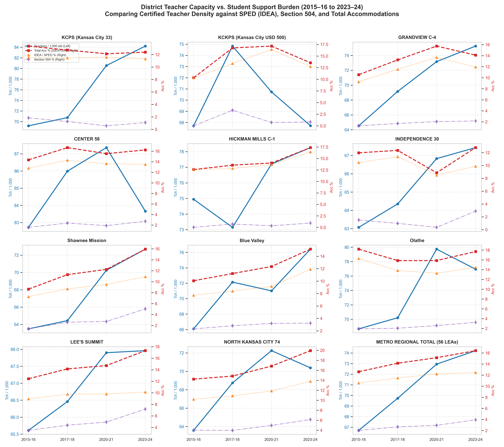
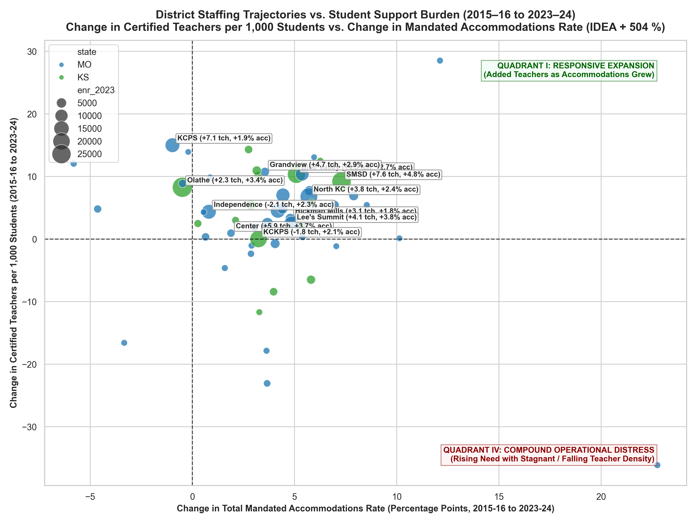

# District-Level Teacher Capacity vs. Student Support Burden Analysis (2015–16 to 2023–24)

## 1. Executive Answers to Core Empirical Questions

This analysis integrates annual Common Core of Data (CCD) certified staffing panels with Civil Rights Data Collection (CRDC) student complexity tables across all four federal survey waves (2015–16, 2017–18, 2020–21, 2023–24) to evaluate **how district teacher capacity moved relative to student need**.

### Direct Answers to Key Questions:

1. **Did KCPS add teachers faster than identified student need grew?**
   - **YES, dramatically.** Between 2015–16 and 2023–24, KCPS expanded certified teacher density by **+15.0 teachers per 1,000 students (+21.7%)**, moving from 69.2 to 84.2 teachers per 1,000. Students per teacher FTE fell from **14.45:1 down to 11.88:1** (-2.57 students/teacher).
   - Concurrently, KCPS's total mandated accommodation rate (IDEA + 504) shifted from 13.36% to 12.39% (-0.97 percentage points, or -7.3%). English Learner enrollment expanded from 25.8% to 31.8% (+5.97 pp).
   - **Finding:** KCPS aggressively expanded certified teacher staffing relative to enrollment (+21.7% teacher density growth), outstripping its special education accommodation rate, making KCPS one of the most heavily staffed urban school systems in the state (under 12 students per teacher FTE).

2. **Did Grandview?**
   - **YES, on ratio; balanced with need.** Grandview expanded teacher density from 64.5 to 75.3 teachers per 1,000 (**+10.7 teachers/1,000**, +16.6%), driving students-per-teacher down from **15.50:1 to 13.29:1** (-2.21).
   - Over the same window, total accommodations rose from 10.55% to 14.10% (+3.55 percentage points), driven by Section 504 growth (surging from 1.28% to 2.16%), while EL students rose to 15.3%.
   - **Finding:** Grandview steadily added certified teachers, maintaining a staffing expansion that kept pace with rising 504 accommodation demands.

3. **Did KCKPS?**
   - **NO. KCKPS is a critical outlier of staff stagnation and erosion amid surging need.**
   - Over the 8-year span, KCKPS's teacher density remained essentially flat at 67.7 teachers per 1,000 students (+0.01 teachers/1,000, +0.0%), and PTR remained unchanged at 14.77:1 (+0.00).
   - Crucially, this net plateau masks a severe post-2017 contraction: after staffing surged to 1,626.50 FTE in 2017-18 (PTR 13.36:1), KCKPS lost 278.15 FTE teachers by 2023-24 (-17.1% teacher contraction), far outstripping enrollment decline.
   - Simultaneously, student support demands surged: total accommodations rose from 10.32% to 13.56% (+3.24 pp), and English Learners represent an astounding **38.4% of total enrollment** (over 7,600 EL students).
   - **Finding:** While regional peers added 10 to 15 teachers per 1,000 students to cope with complexity, KCKPS experienced acute capacity stagnation and erosion, leaving it severely strained under massive EL and SPED loads.

4. **Did suburban districts respond differently?**
   - **YES. Suburban districts executed a massive expansion in teacher density to absorb Section 504 and planning-time demands:**
     - **Shawnee Mission (SMSD):** Added **+9.2 teachers per 1,000 students (+14.5%)**, driving PTR down from 15.75:1 to 13.76:1 (-1.99). This expansion accommodated the shift to 5-of-7 planning time while Section 504 surged from 1.38% to 5.03% (+3.64 pp) and total accommodations reached 15.94%.
     - **Blue Valley:** Added **+10.3 teachers per 1,000 (+15.6%)**, reducing PTR from 15.13:1 to 13.09:1 (-2.04), absorbing a Section 504 surge from 2.32% to 3.24%.
     - **North Kansas City:** Added **+6.8 teachers per 1,000 (+10.7%)**, driving PTR from 15.73:1 to 14.21:1 (-1.52), absorbing accommodations surging from 14.23% to 19.93% (+5.70 pp).
     - **Lee's Summit:** Added **+2.3 teachers per 1,000 (+3.6%)**, driving PTR down from 15.24:1 to 14.71:1 (-0.53), absorbing an accommodations surge from 12.44% to 17.31% (+4.87 pp).

5. **Which districts saw falling students-per-FTE but rising SPED/504 burden?**
   - **Almost the entire region!** Across the balanced metro panel, **48 out of 56 districts (85.7%)** saw students-per-teacher FTE fall (improved headline staffing) while their student accommodation share increased.
   - Center 58: PTR fell from 12.09 to 11.95, while accommodations surged from 14.4% to 16.2%.
   - Hickman Mills: PTR fell from 13.34 to 12.78, while accommodations rose from 12.6% to 17.4%.
   - North Kansas City: PTR fell from 15.73 to 14.21, while accommodations rose from 14.2% to 19.9%.
   - **The Regional Total:** Regional PTR contracted from **14.99:1 to 13.47:1** (-1.52 students/teacher), while total accommodations expanded from **12.61% to 16.42% (+3.80 percentage points)**.

## 2. Benchmark District Trajectory Matrix (2015–16 to 2023–24)

| District | Baseline Enr (2015) | 2023 Enr | Baseline PTR | 2023 PTR | Change in PTR | Teachers / 1k (2015) | Teachers / 1k (2023) | Baseline Acc % | 2023 Acc % | Δ Acc (pp) | 2023 EL % |
| :--- | :---: | :---: | :---: | :---: | :---: | :---: | :---: | :---: | :---: | :---: | :---: |
| **KCPS (Kansas City 33)** | 14,723 | 13,620 | 14.45:1 | 11.88:1 | **-2.57** | 69.2 | 84.2 | 13.4% | 12.4% | **-0.97 pp** | 31.8% |
| **KCKPS (USD 500)** | 21,247 | 19,914 | 14.77:1 | 14.77:1 | **+0.00** | 67.7 | 67.7 | 10.3% | 13.6% | **+3.24 pp** | 38.4% |
| GRANDVIEW C-4 | 4,285 | 3,548 | 15.50:1 | 13.29:1 | **-2.21** | 64.5 | 75.3 | 10.5% | 14.1% | **+3.55 pp** | 15.3% |
| CENTER 58 | 2,502 | 2,336 | 12.09:1 | 11.95:1 | **-0.14** | 82.7 | 83.7 | 14.4% | 16.2% | **+1.89 pp** | 5.5% |
| HICKMAN MILLS C-1 | 5,839 | 4,610 | 13.34:1 | 12.78:1 | **-0.56** | 75.0 | 78.3 | 12.6% | 17.4% | **+4.79 pp** | 11.2% |
| INDEPENDENCE 30 | 14,244 | 13,633 | 15.86:1 | 14.83:1 | **-1.03** | 63.1 | 67.4 | 12.0% | 12.8% | **+0.81 pp** | 9.8% |
| Shawnee Mission | 27,275 | 25,687 | 15.75:1 | 13.76:1 | **-1.99** | 63.5 | 72.7 | 8.6% | 15.9% | **+7.30 pp** | 7.9% |
| Blue Valley | 22,105 | 21,878 | 15.13:1 | 13.09:1 | **-2.04** | 66.1 | 76.4 | 10.1% | 15.1% | **+5.09 pp** | 3.0% |
| Olathe | 28,567 | 27,766 | 14.56:1 | 13.00:1 | **-1.56** | 68.7 | 77.0 | 18.2% | 17.7% | **-0.49 pp** | 9.8% |
| LEE'S SUMMIT | 17,750 | 17,513 | 15.24:1 | 14.71:1 | **-0.53** | 65.6 | 68.0 | 12.4% | 17.3% | **+4.87 pp** | 2.4% |
| NORTH KANSAS CITY 74 | 19,395 | 20,666 | 15.73:1 | 14.21:1 | **-1.52** | 63.6 | 70.4 | 14.2% | 19.9% | **+5.70 pp** | 10.8% |
| **METRO REGIONAL TOTAL** | 324,422 | 320,725 | 14.99:1 | 13.47:1 | **-1.52** | 66.7 | 74.2 | 12.6% | 16.4% | **+3.80 pp** | 9.3% |

## 3. Visual Artifacts

### Figure 16: District-by-District Trajectories (Staffing vs. Need Over Time)

### Figure 17: Quadrant Scatter Plot (Staffing Expansion vs. Need Growth)

