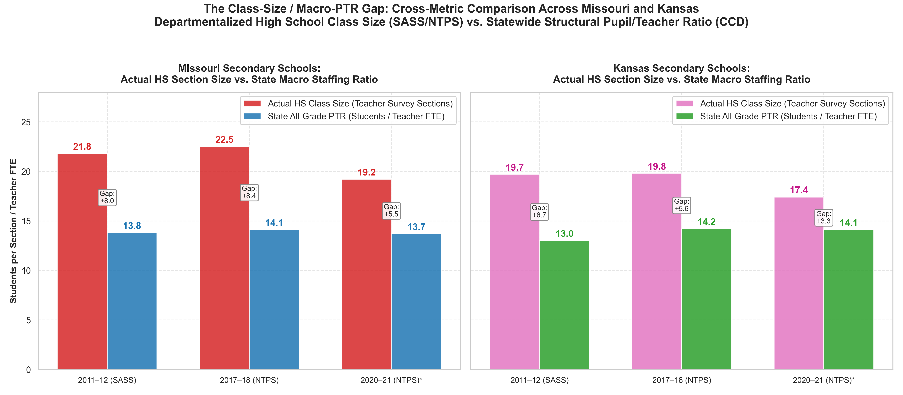

# The Four-Pillar Capacity & Class Size Measurement Framework (Decision 036 Remediated)

## 1. Executive Synthesis: Separating the Four Questions Cleanly

A central finding of this investigation is that pupil/teacher ratio (PTR) is not an invalid number; it is simply the wrong statistic for describing classroom load. When school boards or state agencies announce that a district operates at '12:1 or 13:1 students per teacher,' they are measuring **macro teacher staffing inventory**, not the number of students sitting in front of an instructor.

To resolve this tension without discarding valid public data, the project establishes a **Four-Pillar Architecture** that explicitly maintains two parallel empirical series:

1. **Pillar 1: Structural Staffing Capacity (NCES CCD & State Administrative Registers)**
   - *Question Answered:* **How much teacher FTE does the educational system employ relative to enrollment?**
   - *Metric:* Students per teacher FTE / Teachers per 1,000 students.
   - *Grain:* Annual universal census across all 77 fully regional public LEAs in the KC metropolitan area (2014–15 to 2024–25).
   - *Core Finding:* Macro instructional capacity expanded significantly. Regional teacher FTE grew by **+8.86%** while enrollment fell by **-0.73%**, driving PTR from **14.85:1 down to 13.54:1**.

2. **Pillar 2: Actual Teacher-Reported Class Size (NCES SASS / NTPS Teacher Questionnaires)**
   - *Question Answered:* **What size classes do representative teachers report actually teaching?**
   - *Metric:* Departmentalized secondary teachers log section-by-section student headcounts for every class period taught (up to 10 sections), recording subject and grade level.
   - *Methodology:* Nationally and state-representative two-stage probability sample (~9,900 public schools and ~68,300 teachers in 2020–21; 55% overall weighted response rate). NCES applies survey weights for selection probability and nonresponse.
   - *Core Finding:* Actual departmentalized high school class sizes were **stable through the pre-pandemic decade** (Missouri: 21.8 in 2011–12 to 22.5 in 2017–18; Kansas: 19.7 to 19.8), demonstrating that macro staffing additions did not mechanically shrink high school sections.

3. **Pillar 3: Historic Ground-Truth & Daily Student Load (Jenkins v. Missouri Litigation Records)**
   - *Question Answered:* **What did Kansas City's audited master schedules and total daily assignments look like under judicial scrutiny?**
   - *Metric:* Courtroom master-schedule audits, student-classes, teaching assignments, and daily student contact loads ($R_t = \sum_s n_s$).
   - *Grain:* KCMSD 1985 trial exhibits (K-58, K-59; *Jenkins v. Missouri*, 639 F. Supp. 19; affirmed 890 F.2d 65).
   - *Core Finding:* Forty years ago, federal courts looked beyond PTR, finding teaching assignments and daily loads 'more revealing' (junior high teachers carried **154 students/day** across 5.66 periods and high school teachers carried **149 students/day** across 5.18 periods). Judge Clark established a binding remedial ceiling of **$\le 125$ students per day**.

4. **Pillar 4: Modern Course-Level Empirical Proxies (OCR Civil Rights Data Collection)**
   - *Question Answered:* **Where within modern KC schools do particular courses depart from the averages?**
   - *Metric:* School-by-course average section load proxy ($\bar{s}_c = E_c / S_c$).
   - *Grain:* Biennial federal census waves across KC high schools (2013–14 to 2023–24).
   - *Core Finding:* Across all operating regular high schools in the metro area, course averages are modest (~16.5–18.7: Algebra I 17.2, Geometry 18.7, Biology 16.5). However, **state and metro averages hide localized gateway bottlenecks**: specific urban and large suburban comprehensive campuses report core sections of **25 to 31 students** (Wyandotte Algebra I at 28.5 across 46 sections, Lincoln Prep Geometry/Math at 29.5, Grandview Algebra/Geometry at 26–28, Shawnee Mission East/North at 26–28).

## 2. The Empirical Parallel Series (2011–12 to 2020–21)

| Survey Wave | Jurisdiction | Actual HS Class Size (SASS/NTPS) | State All-Grade PTR (CCD) | Class-Size / Macro-PTR Gap | Period Context |
| :--- | :--- | :---: | :---: | :---: | :--- |
| **2011–12 (SASS)** | United States | **24.2** | 16.0:1 | **+8.2 students** | Clean Pre-Pandemic Baseline |
| | Missouri | **21.8** | 13.8:1 | **+8.0 students** | (SASS Table 7, CCD Table 2) |
| | Kansas | **19.7** | 13.0:1 | **+6.7 students** | (SASS Table 7, CCD Table 2) |
| **2017–18 (NTPS)** | United States | **23.3** | 15.9:1 | **+7.4 students** | Pre-Pandemic Staffing Expansion |
| | Missouri | **22.5** | 14.1:1 | **+8.4 students** | (NTPS Table A-7a) |
| | Kansas | **19.8** | 14.2:1 | **+5.6 students** | (NTPS Table A-7a) |
| **2020–21 (NTPS)\*** | United States | **21.0** | 15.4:1 | **+5.6 students** | Pandemic Year (NCES Category Revisions) |
| | Missouri | **19.2** | 13.7:1 | **+5.5 students** | (Table ntps2021_sflt07_t1s) |
| | Kansas | **17.4** | 14.1:1 | **+3.3 students** | (Table ntps2021_sflt07_t1s) |

*Note: NCES explicitly warns that school-level categories changed in 2020–21 relative to earlier administrations, and pandemic remote/hybrid schedules perturbed student enrollments per period. The 2011–12 to 2017–18 comparison represents the clean, unperturbed pre-pandemic baseline.

## 3. The Core Analytical Insights

1. **Distinct Statistics Rather than Divergence:** Between 2011–12 and 2017–18, teacher-reported high-school class sizes remained essentially unchanged in Missouri (21.8 to 22.5) and Kansas (19.7 to 19.8). Statewide all-grade PTRs also showed little improvement (MO 13.8 to 14.1; KS 13.0 to 14.2), reinforcing that these are distinct measures rather than demonstrating a staffing/class-size divergence during this particular window. The material expansion in teacher staffing density occurred in the KC metro panel over the 2014–15 to 2024–25 decade.

2. **Cross-Metric Distinction (Class Size vs. Macro PTR):** High-school departmentalized class sizes consistently exceed all-grade state PTRs by **5 to 8 students**. This gap reflects structural organizational filters: secondary bell-schedule planning multipliers ($\phi = P_{\text{std}} / P_{\text{tch}}$, e.g. 5-of-7 planning periods requiring +20% FTE just to maintain class sizes) and specialized non-classroom roles (SPED, ELL, reading interventionists).

3. **Localized Bottlenecks vs. Regional Means:** While regional average high school course proxies sit around 16.5–18.7, high-volume gateway subjects in non-selective urban and comprehensive suburban campuses regularly experience acute localized crowding (26–31 students per class), creating intense localized workload pressure that building-wide and state-wide averages conceal.

## 4. Visual Artifact

### Figure 18: The Class-Size / Macro-PTR Gap Over Time

