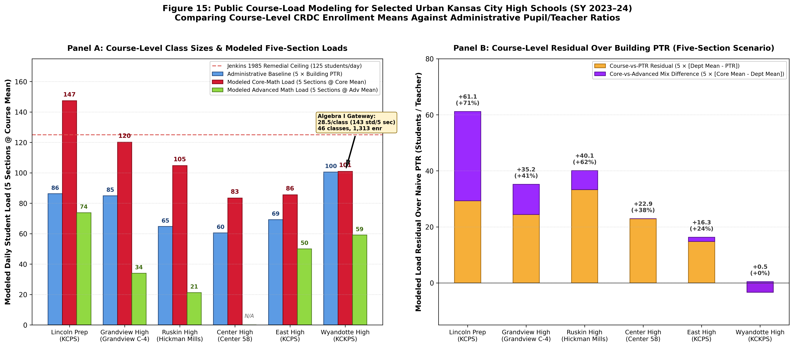

# Task 006.1: Public Course-Load Scenarios & Gateway Bottlenecks

## 1. Epistemic Framing & The Five-Step Reconstruction Ladder

This pilot investigates the extent to which public data can recover secondary instructional workload without student microdata, while respecting the strict epistemic boundary between observed course aggregates and unobserved individual teacher rosters:

```
                          THE FIVE-STEP RECONSTRUCTION LADDER
========================================================================================
[1. OBSERVED]            School-course enrollment and class counts (CRDC: E_c, S_c)
                         --> Objective public empirical fact from federal collection.
----------------------------------------------------------------------------------------
[2. DERIVED]             Course-average class load (s_bar_c = E_c / S_c)
                         --> Exact mathematical average per reported course section.
----------------------------------------------------------------------------------------
[3. MODELED SCENARIOS]   Schedule scenario loads (R_5 = 5 * s_bar_c; R_6 = 6 * s_bar_c)
                         --> Modeled seat burden for a teacher assigned D sections of course c.
----------------------------------------------------------------------------------------
[4. DEPARTMENT LOAD]     Enrollment per teacher (E_math / T_math)
                         --> Average covered student-course enrollments per subject teacher.
----------------------------------------------------------------------------------------
[5. STILL UNOBSERVED]    Individual teacher roster distribution (P(R > 140), section variance)
                         --> Requires student-level SIS microdata or section schedule tables.
========================================================================================
```

## 2. Core Empirical Findings: Selected Urban High School Pilot (SY 2023–24)

Public CRDC data demonstrates that building-level pupil/teacher ratio (PTR) **can materially understate the load represented by particular courses**. However, the phenomenon is **not universal across all schools or all courses**, and depends heavily on gateway course concentration and course-mix differences:

### Table 1: Course-Level Averages and Modeled Scenario Loads

| School Campus | District | Building PTR | Alg I Mean | Geom Mean | Alg 2 Mean | Core Math Mean | Adv Math Mean | Modeled R5 (5 × Core) | Modeled R6 (6 × Core) | Naive R5 (5 × PTR) | R5 Residual (Δtotal) |
| :--- | :--- | :---: | :---: | :---: | :---: | :---: | :---: | :---: | :---: | :---: | :---: |
| LINCOLN COLLEGE PREP. | KANSAS CITY 33 | 17.25:1 | 26.3 | 31.0 | 30.6 | 29.5 | 14.8 | 147.4 | 176.9 | 86.2 | **+61.1** |
| GRANDVIEW SR. HIGH | GRANDVIEW C-4 | 16.99:1 | 25.8 | 25.9 | 15.3 | 24.0 | 6.8 | 120.1 | 144.2 | 84.9 | **+35.2** |
| RUSKIN HIGH SCHOOL | HICKMAN MILLS C-1 | 12.94:1 | 20.2 | 21.8 | 21.1 | 21.0 | 4.2 | 104.8 | 125.7 | 64.7 | **+40.1** |
| CENTER SR. HIGH | CENTER 58 | 12.10:1 | 19.0 | 17.0 | 13.0 | 16.7 | N/A | 83.4 | 100.1 | 60.5 | **+22.9** |
| EAST HIGH SCHOOL | KANSAS CITY 33 | 13.85:1 | 16.3 | 16.7 | 18.9 | 17.1 | 10.0 | 85.5 | 102.7 | 69.2 | **+16.3** |
| Wyandotte High | Kansas City | 20.10:1 | 28.5 | 14.3 | 14.1 | 20.2 | 11.8 | 101.0 | 121.1 | 100.5 | **+0.5** |


## 3. Detailed Campus Analyses

1. **Lincoln College Preparatory Academy (KCPS):**
   - Building PTR is 17.25:1, which naively suggests a modest 5-period load of 86.3 students.
   - However, reported core math classes average **29.5 students** (Geometry at 31.0, Algebra II at 30.6). A teacher assigned five such sections would carry a modeled load of **147.4 students/day**—surpassing the 1985 Jenkins remedial ceiling (125 students).
   - The **+61.1 student residual** over naive PTR reflects two distinct public factors: a course-vs-PTR residual of +29.3 students (department mean of 23.1 vs. PTR 17.25) and a core-vs-advanced mix difference of +31.8 students (core mean 29.5 vs. advanced mean 14.8).

2. **Grandview Senior High (Grandview C-4):**
   - Building PTR is 16.99:1 (85.0 naive 5-section load).
   - Core Algebra I (25.8) and Geometry (25.9) produce a core mean of 24.0 students, corresponding to a modeled 5-section load of **120.1 students** (+35.2 student residual). Under a 6-section assignment, this load reaches **144.2 students**.
   - Advanced Math averages 6.8 students and Calculus averages 3.0 students, generating a course-mix difference of +10.8 students.

3. **Ruskin High School (Hickman Mills C-1):**
   - Building PTR is 12.94:1 (64.7 naive 5-section load).
   - Core math sections average 21.0 students (Geometry 21.8, Algebra II 21.1, Algebra I 20.2), corresponding to a modeled 5-section load of **104.8 students** (+40.1 student residual) and a 6-section load of **125.7 students**.
   - Advanced math averages 4.25 students (Calculus 8.0, Advanced Math 3.0).

4. **Center Senior High (Center 58):**
   - Building PTR is 12.10:1 (60.5 naive load).
   - Core math sections average 16.7 students (Algebra I at 19.0), corresponding to a modeled 5-section load of **83.4 students** (+22.9 student residual). Because Center reported zero advanced mathematics sections in CRDC 2023–24, 100% of this residual is between the department average and building PTR.

5. **East High School (KCPS):**
   - Building PTR is 13.85:1 (69.3 naive load).
   - Core math sections average 17.1 students (Algebra I 19.0, Algebra II 18.9, Geometry 12.3), corresponding to a modeled 5-section load of **85.5 students** (+16.3 student residual).

6. **Wyandotte High School (Kansas City USD 500) — The Gateway Bottleneck Counterexample:**
   - Building PTR is 20.10:1.
   - Aggregate core math averages **20.19 students**, yielding virtually **zero aggregate wedge (+0.09)** over building PTR. This demonstrates that core load wedges are not an automatic institutional artifact.
   - However, course-level disaggregation reveals an acute **gateway bottleneck in Algebra I**: **46 classes enrolling 1,313 students (average 28.54 students/class)**.
   - Under Wyandotte's public 8-period Red/White alternating-block schedule (where full-time teachers typically instruct 6 blocks across the two-day cycle), an Algebra I instructor carrying 6 sections would manage a modeled active grading roster of **171.2 students** (+50.6 students above naive 6-period PTR). Even under 5 sections, the load is **142.7 students**.
   - In contrast, subsequent courses see substantial drop-offs (Geometry averages 14.3; Algebra II averages 14.1).

## 4. Methodological Clarifications & Guardrails

1. **Graduation Requirements vs. Funneling:** Missouri requires 3 mathematics and 3 science credits with End-of-Course (EOC) exams in Algebra I and Biology (Geometry is optional). Kansas requires 3 math units and 3 science units incorporating algebraic and geometric concepts. These courses are broadly enrolled foundation and gateway courses, but state law does not mandate a universal 9th/10th grade sequence.
2. **Staffing Denominator Definitions:** The Common Core of Data (CCD) pupil/teacher ratio divides enrollment by full-time equivalent classroom teachers. Guidance counselors are reported under a separate non-instructional staffing category and do not depress the teacher denominator. Specialized instructional staff (e.g. special education resource teachers or Title I reading teachers coded as classroom teachers) do contribute to the denominator gap.
3. **The Limits of Public Data:** Public CRDC records allow researchers to establish that core course sections frequently exceed building PTR, and that gateway courses can absorb massive enrollments. However, public aggregates cannot reveal the joint distribution of individual teacher rosters, section-level variance, or true teacher-level tail probabilities. Those measures remain behind the public data transparency boundary.

## 5. Visual Artifact


