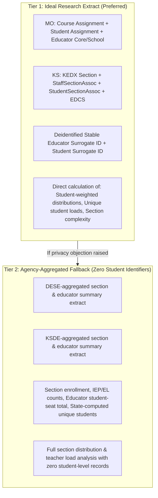

# Phase 4A: State Data Request Specifications
**Course Section, Educator Assignment & Class Size Microdata**  
**Kansas City Metropolitan Education Capacity Study**  
**Date:** September 24, 2026  
**Status:** Revised Specifications Ready for Agency Submission  
**Target Agencies:**
1. **Missouri Department of Elementary and Secondary Education (MO DESE)** — Office of Data System Management
2. **Kansas State Department of Education (KSDE)** — Data & Information Systems / Educator Data Collection (KEDX & EDCS)

---

## 1. Research Background & Purpose

The Kansas City Metropolitan Education Capacity Study has documented a decade-long structural pattern across the 9-county metropolitan area (2014–15 through 2024–25):
- **K–12 Enrollment** remained essentially flat ($-0.73\%$, $321,228 \rightarrow 318,883$).
- **Reported Teacher FTE** expanded substantially ($+8.88\%$, $21,633 \rightarrow 23,555$ FTE across fully regional LEAs).
- **Macro Pupil/Teacher Ratios** dropped from $14.85 \rightarrow 13.54$.
- **Classroom Teachers** expanded by $+6.24\%$ across Kansas USDs (and $+8.70\%$ in Johnson County suburbs).
- **Yet classroom teachers and school communities report that core secondary classroom section sizes remain large (frequently 25–30+ students in secondary academic courses).**

To resolve this empirical paradox, aggregate district-level ratios have reached the limits of what they can reveal. The research frontier requires observing the actual **course section schedule**:
1. **True Student-Weighted Class Size Distributions:** Measuring the section size experienced by the median student ($50\text{th}$, $75\text{th}$, $90\text{th}$ percentiles) vs. unweighted section averages.
2. **Core Academic vs. Elective Allocation:** Isolating core academic subjects (Mathematics, English Language Arts, Science, Social Studies) from elective, remedial, advanced, and specialized sections.
3. **Teacher Workload & Scheduling:** Measuring both **Teacher Student-Seat Load** (total student seats instructed across all periods) and **Unique Student Roster Load** (unduplicated students taught).
4. **Co-Teaching & Staffing Models:** Identifying co-taught classrooms where two certified adults share a single roster.
5. **Classroom Complexity Overlays:** Evaluating the section-level concentration of students with Individualized Education Programs (IEPs) and English Learners (ELs).

---

## 2. Two-Tier Privacy-Safe Request Architecture

To ensure feasibility and respect agency administrative/privacy constraints, this request is structured in **two alternative tiers**:

- **Tier 1 (Ideal Research Extract — Preferred):** Deidentified, stable educator surrogate IDs and student surrogate IDs generated by the agency. Contains zero PII (no names, no DOB, no local IDs, no addresses). Enables exact calculation of unique student roster loads, student-weighted distributions, and multi-period scheduling patterns.
- **Tier 2 (Agency-Aggregated Fallback — Lower Privacy Burden):** If an agency cannot release student-level surrogate IDs, the agency aggregates section totals and computes the educator-level unduplicated student count prior to export. This provides 100% of the data needed for class-size distributions and teacher workload while entirely eliminating student-level records.

---

## 3. Missouri Request Specification (MO DESE)

### 3.1 Primary Target Collections & Linkages
Missouri collects separate October Core Data / MOSIS files that must be linked:
1. **Course Assignment (MOSIS Screen 20):** Establishes the course, section, and certified educator link.
2. **Student Assignment (MOSIS):** Links rostered students to the section instance (essential for roster counts).
3. **Educator Core & Educator School (MOSIS Screen 18):** Provides duty codes (001–099), assignment percentages, and full-time equivalency.

### 3.2 Geographic & Temporal Scope
- **Geographic Scope:** All public school districts and public charter LEAs in the five Missouri metropolitan counties: **Jackson, Clay, Platte, Cass, and Ray**.
- **School Years Requested:** 
  - Priority Anchor Years: **2014–15**, **2019–20**, and **2024–25**.
  - Preferred (if automated within standard extraction scripts): Continuous annual panel (2014–15 through 2024–25).

### 3.3 Requested Data Elements

#### Tier 1: Section-by-Educator & Student Extract
- `school_year`
- `district_code` & `district_name`
- `school_code` & `school_name`
- `course_code` (6-digit standard MOSIS) & `course_title`
- `subject_area` (ELA, Mathematics, Science, Social Studies, etc.)
- `section_id` (Unique section identifier)
- `period_number` / `term_code` (Fall, Spring, Full Year)
- `educator_surrogate_id` (Randomized/hashed stable ID across sections)
- `duty_code` (Screen 18 duty code, e.g., 001–099)
- `teacher_fte_assigned` (FTE allocated to section)
- `co_teacher_flag` (Indicator if multiple certified teachers assigned)
- `student_surrogate_id` (Randomized/hashed stable student ID; Tier 1 only)
- `student_grade_level`
- `student_iep_status` (Y/N)
- `student_ell_status` (Y/N)
- `delivery_mode` (Traditional in-person, blended, virtual)

#### Tier 2 Fallback: Agency-Aggregated Section & Teacher Summary
If Tier 1 student surrogate IDs cannot be released, DESE aggregates at the section and educator level:
- Section-level: `section_enrollment` (rostered headcount), `section_iep_count`, `section_ell_count`, `delivery_mode`.
- Educator-level: `educator_surrogate_id`, `assigned_sections_count`, `teacher_student_seat_load` (sum of seats across sections), `unique_students_per_educator_school_year` (state-computed unduplicated count).

---

## 4. Kansas Request Specification (KSDE)

### 4.1 Primary Target Collections & Architecture Hierarchy
While KSDE's Educator Data Collection System (EDCS) contains valuable educator assignment and course categories, Kansas's **KEDX / Ed-Fi** reporting architecture represents the actual instructional roster structure:
$$\text{Course} \rightarrow \text{CourseOffering} \rightarrow \text{Section} \rightarrow \text{StaffSectionAssociation} + \text{StudentSectionAssociation}$$

We request:
1. **Primary Collection (Roster & Section Structure):** KEDX / Ed-Fi `Section`, `StaffSectionAssociation`, and `StudentSectionAssociation`.
2. **Supplemental Linked Source (Educator Assignment & Licensure):** EDCS / Licensed Personnel Report (LPR) for educator type, assignment codes, FTE percentage, and co-teacher indicators.

### 4.2 Geographic & Temporal Scope
- **Geographic Scope:** All 19 Unified School Districts located in the four Kansas metropolitan counties: **Johnson, Wyandotte, Leavenworth, and Miami**.
- **School Years Requested:** 
  - Priority Anchor Years: **2014–15**, **2019–20**, and **2024–25**.
  - Preferred: Continuous annual panel (2014–15 through 2024–25).

### 4.3 Requested Data Elements

#### Tier 1: Section, Staff, and Student Extract
- `school_year`
- `usd_number` & `district_name`
- `building_number` & `building_name`
- `course_code` (5-digit KCCMS) & `course_title`
- `subject_cluster` (State academic cluster)
- `section_identifier` (KEDX unique section ID)
- `term_descriptor` / `period_descriptor`
- `staff_surrogate_id` (Randomized/hashed stable educator ID)
- `assignment_code` (EDCS assignment classification)
- `assigned_fte` (FTE dedicated to this class instance)
- `classroom_position_type` (Lead Teacher, Co-Teacher, Support Specialist)
- `student_surrogate_id` (Randomized/hashed stable student ID; Tier 1 only)
- `student_grade_level`
- `special_education_status` (Active IEP Y/N)
- `english_learner_status` (EL Y/N)
- `virtual_status` (Traditional in-person, blended, virtual)

#### Tier 2 Fallback: Agency-Aggregated Section & Teacher Summary
If Tier 1 student surrogate IDs cannot be released, KSDE aggregates at the section and educator level:
- Section-level: `section_enrollment` (rostered headcount), `section_iep_count`, `section_ell_count`, `virtual_status`.
- Educator-level: `staff_surrogate_id`, `assigned_sections_count`, `teacher_student_seat_load` (sum of seats across sections), `unique_students_per_educator_school_year` (state-computed unduplicated count).

---

## 5. Methodological Definitions & Workload Metrics

To ensure exact alignment between researchers and state agency analysts:

1. **Section Size ($S_i$):** Total rostered headcount of students receiving direct instruction in section $i$ at the official Fall snapshot date.
2. **Student-Weighted Class Size:**
   $$ \bar{S}_{weighted} = \frac{\sum_{i} S_i \times S_i}{\sum_{i} S_i} = \frac{\sum_i S_i^2}{\sum_i S_i} $$
   Measures the average class size experienced by a student, contrasting with unweighted section averages that treat a 5-student seminar equally with a 32-student lecture.
3. **Teacher Student-Seat Load:** Total rostered seats instructed by teacher $j$ across all assigned sections:
   $$ \text{SeatLoad}_j = \sum_{k \in \text{Sections}_j} S_k $$
4. **Unique Student Roster Load:** Unduplicated count of distinct individual students taught by teacher $j$ across the school year:
   $$ \text{UniqueLoad}_j = |\bigcup_{k \in \text{Sections}_j} \text{Students}_k| $$
5. **The Allocation Wedge (H1c):**
   $$ \text{Allocation Wedge} = \text{Median Core Academic Section Size} - \text{Reported Pupil/Teacher Ratio} $$
   Quantifies the empirical gap between structural administrative metrics and the actual student classroom experience.

---

## 6. Privacy, FERPA Compliance & Security Governance

1. **Strictly Non-Identifiable:** No student names, social security numbers, state student IDs, dates of birth, or home addresses will be accepted. All student linkages utilize one-way salted hashes generated by the state agency prior to transmission.
2. **Educator Anonymity:** Educator IDs are similarly hashed, allowing sections taught by the same teacher to be grouped for daily load calculations without identifying the individual teacher.
3. **Small-Cell Handling:** Where public reporting requires small-cell masking ($1 \le n < 5$), research datasets will adhere to state agency confidentiality agreements, with cell masking applied to any public-facing study publications.
4. **Data Destruction & Security:** Data will reside in an encrypted, password-protected repository accessible only to approved study researchers and will be retained solely for the duration of the peer-reviewed study.
