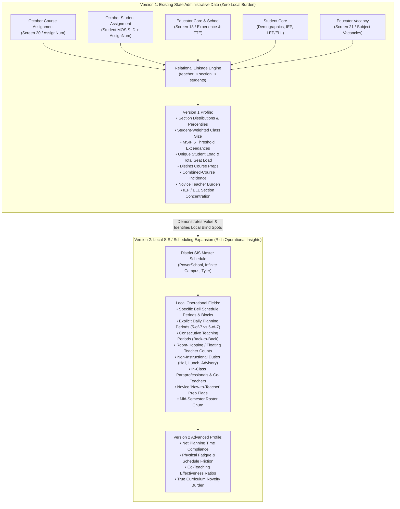

# School Conditions Profile: Metric Specification & Data Implementation Guide
**A Relational Architecture for Measuring Classroom Reality and Teacher Workload**  
**Focus Jurisdiction:** Missouri Public School Districts (MOSIS / Core Data & Local SIS)  
**Collaborative Partner:** PREP-KC Inter-District Research & Operational Pilot  
**Date:** September 25, 2026  
**Document Version:** 1.0 (Formal Specification)  

---

## Executive Summary & Guiding Philosophy

### 1. The Core Policy Premise
For decades, public discourse around school staffing and working conditions has been distorted by a single administrative metric: the **Pupil/Teacher Ratio (PTR)**. 

As defined by the National Center for Education Statistics (NCES), PTR is simply total district student enrollment divided by total certified teacher Full-Time Equivalency (FTE). NCES explicitly cautions that PTR *"does not represent class size."* Staffing arrangements, special education caseloads, reading interventionists, instructional coaches, and secondary planning periods all populate the denominator without revealing how many students sit in an Algebra I classroom at 10:00 a.m., or how many distinct courses a novice educator must prepare each night.

This specification does not argue that PTR is invalid; PTR answers a legitimate macro-fiscal question:
> *“How much instructional labor capacity does this school system purchase relative to its total student enrollment?”*

What it cannot answer are the two questions fundamental to classroom operations, educator retention, and student learning:
1. **The Student Experience:** *“When a student walks into their academic classes each day, what size peer group and instructional environment do they actually experience?”*
2. **The Teacher Load:** *“What total instructional, curricular, grading, relational, and accommodation load does a classroom teacher carry each week?”*

### 2. Regulatory Alignment with Missouri MSIP 6
Missouri already explicitly recognizes in state policy that actual class size and educator planning conditions matter. Under the **Missouri School Improvement Program (MSIP 6)** standard for *Class Size and Assigned Enrollments*, DESE establishes:
- **Recommended Class Size Targets:**
  - Kindergarten – Grade 2: **$\le 17$ students**
  - Grades 3 – 4: **$\le 20$ students**
  - Grades 5 – 6: **$\le 22$ students**
  - Grades 7 – 12: **$\le 25$ students**
- **Upper Regulatory Minimum Standards (Maximum Ceilings):**
  - Grades K – 2: **25 students**
  - Grades 3 – 4: **27 students**
  - Grades 5 – 6: **30 students**
  - Grades 7 – 12: **33 students**
- **Planning Time Guarantee:** A minimum of **250 minutes of scheduled planning time per week** for full-time instructional staff.
- **Assignment Guardrails:** Specific regulatory constraints governing combined courses (multi-grade/multi-subject classrooms) and specialist caseloads.

**The central paradox in Missouri is that the state already collects the relational microdata required to calculate these exact conditions, but currently summarizes them into flat aggregate ratios that conceal operational realities.**

### 3. Avoiding Goodhart's Law: Profile, Not an Accountability Score
On September 15, 2026, the Missouri State Board of Education approved a new **A–F School and District Grading Framework** focused on student academic achievement, growth, and postsecondary readiness. 

This project deliberately avoids campaigning to insert class size or teacher load into the A–F formula. Transforming instructional conditions into a high-stakes composite accountability index (e.g., an "Instructional Conditions Score: 78/100") immediately activates Goodhart’s Law: schools would be incentivized to manipulate course coding, reclassify rosters, or artificially cap certain classes to hit an arbitrary composite target.

Instead, this specification establishes an independent, descriptive **School Conditions Profile** that exists alongside the academic outcome reports:
- **School Outcome Report:** *What happened?* (Academic achievement, growth, graduation, readiness).
- **School Conditions Profile:** *Under what conditions did students and teachers operate?* (Class size distributions, teacher student-seat loads, prep complexity, student need concentration, and staffing stability).

A school with depressed academic outcomes operating with 34-student classes, four preps per novice teacher, and severe departmental vacancies requires an entirely different operational intervention than a school producing similar outcomes with 18-student classes, veteran staff, and robust planning periods.

---

## Two-Tier Data Architecture: Version 1 (State MOSIS) vs. Version 2 (Local SIS)

To ensure immediate operational viability, the metric specification is divided into two chronological implementation tiers:



---

## Data Dictionary & Relational Linkage Model

### 1. Version 1: Missouri DESE Core Data / MOSIS Sources
The Version 1 pipeline requires zero new reporting from school districts. It leverages five standardized data collections submitted annually during the DESE October Cycle:

#### A. October Course Assignment File (`FileSpec_202710OctoberCycleCourseAssignment`)
*Defines the teaching assignment, schedule intensity, and course identity.*
| Field Name | Item # | Data Type | Description & Analytical Function |
| :--- | :---: | :---: | :--- |
| `CurrentSchoolYear` | 010 | Integer(4) | Academic year ending year (e.g., 2027 for 2026–27). |
| `ReportingDistrictCode` | 025 | Text(6) | DESE 6-digit county-district code. |
| `ReportingSchoolCode` | 030 | Text(4) | DESE 4-digit school campus code. |
| `EDSSN` | 050 | Text(9) | Educator Social Security Number (Hashed to `educator_id`). |
| `PosCode` | 070 | Text(2) | Staff position code (e.g., 60 = Regular Teacher, 61 = SPED). |
| `AssignNum` | 090 | Text(20) | **Primary Join Key:** Unique identifier of the course section instance. |
| `LocCourseNum` | 100 | Text(12) | Local district course number. |
| `LocCourseName` | 110 | Text(60) | Local descriptive course title. |
| `LocSecNum` | 120 | Text(6) | Local section number (period/section tag). |
| `CourseNum` | 130 | Text(6) | DESE standard 6-digit course code (e.g., 020100 = Algebra I). |
| `CourseGradeLevel` | 180 | Text(2) | Curricular grade level target (K–12). |
| `CourseSem` | 190 | Text(1) | Semester code (0 = Full Year, 1 = Sem 1, 2 = Sem 2). |
| `CourseDeliverySys` | 200 | Text(2) | Delivery system (01 = Traditional, 02 = Virtual, etc.). |
| `CourseMins` | 220 | Integer(4) | Weekly instructional contact minutes (excluding passing). |
| `Caseload` | 235 | Integer(4) | Non-classroom caseload count (e.g., SPED case manager). |
| `CombinedCourse` | 245 | Integer(2) | Combined class flag (multi-grade or multi-subject simultaneously). |
| `VirtualInstruction` | 250 | Text(6) | Virtual / MOCAP delivery indicator. |

#### B. October Student Assignment File (`FileSpec_202710OctoberCycleStudentAssignment`)
*Connects individual enrolled students to specific course assignment numbers.*
| Field Name | Item # | Data Type | Description & Analytical Function |
| :--- | :---: | :---: | :--- |
| `ReportingDistrictCode` | 025 | Text(6) | District code. |
| `ReportingSchoolCode` | 030 | Text(4) | School code. |
| `StateID` | 045 | Text(10) | **Primary Student Key:** MOSIS 10-digit unique student ID (Hashed to `student_id`). |
| `AssignNum` | 110 | Text(20) | **Primary Join Key:** Matches `AssignNum` in Course Assignment. |
| `EDSSN` | 150 | Text(9) | Educator SSN (Hashed; secondary join validation). |
| `Disadvantaged` | 180 | Text(1) | Free/Reduced Lunch or Pell eligibility indicator (Y/N). |
| `IEPDisability` | 270 | Text(2) | Primary Special Education disability code (Non-blank = Active IEP). |
| `StudentGradeLevel` | 095 | Text(3) | Student's current enrolled grade level. |

#### C. MOSIS Educator Core & Educator School (Screen 18)
*Establishes teacher credentials, professional longevity, and assignment full-time equivalency.*
| Field Name | Data Type | Description & Analytical Function |
| :--- | :---: | :--- |
| `EDSSN` | Text(9) | Educator SSN (Hashed to `educator_id`). |
| `TotExpMO` | Numeric(4,1) | Total years of certified educational experience in Missouri. |
| `TotExpDistrict` | Numeric(4,1) | Total years of certified experience in the reporting district. |
| `PosCode` | Text(2) | Primary educator position code. |
| `AssignmentFTE` | Numeric(4,2) | Assigned Full-Time Equivalency at the school campus. |
| `Salary` | Numeric(8,2) | Base contracted salary (for fiscal/equity contextualization). |

#### D. MOSIS Student Core (October Cycle)
*Provides supplemental demographic and specialized program status.*
| Field Name | Data Type | Description & Analytical Function |
| :--- | :---: | :--- |
| `StateID` | Text(10) | Student MOSIS ID (Hashed to `student_id`). |
| `LEP` | Text(1) | Limited English Proficiency / English Learner indicator (Y/N). |
| `RaceEthnicity` | Text(1) | Federal race/ethnicity classification code. |
| `Gender` | Text(1) | Student gender. |

#### E. Core Data Screen 21 (Educator Vacancy Collection)
*Provides school- and department-level staffing pressure indicators.*
| Field Name | Data Type | Description & Analytical Function |
| :--- | :---: | :--- |
| `PositionCode` | Text(6) | Subject/position category (e.g., Secondary Math, Science, SPED). |
| `InitialVacantFTE` | Numeric(4,2) | Certified FTE open at the opening of the school year. |
| `TotalApplicants` | Integer(4) | Total number of applicants for the vacancy. |
| `CertApplicants` | Integer(4) | Number of appropriately certified applicants for the vacancy. |
| `FilledBySubstitute` | Text(1) | Position filled by a long-term substitute (Y/N). |
| `FilledByRetired` | Text(1) | Position filled by a retired educator (Y/N). |

---

## Metric Specification & Mathematical Formulations

```
                        RELATIONAL SCHEMA ARCHITECTURE
┌─────────────────────────┐             ┌─────────────────────────┐
│  Course Assignment      │             │  Student Assignment     │
│  (Screen 20)            │             │  (MOSIS)                │
├─────────────────────────┤             ├─────────────────────────┤
│ AssignNum (PK)          │◄───1:N─────►│ AssignNum (FK)          │
│ EDSSN ────────────────┐ │             │ StateID ──────────────┐ │
│ CourseNum             │ │             │ IEPDisability         │ │
│ CourseMins            │ │             │ Disadvantaged         │ │
│ CombinedCourse        │ │             └───────────────────────┘ │
└───────────────────────┼─┘                                       │
                        │                                         │
┌───────────────────────▼─┐             ┌─────────────────────────▼┐
│  Educator Core/School   │             │  Student Core            │
│  (Screen 18)            │             │  (Demographics)          │
├─────────────────────────┤             ├─────────────────────────┤
│ EDSSN (PK)              │             │ StateID (PK)             │
│ TotExpMO                │             │ LEP / English Learner   │
│ AssignmentFTE           │             │ Race/Ethnicity          │
└─────────────────────────┘             └─────────────────────────┘
```

### Pillar 1: Classroom Section-Size Distributions

Let $\mathcal{S}$ denote the set of all active, credit-bearing, non-virtual instructional sections in a school, indexed by $i \in \{1, 2, \dots, N\}$.  
Let $\mathcal{J}_i$ denote the set of students enrolled in section $i$.  
The raw section enrollment is:
$$s_i = |\mathcal{J}_i| = \sum_{j \in \mathcal{J}_i} 1$$

#### 1.1 Unweighted Median Section Size ($M_s$)
The median of the ordered section list $\{s_{(1)}, s_{(2)}, \dots, s_{(N)}\}$:
$$M_s = \text{Median}(\{s_i\}_{i=1}^N)$$
*Operational Meaning:* Represents what a typical classroom looks like from the perspective of an administrator walking the halls.

#### 1.2 Student-Weighted Mean Class Size ($\bar{s}_w$)
Unlike the unweighted mean ($\bar{s} = \frac{1}{N}\sum s_i$), the student-weighted mean weights each section by the number of students sitting within it:
$$\bar{s}_w = \frac{\sum_{i=1}^N s_i \cdot s_i}{\sum_{i=1}^N s_i} = \frac{\sum_{i=1}^N s_i^2}{\sum_{i=1}^N s_i}$$
*Mathematical Guardrail:* By Cauchy-Schwarz, $\bar{s}_w \ge \bar{s}$, with equality if and only if all sections are identical in size. The difference $\bar{s}_w - \bar{s} = \frac{\sigma_s^2}{\bar{s}}$ directly quantifies the variance of section sizes across the building.  
*Operational Meaning:* Represents the average class size experienced by a student. A school with five classes of 10 and one class of 50 has an unweighted mean of $16.7$, but a student-weighted mean of $38.0$.

#### 1.3 Student-Weighted Median Class Size ($M_{s,w}$)
Let array $\mathcal{A}$ contain each section size $s_i$ repeated $s_i$ times (length $|\mathcal{A}| = \sum s_i$).
$$M_{s,w} = \text{Median}(\mathcal{A})$$
*Operational Meaning:* The class size experienced by the 50th percentile student. Exactly half of student course seats are in classes larger than this number.

#### 1.4 Distributional Percentiles ($P_{25}, P_{75}, P_{90}$)
The 25th, 75th, and 90th percentiles of section enrollment $\{s_i\}$.
- **Interquartile Range ($IQR = P_{75} - P_{25}$):** Measures internal schedule inequality.
- **90th Percentile ($P_{90}$):** Exposes the tail of extreme crowding.

#### 1.5 MSIP 6 Threshold Exposure Rates
Measures the proportion of student course-seats subjected to class sizes above state standards:
$$\text{Exposure}_{>25} = \frac{\sum_{i: s_i > 25} s_i}{\sum_{i=1}^N s_i} \times 100\% \quad (\text{MSIP 6 7–12 Recommended Target})$$
$$\text{Exposure}_{>30} = \frac{\sum_{i: s_i > 30} s_i}{\sum_{i=1}^N s_i} \times 100\% \quad (\text{Severe Crowding})$$
$$\text{Exposure}_{>33} = \frac{\sum_{i: s_i > 33} s_i}{\sum_{i=1}^N s_i} \times 100\% \quad (\text{MSIP 6 7–12 Maximum Allowable Standard})$$

#### 1.6 Grade-Span MSIP 6 Exceedance Rate
For elementary and middle schools, section sizes are evaluated against grade-specific recommended caps:
$$\text{Exceedance}_{\text{MSIP6}} = \frac{|\{i \in \mathcal{S} : s_i > \text{Cap}(g_i)\}|}{|\mathcal{S}|} \times 100\%$$
Where $\text{Cap}(g_i) = 17$ for $g \le 2$; $20$ for $g \in \{3,4\}$; $22$ for $g \in \{5,6\}$; $25$ for $g \ge 7$.

---

### Pillar 2: Teacher Workload, Curriculum Complexity & Planning

Let $\mathcal{S}_t \subseteq \mathcal{S}$ denote the set of course sections assigned to educator $t$.

#### 2.1 Total Student-Seat Load ($L_t^{\text{seat}}$)
The total daily/weekly student contact seat count carried across all teaching periods:
$$L_t^{\text{seat}} = \sum_{i \in \mathcal{S}_t} s_i$$
*Operational Meaning:* Replicates the judicial ground-truth contact load audited in *Jenkins v. Missouri* ($R_t = \sum n_s$, historically 149–154 in KCMSD; court-ordered remedial ceiling of $\le 125$). Measures the total volume of daily classroom interactions and feedback events.

#### 2.2 Unique Student Roster Load ($L_t^{\text{unique}}$)
The unduplicated headcount of individual human beings instructed by educator $t$:
$$L_t^{\text{unique}} = \left| \bigcup_{i \in \mathcal{S}_t} \mathcal{J}_i \right|$$
*Operational Meaning:* Measures the relationship, parent communication, grading, and administrative caseload burden. In a high school where a teacher sees students for only one period, $L_t^{\text{unique}} \approx L_t^{\text{seat}}$. In middle schools or block schedules where teachers teach multi-period blocks, $L_t^{\text{unique}} < L_t^{\text{seat}}$.

#### 2.3 Distinct Course Preparations ("Preps", $P_t$)
The number of unique course curriculum codes assigned to educator $t$:
$$P_t = \left| \text{Unique}\left( \left\{ \text{CourseNum}_i \right\}_{i \in \mathcal{S}_t} \right) \right|$$
*Operational Meaning:* The mental switching and planning burden. Preparing five sections of Algebra I ($P_t = 1$) requires a radically different cognitive load than preparing Algebra I, Geometry, Algebra II, and AP Statistics ($P_t = 4$).

#### 2.4 Combined-Course Assignment Flag ($C_t^{\text{comb}}$)
Binary indicator and count of sections where `CombinedCourse` $\neq 0$:
$$C_t^{\text{comb}} = \sum_{i \in \mathcal{S}_t} \mathbb{I}(\text{CombinedCourse}_i \neq 0)$$
*Operational Meaning:* Identifies teachers forced to teach two distinct curricula or grade levels simultaneously in the same room (e.g., French III and French IV combined, or Art I and Art II combined).

#### 2.5 Total Weekly Teaching Minutes ($M_t^{\text{teach}}$)
$$M_t^{\text{teach}} = \sum_{i \in \mathcal{S}_t} \text{CourseMins}_i$$

#### 2.6 Net Weekly Planning Time Compliance ($M_t^{\text{plan}}$)
Assuming a standard 35-hour instructional week ($2,100$ minutes):
$$M_t^{\text{plan}} = 2,100 - M_t^{\text{teach}} - \text{DutyMinutes}_t$$
$$\text{PlanningDeficitFlag}_t = \mathbb{I}(M_t^{\text{plan}} < 250)$$
*Operational Meaning:* Direct audit of compliance with MSIP 6's mandatory 250 minutes/week planning standard.

---

### Pillar 3: Classroom Complexity Overlays

Headcount alone does not capture instructional difficulty. A section of 24 students with six IEPs and seven English Learners demands vastly more differentiated lesson design, accommodations, and legal compliance than a homogeneous section of 24 general-education students.

#### 3.1 Section IEP / Special Education Concentration ($C_i^{\text{IEP}}$)
$$C_i^{\text{IEP}} = \frac{\sum_{j \in \mathcal{J}_i} \mathbb{I}(\text{IEPDisability}_j \neq \text{null})}{s_i} \times 100\%$$

#### 3.2 Section English Learner Concentration ($C_i^{\text{ELL}}$)
$$C_i^{\text{ELL}} = \frac{\sum_{j \in \mathcal{J}_i} \mathbb{I}(\text{LEP}_j = \text{'Y'})}{s_i} \times 100\%$$

#### 3.3 Section Economic Vulnerability ($C_i^{\text{FRL}}$)
$$C_i^{\text{FRL}} = \frac{\sum_{j \in \mathcal{J}_i} \mathbb{I}(\text{Disadvantaged}_j = \text{'Y'})}{s_i} \times 100\%$$

#### 3.4 Compound Classroom Complexity Flag ($\text{CompFlag}_i$)
A section is flagged for compound operational distress if it combines high enrollment with concentrated learning needs:
$$\text{CompFlag}_i = \mathbb{I}\left( s_i \ge 25 \quad \text{AND} \quad \left[ C_i^{\text{IEP}} \ge 20\% \quad \text{OR} \quad C_i^{\text{ELL}} \ge 25\% \right] \right)$$

---

### Pillar 4: Novice Teacher Assignment Complexity Burden

Research confirms that assigning novice educators disproportionately heavy planning burdens and large classes accelerates turnover (Learning Policy Institute, 2024; ERIC EJ1202593).

#### 4.1 Novice Educator Identification
From Screen 18 (`Educator Core`):
$$\text{NoviceFlag}_t = \mathbb{I}(\text{TotExpDistrict}_t \le 2 \quad \text{OR} \quad \text{TotExpMO}_t \le 2)$$
*(Teachers in their first or second year of professional service).*

#### 4.2 Novice Assignment Comparison Metrics
At the school level, the profile computes the comparative ratio of novice vs. veteran assignments:
1. **Mean Preps:** $\bar{P}_{\text{novice}} \quad \text{vs.} \quad \bar{P}_{\text{veteran}}$
2. **Mean Student-Seat Load:** $\bar{L}_{\text{novice}}^{\text{seat}} \quad \text{vs.} \quad \bar{L}_{\text{veteran}}^{\text{seat}}$
3. **Maximum Section Size:** $\max(s_{i \in \mathcal{S}_{\text{novice}}}) \quad \text{vs.} \quad \max(s_{i \in \mathcal{S}_{\text{veteran}}})$
4. **Compound Complexity Exposure:** $\% \text{ of novice teaching periods with } \text{CompFlag}_i = 1$.

*Policy Diagnostic:* Answers whether the school or district is systematically loading its least-experienced staff with the most volatile, multi-prep teaching assignments.

---

### Pillar 5: Departmental Staffing Pressures & Vacancy Instability

Derived from Core Data Screen 21 to contextualize whether classroom conditions stem from chronic labor shortages:
1. **Departmental Vacancy Rate ($V_d$):**
   $$V_d = \frac{\text{InitialVacantFTE}_d}{\text{TotalAuthorizedFTE}_d} \times 100\%$$
2. **Appropriately Certified Applicant Ratio ($A_d$):**
   $$A_d = \frac{\text{CertApplicants}_d}{\text{InitialVacantFTE}_d}$$
   *(Values $< 1.0$ indicate that vacancies cannot be filled by fully certified applicants).*
3. **Emergency Staffing Exposure Rate ($E_d$):**
   $$E_d = \frac{\text{FTE Filled by Long-Term Subs or Retirees}}{\text{TotalAuthorizedFTE}_d} \times 100\%$$

---

## Version 2: Local SIS / Master Schedule Data Expansion

While Version 1 extracts massive value from existing state collections, certain high-friction operational realities remain invisible without local Student Information System (SIS) schedule tables (PowerSchool, Infinite Campus, Tyler SIS). 

The Version 2 specification defines the exact local fields required to resolve these remaining operational blind spots:

| Operational Dimension | Local SIS Table / Field | Operational Reality Captured | Why It Matters |
| :--- | :--- | :--- | :--- |
| **Bell-Schedule Structure** | `Schedule_Periods.Period_Name`<br>`Bell_Schedules.Type` | Tracks whether the school runs a 7-period day, 8-period block, or 4x4 block. | Establishes the structural planning multiplier ($\phi = P_{\text{std}} / P_{\text{tch}}$). A 5-of-7 schedule provides $28.6\%$ non-teaching time; a 6-of-7 schedule provides only $14.3\%$. |
| **Consecutive Teaching Blocks** | `Master_Schedule.Period_Slot`<br>`Timetable.Start_Time` | Measures the maximum unbroken teaching stretch (e.g., 3 consecutive 90-minute blocks without a planning period or lunch). | Directly captures physical/mental educator fatigue and biological sustainability. |
| **Room Hopping / Floating** | `Master_Schedule.Room_Number` | Counts distinct physical rooms assigned to educator $t$: $R_t^{\text{rooms}} = \|\text{Unique}(\text{RoomNum}_i)\|$. | "Floating" teachers without their own classroom lose 10–15 minutes between periods transporting materials, severely impairing prep time. |
| **Non-Instructional Duties** | `Teacher_Assignments.Duty_Code` | Tracks assigned supervision: cafeteria duty, bus duty, hall monitoring, homeroom/advisory. | Deducts directly from available contract planning time; separates true planning from supervisory presence. |
| **In-Class Paraprofessionals & Co-Teachers** | `Section_Staff.Role_Code`<br>`Section_Staff.FTE` | Identifies certified co-teachers (e.g., general ed + SPED specialist) and classroom aides. | Distinguishes a 28-student class taught by a solo educator from a 28-student class supported by two certified teachers and an aide. |
| **Curricular Novelty ("New Preps")** | Historical linkage to `Master_Schedule_{t-1}` | Binary flag: $\mathbb{I}(\text{CourseNum}_{i, t} \notin \{\text{Courses Taught by Educator in Prior 3 Years}\})$. | Preparing a course for the *first time* takes 3x–4x more planning hours than repeating an established course. |
| **Mid-Semester Roster Churn** | `Student_Course_Enrollment.Exit_Date`<br>`Student_Course_Enrollment.Entry_Date` | Net roster turnover during the academic term: $\text{Churn}_i = \frac{\text{Entries}_i + \text{Exits}_i}{s_i}$. | High student mobility creates continuous re-teaching, grading re-entry, and administrative friction. |

---

## Foundational Demonstration Figures (The PREP-KC Pilot Suite)

When piloting this specification across 2–3 partner districts with PREP-KC, the findings should be communicated through four standardized, highly legible visual artifacts:

```
┌─────────────────────────────────────────────────────────────────────────────┐
│ FIGURE 1: THE STRUCTURAL GAP                                                │
│ Macro Pupil/Teacher Ratio vs. Actual Student-Weighted Class Size            │
│ ┌─────────────────────────────────────────────────────────────────────────┐ │
│ │ 30 ┤                                                                    │ │
│ │    │                                   ● Student-Weighted (24.8)        │ │
│ │ 20 ┤                                   ○ Unweighted Median (21.2)       │ │
│ │    │                                                                    │ │
│ │ 10 ┤   ■ District PTR (13.5)                                            │ │
│ │    │                                                                    │ │
│ │  0 ┴─────────────────────────────────────────────────────────────────── │ │
│ │        District A             District B             District C         │ │
│ └─────────────────────────────────────────────────────────────────────────┘ │
│ Proves empirically that macro PTR understates actual student class size.   │
└─────────────────────────────────────────────────────────────────────────────┘

┌─────────────────────────────────────────────────────────────────────────────┐
│ FIGURE 2: THE SECTION DISTRIBUTION & MSIP 6 THRESHOLDS                      │
│ Section Size Histogram / Boxplot against Missouri State Standards           │
│ ┌─────────────────────────────────────────────────────────────────────────┐ │
│ │ Count                                                                   │ │
│ │  ▲            MSIP 6 Recommended (25)                                   │ │
│ │  │                   │         MSIP 6 Ceiling (33)                      │ │
│ │  │       ┌───┐       │                  │                               │ │
│ │  │   ┌───┤   ├───┐   │  ┌───┐           │                               │ │
│ │  │   │   │   │   ├───┼──┤   ├───┐       │   ┌───┐                       │ │
│ │  └───┴───┴───┴───┴───┴──┴───┴───┴───────┴───┴───┴─────────────────────► │ │
│ │     10  15  20  24  [25] 28  30        [33] 35  40   Class Size         │ │
│ └─────────────────────────────────────────────────────────────────────────┘ │
│ Exposes the long right-hand tail of students in classes >25 and >33.       │
└─────────────────────────────────────────────────────────────────────────────┘

┌─────────────────────────────────────────────────────────────────────────────┐
│ FIGURE 3: TEACHER CONTACT LOAD & CURRICULAR COMPLEXITY                      │
│ Daily Student Contact Seats vs. Distinct Course Preparations                │
│ ┌─────────────────────────────────────────────────────────────────────────┐ │
│ │ Preps (P_t)                                                             │ │
│ │  5 ┤                                                                    │ │
│ │  4 ┤                     ▲ Teacher B (150 students, 4 distinct preps)   │ │
│ │  3 ┤                                                                    │ │
│ │  2 ┤                                                                    │ │
│ │  1 ┤                     ● Teacher A (150 students, 1 single prep)      │ │
│ │  0 ┴─────────────────────┬────────────────────────────────────────────► │ │
│ │  0                      125 (Jenkins Ceiling)    160   Total Seats      │ │
│ └─────────────────────────────────────────────────────────────────────────┘ │
│ Visualizes that identical student headcounts mask severe prep disparities. │
└─────────────────────────────────────────────────────────────────────────────┘

┌─────────────────────────────────────────────────────────────────────────────┐
│ FIGURE 4: NOVICE VS. VETERAN ASSIGNMENT BURDEN                              │
│ Comparative Assignment Complexity by Years of Experience                    │
│ ┌─────────────────────────────────────────────────────────────────────────┐ │
│ │  Metric                    Novice (Years 1–2)       Veteran (Years 5+)  │ │
│ │  ────────────────────────────────────────────────────────────────────── │ │
│ │  Avg Distinct Preps        3.4 preps                2.1 preps           │ │
│ │  Classes >25 Students      42% of sections          28% of sections     │ │
│ │  Compound Complexity Flags 31% of sections          14% of sections     │ │
│ └─────────────────────────────────────────────────────────────────────────┘ │
│ Tests whether schools systematically assign new teachers the hardest loads. │
└─────────────────────────────────────────────────────────────────────────────┘
```

---

## Relational Processing Engine (SQL / Pandas Pseudo-Specification)

To guarantee absolute reproducibility, the transformation logic from raw MOSIS files into the School Conditions Profile is specified below:

```python
import numpy as np
import pandas as pd

def compute_school_conditions_profile(
    df_course_assign: pd.DataFrame,
    df_student_assign: pd.DataFrame,
    df_educator_core: pd.DataFrame,
    df_student_core: pd.DataFrame,
    df_vacancy_screen21: pd.DataFrame
) -> dict:
    """
    Computes Version 1 School Conditions Profile from MOSIS October files.
    """
    # 1. Join Student Assignment with Student Core
    stu_merged = df_student_assign.merge(
        df_student_core[['StateID', 'LEP']], 
        on='StateID', 
        how='left'
    )
    stu_merged['is_iep'] = stu_merged['IEPDisability'].notna() & (stu_merged['IEPDisability'] != '')
    stu_merged['is_ell'] = stu_merged['LEP'] == 'Y'
    stu_merged['is_frl'] = stu_merged['Disadvantaged'] == 'Y'

    # 2. Aggregate Section Level Metrics
    section_agg = stu_merged.groupby('AssignNum').agg(
        section_size=('StateID', 'count'),
        iep_count=('is_iep', 'sum'),
        ell_count=('is_ell', 'sum'),
        frl_count=('is_frl', 'sum')
    ).reset_index()

    # Link back to Course Assignment metadata
    sections = df_course_assign.merge(section_agg, on='AssignNum', how='left')
    sections['section_size'] = sections['section_size'].fillna(0).astype(int)
    
    # Filter for active instructional sections (exclude study halls, non-credit, caseloads)
    inst_sections = sections[
        (sections['section_size'] > 0) & 
        (sections['Caseload'].isna() | (sections['Caseload'] == 0)) &
        (sections['CourseDeliverySys'] != '02') # Exclude standalone virtual
    ].copy()

    inst_sections['iep_pct'] = (inst_sections['iep_count'] / inst_sections['section_size']) * 100
    inst_sections['ell_pct'] = (inst_sections['ell_count'] / inst_sections['section_size']) * 100
    inst_sections['compound_complexity_flag'] = (
        (inst_sections['section_size'] >= 25) & 
        ((inst_sections['iep_pct'] >= 20) | (inst_sections['ell_pct'] >= 25))
    )

    # 3. Compute Section-Level Distributional Metrics
    s_sizes = inst_sections['section_size'].values
    total_student_seats = s_sizes.sum()

    median_section_size = float(np.median(s_sizes))
    unweighted_mean = float(np.mean(s_sizes))
    student_weighted_mean = float(np.sum(s_sizes ** 2) / total_student_seats)
    
    # Student-weighted median
    expanded_seats = np.repeat(s_sizes, s_sizes)
    student_weighted_median = float(np.median(expanded_seats))

    p25 = float(np.percentile(s_sizes, 25))
    p75 = float(np.percentile(s_sizes, 75))
    p90 = float(np.percentile(s_sizes, 90))

    pct_students_gt_25 = float(np.sum(s_sizes[s_sizes > 25]) / total_student_seats) * 100
    pct_students_gt_30 = float(np.sum(s_sizes[s_sizes > 30]) / total_student_seats) * 100
    pct_students_gt_33 = float(np.sum(s_sizes[s_sizes > 33]) / total_student_seats) * 100

    # 4. Teacher-Level Workload Aggregation
    # Link student rosters to teachers
    stu_teacher = stu_merged.merge(
        inst_sections[['AssignNum', 'EDSSN', 'CourseNum', 'CombinedCourse']],
        on='AssignNum',
        how='inner'
    )

    teacher_unique_stus = stu_teacher.groupby('EDSSN')['StateID'].nunique().reset_name('unique_students')
    
    teacher_sections = inst_sections.groupby('EDSSN').agg(
        total_seat_load=('section_size', 'sum'),
        total_preps=('CourseNum', 'nunique'),
        combined_course_count=('CombinedCourse', lambda x: (x.fillna(0) > 0).sum()),
        total_teach_mins=('CourseMins', 'sum'),
        assigned_sections=('AssignNum', 'count')
    ).reset_index()

    teachers = teacher_sections.merge(teacher_unique_stus, on='EDSSN', how='left')
    teachers = teachers.merge(
        df_educator_core[['EDSSN', 'TotExpMO', 'TotExpDistrict', 'AssignmentFTE']],
        on='EDSSN',
        how='left'
    )
    
    teachers['is_novice'] = (teachers['TotExpDistrict'] <= 2) | (teachers['TotExpMO'] <= 2)
    teachers['est_planning_mins'] = 2100 - teachers['total_teach_mins']
    teachers['planning_deficit_flag'] = teachers['est_planning_mins'] < 250

    # 5. Novice vs Veteran Comparison
    novice_grp = teachers.groupby('is_novice').agg(
        avg_preps=('total_preps', 'mean'),
        avg_seat_load=('total_seat_load', 'mean'),
        avg_unique_students=('unique_students', 'mean'),
        pct_planning_deficit=('planning_deficit_flag', 'mean')
    ).reset_index()

    return {
        "section_metrics": {
            "unweighted_mean": unweighted_mean,
            "median_section_size": median_section_size,
            "student_weighted_mean": student_weighted_mean,
            "student_weighted_median": student_weighted_median,
            "p25": p25, "p75": p75, "p90": p90,
            "pct_students_gt_25": pct_students_gt_25,
            "pct_students_gt_30": pct_students_gt_30,
            "pct_students_gt_33": pct_students_gt_33,
            "compound_complexity_sections_pct": float(inst_sections['compound_complexity_flag'].mean() * 100)
        },
        "teacher_metrics": {
            "median_seat_load": float(teachers['total_seat_load'].median()),
            "median_unique_students": float(teachers['unique_students'].median()),
            "median_preps": float(teachers['total_preps'].median()),
            "pct_teachers_planning_deficit": float(teachers['planning_deficit_flag'].mean() * 100)
        },
        "novice_equity": novice_grp.to_dict(orient='records')
    }
```

---

## Action Plan: Handing This to PREP-KC for a District Pilot

To advance this from a formal research specification into an operational reality, PREP-KC should execute the following three-stage engagement plan:

1. **Phase 1: Neutral Intermediary Agreement (Months 1–2):**
   - Convene 2–3 partner district superintendents / research directors (e.g., KCPS, Grandview, Center).
   - Frame the initiative around *operational visibility and scheduling design*, explicitly not cross-district ranking or evaluation.
   - Execute a standard Family Educational Rights and Privacy Act (FERPA) research agreement with PREP-KC as an authorized educational intermediary.

2. **Phase 2: Automated MOSIS Extract & Pipeline Execution (Months 3–4):**
   - Ingest the de-identified October Course Assignment and Student Assignment files that districts already produce and certify for DESE.
   - Run the relational pipeline to produce internal, district-confidential **School Conditions Profiles** for high schools and middle schools.
   - Review findings privately with building principals and scheduling leaders to validate whether the metric profiles accurately reflect on-the-ground bottlenecks.

3. **Phase 3: Operational Working Group & Policy Dialogue (Months 5–6):**
   - Present anonymized findings across District A, B, and C to identify shared structural drivers (e.g., master-schedule planning constraints, novice teacher assignment imbalances).
   - Use empirical results to advocate for DESE to modernize its public Core Data reporting—surfacing actual section distributions alongside macro PTR without imposing new reporting mandates on districts.
