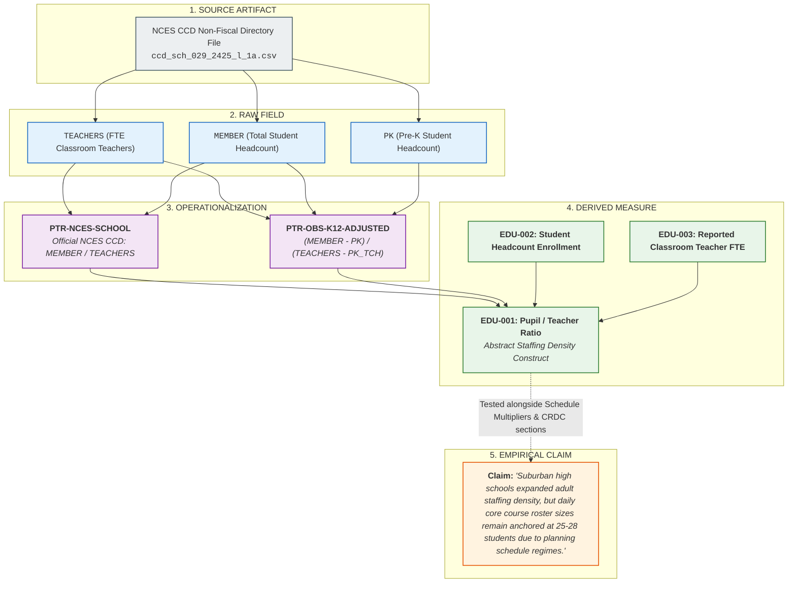

# Education Data Observatory (`education_data_observatory`)

A systematic, cumulative, measure-by-measure research instrument for public education data.

---

## 1. Central Organizing Principle

$$\mathbf{SOURCE} \ne \mathbf{FIELD} \ne \mathbf{OPERATIONALIZATION} \ne \mathbf{MEASURE} \ne \mathbf{CLAIM}$$

Contemporary public education research and policy reporting routinely collapse these five distinct epistemic layers together:
- A CSV file downloaded from the National Center for Education Statistics is a **Source Artifact**.
- `TEACHERS` or `MEMBER` is a **Raw Field**.
- The specific formula, inclusion criteria, and grade adjustments applied to raw fields (e.g., NCES unadjusted school PTR vs. Observatory K–12 adjusted PTR vs. KSDE classroom teacher ratio) constitute an **Operationalization**.
- The abstract, standardized construct of interest (e.g., `EDU-001 Pupil / Teacher Ratio`, `EDU-002 Student Enrollment`, `EDU-003 Reported Classroom Teacher FTE`) is the **Measure**.
- *"Kansas City public schools expanded instructional capacity over the past decade"* is an interpretive **Claim** that can only be evaluated after examining multiple converging measures, staffing distributions, bell schedules, and accommodation loads.

When these layers are collapsed, empirical investigations devolve into fishing expeditions—running correlation matrices across hundreds of raw columns before establishing what the columns actually capture. 

The Education Data Observatory deliberately pulls these layers apart. The durable research unit of this project is the **Measure**, connected to immutable raw fields via explicit, cataloged **Operationalizations**.


```mermaid
flowchart TD
    subgraph S["1. SOURCE ARTIFACT"]
        S1["NCES CCD Non-Fiscal Directory File<br/><code>ccd_sch_029_2425_l_1a.csv</code>"]
    end

    subgraph F["2. RAW FIELD"]
        F1["<code>TEACHERS</code> (FTE Classroom Teachers)"]
        F2["<code>MEMBER</code> (Total Student Headcount)"]
        F3["<code>PK</code> (Pre-K Student Headcount)"]
    end

    subgraph O["3. OPERATIONALIZATION"]
        O1["<b>PTR-NCES-SCHOOL</b><br/><i>Official NCES CCD: MEMBER / TEACHERS</i>"]
        O2["<b>PTR-OBS-K12-ADJUSTED</b><br/><i>(MEMBER - PK) / (TEACHERS - PK_TCH)</i>"]
    end

    subgraph M["4. DERIVED MEASURE"]
        M1["<b>EDU-001: Pupil / Teacher Ratio</b><br/><i>Abstract Staffing Density Construct</i>"]
        M2["<b>EDU-002: Student Headcount Enrollment</b>"]
        M3["<b>EDU-003: Reported Classroom Teacher FTE</b>"]
    end

    subgraph C["5. EMPIRICAL CLAIM"]
        C1["<b>Claim:</b> <i>'Suburban high schools expanded adult staffing density, but daily core course roster sizes remain anchored at 25-28 students due to planning schedule regimes.'</i>"]
    end

    S1 --> F1
    S1 --> F2
    S1 --> F3
    F1 --> O1
    F2 --> O1
    F1 --> O2
    F2 --> O2
    F3 --> O2
    O1 --> M1
    O2 --> M1
    M2 --> M1
    M3 --> M1
    M1 -.->|Tested alongside Schedule Multipliers & CRDC sections| C1

    classDef sourceStyle fill:#eceff1,stroke:#455a64,stroke-width:1.5px;
    classDef fieldStyle fill:#e3f2fd,stroke:#1565c0,stroke-width:1.5px;
    classDef opStyle fill:#f3e5f5,stroke:#7b1fa2,stroke-width:1.5px;
    classDef measureStyle fill:#e8f5e9,stroke:#2e7d32,stroke-width:1.5px;
    classDef claimStyle fill:#fff3e0,stroke:#e65100,stroke-width:1.5px;

    class S1 sourceStyle;
    class F1,F2,F3 fieldStyle;
    class O1,O2 opStyle;
    class M1,M2,M3 measureStyle;
    class C1 claimStyle;
```

---

## 2. The Epistemic Ladder

Research in the Observatory strictly follows a unidirectional epistemic ladder:

$$\mathbf{Source} \longrightarrow \mathbf{Field} \longrightarrow \mathbf{Operationalization} \longrightarrow \mathbf{Measure} \longrightarrow \mathbf{Description} \longrightarrow \mathbf{Validation} \longrightarrow \mathbf{Relationships} \longrightarrow \mathbf{Explanation}$$

1. **Source:** Where does this raw artifact come from? Who collected it, under what statutory mandate, using what instrument, with what suppression rules, and on what calendar date?
2. **Field:** What specific columns exist in the file, how are they formatted, and what native missingness/exception codes do they use?
3. **Operationalization:** What precise formula, grade filter, inclusion rule, and fallback logic converts raw fields into a calculated or standardized metric?
4. **Measure:** What abstract educational construct does this operationalization attempt to quantify, and what are its semantic boundaries?
5. **Description:** What is its physical distribution across entities? What are the min, max, median, IQR, extreme tails, and missingness rates across geography and time?
6. **Validation:** Can this metric be triangulated against independent sources (e.g., state administrative personnel registers, federal teacher surveys, physical schedule rosters)?
7. **Relationships:** How does this validated measure relate empirically, structurally, and mechanically to other measures in the registry?
8. **Explanation:** What institutional mechanisms, statutory incentives, collective bargaining rules, or demographics explain the observed patterns?

In conventional research, analysts often walk backward down this ladder—discovering a surprising statistical coefficient and only then asking, *"Wait, what was actually in that denominator?"* In the Observatory, the semantic audit occurs **first**.

---

## 3. Core Research Principles

All work in this repository adheres to ten foundational principles:

1. **Measurement semantics before modeling.** Understand the operational meaning, reporting mechanism, and denominator of a measure before entering it into regressions, correlations, or dashboards.
2. **Description before explanation.** Map distributions, quantiles, and outliers thoroughly before testing causal or explanatory claims.
3. **Preserve raw source provenance.** Raw downloaded files are immutable historical artifacts. They are never edited in place, and every file must have a logged source URL, collection date, and cryptographic checksum.
4. **Treat missing/suppressed values explicitly.** Never silently convert `-1`, `-2`, `-9`, or blank values into zeros. Differentiate between true zeros, missingness, structural non-applicability, and privacy suppression.
5. **Do not silently harmonize definition changes.** When federal or state agencies alter definitions, survey items, or variable codes, document the break explicitly rather than pretending the time series is continuous.
6. **Derived metrics must expose their formulas.** Every calculated metric must publish its exact mathematical formula, weighting regime, and order of operations.
7. **Exploratory correlations generate hypotheses; they do not confirm them.** Cross-measure exploratory correlations are diagnostic tools for finding interesting phenomena to investigate, never proof of causation.
8. **Prefer multiple independent measurements of the same latent phenomenon.** Triangulate administrative censuses (e.g., CCD) with teacher sample surveys (e.g., NTPS/SASS) and course microdata (e.g., CRDC).
9. **Dashboards display evidence; they do not turn descriptive measures into scores.** Avoid composite school quality indexes, arbitrary rankings, or punitive normative metrics. Present clear, contextual evidence.
10. **A finding is not frozen until the registry, canonical dossier, README, figures, and analysis memo all agree.** Discarding a misleading or un-salvageable variable, or tightening an empirical claim, is a scientific victory.

---

## 4. Repository Architecture & Upstream Dependencies

```text
2026-09-26-education-data-observatory/
├── README.md                      # Observatory manifesto, architecture, and principles
├── registry/                      # Machine-readable registry ledgers
│   ├── measures.csv               # Master catalog of education measures (canonical names/IDs)
│   ├── operationalizations.csv    # Concrete formula and universe implementations
│   ├── sources.csv                # Master catalog of external data sources
│   └── relationships.csv          # Measurement graph edge list (inputs, outputs, models)
├── templates/                     # Standardized research dossiers
│   ├── measure_dossier.md         # Template specification for all measures
│   └── source_dossier.md          # Template specification for external data sources
├── measures/                      # Individual measure dossiers (the core research unit)
│   ├── EDU-001-pupil-teacher-ratio/
│   │   └── README.md              # Calibration specimen dossier for PTR
│   ├── EDU-002-student-enrollment/
│   │   └── README.md              # Audited and frozen dossier for Student Headcount Enrollment
│   └── EDU-003-total-teacher-fte/
│       └── README.md              # Audited dossier for Reported Classroom Teacher FTE
├── sources/                       # Documentation and audit dossiers for external data sources
│   ├── nces-ccd/README.md         # NCES Common Core of Data source dossier
│   ├── crdc/README.md             # Civil Rights Data Collection source dossier
│   ├── ntps/README.md             # National Teacher and Principal Survey source dossier
│   ├── mo-dese/README.md          # Missouri DESE administrative register dossier
│   ├── ksde/README.md             # Kansas State Dept of Education register dossier
│   └── edfacts/README.md          # U.S. ED EDFacts federal reporting system dossier
├── data/                          # Segregated data storage
│   ├── upstream_artifacts.csv     # Cryptographic audit ledger linking validated upstream panels
│   ├── raw/                       # Immutable external downloads (by source and year)
│   ├── interim/                   # Cleaned, standardized tabular intermediate files
│   └── processed/                 # Validated measure extractions
├── analysis/                      # Cross-measure analyses
│   ├── cross-measure/             # Relational and multivariate explorations consuming measures
│   └── archive/                   # Superseded or diagnostic exploration scripts
└── dashboard/                     # Downstream visualization views over the registry
```

### Upstream Data Architecture
To prevent duplicating gigabytes of raw federal and state files across sibling sketchbook projects, the Observatory formalizes its data dependencies via [`data/upstream_artifacts.csv`](data/upstream_artifacts.csv). Each validated upstream panel ingested from the companion Kansas City Education Capacity Study (`2026-09-23-kc-education-capacity`) is cryptographically registered with its producing script, schema version, SHA-256 hash, and consuming measure IDs.

---

## 5. The Measurement Graph

Rather than a static directory of analysis scripts, the Observatory constructs a **Measurement Graph**:

```text
EDU-001: Pupil / Teacher Ratio
  ├── Derived From (Numerator):   EDU-002 (Student Headcount Enrollment)
  ├── Derived From (Denominator): EDU-003 (Reported Classroom Teacher FTE)
  ├── Contrasts With:             EDU-004 (State Classroom Teacher FTE [Disaggregated]) -> isolates Specialist Wedge (Δ1)
  ├── Multiplied By:              Schedule Planning Multiplier (φ = P_student / P_teacher) -> isolates Planning Wedge (Δ2)
  ├── Triangulated Against:       EDU-006 (Course Student Enrollment)
  ├── Aggregated Across:          EDU-011 (Course Class Count)
  ├── Benchmarked Against:        EDU-012 (Derived School-Course Mean Class Size)
  ├── Survey Contrasted With:     EDU-007 (Teacher-Reported Average Class Size)
  └── Exposure Estimand:          EDU-014 (Student-Weighted Class Size Exposure)
```

By decoupling measures from individual projects, future research investigations do not need to re-download or re-audit standard educational metrics. When investigating teacher turnover, instructional salary allocations, or school accountability ratings, existing validated measures (`EDU-001`, `EDU-002`, `EDU-003`, etc.) are consumed directly from the registry.

---

## 6. Relationship to the Kansas City Education Capacity Study

This Observatory builds directly upon four decades of empirical evidence, statutory audits, and structural models developed in the **Kansas City Education Capacity Study** ([`2026/2026-09-23-kc-education-capacity`](../2026-09-23-kc-education-capacity/README.md)). 

Key empirical foundations inherited from that work include:
- The distinction between structural staffing density (CCD) and classroom exposure (CRDC, NTPS).
- The **Specialist Denominator Wedge** ($\Delta_1 \approx +2.7$ students/teacher) documented through state personnel role reconciliations.
- The **Schedule Capacity Identity** ($\phi = P_{\text{student}} / P_{\text{teacher}} = 1.400$), demonstrating how collective bargaining planning periods expand required staffing by $+40\%$.
- The historical judicial precedent (*Jenkins v. Missouri*, 1985) establishing that federal desegregation courts rejected aggregate PTR in favor of daily contact load caps ($\le 125$).
- The **Student Complexity Panel**, documenting Section 504 accommodation burdens and chronic absenteeism friction.

---

## 7. Project Roadmap & Milestone Log

- **Task 001 (Completed):** Scaffold the Education Data Observatory repository architecture, establish the 10 Research Principles, author standard dossier templates (`measure_dossier.md`, `source_dossier.md`), initialize machine-readable registry ledgers (`measures.csv`, `sources.csv`, `relationships.csv`), and author the initial calibration dossier for `EDU-001` (Pupil / Teacher Ratio).
- **Task 002 & 002B (Completed):** Deep-dive review and epistemic audit of `EDU-001 Pupil/Teacher Ratio`. Created `registry/operationalizations.csv`, audited the 14-measure registry, decoupled generic templates from PTR specifics, established the 4-tier comparison universe, added Figure 1–3 visual evidence packet with explicit provenance, and updated interactive visualizer.
- **Task 003, 003B, 003C, 003D, 003E (Completed & Frozen):** Comprehensive empirical audit of `EDU-002 Student Headcount Enrollment`:
  - Resolved the geographic universe boundary: established the **+1,472 regional gap** across the 77 fully-regional LEAs, with +973 additional discrepancy arising from two non-geographic statewide agencies (correction of the obsolete +2,445 claim).
  - Documented kindergarten pipeline shock: Fall 2020 dropped $-11.43\%$, accounting for $36.9\%$ of the regional drop; 10-year Grades 1–12 enrollment remained net positive (+0.10%), while Kindergarten dropped $-9.14\%$.
  - Spatial stability: Metro enrollment-weighted centroid shifted only $0.32$ miles ($1,686.5$ feet); no meaningful net outward displacement was observed.
  - Published Figures 4 through 11 in [`dashboard/`](dashboard/). Status: `AUDITED / FROZEN`.
- **Task 004, 004A, 004B, & 004C (Completed & Audited):** Empirical audit, numerical reconciliation, and stabilization of `EDU-003 Reported Classroom Teacher FTE`:
  - Reconciled Campus Sum vs LEA reported totals across 77 regional districts.
  - Audited the 2015–16 Kansas CCD non-reporting artifact: Olathe (`LEAID 2010140`) and Gardner Edgerton (`LEAID 2006420`) missing $-2,311$ FTE; established illustrative linear interpolation for macro series.
  - Audited downward staffing stickiness across 28 declining districts with unchanged operating-school counts ($-3.63\%$ teachers vs. $-8.33\%$ enrollment; robust to $-3.35\%$ vs. $-10.50\%$ across 25 identical-school-ID LEAs).
  - Retracted unsupported $\ge 35$ FTE Calculus threshold; documented association and matched-cohort drop from $67.9\%$ to $35.7\%$.
  - Quantified the Secondary Staffing Wedge across 6 CRDC waves ($+3.5$ to $+4.5$ students), consistent with calibrated schedule model (2023–24 Algebra I: $19.28$ vs. macro PTR $14.76$, wedge $= +4.53$).
  - Established formal caution on longitudinal librarian comparability ($-54.39\%$ due partly to job reclassification).
  - Executed Task 004C numerical claim ledger reconciliation to eliminate prose-report drift: created `registry/universes.csv`, `scripts/generate_claims_ledger.py`, and `analysis/results/claims.csv`. Published Figures 12 through 14 in [`dashboard/`](dashboard/). Status: `AUDITED / FROZEN`.
- **Task 005 (Upcoming):** Re-audit `EDU-001 Pupil/Teacher Ratio` synthesizing audited `EDU-002` and `EDU-003` foundations.
- **Task 006 (Upcoming):** Scaffold `EDU-005 Paraprofessional FTE`.
