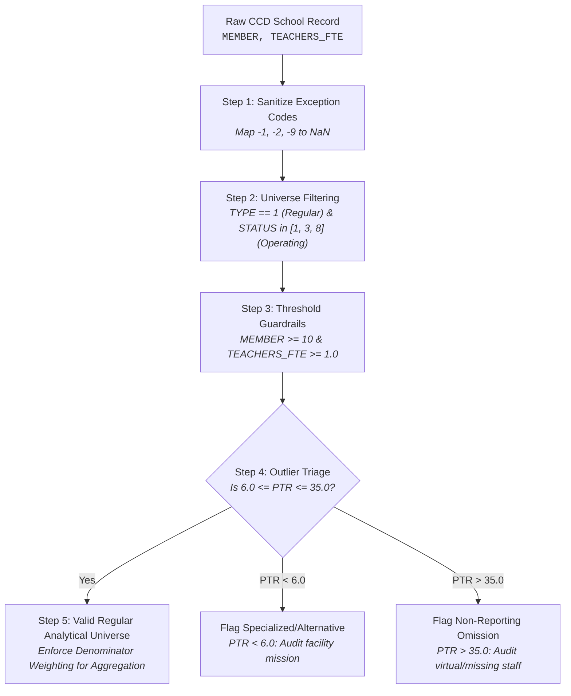
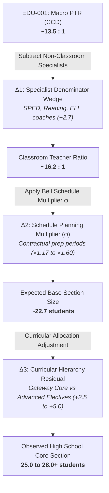

# Measure Dossier: EDU-001 — Pupil / Teacher Ratio (PTR)

> **Observatory Standard:** This dossier represents the calibration specimen for the Education Data Observatory. It consolidates empirical findings, structural identities, and semantic boundaries established across four decades of public data in the Kansas City Education Capacity Study ([`kc_education_capacity`](../../../2026/2026-09-23-kc-education-capacity/README.md)).

---

## 1. Identity & Classification

| Attribute | Specification |
| :--- | :--- |
| **Measure ID** | `EDU-001` |
| **Human-Readable Name** | Pupil / Teacher Ratio (PTR) |
| **Short Identifier / Slug** | `pupil-teacher-ratio` |
| **Status** | `audited` |
| **Lifecycle Stage** | Epistemic Ladder: `validation` $\to$ `relationships` |
| **Category** | Staffing Capacity |
| **Derived or Directly Reported** | `Derived` (Calculated from Student Headcount and Teacher FTE) |
| **Provenance Tier** | **Tier 1: Harmonized National Census** (NCES CCD Non-Fiscal Universe) *Contrasted with Tier 2: State-Specific Administrative Systems (KSDE KPTEN, MO DESE MOSIS)* |

---

## 2. Definitions & Conceptual Boundaries

### 2.1 Plain-Language Definition
Pupil/Teacher Ratio (PTR) is a macro-level administrative measure of adult staffing density. It measures the total number of enrolled students divided by the total number of full-time equivalent (FTE) certified teachers employed by a school or district. 

> [!CAUTION]
> **PTR is NOT Class Size.** A pupil/teacher ratio of 14:1 does **not** mean there are 14 students in a classroom. In secondary schools with 14:1 PTR, typical core academic classrooms regularly contain 24 to 28+ students.

### 2.2 Formal / Statistical Definition
For an educational observation unit $i$ (campus or LEA) in school year $t$:

$$\text{PTR}_{i,t} = \frac{\text{Enrollment}_{K12, i, t}}{\text{Teacher FTE}_{K12, i, t}}$$

Where:
- $\text{Enrollment}_{K12, i, t}$ is the fall headcount membership in grades Kindergarten through 12 (deducting adult and Pre-K enrollments).
- $\text{Teacher FTE}_{K12, i, t}$ is the sum of certified instructional teacher full-time equivalents assigned to grades K–12.

### 2.3 Aggregation & Weighting Discipline
When aggregating across an LEA, metropolitan region, or state, the **Student-Weighted Ratio (Ratio of Sums)** is the only mathematically valid macro estimand:

$$\overline{\text{PTR}}_{\text{region}, t} = \frac{\sum_{i \in \text{region}} \text{Enrollment}_{i,t}}{\sum_{i \in \text{region}} \text{Teacher FTE}_{i,t}} = \sum_{i \in \text{region}} w_{i,t} \cdot \text{PTR}_{i,t} \quad \text{where } w_{i,t} = \frac{\text{Teacher FTE}_{i,t}}{\sum_j \text{Teacher FTE}_{j,t}}$$

> [!WARNING]
> **The Unweighted Average Fallacy:** Computing the unweighted arithmetic mean of campus-level PTR ($\frac{1}{N}\sum \text{PTR}_i$) creates severe upward bias. Small rural schools, specialized therapeutic centers, and alternative academies with very low enrollment and ratios pull the unweighted arithmetic average down or distort the variance. Always compute the ratio of sums for geographic aggregates.

### 2.4 Unit & Scale
- **Unit of Measurement:** Students per teacher FTE (`students_per_fte`)
- **Theoretical Range:** $(0, \infty)$
- **Empirical Realistic Range (Regular Public Schools):** $8.0$ to $28.0$ students per FTE
  - High capacity / affluent suburban elementary: $11.0$ – $14.0$
  - Typical metropolitan high school: $14.0$ – $18.0$
  - Highly congested urban or fast-growing exurban: $19.0$ – $24.0$
  - Values $< 5.0$ almost always indicate specialized special education day facilities or alternative programs.
  - Values $> 35.0$ almost always indicate severe non-reporting of staff, data entry errors, or virtual school aggregation.

---

## 3. Provenance & Source Mapping

### 3.1 Raw Source Fields
Primary data source: **NCES Common Core of Data (CCD)** — `nces-ccd`.

| Source ID | Table / File Name | Field Variable Name | Field Description | Data Type | Notes / Nullable |
| :--- | :--- | :--- | :--- | :--- | :--- |
| `nces-ccd` | `ccd_sch_052_XX_l_1a.csv` | `MEMBER` | Total Student Membership (Headcount) | Integer | Renamed from `TOTENR` in SY 2014–15 |
| `nces-ccd` | `ccd_sch_059_XX_l_1a.csv` | `TEACHERS` / `FTE` | Full-Time Equivalent Teachers | Float | Pre-K teachers included in some years |
| `nces-ccd` | `ccd_sch_029_XX_l_1a.csv` | `G_PK_OFFERED` | Pre-Kindergarten Offering Flag | String | Used to audit Pre-K distortion |
| `nces-ccd` | `ccd_sch_052_XX_l_1a.csv` | `PK` | Pre-Kindergarten Student Count | Integer | Deducted when isolating K–12 ratio |

### 3.2 Calculation Formula & Intermediate Operations
To isolate K–12 instructional capacity cleanly and avoid Pre-K distortion:

1. **Negative Code Remediation:** Map all negative source codes (`-1`, `-2`, `-9`) to `NaN` before arithmetic.
2. **Pre-K Isolation:**
   $$\text{Enrollment}_{K12} = \text{MEMBER} - \max(0, \text{PK})$$
   $$\text{Teacher FTE}_{K12} = \text{TEACHERS\_TOTAL} - \max(0, \text{TEACHERS\_PK})$$
3. **Pre-K Staff Deduction Fallback Rule:** In years or states where `TEACHERS_PK` is missing or not reported separately, but $\text{PK} > 0$:
   - If Pre-K enrollment is $< 5\%$ of total school membership, calculate $\text{PTR} = \frac{\text{MEMBER}}{\text{TEACHERS\_TOTAL}}$ and attach the metadata flag `prek_unadjusted`.
   - If Pre-K enrollment is $\ge 5\%$ of membership (e.g., dedicated early childhood centers), exclude the facility from K–12 panel analyses.
4. **Division Guardrail:** If $\text{Teacher FTE}_{K12} \le 0$ or `NaN`, set $\text{PTR} = \text{NaN}$. Never impute zero or divide by zero.

---

## 4. Scope, Granularity & Temporal Disambiguation

| Dimension | Specification | Notes & Boundary Conditions |
| :--- | :--- | :--- |
| **Target Population** | Public K–12 students and certified instructional teachers | Excludes adult education and tuition preschool |
| **Unit of Observation** | School campus (`NCESSCH`) and District / LEA (`LEAID`) | District-level PTR includes central itinerant teachers |
| **Geographic Granularity** | Campus, LEA, County, Metropolitan Area, State, National | Aggregations must be weighted by denominator |
| **Temporal Granularity** | Annual Fall Snapshot | Measured on or near October 1 of the academic year |
| **School Year of Reference (SY)** | `SY 2024–25` (Anchor Baseline) | **Primary Indexing Dimension** |
| **Collection Snapshot Date** | October 1 of the academic year | Universal state fall enrollment count date |
| **Publication / Release Date** | Provisional: +12 to 14 months; Final: +20 to 24 months | e.g., Fall 2024 snapshot released provisionally in Winter 2025 |
| **Publication Lag** | 12 to 24 months | Analysis must never confuse publication date with reference date |
| **Earliest Available Year** | SY 1986–87 | Continuous digital non-fiscal records |
| **Latest Audited Year** | SY 2024–25 | Audited in KC Education Capacity Study |
| **Expected Update Cadence** | Annual | Provisional release each winter |

> [!IMPORTANT]
> **The "2024" Trap (Temporal Disambiguation):** In educational literature, "2024 data" frequently refers to three different things: (1) SY 2023–24 collected in Fall 2023; (2) SY 2024–25 collected in Fall 2024; or (3) A historical dataset published in calendar year 2024. In the Observatory, **all series are strictly indexed by School Year of Reference (`SY YYYY–YY`)**.

---

## 5. Collection Mechanism, Organizational Allocation & Ingestion Mechanics

### 5.1 Collection Mechanism
Mandatory administrative census. State Education Agencies (SEAs)—including Missouri DESE and Kansas KSDE—extract student membership and certified personnel records from local Student Information Systems (SIS) and state personnel certification registries (MOSIS, KPTEN), formatting them into federal EDFacts reporting specifications.

### 5.2 Organizational Allocation Sensitivity (Campus vs. Central Office)
A major source of bias in campus-level PTR comparisons is how districts assign shared and itinerant staff:

- **The Central Allocation Gap ($\Delta_{\text{central}}$):** In many school districts, specialized teachers (elementary art, music, physical education, English as a Second Language [ESL], and speech language pathologists) are contracted to the central LEA administrative office rather than assigned to a specific school campus building code.
- **Impact on Campus Metrics:**
  $$\Delta_{\text{central}} = \text{PTR}_{\text{campus\_aggregate}} - \text{PTR}_{\text{district\_direct}}$$
  In districts with centralized itinerant staffing, campus-level PTR appears **1.5 to 3.0 points higher** than the district-level PTR. In the Kansas City study, large suburban districts (e.g., Shawnee Mission, North Kansas City) showed $\Delta_{\text{central}} \in [0.8, 2.2]$ students/FTE.
- **Observatory Standard:** When evaluating campus-level PTR, always compute the Central Allocation Gap. Cross-district campus comparisons are only valid if both districts allocate itinerant staff to campus buildings in an identical manner.

### 5.3 Step-by-Step Analytical Filtering & Outlier Protocol
Before entering `EDU-001` into any descriptive or relational model, the pipeline must execute this 5-step filtering sequence:

1. **Exception Code Sanitization:** Map all negative values (`-1`, `-2`, `-9`) to `NaN`.
2. **Universe Filtering:** Filter for operating regular local public schools (`TYPE == 1`, `STATUS in [1, 3, 8]`).
3. **Threshold Guardrails:** Enforce $\text{MEMBER} \ge 10$ and $\text{Teacher FTE} \ge 1.0$.
4. **Outlier Triage:**
   - **PTR $< 6.0$:** Flag as specialized facility (therapeutic, special education day center, or juvenile center). Exclude from regular classroom staffing analyses.
   - **PTR $> 35.0$:** Flag as suspected non-reporting of staff, data entry omission, or cyber/virtual campus. Exclude from regular physical school panels.
5. **Denominator Weighting:** Enforce ratio-of-sums aggregation for all LEA, county, and state benchmarks.

### 5.4 Exclusion Rules
- **Virtual Schools:** Cyber academies report thousands of remote students with minimal central facilitators, creating artifactual PTRs of $40:1$ to $120:1$.
- **Special Education Day Facilities:** Ratios of $1:1$ to $4:1$ represent intensive clinical staffing, not typical classroom environments.
- **Career & Technical Education (CTE) Centers:** Often report teachers but zero primary enrollment (students count at sending high schools), resulting in undefined or near-zero ratios.
- **Closed / Inactive Schools:** Entities reporting zero enrollment or zero teachers.

### 5.5 Missing Values & Native Codebook Flags
| Source Code | Code Meaning | Pipeline Action |
| :--- | :--- | :--- |
| `-1` | Missing / Not reported | Recode to `NaN`; never treat as zero |
| `-2` | Not applicable | Recode to `NaN` |
| `-9` | Suppressed for privacy | Recode to `NaN` |
| `0` (FTE) | Zero teachers reported with $\text{MEMBER} > 0$ | Recode to `NaN` (non-reporting anomaly) |

---

## 6. Methodological Breaks & Comparability Warnings

### 6.1 Known Historical Discontinuities
- **SY 2014–15 Variable Renaming:** NCES migrated to the modernized EDFacts reporting system, renaming total membership from `TOTENR` to `MEMBER`.
- **SY 2015–16 Kansas Personnel Suppression:** Federal CCD files for SY 2015–16 omitted staff reporting for several major Kansas LEAs (notably Olathe USD 233 and Gardner Edgerton USD 231), causing false plunges in state teacher totals. *Pipeline correction: Classify Kansas SY 2015–16 CCD staff files as `insufficient_coverage (< 80%)` and verify against state-level KSDE CPFS reports.*
- **Pre-K Teacher Inclusion Inconsistencies:** Across historical waves, state reporting has oscillated between including and excluding state-funded preschool teachers from elementary school teacher totals. When preschool enrollment is excluded from student counts, this oscillates elementary PTR by $\pm 1.0$ to $2.0$ points.

### 6.2 Jurisdictional Portability Boundaries (Classroom vs. Total Teachers)
- **The Kansas Separation (KSDE KPTEN):** Kansas state administrative records cleanly disaggregate **Classroom Teachers** from **Other Instructional Teachers** (reading interventionists, special education teachers, gifted facilitators, Title I coaches).
- **The Federal / Multi-State Conflation:** NCES CCD requests a single aggregate: "Total Teachers." In Missouri and many other states, administrative files combine these roles unless researchers conduct deep job-code disaggregation across state-specific reporting screens (e.g., MOSIS Screen 18 vs. Screen 21).
- **Portability Warning:** Naive interstate comparisons between Kansas state reports and Missouri state reports compare apples to oranges. Cross-state analyses must use Tier 1 CCD harmonized totals or explicitly model the Specialist Denominator Wedge ($\Delta_1$).

---

## 7. Semantic Auditing: The Epistemic Defense

> [!IMPORTANT]
> The central scientific trap of public education data is equating Pupil/Teacher Ratio with Class Size. The KC Education Capacity study demonstrated that this equivalence is mathematically and operationally false.

### 7.1 What Question Does PTR Legitimately Answer?
1. **Macro Adult Instructional Investment:** How many certified teaching personnel does an educational system employ per 100 enrolled students?
2. **Systemic Resource Allocation Trends:** Did a district or region actively expand instructional payroll over a decade, independent of student enrollment growth?
3. **Fiscal Staffing Baseline:** What is the macro staffing density supported by the operating budget?

### 7.2 What Question Does PTR NOT Answer?
1. **Classroom Congestion:** It does **not** reveal how many students are sitting in a classroom during 3rd period Geometry.
2. **Teacher Daily Workload / Contact Load:** It does **not** indicate how many unique student papers, grades, and parent communications a secondary teacher manages daily.
3. **Student Peer Exposure:** It does **not** measure the classroom environment experienced by an average child during instructional time.

### 7.3 Structural Transformation Multipliers & Wedges

Empirical research in Kansas City established the exact multi-stage decomposition explaining the $10$ to $13$ student gap between reported PTR and observed secondary class sizes:

$$\text{Observed Core Section Size} \approx \text{PTR}_{\text{macro}} + \Delta_1 + \Delta_2 + \Delta_3$$

#### 1. The Specialist Denominator Wedge ($\Delta_1 \approx +2.7$ students/teacher)
Total Teacher FTE includes certified specialists who do not manage general classroom rosters (special education resource teachers, reading interventionists, ELL coaches, librarians, and instructional facilitators). In metropolitan Kansas districts, removing non-classroom specialists raises the staffing ratio from **13.6:1 to 16.3:1**.

#### 2. The Schedule Capacity Identity ($\Delta_2 = \text{PTR}_{\text{class}} \times (\phi - 1) \approx +6.5$ to $+8.0$ students)
In elementary schools, teachers instruct one cohort for the entire day ($\phi \approx 1.0$). In secondary schools, students take 7 or 8 classes, while teachers have contractually protected planning and duty periods:

$$\phi = \frac{P_{\text{student}}}{P_{\text{teacher}}}$$

The Schedule Planning Multiplier ($\phi$) varies systematically across secondary schedule regimes:

| Schedule Regime | Student Day ($P_{\text{student}}$) | Teacher Teaching Load ($P_{\text{teacher}}$) | Planning / Duty | Multiplier $\phi$ | Expansion Factor | Base 14:1 Staffing Maps To: |
| :--- | :--- | :--- | :--- | :--- | :--- | :--- |
| **Traditional 7-Period ("5 of 7")** | 7 periods | 5 periods | 2 periods | $\mathbf{7/5 = 1.400}$ | $+40.0\%$ | **19.6 students** |
| **Traditional 7-Period ("6 of 7")** | 7 periods | 6 periods | 1 period | $\mathbf{7/6 \approx 1.167}$ | $+16.7\%$ | **16.3 students** |
| **Traditional 8-Period ("6 of 8")** | 8 periods | 6 periods | 2 periods | $\mathbf{8/6 \approx 1.333}$ | $+33.3\%$ | **18.7 students** |
| **4x4 Semester Block ("3 of 4")** | 4 blocks | 3 blocks | 1 block | $\mathbf{4/3 \approx 1.333}$ | $+33.3\%$ | **18.7 students** |
| **A/B Alternating Block ("5 of 8")** | 8 blocks | 5 blocks | 3 blocks | $\mathbf{8/5 = 1.600}$ | $+60.0\%$ | **22.4 students** |

*Even with zero specialists*, a 14:1 high school staffing ratio structurally maps to an average class size of $14 \times 1.40 = \mathbf{19.6}$ students under a standard 5-of-7 regime simply to cover teacher planning periods.

#### 3. The Curricular Allocation Wedge ($\Delta_3 \approx -1.5$ to $+5.0$ students)
High schools run highly heterogeneous course catalogs. Advanced Placement (AP), upper-level languages, remedial credit recovery, and specialized electives run with 10 to 15 students. Because total seat capacity is conserved, core graduation gateway courses (Algebra I, Biology, 9th Grade English) must expand to **25 to 30+ students** to compensate.

---

## 8. Relational Architecture & Validation

### 8.1 Upstream & Downstream Relationships
- **Derived From (Inputs):**
  - `EDU-002`: Student Headcount Enrollment (Numerator)
  - `EDU-003`: Total Teacher FTE (Denominator)
- **Contributes To (Outputs):**
  - `EDU-007`: Student-Weighted Class Size (Via structural decomposition $\text{PTR} + \sum \Delta_k$)
- **Contrasts With:**
  - `EDU-004`: Classroom Teacher FTE (Isolates Specialist Wedge $\Delta_1$)
  - `EDU-006`: Section Enrollment (Direct course section size from CRDC)

### 8.2 Candidate External Validation Sources
| Validation Source | Nature of Source | Calibration Findings in KC Study |
| :--- | :--- | :--- |
| **NCES NTPS / SASS** | Nationally representative teacher sample survey | Showed high school classes averaging **21.8 to 22.5** in MO and **19.7 to 19.8** in KS, while CCD PTR was 13.5:1 to 14.8:1 (gap of +6 to +8 students). |
| **US ED OCR CRDC** | Biennial course-level compliance collection | Validated that comprehensive suburban high schools with 14:1 PTR average **24 to 28+** in core mathematics. |
| **State Personnel Registers (KSDE KPTEN / MO DESE MOSIS)** | State administrative job-code microdata | Confirmed that net decade hiring was primarily classroom teachers, but absorbed by schedule planning reductions rather than roster shrinkage. |
| **Judicial Historical Record (*Jenkins v. Missouri*)** | Federal court desegregation capacity audits | Judge Russell G. Clark rejected district-wide PTR as misleading in 1985, establishing teacher daily contact load ceilings ($\le 125$) and section maximums instead. |

---

## 9. Historical & Institutional Context

### 9.1 The "Buy Back Time" Staffing Paradox
Between 2014–15 and 2024–25 in the Kansas City metropolitan area, K–12 enrollment was flat ($-0.73\%$), while teacher FTE expanded $+8.88\%$, driving regional PTR down from $14.85:1$ to $13.54:1$. Yet classroom teachers reported no relief in class sizes.

The institutional explanation: Districts utilized staff additions to reduce secondary teaching loads from "6 of 7" periods to "5 of 7" periods (e.g., Shawnee Mission Board of Education, January 2020). Shifting from $6/7$ to $5/7$ structurally demands a **$+20\%$ staffing increase** just to maintain constant class sizes. Districts hired teachers to buy back teacher planning and grading time, not to shrink class rosters.

---

## 10. Initial Empirical & Descriptive Sanity Checks

Mandatory pipeline assertions prior to analytical modeling:

- [x] **Assertion 1 (Non-Negativity):** All negative missing codes (`-1`, `-2`, `-9`) mapped to `NaN`. Zero negative values allowed.
- [x] **Assertion 2 (Denominator Guard):** Filter $\text{Teacher FTE} > 0$.
- [x] **Assertion 3 (Extreme Outlier Bounds):** Regular schools with $\text{PTR} < 6.0$ or $\text{PTR} > 35.0$ must be manually audited and flagged.
- [x] **Assertion 4 (Aggregation Order):** Enforce ratio-of-sums aggregation. Never compute unweighted mean of school ratios.
- [x] **Assertion 5 (Longitudinal Discontinuity Check):** Detect annual step-changes $> \pm 25\%$ at the district level to catch unannounced reporting changes or boundary changes.

---

## 11. Observatory Usage & Dashboard Role

- **Dashboard Role:** `Contextual Background Metric` (Systemic Investment Layer).
- **Prohibited Use:** Prohibited as a standalone measure of student learning conditions, class size, or teacher workload.
- **Mandatory Presentation Disclaimer:**
  > *"Pupil/Teacher Ratio measures total system adult staffing density, including non-classroom specialists and planning periods. It does not reflect individual classroom class sizes, which in secondary schools are typically 40% to 80% higher."*
- **Dossier Audit History:**
  - `2026-09-26`: Initial calibration dossier drafted, incorporating 4-decade empirical findings from `kc_education_capacity`.
  - `2026-09-26`: Upgraded during Task 002 audit with Provenance Tiers, Schedule Multiplier Matrix across 5 regimes, Central Allocation Gap ($\Delta_{\text{central}}$), and 5-Step Outlier Protocol.
