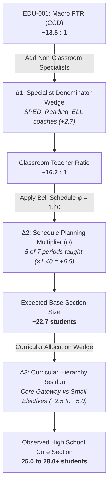

# Measure Dossier: EDU-001 — Pupil / Teacher Ratio (PTR)

> **Observatory Standard:** This dossier represents the calibration specimen for the Education Data Observatory. It consolidates empirical findings, structural identities, and semantic boundaries established in the Kansas City Education Capacity Study ([`kc_education_capacity`](../../../2026/2026-09-23-kc-education-capacity/README.md)).

---

## 1. Identity & Classification

| Attribute | Specification |
| :--- | :--- |
| **Measure ID** | `EDU-001` |
| **Human-Readable Name** | Pupil / Teacher Ratio (PTR) |
| **Short Identifier / Slug** | `pupil-teacher-ratio` |
| **Status** | `audited` |
| **Lifecycle Stage** | `validation` $\to$ `relationships` |
| **Category** | Staffing Capacity |
| **Derived or Directly Reported** | `Derived` (Calculated from Student Headcount and Teacher FTE) |

---

## 2. Definitions & Conceptual Boundaries

### 2.1 Plain-Language Definition
Pupil/Teacher Ratio (PTR) is a macro-level administrative measure of adult staffing density. It measures the total number of enrolled students divided by the total number of full-time equivalent (FTE) certified teachers employed by a school or district. 

> [!CAUTION]
> **PTR is NOT Class Size.** A pupil/teacher ratio of 14:1 does **not** mean there are 14 students in a classroom. In secondary schools with 14:1 PTR, typical core academic classrooms regularly contain 24 to 28+ students.

### 2.2 Formal / Statistical Definition
For an educational observation unit $i$ (campus or LEA) in school year $t$:

$$\text{PTR}_{i,t} = \frac{\text{Enrollment}_{K12, i, t}}{\text{Teacher FTE}_{K12, i, t}}$$

Where:
- $\text{Enrollment}_{K12, i, t}$ is the fall headcount membership in grades Kindergarten through 12.
- $\text{Teacher FTE}_{K12, i, t}$ is the sum of certified instructional teacher full-time equivalents assigned to grades K–12.

When aggregating across a geographic region (e.g., metropolitan area or state), the **Student-Weighted LEA Ratio** is the standard macro estimand:

$$\overline{\text{PTR}}_{\text{region}, t} = \frac{\sum_{i \in \text{region}} \text{Enrollment}_{i,t}}{\sum_{i \in \text{region}} \text{Teacher FTE}_{i,t}} = \sum_{i \in \text{region}} w_{i,t} \cdot \text{PTR}_{i,t} \quad \text{where } w_{i,t} = \frac{\text{Teacher FTE}_{i,t}}{\sum_j \text{Teacher FTE}_{j,t}}$$

> [!WARNING]
> Computing the unweighted arithmetic mean of campus-level PTR ($\frac{1}{N}\sum \text{PTR}_i$) creates severe upward bias because small rural or specialized schools with very low ratios distort the arithmetic average.

### 2.3 Unit & Scale
- **Unit of Measurement:** Students per teacher FTE (`students_per_fte`)
- **Theoretical Range:** $(0, \infty)$
- **Empirical Realistic Range (Regular Schools):** $8.0$ to $28.0$ students per FTE
  - High capacity / affluent suburban elementary: $11.0$ – $14.0$
  - Typical metropolitan high school: $14.0$ – $18.0$
  - Highly congested urban or fast-growing exurban: $19.0$ – $24.0$
  - Values $< 5.0$ almost always indicate specialized special education day facilities or alternative programs.
  - Values $> 35.0$ almost always indicate severe non-reporting of staff, data entry errors, or virtual school aggregation.

---

## 3. Provenance & Source Mapping

### 3.1 Raw Source Fields
Primary data source: **NCES Common Core of Data (CCD)** — `nces-ccd`.

| Source ID | Table / File Name | Field Variable Name | Field Description | Data Type | Notes / Nullable |
| :--- | :--- | :--- | :--- | :--- | :--- |
| `nces-ccd` | `ccd_sch_052_XX_l_1a.csv` | `MEMBER` | Total Student Membership (Headcount) | Integer | Renamed from `TOTENR` in SY 2014–15 |
| `nces-ccd` | `ccd_sch_059_XX_l_1a.csv` | `TEACHERS` / `FTE` | Full-Time Equivalent Teachers | Float | Pre-K teachers included in some years |
| `nces-ccd` | `ccd_sch_029_XX_l_1a.csv` | `G_PK_OFFERED` | Pre-Kindergarten Offering Flag | String | Used to audit Pre-K distortion |
| `nces-ccd` | `ccd_sch_052_XX_l_1a.csv` | `PK` | Pre-Kindergarten Student Count | Integer | Deducted when isolating K–12 ratio |

### 3.2 Calculation Formula & Derivation Discipline
1. **Missing / Negative Code Remediation:** Replace negative values (`-1`, `-2`, `-9`) with `NaN` before arithmetic.
2. **Pre-K Staff Deduction:** Where Pre-K enrollment is present and Pre-K teachers are reported separately, compute strictly:
   $$\text{Enrollment}_{K12} = \text{MEMBER} - \max(0, \text{PK})$$
   $$\text{Teacher FTE}_{K12} = \text{TEACHERS\_TOTAL} - \max(0, \text{TEACHERS\_PK})$$
3. **Division Guardrail:** If $\text{Teacher FTE}_{K12} \le 0$ or `NaN`, set $\text{PTR} = \text{NaN}$. Never impute $0$ or divide by zero.

---

## 4. Scope, Granularity & Coverage

| Dimension | Specification | Notes & Boundary Conditions |
| :--- | :--- | :--- |
| **Target Population** | Public K–12 students and certified instructional teachers | Excludes adult education and tuition preschool |
| **Unit of Observation** | School campus (`NCESSCH`) and District / LEA (`LEAID`) | District-level PTR includes central itinerant teachers |
| **Geographic Granularity** | Campus, LEA, County, Metropolitan Area, State, National | Aggregations must be weighted by denominator |
| **Temporal Granularity** | Annual Fall Snapshot | Measured on or near October 1 of the academic year |
| **Earliest Known Availability** | SY 1986–87 | Earliest continuous federal CCD non-fiscal collection |
| **Latest Known Availability** | SY 2024–25 | Audited in KC Education Capacity Study |
| **Expected Update Cadence** | Annual | Provisional release ~12 months post-collection; final ~20 months |

---

## 5. Collection Mechanism & Ingestion Mechanics

### 5.1 Collection Mechanism
Mandatory administrative census. State Education Agencies (SEAs)—such as Missouri DESE and Kansas KSDE—extract personnel and student membership data from district student information systems (SIS) and state personnel registers (e.g., MOSIS, KPTEN), harmonizing them into federal EDFacts reporting specifications.

### 5.2 Inclusion Rules
- Operating regular local school districts and charter LEAs (`LEA_TYPE in [1, 2, 7]`).
- Operational regular elementary, middle, and high schools (`TYPE == 1`, `STATUS in [1, 3, 8]`).
- Minimum enrollment threshold: $\text{MEMBER} \ge 10$.
- Minimum staffing threshold: $\text{Teacher FTE} \ge 1.0$.

### 5.3 Exclusion Rules
- **Virtual Schools:** Virtual campuses report massive student counts with centralized remote proctors, producing artifactual PTRs of $40:1$ to $120:1$.
- **Special Education Day Facilities:** Campuses with $1:1$ or $2:1$ staffing distort regular public school distributions.
- **Career & Technical Centers (CTC):** Often report staff without primary student membership (students co-enrolled at home high schools), producing mathematically undefined or near-zero ratios.
- **Closed / Inactive Schools:** Campuses reporting zero membership or zero staff.

### 5.4 Missing Values & Suppression Handling
| Source Code | Meaning | Remediation in Pipeline |
| :--- | :--- | :--- |
| `-1` | Missing / Not reported | Map to `NaN`. Never treat as zero. |
| `-2` | Not applicable | Map to `NaN`. |
| `-9` | Suppressed for privacy | Map to `NaN`. |
| `0` (in FTE) | Zero reported teachers | If $\text{MEMBER} > 0$, recode to `NaN` (non-reporting anomaly). |

---

## 6. Methodological Breaks & Comparability Warnings

### 6.1 Known Historical Anomalies
- **SY 2014–15 Variable Renaming:** NCES transitioned legacy table formats to the EDFacts modernized layout, renaming core student fields (`TOTENR` $\to$ `MEMBER`).
- **SY 2015–16 Kansas Personnel Suppression:** In federal CCD files for 2015–16, staff reporting was suppressed or omitted for select major Kansas districts (e.g., Olathe USD 233, Gardner Edgerton USD 231), causing false drops in statewide teacher counts. *Remediation: Flag Kansas 2015–16 CCD files as `insufficient_coverage (< 80%)` and verify against state-level KSDE CPFS reports.*
- **Pre-K Teacher Reporting Inconsistency:** States vary widely in whether federally reported school teacher FTE includes state-funded Pre-K teachers. When Pre-K enrollment is omitted from K-12 membership but Pre-K teachers remain in the denominator, PTR is artificially depressed.

### 6.2 Comparability Warnings Across Jurisdictions
1. **Classroom Teacher vs. Specialist Distinction:** Federal CCD requests "Total Teachers." Kansas state reporting (KSDE KPTEN) cleanly disaggregates **Classroom Teachers** from **Other Teachers** (special education, reading specialists, Title I pull-out). Missouri DESE historical files combine instructional staff differently across Screen 18 and Screen 21. Naive interstate comparisons conflate total instructional staff with classroom teachers.
2. **Central Office Assignment:** Some LEAs assign art, music, PE, and special education teachers to the central district office rather than individual school rosters. This makes campus-level PTR look deceptively high while LEA-level PTR is lower.

---

## 7. Semantic Auditing: The Epistemic Defense

> [!IMPORTANT]
> The primary scientific trap of public education data is equating Pupil/Teacher Ratio with Class Size. The KC Education Capacity study demonstrated that this equivalence is mathematically and operationally false.

### 7.1 What Question Does PTR Legitimately Answer?
1. **Macro Adult Instructional Investment:** How many certified teaching personnel does an educational system employ per 100 enrolled students?
2. **Systemic Resource Allocation Trends:** Did a district or region actively add instructional payroll over a decade, independent of student enrollment growth?
3. **Fiscal Capacity Baseline:** What is the macro staffing burden carried by the operating budget?

### 7.2 What Question Does PTR NOT Answer?
1. **Classroom Congestion:** It does **not** tell you how many children are sitting in front of a teacher during 3rd period Algebra I.
2. **Teacher Workload / Daily Student Load:** It does **not** reveal how many unique student papers, grades, and parent communications a secondary teacher is responsible for each day.
3. **Student Exposure:** It does **not** reflect the peer environment experienced by an average child during instructional time.

### 7.3 The Three Structural Wedges (Why PTR $\ne$ Class Size)

Empirical research in Kansas City established the exact multi-stage decomposition explaining the $10$ to $13$ student gap between reported PTR and observed secondary class sizes:

$$\text{Observed Core Class Size} \approx \text{PTR}_{\text{macro}} + \Delta_1 + \Delta_2 + \Delta_3$$

#### 1. The Specialist Denominator Wedge ($\Delta_1 \approx +2.7$ students/teacher)
Total Teacher FTE in federal reporting includes reading coaches, special education resource teachers, English Language Learner (ELL) specialists, librarians, and instructional facilitators. These certified educators do not manage general classroom rosters. In Kansas metropolitan districts, subtracting specialized non-classroom teachers raises the staffing ratio from **13.6:1 to 16.3:1**.

#### 2. The Schedule Capacity Identity ($\Delta_2 = \text{PTR}_{\text{class}} \times (\phi - 1) \approx +6.5$ to $+8.0$ students)
In elementary schools, a teacher typically instructs one cohort for the entire instructional day ($\phi = 1.0$). In secondary schools (middle and high schools), students attend class across 7 or 8 periods, but contractual collective bargaining agreements and state accreditation standards (e.g., Missouri MSIP 6 requiring $\ge 250$ minutes/week of planning) guarantee teachers planning and duty periods:

$$\phi = \frac{P_{\text{student}}}{P_{\text{teacher}}}$$

Under a standard "5 of 7" teaching regime (teachers teach 5 periods, receive 2 planning/duty periods):

$$\phi = \frac{7}{5} = 1.400 \quad (+40\%\text{ structural expansion})$$

Even if there were zero specialists, a 14:1 high school staffing ratio structurally maps to an average section size of $14 \times 1.40 = \mathbf{19.6}$ students simply to cover planning periods.

#### 3. The Curricular Allocation Wedge ($\Delta_3 \approx -1.5$ to $+5.0$ students)
High schools run heterogeneous course catalogs. Advanced Placement (AP) courses, upper-level foreign languages, remedial credit recovery, and specialized electives frequently run with 10 to 15 students. Because total seats are finite, core graduation gateway courses (Algebra I, Biology, 9th Grade English) must expand to **25 to 30+ students** to compensate.

---

## 8. Relational Architecture & Validation

### 8.1 Upstream & Downstream Graph
- **Upstream Measures (Constituents):**
  - `EDU-002`: Student Headcount Enrollment (Numerator)
  - `EDU-003`: Total Teacher FTE (Denominator)
- **Downstream / Contrast Measures:**
  - `EDU-004`: Classroom Teacher FTE (Excludes specialists to isolate $\Delta_1$)
  - `EDU-006`: Section Enrollment (Direct course section size from CRDC)
  - `EDU-007`: Student-Weighted Class Size (True exposure measure from surveys/master schedules)

### 8.2 Candidate External Validation Sources
| Validation Source | Mechanism | Calibration Findings in KC Study |
| :--- | :--- | :--- |
| **NCES NTPS / SASS** | Teacher survey self-reporting average class size | Showed high school classes averaging **21.8 to 22.5** in MO and **19.7 to 19.8** in KS, while CCD PTR was 13.5:1 to 14.8:1 (gap of +6 to +8 students). |
| **US ED OCR CRDC** | Biennial course-level section counts & enrollments | Validated that comprehensive suburban high schools with 14:1 PTR average **24 to 28+** in core mathematics. |
| **State Personnel Registers (KSDE KPTEN / MO DESE MOSIS)** | Microdata job-code records | Confirmed that net decade hiring was primarily classroom teachers, but absorbed by schedule planning reductions rather than roster shrinkage. |
| **Judicial Historical Record (*Jenkins v. Missouri*)** | Federal court desegregation capacity audits | Judge Russell G. Clark rejected district-wide PTR as misleading in 1985, establishing teacher daily contact load ceilings ($\le 125$) and section maximums instead. |

---

## 9. Historical & Institutional Context

### 9.1 The "Buy Back Time" Staffing Paradox
Between 2014–15 and 2024–25 in the Kansas City metropolitan area, K–12 enrollment was flat ($-0.73\%$), while teacher FTE expanded $+8.88\%$, driving regional PTR down from $14.85:1$ to $13.54:1$. Yet classroom teachers reported no relief in class sizes.

The institutional explanation: Districts utilized staff additions to reduce secondary teaching loads from "6 of 7" periods to "5 of 7" periods (e.g., Shawnee Mission Board of Education, January 2020). Shifting from $6/7$ to $5/7$ structurally demands a **$+20\%$ staffing increase** just to maintain constant class sizes. Districts hired teachers to buy back teacher planning and grading time, not to shrink class rosters.

---

## 10. Initial Empirical & Descriptive Sanity Checks

Mandatory pipeline assertions prior to analytical modeling:

- [x] **Assertion 1 (Non-Negativity):** All negative missing codes (`-1`, `-2`, `-9`) mapped to `NaN`. Zero negative values allowed.
- [x] **Assertion 2 (Denominator Zero Check):** Filter $\text{Teacher FTE} > 0$.
- [x] **Assertion 3 (Extreme Outlier Bounds):** Regular schools with $\text{PTR} < 6.0$ or $\text{PTR} > 35.0$ must be manually audited and flagged.
- [x] **Assertion 4 (Aggregation Order):** Never calculate average of school ratios. LEA ratio must be $\frac{\sum \text{Students}}{\sum \text{FTE}}$.
- [x] **Assertion 5 (Longitudinal Discontinuity Check):** Detect annual step-changes $> \pm 25\%$ at the district level to catch unannounced reporting changes or boundary changes.

---

## 11. Observatory Usage & Dashboard Role

- **Dashboard Role:** `Contextual Background Metric` (Systemic Investment Layer).
- **Prohibited Use:** Prohibited as a standalone measure of student learning conditions, class size, or teacher workload.
- **Mandatory Presentation Disclaimer:**
  > *"Pupil/Teacher Ratio measures total system adult staffing density, including non-classroom specialists and planning periods. It does not reflect individual classroom class sizes, which in secondary schools are typically 40% to 80% higher."*
- **Dossier Audit History:**
  - `2026-09-26`: Initial calibration dossier drafted, incorporating 4-decade empirical findings from `kc_education_capacity`.
