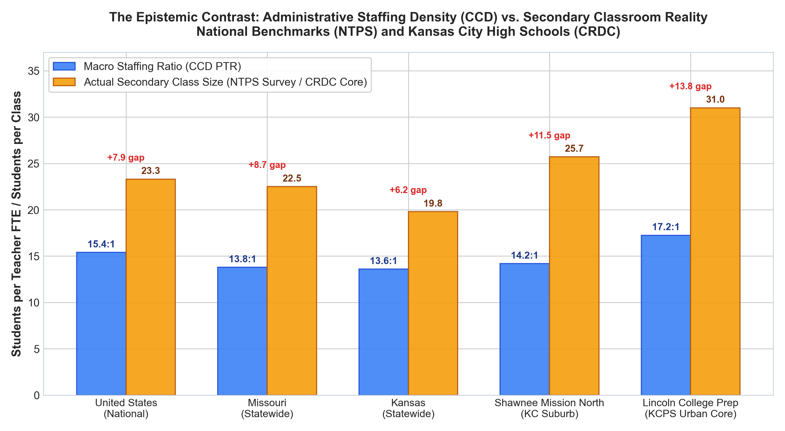
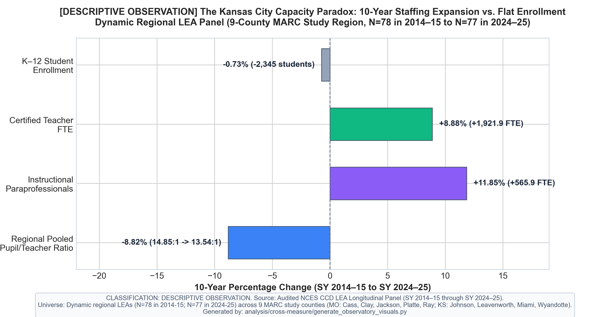
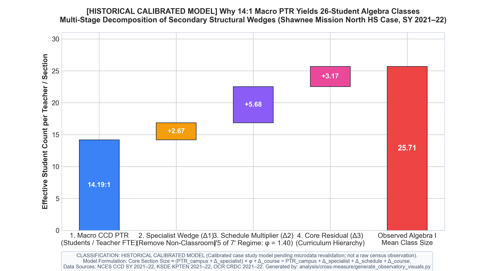

# Measure Dossier: EDU-001 — Pupil / Teacher Ratio (PTR)

> **Observatory Standard:** Pupil/Teacher Ratio (PTR) is a macro-level administrative measure of teacher staffing density. It measures the total count of enrolled students divided by the full-time equivalent (FTE) count of reported classroom teachers employed by a school or district. This dossier re-audits `EDU-001` from its now-audited, frozen numerator ([`EDU-002 Student Headcount Enrollment`](../EDU-002-student-enrollment/README.md)) and denominator ([`EDU-003 Reported Classroom Teacher FTE`](../EDU-003-total-teacher-fte/README.md)), formalizing its multi-layered aggregation estimands, quantifying the **Campus vs. LEA Allocation Gap**, the **Downward Staffing Stickiness** under enrollment decline, and establishing the empirical and structural bridge between macro PTR and secondary core class sizes.
>
> *Principle: SOURCE → FIELD → OPERATIONALIZATION → MEASURE → UNIVERSE → ESTIMAND → CLAIM.*
> *Rule of thumb: Complete measurement semantics before modeling. Description before explanation.*

---

## 1. Identity & Classification

| Attribute | Specification |
| :--- | :--- |
| **Measure ID** | `EDU-001` |
| **Canonical Name** | Pupil / Teacher Ratio (PTR) |
| **Short Identifier / Slug** | `pupil-teacher-ratio` |
| **Status** | `audited` (**FROZEN / READY FOR CROSS-MEASURE USE**) |
| **Lifecycle Stage** | Epistemic Ladder: `source` $\to$ `field` $\to$ `operationalization` $\to$ `measure` $\to$ `universe` $\to$ `estimand` $\to$ `claim` |
| **Category** | Staffing Capacity |
| **Construct Nature** | Derived Mathematical Construct (Ratio of Headcount Enrollment to Reported Classroom Teacher FTE) |
| **Numerator Measure** | [`EDU-002 Student Headcount Enrollment`](../EDU-002-student-enrollment/README.md) |
| **Denominator Measure** | [`EDU-003 Reported Classroom Teacher FTE`](../EDU-003-total-teacher-fte/README.md) |
| **Associated Operationalizations** | [`PTR-NCES-SCHOOL`](../../registry/operationalizations.csv), [`PTR-NCES-LEA`](../../registry/operationalizations.csv), [`PTR-OBS-K12-ADJUSTED`](../../registry/operationalizations.csv), [`PTR-KSDE-CLASSROOM`](../../registry/operationalizations.csv), [`PTR-KSDE-TOTAL`](../../registry/operationalizations.csv) |
| **Excluded / Contrasting Constructs** | Teacher-Reported Class Size ([`EDU-007`](../../registry/measures.csv)), Derived School-Course Mean Class Size ([`EDU-012`](../../registry/measures.csv)), Student-Weighted Class Size Exposure ([`EDU-014`](../../registry/measures.csv)) |

---

## 2. Definitions & Conceptual Boundaries

### 2.1 Plain-Language Definition
Pupil/Teacher Ratio (PTR) is a macro-level administrative measure of teacher staffing density. It measures the total count of enrolled students divided by the full-time equivalent (FTE) count of reported classroom teachers employed by a school or district.

> [!CAUTION]
> **PTR is NOT Class Size.** A pupil/teacher ratio of 14:1 does **not** mean there are 14 students in a classroom. Secondary course-mean and teacher-reported class-size measures often exceed macro PTR, but the magnitude of the wedge varies substantially by course subject, bell schedule, school grade level, geography, and operationalization.

### 2.2 Formal / Statistical Definition
For an educational observation unit $i$ (school campus or district LEA) in school year $t$:

$$\text{PTR}_{i,t} = \frac{E_{i,t}}{T_{i,t}}$$

Where:
- $E_{i,t}$ is student headcount enrollment (`EDU-002`).
- $T_{i,t}$ is reported classroom teacher FTE (`EDU-003`).

### 2.3 Aggregation Rules & Four Distinct Estimands
When examining a collection of schools or districts (e.g., across an LEA, metropolitan region, or state), researchers must choose an estimand based on their specific research question. None of these is inherently "biased"; they answer fundamentally different questions:

$$\begin{aligned}
\text{1. Pooled (Aggregate) PTR:} \quad \overline{\text{PTR}}_{\text{pooled}} &= \frac{\sum_{i=1}^N E_i}{\sum_{i=1}^N T_i} = \sum_{i=1}^N \left(\frac{T_i}{\sum_{j} T_j}\right) \frac{E_i}{T_i} = \sum_{i=1}^N w_i \cdot r_i \\
\text{2. Unweighted Mean School PTR:} \quad \overline{\text{PTR}}_{\text{unweighted}} &= \frac{1}{N}\sum_{i=1}^N \frac{E_i}{T_i} = \frac{1}{N}\sum_{i=1}^N r_i \\
\text{3. Median School PTR:} \quad \text{PTR}_{\text{median}} &= \text{Median}(r_1, r_2, \dots, r_N) \\
\text{4. Student-Weighted PTR Exposure:} \quad \overline{\text{PTR}}_{\text{student-weighted}} &= \sum_{i=1}^N \left(\frac{E_i}{\sum_{j} E_j}\right) \frac{E_i}{T_i}
\end{aligned}$$

| Estimand | Mathematical Nature | Research Question Answered | Kansas City Metro Benchmark (SY 2024–25) |
| :--- | :--- | :--- | :--- |
| **Pooled PTR** ($\frac{\sum E}{\sum T}$) | Teacher-FTE-weighted mean of school PTRs ($w_i = \frac{T_i}{\sum T}$) | *What is the macro teacher staffing density across the entire combined student and teacher population?* | **13.55:1** (Balanced 75 LEA K–12) / **13.54:1** (Dynamic Regional K–12) / **13.72:1** (Regular School Campuses) |
| **Unweighted Mean School PTR** | Simple arithmetic mean across school campuses | *What staffing ratio does the typical public school campus exhibit?* | **12.06:1** (Balanced 75 LEA mean) / **13.36:1** (Regular School Campuses) |
| **Median School PTR** | 50th percentile of campus distribution | *What does the middle school look like in the institutional distribution?* | **12.84:1** (Balanced 75 LEA median) / **13.30:1** (Regular School Campuses) |
| **Student-Weighted PTR Exposure** | Student-enrollment-weighted mean ($\sum E \cdot r / \sum E$) | *What teacher staffing density environment surrounds a randomly selected enrolled student?* | **13.82:1** (Regular School Campuses) |

### 2.4 Unit & Scale
- **Unit of Measurement:** `students_per_fte` (ratio of discrete student count to continuous teacher FTE).
- **Theoretical Range:** $[0, \infty)$.
- **Empirical Realistic Range:** Typically $8.0:1$ to $25.0:1$ in standard regular public schools. Extreme tails ($<6.0:1$ in specialized day centers; $>35.0:1$ in virtual academies) represent distinct institutional delivery models.

---

## 3. Provenance & Operationalization Inventory

The Observatory catalogs multiple distinct operationalizations of `EDU-001` in [`registry/operationalizations.csv`](../../registry/operationalizations.csv):

| Operationalization ID | Implementing Authority | Target Population | Formula / Source Fields | Staff Scope & Completeness |
| :--- | :--- | :--- | :--- | :--- |
| **`PTR-NCES-SCHOOL`** | NCES CCD Non-Fiscal School Universe | All public elementary and secondary schools | $\frac{\text{MEMBER}}{\text{TEACHERS}}$ | **FTE Classroom Teachers.** Excludes librarians, counselors, administrators, and central itinerant staff. |
| **`PTR-NCES-LEA`** | NCES CCD Non-Fiscal LEA Survey | Operating public school districts | $\frac{\sum \text{MEMBER}}{\sum \text{TEACHERS}}$ | **District-Wide Total Teacher FTE.** Includes central-office and itinerant teachers. |
| **`PTR-OBS-K12-ADJUSTED`** | Observatory Research Specification | Regular elementary & secondary schools | $\frac{\text{MEMBER} - \max(0, \text{PK})}{\text{TEACHERS} - \max(0, \text{TEACHERS\_PK})}$ | **K–12 Classroom Staffing.** Deducts Pre-K enrollment and reported Pre-K teachers to avoid early childhood distortion. |
| **`PTR-KSDE-CLASSROOM`** | KSDE KPTEN / CPFS System | Kansas Unified School Districts | $\frac{\text{Headcount}}{\text{FTE Classroom Teachers}}$ | **General Classroom Teachers Only.** Strictly excludes SPED, Title I, and reading specialists. |
| **`PTR-KSDE-TOTAL`** | KSDE KPTEN / CPFS System | Kansas Unified School Districts | $\frac{\text{Headcount}}{\text{FTE Instructional Total}}$ | **Total Instructional Personnel.** Includes specialists and general classroom teachers. |

---

## 4. Scope, Granularity & Temporal Disambiguation

| Dimension | Specification | Notes & Boundary Conditions |
| :--- | :--- | :--- |
| **Target Population** | Public K–12 students and reported classroom teachers | Grade levels and staff scope depend on operationalization |
| **Unit of Observation** | School campus (`NCESSCH`) or LEA District (`LEAID`) | Must distinguish campus reporting from district reporting |
| **Geographic Granularity** | Campus, LEA, County, Metropolitan Region, State, National | 9-county MARC/study region encompasses 5 MO and 4 KS counties |
| **Temporal Granularity** | Annual Fall Snapshot | Collected on or near October 1 of academic year |
| **School Year of Reference (SY)** | `SY 2024–25` (Anchor Year) | **Primary Indexing Dimension** |
| **Collection Snapshot Date** | October 1 of school year | Universal state fall count date |
| **Publication / Release Date** | Provisional: +12 to 14 months; Final: +20 to 24 months | Public availability date |
| **Earliest Available Year** | SY 1986–87 | Continuous digital non-fiscal records |
| **Latest Audited Year** | SY 2024–25 | Audited in KC Education Capacity Study |
| **Expected Update Cadence** | Annual | |

> [!IMPORTANT]
> **Temporal Disambiguation Standard:** Never use an isolated calendar year (e.g., "2024") without specifying whether it denotes the **School Year of Reference** (`SY 2024–25`) or the **Data Publication Release Year** (`2024`). The Observatory strictly indexes all measures by School Year of Reference.

---

## 5. Universe Definitions & Analytical Subsets

> [!NOTE]
> The Observatory preserves unusual observations rather than deleting them. A cyber charter school with a PTR of 70:1, or a specialized therapeutic center with a PTR of 3:1, is valid empirical data about that organizational form, not "dirty data."

### 5.1 Source Universe
All records present in the raw NCES CCD Public School Universe Directory file (`ccd_sch_029_XX_l_1a.csv`), including regular local public schools, special education schools, vocational/technical schools, alternative schools, charter campuses, and state-operated facilities.

### 5.2 Mathematical Validity Requirements
To compute a mathematically defined ratio:
- $E_{i,t} \ge 0$ and $T_{i,t} > 0$.
- All negative missing/suppression codes (`-1`, `-2`, `-9`) mapped to `NaN`.
- Records where $T_{i,t} = 0$ with $E_{i,t} > 0$ are classified as `validity_failure_zero_denominator` and evaluated for staff non-reporting.

### 5.3 Core Analytical Universes
1. **`KC_BALANCED_LEA_75` (Longitudinally Balanced Cohort, $N=75$):**
   Continuously operating public LEAs whose physical school campuses fall entirely within the 9-county MARC/study region present in both 2014–15 and 2024–25 endpoint files. Authoritative panel for 10-year trend and capacity growth calculations.
2. **`KC_DYNAMIC_REGIONAL_LEA` (Dynamic Contemporary Panel, $N=78 \to 77$):**
   Operating public LEAs within the region in each respective school year, reflecting contemporaneous system boundaries.
3. **`KC_FULLY_REGIONAL_CURRENT_77` (Current Regional Snapshot, $N=77$):**
   All 77 operating public LEAs (21 KS, 56 MO) whose physical campuses fall entirely within the 9-county study region in SY 2024–25.
4. **`KC_DECLINING_UNCHANGED_COUNT_28` (Declining LEA Cohort, $N=28$):**
   LEAs in `KC_BALANCED_LEA_75` experiencing negative 10-year enrollment change with zero net change in operating school count (132 schools).
5. **`KC_REGULAR_PTR_ACTIVE_616` (Active Regular School Campus Universe, $N=616$):**
   Operating regular public schools (`is_operating == True` and `school_type == 'Regular School'`) located in the 77 fully regional LEAs with non-zero K–12 enrollment and reported classroom teacher FTE. Authoritative cross-sectional campus distribution panel.

---

## 6. Staff Semantics & Structural Class-Size Modeling

Why does an educational system with a 14:1 pupil/teacher ratio exhibit secondary core course rosters (e.g. Algebra I) averaging 19 to 26+ students? In the Kansas City Education Capacity Study, empirical evidence demonstrated that macro PTR and classroom section sizes are fundamentally distinct constructs linked through a multi-stage production model.

Critically, **the campus-vs-LEA reporting gap is an operationalization reconciliation, not an additive classroom delivery mechanism**. The model separates reporting reconciliation from classroom deployment:

### Stage A: Reporting Reconciliation ($\text{PTR}_{\text{LEA}} \to \text{PTR}_{\text{campus}}$)
The ratio begins with the unit of observation. At the LEA level:
$$\text{PTR}_{\text{LEA}} = \frac{\sum E_{\text{LEA}}}{\sum T_{\text{LEA}}}$$
When moving to school building rosters, campus-aggregate PTR differs:
$$\text{PTR}_{\text{campus}} = \frac{\sum E_{\text{campus}}}{\sum T_{\text{campus}}} = \text{PTR}_{\text{LEA}} + \Delta_{\text{reconciliation}}$$

In SY 2024–25 across the 77 regional LEAs, $\text{PTR}_{\text{campus}} = 13.81$ vs $\text{PTR}_{\text{LEA}} = 13.57$. Thus, **LEA pooled PTR is 0.24 students/FTE lower than campus-aggregate PTR ($-1.74\%$ relative to campus). Equivalently, campus aggregate PTR exceeds LEA PTR by 0.24**.

An arithmetic decomposition demonstrates the mechanism:
- Holding the teacher denominator constant at the campus level ($23,819.77$), the LEA enrollment gap ($+1,472$ students) pushes PTR up by $+0.0618$ students/FTE.
- Holding the student numerator constant at the campus level ($328,884$), the LEA teacher denominator gap ($+518.49$ FTE) pushes PTR down by $-0.2942$ students/FTE.
- **The teacher-denominator difference is the dominant arithmetic contributor** to the lower LEA PTR (net difference $\approx -0.2324 \approx -0.24$). While central-office coordinators and itinerant specialists are candidate mechanisms, the exact personnel role composition of the additional LEA-reported FTE remains unresolved pending role-level state personnel microdata.

### Stage B: General Classroom Staffing Base ($\Delta_{\text{specialist}}$)
Campus classroom teacher counts reported in federal CCD surveys represent personnel reported under the state's classroom-teacher definition. In systems where certified reading specialists, special education resource teachers, or pull-out interventionists are pooled into classroom teacher totals, the general roster-heading faculty is smaller than reported $T$, shifting the base staffing density:
$$\text{PTR}_{\text{adjusted}} = \text{PTR}_{\text{campus}} + \Delta_{\text{specialist}}$$
In the Shawnee Mission North calibration case, removing non-general roster specialists shifted the effective base by $\Delta_{\text{specialist}} \approx +2.67$ students/FTE.

### Stage C: Master Schedule Multiplier ($\phi$)
Contractually protected non-instructional planning time means secondary teachers instruct students for only a fraction of daily bell periods. If students take $P_{\text{student}}$ periods per day and teachers instruct $P_{\text{teacher}}$ periods:
$$\phi = \frac{P_{\text{student}}}{P_{\text{teacher}}}$$
Under a standard secondary "5 of 7" period regime, $\phi = \frac{7}{5} = 1.400$. The daily period contact load is multiplicative:
$$\text{Period Contact Load} = \text{PTR}_{\text{adjusted}} \times \phi = \text{PTR}_{\text{adjusted}} + \Delta_{\text{schedule}}$$
where the additive schedule contribution is explicitly defined as:
$$\Delta_{\text{schedule}} = \text{PTR}_{\text{adjusted}} \times (\phi - 1)$$
In the Shawnee Mission North calibration case ($\text{PTR}_{\text{adjusted}} = 16.86$, $\phi = 1.400$), $\Delta_{\text{schedule}} = 16.86 \times 0.400 \approx +6.74$ students per period.

### Stage D: Curricular Allocation Residual ($\Delta_{\text{course}}$)
High school master schedules allocate student enrollments unevenly across course subjects. Low-enrollment specialized electives, upper-level AP/IB seminars, and small remediation sections structurally force core gateway sections (Algebra I, Biology, 9th Grade English) to absorb higher enrollments to balance building rosters:
$$\text{Observed Core Section Size} \approx (\text{PTR}_{\text{campus}} + \Delta_{\text{specialist}}) \times \phi + \Delta_{\text{course}}$$
Equivalently in additive terms:
$$\text{Observed Core Section Size} \approx \text{PTR}_{\text{campus}} + \Delta_{\text{specialist}} + \Delta_{\text{schedule}} + \Delta_{\text{course}}$$
where $\Delta_{\text{schedule}} = (\text{PTR}_{\text{campus}} + \Delta_{\text{specialist}}) \times (\phi - 1)$. In the Shawnee Mission North case, $\Delta_{\text{course}} \approx +2.11$ yielded an observed Algebra I mean of $25.71$.

---

## 7. Semantic Auditing: The Epistemic Defense

### 7.1 What Question Does PTR Legitimately Answer?
1. **Systemic Teacher Staffing Density:** How many reported classroom teachers does an educational system employ relative to its student body?
2. **Longitudinal Resource Allocation Trends:** Did a district or region actively expand teaching payroll over a decade, independent of student enrollment growth?
3. **Macro Fiscal Capacity Baseline:** What is the macro staffing burden carried by the operating fund?

### 7.2 What Question Does PTR NOT Answer?
1. **Classroom Congestion / Roster Size:** It does **not** reveal how many students are sitting in 3rd period Geometry.
2. **Teacher Daily Workload / Contact Load:** It does **not** indicate how many unique student papers, grades, and parent communications a secondary teacher manages daily.
3. **Student Peer Exposure:** It does **not** reflect the classroom environment experienced by an average child during instructional time.

### 7.3 Judicial Evidentiary Validation (*Jenkins v. Missouri*)
In *Jenkins v. Missouri* (639 F. Supp. 19 [W.D. Mo. 1985], aff'd 890 F.2d 65 [8th Cir. 1989]), Federal District Judge Russell G. Clark addressed the severe misinterpretation of aggregate teacher counts:
- The State of Missouri argued that Kansas City Missouri School District (KCMSD) maintained low pupil/teacher ratios and therefore possessed adequate instructional capacity.
- The court rejected this defense, demonstrating through evidentiary exhibits that counting total reported instructional staff disguised regular classroom crowding. In Grades 1–3, Chapter I remediation programs deployed two teachers per room in 58 classes (116 teachers), masking the fact that regular classes averaged $26.55$ students rather than the headline ratio of $22.14$ (KCMSD Ex. K-56).
- In secondary schools, Judge Clark established binding remedial ceilings: elementary classes were capped at 22 (K–3) and 27 (4–6), while secondary teachers were restricted to a maximum daily student load of 125 students across 5 teaching periods (KCMSD Ex. K-58, K-59).
- In 1997 (*Jenkins*, 959 F. Supp. 1151), the court observed that while building-level staffing ratios hovered between $8.6$ and $18.4$, regular elementary classes commonly enrolled 22–28 students, and high school teachers routinely instructed 135–140 students daily.

---

## 8. Initial Empirical & Descriptive Sanity Checks

### 8.1 Active Regular Campus Distribution ([`KC_REGULAR_PTR_ACTIVE_616`](../../registry/universes.csv), SY 2024–25)

| Grade Level | Valid Campuses | Min PTR | Q25 PTR | Median PTR | Mean PTR | Q75 PTR | Max PTR | Pooled PTR |
| :--- | :---: | :---: | :---: | :---: | :---: | :---: | :---: | :---: |
| **Primary (Elementary)** | 391 | 4.24 | 11.45 | 12.95 | 12.85 | 14.18 | 32.43 | **12.86** |
| **Middle (Junior High)** | 122 | 4.44 | 12.32 | 13.40 | 13.21 | 14.28 | 19.50 | **13.35** |
| **High (Secondary)** | 101 | 5.55 | 13.06 | 15.09 | 15.46 | 16.72 | 91.52 | **15.43** |
| **Other / Combined** | 2 | 4.45 | 10.29 | 16.14 | 16.14 | 21.98 | 27.82 | **19.51** |
| **All Regular Schools (`KC_REGULAR_PTR_ACTIVE_616`)** | **616** | **4.24** | **11.82** | **13.30** | **13.36** | **14.65** | **91.52** | **13.72** |

### 8.2 Outlier Triage & Delivery Model Identification
- **Low Ratio Outliers ($\text{PTR} < 6.0$, $N=6$):** Confirmed specialized therapeutic and alternative campuses (e.g., Gillis Campus, Marillac School, Day Treatment Centers).
- **High Ratio Outliers ($\text{PTR} > 35.0$, $N=2$):** Confirmed virtual academies (e.g., Missouri Virtual Academy, Kansas Virtual Academy) where digital course management software enables high student-to-teacher caseloads.

### 8.3 Machine-Readable Claims Ledger Summary ([`analysis/results/claims.csv`](../../analysis/results/claims.csv))

Every headline empirical claim for `EDU-001` is formally generated by code and registered in the machine-readable claims ledger:

| Claim ID | Universe ID | Estimand | Reference Period | Start Value | End Value | Net Change | % Change | Epistemic Status |
| :--- | :--- | :--- | :---: | :---: | :---: | :---: | :---: | :--- |
| **`CLM-PTR-001`** | `KC_BALANCED_LEA_75` | 10-Year Balanced Pooled K-12 Pupil/Teacher Ratio Compression | 2014–15 to 2024–25 | $14.85$ | $13.55$ | $-1.30$ | **$-8.75\%$** | `audited_fact` |
| **`CLM-PTR-001-DYN`** | `KC_DYNAMIC_REGIONAL_LEA` | Dynamic Regional Pooled K-12 Pupil/Teacher Ratio Trajectory | 2014–15 to 2024–25 | $14.85$ | $13.54$ | $-1.31$ | **$-8.82\%$** | `audited_fact` |
| **`CLM-PTR-002`** | `KC_DECLINING_UNCHANGED_COUNT_28` | Declining LEA Downward PTR Compression (Unchanged School Count) | 2014–15 to 2024–25 | $14.02$ | $13.34$ | $-0.68$ | **$-4.85\%$** | `audited_fact` |
| **`CLM-PTR-003`** | `KC_FULLY_REGIONAL_CURRENT_77` | Regional Campus vs LEA Total Membership Pooled PTR Allocation Gap | 2024–25 | $13.81$ | $13.57$ | $-0.24$ | **$-1.74\%$** | `audited_fact` |

---

## 9. Visual Evidence Packet

The Observatory maintains four visual artifacts for `EDU-001`, documenting its provenance, structural decomposition, longitudinal trajectory, and secondary course contrast:

### Figure 1: Illustrative Cross-Source Comparison — Macro PTR vs. Secondary Classroom Reality

- **Classification:** `CROSS-SOURCE COMPARISON`
- **Purpose:** Illustrate that administrative staffing ratios (CCD) systematically sit below secondary course section sizes and teacher-reported class sizes across multiple jurisdictions.
- **Provenance by Bar:**
  1. *United States (National):* Macro PTR = **15.4:1** (NCES Digest of Education Statistics 2022, Table 208.20, SY 2020–21). Secondary Departmentalized Class Size = **23.3** (NCES NTPS 2017–18 Table A-7a; 2020–21 NTPS published at 21.0).
  2. *Missouri (Statewide):* Macro PTR = **13.8:1** (CCD SY 2020–21). High School Class Size = **22.5** (NTPS 2017–18 Table A-7a).
  3. *Kansas (Statewide):* Macro PTR = **13.6:1** (CCD SY 2020–21). High School Class Size = **19.8** (NTPS 2017–18 Table A-7a).
  4. *Shawnee Mission North HS (KC Suburb):* Macro PTR = **14.2:1** (CCD SY 2021–22). Algebra I Mean Class Size = **25.7** (CRDC SY 2021–22 course enrollment / classes).
  5. *Lincoln College Prep (KCPS Urban Core):* Macro PTR = **17.3:1** (CCD SY 2021–22). Geometry Mean Class Size = **31.0** (CRDC SY 2021–22 course enrollment / classes).
- **Generator Script:** [`analysis/cross-measure/generate_observatory_visuals.py`](../../analysis/cross-measure/generate_observatory_visuals.py)

---

### Figure 2: The Kansas City 10-Year Capacity Paradox (SY 2014–15 to SY 2024–25)

- **Classification:** `DESCRIPTIVE OBSERVATION`
- **Purpose:** Document the longitudinal divergence between flat student enrollment ($-0.73\%$ dynamic, $-0.64\%$ balanced) and expanding instructional staffing ($+8.88\%$ reported classroom teacher FTE, $+11.85\%$ instructional paraprofessionals [provisional]), which drove regional pooled PTR down from $14.85:1$ to $13.55:1$ ($-8.75\%$).
- **Source:** Audited NCES CCD LEA Longitudinal Panel (`kc_lea_capacity_long_2014_15_2024_25.csv`).
- **Generator Script:** [`analysis/cross-measure/generate_observatory_visuals.py`](../../analysis/cross-measure/generate_observatory_visuals.py)

---

### Figure 3: Multi-Stage Waterfall Decomposition (Shawnee Mission North Case)

- **Classification:** `HISTORICAL CALIBRATED MODEL`
- **Purpose:** Demonstrate how the Specialist Adjustment ($\Delta_{\text{specialist}} = +2.67$), Schedule Multiplier ($\phi = 1.400$, $\Delta_{\text{schedule}} = +5.68$), and Curricular Hierarchy Residual ($\Delta_{\text{course}} = +3.17$) bridge the gap between a $14.19:1$ macro PTR and an observed $25.71$ Algebra I class size in a calibrated case study.
- **Generator Script:** [`analysis/cross-measure/generate_observatory_visuals.py`](../../analysis/cross-measure/generate_observatory_visuals.py)

---

### Figure 14: The Secondary Staffing Wedge — CRDC Course Roster Sizes vs. School Macro PTR

- **Classification:** `CROSS-SOURCE CONTRAST & STRUCTURAL DECOMPOSITION`
- **Purpose:** Direct empirical comparison of building-level macro PTR against derived mean class sizes in Algebra I, Geometry, and Biology across 101 regular operating high schools.
- **Findings:** Mean Algebra I class size ($19.28$) exceeds mean high school PTR ($14.76$) by **$+4.53$ students ($+30.66\%$)**, providing large-sample empirical confirmation of the secondary staffing wedge.
- **Generator Script:** [`analysis/cross-measure/generate_edu003_visuals.py`](../../analysis/cross-measure/generate_edu003_visuals.py)

---

## 10. Observatory Usage & Status

- **Observatory Role:** `Contextual Background Metric` (Systemic Investment Layer).
- **Prohibited Use:** Prohibited as a standalone measure of student classroom exposure, class size, or teacher workload.
- **Mandatory Presentation Disclaimer:**
  > *"Pupil/Teacher Ratio measures total system teacher staffing density (reported classroom teacher FTE). It does not reflect individual classroom class sizes. Secondary course-mean and teacher-reported class-size measures often exceed macro PTR, but the magnitude varies substantially by course, schedule, school type, geography, and operationalization."*
- **Dossier Audit History:**
  - `2026-09-26`: Initial calibration dossier drafted.
  - `2026-09-26 (Task 002B)`: Audited against authoritative NCES documentation; aggregation semantics corrected to Pooled PTR; four-tier universe implemented; visual evidence provenance codified.
  - `2026-09-26 (Task 005)`: Re-audited and synthesized from frozen `EDU-002` (numerator) and `EDU-003` (denominator); 7-layer architecture codified; 4 machine-readable claims formalized in `claims.csv` (`CLM-PTR-001`, `CLM-PTR-001-DYN`, `CLM-PTR-002`, `CLM-PTR-003`); Balanced 75 cohort reconciled ($14.85:1 \to 13.55:1$, $-1.30$, $-8.75\%$); Dynamic regional series synchronized ($14.85:1 \to 13.54:1$, $-1.31$, $-8.82\%$); downward staffing stickiness quantified across 28 declining LEAs ($14.02:1 \to 13.34:1$, $-0.68$, $-4.85\%$); campus vs. LEA allocation gap quantified ($-0.24$, $-1.74\%$ relative to campus); Figure 14 added to visual packet.
  - `2026-09-26 (Task 005A)`: Semantic and model integrity patch: synchronized CLM-PTR-003 sign convention (LEA pooled PTR is 0.24 lower than campus PTR, $-1.74\%$ relative to campus); documented teacher-denominator difference as dominant arithmetic driver of the gap; restored EDU-003 teacher staffing density semantics; restructured wedge model separating reporting reconciliation from classroom deployment; corrected Figure 3 labels and re-classified as historical calibrated model; registered `KC_REGULAR_PTR_ACTIVE_616` and reconciled grade-band table to $N=616$ (including 2 Other/Combined); updated disclaimer removing blanket class size claims. Status confirmed: **AUDITED / FROZEN / READY FOR CROSS-MEASURE USE**.
