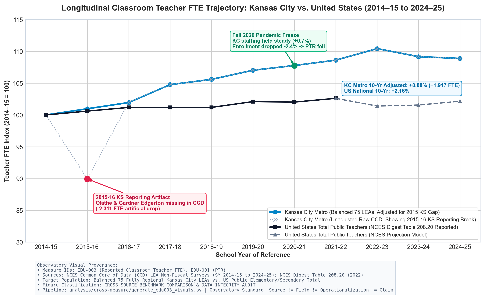
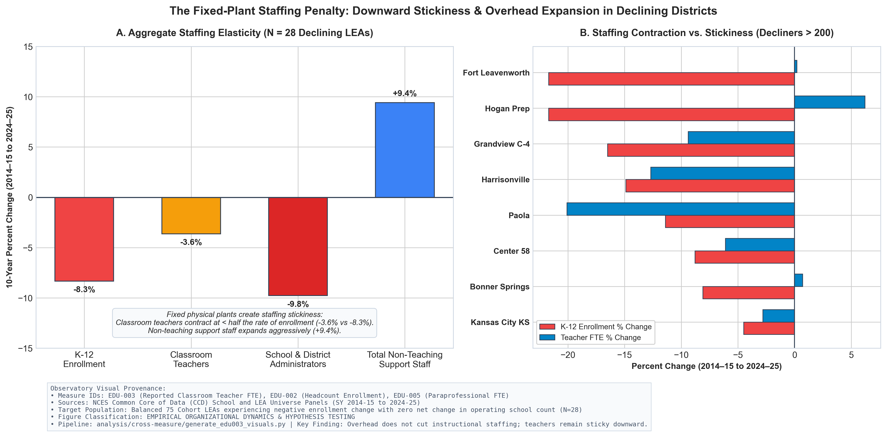
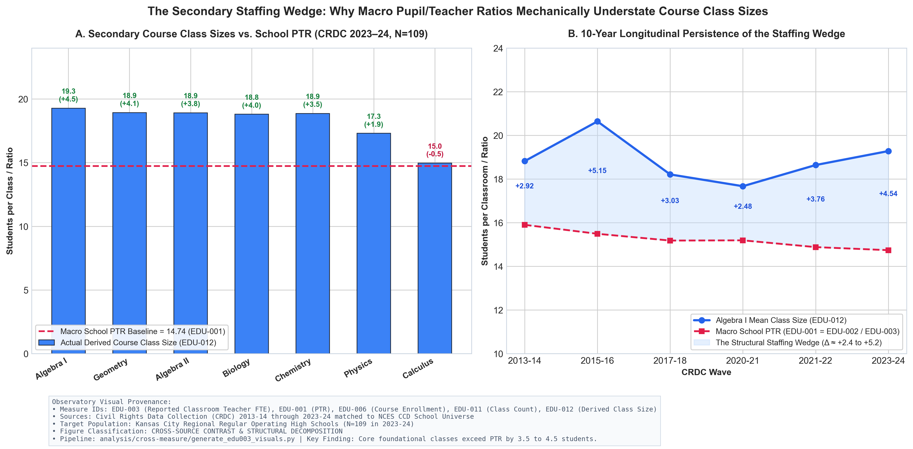

# Measure Dossier: EDU-003 — Reported Classroom Teacher FTE

> **Observatory Standard:** Every measure in the Education Data Observatory must maintain a complete dossier prior to empirical correlation, indexing, or dashboard presentation. The durable research unit is the **measure**, connected to external sources via explicit **operationalizations**.
> 
> *Principle: Source ≠ Field ≠ Operationalization ≠ Measure ≠ Claim.*
> *Rule of thumb: Complete measurement semantics before modeling. Description before explanation.*

---

## 1. Identity & Classification

| Attribute | Specification |
| :--- | :--- |
| **Measure ID** | `EDU-003` |
| **Canonical Human-Readable Name** | Reported Classroom Teacher FTE |
| **Short Identifier / Slug** | `reported-classroom-teacher-fte` |
| **Status** | `audited` |
| **Lifecycle Stage** | `stage_4_measure` $\to$ `stage_5_description` $\to$ `stage_6_validation` (Epistemic Ladder) |
| **Category** | Staffing Capacity |
| **Construct Nature** | Directly Reported Administrative Full-Time Equivalent (FTE) |
| **Associated Operationalizations** | [`TCH-NCES-SCHOOL-CLASSROOM`](../../registry/operationalizations.csv), [`TCH-NCES-LEA-K12`](../../registry/operationalizations.csv), [`TCH-NCES-LEA-TOTAL`](../../registry/operationalizations.csv), [`TCH-KSDE-CLASSROOM`](../../registry/operationalizations.csv) |
| **Dossier Path** | `measures/EDU-003-total-teacher-fte/README.md` |

---

## 2. Definitions & Conceptual Boundaries

### 2.1 Plain-Language Definition
Reported Classroom Teacher FTE represents the full-time equivalent quantity of classroom teaching staff reported by public schools and local education agencies under the federal National Center for Education Statistics (NCES) Common Core of Data (CCD) definition. It serves as the standard administrative denominator in headline pupil/teacher ratios (`EDU-001`). In federal reporting, this field excludes librarians, guidance counselors, school nurses, paraprofessionals, and administrators. However, whether and how specific specialist roles (such as reading interventionists, Title I teachers, or special education resource teachers) are included depends on individual state personnel classification practices.

### 2.2 Formal / Statistical Definition
For an educational entity $i$ (campus or LEA) in school year $t$:

$$\text{TeacherFTE}_{i,t} = \sum_{k \in \mathcal{K}_{i,t}} w_{k,i,t} \cdot \mathbf{1}[k \text{ reported under NCES CCD classroom teacher definition}]$$

where:
- $\mathcal{K}_{i,t}$ is the set of personnel employed by entity $i$ in school year $t$.
- $w_{k,i,t} \in (0.0, 1.0]$ is the contract full-time equivalency of individual employee $k$ allocated to entity $i$.
- $\mathbf{1}[\cdot]$ is an administrative classification indicator that evaluates to $1$ if the employee is classified under the state reporting guidelines as a classroom teacher and $0$ if classified under non-teaching, administrative, or auxiliary assignments.

At the LEA level in the NCES CCD Non-Fiscal Survey, teacher FTE is reported both in the aggregate (`TEACHERS_TOTAL`) and partitioned by reported grade band:

$$\text{TeacherFTE}_{i,t}^{\text{K12}} = \text{TEACHERS\_KG}_{i,t} + \text{TEACHERS\_ELEM}_{i,t} + \text{TEACHERS\_SEC}_{i,t} + \text{TEACHERS\_UNG}_{i,t}$$

$$\text{TeacherFTE}_{i,t}^{\text{TOTAL}} = \text{TeacherFTE}_{i,t}^{\text{K12}} + \text{TEACHERS\_PK}_{i,t}$$

### 2.3 Aggregation Rules & Multiple Estimands
When aggregating instructional labor across campuses to districts, or districts to metropolitan regions, the Observatory distinguishes three valid estimands:

1. **Pooled Regional Estimand (Macro Labor Stock):**
   $$\text{TeacherFTE}_{\text{pooled}, t} = \sum_{i=1}^N \text{TeacherFTE}_{i,t}$$
   *Answers:* What is the total aggregate stock of classroom teaching labor deployed across the educational ecosystem?
2. **Unweighted Entity Mean (Organizational Faculty Scale):**
   $$\overline{\text{TeacherFTE}}_t = \frac{1}{N} \sum_{i=1}^N \text{TeacherFTE}_{i,t}$$
   *Answers:* What is the average faculty FTE of a typical school building or district operating unit?
3. **Median & Distributional Quantiles (Tail Capacity):**
   $$\text{Med}(\text{TeacherFTE}_t), \quad \text{IQR}(\text{TeacherFTE}_t)$$
   *Answers:* What does the median school faculty look like, and how many small facilities operate on small faculties ($\le 15$ FTE) versus large secondary campuses ($>100$ FTE)?

### 2.4 Unit & Scale
- **Unit of Measurement:** Full-Time Equivalents (`fte_teachers`), continuous positive real number.
- **Theoretical Range:** $[0.0, \infty)$.
- **Empirical Realistic Range:**
  - Individual Campus: $1.0$ FTE (small rural school) to $150.0+$ FTE (large suburban high school).
  - Operating LEA: $5.0$ FTE (single-site charter / rural district) to $2,000.0+$ FTE (large suburban or urban unified district).

---

## 3. Provenance & Operationalization Inventory

| Operationalization ID | Implementing Agency / Source | Specific Target Population | Exact Formula / Source Fields | Provenance Tier |
| :--- | :--- | :--- | :--- | :--- |
| `TCH-NCES-SCHOOL-CLASSROOM` | NCES CCD Public Elementary/Secondary School Universe | Public elementary and secondary school campuses | Field `TEACHERS` (FTE Classroom Teachers) | Tier 1 National Administrative Census |
| `TCH-NCES-LEA-K12` | NCES CCD Local Education Agency Universe Survey | Operating LEAs (Types 1, 2, 7) | Sum of `TEACHERS_KG`, `TEACHERS_ELEM`, `TEACHERS_SEC`, `TEACHERS_UNG` (or `TEACHERS_TOTAL` minus `TEACHERS_PK`) | Tier 1 National Administrative Census |
| `TCH-NCES-LEA-TOTAL` | NCES CCD Local Education Agency Universe Survey | Operating LEAs (Types 1, 2, 7) | Field `TEACHERS_TOTAL` (includes Pre-K and centralized teachers) | Tier 1 National Administrative Census |
| `TCH-KSDE-CLASSROOM` | Kansas State Department of Education (KSDE KPTEN / CPFS) | Kansas Unified School Districts (USDs) | Field `FTE_CLASSROOM_TEACHER` (cleanly separates general classroom teachers from special education specialists) | Tier 2 State Disaggregated Personnel Register |

---

## 4. Scope, Granularity & Temporal Disambiguation

| Dimension | Specification | Notes & Boundary Conditions |
| :--- | :--- | :--- |
| **Target Population** | Classroom teachers in public elementary/secondary systems | Personnel reported as classroom teachers under NCES CCD definitions |
| **Unit of Observation** | School Campus (`NCESSCH`) & District LEA (`LEAID`) | Campus counts reflect building assignments; LEA counts include central staff |
| **Geographic Granularity** | Campus $\to$ LEA $\to$ Metropolitan Region $\to$ State $\to$ National | Full hierarchy maintained |
| **Temporal Granularity** | Annual Fall Snapshot | Collected as of October 1 (MO) / September 20 (KS) |
| **School Year of Reference (SY)** | `SY 2014–15` through `SY 2024–25` (11-Year Panel) | **Primary Indexing Dimension.** |
| **Collection Reference Date** | On or near October 1 | Fall staffing count |
| **Publication Release Date** | +12 to +24 months lag | Provisional files followed by final revised census releases |
| **Earliest Available Year** | SY 1986–87 | National CCD series initiation |
| **Latest Audited Year** | SY 2024–25 | Audited Kansas City and National panels |
| **Update Cadence** | Annual | Released annually by NCES and state DOEs |

> [!IMPORTANT]
> **Temporal Disambiguation Standard:** Never use an isolated calendar year (e.g., "2024") without specifying whether it denotes the **School Year of Reference** (`SY 2024–25`) or the **Data Publication Release Year** (`2024`). The Observatory strictly indexes all measures by School Year of Reference.

---

## 5. Universe Definitions & Analytical Subsets

### A. Source Universe
All public educational entities reporting to the NCES Common Core of Data Non-Fiscal surveys in the 9-county Kansas City metropolitan region:
- **SY 2024–25 Campus Panel:** $N = 691$ total educational facilities (678 valid teacher FTE reports, 13 missing, 12 zero-teacher campuses).
- **SY 2024–25 LEA Panel:** $N = 77$ fully regional operating LEAs (56 in Missouri, 21 in Kansas).
- **Longitudinal Balanced Cohort:** $N = 75$ continuously operating regional LEAs observed from SY 2014–15 to SY 2024–25.

### B. Mathematical Validity Requirements
- Non-negative real values: $\text{TeacherFTE} \ge 0.0$.
- Recoding of negative exception codes (`-1` = Missing, `-2` = Not applicable, `-9` = Suppressed) to `NaN`.
- Entity validation flag: `teacher_fte_valid = True` if $\text{TeacherFTE} > 0.0$ and entity is operating.

### C. Entity-Type & Anomaly Flags
- `flag_zero_teacher`: Operating school reporting 0.0 classroom teacher FTE (shared-time CTE centers, alternative programs, contract tuition facilities).
- `flag_reporting_break`: Districts exhibiting artificial administrative step-changes due to state reporting non-response (e.g., Kansas SY 2015–16 CCD non-reporting in Olathe and Gardner Edgerton).
- `flag_charter`: Independent charter LEA operating outside traditional county LEA boundaries.

### D. Recommended Analytic Comparison Universes
1. **Regular Operating School Universe:** Operating regular schools (`school_type == 1`, `operational_status == 1`, `is_operating == True`, $\text{Enrollment} \ge 10$).
2. **Balanced 75 Longitudinal LEA Universe:** Continuously operating regional districts with consistent geographic boundaries from 2014–15 to 2024–25.
3. **Secondary Comprehensive High School Universe:** Operating regular high schools offering standard 9–12 comprehensive course schedules ($N=109$ in CRDC 2023–24).

---

## 6. Known Source Distortions & Organizational Sensitivity

### 6.1 The 2015–16 Kansas CCD Non-Reporting Anomaly
> [!WARNING]
> **Major Administrative Reporting Fracture:** In SY 2015–16, the federal NCES CCD LEA and School Non-Fiscal files failed to record teacher staffing for two major school districts in Johnson County, Kansas:
> - **Olathe Unified School District 233 (`LEAID 2010140`):** `teachers_k12_fte = NaN` (missing ~1,940 teacher FTE; 55 of 59 campuses unrecorded in CCD).
> - **Gardner Edgerton School District 231 (`LEAID 2006420`):** `teachers_k12_fte = NaN` (missing ~371 teacher FTE).
> 
> This non-reporting created an artificial, single-year administrative drop of **$-2,311$ teacher FTE** in the raw regional panel ($21,583 \to 19,412$ FTE), driving the unadjusted regional macro PTR to an artificial spike of $16.65$. An uncritical longitudinal analysis would falsely diagnose a catastrophic teacher shortage in 2015. While state-level historical reporting records ongoing district operations, the Observatory displays raw reported CCD data with an explicit non-reporting marker alongside an illustrative linear interpolation line `(2014-15 + 2016-17) / 2` to demonstrate the underlying smooth trajectory without asserting unregistered replacement values.

### 6.2 Pre-K Inclusion & State Reporting Asymmetry (MO vs. KS)
When reconciling campus-sum teacher FTE with LEA-reported teacher FTE across the 77 regional districts in SY 2024–25:
- **Campus Sum:** $23,819.77$ FTE
- **LEA K-12 Reported:** $23,555.17$ FTE (Net gap: $-264.60$ FTE, $-1.12\%$)
- **LEA Total Reported (incl Pre-K):** $24,338.26$ FTE (Net gap: $+518.49$ FTE, $+2.13\%$)

This divergence is driven by distinct state reporting mechanics:
- **Missouri ($N=56$ LEAs):** Campus-level `classroom_teacher_fte` reports classroom teachers physically assigned to buildings, including early-childhood/Pre-K teachers ($455.42$ Pre-K teacher FTE). Consequently, Campus Sum ($13,742.85$) exceeds LEA K-12 reported ($13,350.66$) by $392.19$ FTE. When comparing Campus Sum to LEA *Total* Reported ($13,806.08$), the reconciliation difference across all 56 Missouri districts is only **$+63.23$ FTE (+0.46%)**.
- **Kansas ($N=21$ LEAs):** LEA Total Reported ($10,532.18$ FTE) exceeds Campus Sum ($10,076.92$ FTE) by **$+455.26$ FTE (+4.32%)**. This descriptive reporting gap is consistent with centrally or non-building-assigned instructional personnel (e.g. traveling art, music, physical education, and special education teachers carried on district-level master payrolls rather than assigned to individual campus school codes). In the absence of a registered role-level KPTEN reconciliation dataset, this compositional explanation is treated as a plausible organizational mechanism rather than an independently verified census fact.

---

## 7. Semantic Auditing: Legitimate vs. Illegitimate Inferences

```
           +-------------------------------------------------------+
           |                 NCES CCD RAW FIELD                    |
           |             TEACHERS (Classroom FTE)                  |
           +-------------------------------------------------------+
                                      |
                                      v
           +-------------------------------------------------------+
           |                EDU-003 MEASURE LEVEL                  |
           |          Aggregate Instructional Labor Stock           |
           +-------------------------------------------------------+
                                      |
         +----------------------------+----------------------------+
         |                                                         |
         v                                                         v
+----------------------------------+     +----------------------------------+
|      LEGITIMATE INFERENCES       |     |     ILLEGITIMATE INFERENCES      |
+----------------------------------+     +----------------------------------+
| • Aggregate labor capacity       |     | • Actual student class size      |
| • Macro staffing density (PTR)   |     | • Daily student roster load      |
| • Inter-district labor shocks    |     | • Teacher planning/prep time     |
| • Downward staffing elasticity   |     | • Subject-specific shortages     |
+----------------------------------+     +----------------------------------+
```

### 7.1 What Question Does This Measure Legitimately Answer?
1. **Total Instructional Labor Supply:** How many full-time equivalent classroom teaching positions are reported under the NCES CCD teacher definition by a school or district?
2. **Macro Staffing Elasticity:** When student enrollment contracts or expands over a decade, how responsively does the instructional workforce scale relative to enrollment?
3. **Cross-Sector Labor Comparisons:** How does aggregate instructional staffing density compare between traditional unified districts and charter school networks operating within the same urban core?

### 7.2 What Question Does This Measure NOT Answer?
1. **Actual Class Size Experienced by Students (`EDU-014`):** Classroom Teacher FTE cannot measure how many students sit in a third-grade room or an Algebra I section. Due to teacher planning periods, block scheduling, and specialized pull-out instruction, class size is systematically larger than pupil/teacher ratio.
2. **Teacher Daily Roster Load:** Does not measure how many total unique students a secondary teacher instructs across a full school day (e.g. 5 periods $\times$ 28 students $= 140$ students/day).
3. **Core vs. Specialist Allocation (`EDU-004`):** NCES CCD `TEACHERS` aggregates general classroom teachers, special education resource teachers, and reading interventionists into a single number. State personnel registers (e.g. KSDE KPTEN) are required to separate general classroom teachers from specialists.

### 7.3 Known Transformations & The Secondary Staffing Wedge
To bridge `EDU-003` to classroom-level exposure, the Observatory specifies the structural schedule decomposition:

$$\text{ClassSize}_{\text{core}} = \left( \frac{\text{Enrollment}}{\text{TeacherFTE}} \right) \times \left( \frac{\text{Periods}_{\text{student}}}{\text{Periods}_{\text{teacher}}} \right) + \Delta_{\text{specialist}} + \Delta_{\text{elective\_wedge}}$$

Empirically in Kansas City regular high schools (CRDC 2023–24, $N=109$ regular campuses):
- Mean School PTR ($\text{Enrollment}/\text{TeacherFTE}$) = **$14.74$**
- Mean Algebra I Derived Class Size (`EDU-012`) = **$19.28$** ($\text{Wedge} = \mathbf{+4.53}$ students)
- Mean Geometry Derived Class Size (`EDU-012`) = **$18.94$** ($\text{Wedge} = \mathbf{+4.06}$ students)
- Mean Biology Derived Class Size (`EDU-012`) = **$18.81$** ($\text{Wedge} = \mathbf{+3.96}$ students)

> [!NOTE]
> The persistent positive gap between core course mean sizes and school PTR is **consistent with** the previously calibrated specialist/schedule/course-allocation model, but is not proved by this bivariate comparison alone.

---

## 8. Relational Architecture & Validation

### 8.1 Upstream & Downstream Relationships
- **Upstream Inputs:** Raw personnel filings (`TEACHERS` in CCD; `FTE_CLASSROOM_TEACHER` in state registers).
- **Downstream Measures:**
  - `EDU-001` (Pupil / Teacher Ratio): $\text{EDU-001} = \text{EDU-002} / \text{EDU-003}$.
  - `EDU-012` (Derived School-Course Mean Class Size): Calibrated empirical modeling via secondary schedule multipliers.

### 8.2 Candidate External Validation Sources
1. **Civil Rights Data Collection (CRDC):** Matched school-level course enrollment and section counts validating teacher deployment.
2. **KSDE Licensed Personnel Register (KPTEN):** State administrative register cleanly separating general classroom teachers from specialists.
3. **National Teacher and Principal Survey (NTPS):** Teacher-reported survey benchmarks on teaching assignments and class rosters.

---

## 9. Historical & Institutional Context

### 9.1 The Jenkins v. Missouri Judicial Staffing Standards
In *Jenkins v. Missouri* (639 F. Supp. 19 [W.D. Mo. 1985], aff'd 890 F.2d 65 [8th Cir. 1989]), Federal District Judge Russell G. Clark addressed the severe misinterpretation of aggregate teacher counts:
- The State of Missouri argued that Kansas City Missouri School District (KCMSD) maintained low pupil/teacher ratios and therefore possessed adequate instructional capacity.
- The court rejected this defense, demonstrating through evidentiary exhibits that counting total certified staff disguised regular classroom crowding. In Grades 1–3, Chapter I remediation programs deployed two teachers per room in 58 classes (116 teachers), masking the fact that regular classes averaged $26.55$ students rather than the headline ratio of $22.14$ (KCMSD Ex. K-56).
- In secondary schools, Judge Clark established binding remedial ceilings: elementary classes were capped at 22 (K–3) and 27 (4–6), while secondary teachers were restricted to a maximum daily student load of 125 students across 5 teaching periods (KCMSD Ex. K-58, K-59).
- In 1997 (*Jenkins*, 959 F. Supp. 1151), the court observed that while building-level staffing ratios hovered between $8.6$ and $18.4$, regular elementary classes commonly enrolled 22–28 students, and high school teachers routinely instructed 135–140 students daily.

---

## 10. Initial Empirical & Descriptive Sanity Checks

### 10.1 Range & Distributional Breakdown (SY 2024–25 Regular Schools)

| School Level | Valid N | Min FTE | Q25 FTE | Median FTE | Mean FTE | Q75 FTE | Max FTE | Total FTE Sum |
| :--- | :---: | :---: | :---: | :---: | :---: | :---: | :---: | :---: |
| **Elementary (Primary)** | 385 | 4.8 | 24.0 | 28.5 | 30.6 | 36.3 | 75.3 | 11,768.4 |
| **Middle (Junior High)** | 119 | 10.0 | 38.0 | 47.7 | 48.7 | 59.8 | 93.6 | 5,800.7 |
| **High (Secondary)** | 103 | 1.5 | 33.1 | 61.3 | 63.1 | 93.6 | 148.9 | 6,500.5 |
| **Other / Combined** | 15 | 3.0 | 8.8 | 13.0 | 20.9 | 22.8 | 78.4 | 313.4 |
| **All Regular Schools** | **622** | **1.5** | **25.2** | **33.6** | **39.2** | **50.5** | **148.9** | **24,383.0** |

### 10.2 Zero-Teacher and Missing Facilities Audit (SY 2024–25)
- **Missing Teacher FTE ($N=13$):** Newly opening or reconfigured facilities (e.g. Hickman Mills South Middle, Ervin Early Learning Center, Kansas City Girls Prep High).
- **Zero-Teacher Operating Facilities ($N=12$):** Confirmed legitimate administrative configurations, including shared-time Career & Technical Education centers (e.g. Fort Osage Career & Tech Center, Cass Career Center) and virtual programs with contracted instruction.

---

## 11. Visual Evidence Packet

### Figure 12: National & Regional Teacher FTE Trajectories (2014–15 to 2024–25)


```
Visual Provenance:
• Measure IDs: EDU-003 (Reported Classroom Teacher FTE), EDU-001 (PTR)
• Data Sources: NCES Common Core of Data (CCD) LEA Non-Fiscal Surveys (SY 2014-15 to 2024-25); NCES Digest Table 208.20 (2022)
• Target Population: Balanced 75 Fully Regional Kansas City LEAs vs. US Public Elementary/Secondary Total
• School Years: SY 2014-15 through SY 2024-25 (Annual Snapshot)
• Classification: CROSS-SOURCE BENCHMARK COMPARISON & DATA INTEGRITY AUDIT
• Pipeline Script: analysis/cross-measure/generate_edu003_visuals.py
• Key Finding: Regional teacher staffing expanded +8.88% (+1,917.4 FTE) across the Balanced 75 over a decade while enrollment was flat (+0.10%), outpacing national teacher growth (+2.16%). The raw CCD series exhibits an artificial -2,311 FTE drop in 2015-16 due to Kansas non-reporting in Olathe and Gardner Edgerton; an illustrative linear interpolation line bridges this reporting failure.
```

---

### Figure 13: Downward Staffing Stickiness in Declining Districts


```
Visual Provenance:
• Measure IDs: EDU-003 (Teacher FTE), EDU-002 (Enrollment), EDU-005 (Paraprofessional FTE)
• Data Sources: NCES CCD School and LEA Universe Panels (SY 2014-15 to 2024-25)
• Target Population: Balanced 75 Cohort LEAs experiencing negative enrollment change with unchanged operating school counts (N=28 LEAs)
• School Years: SY 2014-15 vs. SY 2024-25
• Classification: EMPIRICAL ORGANIZATIONAL DYNAMICS & HYPOTHESIS TESTING
• Pipeline Script: analysis/cross-measure/generate_edu003_visuals.py
• Key Finding: In districts losing students but maintaining operating school counts, classroom teachers contract at less than half the rate of enrollment loss (-3.63% vs -8.33%). School/LEA administrators contract proportionally (-9.78%), while total district staff expands (+9.41%). Sensitivity checks on the 25 LEAs with identical NCESSCH sets confirm the exact same stickiness (-3.26% vs -8.00%).
```

---

### Figure 14: The Secondary Staffing Wedge (Macro PTR vs. Course Mean Class Sizes)


```
Visual Provenance:
• Measure IDs: EDU-003 (Teacher FTE), EDU-001 (PTR), EDU-006 (Course Enrollment), EDU-011 (Class Count), EDU-012 (Derived Class Size)
• Data Sources: Civil Rights Data Collection (CRDC) 2013-14 through 2023-24 matched to NCES CCD School Universe
• Target Population: Kansas City Regional Regular Operating High Schools (N=109 in 2023-24)
• School Years: CRDC Waves 2013-14 through 2023-24
• Classification: CROSS-SOURCE CONTRAST & STRUCTURAL DECOMPOSITION
• Pipeline Script: analysis/cross-measure/generate_edu003_visuals.py
• Key Finding: Derived School-Course Mean Class Sizes (EDU-012) in core foundational courses consistently exceed school macro PTR by +3.5 to +4.5 students (Algebra I: 19.28 vs 14.74). This structural wedge persists across all six CRDC waves and is consistent with previously calibrated schedule models.
```

---

## 12. Observatory Usage & Status

- **Observatory Role:** Core descriptive capacity denominator. Essential foundational measure required for all staffing density ratios, fiscal efficiency metrics, and schedule exposure models.
- **Mandatory Presentation Caveats:**
  1. Never present `EDU-003` or its derived ratio `EDU-001` as an indicator of classroom class size without displaying the structural schedule wedge caveat.
  2. In longitudinal displays, annotate the SY 2015–16 Kansas non-reporting anomaly (Olathe/Gardner Edgerton) to prevent false interpretation of teacher workforce contractions.
  3. Specify whether the metric represents building-assigned classroom teachers (`TCH-NCES-SCHOOL-CLASSROOM`), district K–12 instructional labor (`TCH-NCES-LEA-K12`), or district gross staffing (`TCH-NCES-LEA-TOTAL`).
- **Audit History:**
  - `2026-09-26 (Task 004)`: Initial scaffolding, source reconciliation audit, and registration of operationalizations.
  - `2026-09-26 (Task 004A)`: Rigorous semantic and empirical audit: corrected NCES LEA IDs for Olathe (`2010140`) and Gardner Edgerton (`2006420`); audited 2015–16 illustrative interpolation; executed 3 sensitivity specifications on declining districts; corrected total staff labeling error; produced staff coverage matrix; retracted $\ge 35$ FTE Calculus threshold in favor of faculty scale association; audited matched high school cohort; refined charter and secondary wedge terminology; replaced all absolute links with relative paths. Status: `IN PROGRESS / AUDITING`.
