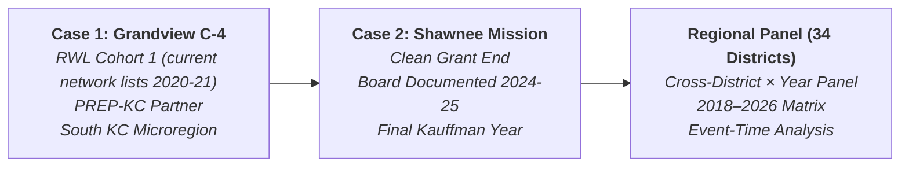

# Real World Learning (RWL) Institutionalization Study

A longitudinal, multi-layered empirical investigation into how externally funded educational reforms are institutionalized, rebranded, or decayed within public school districts across the Kansas City metropolitan area.

---

## 1. Central Research Problem

In 2019, the Ewing Marion Kauffman Foundation initiated the **Real World Learning (RWL)** regional initiative across Greater Kansas City, aiming for every high school student to graduate with at least one **Market Value Asset (MVA)** by 2030 (work-based learning/internships, client-connected projects, industry-recognized credentials, dual college credit, or entrepreneurial experiences). The initiative provided substantial multi-year philanthropic implementation grants, technical assistance, cohort coaching, and intermediary support (via organizations such as PREP-KC).

As district implementation support changes, transitions, or eventually expires, an essential institutional and organizational question emerges. **The timing and terms of those changes are measured variables, not assumed facts; for Grandview C-4 they remain unresolved after Task 001.**

$$\mathbf{PHILANTHROPY} \longrightarrow \mathbf{INCENTIVE} \longrightarrow \mathbf{ADOPTION} \overset{?}{\longrightarrow} \mathbf{INSTITUTIONALIZATION} \lor \mathbf{REBRANDING} \lor \mathbf{DECAY}$$

*When external philanthropic funding and categorical incentives expire or decline, how do public school districts adapt? Do the underlying educational practices persist and become woven into regular operating budgets and operational schedules, do they morph into state-aligned frameworks under new vocabulary, or do they quietly atrophy once compliance and grant oversight subside?*

---

## 2. The 8-Layer Stack of Observable Evidence

Public school district strategy is frequently assumed to exist exclusively behind closed administrative doors. In reality, public school systems operate within a heavily regulated transparency environment, leaving a dense, longitudinal stack of public evidentiary traces.

Rather than relying on superficial keyword counts of "Real World Learning" in board minutes—which conflates governance attention with operational reality—this project establishes an **8-Layer Evidence Stack**:

```mermaid
flowchart TD
    L1["<b>1. Formal Strategy</b><br/><i>Strategic Plans, CSIP (MSIP 6), Board Goals, Superintendent Priorities</i><br/>'We officially declare that this matters.'"]
    L2["<b>2. Governance Attention</b><br/><i>Agendas, Packets, Minutes, Board Briefs, Meeting Transcripts</i><br/>'Leadership actively places this before the governing board.'"]
    L3["<b>3. Resources & Finance</b><br/><i>Operating Budgets, Audits, ASBR, Grant Lines, Vendor Contracts, General Fund Shift</i><br/>'We are willing to commit local tax dollars to this.'"]
    L4["<b>4. Organizational Capacity</b><br/><i>Org Charts, Staff Directories, Coordinator FTEs, Central Office Structure</i><br/>'Identifiable humans are tasked and evaluated on executing this.'"]
    L5["<b>5. Operations & Access</b><br/><i>Course Catalogs, Master Schedules, Shared Pathways, Transportation, Credentials</i><br/>'Students can physically register for and complete these experiences.'"]
    L6["<b>6. Accountability & Evaluation</b><br/><i>KPI Dashboards, MVA Target Reports, Board Evaluations, MSIP 6 APR</i><br/>'Leadership is held publicly accountable for measurable performance.'"]
    L7["<b>7. Public Communication</b><br/><i>District Newsletters, Press Releases, Web Archaeology, Brand Standards</i><br/>'We project this work as central to our institutional identity.'"]
    L8["<b>8. Student Outcomes</b><br/><i>Regional Kauffman MVA Reports, DESE CTE Follow-up, Dual Credit, Grad Rates</i><br/>'Students actually earn credentials, credits, and workplace assets.'"]

    L1 --> L2
    L2 --> L3
    L3 --> L4
    L4 --> L5
    L5 --> L6
    L6 --> L7
    L7 --> L8
```

---

## 3. Beyond Keyword Counting: Three Divergent Trajectories

A mature program can disappear from board meeting agendas not because it failed, but because it succeeded so thoroughly that it became standard operating procedure. Conversely, frequent mentions in superintendent speeches may mask an initiative that possesses no district FTE, no budget allocation, and zero master-schedule course codes.

This project explicitly distinguishes three post-grant trajectories:

| Trajectory | Governance & Strategic Signals | Financial & Staffing Signals | Operational & Outcome Reality |
| :--- | :--- | :--- | :--- |
| **A. Institutionalization** | "Real World Learning" branding may soften, but MVA-aligned goals remain embedded in CSIP/strategic plans. | Local operating funds (Fund 1/General Fund, Perkins V) replace expired foundation grants; coordinator positions become permanent district-funded FTEs. | Internships, client projects, and credentialing pathways remain active in course catalogs; student MVA attainment remains high and stable. |
| **B. Rebranding & Absorption** | Philanthropic terms ("Real World Learning", "MVA") fade; replaced by state accountability language (**Missouri Success-Ready Students Network / SRSN**, **Kansas Post-Graduate Assets**). | Expenditures shift from grant lines to state CTE enhancement funds and regular instructional budgets. | Course pathways and student workplace opportunities expand under state-recognized terminology; philanthropic innovation is assimilated into state policy. |
| **C. Program Decay** | RWL/MVA goals quietly vanish from strategic plan renewals; board reporting ceases; superintendent transitions deprioritize the initiative. | Grant-funded coordinator positions are eliminated; budget lines contract to zero; local tax dollars do not backfill external dollars. | Specialized courses, transportation, and employer partnerships are discontinued; credential attainment drops to baseline pre-grant levels. |

---

## 4. Methodological Tenets & Data Integrity

1. **Non-Reductive Artifact Preservation**: Raw artifacts (agendas, full packets, board briefs, budgets, course catalogs, video transcripts) must be archived in their original format. LLM summaries must never replace source text.
2. **Absolute Traceability**: Every claim, date, dollar figure, and classification must link directly to an immutable source URL, document ID, page number, or video timestamp.
3. **Multi-Source Triangulation**: A claim of institutionalization cannot rest solely on communications materials; it requires financial validation (budget/audit) and operational verification (course catalog/enrollment).
4. **Behavioral Event Taxonomy**: Rather than subjective "pro/anti-RWL" sentiment, observations are encoded using discrete organizational behaviors:
   - `GOAL_SET`, `METRIC_REPORTED`, `PROGRAM_CREATED`, `PROGRAM_EXPANDED`, `PROGRAM_REDUCED`
   - `STAFF_HIRED`, `STAFF_REMOVED`, `FUNDING_ADDED`, `FUNDING_REMOVED`
   - `CONTRACT_APPROVED`, `PARTNERSHIP_CREATED`, `COURSE_ADDED`, `COURSE_REMOVED`
   - `BOARD_ACTION`, `EVALUATION_PRESENTED`, `TARGET_MET`, `TARGET_MISSED`, `REBRANDED`

---

## 5. Comparative Research Design & Roadmap

The project unfolds in structured phases starting with targeted case studies representing distinct grant lifecycle profiles:

### Project Phasing
- **Task 001**: Grandview C-4 Public Evidence Inventory — **audited with acquisition gates open**. Source taxonomy, Simbli census, initial timeline, and public-system inventory exist; grant lifecycle, exact RWL evaluation artifacts, validated Board Brief corpus, and archived personnel snapshots remain Task 002 prerequisites.
- **Task 002**: Automated Corpus Ingestion & Preservation (Agendas, Simbli packets, Board Briefs, Google Drive budgets, DESE MCDS data).
- **Task 003**: Chronological Evidence Matrix Construction (Manual and semi-automated coding of primary events).
- **Task 004**: Multi-Modal Governance Extraction (Transcribe audio/video recordings, extract item-level debate and votes).
- **Task 005**: Comparative Institutionalization Metrics & Panel Scaling.

---

## 6. Task 001 Audit Finding

The first-pass inventory successfully discovered the district information environment, but the audit identified four corrections that materially affect downstream analysis:

1. **Grandview grant status is unresolved.** Current RWL network language still describes Cohort 1 districts, including Grandview, as receiving financial support. The study must establish district-specific award terms before using a post-grant treatment date.
2. **The current strategic plan is 2024–2027, not 2022–2027.** A March 20, 2025 Board Brief reports that the Board approved the current plan on June 20, 2024.
3. **The Edlio Board Brief category is contaminated.** It returns ordinary district news as well as Board Briefs. The harvester now validates content and writes rejected items separately.
4. **Inventory status must describe files actually preserved.** The source registries now distinguish identified sources from archived artifacts and partial/contaminated collections.

See `TASK_001_AUDIT.md` for the completion criteria and Task 002 gates.
