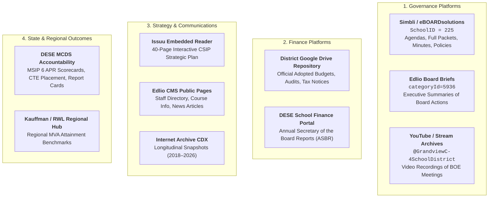
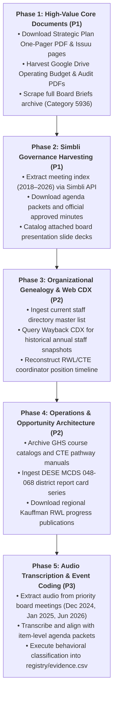

# Grandview C-4 School District (`grandview-c4`)
## Public Evidence Inventory & Institutional Case Profile

---

## 1. District Profile & Institutional Setting

| Attribute | District Specification | Source / Verification |
| :--- | :--- | :--- |
| **Legal Name** | Consolidated School District No. 4 of Jackson County, MO | Missouri DESE Directory |
| **Common Name** | Grandview C-4 School District (`GC-4`) | District Charter & Website |
| **State District Code** | `048-068` (Jackson County 048, District 068) | DESE MCDS Portal |
| **Location** | Grandview, MO (South Kansas City Metropolitan Suburb) | Geographic Boundary Record |
| **Student Enrollment** | $\sim 3,500$ Students (K–12) | NCES CCD / DESE MCDS 2024–25 |
| **Demographic Context** | Majority-minority, high Free/Reduced Lunch ($\sim 75\%+$), Title I Schoolwide | DESE Demographic Profile |
| **Key Regional Intermediary** | **PREP-KC** (Longstanding Urban/Suburban Partner) | PREP-KC Collaborative Roster |
| **RWL Consortium Role** | **Cohort 1 (2019–20 Design / 2020–21 Implementation)**; South KC Microregion | Kauffman Foundation RWL Hub |
| **Microregion Partners** | Center School District (South), Hickman Mills C-1 School District | South KC Chamber / Kauffman |
| **Executive Leadership** | Dr. Stephanie Amaya (Superintendent, July 2026–Present; prev. Asst Supt HR); Dr. Kenny Rodrequiz (Superintendent, 2014–2026) | Grandview Board Briefs & Press Releases |

Grandview C-4 constitutes an optimal foundational case for the study of educational reform institutionalization:
1. **Original Cohort Longevity**: As a Cohort 1 participant in the Kauffman Foundation's Real World Learning initiative, Grandview possesses the longest continuous exposure to the reform ($\sim 2019 \rightarrow 2026$).
2. **Distinct Microregional Strategy**: Rather than operating in isolation, Grandview pooled resources with neighboring South Kansas City districts (Center and Hickman Mills) and intermediary PREP-KC to share pathway courses.
3. **High Governance Transparency**: Grandview publishes meeting documentation across multiple distinct public platforms (Simbli by eBOARDsolutions, Edlio CMS Board Briefs, Google Drive financial repositories, and open YouTube video streams).
4. **Recent Accountability Cadence**: The Board of Education formally conducted a comprehensive program evaluation of Real-World Learning in **December 2024**, and subsequently reaffirmed pathway commitments in **January 2025** and **June 2026**, establishing an empirical paper trail during the exact period of philanthropic funding transitions.

---

## 2. Public Information Environment & Platform Architecture

Grandview C-4 distributes public information across five distinct technological subsystems. Ingestion scripts and evidence collectors must treat these systems separately rather than conflating them under generic "board meetings" or "district website":

---

## 3. Detailed Source Availability by Evidence Layer

### Layer 1: Formal Strategy
- **Current CSIP (2022–2027)**: Formally adopted under Missouri School Improvement Program (MSIP 6) rules. The plan is organized into four strategic pillars: *Success-Ready Students*, *Workforce Excellence*, *Operational Readiness*, and *Climate & Culture*.
  - *Direct One-Pager*: Available as PDF (`https://4.files.edl.io/3a86/08/25/25/160646-bcbc4635-7cd9-4400-a3e8-f4930d61e833.pdf`).
  - *Comprehensive Narrative Document*: Embedded via Issuu interactive reader (`https://e.issuu.com/embed.html?d=gsd_strategicplan_6_hu&u=grandviewc4schools`).
  - *Web Portal*: Landing page with strategic planning committee disclosures (`/apps/pages/index.jsp?uREC_ID=422366&type=d&pREC_ID=1602601`).
- **Historical CSIP (2015–2020)**: Recoverable via Internet Archive Wayback Machine captures from early 2019, providing a pre-Kauffman baseline of district strategic goals.

### Layer 2: Governance Attention
- **Simbli by eBOARDsolutions (`SchoolID = 225`)**:
  - *Meeting Listing*: `https://simbli.eboardsolutions.com/SB_Meetings/SB_MeetingListing.aspx?S=225`.
  - *Packet & Agenda Engine*: `https://simbli.eboardsolutions.com/SB_Meetings/ViewMeeting.aspx?S=225&MID={MID}` (Item-by-item supporting memos, contracts, and presentations).
  - *Board Policy Manual*: `https://simbli.eboardsolutions.com/SB_ePolicy/SB_PolicyOverview.aspx?S=225` (Contains instructional goals, credit requirements, and graduation standards).
- **Board Briefs Archive (`categoryId=5936`)**:
  - Hosted at `https://www.grandviewc4.net/apps/news/category/5936`.
  - Published immediately following regular monthly board meetings. Provides concise summaries of what administration presented and what the board voted to approve.
  - Verified critical meetings:
    - **December 19, 2024**: Program Evaluation of Real-World Learning (metrics: MVA attainment, college prep/placement, career-center enrollment, STEM participation) + 2024 MSIP 6 APR presentation (127.5/200 points, 63.7%).
    - **January 16, 2025**: Real World Learning shared pathways update (cosmetology, graphic design, welding, healthcare, advanced manufacturing with Honeywell).
    - **April 16, 2026**: Appointment of Dr. Stephanie Amaya as Superintendent; Real World Learning affirmed as core strategic priority.
    - **June 18, 2026**: Update on T&L Welding partnership (200 hours coursework, 100% AWS credential completion) + Preliminary 2026–27 Operating Budget adoption.
    - **September 17, 2026**: Review of multi-tier student behavior services and community grant recognitions.
- **Meeting Video Recordings**:
  - Regular open sessions broadcast to YouTube (`@GrandviewC-4SchoolDistrict`) and shared on district media.

### Layer 3: Resources & Finance
- **Budget Web Portal**: `https://www.grandviewc4.net/apps/pages/index.jsp?uREC_ID=422369&type=d&pREC_ID=921542`.
  - Links to public Google Drive files containing full adopted budgets and independent auditor reports.
- **Operating Budgets**:
  - Current Operating Budget PDF: Hosted on Google Drive (`file/d/1Yjyb1bQEa-Y8yckzduMEqgvn4wT0GXku`).
  - Discloses revenue by fund, instructional support line items, and department budgets.
- **Independent Financial Audits**:
  - Current Audit Report PDF: Hosted on Google Drive (`file/d/1WW8ooYFG-AK7jIn7uYEYKD5odJ40w_eI`).
  - Contains Schedule of Expenditures of Federal Awards (SEFA), state grant receipts, and fund balance reconciliations.
- **Tax Rate Hearing Notices**:
  - Current Notice PDF: Hosted on Google Drive (`file/d/132uOjR-xv-ocHec89nFeBJFI0erRc4Jn`).
- **DESE Annual Secretary of the Board Report (ASBR)**:
  - Standardized state financial filings (Revenues and Expenditures across Fund 1 Incidental, Fund 2 Special Revenue/Teachers, Fund 3 Debt Service, Fund 4 Capital Projects).

### Layer 4: Organizational Capacity & Personnel
- **Central Office Administrative Directory**:
  - `https://www.grandviewc4.net/apps/pages/index.jsp?uREC_ID=443656&type=d&pREC_ID=956879`.
  - Maps leadership hierarchy across Curriculum & Instruction, Human Resources, and Operations.
- **Master Staff Directory**:
  - `https://www.grandviewc4.net/apps/staff/`.
  - Dynamic searchable index of certified and classified personnel across all school facilities.
- **Wayback Machine Personnel Snapshots**:
  - Over 50 historical snapshots of `/apps/staff/` between 2018 and 2025 in the Internet Archive, allowing reconstruction of coordinator positions and title migration.

### Layer 5: Operations & Course Pathways
- **Grandview High School Course Planning Guide**:
  - Published by GHS Counseling (`https://ghs.grandviewc4.net/apps/pages/index.jsp?uREC_ID=421053&type=d`).
  - Defines CTE course codes, prerequisites, dual-credit options (via Metropolitan Community College - Longview, UMKC, UCM), and graduation requirements.
- **Advanced Manufacturing Pathway (Honeywell FM&T)**:
  - Hosted directly at Grandview High School in collaboration with the Kansas City National Security Campus. High-grade industrial equipment and teacher externships.
- **T&L Welding Partnership**:
  - Dedicated 200-hour technical coursework resulting in American Welding Society (AWS) industry credentials.
- **Regional Consortium Facilities**:
  - Herndon Career Center (Raytown C-2): Grandview participates as an official sending district for specialized vocational/technical training.
  - Southland CAPS / Summit Technology Academy (Lee's Summit): Access to profession-based immersion courses.

### Layer 6: Communications & Public Identity
- **District News RSS / Article Index**:
  - `/apps/news/` on `grandviewc4.net`.
  - Longitudinal archive of press releases, student showcases, and event recaps.
- **Wayback Machine CDX Index**:
  - 5,000+ snapshots of `grandviewc4.net` cataloged in Internet Archive CDX API from 2018 through 2026.
  - Enables NLP-based lexical evolution analysis (measuring shift from Kauffman "MVA" terminology to MSIP 6 "Success-Ready Students" terminology).

### Layer 7: Outcomes & State Accreditation
- **Missouri Comprehensive Data System (MCDS) - District 048-068**:
  - Annual Performance Report (APR) scoring under MSIP 6.
  - 4-year and 5-year cohort graduation rates.
  - Postsecondary placement rates and 180-day CTE graduate follow-up surveys.
- **Kauffman Regional RWL Reports**:
  - Regional attainment benchmarks (e.g., regional senior MVA attainment rising from 67% in 2023–24 to 79% in 2024–25).

---

## 4. Known Gaps, Access Barriers & Mitigation Strategies

| Evidentiary Barrier | Severity | Description | Mitigation Strategy |
| :--- | :---: | :--- | :--- |
| **CMS User-Agent Filtering** | Medium | Edlio CMS and Cloudflare return 403 Forbidden to standard automated bots and scripts without standard browser headers. | Ingestion scripts configure standard Chrome/Mozilla User-Agent, referer headers, and session cookies (`curl.exe` or `requests.Session`). |
| **Simbli Dynamic Rendering** | Medium | Meeting listing data is populated dynamically via client-side JavaScript calls to `/Services/api/GetMeetingListing` using an encrypted connection token. | Script extracts `meetingCustGrd` and `constr` parameters directly from initial page HTML to issue valid JSON POST requests. |
| **External Google Drive Storage** | Low | High-value budget and audit PDFs are hosted on Google Drive rather than directly on the CMS web server. | Scripts resolve Google Drive file IDs and utilize standard direct download endpoints (`uc?export=download&id={ID}`). |
| **Issuu Document Containment** | Low | The complete 40-page CSIP is embedded in an Issuu reader widget rather than exposed as a single static PDF download link. | Harvest individual page renders via Issuu JSON API or download the companion official one-pager summary PDF. |
| **Video Audio Transcription** | High | Board meeting debate and nuanced spoken exchanges exist only as raw video streams on YouTube without official transcripts. | Pipeline isolates board meeting stream URLs, extracts audio tracks via `yt-dlp`, and processes speech-to-text using Whisper / Gemini audio transcription. |

---

## 5. Recommended Ingestion Sequence

To prevent analytical premature convergence, data ingestion must proceed through five disciplined phases:

---

## 6. Data Integrity & Provenance Protocol

- **Never Overwrite or Summarize Away Raw Sources**: Every PDF, HTML file, JSON response, and audio track is preserved immutably in `data/raw/grandview-c4/{layer}/`.
- **Relational Integrity**: Every entry in `districts/grandview-c4/timeline.csv` and `registry/evidence.csv` must cite a valid `source_id` matching an entry in `registry/sources.csv`.
- **Page and Timestamp Pinning**: Claims derived from multi-page documents must cite explicit page numbers (`p. 14`); claims derived from video recordings must cite exact minute/second timestamps (`01:24:15`).
