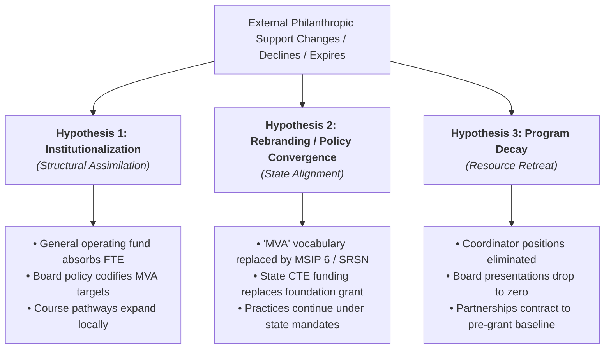

# Research Questions & Conceptual Framework

## 1. Primary Research Question

> **After external Real World Learning (RWL) philanthropic implementation support declines or expires, what happens to the underlying educational practices, governance attention, organizational capacity, and resource commitments within participating public school districts?**

---

## 2. Core Hypotheses & Divergent Trajectories

When an external funder injects catalytic capital into a public school district to foster non-mandated curricular structures (such as Market Value Assets), the cessation or reduction of external funding produces three competing organizational outcomes:

### Hypothesis 1: Structural Institutionalization

> **Identification note:** These are competing observable trajectories, not assumed outcomes. For Grandview C-4, the district-specific Kauffman grant amount, award period, and end date remain unresolved as of Task 001. No event should be described as "post-grant" until those terms are established from award, budget, or funder records.
*Claim*: The reform achieved internal legitimacy and political consensus prior to grant expiration.
- **Evidence Profile**:
  - The local Board of Education votes to absorb coordinator positions into the regular operating budget (Fund 1/General Operating Fund).
  - Multi-year strategic plans and MSIP 6 CSIP documents retain explicit quantitative targets for student asset attainment.
  - The master schedule maintains dedicated course codes, CTE shared pathway transportation, and formalized employer agreements.
  - Periodic evaluations continue to be presented to the board as standing accountability items.

### Hypothesis 2: Rebranding and Policy Convergence
*Claim*: The foundation's specific terminology ("Real World Learning", "Market Value Assets") is dropped, but the substantive practices are preserved by anchoring them to state accountability systems.
- **Evidence Profile**:
  - In Missouri, districts transition language from Kauffman "MVA" to DESE "Success-Ready Students Network" (SRSN) competencies, MSIP 6 Career and Technical Education (CTE) metrics, and Perkins V performance measures.
  - In Kansas, districts align with KSDE "Post-Graduate Assets" and KESA compliance frameworks.
  - Philanthropic grant reduction is counterbalanced by state CTE Enhancement Grants and Career Ladder funds.
  - Board communication highlights state accreditation rather than regional philanthropic networks.

### Hypothesis 3: Program Decay (The "Project Trap")
*Claim*: The initiative was "loosely coupled"—treated by district leadership as a temporary soft-money project that existed parallel to, rather than inside of, core institutional operations.
- **Evidence Profile**:
  - Expiration of the grant coincides with the departure or non-renewal of grant-funded coordinators.
  - Mention of the initiative ceases in board agendas and superintendent updates within 12–18 months of funding cessation.
  - Course catalogs retire specialized preparatory courses or return to generic vocational tracks.
  - Specialized industry-recognized credential attainment rates regress toward state baseline averages.

---

## 3. Secondary Research Questions by Analytical Layer

### Layer 1: Formal Strategy & Governance
- **Q1.1**: Are MVA attainment metrics codified in the district's Comprehensive School Improvement Plan (CSIP) under Missouri MSIP 6 guidelines, or do they exist merely in auxiliary presentation slide decks?
- **Q1.2**: How frequently does the superintendent or curriculum leadership place RWL-related items on the Board of Education agenda? Does this frequency correlate with grant milestones (grant award, midpoint review, final closeout)?
- **Q1.3**: When governance transitions occur (e.g., appointment of a new superintendent or board member turnover), does commitment to the initiative persist or undergo revision?

### Layer 2: Fiscal Substitution & Resource Allocation
- **Q2.1**: What specific fund codes and accounting lines originally received Kauffman grant dollars (e.g., Fund 1 Incidental, Fund 2 Teachers, Fund 4 Capital Projects)?
- **Q2.2**: Can we observe an explicit budget substitution effect where district local tax levy dollars or federal Perkins V funds backfill expired foundation grants?
- **Q2.3**: Are the costs of operational enablers—such as student transportation to shared regional facilities (e.g., Herndon Career Center, Summit Tech Academy) and exam fees for Industry-Recognized Credentials (IRCs)—absorbed by the district or passed on to families?

### Layer 3: Organizational Capacity & Staffing Genealogy
- **Q3.1**: What is the career trajectory of personnel hired under RWL grants? Do titles migrate (e.g., `RWL Coordinator` $\rightarrow$ `College & Career Coordinator` $\rightarrow$ `Director of Secondary Curriculum`), or are positions phased out?
- **Q3.2**: Are responsibilities decentralized into traditional counselor and classroom teacher job descriptions, or concentrated within dedicated central office administrators?

### Layer 4: Operations & Opportunity Architecture
- **Q3.1**: Do specialized pathway courses (e.g., Advanced Manufacturing with Honeywell, T&L Welding, Health Sciences/CNA) remain listed in high school course catalogs and student registration guides?
- **Q3.2**: Does the district continue participating in inter-district consortium agreements (e.g., South KC Microregion with Center and Hickman Mills) when external facilitation subsides?

### Layer 5: Vocabulary Migration & Semantic Persistence
- **Q5.1**: Using text embeddings and semantic similarity analysis across longitudinal public documents (board minutes, newsletters, website snapshots), does the conceptual core of career-connected learning persist even if literal string matches for "Market Value Asset" or "Kauffman" decrease?
- **Q5.2**: What new lexical markers emerge to replace initial reform jargon?

---

## 4. Behavioral Event Classification Taxonomy

To ensure empirical objectivity and eliminate subjective sentiment scoring, all extracted observations must be classified according to the following strict organizational event taxonomy:

| Event Code | Definition | Example Primary Observation |
| :--- | :--- | :--- |
| `MENTION` | Incidental verbal or written reference to initiative without operational commitment. | Board Brief mentions student attendance at a regional STEM fair. |
| `GOAL_SET` | Formal strategic adoption of a benchmark or objective by board or leadership. | CSIP document sets target of 85% graduating seniors earning an MVA by 2027. |
| `METRIC_REPORTED` | Presentation of factual performance data to the governing body. | Superintendent reports 64% of seniors attained an MVA in 2023-24 school year. |
| `PROGRAM_CREATED` | Official establishment of a new course, pathway, or student opportunity. | Board approves introduction of Advanced Manufacturing Pathway with Honeywell. |
| `PROGRAM_EXPANDED` | Expansion of existing course sections, grade eligibility, or student capacity. | District opens welding pathway to sophomores and expands program capacity. |
| `PROGRAM_CONTINUED` | Explicit evidence that a previously documented program remains active across a later observation window. | A later course guide still lists the pathway with active enrollment. |
| `PROGRAM_REDUCED` | Reduction, suspension, or elimination of courses, pathways, or partnerships. | Elimination of off-campus transportation for shared afternoon CTE programs. |
| `STAFF_HIRED` | Creation, recruitment, or appointment of dedicated personnel. | Appointment of District Real World Learning & Career Experiences Coordinator. |
| `STAFF_RETAINED` | Evidence that a previously identified role or responsibility persists into a later period. | The same college-and-career role remains on successive org charts. |
| `LEADERSHIP_TRANSITION` | Superintendent or senior-leadership succession that may create a strategic discontinuity. | New superintendent appointed while the initiative remains active. |
| `STAFF_REMOVED` | Elimination, non-replacement, or retrenchment of a program position. | Non-renewal of RWL facilitator position following grant conclusion. |
| `FUNDING_ADDED` | Allocation of new fiscal resources (grant, local tax, or state enhancement). | Board accepts a documented implementation grant. |
| `FUNDING_RENEWED` | Renewal or extension of a previously documented external or local funding stream. | District budget shows another year of categorical support. |
| `FUNDING_REMOVED` | Expiration, reduction, or elimination of dedicated budget lines. | Final year of philanthropic grant allocation recognized in annual budget. |
| `CONTRACT_APPROVED`| Formal board approval of an inter-agency, vendor, or institutional agreement. | Board approves MOU with Metropolitan Community College for dual-credit pathways. |
| `PARTNERSHIP_CREATED`| Formalized public agreement with an employer or community entity. | Launch of partnership with T&L Welding for industry-certified student cohorts. |
| `PARTNERSHIP_CONTINUED` | Explicit continuation or renewal of a previously documented external partnership. | Board Brief states the district is continuing its T&L Welding partnership. |
| `COURSE_ADDED` | Addition of a distinct course title and code to the master catalog. | Course #5402 'Introduction to CNC Machining' added to high school course guide. |
| `COURSE_REMOVED` | De-listing of course title and code from master course guide. | Course #5402 retired from course catalog. |
| `BOARD_ACTION` | Official motion, vote, or resolution enacted by the Board of Education. | Board unanimously passes motion to adopt revised Career Ladder and CTE handbook. |
| `EVALUATION_PRESENTED`| Formal presentation of comprehensive multi-year program evaluation. | Board formally reviews and approves evaluation of Real-World Learning program (Dec 2024). |
| `TARGET_MET` | Primary evidence confirms documented benchmark was satisfied. | Attainment data confirms senior credential completion exceeded strategic goal. |
| `TARGET_MISSED` | Primary evidence confirms documented benchmark was not satisfied. | APR report shows career readiness score below targeted continuous improvement band. |
| `REBRANDED` | Official transition of terminology while retaining operational continuity. | Program re-titled from 'Market Value Assets' to 'Success-Ready Student Credentials'. |

---

## 5. Identification Guardrails Added in Task 001 Audit

1. **Grant lifecycle is a variable, not a premise.** Cohort membership and generic network language about financial support do not establish Grandview's award amount, exact start date, or end date.
2. **Regional outcomes are not district outcomes.** Regional MVA attainment statistics may provide context but cannot be assigned to Grandview without district-level evidence.
3. **Strategic language is not operational continuity.** A strategic-plan goal is one layer of evidence and must not substitute for fiscal, staffing, or opportunity-level observations.
4. **Absence of mention is not decay.** Missing RWL terminology must be tested against semantic continuation in courses, partnerships, staff roles, budgets, and outcomes.
5. **Persistence requires explicit coding.** `PROGRAM_CONTINUED`, `PARTNERSHIP_CONTINUED`, and `STAFF_RETAINED` distinguish durable continuation from one-time creation events.
6. **Leadership transition is a potential change point, not a causal explanation.** Superintendent succession is coded separately and tested against later evidence rather than treated as proof of reprioritization.
