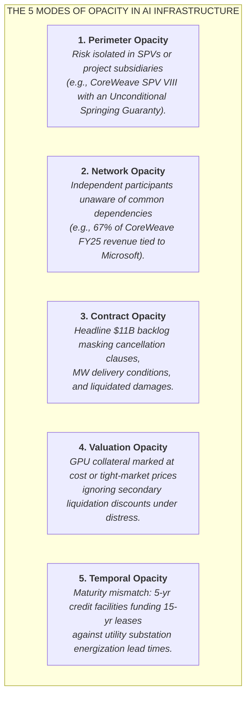
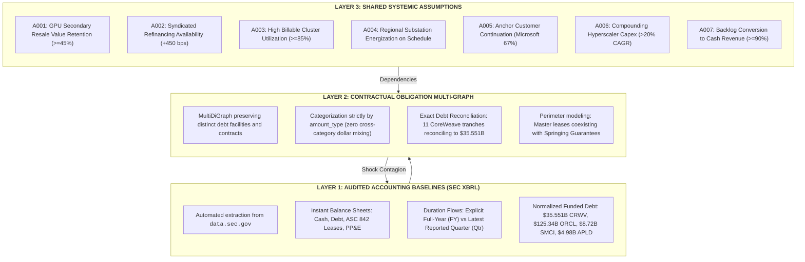
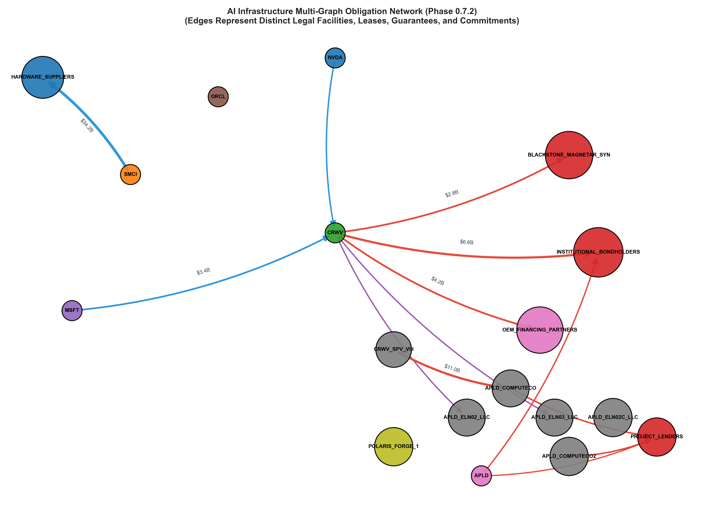
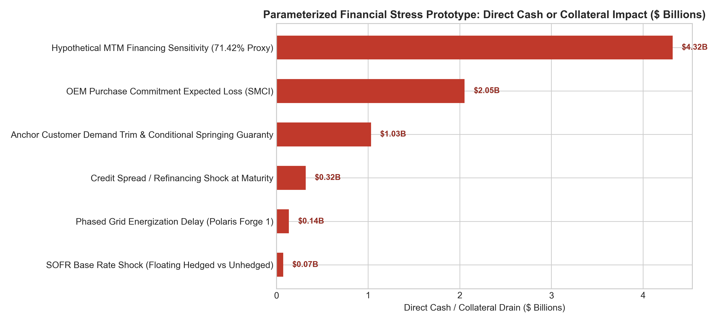

# AI Infrastructure Financial Network (`ai_infrastructure_network`)

> **"The thing that blows up is often not hidden data. It is a hidden relationship between data that everybody can see. The crisis lives in the JOIN."**

A computational research observatory mapping the contractual obligation graph, credit perimeters, and shared systemic assumptions underpinning the multi-hundred-billion dollar AI infrastructure buildout.

---

## 1. The Central Thesis & Hypotheses

Conventional equity and credit analysis evaluates corporate health through isolated balance sheets:
$$\text{Company} \longrightarrow \text{Income Statement \& Balance Sheet} \longrightarrow \text{Debt / EBITDA \& Solvency}$$

This paradigm systematically fails in hyper-connected, project-financed capital cycles. 
* **Silicon Valley Bank (2023):** Its long-duration securities exposure was disclosed. Its unrealized losses were disclosed. The fact that ~94% of deposits were uninsured was calculable from call reports. The failure lived in the **interaction**: uninsured deposit flight forcing the liquidation of assets whose accounting treatment allowed losses to remain unrealized.
* **Archegos Capital Management (2021):** Each prime broker knew its individual loan exposure. None possessed the aggregate graph: identical total-return swaps across multiple counterparties concentrating $160B of exposure onto $36B of capital.
* **Long-Term Capital Management (1998):** Each institution believed its collateral agreement and mark-to-market margins protected it. Collectively, they enabled a massive, highly correlated systemic position.

In 2020s AI capital structures, companies do not need to commit fraud or conceal debt for systemic fragility to emerge. Alice gets rewarded for originating private credit loans. Bob gets rewarded for building data center capacity. Carol gets rewarded for signing master leases. Dave gets rewarded for financing GPU procurement. Erin gets rewarded for booking hardware shipments. Frank's risk model assumes hardware resale value remains high because current supply is tight.
**Every decision makes sense locally. The resulting network can be fragile globally.**

### The Core Research Questions
1. **The Contractual Graph:** Where is the economic risk of the AI buildout being transformed, distributed, or duplicated in ways that consolidated financial statements make difficult to see?
2. **The Shared Assumptions:** What underlying economic propositions are shared by supposedly independent balance sheets?
3. **The Contagion Vector:** *What single change breaks the largest number of edges at once?*

---

## 2. The Five Types of Opacity



---

## 3. Epistemic Architecture: The Three Layers

The observatory explicitly separates the analytical model into three distinct layers:



---

## 4. Phase 0.7.2: The Five-Company Pilot (Corrective Patch & Pilot Freeze)

Phase 0.7.2 establishes an economically literal baseline across five core companies and their counterparties:
* **NVIDIA Corporation (`NVDA`):** Dominant accelerated silicon supplier (CIK: `0001045810`).
* **Super Micro Computer, Inc. (`SMCI`):** Accelerated server OEM & liquid cooling integrator (CIK: `0001375365`).
* **CoreWeave, Inc. (`CRWV`):** Leveraged neocloud operator (CIK: `0001769628`) and its equipment vehicle `CRWV_SPV_VIII`.
* **Applied Digital Corporation (`APLD`):** HPC data center developer (CIK: `0001144879`), intermediate financing issuers (`APLD_COMPUTECO`, `APLD_COMPUTECO2`), and Polaris Forge 1 Landlord SPVs (`APLD_ELN02_LLC`, `APLD_ELN03_LLC`, `APLD_ELN02C_LLC`).
* **Oracle Corporation (`ORCL`):** Hyperscaler cloud operator expanding OCI superclusters (CIK: `0001341439`).
* **Key Counterparties:** Microsoft Corporation (`MSFT`, anchor customer), Blackstone/Magnetar Debt Syndicate (`BLACKSTONE_MAGNETAR_SYN`), Institutional Bondholders, Hardware Suppliers, and Polaris Forge 1 Campus (`POLARIS_FORGE_1`).

### Audited Balance Sheet Structure (Latest SEC Periodic Disclosures)
| Entity | Category | Cash & Equiv | Total Funded Debt | Lease Liabilities | Net PP&E | Full Year (FY) Revenue | Latest Quarter Revenue |
| :--- | :--- | :--- | :--- | :--- | :--- | :--- | :--- |
| **NVDA** | Hardware Supplier | $22.44B | $33.37B | $5.49B | $14.28B | $215.94B (FY26) | $96.22B (Q2 FY27) |
| **SMCI** | Server OEM | $7.52B | $8.72B | $0.54B | $0.63B | $39.06B (FY26) | $11.12B (Q4 FY26) |
| **CRWV** | Neocloud Operator | $5.52B | $35.55B | $16.32B | $46.74B | $5.13B (FY25) | $2.58B (Q2 2026) |
| **APLD** | Data Center Host | $1.59B | $4.98B | $0.07B | $4.24B | $0.61B (FY26) | $0.26B (Q4 FY26) |
| **ORCL** | Cloud Hyperscaler | $36.37B | $125.34B | $34.62B | $127.84B | $67.36B (FY26) | $19.34B (Q1 FY27) |
| **MSFT** | Cloud Hyperscaler | $20.94B | $46.14B | $21.92B | $313.08B | $331.84B (FY26) | $90.01B (Q4 FY26) |

### Obligation Multi-Graph Topology


---

## 5. Key Empirical Findings from Phase 0.7.2

1. **The Bubble Lives in the Joins:**
   * On consolidated statements, Applied Digital (`APLD`) reports $1.59B in cash and $4.98B in debt.
   * Querying the joins reveals that APLD executed a **15-year, ~$11.0B master lease agreement** for 400 MW at Polaris Forge 1 with CoreWeave across Buildings 2, 3, and 4. APLD's campus development economics are leveraged to CoreWeave's solvency.
2. **Perimeter Opacity & Uncapped Springing Guarantees (Phase 2/4 Space & Building 3 Class C Reference Proxy):**
   * In SEC Form 10-K disclosures (Note 14, Exhibit 10.1, Exhibit 10.2), CoreWeave assigned its lease liabilities to `CoreWeave Compute Acquisition Co. VIII, LLC`, formally releasing parent corporate liability on Building ELN-03.
   * **However**, CoreWeave concurrently executed separate **Unconditional Springing Guarantees of Payment and Performance**:
     - **Exhibit 10.1:** Guarantees the Building 2 SPV lease, specifically covering **Phase 2/4 Space (2 of 4 data halls in Building 2)**, not all 100 MW (`capacity_mw = None`, unstated face value).
     - **Exhibit 10.2:** Guarantees the Building 3 SPV lease (**150 MW** assigned to SPV, carrying an inferred Class C reference proxy of **$4.13B** based on 150/400 MW).
     - **Building 4 (150 MW, ~$4.13B):** Carries no CoreWeave parent springing guarantee (APLD guarantees the landlord).
     - **Contractual Face Value Reality:** Both agreements are uncapped performance and rent indemnities without a fixed face value (`amount = None`, `amount_type = "contingent_obligations"`).
     - Under Exhibit 10.1 and Exhibit 10.2, the guarantees activate upon explicit Springing Events: (i) equipment-financing rating trigger [***], (ii) colocation agreement default, material modification, or payment reduction/cessation, (iii) insolvency/bankruptcy, (iv) equipment financing acceleration, etc.
3. **Exact CoreWeave & Applied Digital Debt Reconciliations:**
   * **CoreWeave ($35.551B):** Indebtedness is reconciled across 11 modeled debt components/edges: DDTL 1.0 ($1.300B), DDTL 2.0 ($3.190B), DDTL 2.1 ($3.000B), DDTL 3.0 ($2.215B), Non-Recourse DDTL 4.0 ($2.837B drawn of $8.500B capacity), DDTL 5.0 ($1.101B), Senior Secured Notes ($10.029B), Convertible Senior Notes ($6.588B), Recourse OEM ($4.220B), Non-Recourse OEM ($0.882B), and Magnetar Loan ($0.189B), summing to **$35.551B** (exact 0.00% drift).
   * **Applied Digital Duality ($5.307B Gross Principal vs $4.976B Carrying Debt) & Obligation Conservation:** Form 10-K balance sheet reports net carrying debt of **$4.976B** ($4,959.5M net long-term + $16.4M current portion), while Note 8 discloses gross contractual remaining principal payments of **$5.307B** ($5,306.7M), with $330.7M in unamortized discount and deferred financing costs. Decomposed into 6 contract-literal instruments in the master ledger: $2.35B 9.25% PF1 notes (issued by `APLD_COMPUTECO` due Dec 15, 2030), $2.15B 6.75% PF2 notes (issued by `APLD_COMPUTECO2` due Mar 15, 2031), $450M 2.75% convertible notes (due Jun 30, 2030), $300M floating bridge facility (SOFR, entered May 1, 2026, due Apr 30, 2027; retired June 16, 2026), $56.68M aggregate residual debt (summing to $5,306.68M at May 31, 2026; 0.00% drift), and $1.59B 7.00% Senior Secured Notes (`OBL-APLD-DEBT-7PCT-2026`, entered June 16, 2026, due June 15, 2031; Note 19 Subsequent Events) issued to refinance the bridge facility and conserve post-refinancing indebtedness in the temporal graph.
4. **Pure Amount-Type Reachability vs Parameterized Financial Stress Prototype:**
   * We eliminate non-fungible dollar mixing across different categories. Reachability reports the percentage of each `amount_type` reachable within 2 hops of an assumption alongside edge reachability percentages.
   * The stress engine is framed as a **parameterized financial stress prototype** with contract-calibrated transmission functions.
5. **Dynamic SPV Unwrapping & Bitemporal Graph Architecture (Economic vs Knowledge Time):**
   * **Dynamic Entity Hierarchy:** Rather than static lookup maps, the network traverses `parent_entity_id` attributes dynamically (`APLD_ELN02_LLC` $\to$ `APLD_COMPUTECO` $\to$ `APLD`), leaving 0 SPV nodes in the consolidated corporate graph.
   * **Bitemporal Architecture & Obligation Conservation:** Contracts record `economic_valid_from`, `economic_valid_to`, `publicly_known_from`, `rate_type`, `benchmark_rate`, `supersedes`, and `superseded_by`.
     - **Economic Clock (`economic_as_of`):** Calling `network.economic_as_of("2026-05-31")` captures the balance-sheet snapshot including the $300M bridge facility ($235.4M/yr network SOFR shock across 22 active edges, $5,306.68M gross debt). Calling `network.economic_as_of("2026-09-28")` accurately retires the bridge (`superseded_by = "OBL-APLD-DEBT-7PCT-2026"`) and activates the $1.59B 7.00% notes, conserving network topology at exactly 22 active edges ($6,596.68M APLD debt) without dropping debt into a void.
     - **Information Clock (`known_as_of`):** Eliminates look-ahead bias by filtering based on `publicly_known_from` SEC disclosure publication dates. Calling `network.known_as_of("2026-06-30")` strictly returns the 18 edges publicly disclosed as of June 30 (subsequent events and July/August 10-K/10-Q filings are excluded); querying as of September 28 reflects all 22 active edges.
   * **Dynamic Stress Engine Coupling:** `FinancialStressEngine(network=net)` dynamically evaluates active floating debt via `eval_engine.get_active_floating_debt(entity_id)`, deriving $235.4M/yr direct cash hit at May 31 (with the $300M floating bridge active) vs $226.4M/yr at Sep 28 (where APLD floating debt is $0 after refinancing into fixed notes).
   * **100% Verbatim Substring Certification:** All `"exact_quote"` claims are verified with 100% character-level contiguous substring fidelity against cached raw SEC EDGAR exhibits (`APLD_ex10_1.htm` and `APLD_ex10_2.htm`).

### Parameterized Financial Stress Prototype Results (`src/stress.py`)


| Scenario Name | Shock Parameter | Target Entity | Direct Cash / Collateral Hit | Liquidity & Covenant Transmission |
| :--- | :--- | :--- | :--- | :--- |
| **Hypothetical MTM Financing Sensitivity** | -40% secondary GPU collateral value | `CRWV` | **$4.32B modeled refi gap** | Evaluates drawn DDTLs against a 71.42% advance rate proxy, modeling a **$4.32B refinancing gap** (Class C proxy). Section 2.05 of DDTL 5.0 does NOT trigger mandatory cash prepayment on secondary price declines (cash remains $5.52B intact), but eliminates undrawn capacity. |
| **Anchor Customer Demand Trim** | -30% Microsoft volume ($3.44B base) | `CRWV` | **$1.03B/yr cash flow loss** | Reductions in colocation payments conditionally trigger **Springing Event (ii)** under Exhibit 10.2, activating the uncapped parent ELN-03 guaranty (**$4.13B Class C reference proxy**) and Exhibit 10.1 on Building 2 Phase 2/4 Space (2 of 4 halls; uncapped face value). Building 4 excluded. |
| **SOFR Base Rate Shock** | +300 bps SOFR benchmark | `CRWV / APLD` | **$235.4M/yr hedged cash drain** | Note 8 reports **$4,661M** active swap notional against $12.206B floating debt, leaving **$7.545B unhedged** at CRWV, plus APLD's **$300.0M floating bridge facility**. Direct cash drain is **$226.4M CRWV + $9.0M APLD = $235.4M/yr** (Sensitivity band: $27.3M/yr at 95% full coverage to $303.9M/yr if DDTL 1.0–3.0 unhedged). |
| **Credit Spread / Refinancing Shock** | +300 bps credit spread at maturity | `CRWV` | **$317.9M/yr added refi interest** | Existing contractual spreads unaffected; shock hits $10.60B scheduled principal maturing over 2026–2027 ($4.41B in 2026, $6.18B in 2027). Parameterized at 100% rollover ($317.9M/yr; sensitivity range: $159.0M at 50% to $317.9M at 100%). |
| **Phased Grid Energization Delay** | 12-month delay at Polaris Forge 1 | `APLD` | **$135.9M debt carrying cost** | Defers $458M expansion rent on 250 MW pending, while ~150 MW operational (Building 2 100 MW + Building 3 parameterized at 50 MW live, Class C proxy) generates $275M base rent; carrying cost consumes **8.5% of APLD cash** (sensitivity range: 6.8% [$108.7M] to 9.4% [$149.4M] across 25–100 MW live). |
| **OEM Purchase Commitment Expected Loss** | 15% demand pause on $34.2B | `SMCI` | **$2.05B NRV loss provision** | Accounting: $2.05B NRV write-down provision reducing equity. Cash: negotiated cancellation fee (parameterized at 15%) consumes **$769.5M cash (10.2%)**, while inventory delivery would consume **$5.13B cash (68.2%)**. |

---

## 6. Directory Structure & Reproduction

```text
2026-09-28-ai-infrastructure-network/
├── README.md                      # Master synthesis, empirical findings, and architecture guide
├── FEEDBACK_PACK.md               # Copy-paste briefing prompt for external review and LLMs
├── RESUME_PROMPT.md               # Cold-start briefing prompt for fresh AI sessions
├── config/
│   ├── entities.yml               # Entity registry (CIKs, parents, SPVs, roles)
│   ├── relationship_types.yml     # Contract/obligation taxonomy & sensitivity ratings
│   └── assumptions.yml            # Systemic assumptions (A001-A007), proxies, and stress parameters
├── docs/
│   ├── methodology.md             # Theoretical framework, 5 opacities, and contagion math
│   ├── data_dictionary.md         # Schema specifications for all Parquet and CSV tables
│   ├── decisions.md               # Architectural Decision Records (ADR-001 through 012)
│   └── evidence_contract.md       # Epistemic trust hierarchy (Class A/B/C) and audit rules
├── data/
│   ├── raw/sec/                   # Cached primary SEC EDGAR company facts JSON and exhibit HTMLs
│   └── processed/                 # Standardized Parquet files and human-readable CSV mirrors
│       ├── entities.parquet       # 18 entities (corporates, landlord SPVs, syndicates)
│       ├── financials.parquet     # 5,440 standardized accounting observations (quarterly & annual)
│       ├── obligations.parquet    # 23 decomposed obligations exactly reconciling debt
│       ├── assumptions.parquet    # 7 assumption registries
│       └── evidence_claims.parquet# 16 audited SEC citations with verbatim quotes and accession numbers
├── src/
│   ├── sec_ingest.py              # Automated data.sec.gov XBRL ingestion pipeline (duration-aware)
│   ├── curate_obligations.py      # Audited obligation and evidence claim builder
│   ├── graph.py                   # MultiDiGraph obligation graph & dynamic SPV unwrapping engine
│   ├── reachability.py            # Assumption reachability by amount_type engine
│   ├── stress.py                  # Parameterized financial stress & contract transmission prototype
│   ├── validate.py                # Automated consistency validator (markdown & data sync)
│   └── build_notebook.py          # Programmatic notebook builder and execution runner
├── notebooks/
│   └── 01_five_company_pilot.ipynb# 14-cell executed research workbench with live tables and figures
└── outputs/
    ├── figures/
    │   ├── obligation_network_topology.png         # MultiDiGraph contractual topology
    │   ├── financial_stress_waterfall.png          # Quantitative direct hit waterfall chart
    │   ├── assumption_reachability_footprint.png   # Topological reachability bar chart
    │   └── fin_bs_structure.png                    # Audited balance sheet structure
    └── tables/
        └── financial_stress_summary.csv            # Canonical stress results table
```

### Run and Validate
```powershell
# 1. Ingest SEC EDGAR XBRL Data
python 2026/2026-09-28-ai-infrastructure-network/src/sec_ingest.py

# 2. Build the Obligation and Evidence Ledgers
python 2026/2026-09-28-ai-infrastructure-network/src/curate_obligations.py

# 3. Run Reachability and Financial Stress Simulation
python 2026/2026-09-28-ai-infrastructure-network/src/reachability.py
python 2026/2026-09-28-ai-infrastructure-network/src/stress.py

# 4. Execute the Interactive Notebook
python 2026/2026-09-28-ai-infrastructure-network/src/build_notebook.py

# 5. Run Consistency Validator (Ensures Zero Data Drift)
python 2026/2026-09-28-ai-infrastructure-network/src/validate.py
```

---

## 7. Epistemic Trust Hierarchy

Every relationship in this repository is certified according to [`docs/evidence_contract.md`](docs/evidence_contract.md):
* **Class A (Contractual / Filed):** Primary SEC 10-K/10-Q/8-K exhibits, credit agreements, and audited footnote disclosures.
* **Class B (Company Asserted):** Executive remarks, earnings calls, and investor presentations.
* **Class C (Analytical / Inferred):** Research synthesis, channel check proxies, and synthetic stress parameters.

Audit receipts with immutable SEC EDGAR Accession Numbers and verbatim citations are recorded in [`data/processed/evidence_claims.parquet`](data/processed/evidence_claims.parquet).
