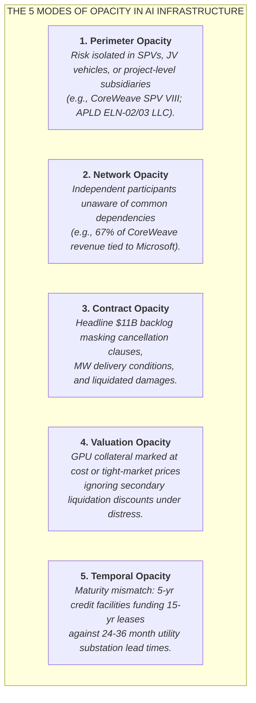
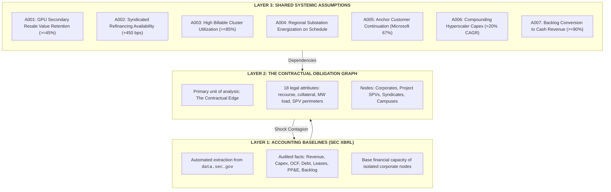
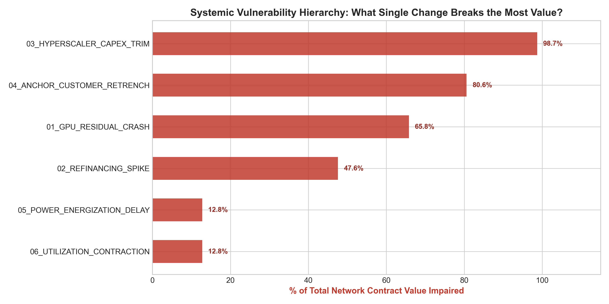

# AI Infrastructure Financial Network (`ai_infrastructure_network`)

> **"The thing that blows up is often not hidden data. It is a hidden relationship between data that everybody can see. The crisis lives in the JOIN."**

A computational research observatory mapping the contractual obligation graph, credit perimeters, and shared systemic assumptions underpinning the multi-hundred-billion dollar AI infrastructure buildout.

---

## 1. The Central Thesis & Hypotheses

Conventional equity and credit analysis evaluates corporate health through isolated balance sheets:
$$\text{Company} \longrightarrow \text{Income Statement \& Balance Sheet} \longrightarrow \text{Debt / EBITDA \& Solvency}$$

This paradigm systematically fails in hyper-connected, project-financed capital cycles. 
* **Silicon Valley Bank (2023):** Its long-duration securities exposure was disclosed. Its unrealized losses were disclosed. The fact that ~94% of deposits were uninsured was calculable from call reports. The failure lived in the **interaction**: uninsured deposit flight forcing the liquidation of assets whose accounting treatment allowed losses to remain unrealized.
* **Archegos Capital Management (2021):** Each prime broker knew its individual loan exposure. None possessed the aggregate graph: identical total-return swaps across multiple counterparties concentrating $160B of exposure onto $36B of capital.
* **Long-Term Capital Management (1998):** Each institution believed its collateral agreement and mark-to-market margins protected it. Collectively, they enabled a massive, highly correlated systemic position.

In 2020s AI capital structures, companies do not need to commit fraud or conceal debt for systemic fragility to emerge. Alice gets rewarded for originating private credit loans. Bob gets rewarded for building data center capacity. Carol gets rewarded for signing master leases. Dave gets rewarded for financing GPU procurement. Erin gets rewarded for booking hardware shipments. Frank's risk model assumes hardware resale value remains high because current supply is tight.
**Every decision makes sense locally. The resulting network can be fragile globally.**

### The Core Research Questions
1. **The Contractual Graph:** Where is the economic risk of the AI buildout being transformed, distributed, or duplicated in ways that consolidated financial statements make difficult to see?
2. **The Shared Assumptions:** What underlying economic propositions are shared by supposedly independent balance sheets?
3. **The Contagion Vector:** *What single change breaks the largest number of edges at once?*

---

## 2. The Five Types of Opacity



---

## 3. Epistemic Architecture: The Three Layers

The observatory explicitly separates the analytical model into three distinct layers:



---

## 4. Phase 0: The Five-Company Pilot

Phase 0 validates the ontology, data contracts, and shock propagation engine on a closed capital and hardware loop across five companies and their strategic counterparties:
* **NVIDIA Corporation (`NVDA`):** Dominant accelerated silicon supplier (CIK: `0001045810`).
* **Super Micro Computer, Inc. (`SMCI`):** Accelerated server OEM & liquid cooling integrator (CIK: `0001375365`).
* **CoreWeave, Inc. (`CRWV`):** Leveraged neocloud operator (CIK: `0001769628`) and its equipment vehicle `CRWV_SPV_VIII`.
* **Applied Digital Corporation (`APLD`):** HPC data center developer (CIK: `0001144879`) and project vehicle `APLD_ELN_LLC`.
* **Oracle Corporation (`ORCL`):** Hyperscaler cloud operator expanding OCI superclusters (CIK: `0001341439`).
* **Strategic Counterparties:** Microsoft Corporation (`MSFT`, anchor offtaker), Blackstone/Magnetar Debt Syndicate (`BLACKSTONE_MAGNETAR_SYN`), and Polaris Forge 1 Campus (`POLARIS_FORGE_1`).

### Obligation Network Topology


---

## 5. Key Empirical Findings from Phase 0

1. **The Bubble Lives in the Joins:**
   * On consolidated statements, Applied Digital (`APLD`) reports modest quarterly revenues (~$126M) and capital expenditure burdens.
   * However, querying the joins reveals that APLD executed a **15-year, ~$11.0B master lease agreement** for 400 MW at Polaris Forge 1 with CoreWeave. APLD's campus economics are almost entirely leveraged to CoreWeave's solvency.
2. **Structural Perimeter Opacity:**
   * In SEC Form 10-K disclosures (Note 14), CoreWeave executed an Assignment and Assumption agreement transferring lease liabilities to a bankruptcy-remote entity, `CoreWeave Compute Acquisition Co. VIII, LLC`, releasing parent corporate liability on Building ELN-03 while backing obligations with letters of credit drawn against its bank credit facilities.
3. **Severe Network Concentration:**
   * CoreWeave's Form 10-K disclosures reveal that **67% of its FY25 recognized revenue was derived from a single anchor customer: Microsoft**. What appears as independent cloud demand is heavily concentrated in one hyperscaler's external compute spillover.
4. **The Critical Fragility Point (What Breaks the Most Value?):**
   * Testing adversarial shocks reveals that **Hyperscaler Capex Deceleration (`SCEN_03`, -20% growth)** impairs **98.7% of the total network contractual value** ($117.8B of $119.3B total commitments).
   * **Anchor Customer Retrenchment (`SCEN_04`, -30% Microsoft volume)** impairs **80.6% of network value**, cascading from CoreWeave's revenue through its debt service, lease commitments, and hardware orders.
   * **GPU Secondary Market Crash (`SCEN_01`, -40% resale value)** triggers borrowing base deficiencies on CoreWeave's **$21.6B syndicated debt facility**, directly or indirectly destabilizing **65.8% of the network**.

### Systemic Vulnerability Hierarchy


---

## 6. Directory Structure

```text
2026-09-28-ai-infrastructure-network/
├── README.md                 # Master project guide and empirical synthesis
├── config/
│   ├── entities.yml          # Entity registry metadata (CIKs, roles, classifications)
│   ├── relationship_types.yml# Contract/obligation taxonomy and sensitivity ratings
│   └── assumptions.yml       # Shared systemic assumptions (A001-A007) and proxies
├── docs/
│   ├── methodology.md        # Mathematical and theoretical contagion framework
│   ├── data_dictionary.md    # Complete schemas for Parquet/CSV data artifacts
│   ├── decisions.md          # Architectural Decision Records (ADR-001 through 005)
│   └── evidence_contract.md  # Epistemic trust hierarchy (Class A/B/C) and audit rules
├── data/
│   ├── raw/sec/              # Immutable SEC EDGAR XBRL company facts (JSON)
│   └── processed/            # Harmonized Parquet & CSV analytical tables
│       ├── entities.parquet
│       ├── financials.parquet
│       ├── obligations.parquet
│       ├── assumptions.parquet
│       └── evidence_claims.parquet
├── src/
│   ├── sec_ingest.py         # Automated SEC EDGAR XBRL extraction pipeline
│   ├── curate_obligations.py # Obligation and evidence claim curation
│   ├── graph.py              # NetworkX obligation graph & SPV unwrapping engine
│   ├── stress.py             # Multi-hop shock simulation and contagion engine
│   └── build_notebook.py     # Programmatic execution harness for Jupyter notebook
├── notebooks/
│   └── 01_five_company_pilot.ipynb # Executed interactive research notebook
└── outputs/
    ├── figures/              # High-resolution network graphs and stress waterfalls
    └── tables/               # Stress test comparison tables and metrics
```

---

## 7. How to Reproduce

### 1. Ingest SEC EDGAR XBRL Data
```bash
python src/sec_ingest.py
```
*Queries `data.sec.gov` for NVDA, ORCL, CRWV, APLD, SMCI, and MSFT, caching raw JSON in `data/raw/sec/` and writing normalized facts to `data/processed/financials.parquet`.*

### 2. Build the Obligation and Evidence Ledgers
```bash
python src/curate_obligations.py
```
*Compiles the entity metadata, shared assumptions, and audited contractual edges into `data/processed/`.*

### 3. Run Graph Analysis and Systemic Stress Tests
```bash
python -m src.graph
python -m src.stress
```
*Calculates network exposures, ranks shared assumptions by total value supported, and simulates multi-order contagion paths.*

### 4. Execute the Interactive Notebook
```bash
python src/build_notebook.py
```
*Compiles and executes [`notebooks/01_five_company_pilot.ipynb`](notebooks/01_five_company_pilot.ipynb), rendering all live tables, NetworkX graph layouts, and Plotly visualizations.*

---

## 8. Epistemic Trust Hierarchy

Every relationship in this repository is certified according to the [`docs/evidence_contract.md`](docs/evidence_contract.md):
* **Class A (Contractual / Filed):** Primary SEC 10-K/10-Q/8-K exhibits, credit agreements, and audited footnote disclosures.
* **Class B (Company Asserted):** Executive remarks, earnings calls, and investor presentations.
* **Class C (Analytical / Inferred):** Research synthesis, channel check proxies, and synthetic stress parameters.

Audit receipts with immutable SEC EDGAR Accession Numbers and verbatim citations are recorded in [`data/processed/evidence_claims.parquet`](data/processed/evidence_claims.parquet).
