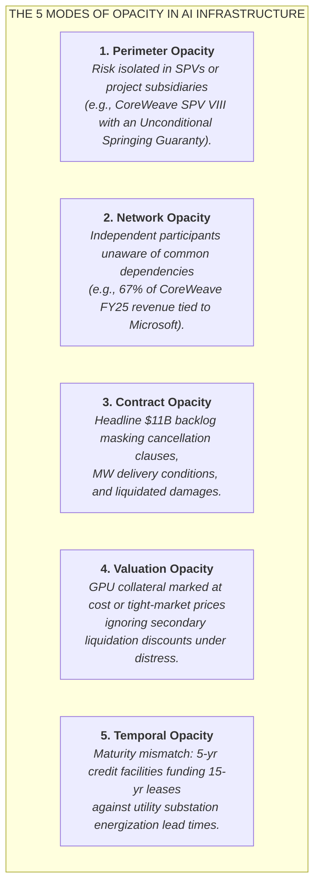
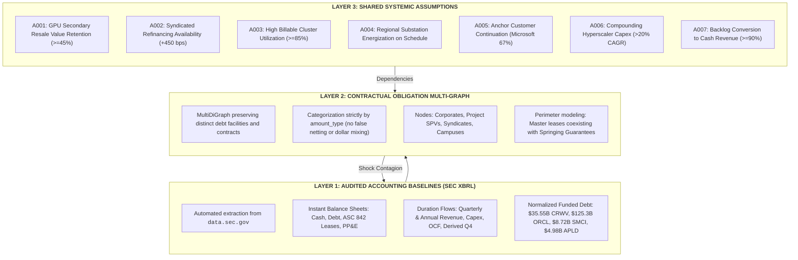

# AI Infrastructure Financial Network (`ai_infrastructure_network`)

> **"The thing that blows up is often not hidden data. It is a hidden relationship between data that everybody can see. The crisis lives in the JOIN."**

A computational research observatory mapping the contractual obligation graph, credit perimeters, and shared systemic assumptions underpinning the multi-hundred-billion dollar AI infrastructure buildout.

---

## 1. The Central Thesis & Hypotheses

Conventional equity and credit analysis evaluates corporate health through isolated balance sheets:
$$\text{Company} \longrightarrow \text{Income Statement \& Balance Sheet} \longrightarrow \text{Debt / EBITDA \& Solvency}$$

This paradigm systematically fails in hyper-connected, project-financed capital cycles. 
* **Silicon Valley Bank (2023):** Its long-duration securities exposure was disclosed. Its unrealized losses were disclosed. The fact that ~94% of deposits were uninsured was calculable from call reports. The failure lived in the **interaction**: uninsured deposit flight forcing the liquidation of assets whose accounting treatment allowed losses to remain unrealized.
* **Archegos Capital Management (2021):** Each prime broker knew its individual loan exposure. None possessed the aggregate graph: identical total-return swaps across multiple counterparties concentrating $160B of exposure onto $36B of capital.
* **Long-Term Capital Management (1998):** Each institution believed its collateral agreement and mark-to-market margins protected it. Collectively, they enabled a massive, highly correlated systemic position.

In 2020s AI capital structures, companies do not need to commit fraud or conceal debt for systemic fragility to emerge. Alice gets rewarded for originating private credit loans. Bob gets rewarded for building data center capacity. Carol gets rewarded for signing master leases. Dave gets rewarded for financing GPU procurement. Erin gets rewarded for booking hardware shipments. Frank's risk model assumes hardware resale value remains high because current supply is tight.
**Every decision makes sense locally. The resulting network can be fragile globally.**

### The Core Research Questions
1. **The Contractual Graph:** Where is the economic risk of the AI buildout being transformed, distributed, or duplicated in ways that consolidated financial statements make difficult to see?
2. **The Shared Assumptions:** What underlying economic propositions are shared by supposedly independent balance sheets?
3. **The Contagion Vector:** *What single change breaks the largest number of edges at once?*

---

## 2. The Five Types of Opacity



---

## 3. Epistemic Architecture: The Three Layers

The observatory explicitly separates the analytical model into three distinct layers:



---

## 4. Phase 0.6: The Five-Company Pilot

Phase 0.6 establishes an economically literal baseline across five core companies and their counterparties:
* **NVIDIA Corporation (`NVDA`):** Dominant accelerated silicon supplier (CIK: `0001045810`).
* **Super Micro Computer, Inc. (`SMCI`):** Accelerated server OEM & liquid cooling integrator (CIK: `0001375365`).
* **CoreWeave, Inc. (`CRWV`):** Leveraged neocloud operator (CIK: `0001769628`) and its equipment vehicle `CRWV_SPV_VIII`.
* **Applied Digital Corporation (`APLD`):** HPC data center developer (CIK: `0001144879`), Polaris Forge 1 SPV (`APLD_ELN_LLC`), and Polaris Forge 2 SPV (`APLD_COMPUTECO2`).
* **Oracle Corporation (`ORCL`):** Hyperscaler cloud operator expanding OCI superclusters (CIK: `0001341439`).
* **Key Counterparties:** Microsoft Corporation (`MSFT`, anchor customer), Blackstone/Magnetar Debt Syndicate (`BLACKSTONE_MAGNETAR_SYN`), Institutional Bondholders, Hardware Suppliers, and Polaris Forge 1 Campus (`POLARIS_FORGE_1`).

### Audited Balance Sheet Structure (Latest SEC Periodic Disclosures)
| Entity | Category | Cash & Equiv | Total Funded Debt | Lease Liabilities | Net PP&E | Latest Rev Flow | Derived Q4 Flow |
| :--- | :--- | :--- | :--- | :--- | :--- | :--- | :--- |
| **NVDA** | Hardware Supplier | $22.44B | $33.37B | $5.49B | $14.28B | $96.22B (FY) | $30.04B |
| **SMCI** | Server OEM | $7.52B | $8.72B | $0.54B | $0.63B | $39.06B (FY) | $14.94B |
| **CRWV** | Neocloud Operator | $5.52B | $35.55B | $16.32B | $46.74B | $5.13B (FY) | $1.21B (Q2) |
| **APLD** | Data Center Host | $1.59B | $4.98B | $0.07B | $4.24B | $611.3M (FY) | $258.8M (Q4) |
| **ORCL** | Cloud Hyperscaler | $36.37B | $125.34B | $34.62B | $127.84B | $19.35B (FY) | $4.98B (Q1) |
| **MSFT** | Cloud Hyperscaler | $20.94B | $46.14B | $21.92B | $313.08B | $331.84B (FY) | $90.01B (Q4) |

### Obligation Multi-Graph Topology


---

## 5. Key Empirical Findings from Phase 0.6

1. **The Bubble Lives in the Joins:**
   * On consolidated statements, Applied Digital (`APLD`) reports $1.59B in cash and $4.98B in debt.
   * Querying the joins reveals that APLD executed a **15-year, ~$11.0B master lease agreement** for 400 MW at Polaris Forge 1 with CoreWeave. APLD's campus development economics are leveraged to CoreWeave's solvency.
2. **Perimeter Opacity & The Unconditional Springing Guaranty:**
   * In SEC Form 10-K disclosures (Note 14 & Exhibit 10), CoreWeave assigned its lease liabilities to `CoreWeave Compute Acquisition Co. VIII, LLC`, formally releasing parent corporate liability on Building ELN-03.
   * **However**, CoreWeave concurrently executed an **Unconditional Springing Guaranty of Payment and Performance**. The literal legal predicate: the guaranty springs into active parent liability upon an SPV colocation lease payment default or bankruptcy trigger. Perimeter restructuring did NOT insulate the parent; it created a **contingent liquidity cliff**.
3. **Decomposed Debt Realities:**
   * CoreWeave's indebtedness is not a single generic loan, but **$35.551B in future principal** across Delayed Draw Term Loans ($10.8B drawn), Senior Secured Notes ($10.0B), Convertible Senior Notes ($6.6B), and OEM financing ($4.2B).
   * Applied Digital's debt is segmented into **fixed-rate notes**: $2.35B 9.25% Senior Notes (Polaris Forge 1) and $2.15B 6.75% Senior Notes (ComputeCo 2), insulating APLD from immediate cash floating rate hikes.
4. **Pure Amount-Type Reachability vs Parameterized Financial Stress Prototype:**
   * We eliminate non-fungible dollar mixing across different categories. Reachability reports the percentage of each `amount_type` reachable within 2 hops of an assumption alongside edge reachability percentages.
   * The stress engine is framed as a **parameterized financial stress prototype** with contract-calibrated transmission functions.

### Parameterized Financial Stress Prototype Results (`src/stress.py`)


| Scenario Name | Shock Parameter | Target Entity | Direct Cash / Collateral Hit | Liquidity & Covenant Transmission |
| :--- | :--- | :--- | :--- | :--- |
| **Modeled Borrowing Base Contraction** | -40% secondary GPU collateral value | `CRWV` | **$4.32B mandatory cure** | 71.42% DDTL 5.0 advance rate formula triggers a $4.32B borrowing base cure, consuming **78.2% of CoreWeave's cash** and freezing capex. |
| **Anchor Customer Demand Trim** | -30% Microsoft volume ($3.44B base) | `CRWV` | **$1.03B/yr cash flow loss** | Triggers SPV colocation lease shortfall, fulfilling the legal predicate that activates the **$11.0B parent Springing Guaranty**. |
| **Credit Refinancing Spread Spike** | +300 bps borrowing spread | `CRWV / APLD` | **$338M/yr floating interest** | Rigorously isolates floating debt ($324M CRWV DDTLs, $14M APLD corporate debt); fixed notes ($4.5B APLD, $20.8B CRWV) suffer zero immediate cash hit. |
| **Phased Grid Energization Delay** | 12-month delay at Polaris Forge 1 | `APLD` | **$163M debt carrying cost** | Defers $550M expansion rent while operating 100 MW generates $183M rent; carrying cost consumes only **10.2% of APLD cash**. |
| **OEM Purchase Commitment Expected Loss** | 15% demand freeze on $34.2B | `SMCI` | **$2.05B NRV loss provision** | Models 40% loss severity on $5.13B excess allocation, consuming **27.3% of Supermicro's cash reserves**. |

---

## 6. Directory Structure & Reproduction

```text
2026-09-28-ai-infrastructure-network/
├── README.md                      # Master synthesis, empirical findings, and architecture guide
├── FEEDBACK_PACK.md               # Copy-paste briefing prompt for external review and LLMs
├── RESUME_PROMPT.md               # Cold-start briefing prompt for fresh AI sessions
├── config/
│   ├── entities.yml               # Entity registry (CIKs, parents, SPVs, roles)
│   ├── relationship_types.yml     # Contract/obligation taxonomy & sensitivity ratings
│   └── assumptions.yml            # Systemic assumptions (A001-A007), proxies, and stress parameters
├── docs/
│   ├── methodology.md             # Theoretical framework, 5 opacities, and contagion math
│   ├── data_dictionary.md         # Schema specifications for all Parquet and CSV tables
│   ├── decisions.md               # Architectural Decision Records (ADR-001 through 007)
│   └── evidence_contract.md       # Epistemic trust hierarchy (Class A/B/C) and audit rules
├── data/
│   ├── raw/sec/                   # 17.9 MB of cached SEC EDGAR company facts JSON
│   └── processed/                 # Standardized Parquet files and human-readable CSV mirrors
│       ├── entities.parquet       # 15 entities (corporates, SPVs, syndicates)
│       ├── financials.parquet     # 5,420 standardized accounting observations (quarterly & annual)
│       ├── obligations.parquet    # 18 decomposed obligations with amount_type & as_of_date
│       ├── assumptions.parquet    # 7 assumption registries
│       └── evidence_claims.parquet# 10 audited SEC citations with verbatim quotes and accession numbers
├── src/
│   ├── sec_ingest.py              # Automated data.sec.gov XBRL ingestion pipeline (duration-aware)
│   ├── curate_obligations.py      # Audited obligation and evidence claim builder
│   ├── graph.py                   # MultiDiGraph obligation graph & SPV unwrapping engine
│   ├── reachability.py            # Assumption reachability by amount_type engine
│   ├── stress.py                  # Parameterized financial stress & contract transmission prototype
│   ├── validate.py                # Automated consistency validator (zero data drift)
│   └── build_notebook.py          # Programmatic notebook builder and execution runner
├── notebooks/
│   └── 01_five_company_pilot.ipynb# 22-cell executed research workbench with live tables and figures
└── outputs/
    ├── figures/
    │   ├── obligation_network_topology.png         # MultiDiGraph contractual topology
    │   ├── financial_stress_waterfall.png          # Quantitative direct hit waterfall chart
    │   ├── assumption_reachability_footprint.png   # Topological reachability bar chart
    │   └── fin_bs_structure.png                    # Audited balance sheet structure
    └── tables/
        └── financial_stress_summary.csv            # Canonical stress results table
```

### Run and Validate
```powershell
# 1. Ingest SEC EDGAR XBRL Data
python 2026/2026-09-28-ai-infrastructure-network/src/sec_ingest.py

# 2. Build the Obligation and Evidence Ledgers
python 2026/2026-09-28-ai-infrastructure-network/src/curate_obligations.py

# 3. Run Reachability and Financial Stress Simulation
python 2026/2026-09-28-ai-infrastructure-network/src/reachability.py
python 2026/2026-09-28-ai-infrastructure-network/src/stress.py

# 4. Execute the Interactive Notebook
python 2026/2026-09-28-ai-infrastructure-network/src/build_notebook.py

# 5. Run Consistency Validator (Ensures Zero Data Drift)
python 2026/2026-09-28-ai-infrastructure-network/src/validate.py
```

---

## 7. Epistemic Trust Hierarchy

Every relationship in this repository is certified according to [`docs/evidence_contract.md`](docs/evidence_contract.md):
* **Class A (Contractual / Filed):** Primary SEC 10-K/10-Q/8-K exhibits, credit agreements, and audited footnote disclosures.
* **Class B (Company Asserted):** Executive remarks, earnings calls, and investor presentations.
* **Class C (Analytical / Inferred):** Research synthesis, channel check proxies, and synthetic stress parameters.

Audit receipts with immutable SEC EDGAR Accession Numbers and verbatim citations are recorded in [`data/processed/evidence_claims.parquet`](data/processed/evidence_claims.parquet).
