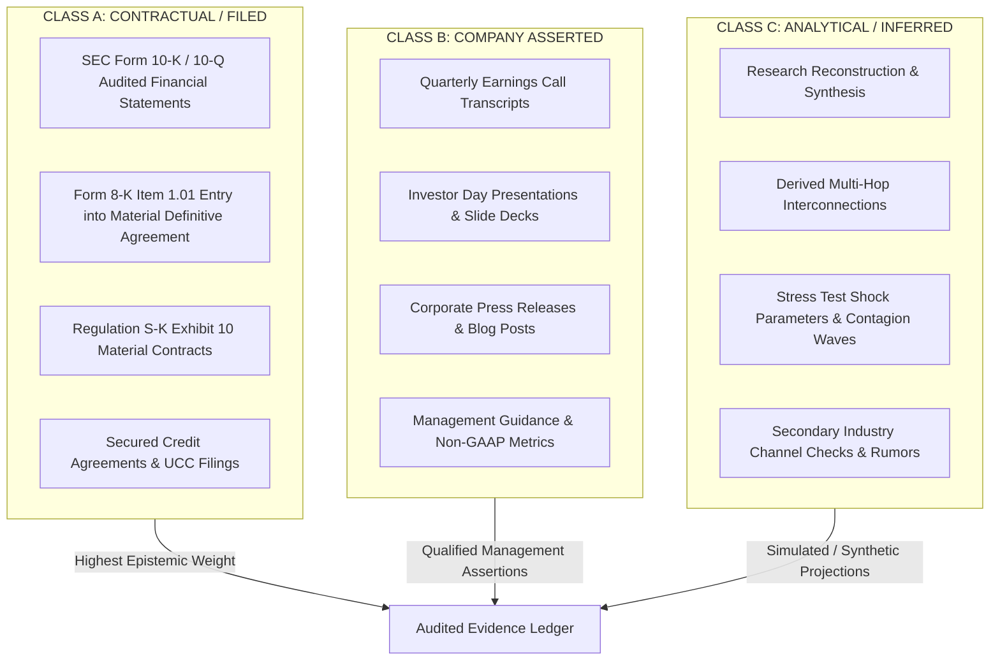

# Evidence Contract & Epistemic Trust Hierarchy

The AI Infrastructure Financial Network relies on explicit evidence tagging to prevent analytical drift. When multi-agent systems and LLMs synthesize corporate disclosures across multiple iterations, there is a systemic risk of semantic creep:
$$\text{"management anticipates strong demand"} \quad\xrightarrow{\text{3 iterations}}\quad \text{"company has legally guaranteed \$10B in purchases"}$$

To enforce epistemic rigor and preserve auditability, every claim, edge, and obligation registered in this repository must comply with this Evidence Contract.

---

## 1. The Three Evidence Classes

### Class A: Contractual / Filed (Highest Trust)
- **Definition:** Legally binding instruments, audited financial statements, or regulatory disclosures where material misstatements carry statutory liability under Section 11/12 of the Securities Act or Section 18 of the Exchange Act.
- **Accepted Sources:**
  - SEC Form 10-K and 10-Q periodic reports (Balance Sheet, Income Statement, Cash Flows, Notes).
  - SEC Form 8-K filings under Item 1.01 (*Entry into a Material Definitive Agreement*).
  - Exhibit 10 material contracts (Lease agreements, Master Service Agreements, Credit and Guaranty agreements).
  - Public utility regulatory dockets (FERC, state utility commission interconnection approvals).
- **Enforcement:** Must contain an immutable SEC EDGAR Accession Number, exact filing date, and verbatim supporting quote.

### Class B: Company Asserted (Qualified Trust)
- **Definition:** Voluntary public disclosures made by corporate executives that reflect forward-looking expectations, management claims, or non-audited operational indicators.
- **Accepted Sources:**
  - Executive prepared remarks and Q&A sessions on quarterly earnings conference calls.
  - Form 8-K filings under Item 2.02 (*Results of Operations and Financial Condition*) or Item 7.01 (*Regulation FD Disclosure*).
  - Official investor day presentations, whitepapers, and product launch announcements.
- **Enforcement:** Must be flagged with `evidence_class: B` and an explicit note acknowledging management forward-looking bias. Cannot be modeled as an unconditional legal guarantee.

### Class C: Analytical / Inferred (Synthetic / Exploratory)
- **Definition:** Reconstructed relationships, heuristic channel checks, or adversarial counterfactual assumptions generated by the researcher or model.
- **Accepted Sources:**
  - Secondary equipment broker price quotes (used H100 GPU auction clearings).
  - Estimated contract values when exact dollar figures are redacted pursuant to SEC confidential treatment requests.
  - Stress test perturbation vectors (-40% residual value, +300 bps spread, 12-month power delay).
- **Enforcement:** Must be explicitly tagged as `evidence_class: C`. Downstream stress tests must distinguish between defaults triggered by Class A contractual terms versus Class C inferred vulnerabilities.

---

## 2. Integrity and Anti-Hallucination Rules

1. **Immutable Locators:** No obligation record may be added to `obligations.parquet` without a corresponding `claim_id` in `evidence_claims.parquet` possessing a valid SEC Accession Number or documented public URL.
2. **Quotation Preservation:** The `exact_quote` field must contain the verbatim text from the primary source, unaltered by paraphrasing.
3. **No Synthetic Promotion:** An inferred relationship (Class C) may never be promoted to Class A without locating the filed agreement or audited note.
4. **Redaction Transparency:** When material contracts contain redactions (`[***]`), the missing parameter must be recorded as `null` with confidence $< 0.8$, rather than filled with speculative estimates.
