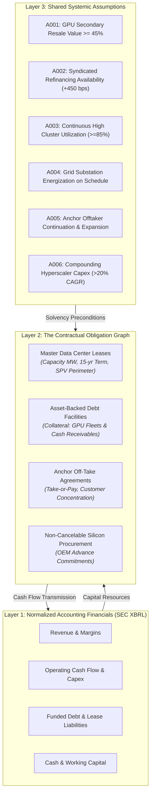
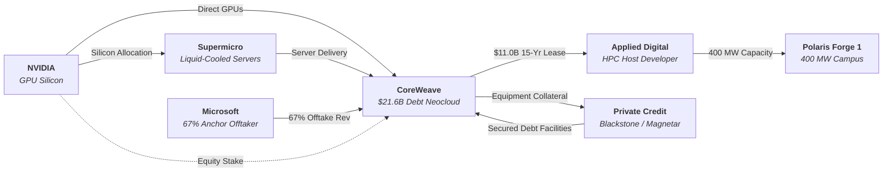

# Methodology: The AI Infrastructure Financial Network

> **Central Thesis:** The systemic vulnerability of capital-intensive technology buildouts rarely resides in hidden data. It resides in **hidden relationships between data that is publicly visible**. A system can be transparent locally and opaque globally. The crisis lives in the **JOIN**.

---

## 1. Epistemic Architecture: The Three Layers

Contemporary equity research and credit analysis evaluate corporate balance sheets in isolation:
$$\text{Company} \longrightarrow \text{Financial Statements} \longrightarrow \text{Solvency / Valuation}$$

This paradigm fails in hyper-connected, project-financed ecosystems where balance sheets are linked by contractual commitments, asset-backed debt facilities, and shared macroeconomic assumptions. We decompose the AI infrastructure ecosystem into three distinct epistemic layers:

### Layer 0: Primary SEC Proof & Epistemic Invariance
A network model of credit contagion is only as reliable as its primary evidence. Modeling complex corporate and project-finance relationships cannot rely on joins over unverified or fabricated metadata. Epistemic integrity requires:
1. **Verified Primary Sources:** Every claim cited must exist in genuine primary SEC EDGAR submissions (`data/raw/sec/*.json`), verified against accession number, form type, and filing date (`validate_sec_source_existence()`).
2. **Claim Duality (Truth vs Knowledge):** Every point-in-time attribute in `obligation_facts` tracks:
   - `truth_claim_id`: Audited document certifying structural parameters (e.g. Form 10-K / 10-Q Note 7).
   - `knowledge_claim_id`: Contemporaneous public announcement establishing earliest public market awareness (e.g. Form 8-K on closing date).
   - Strict temporal invariant: `fact.publicly_known_from >= claims[knowledge_claim_id].filing_date`.
3. **Discrete Instrument De-aggregation:** Avoid umbrella credit facility approximations. Facilities are broken down into contract-literal tranches with distinct borrowing SPVs, facility capacities, draw amounts, and explicit recourse/guarantee perimeters (e.g. CoreWeave's 16 discrete debt tranches totaling $35.551B and 5 parent guarantee edges).
4. **Bitemporal Financial Snapshot Resolution:** Financial statement metrics (cash, debt, leases, OCF) are resolved dynamically via `resolve_temporal_financials(as_of_date, temporal_mode)` from point-in-time XBRL facts, strictly enforcing `filed_date <= as_of_date` in knowledge mode to eliminate look-ahead bias across both network topology and balance sheet layers.

### Layer 1: Standardized Accounting Financials
Extracts standardized historical facts directly from the SEC EDGAR XBRL Application Programming Interface (`data.sec.gov`). Provides audited baseline metrics:
- Revenue, Cost of Goods Sold, Gross Margin
- Operating Income, Net Income
- Cash and Cash Equivalents
- Operating Cash Flow (OCF), Capital Expenditures (Payments for PP&E)
- Funded Debt (Current and Non-Current)
- Operating Lease Liabilities (ASC 842 Current and Non-Current)
- Remaining Performance Obligations (RPO / Backlog)

### Layer 2: The Contractual Obligation Graph
The primary unit of analysis is not the company; it is the **contractual obligation**.
- **Nodes** ($V$): Corporate entities, Special Purpose Vehicles (SPVs), financing syndicates, and physical project campuses.
- **Edges** ($E$): Legal agreements conveying capital, capacity, equipment, guarantees, or future cash flows.
- **Attributes**:
  $$\text{Obligation} = \langle \text{id}, u, v, \text{type}, \text{amount}, \text{term}, \text{recourse}, \text{collateral}, \text{guarantee}, \text{assumptions}, \text{evidence\_class} \rangle$$

### Layer 3: Shared Systemic Assumptions
An assumption is an underlying economic proposition that makes one or more contractual obligations viable. When multiple legally independent entities erect obligations upon the *same* underlying assumption, they become correlated. If that assumption shifts from 90% true to 70% true, distress propagates across edges that conventional financial models treat as uncorrelated.

---

## 2. Taxonomy of Opacity in 2020s Capital Structures

1. **Perimeter Opacity**: Liabilities reside in bankruptcy-remote subsidiaries or project SPVs rather than the consolidated parent.
   - *Specimen:* CoreWeave transferring Polaris Forge 1 lease obligations to `CoreWeave Compute Acquisition Co. VIII, LLC`, releasing parent liability on Building ELN-03 while Applied Digital guarantees lessor obligations via `APLD ELN-02/03 LLC`.
2. **Network Opacity**: Each participant knows their direct counterparty exposure, but neither sees aggregate market-wide exposure or shared dependencies.
   - *Specimen:* Multiple server OEMs and lenders assuming diversified risk while 67% of neocloud compute demand traces back to a single hyperscaler (Microsoft).
3. **Contract Opacity**: Backlog and lease totals are disclosed as headline figures ($11.0B, $21.6B), but termination triggers, milestone-indexed payments, and liquidated damages provisions remain buried in Exhibit 10 agreements.
4. **Valuation Opacity**: Secondary asset collateral (H100/H200 GPU clusters) is marked based on recent procurement cost rather than liquidation clearing prices under simultaneous selling pressure.
5. **Temporal Opacity**: Severe cash flow maturity mismatches: 5-year debt facilities and 2-year GPU obsolescence cycles funding 15-year data center lease commitments with utility energization lead times spanning 24–36 months.

---

## 3. Mathematical Formulation of Contagion

Let the obligation network be a directed multi-graph $G = (V, E)$.
Each edge $e = (u, v) \in E$ has:
- Principal / Contract Value: $w(e) \in \mathbb{R}^+$
- Dependency Set of Assumptions: $\mathcal{A}(e) \subseteq \{A_1, \dots, A_m\}$
- Recourse Mode: $\rho(e) \in \{\text{full}, \text{limited\_spv}, \text{non\_recourse}\}$

### 1st-Order Shock Propagation
When an assumption $A_k$ is perturbed under scenario $S$:
$$E^{(1)}(S) = \{e \in E \mid A_k \in \mathcal{A}(e)\}$$
The set of directly stressed entities experiencing debt service shortfalls or collateral calls is:
$$V^{(1)}(S) = \{u \mid (u, v) \in E^{(1)}(S)\} \cup \{v \mid (u, v) \in E^{(1)}(S)\}$$

### 2nd-Order Liquidity Contagion
A stressed debtor $u \in V^{(1)}$ facing liquidity exhaustion or debt acceleration curtails outgoing commitments. The 2nd-order impaired edge set is:
$$E^{(2)}(S) = \{(u, w) \in E \setminus E^{(1)}(S) \mid u \in V^{(1)}(S)\}$$

### Systemic Vulnerability Index
The systemic vulnerability of an assumption $A_k$ is defined by the total contractual value and edge fraction it destabilizes:
$$\Psi(A_k) = \sum_{e \in E^{(1)}(A_k) \cup E^{(2)}(A_k)} w(e)$$
$$\text{Fragility Ratio } \Phi(A_k) = \frac{|E^{(1)}(A_k) \cup E^{(2)}(A_k)|}{|E|}$$

---

## 4. The Five-Company Pilot

The pilot tests this methodology on five companies forming a closed capital and hardware loop:

