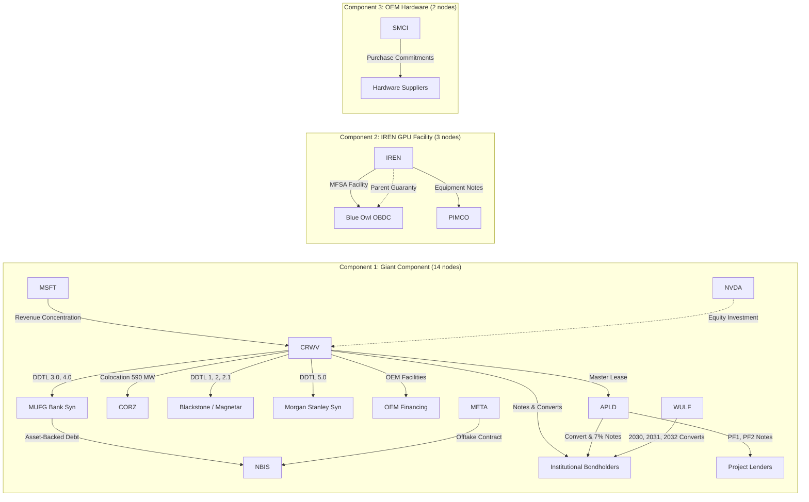
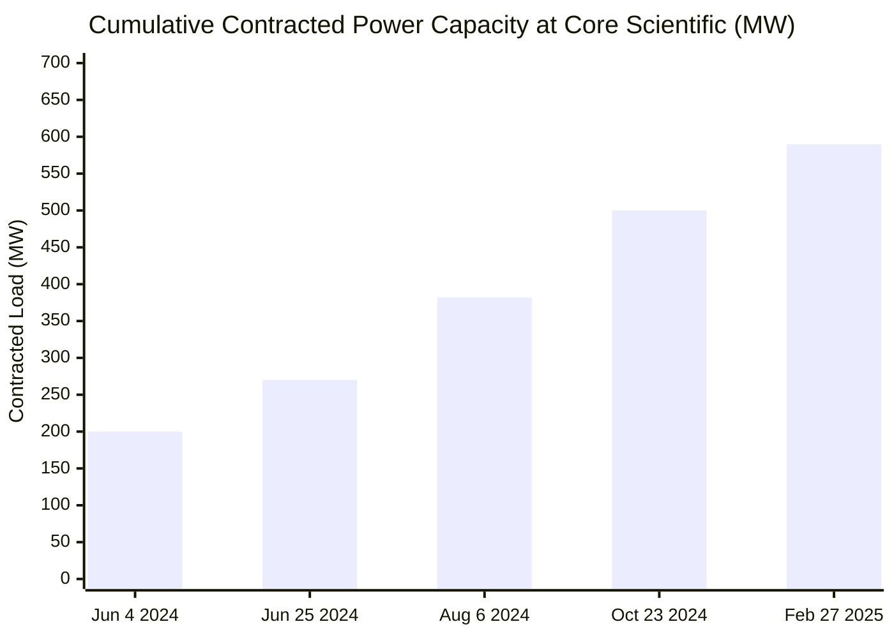
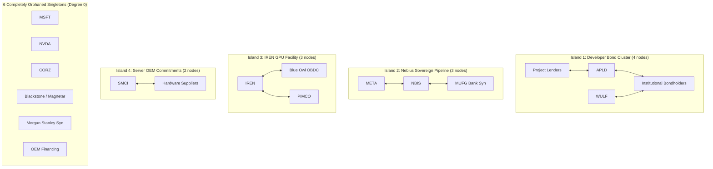

# Phase 1 Analysis Sprint 1.1: Structural, Epistemic, and Falsification Report

**Date:** September 30, 2026  
**Dataset Baseline:** Frozen at commit `2285391` (ADR-019.1 Certified)  
**Corpus State:** 46 registered entities, 47 decomposed obligations, 56 lifecycle events, 64 bitemporal facts, 44 attribute-level contract terms, 54 audited evidence claims (46 primary SEC HTML exhibits).

---

## Executive Summary & Core Verdicts

This report presents the refined **Phase 1 Analysis Sprint 1.1**, auditing the topological, epistemic, and falsification findings across six foundational research questions:

1. **Articulation Points & Cactus Graph Topology:**
   - **Simple Root-Pair Projection:** When parallel contracts between the same two root corporate parents are collapsed into a single undirected relationship, the active network is mathematically a **cactus graph** containing **only one non-trivial 2-connected cycle block**—the 3-node triangle `[CRWV, APLD, INSTITUTIONAL_BONDHOLDERS]`. All other 14 biconnected components are single cut-edges (bridges).
   - **Consolidated Multigraph:** When parallel legal obligations are preserved, exactly **6 single-contract bridges** exist (`NVDA-CRWV`, `CRWV-CORZ`, `CRWV-MSFT`, `SMCI-HARDWARE_SUPPLIERS`, `NBIS-META`, `IREN-PIMCO`). The remaining 8 counterparty pairs feature multiple stacked contracts.
   - **Cut-Vertices:** 6 articulation points exist (`CRWV`, `MUFG_BANK_SYN`, `APLD`, `INSTITUTIONAL_BONDHOLDERS`, `NBIS`, `IREN`). CoreWeave is the ultimate articulation hub: removing `CRWV` shatters the 14-node giant component into 6 isolated singletons and 2 fragmented subgraphs.
2. **Assumption Metrics: Density, Breadth, and Link Strength:**
   - **Zero Dollar Mixing:** We eliminate aggregate cross-category summing, tabulating exposures strictly by distinct `amount_type`.
   - **Refinancing Availability (`A002`) is Hyper-Dense:** 31 active edges concentrated across only 8 root entities and 8 counterparty pairs (density ratio = **3.88 edges/pair**), representing \$42.15B in principal debt and \$11.0B in lease commitments. 27 edges are `direct_contractual` balloon maturity obligations.
   - **GPU Residual Value (`A001`) is Systemically Broad:** 25 active edges spanning **13 of 19 connected root entities** (68.4% of all active actors) across 9 counterparty pairs, representing \$22.05B in principal debt and \$34.20B in purchase commitments.
   - **Link-Strength Classification:** `A001` directly and contractually governs **11 root entities** (21 `direct_collateral` borrowing-base/equipment debt edges + 1 `direct_contractual` purchase commitment edge). Only **2 entities** (`WULF`, `INSTITUTIONAL_BONDHOLDERS`) are `issuer_indirect` (unsecured convertibles with no GPU collateral pledge).
   - **Power Delivery (`A004`) as the Leading Physical Bridge:** 10 active edges across **10 root entities** and 7 counterparty pairs (\$11.0B lease + \$6.87B debt), all categorized as `operational_dependency`.
3. **Concrete Transmission Pipelines:** Three distinct pipelines operate in the network:
   - **Pipeline 1 (Neocloud Demand & Infrastructure Host):** `MSFT` (\$3.438B rev) $\to$ `CRWV` $\to$ `APLD` (\$11.0B lease, 400 MW, 2 springing guarantees) & `CORZ` (590 MW colocation) $\to$ Project Lenders (\$4.50B) & Institutional Bondholders (**\$2.04B direct APLD obligations** across \$450M convertibles + \$1.59B 7% notes).
   - **Pipeline 2 (Sovereign/FPI Offtake & Bank Debt):** `META` (\$27.0B offtake) $\to$ `NBIS` $\to$ `MUFG_BANK_SYN` (\$775M asset-backed debt via Finnish/US borrower SPVs).
   - **Pipeline 3 (Direct Miner GPU Note Financing):** `IREN` $\to$ `BLUE_OWL_OBDC` (\$1.2B facility) & `PIMCO` (\$1.2B facility) backed by \$2.4B parent guarantee proxy.
4. **Temporal Network Evolution (2024 $\to$ 2026):** Reconstructing point-in-time snapshots reveals the cumulative dependency buildup:
   - Core Scientific colocation scaled monotonically: 200 MW (Jun 2024) $\to$ 270 MW (Jun 2024) $\to$ 382 MW (Aug 2024) $\to$ 500 MW (Oct 2024) $\to$ 590 MW (Feb 2025).
   - Public knowledge lagged economic reality throughout 2024–2025 (e.g. on 2025-02-27, 13 economic edges existed, but only 6 were publicly known).
   - Minimum observed principal debt in the fact ledger rose from \$650M (2024) to \$2.675B (2025) to \$45.45B (Sep 2026), reflecting fact-ledger documentation of syndicated facilities.
5. **Missing Edge Sensitivity (Fully Executed):**
   - Adding a common grid utility node (`AEP -> APLD & CORZ`) integrates Core Scientific into the domestic data-center bond component even if CoreWeave fails.
   - An interbank bridge (`MUFG <-> OBDC`) merges Component 2 into the giant component (17 nodes).
   - An OEM delivery contract (`SMCI <-> CRWV`) merges Component 3.
   - Combined horizontal integration (`MUFG <-> OBDC` + `SMCI <-> CRWV`) **collapses all 3 components into a single 19-node connected graph**.
6. **The Falsification Verdict (The Network Without CoreWeave):** Excising `CRWV` entirely removes 29 of 45 legal edges (64.4%) and completely **orphans 6 root entities** (`MSFT`, `NVDA`, `CORZ`, `BLACKSTONE`, `MS_SYN`, `OEM_FIN`). Internal 2-hop chains survive within the Nebius cluster (`META -> NBIS -> MUFG`) and developer bond cluster (`PROJ_LEND -> APLD -> BONDS <- WULF`), but **cross-cluster connective topology is completely severed**. This proves conclusively that **our current observatory is still substantially an autopsy of the CoreWeave credit ecosystem** rather than an isotropic, multi-hub map of the AI infrastructure economy.

---

## 1. Articulation Points & Cactus Graph Topology

### Mathematical Topology: Simple Root-Pair Projection vs. Consolidated Multigraph
As of September 28, 2026, the active network contains $|V| = 19$ connected root corporate entities and $|E| = 45$ active legal obligations partitioned into **3 connected components**:
1. **Component 1 (Giant Component, 14 nodes):** `CRWV`, `MSFT`, `NVDA`, `APLD`, `CORZ`, `WULF`, `NBIS`, `META`, `MUFG_BANK_SYN`, `BLACKSTONE_MAGNETAR_SYN`, `MORGAN_STANLEY_SYN`, `OEM_FINANCING_PARTNERS`, `PROJECT_LENDERS`, `INSTITUTIONAL_BONDHOLDERS`.
2. **Component 2 (IREN Credit Island, 3 nodes):** `IREN`, `BLUE_OWL_OBDC`, `PIMCO`.
3. **Component 3 (Server OEM Island, 2 nodes):** `SMCI`, `HARDWARE_SUPPLIERS`.



### The Cactus Graph (Simple Root-Pair Projection)
To analyze the structural backbone of corporate counterparty relationships without multi-contract noise, we define the **simple root-pair projection** $U_{simple} = (V, E_{simple})$, where an undirected edge $(u, v)$ exists if and only if at least one active contractual obligation exists between root parent $u$ and root parent $v$.

Computing the biconnected component decomposition on $U_{simple}$ proves that the simple projection is mathematically a **cactus graph** containing **15 blocks**:
* **The Solitary Cycle Block (1 cycle block of size 3):** `[CRWV, APLD, INSTITUTIONAL_BONDHOLDERS]` forms a closed triangular loop:
  - `CRWV <-> APLD` (master lease and springing guarantees)
  - `CRWV <-> INSTITUTIONAL_BONDHOLDERS` (senior notes and convertibles)
  - `APLD <-> INSTITUTIONAL_BONDHOLDERS` (convertible notes and 7.00% successor notes)
* **The Bridge Blocks (14 bridge blocks of size 2):** Every other counterparty relationship in the simple projection is a cut-edge (bridge of size 2):
  - `CRWV <-> MSFT`, `CRWV <-> NVDA`, `CRWV <-> CORZ`, `CRWV <-> BLACKSTONE_MAGNETAR_SYN`, `CRWV <-> MORGAN_STANLEY_SYN`, `CRWV <-> OEM_FINANCING_PARTNERS`, `CRWV <-> MUFG_BANK_SYN`
  - `MUFG_BANK_SYN <-> NBIS`, `NBIS <-> META`
  - `APLD <-> PROJECT_LENDERS`, `INSTITUTIONAL_BONDHOLDERS <-> WULF`
  - `SMCI <-> HARDWARE_SUPPLIERS`, `IREN <-> BLUE_OWL_OBDC`, `IREN <-> PIMCO`.

### The Consolidated Multigraph (Single-Contract Bridges)
In contrast, in the underlying **consolidated multigraph** $M_{undir}$ (where distinct legal facilities are preserved as parallel edges), an edge is a bridge if and only if deleting that specific contract severs a component.

Because 8 counterparty pairs feature multiple stacked facilities (e.g. 8 notes between CRWV and Bondholders, 4 facilities between CRWV and Blackstone, 3 facilities between APLD and Project Lenders), there are **only 6 single-contract multigraph bridges**:
$$\text{Multigraph Bridges} = \{(\text{NVDA}, \text{CRWV}), (\text{CRWV}, \text{CORZ}), (\text{CRWV}, \text{MSFT}), (\text{SMCI}, \text{HARDWARE\_SUPPLIERS}), (\text{NBIS}, \text{META}), (\text{IREN}, \text{PIMCO})\}$$

### Cut-Vertices (Articulation Points)
The 6 articulation points in the network (identical on both projections) are:
$$\text{Cut-Vertices} = \{\text{CRWV}, \text{MUFG\_BANK\_SYN}, \text{APLD}, \text{INSTITUTIONAL\_BONDHOLDERS}, \text{NBIS}, \text{IREN}\}$$

### Node Removal Sensitivity Matrix
| Removed Node | Original Components | Resulting Components | Max Component Size | Orphaned (Degree-0) Nodes | Resulting Graph Composition |
| :--- | :---: | :---: | :---: | :---: | :--- |
| **`CRWV`** | **3** | **4** | **4** | **6** (`MSFT`, `NVDA`, `CORZ`, `BLACKSTONE`, `MS_SYN`, `OEM_FIN`) | `[APLD, BONDS, PROJ_LEND, WULF]` (4), `[META, MUFG, NBIS]` (3), `[OBDC, IREN, PIMCO]` (3), `[SMCI, HW_SUP]` (2) |
| **`MUFG_BANK_SYN`** | 3 | 4 | 11 | 0 | Giant component loses `[META, NBIS]`; 11-node CoreWeave core remains intact |
| **`APLD`** | 3 | 3 | 12 | 1 (`PROJECT_LENDERS`) | Core component retains 12 nodes; `PROJECT_LENDERS` orphaned |
| **`INSTITUTIONAL_BONDHOLDERS`** | 3 | 3 | 12 | 1 (`WULF`) | Core component retains 12 nodes; `WULF` orphaned |
| **`NBIS`** | 3 | 3 | 12 | 1 (`META`) | Core component retains 12 nodes; `META` orphaned |
| **`IREN`** | 3 | 2 | 14 | 2 (`BLUE_OWL_OBDC`, `PIMCO`) | Component 2 destroyed completely |
| **`BLUE_OWL_OBDC`** | 3 | 3 | 14 | 0 | `[IREN, PIMCO]` remains connected |
| **`CORZ`** | 3 | 3 | 13 | 0 | Giant component reduced to 13 nodes |

---

## 2. Shared Assumptions: Density, Breadth, and Link Strength

### Assumption Linkage Strength Typology
To eliminate analytical conflation between direct contractual governance and indirect macroeconomic exposure, we classify all 80 active obligation-assumption linkages into five rigorous categories:
1. `direct_contractual`: Explicit borrowing base, advance rate formula, non-cancelable purchase commitment, take-or-pay clause.
2. `direct_collateral`: First-lien security interest pledged over hardware/assets.
3. `operational_dependency`: Physical power delivery, substation energization, cluster utilization.
4. `issuer_indirect`: Unsecured convertible notes, equity, or general debt without collateral/borrowing base.
5. `analytical_hypothesis`: Synthetic proxy or stress parameter.

### Empirical Assumption Dependency Table
| ID | Assumption Name | Active Edges | Root Entities | Root Pairs | Edge Density ($\delta_{pair}$) | Actor Breadth ($\beta_{node}$) | Link Strength Breakdown | Direct Governed Nodes | Indirect Only Nodes | Primary Amount Types |
| :--- | :--- | :---: | :---: | :---: | :---: | :---: | :--- | :---: | :---: | :--- |
| **`A002`** | **REFINANCING_AVAILABILITY** | **31** | 8 | 8 | **3.88** | 42.1% | 27 direct contractual, 1 operational, 3 indirect | **8** | **0** | \$42.15B principal debt, \$11.0B lease |
| **`A001`** | **GPU_RESIDUAL_VALUE** | **25** | **13** | **9** | 2.78 | **68.4%** | 21 direct collateral, 1 contractual, 3 indirect | **11** | **2** (`WULF`, `BONDS`) | \$22.05B principal debt, \$34.20B purchase commit |
| **`A004`** | **POWER_DELIVERY_TIMELINE** | **10** | **10** | **7** | 1.43 | **52.6%** | 10 operational dependency | **10** | **0** | \$11.00B lease, \$6.87B principal debt |
| **`A003`** | **CLUSTER_UTILIZATION** | 5 | 5 | 3 | 1.67 | 26.3% | 4 operational, 1 direct contractual | **5** | **0** | \$38.00B lifetime contract value |
| **`A005`** | **ANCHOR_CUSTOMER_CONTINUATION**| 4 | 3 | 2 | 2.00 | 15.8% | 3 operational, 1 direct contractual | **3** | **0** | \$3.44B recognized rev, \$11.0B lease |
| **`A006`** | **HYPERSCALER_CAPEX_EXPANSION** | 4 | 7 | 4 | 1.00 | 36.8% | 2 direct contractual, 2 indirect | **4** | **3** (`CRWV`, `MSFT`, `NVDA`) | \$34.2B commit, \$27.0B offtake, \$3.4B rev, \$2.0B eq |
| **`A007`** | **BACKLOG_CASH_CONVERSION** | 1 | 2 | 1 | 1.00 | 10.5% | 1 direct contractual | **2** | **0** | \$34.20B purchase commitments |

### The Analytical Dichotomy: `A002` (Density) vs. `A001` (Breadth)
1. **Refinancing Availability (`A002`) is Hyper-Dense:**
   - 31 edges over 8 counterparty pairs ($\delta_{pair} = 3.88$).
   - 27 edges are `direct_contractual` balloon maturity obligations.
   - All 8 root entities are directly governed; zero entities are indirect-only.
   - **Mechanism:** Capital structure debt-stack rollover.
2. **GPU Residual Value (`A001`) is Systemically Broad:**
   - Touching 13 of 19 root entities ($\beta_{node} = 68.4\%$).
   - **Direct Governance:** 21 `direct_collateral` edges (DDTLs, OEM facilities, equipment notes) and 1 `direct_contractual` edge (`SMCI` inventory commitments) directly govern **11 root entities**.
   - **Indirect Only:** Only 2 root entities (`WULF` and `INSTITUTIONAL_BONDHOLDERS`) touch `A001` purely through `issuer_indirect` unsecured convertible notes with no collateral pledge.
   - **Mechanism:** Asset recoverability and advance rate borrowing-base solvency.
3. **Power Delivery (`A004`) as the Leading Physical Bridge:**
   - Ranks second in actor breadth (10 root entities, 52.6%).
   - All 10 edges represent `operational_dependency`: physical substation energization is the bridge between real estate developers (`APLD`, `CORZ`), neoclouds, and equipment-financing facilities (`IREN`, `NBIS`).

---

## 3. Concrete Transmission Pipelines

### Pipeline 1: Hyperscaler Demand to Neocloud to Infrastructure Hosts
Models the transmission of compute demand and counterparty risk from the hyperscaler layer into real estate and capital markets:

$$\text{MSFT} \xrightarrow[\$3.438\text{B Recognized Rev}]{\text{Concentration (67\%)}} \text{CRWV} \xrightarrow[\text{400 MW / 2 Guarantees}]{\$11.0\text{B Lease}} \text{APLD} \xrightarrow[\$1.59\text{B 7\% Notes}]{\$4.50\text{B Project Debt}} \{\text{Project Lenders, Bondholders}\}$$
$$\text{CRWV} \xrightarrow[\text{12-Yr Colocation}]{\text{590 MW Capacity}} \text{CORZ}$$

```
+-------------------------------------------------------------------------------------------------------------------------+
| Pipeline 1: Demand -> Neocloud -> Real Estate Hosts -> Project Debt                                                      |
+------------------------------------+---------------+---------------+-----------------------+-----------------+----------+
| Obligation ID                      | From          | To            | Type                  | Value / MW      | Known At |
+------------------------------------+---------------+---------------+-----------------------+-----------------+----------+
| REL-MSFT-CRWV-REVENUE-CONCENTRATION| MSFT          | CRWV          | customer_concentration| $3.438B rev     | 2026-03-02
| OBL-CRWV-APLD-LEASE                | CRWV_SPV_VIII | APLD_COMPUTECO| datacenter_lease      | $11.0B (400 MW) | 2025-06-02
| OBL-CRWV-APLD-GUARANTY-ELN02       | CRWV          | APLD_ELN02_LLC| contingent_guaranty   | Phase 2/4 Space | 2026-04-01
| OBL-CRWV-APLD-GUARANTY-ELN03       | CRWV          | APLD_ELN03_LLC| contingent_guaranty   | $4.125B Class C | 2026-04-01
| OBL-CRWV-CORZ-COLOCATION-2024      | CRWV          | CORZ          | capacity_reservation  | 590.0 MW        | 2024-06-04
| OBL-APLD-DEBT-PF1                  | APLD_COMPUTECO| PROJ_LENDERS  | debt_facility         | $2.350B (9.25%) | 2026-07-29
| OBL-APLD-DEBT-PF2                  | APLD_COMPUTEC2| PROJ_LENDERS  | debt_facility         | $2.150B (6.75%) | 2026-07-29
| OBL-APLD-DEBT-CONV                 | APLD          | BONDHOLDERS   | debt_facility         | $450.0M (2.75%) | 2026-07-29
| OBL-APLD-DEBT-7PCT-2026            | APLD_COMPUTEC3| BONDHOLDERS   | debt_facility         | $1.590B (7.00%) | 2026-06-16
+------------------------------------+---------------+---------------+-----------------------+-----------------+----------+
```
> [!NOTE]
> **APLD Bondholder Total:** APLD's direct obligations to `INSTITUTIONAL_BONDHOLDERS` sum to **\$2.040B** (\$450M convertibles + \$1.59B 7.00% successor notes), alongside **\$4.500B** owed to `PROJECT_LENDERS` (PF1 \$2.35B + PF2 \$2.15B) and \$56.68M residual debt.

### Pipeline 2: Foreign Private Issuer Offtake & Asset-Backed Facility
Models the sovereign/foreign cloud ecosystem: Meta's commercial commitments backstop Nebius, enabling international bank financing:

$$\text{META} \xrightarrow[\text{5-Year Duration}]{\text{Up to }\$27.0\text{B Offtake}} \text{NBIS} \xrightarrow[\text{Term SOFR + 2.50\%}]{\$775\text{M Asset-Backed Facility}} \text{MUFG\_BANK\_SYN}$$

```
+-------------------------------------------------------------------------------------------------------------------------+
| Pipeline 2: Hyperscaler Offtake -> FPI Neocloud -> Bank Syndicate                                                      |
+------------------------------------+-----------------------+---------------+-------------------+--------------+----------+
| Obligation ID                      | From                  | To            | Type              | Value / Cap  | Known At |
+------------------------------------+-----------------------+---------------+-------------------+--------------+----------+
| OBL-NBIS-META-OFFTAKE-2026         | META                  | NBIS_INC      | customer_contract | $27.0B       | 2026-03-16
| OBL-NBIS-DEBT-MUFG-2026            | NBIS_COMPUTECO_II_LLC | MUFG_BANK_SYN | debt_facility     | $775.0M drawn| 2026-07-17
| OBL-NBIS-COBORROWER-MUFG-2026      | NBIS_COMPUTECO_II_OY  | MUFG_BANK_SYN | joint_co_borrower | Joint Finnish| 2026-07-17
| OBL-NBIS-GUARANTY-MUFG-2026        | NBIS                  | MUFG_BANK_SYN | contingent_gnty   | Unconditional| 2026-07-17
+------------------------------------+-----------------------+---------------+-------------------+--------------+----------+
```

### Pipeline 3: Bitcoin Miner HPC Pivot & Private Credit GPU Financing
Models the direct financing of enterprise GPU clusters by private credit BDCs and asset managers without hyperscaler intermediation:

$$\text{IREN} \xrightarrow[\$2.40\text{B Parent Guarantee Proxy}]{\text{Master Financing \& Notes}} \{\text{BLUE\_OWL\_OBDC (\$1.2B)}, \text{PIMCO (\$1.2B)}\}$$

```
+-------------------------------------------------------------------------------------------------------------------------+
| Pipeline 3: Miner HPC Pivot -> Private Credit BDC & Asset Manager Debt                                                  |
+------------------------------------+-----------------------+---------------+-------------------+--------------+----------+
| Obligation ID                      | From                  | To            | Type              | Facility Cap | Known At |
+------------------------------------+-----------------------+---------------+-------------------+--------------+----------+
| OBL-IREN-DEBT-MFSA-2026            | IREN_MACKENZIE_COMPUTE| BLUE_OWL_OBDC | debt_facility     | $1.200B (9%) | 2026-08-27
| OBL-IREN-DEBT-NOTES-2026           | IREN_MACKENZIE_COMPUTE| PIMCO         | debt_facility     | $1.200B (9%) | 2026-08-27
| OBL-IREN-GUARANTY-2026             | IREN                  | BLUE_OWL_OBDC | contingent_gnty   | $2.40B proxy | 2026-08-27
+------------------------------------+-----------------------+---------------+-------------------+--------------+----------+
```

---

## 4. Temporal Network Evolution (2024 $\to$ 2026)

Reconstructing the network across 20 milestone dates reveals the step-function scaling of contracted power capacity, the chronic information lag, and the progression of **measured principal debt captured in the contemporaneous fact ledger**.

> [!IMPORTANT]
> **Interpretation of Historical Debt:**
> The `measured_principal_in_ledger_usd` series sums only those principal balances captured in contemporaneous fact observations. Unmeasured historical debt defaults to zero. This metric reflects the **growth of documented debt in the public fact ledger**, rather than newly issued corporate debt from zero.



### Multi-Era Trajectory Summary
```
+------------+--------------------------------------------+-----------+-------+--------------------+--------------------+----------+
| Date       | Milestone Event                            | Econ Edges| Known | Measured Prin Econ | Measured Prin Known| CORZ MW  |
+------------+--------------------------------------------+-----------+-------+--------------------+--------------------+----------+
| 2024-01-01 | Early Neocloud (DDTL 1.0, Magnetar)        |         2 |     0 | $0.00              | $0.00              | None     |
| 2024-06-04 | CRWV / CORZ Initial 200 MW Colocation      |         6 |     1 | $0.00              | $0.00              | 200.0 MW |
| 2024-06-25 | CORZ Option 1 Exercise (270 MW)            |         7 |     2 | $0.00              | $0.00              | 270.0 MW |
| 2024-08-06 | CORZ Option 2 Exercise (382 MW)            |         8 |     3 | $150.0M            | $150.0M            | 382.0 MW |
| 2024-10-23 | CORZ Option 3 Exercise (500 MW)            |         8 |     3 | $150.0M            | $150.0M            | 500.0 MW |
| 2024-10-25 | WULF 2030 Convertible Notes ($500M)        |         9 |     4 | $650.0M            | $650.0M            | 500.0 MW |
| 2024-12-31 | End of 2024 Baseline                       |        10 |     5 | $650.0M            | $650.0M            | 500.0 MW |
| 2025-02-27 | CORZ Option 4 / Denton Expansion (590 MW)  |        13 |     6 | $650.0M            | $650.0M            | 590.0 MW |
| 2025-05-28 | APLD Polaris Forge 1 Lease ($11.0B, 400 MW)|        15 |    12 | $650.0M            | $650.0M            | 590.0 MW |
| 2025-08-20 | WULF 2031 Convertible Initial ($850M)      |        22 |    18 | $1.500B            | $1.500B            | 590.0 MW |
| 2025-08-22 | WULF 2031 Greenshoe Exercise ($1.0B total) |        22 |    18 | $1.650B            | $1.650B            | 590.0 MW |
| 2025-09-29 | CRWV DDTL 2.1 Facility ($3.0B)             |        24 |    18 | $1.650B            | $1.650B            | 590.0 MW |
| 2025-10-31 | WULF 2032 Convertible Notes ($1.025B)      |        25 |    21 | $2.675B            | $2.675B            | 590.0 MW |
| 2025-12-31 | End of 2025 Baseline                       |        26 |    22 | $2.675B            | $2.675B            | 590.0 MW |
| 2026-03-30 | CRWV DDTL 4.0 MUFG Facility ($8.5B cap)    |        32 |    24 | $2.675B            | $2.675B            | 590.0 MW |
| 2026-04-21 | CRWV 9.75% Notes Add-on ($2.75B total)     |        34 |    30 | $5.425B            | $5.425B            | 590.0 MW |
| 2026-05-11 | HUT 8 Coatue Note Extinction               |        34 |    31 | $5.275B            | $5.275B            | 590.0 MW |
| 2026-06-16 | APLD Bridge Refi into 7% Notes ($1.59B)    |        37 |    33 | $11.872B           | $11.815B           | 590.0 MW |
| 2026-06-18 | CRWV 2032 Senior Notes ($1.25B + €2.0B)    |        39 |    35 | $11.872B           | $11.815B           | 590.0 MW |
| 2026-09-28 | Current Hardened Snapshot                   |        45 |    45 | $45.448B           | $45.448B           | 590.0 MW |
+------------+--------------------------------------------+-----------+-------+--------------------+--------------------+----------+
```

---

## 5. Missing Edge Sensitivity Analysis (Fully Executed)

We executed seven concrete sensitivity scenarios in [`src/analyze_sprint.py`](file:///c:/Users/admir/Github/computational-sketchbook/2026/2026-09-28-ai-infrastructure-network/src/analyze_sprint.py), testing single-edge bypasses, common utility interconnects, and multi-edge horizontal integration:

| Scenario | Added Relationship(s) | Economic Thesis | Components | Max Size | CRWV Still Articulation Point? | CORZ Orphaned Without CRWV? | Cut-Vertices |
| :--- | :--- | :--- | :---: | :---: | :---: | :---: | :--- |
| **Baseline** | None | Hardened Active Topology | **3** | **14** | **Yes** | **Yes** | 6 (`BONDS`, `APLD`, `CRWV`, `NBIS`, `MUFG`, `IREN`) |
| **SCEN-01** | `META -> APLD` | Hyperscaler Direct Offtake | 3 | 14 | Yes | Yes | 4 (`BONDS`, `APLD`, `CRWV`, `IREN`) |
| **SCEN-02** | `MSFT -> CORZ` | Direct Hyperscaler HPC Reservation | 3 | 14 | Yes | **No** | 6 (`BONDS`, `APLD`, `CRWV`, `NBIS`, `MUFG`, `IREN`) |
| **SCEN-03** | `MUFG -> APLD` | Common Bank Syndicate Debt | 3 | 14 | Yes | Yes | 6 (`BONDS`, `APLD`, `NBIS`, `MUFG`, `CRWV`, `IREN`) |
| **SCEN-04** | `BLACKSTONE -> NBIS` | Common Private Credit Facility | 3 | 14 | Yes | Yes | 5 (`BONDS`, `APLD`, `CRWV`, `NBIS`, `IREN`) |
| **SCEN-05** | `MUFG <-> OBDC` | Interbank Syndicate Bridge | **2** | **17** | Yes | Yes | 7 (`BONDS`, `APLD`, `CRWV`, `NBIS`, `MUFG`, `IREN`, `OBDC`) |
| **SCEN-06** | `AEP -> APLD` & `AEP -> CORZ`| Common Utility Grid Node | 3 | 15 | Yes | **No** | 6 (`BONDS`, `APLD`, `CRWV`, `NBIS`, `MUFG`, `IREN`) |
| **SCEN-07** | `MUFG <-> OBDC` + `SMCI <-> CRWV` | Horizontal Interbank & OEM Integration | **1** | **19** | Yes | Yes | 8 (`BONDS`, `APLD`, `CRWV`, `NBIS`, `MUFG`, `IREN`, `OBDC`, `SMCI`) |

### Critical Sensitivity Takeaways
1. **Unifying the Entire Graph (SCEN-07):** Connecting the interbank private credit bridge (`MUFG <-> OBDC`) and the OEM server procurement contract (`SMCI <-> CRWV`) **merges all 3 components into a single 19-node connected graph**.
2. **The Utility Bypass (SCEN-06):** Adding a physical grid interconnect (`AEP -> APLD` and `AEP -> CORZ`) connects Core Scientific directly into the domestic developer bond component, ensuring that **Core Scientific is no longer orphaned if CoreWeave fails**.

---

## 6. The Falsification Exercise: The Network Without CoreWeave

To test whether the observatory has mapped an authentic systemic infrastructure graph or merely an autopsy of CoreWeave's corporate perimeter, we completely excise `CRWV` and all its borrowing/equipment SPVs from the dataset.

```
+-------------------------------------------------------------------------------------------------------------------------+
| Falsification Topology: The Network Dissected Without CoreWeave                                                         |
+-------------------------------------------------------------+-----------------------------+-----------------------------+
| Metric                                                      | Baseline (With CoreWeave)   | Excised (Without CoreWeave) |
+-------------------------------------------------------------+-----------------------------+-----------------------------+
| Total Active Legal Edges                                    | 45                          | 16 (-64.4%)                 |
| Active Connected Root Entities                              | 19                          | 12 (-36.8%)                 |
| Completely Orphaned (Degree-0) Entities                     | 0                           | 6 (MSFT, NVDA, CORZ,        |
|                                                             |                             |  BLACKSTONE, MS_SYN, OEM)   |
| Connected Components                                        | 3                           | 4 (Fragmented Islands)      |
| Size of Largest Connected Component                         | 14 nodes                    | 4 nodes                     |
| Cross-Cluster Macro Connective Paths                        | 3 Multi-Tier Chains         | ZERO (Complete Severance)   |
| Internal Subgraph 2-Hop Chains                              | 2                           | 2 (Intact within Islands)   |
| A005 (Anchor Customer Continuation) Edges                   | 4                           | 0 (Completely Evaporated)   |
| A002 (Refinancing Availability) Edges                       | 31                          | 5 (Only APLD Bond Stack)    |
| A001 (GPU Residual Value) Edges                             | 25                          | 10 (SMCI, WULF, IREN, NBIS) |
+-------------------------------------------------------------+-----------------------------+-----------------------------+
```

### The Four Shattered Islands
When `CRWV` is removed, the 14-node giant component dissolves completely into **4 isolated, non-communicating subgraphs**:
1. **The Domestic Developer Bond Island (`[APLD, INSTITUTIONAL_BONDHOLDERS, PROJECT_LENDERS, WULF]`):** 4 nodes. APLD and TeraWulf both issue debt to institutional bondholders and project lenders, with internal 2-hop chain `PROJECT_LENDERS -> APLD -> BONDS <- WULF` intact, but sharing zero operational links.
2. **The Nebius / Meta Pipeline (`[META, MUFG_BANK_SYN, NBIS]`):** 3 nodes. Meta's offtake supports Nebius, which borrows from MUFG. Internal 2-hop chain `META -> NBIS -> MUFG` survives intact, but is completely severed from domestic data centers and bond markets.
3. **The IREN GPU Facility Island (`[BLUE_OWL_OBDC, IREN, PIMCO]`):** 3 nodes. Independent bilateral credit agreements.
4. **The Supermicro OEM Island (`[HARDWARE_SUPPLIERS, SMCI]`):** 2 nodes. Upstream purchase commitments.



### The Falsification Verdict
> [!CAUTION]
> **Definitive Epistemic Verdict:**
> The hypothesis that our current network represents a resilient, multi-hub systemic model of the broader AI infrastructure economy is **falsified**.
> 
> Without CoreWeave:
> 1. **Cross-cluster connective topology is completely severed.** Hyperscaler demand at Microsoft cannot reach data center hosts or bondholders. NVIDIA's equity investment terminates in a void. Core Scientific is completely severed from all counterparties.
> 2. **The observatory reduces to four isolated bilateral credit and purchase relationships.**
>
> This demonstrates that Phase 0 and Phase 1 Wave 1 have successfully documented CoreWeave as an extraordinary articulation point, but **have not yet built a generalizable network model of AI infrastructure**.

---

## 7. Strategic Synthesis: The Power Backplane Sprint

The analysis proves that adding generic company tickers (e.g. AEP, ERCOT, PJM) in the abstract is the wrong approach. Instead, we must execute a **Power Backplane Sprint** driven outward from the physical facilities already modeled:

1. **Map Real Facility Interconnections:**
   - **Applied Digital (Polaris Forge 1, Ellendale, ND):** Montana-Dakota Utilities (`MDU`) & MISO market transmission.
   - **Core Scientific (~590 MW CoreWeave Footprint):**
     - Denton, TX: Denton Municipal Electric (`DME`) & ERCOT.
     - Dalton, GA: Dalton Utilities.
     - Oklahoma: Oklahoma Gas & Electric (`OG&E`) & SPP.
     - North Carolina: Duke Energy / Murphy Power.
     - Austin, TX: Austin Energy & ERCOT.
   - **TeraWulf (Lake Mariner, Somerset, NY):** New York Power Authority (`NYPA`) & NYISO Zone A.
   - **IREN (Childress & Sweetwater, TX):** AEP Texas & ERCOT.
   - **Nebius (Mäntsälä, Finland / US):** Fingrid / Mäntsälä Sähkö & US power counterparties.
2. **The Core Research Question:**
   When we replace the abstract assumption tag `A004: POWER_DELIVERY_TIMELINE` with actual `Facility -> Utility -> Transmission/RTO` edges, **does a shared, non-CoreWeave physical power backbone emerge from the JOIN?**
   - If **Yes**: We have discovered an independent systemic physical layer connecting supposedly isolated data center operators.
   - If **No**: We prove that power is a common economic constraint without being a shared network counterparty.

That is the next rigorous, falsifiable experiment.
