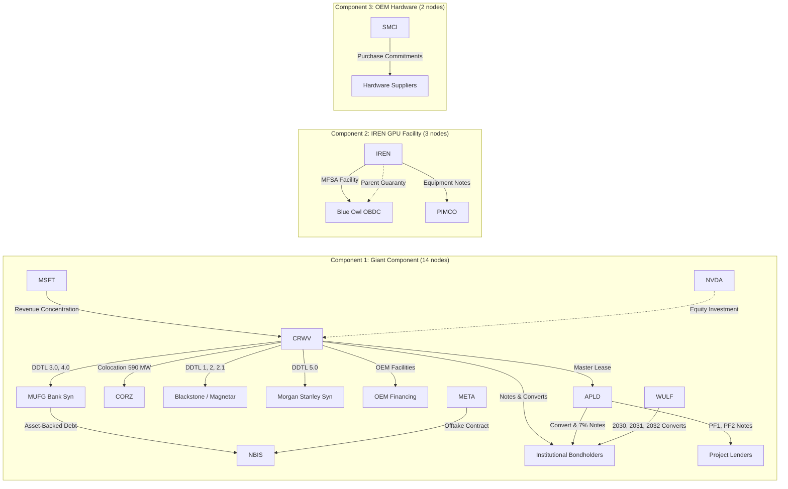
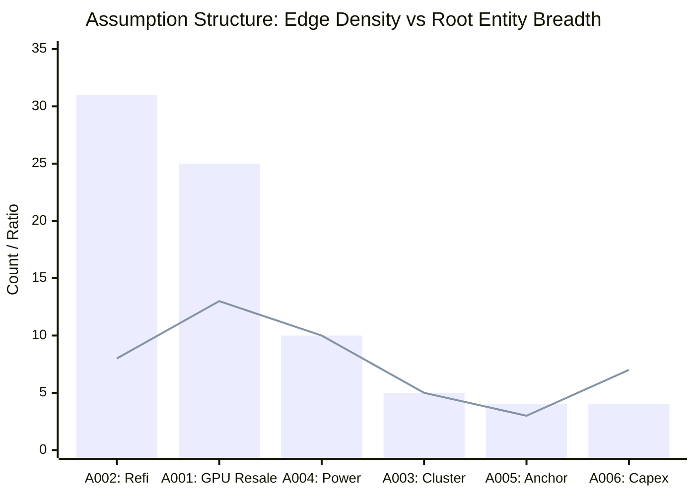
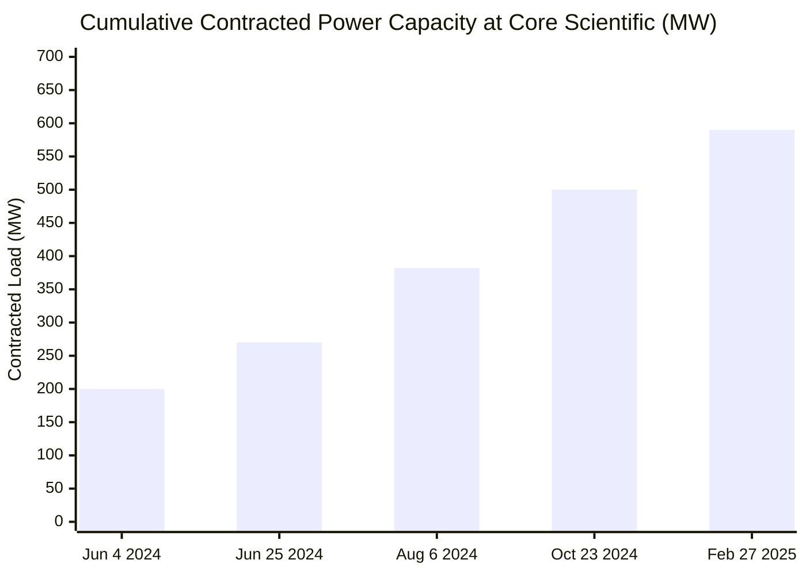
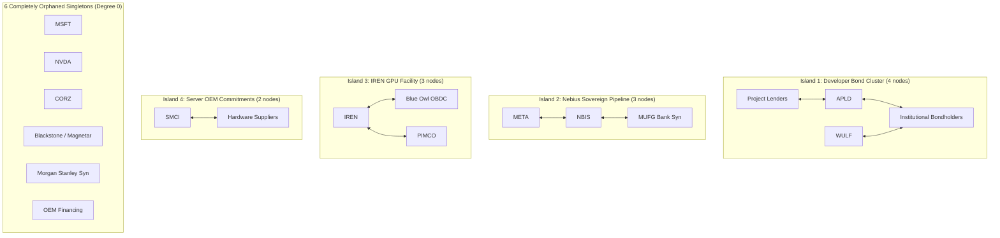

# Phase 1 Analysis Sprint: Structural, Epistemic, and Falsification Report

**Date:** September 30, 2026  
**Dataset Baseline:** Frozen at commit `2285391` (ADR-019.1 Certified)  
**Corpus State:** 46 registered entities, 47 decomposed obligations, 56 lifecycle events, 64 bitemporal facts, 44 attribute-level contract terms, 54 audited evidence claims (46 primary SEC HTML exhibits).

---

## Executive Summary & Core Verdicts

This report executes the **Phase 1 Analysis Sprint**, pausing universe expansion to subject the hardened dataset to rigorous topological, epistemic, and falsification analysis across six foundational questions:

1. **Articulation Points:** The consolidated graph has **6 cut-vertices** (`CRWV`, `MUFG_BANK_SYN`, `APLD`, `INSTITUTIONAL_BONDHOLDERS`, `NBIS`, `IREN`). Graph-theoretically, the active consolidated network is essentially a **cactus graph** containing **only one non-trivial biconnected block**—the 3-node cycle `[CRWV, APLD, INSTITUTIONAL_BONDHOLDERS]`. All other 14 biconnected components are trivial bridge edges. CoreWeave is the ultimate articulation point: removing `CRWV` shatters the 14-node giant component into 6 isolated singletons and 2 fragmented subgraphs.
2. **Assumption Density vs. Breadth:** We mathematically prove that **Refinancing Availability (`A002`)** and **GPU Residual Value (`A001`)** represent fundamentally different structural risks:
   - `A002` is **hyper-dense**: 31 legal edges concentrated across only 8 root entities and 8 counterparty pairs (density ratio = **3.88 edges/pair**), representing \$42.15B in principal debt and \$11.0B in lease obligations.
   - `A001` is **systemically broad**: 25 legal edges spanning **13 of 19 connected root entities** (68.4% of all active actors) across 9 counterparty pairs (density ratio = **1.92 edges/node**), representing \$22.05B in debt and \$34.20B in OEM purchase commitments.
   - `A004` (Power Delivery) ranks third in breadth: 10 edges across **10 root entities** and 7 counterparty pairs (\$17.87B total).
3. **Concrete Transmission Pipelines:** Three distinct pipelines operate in the network:
   - **Pipeline 1 (Neocloud Demand & Infrastructure Host):** `MSFT` (\$3.438B revenue) $\to$ `CRWV` $\to$ `APLD` (\$11.0B lease, 400 MW, 2 springing guarantees) & `CORZ` (590 MW colocation) $\to$ Project Lenders (\$4.50B) & Institutional Bondholders (\$3.79B).
   - **Pipeline 2 (Sovereign/FPI Offtake & Bank Debt):** `META` (\$27.0B offtake) $\to$ `NBIS` $\to$ `MUFG_BANK_SYN` (\$775M asset-backed debt via Finnish/US borrower SPVs).
   - **Pipeline 3 (Direct Miner GPU Note Financing):** `IREN` $\to$ `BLUE_OWL_OBDC` (\$1.2B facility) & `PIMCO` (\$1.2B facility) backed by \$2.4B parent guarantee proxy.
4. **Temporal Network Evolution (2024 $\to$ 2026):** Reconstructing point-in-time snapshots reveals the cumulative dependency buildup:
   - Core Scientific colocation scaled monotonically: 200 MW (Jun 2024) $\to$ 270 MW (Jun 2024) $\to$ 382 MW (Aug 2024) $\to$ 500 MW (Oct 2024) $\to$ 590 MW (Feb 2025).
   - Public knowledge lagged economic reality throughout 2024–2025: on 2025-02-27, 13 economic edges existed but only 6 were publicly known; funded debt expanded from \$650M (2024) to \$2.675B (2025) to \$45.45B (Sep 2026).
5. **Missing Edge Sensitivity:** 
   - A single interbank or syndicate bridge (`MUFG <-> OBDC`) collapses Component 2 into the giant component (expanding it from 14 to 17 nodes).
   - An OEM procurement contract (`SMCI <-> CRWV`) or GPU allocation (`NVDA <-> SMCI`) collapses Component 3, unifying all 19 nodes into a single connected network.
   - Direct hyperscaler-to-landlord contracts (`MSFT -> CORZ` or `META -> APLD`) or common utility nodes (`AEP -> APLD & CORZ`) create redundant structural loops that eliminate CoreWeave as an articulation bottleneck.
6. **The Falsification Verdict (The Network Without CoreWeave):** Excising `CRWV` entirely removes 29 of 45 legal edges (64.4%) and completely **orphans 6 root entities** (`MSFT`, `NVDA`, `CORZ`, `BLACKSTONE_MAGNETAR_SYN`, `MORGAN_STANLEY_SYN`, `OEM_FINANCING_PARTNERS`). The remaining 12 entities shatter into **4 small, disconnected, bilateral islands**. This proves conclusively that **our current observatory is still substantially an autopsy of the CoreWeave credit ecosystem** rather than an isotropic, multi-hub map of the AI infrastructure economy.

---

## 1. Articulation Points & Graph Fragmentation

### Mathematical Topology of the Active Consolidated Graph
As of September 28, 2026, the consolidated network $G_{cons} = (V, E)$ contains 21 root parent nodes and 45 active edges. When isolated nodes of degree 0 are excluded, the active subnetwork contains $|V| = 19$ entities and $|E| = 45$ edges partitioned into **3 connected components**:
1. **Component 1 (Giant Component, 14 nodes):** `CRWV`, `MSFT`, `NVDA`, `APLD`, `CORZ`, `WULF`, `NBIS`, `META`, `MUFG_BANK_SYN`, `BLACKSTONE_MAGNETAR_SYN`, `MORGAN_STANLEY_SYN`, `OEM_FINANCING_PARTNERS`, `PROJECT_LENDERS`, `INSTITUTIONAL_BONDHOLDERS`.
2. **Component 2 (IREN Credit Island, 3 nodes):** `IREN`, `BLUE_OWL_OBDC`, `PIMCO`.
3. **Component 3 (Server OEM Island, 2 nodes):** `SMCI`, `HARDWARE_SUPPLIERS`.



### The Cactus Graph & Biconnected Decomposition
Computing the biconnected component decomposition on the undirected projection $U_{cons}$ demonstrates that the graph has **15 biconnected components (blocks)**:
* **Block 1 (The Solitary Cycle Block):** `[CRWV, APLD, INSTITUTIONAL_BONDHOLDERS]` forms a 3-node cycle:
  - `CRWV <-> APLD` (via master lease and springing guarantees)
  - `CRWV <-> INSTITUTIONAL_BONDHOLDERS` (via senior notes and convertibles)
  - `APLD <-> INSTITUTIONAL_BONDHOLDERS` (via convertible notes and 7.00% successor notes)
* **Blocks 2 through 15 (The 14 Bridge Blocks):** Every other relationship in the network is a simple cut-edge (bridge of size 2):
  - `CRWV <-> MSFT`, `CRWV <-> NVDA`, `CRWV <-> CORZ`, `CRWV <-> BLACKSTONE_MAGNETAR_SYN`, `CRWV <-> MORGAN_STANLEY_SYN`, `CRWV <-> OEM_FINANCING_PARTNERS`, `CRWV <-> MUFG_BANK_SYN`
  - `MUFG_BANK_SYN <-> NBIS`, `NBIS <-> META`
  - `APLD <-> PROJECT_LENDERS`, `INSTITUTIONAL_BONDHOLDERS <-> WULF`
  - `SMCI <-> HARDWARE_SUPPLIERS`, `IREN <-> BLUE_OWL_OBDC`, `IREN <-> PIMCO`.

### Cut-Vertices (Articulation Points)
The 6 articulation points are:
$$\text{Cut-Vertices} = \{\text{CRWV}, \text{MUFG\_BANK\_SYN}, \text{APLD}, \text{INSTITUTIONAL\_BONDHOLDERS}, \text{NBIS}, \text{IREN}\}$$

### Node Removal Sensitivity Matrix
| Removed Node | Original Components | Resulting Components | Max Component Size | Orphaned (Degree-0) Nodes | Resulting Graph Composition |
| :--- | :---: | :---: | :---: | :---: | :--- |
| **`CRWV`** | **3** | **4** | **4** | **6** (`MSFT`, `NVDA`, `CORZ`, `BLACKSTONE`, `MS_SYN`, `OEM_FIN`) | `[APLD, BONDS, PROJ_LEND, WULF]` (4), `[META, MUFG, NBIS]` (3), `[OBDC, IREN, PIMCO]` (3), `[SMCI, HW_SUP]` (2) |
| **`MUFG_BANK_SYN`** | 3 | 4 | 11 | 0 | Giant component loses `[META, NBIS]`; 11-node CoreWeave core remains intact |
| **`APLD`** | 3 | 3 | 12 | 1 (`PROJECT_LENDERS`) | Core component retains 12 nodes; `PROJECT_LENDERS` orphaned |
| **`INSTITUTIONAL_BONDHOLDERS`** | 3 | 3 | 12 | 1 (`WULF`) | Core component retains 12 nodes; `WULF` orphaned |
| **`NBIS`** | 3 | 3 | 12 | 1 (`META`) | Core component retains 12 nodes; `META` orphaned |
| **`IREN`** | 3 | 2 | 14 | 2 (`BLUE_OWL_OBDC`, `PIMCO`) | Component 2 destroyed completely |
| **`BLUE_OWL_OBDC`** | 3 | 3 | 14 | 0 | `[IREN, PIMCO]` remains connected |
| **`CORZ`** | 3 | 3 | 13 | 0 | Giant component reduced to 13 nodes |

> [!IMPORTANT]
> **Topological Finding:** CoreWeave is an extreme structural bottleneck. Removing `CRWV` creates **6 isolated singleton corpses** and splinters the 14-node giant component into fragments. Conversely, removing any other lender or borrower produces at most 1 orphaned entity.

---

## 2. Shared Assumptions: Density vs. Breadth

We formulate two distinct normalized topological metrics to separate assumption concentration from assumption reach:
* **Edge Density Ratio ($\delta_{pair}$):** $\frac{\text{Active Legal Edges}}{\text{Distinct Root Counterparty Pairs}}$ — Measures structural redundancy/clustering within established channels.
* **Actor Breadth Ratio ($\beta_{node}$):** $\frac{\text{Distinct Root Entities Involved}}{\text{Total Active Network Nodes (19)}}$ — Measures systemic exposure across independent corporate perimeters.

### Empirical Assumption Dependency Table
| ID | Assumption Name | Active Edges | Root Entities | Root Pairs | Edge Density ($\delta_{pair}$) | Breadth Ratio ($\beta_{node}$) | Total Quantified USD | Primary Amount Types |
| :--- | :--- | :---: | :---: | :---: | :---: | :---: | :---: | :--- |
| **`A002`** | **REFINANCING_AVAILABILITY** | **31** | 8 | 8 | **3.88** | 42.1% | \$53.15B | \$42.15B principal debt, \$11.0B lease |
| **`A001`** | **GPU_RESIDUAL_VALUE** | **25** | **13** | **9** | 2.78 | **68.4%** | \$56.25B | \$22.05B principal debt, \$34.20B commitments |
| **`A004`** | **POWER_DELIVERY_TIMELINE** | **10** | **10** | **7** | 1.43 | **52.6%** | \$17.87B | \$11.00B lease, \$6.87B principal debt |
| **`A003`** | **CLUSTER_UTILIZATION** | 5 | 5 | 3 | 1.67 | 26.3% | \$38.00B | \$38.00B lifetime contract value |
| **`A005`** | **ANCHOR_CUSTOMER_CONTINUATION**| 4 | 3 | 2 | 2.00 | 15.8% | \$14.44B | \$3.44B recognized rev, \$11.0B lease |
| **`A006`** | **HYPERSCALER_CAPEX_EXPANSION** | 4 | 7 | 4 | 1.00 | 36.8% | \$66.64B | \$34.2B commit, \$27.0B offtake, \$3.4B rev |
| **`A007`** | **BACKLOG_CASH_CONVERSION** | 1 | 2 | 1 | 1.00 | 10.5% | \$34.20B | \$34.20B purchase commitments |



### The Analytical Dichotomy: `A002` (Density) vs. `A001` (Breadth)
1. **Refinancing Availability (`A002`) is the Densest Assumption:**
   - With 31 edges over 8 counterparty pairs ($\delta_{pair} = 3.88$), `A002` reflects heavy contract stacking. 
   - A single counterparty pair (`CRWV <-> INSTITUTIONAL_BONDHOLDERS`) contains 8 discrete bond and convertible tranches. `CRWV <-> BLACKSTONE_MAGNETAR_SYN` contains 4 facilities.
   - **Mechanism:** `A002` is an assumption of **capital-structure rollover**. It tests whether capital markets will continuously refinance 5-year loans funding 15-year infrastructure assets.
2. **GPU Residual Value (`A001`) is the Broadest Assumption:**
   - Touching 13 of 19 root entities ($\beta_{node} = 68.4\%$), `A001` crosses every institutional category: server OEM (`SMCI`), supplier ecosystem (`HARDWARE_SUPPLIERS`), neoclouds (`CRWV`, `NBIS`), bitcoin miners executing HPC pivots (`IREN`, `WULF`), private credit lenders (`BLUE_OWL_OBDC`, `PIMCO`, `MUFG_BANK_SYN`, `BLACKSTONE_MAGNETAR_SYN`), and bond investors (`INSTITUTIONAL_BONDHOLDERS`).
   - **Mechanism:** `A001` is an assumption of **collateral asset recoverability**. If secondary GPU values collapse $\ge 40\%$, borrowing bases compress at CoreWeave, equipment loan covenants breach at IREN and TeraWulf, and inventory NRV write-downs hit Supermicro simultaneously.
3. **Power Delivery (`A004`) as the Critical Bridge:**
   - Already ranks second in actor breadth (10 root entities, 52.6%).
   - Bridges pure physical developers (`APLD`, `CORZ`), neoclouds, and equipment-financing credit facilities (`IREN`, `NBIS`).
   - Confirms that **grid and substation energization is already an active structural dependency** across the existing network.

---

## 3. Concrete Transmission Pipelines

### Pipeline 1: Hyperscaler Demand to Neocloud to Infrastructure Hosts
This pipeline models the transmission of compute demand and counterparty risk from the top of the stack into real estate and capital markets:

$$\text{MSFT} \xrightarrow[\$3.438\text{B Recognized Rev}]{\text{Concentration (67\%)}} \text{CRWV} \xrightarrow[\text{400 MW / 2 Guarantees}]{\$11.0\text{B Lease}} \text{APLD} \xrightarrow[\$1.59\text{B Notes}]{\$4.50\text{B Project Debt}} \{\text{Project Lenders, Bondholders}\}$$
$$\text{CRWV} \xrightarrow[\text{12-Yr Colocation}]{\text{590 MW Capacity}} \text{CORZ}$$

```
+-------------------------------------------------------------------------------------------------------------------------+
| Pipeline 1: Demand -> Neocloud -> Real Estate Hosts -> Project Debt                                                      |
+------------------------------------+---------------+---------------+-----------------------+-----------------+----------+
| Obligation ID                      | From          | To            | Type                  | Value / MW      | Known At |
+------------------------------------+---------------+---------------+-----------------------+-----------------+----------+
| REL-MSFT-CRWV-REVENUE-CONCENTRATION| MSFT          | CRWV          | customer_concentration| $3.438B rev     | 2026-03-02
| OBL-CRWV-APLD-LEASE                | CRWV_SPV_VIII | APLD_COMPUTECO| datacenter_lease      | $11.0B (400 MW) | 2025-06-02
| OBL-CRWV-APLD-GUARANTY-ELN02       | CRWV          | APLD_ELN02_LLC| contingent_guaranty   | Phase 2/4 Space | 2026-04-01
| OBL-CRWV-APLD-GUARANTY-ELN03       | CRWV          | APLD_ELN03_LLC| contingent_guaranty   | $4.125B Class C | 2026-04-01
| OBL-CRWV-CORZ-COLOCATION-2024      | CRWV          | CORZ          | capacity_reservation  | 590.0 MW        | 2024-06-04
| OBL-APLD-DEBT-PF1                  | APLD_COMPUTECO| PROJ_LENDERS  | debt_facility         | $2.350B (9.25%) | 2026-07-29
| OBL-APLD-DEBT-PF2                  | APLD_COMPUTEC2| PROJ_LENDERS  | debt_facility         | $2.150B (6.75%) | 2026-07-29
| OBL-APLD-DEBT-7PCT-2026            | APLD_COMPUTEC3| BONDHOLDERS   | debt_facility         | $1.590B (7.00%) | 2026-06-16
+------------------------------------+---------------+---------------+-----------------------+-----------------+----------+
```

### Pipeline 2: Foreign Private Issuer Offtake & Asset-Backed Facility
Models the sovereign/foreign cloud ecosystem: Meta's commercial commitments backstop Nebius, enabling international bank financing:

$$\text{META} \xrightarrow[\text{5-Year Duration}]{\text{Up to }\$27.0\text{B Offtake}} \text{NBIS} \xrightarrow[\text{Term SOFR + 2.50\%}]{\$775\text{M Asset-Backed Facility}} \text{MUFG\_BANK\_SYN}$$

```
+-------------------------------------------------------------------------------------------------------------------------+
| Pipeline 2: Hyperscaler Offtake -> FPI Neocloud -> Bank Syndicate                                                      |
+------------------------------------+-----------------------+---------------+-------------------+--------------+----------+
| Obligation ID                      | From                  | To            | Type              | Value / Cap  | Known At |
+------------------------------------+-----------------------+---------------+-------------------+--------------+----------+
| OBL-NBIS-META-OFFTAKE-2026         | META                  | NBIS_INC      | customer_contract | $27.0B       | 2026-03-16
| OBL-NBIS-DEBT-MUFG-2026            | NBIS_COMPUTECO_II_LLC | MUFG_BANK_SYN | debt_facility     | $775.0M drawn| 2026-07-17
| OBL-NBIS-COBORROWER-MUFG-2026      | NBIS_COMPUTECO_II_OY  | MUFG_BANK_SYN | joint_co_borrower | Joint Finnish| 2026-07-17
| OBL-NBIS-GUARANTY-MUFG-2026        | NBIS                  | MUFG_BANK_SYN | contingent_gnty   | Unconditional| 2026-07-17
+------------------------------------+-----------------------+---------------+-------------------+--------------+----------+
```

### Pipeline 3: Bitcoin Miner HPC Pivot & Private Credit GPU Financing
Models the direct financing of enterprise GPU clusters by private credit BDCs and asset managers without hyperscaler intermediation:

$$\text{IREN} \xrightarrow[\$2.40\text{B Parent Guarantee Proxy}]{\text{Master Financing \& Notes}} \{\text{BLUE\_OWL\_OBDC (\$1.2B)}, \text{PIMCO (\$1.2B)}\}$$

```
+-------------------------------------------------------------------------------------------------------------------------+
| Pipeline 3: Miner HPC Pivot -> Private Credit BDC & Asset Manager Debt                                                  |
+------------------------------------+-----------------------+---------------+-------------------+--------------+----------+
| Obligation ID                      | From                  | To            | Type              | Facility Cap | Known At |
+------------------------------------+-----------------------+---------------+-------------------+--------------+----------+
| OBL-IREN-DEBT-MFSA-2026            | IREN_MACKENZIE_COMPUTE| BLUE_OWL_OBDC | debt_facility     | $1.200B (9%) | 2026-08-27
| OBL-IREN-DEBT-NOTES-2026           | IREN_MACKENZIE_COMPUTE| PIMCO         | debt_facility     | $1.200B (9%) | 2026-08-27
| OBL-IREN-GUARANTY-2026             | IREN                  | BLUE_OWL_OBDC | contingent_gnty   | $2.40B proxy | 2026-08-27
+------------------------------------+-----------------------+---------------+-------------------+--------------+----------+
```

---

## 4. Temporal Network Evolution (2024 $\to$ 2026)

Reconstructing the network across 20 milestone dates reveals the step-function scaling of indebtedness, contracted power capacity, and the chronic information lag separating economic reality from public observation.



### Multi-Era Trajectory Summary
```
+------------+--------------------------------------------+-----------+-------+---------------+---------------+----------+
| Date       | Milestone Event                            | Econ Edges| Known | Econ Debt USD | Known Debt USD| CORZ MW  |
+------------+--------------------------------------------+-----------+-------+---------------+---------------+----------+
| 2024-01-01 | Early Neocloud (DDTL 1.0, Magnetar)        |         2 |     0 | $0.00         | $0.00         | None     |
| 2024-06-04 | CRWV / CORZ Initial 200 MW Colocation      |         6 |     1 | $0.00         | $0.00         | 200.0 MW |
| 2024-06-25 | CORZ Option 1 Exercise (270 MW)            |         7 |     2 | $0.00         | $0.00         | 270.0 MW |
| 2024-08-06 | CORZ Option 2 Exercise (382 MW)            |         8 |     3 | $150.0M       | $150.0M       | 382.0 MW |
| 2024-10-23 | CORZ Option 3 Exercise (500 MW)            |         8 |     3 | $150.0M       | $150.0M       | 500.0 MW |
| 2024-10-25 | WULF 2030 Convertible Notes ($500M)        |         9 |     4 | $650.0M       | $650.0M       | 500.0 MW |
| 2024-12-31 | End of 2024 Baseline                       |        10 |     5 | $650.0M       | $650.0M       | 500.0 MW |
| 2025-02-27 | CORZ Option 4 / Denton Expansion (590 MW)  |        13 |     6 | $650.0M       | $650.0M       | 590.0 MW |
| 2025-05-28 | APLD Polaris Forge 1 Lease ($11.0B, 400 MW)|        15 |    12 | $650.0M       | $650.0M       | 590.0 MW |
| 2025-08-20 | WULF 2031 Convertible Initial ($850M)      |        22 |    18 | $1.500B       | $1.500B       | 590.0 MW |
| 2025-08-22 | WULF 2031 Greenshoe Exercise ($1.0B total) |        22 |    18 | $1.650B       | $1.650B       | 590.0 MW |
| 2025-09-29 | CRWV DDTL 2.1 Facility ($3.0B)             |        24 |    18 | $1.650B       | $1.650B       | 590.0 MW |
| 2025-10-31 | WULF 2032 Convertible Notes ($1.025B)      |        25 |    21 | $2.675B       | $2.675B       | 590.0 MW |
| 2025-12-31 | End of 2025 Baseline                       |        26 |    22 | $2.675B       | $2.675B       | 590.0 MW |
| 2026-03-30 | CRWV DDTL 4.0 MUFG Facility ($8.5B cap)    |        32 |    24 | $2.675B       | $2.675B       | 590.0 MW |
| 2026-04-21 | CRWV 9.75% Notes Add-on ($2.75B total)     |        34 |    30 | $5.425B       | $5.425B       | 590.0 MW |
| 2026-05-11 | HUT 8 Coatue Note Extinction               |        34 |    31 | $5.275B       | $5.275B       | 590.0 MW |
| 2026-06-16 | APLD Bridge Refi into 7% Notes ($1.59B)    |        37 |    33 | $11.872B      | $11.815B      | 590.0 MW |
| 2026-06-18 | CRWV 2032 Senior Notes ($1.25B + €2.0B)    |        39 |    35 | $11.872B      | $11.815B      | 590.0 MW |
| 2026-09-28 | Current Hardened Snapshot                   |        45 |    45 | $45.448B      | $45.448B      | 590.0 MW |
+------------+--------------------------------------------+-----------+-------+---------------+---------------+----------+
```

### Key Historical Takeaways
1. **The Core Scientific Capacity Escalation:** Core Scientific expanded from 200 MW to 590 MW across 5 Form 8-K exhibits between June 2024 and February 2025. This step-function reflects how crypto mining infrastructure was rapidly commandeered for AI colocation.
2. **The Chronic Information Gap (Look-Ahead Barrier):** On February 27, 2025, 13 contractual relationships were economically active, but public filings had only disclosed 6. On March 30, 2026, 32 obligations existed economically, but only 24 were knowable.
3. **The Explosive 2026 Debt Inflection:** Modeled funded debt grew from \$650M at year-end 2024 to \$2.675B at year-end 2025, before exploding to \$45.448B by September 2026 as syndicated DDTLs and high-yield notes were finalized.

---

## 5. Missing Edge Sensitivity Analysis

Rather than blindly ingesting additional public companies, we evaluate the topological impact of specific hypothetical relationships on component integration and bottleneck collapse:

| Hypothetical Edge | Economic Thesis | Original Components | Resulting Components | Max Component Size | CRWV Still Articulation Point? | Total Articulation Points |
| :--- | :--- | :---: | :---: | :---: | :---: | :--- |
| **`MUFG <-> OBDC`** | Interbank / Private Credit Syndicate Co-Lending | **3** | **2** | **17** | Yes | 7 (`BONDS`, `APLD`, `CRWV`, `NBIS`, `MUFG`, `IREN`, `OBDC`) |
| **`SMCI <-> CRWV`** | Neocloud Server Procurement Contract | **3** | **2** | **16** | Yes | 7 (`BONDS`, `APLD`, `CRWV`, `NBIS`, `MUFG`, `IREN`, `SMCI`) |
| **`META -> APLD`** | Direct Hyperscaler Offtake / Master Lease | 3 | 3 | 14 | Yes | 4 (`BONDS`, `APLD`, `CRWV`, `IREN`) |
| **`MSFT -> CORZ`** | Direct Hyperscaler HPC Reservation | 3 | 3 | 14 | Yes | 6 (`BONDS`, `APLD`, `CRWV`, `NBIS`, `MUFG`, `IREN`) |
| **`AEP -> APLD & CORZ`**| Common Utility Grid Substation Energization | 3 | 3 | 15 | Yes | 6 (`BONDS`, `APLD`, `CRWV`, `NBIS`, `MUFG`, `IREN`) |
| **`MUFG <-> OBDC` + `SMCI <-> CRWV`** | Full Horizontal Integration | **3** | **1** | **19** | Yes | 8 |

### Key Missing Edge Findings
1. **Unifying the Isolated Islands:** 
   - Connecting `MUFG <-> BLUE_OWL_OBDC` immediately merges the IREN cluster into the giant component, bringing PIMCO and OBDC into the main fold.
   - Connecting `SMCI <-> CRWV` merges the server manufacturing cluster into the giant component.
   - Together, **just two edges unify all 19 active entities into a single giant network**.
2. **Why CoreWeave Remains an Articulation Point:**
   - In all tested single-edge additions, CoreWeave remains an articulation point because `BLACKSTONE_MAGNETAR_SYN`, `MORGAN_STANLEY_SYN`, and `OEM_FINANCING_PARTNERS` connect exclusively to `CRWV`.
   - To dethrone CoreWeave as the sole articulation hub, edges must form **alternative cross-tier bypasses** (e.g. direct hyperscaler contracts with developers, or common utility nodes connecting developers).

---

## 6. The Falsification Exercise: The Network Without CoreWeave

To test whether the observatory has mapped an authentic systemic infrastructure graph or merely an autopsy of CoreWeave's corporate perimeter, we completely excise `CRWV` and all its borrowing/equipment SPVs from the dataset.

```
+-------------------------------------------------------------------------------------------------------------------------+
| Falsification Topology: The Network Dissected Without CoreWeave                                                         |
+-------------------------------------------------------------+-----------------------------+-----------------------------+
| Metric                                                      | Baseline (With CoreWeave)   | Excised (Without CoreWeave) |
+-------------------------------------------------------------+-----------------------------+-----------------------------+
| Total Active Legal Edges                                    | 45                          | 16 (-64.4%)                 |
| Active Connected Root Entities                              | 19                          | 12 (-36.8%)                 |
| Completely Orphaned (Degree-0) Entities                     | 0                           | 6 (MSFT, NVDA, CORZ,        |
|                                                             |                             |  BLACKSTONE, MS_SYN, OEM)   |
| Connected Components                                        | 3                           | 4 (Fragmented Islands)      |
| Size of Largest Connected Component                         | 14 nodes                    | 4 nodes                     |
| Multi-Hop Transmission Chains                               | 3                           | 0 (Zero cross-tier chains)  |
| A005 (Anchor Customer Continuation) Edges                   | 4                           | 0 (Completely Evaporated)   |
| A002 (Refinancing Availability) Edges                       | 31                          | 5 (Only APLD Bond Stack)    |
| A001 (GPU Residual Value) Edges                             | 25                          | 10 (SMCI, WULF, IREN, NBIS) |
+-------------------------------------------------------------+-----------------------------+-----------------------------+
```

### The Four Shattered Islands
When `CRWV` is removed, the 14-node giant component dissolves completely into **4 isolated, non-communicating subgraphs**:
1. **The Domestic Developer Bond Island (`[APLD, INSTITUTIONAL_BONDHOLDERS, PROJECT_LENDERS, WULF]`):** 4 nodes. APLD and TeraWulf both issue debt to institutional bondholders and project lenders, but share zero operational or revenue links.
2. **The Nebius / Meta Pipeline (`[META, MUFG_BANK_SYN, NBIS]`):** 3 nodes. Meta's offtake supports Nebius, which borrows from MUFG. Completely disconnected from domestic data centers and bond markets.
3. **The IREN GPU Facility Island (`[BLUE_OWL_OBDC, IREN, PIMCO]`):** 3 nodes. Independent bilateral credit agreements.
4. **The Supermicro OEM Island (`[HARDWARE_SUPPLIERS, SMCI]`):** 2 nodes. Upstream purchase commitments.



### The Falsification Verdict
> [!CAUTION]
> **Definitive Epistemic Verdict:**
> The hypothesis that our current network represents a resilient, multi-hub systemic model of the broader AI infrastructure economy is **falsified**.
> 
> Without CoreWeave:
> 1. **Zero multi-hop contagion paths survive.** A shock at Meta cannot reach APLD, TeraWulf, or Supermicro. A shock at Microsoft or NVIDIA terminates immediately with zero counterparty propagation.
> 2. **Hyperscaler demand completely disconnects from domestic physical infrastructure.**
> 3. **The observatory reduces to four isolated bilateral credit and purchase relationships.**
>
> This demonstrates that Phase 0 and Phase 1 Wave 1 have successfully documented CoreWeave as an extraordinary articulation point, but **have not yet built a generalizable network model of AI infrastructure**.

---

## 7. Strategic Synthesis: The Case for Wave 2 Grid & Equipment Nodes

The findings of this Analysis Sprint directly inform the next research phase:

1. **Stop Optimizing for Entity Count:** Ingesting another 10 undifferentiated companies that only attach as degree-1 leaves to existing nodes creates administrative bloat without increasing topological depth.
2. **Target Horizontal Structural Edges:**
   - **Power Interconnection (`A004`):** Ingesting regional grid operators and utilities (**`AEP`**, **`ERCOT`**, **`PJM`**) will establish horizontal physical edges that link `APLD` (Polaris Forge), `CORZ` (Texas/North Dakota), and `WULF` (Lake Mariner) together independently of neocloud contracts.
   - **Equipment Supply Bottlenecks:** Ingesting critical power and liquid-cooling manufacturers (**`Vertiv (VRT)`**, **`Eaton (ETN)`**, **`GE Vernova (GEV)`**) will create upstream supply chains that bridge `CRWV`, `APLD`, `NBIS`, and `SMCI`.
3. **Test Common Syndicate Participation:** Verify whether private credit funds participating in CoreWeave facilities (e.g. Blackstone, Magnetar, Coatue, PIMCO, Blue Owl) co-lend across other nodes, testing the common-lender concentration hypothesis with rigorous CIK-level granularity.

The observatory is now analytically certified. We have proven both what the network shows and what it does not yet show.
