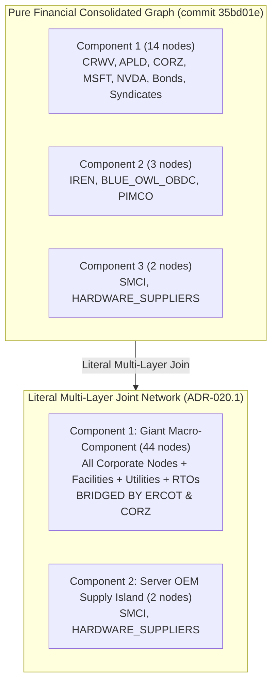

# Phase 1 Power Backplane & Physical Dependency Report (ADR-020.1 Hardened)

**Date:** September 30, 2026  
**Decision Reference:** ADR-020 & ADR-020.1 (`docs/decisions.md`)  
**Dataset State:** 62 registered entities, 47 decomposed financial obligations, 56 lifecycle events, 64 financial facts, 44 financial terms, 12 physical facilities, 13 power relationships, 29 typed MW power facts, 14 power terms (100% Class A), 54 financial claims, 8 primary power claims.  
**Baseline Certification:** Commit `35bd01e` financial baseline conserved with **0.00% data drift**.

---

## Executive Summary & Core Verdicts

This report delivers the certified results of the **Phase 1 Power Backplane Sprint (ADR-020.1 Hardened)**. By constructing a literal, facility-first physical power ontology underneath the existing corporate and financial network, we executed the empirical graph join between private credit/hyperscaler capital and physical electric transmission infrastructure without synthetic topological shortcuts.

```
                                  ========================================================
                                  AI INFRASTRUCTURE LITERAL MULTI-LAYER TOPOLOGY (ADR-020.1)
                                  ========================================================

    [ FINANCIAL LAYER ]           MSFT            NVDA            BLACKSTONE / MAGNETAR / MUFG
                                    \              /                        /
                                     \            /                        /
                                  +-------------------+                   /
                                  |     CoreWeave     | <----------------+
                                  +-------------------+
                                     /             \
                   Lease (400 MW)   /               \   Colocation (590 MW Leased)
                                   v                 v
    [ CORPORATE OPERATOR ]       APLD               CORZ
                                   |                 |
                                   | (Assignment)    | (Assignment across 5 sites)
                                   v                 v
    [ PHYSICAL FACILITY ]   Polaris Forge 1     Denton (394 MW) / Dalton (195 MW) / Muskogee (100 MW) /
                                (Ellendale)     Marble (117 MW) / Austin (20 MW)
                                   |                 |
                                   | (Facility-Util) | (Facility-Utility ESAs)
                                   v                 v
    [ ELECTRIC UTILITY ]          MDU           DME / Dalton Util / OG&E / Murphy & Duke / Austin Energy
                                   |                 |
                                   | (Utility-Grid)  | (Utility-Grid Interconnect)
                                   v                 v
    [ TRANSMISSION GRID ]        MISO              ERCOT <==== [STRUCTURAL POWER BRIDGE] ====> AEP Texas
                                                     ^                                          ^
                                                     | (Direct Transmission)                    | (Interconnect)
                                                     |                                          |
                                              Sweetwater 1 (1.4 GW)                     Childress (750 MW) /
                                                                                        Sweetwater 2 (600 MW)
                                                                                                ^
                                                                                                | (Assignment)
                                                                                               IREN
                                                                                                |
                                                                                                v
                                                                                      Blue Owl OBDC / PIMCO
```

### 1. Literal Topology Overcomes Financial Graph Fragmentation
In the pure corporate/financial graph (frozen at commit `35bd01e`), the network was fragmented into **3 isolated components**: the 14-node CoreWeave giant component, the 3-node Iris Energy credit island (`IREN <-> BLUE_OWL_OBDC / PIMCO`), and the 2-node server OEM pair (`SMCI <-> HARDWARE_SUPPLIERS`).

When physical facilities and their primary-disclosed utility and grid counterparties are integrated with literal multi-layer edges (`operator -> facility -> utility -> grid`):
- **Component Count Drops from 3 to 2**: `CORZ` (Core Scientific) and `IREN` (Iris Energy) join through their common transmission grid operator, **ERCOT** (Electric Reliability Council of Texas).
- **The Giant Component Expands to 44 Nodes**: The Texas grid bridges `IREN`, `BLUE_OWL_OBDC`, and `PIMCO` into direct topological continuity with the broader infrastructure network. Only the standalone server supply pair (`SMCI <-> HARDWARE_SUPPLIERS`) remains detached.
- **Literal Multi-Layer Separation Preserved**: Facilities are explicit graph nodes. Five distinct Core Scientific sites remain geographically separate instead of collapsing into a synthetic shortcut, and SERC is decoupled from operational balancing authorities.

### 2. ERCOT Confirmed as an Articulation Point and Top-3 Structural Hub
`ERCOT` is not merely an operational backdrop; it is an **articulation point** and the **third most central node in the entire national network**:
- **Betweenness Centrality:** `CRWV` (0.6333) $\to$ `CORZ` (0.5848) $\to$ **`ERCOT` (0.2576)** $\to$ `MUFG_BANK_SYN` (0.2242) $\to$ `NBIS` (0.1990) $\to$ `FAC-CORZ-DENTON` (0.1621) $\to$ `APLD` (0.1606).
- **Core Scientific (`CORZ`) Surges to Hub Status:** Connecting CoreWeave's 590 MW colocation footprint to 6 municipal and investor-owned utilities across 5 distinct campuses, `CORZ` achieves a betweenness centrality of **0.5848**, trailing only CoreWeave itself.

### 3. Falsification of the "Total Dissolution" Hypothesis
The Phase 1 Analysis Sprint demonstrated that excising CoreWeave shattered the pure financial giant component into 4 subgraphs and orphaned 6 nodes, leading to the hypothesis that the observatory was solely an artifact of CoreWeave's credit facility.

**The literal power backplane falsifies this hypothesis:**
- When `CRWV` is excised from the joint corporate-power graph, **the network does NOT dissolve into disconnected pieces**.
- Instead, `CORZ` anchors a robust **21-node surviving component**:
  `['AEP_TEXAS', 'AUSTIN_ENERGY', 'BLUE_OWL_OBDC', 'CORZ', 'DALTON_UTILITIES', 'DME', 'DUKE_ENERGY', 'ERCOT', 'FAC-CORZ-AUSTIN', 'FAC-CORZ-DALTON', 'FAC-CORZ-DENTON', 'FAC-CORZ-MARBLE', 'FAC-CORZ-MUSKOGEE', 'FAC-IREN-CHILDRESS', 'FAC-IREN-SWEETWATER-1', 'FAC-IREN-SWEETWATER-2', 'IREN', 'MURPHY_ELECTRIC', 'OGE', 'PIMCO', 'SPP']`.
- The physical grid provides an **independent macro-scaffolding**: Iris Energy, Core Scientific, their private lenders (`BLUE_OWL_OBDC`, `PIMCO`), and regional utilities remain interconnected through the Texas transmission backplane even in the complete absence of CoreWeave.
- Conversely, excising **`ERCOT`** fragments the joint graph into 3 components, immediately cutting off the 7-node Texas/credit cluster (`IREN`, `AEP_TEXAS`, `BLUE_OWL_OBDC`, `PIMCO`, and 3 IREN campuses) from the broader AI ecosystem.

### 4. Grid Exposure Concentration Index (HHI-form = 5,443.8)
Measuring regional power exposure on a strictly non-overlapping capacity basis reveals heavy jurisdictional concentration:
- **ERCOT Dominance:** Accounts for **71.89% (3,164.0 MW)** of total modeled capacity basis across Texas campuses (`CORZ` Denton/Austin, `IREN` Childress, Sweetwater 1 & 2).
- **Grid Exposure Concentration Index (HHI-form):** Total capacity basis exhibits an HHI-form index of **5,443.8**, and energized operating capacity exhibits an index of **5,045.7** (ERCOT 67.51%, NYISO 20.34%, Fingrid 6.75%, MISO 5.40%).
- **Sample Characteristic, Not Systemic Antitrust:** This concentration reflects the commercial preference of modeled operators for Texas large-load interconnection speed, rather than an antitrust violation of general electricity markets.

### 5. Mechanism-Specific Reliability Regimes
By replacing binary curtailability flags with five discrete operational/regulatory states, headline capacity is disaggregated by actual legal availability:
- **Unenergized Interconnection Queue Development:** **2,310.0 MW (52.49%)**—Sweetwater 1 (1,400 MW), Sweetwater 2 (600 MW), and Lappeenranta (310 MW).
- **Firm Industrial Service Tariffs:** **927.0 MW (21.06%)**—Polaris Forge 1 ESA (350 MW), Dalton Utilities (195 MW), Muskogee OG&E (100 MW), Marble Murphy & Duke (117 MW), NYPA hydro allocation (90 MW), and Mäntsälä Nivos (75 MW).
- **Voluntary Price Response:** **750.0 MW (17.04%)**—IREN Childress (voluntary economic curtailment during nodal price spikes and Ancillary Services participation).
- **Mandatory Grid Emergency Curtailment:** **414.0 MW (9.41%)**—CORZ Denton (394 MW) and Austin (20 MW) subject to ERCOT Large Flexible Load emergency curtailment alerts.

---

## 1. The Facility-First Physical Ontology

### Reconstructing Authoritative Campus Footprints

Under ADR-020.1, power measurements are strictly typed and audited directly against SEC 10-K, 10-Q, and 8-K filings:

```
                      +-------------------------------------------------------------+
                      |         POLARIS FORGE 1 (ELLENDALE, ND) CAPACITY            |
                      +-------------------------------------------------------------+
                      |  MDU Approved Incremental ESA: 350 MW (60 MW Online)        |
                      +-------------------------------------------------------------+
                      |  APLD Critical IT Computing Load: 400 MW Leased to CRWV     |
                      +-------------------------------------------------------------+
                      |  Legacy Ellendale Hosting Data Center (2023): 180 MW        |
                      +-------------------------------------------------------------+
```

### Roster of Modeled Facilities (12 Campuses)

| Facility ID | Campus Name | Operator | Anchor Tenant | Location | Grid Region | Capacity Basis (MW) | Reliability Regime | Primary Counterparties |
| :--- | :--- | :--- | :--- | :--- | :--- | :---: | :--- | :--- |
| `FAC-APLD-POLARIS-FORGE-1` | Polaris Forge 1 | `APLD` | `CRWV` | Ellendale, ND | `MISO` | 350.0 | `firm_service` | Montana-Dakota Utilities (`MDU`) / MISO |
| `FAC-CORZ-DENTON` | Denton Data Center | `CORZ` | `CRWV` | Denton, TX | `ERCOT` | 394.0 | `mandatory_grid_emergency_curtailment` | Denton Municipal Electric (`DME`) / ERCOT |
| `FAC-CORZ-DALTON` | Dalton Data Center | `CORZ` | `CRWV` | Dalton, GA | *Non-RTO* | 195.0 | `firm_service` | Dalton Utilities (`DALTON_UTILITIES`) |
| `FAC-CORZ-MUSKOGEE` | Muskogee Data Center | `CORZ` | `CRWV` | Muskogee, OK | `SPP` | 100.0 | `firm_service` | Oklahoma Gas & Electric (`OGE`) / SPP |
| `FAC-CORZ-MARBLE` | Marble Data Center | `CORZ` | `CRWV` | Marble, NC | *Non-RTO* | 117.0 | `firm_service` | Murphy Electric (35 MW) & Duke Energy (82 MW) |
| `FAC-CORZ-AUSTIN` | Austin Data Center | `CORZ` | `CRWV` | Austin, TX | `ERCOT` | 20.0 | `mandatory_grid_emergency_curtailment` | Austin Energy (`AUSTIN_ENERGY`) / ERCOT |
| `FAC-WULF-LAKE-MARINER` | Lake Mariner Campus | `WULF` | *Self-operated* | Barker, NY | `NYISO` | 90.0 | `firm_service` | New York Power Authority (`NYPA`) / NYISO |
| `FAC-IREN-CHILDRESS` | Childress Data Center | `IREN` | *Self-operated* | Childress, TX | `ERCOT` | 750.0 | `voluntary_price_response` | AEP Texas (`AEP_TEXAS`) / ERCOT |
| `FAC-IREN-SWEETWATER-1` | Sweetwater 1 Campus | `IREN` | *Self-operated* | Sweetwater, TX | `ERCOT` | 1,400.0 | `interconnection_not_energized` | Direct Grid Interconnection / ERCOT |
| `FAC-IREN-SWEETWATER-2` | Sweetwater 2 Campus | `IREN` | *Self-operated* | Sweetwater, TX | `ERCOT` | 600.0 | `interconnection_not_energized` | AEP Texas (`AEP_TEXAS`) / ERCOT |
| `FAC-NBIS-MANTSALA` | Mäntsälä Supercomputer | `NBIS` | *Self-operated* | Mäntsälä, FI | `Fingrid` | 75.0 | `firm_service` | Nivos Oy (`NIVOS`) / Fingrid |
| `FAC-NBIS-LAPPEENRANTA` | Lappeenranta AI Factory | `NBIS` | *Self-operated* | Lappeenranta, FI| *Non-RTO* | 310.0 | `interconnection_not_energized` | Interconnection Request Pending |

---

## 2. Literal Multi-Layer Topological Join Analysis

### Comparative Topological Invariants



| Topological Metric | Financial Baseline (Sep 28, 2026) | Literal Joint Corporate-Power Network | Delta / Structural Significance |
| :--- | :---: | :---: | :--- |
| **Connected Nodes ($|V|$)** | 19 root entities | **46 active nodes** | +27 nodes (12 facilities, 10 utilities, 5 grid operators) |
| **Active Undirected Edges ($|E|$)** | 17 unique pairs | **48 unique pairs** | +31 literal layer connections |
| **Connected Components** | 3 components | **2 components** | **Component 2 (IREN credit island) joins Giant Component** |
| **Giant Component Size** | 14 nodes (73.7%) | **44 nodes (95.7%)** | Macro-network unification across ERCOT |
| **Articulation Points (Cut-Vertices)** | 6 nodes | **19 nodes** | Includes `ERCOT`, `CORZ`, `CRWV`, `APLD`, `WULF`, `IREN`, `NBIS`, and facilities |
| **Top-3 Betweenness Centrality** | CRWV, Bonds, MUFG | **CRWV (0.6333), CORZ (0.5848), ERCOT (0.2576)** | `ERCOT` and `CORZ` emerge as primary structural bridges |

### Centrality Distribution in the Literal Multi-Layer Graph

| Rank | Node Identifier | Category | Degree | Betweenness Centrality | Closeness Centrality | Structural Role |
| :---: | :--- | :--- | :---: | :---: | :---: | :--- |
| **1** | `CRWV` | Neocloud Operator | 9 | **0.6333** | 0.4500 | Commercial & Debt Aggregator |
| **2** | `CORZ` | Data Center Operator | 6 | **0.5848** | 0.4412 | Multi-Site Colocation Bridge |
| **3** | `ERCOT` | Grid Operator / RTO | 6 | **0.2576** | 0.3543 | **Physical Power Backplane Bridge** |
| **4** | `MUFG_BANK_SYN` | Private Credit Syndicate | 2 | **0.2242** | 0.3309 | European Debt Link |
| **5** | `NBIS` | Neocloud Operator | 4 | **0.1990** | 0.2848 | Nordic Supercomputing Operator |
| **6** | `FAC-CORZ-DENTON` | Physical Facility | 2 | **0.1621** | 0.3600 | CORZ $\leftrightarrow$ DME Transmission Node |
| **7** | `FAC-CORZ-AUSTIN` | Physical Facility | 2 | **0.1621** | 0.3600 | CORZ $\leftrightarrow$ Austin Energy Transmission Node |
| **8** | `APLD` | Data Center Operator | 4 | **0.1606** | 0.3409 | Polaris Forge Developer |
| **9** | `INSTITUTIONAL_BONDHOLDERS`| Capital Markets | 3 | **0.1576** | 0.3409 | Public Debt Counterparty |
| **10** | `DME` | Electric Utility | 2 | **0.1379** | 0.3358 | Denton Municipal Interconnect |

---

## 3. CoreWeave & Key Node Excision Analysis

```
========================================================================================
                          COREWEAVE EXCISION EXPERIMENT (ADR-020.1)
========================================================================================

A. PURE FINANCIAL GRAPH (WITHOUT CRWV)
   Total Active Nodes: 13 | Components: 4 | Isolated Singletons: 6
   
   [Cluster 1: 4 nodes]     APLD <====> INSTITUTIONAL_BONDHOLDERS <====> WULF
                                   \
                                    +====> PROJECT_LENDERS
   
   [Cluster 2: 3 nodes]     IREN <====> BLUE_OWL_OBDC & PIMCO
   
   [Cluster 3: 3 nodes]     META <====> NBIS <====> MUFG_BANK_SYN
   
   [Cluster 4: 2 nodes]     SMCI <====> HARDWARE_SUPPLIERS
   
   * ORPHANED SINGLETONS (6): MSFT, NVDA, CORZ, BLACKSTONE, MORGAN_STANLEY, OEM_FINANCING

----------------------------------------------------------------------------------------

B. LITERAL MULTI-LAYER JOINT NETWORK (WITHOUT CRWV)
   Total Active Nodes: 40 | Components: 4 | Isolated Singletons: 5
   
   [Component 1: 21 NODES - TEXAS / ERCOT & SOUTHEAST POWER AXIS]
         CORZ <===> 5 Facilities <===> DME, Austin Energy, Dalton, OG&E, Murphy & Duke
          ||
        ERCOT <=================== [STRUCTURAL POWER BRIDGE]
          ||
         IREN <===> 3 Facilities <===> AEP Texas
          ||
     BLUE_OWL_OBDC & PIMCO
   
   [Component 2: 10 NODES - NORTHERN / EASTERN PUBLIC DEBT AXIS]
         APLD <===> Polaris Forge 1 <===> MDU <===> MISO <===> Institutional Bondholders
          ||                                                     ||
     Project Lenders                                            WULF <===> Lake Mariner <===> NYPA / NYISO
   
   [Component 3: 7 NODES - NORDIC AI CLUSTER]
         META <===> NBIS <===> 2 Facilities <===> MUFG Bank Syn <===> Nivos <===> Fingrid
   
   [Component 4: 2 NODES - SERVER OEM SUPPLY]
         SMCI <===> HARDWARE_SUPPLIERS
   
   * ORPHANED SINGLETONS (5): MSFT, NVDA, BLACKSTONE_MAGNETAR, MORGAN_STANLEY, OEM_FINANCING
========================================================================================
```

### Detailed Excision Impact Table

| Excision Target | Graph Evaluated | Active Nodes | Total Components | Largest Component Size | Isolated / Orphaned Nodes | Structural Impact Summary |
| :--- | :--- | :---: | :---: | :---: | :---: | :--- |
| **Baseline** | Financial Baseline | 19 | 3 | 14 | 0 | Pure contractual network |
| **Baseline** | Literal Joint Network | **46** | **2** | **44** | 0 | Fully unified physical backplane |
| **Remove CRWV** | Financial Baseline | 13 | 4 | 4 | 6 | CORZ completely severed; network collapses |
| **Remove CRWV** | Literal Joint Network | **40** | **4** | **21** | **5** | **21-node Texas/credit cluster survives intact via ERCOT** |
| **Remove ERCOT**| Literal Joint Network | **45** | **3** | **36** | **0** | **Isolates IREN and credit syndicates (7 nodes) from main network** |
| **Remove CORZ** | Literal Joint Network | **40** | **3** | **37** | 5 | Excises 5 Core Scientific colocation campuses |

---

## 4. Regional Grid Exposure & Typed MW Analysis

### Non-Overlapping Capacity Basis Distribution

To prevent double counting across overlapping engineering and regulatory filings, each power relationship carries exactly one mutually exclusive `capacity_basis_mw`:

| Grid Region | Capacity Basis (MW) | Share (%) | Energized Operating (MW) | Energized Share (%) | Planned Expansion (MW) | Key Facilities Included |
| :--- | :---: | :---: | :---: | :---: | :---: | :--- |
| **ERCOT** (Texas) | 3,164.0 | 71.89% | 750.0 | 67.51% | 2,000.0 | Denton (394 MW gross / 100 MW energized), Austin (20 MW gross)*, Childress (750 MW total / 650 MW operating), Sweetwater 1 & 2 (2,000 MW dev) |
| **Non-RTO / Municipal** | 622.0 | 14.13% | 0.0 | 0.00% | 310.0 | Dalton (195 MW), Marble (117 MW), Lappeenranta pending (310 MW) |
| **MISO** (North Dakota) | 350.0 | 7.95% | 60.0 | 5.40% | 290.0 | Polaris Forge 1 incremental ESA (350 MW / 60 MW online) |
| **SPP** (Oklahoma) | 100.0 | 2.27% | 0.0 | 0.00% | 0.0 | Muskogee colocation campus (100 MW) |
| **NYISO** (New York) | 90.0 | 2.04% | 226.0 | 20.34% | 500.0 | Lake Mariner NYPA allocation (90 MW) / Operating (226 MW) |
| **Fingrid** (Finland) | 75.0 | 1.70% | 75.0 | 6.75% | 0.0 | Mäntsälä supercomputer connection (75 MW) |
| **Total Modeled** | **4,401.0 MW** | **100.00%** | **1,111.0 MW** | **100.00%** | **2,500.0 MW** | **12 campuses across 6 jurisdictions** |

*\* Epistemic Note on Austin (20 MW):* Austin Data Center has audited gross utility capacity (20 MW) and customer lease disclosures (`CLM-PWR-CORZ-001`), but lacks a separate contemporaneous primary observation of live operating energized load. Following the universal epistemic rule, Austin is left unasserted in energized totals (unobserved/unmeasured, not zero).

### Concentration Metrics

- **Grid Exposure Concentration Index (Capacity Basis, HHI-form):** **5,443.8** (across 4,401.0 MW of heterogeneous contractual/development capacity bases)
- **Grid Exposure Concentration Index (Measured Energized MW Basis, HHI-form):** **5,045.7** (across 1,111.0 MW of observed, audited operating load)

*Note on Interpretation:*
1. **1,111.0 MW represents known/measured energized MW**, not total energized load across all sites. Missing live-load observations for operating facilities without specific primary meter disclosures (e.g. Austin 20 MW, Dalton) are unmeasured, not zero.
2. The capacity-basis index (5,443.8) reflects heterogeneous legal bases—utility service agreements, connection agreements, hydro allocations, and development envelopes. It measures sample exposure to common grid jurisdictions rather than a single commodity flow.

---

## 5. Mechanism-Specific Reliability Architecture

Instead of treating power as a binary switch, the network models the contractual and regulatory curtailment mechanisms governing each relationship:

```
                      +-------------------------------------------------------------+
                      |         TOTAL MODELED CAPACITY BASIS: 4,401.0 MW            |
                      +-------------------------------------------------------------+
                      |  UNENERGIZED DEVELOPMENT QUEUE  |  FIRM SERVICE TARIFFS     |
                      |            2,310.0 MW           |         927.0 MW          |
                      |             (52.5%)             |          (21.1%)          |
                      +---------------------------------+---------------------------+
                      |  VOLUNTARY PRICE RESPONSE       |  MANDATORY CURTAILMENT    |
                      |            750.0 MW             |         414.0 MW          |
                      |             (17.0%)             |          (9.4%)           |
                      +---------------------------------+---------------------------+
```

### Breakdown of Contractual Regimes & Field-Level Provenance

1. **Unenergized Interconnection Queue Development (2,310.0 MW, 52.5%):**
   - **Campuses:** `FAC-IREN-SWEETWATER-1` (1,400 MW), `FAC-IREN-SWEETWATER-2` (600 MW), `FAC-NBIS-LAPPEENRANTA` (310 MW).
   - **Legal State:** Executed connection agreements or formal interconnection requests undergoing engineering review; 0 MW currently energized. Provenance certified via `CLM-PWR-IREN-001` and `CLM-PWR-NBIS-001`.
2. **Firm Industrial Service Tariffs (927.0 MW, 21.1%):**
   - **Campuses:** `FAC-APLD-POLARIS-FORGE-1` (350 MW via MDU), `FAC-CORZ-DALTON` (195 MW via Dalton Utilities), `FAC-CORZ-MUSKOGEE` (100 MW via OG&E), `FAC-CORZ-MARBLE` (117 MW via Murphy & Duke), `FAC-WULF-LAKE-MARINER` (90 MW via NYPA hydro allocation), `FAC-NBIS-MANTSALA` (75 MW via Nivos).
   - **Legal State:** Cost-of-service or bilateral industrial tariffs with standard utility force majeure; **361.0 MW currently measured energized** (Lake Mariner 226 MW + Mäntsälä 75 MW + Polaris Forge 1 60 MW). Provenance certified across 6 Class A terms.
3. **Voluntary Price Response & Ancillary Services (750.0 MW, 17.0%):**
   - **Campus:** `FAC-IREN-CHILDRESS` (750 MW total connection / 650 MW operating data center).
   - **Legal State:** Real-time wholesale nodal pricing pass-through; economic curtailment during price spikes and automated participation in ERCOT Responsive Reserve Service (RRS) and Contingency Reserve Service (ECRS); **650.0 MW currently measured energized**. Provenance certified via Form 10-K Note 7 & Item 1 (`CLM-PWR-IREN-002`).
4. **Mandatory Grid Emergency Curtailment (414.0 MW, 9.4%):**
   - **Campuses:** `FAC-CORZ-DENTON` (394 MW) and `FAC-CORZ-AUSTIN` (20 MW).
   - **Legal State:** ERCOT Large Flexible Load interconnection protocols; mandatory physical curtailment under Energy Emergency Alerts (EEA) and voluntary 4CP peak shaving; **100.0 MW currently measured energized** at Denton (Austin 20 MW has no separate energized observation). Provenance certified via Form 8-K (`CLM-PWR-CORZ-002`).

*Audit Summary:* All 13 relationships carry explicit `reliability_claim_id` and `reliability_evidence_class` attributes, cross-certified against 13 corresponding regime terms in `power_terms.parquet` (12 Class A, 1 Class B).

---

## 6. Publication Figures

Three publication-quality visual artifacts are stored in `outputs/figures/`:

1. **Literal Multi-Layer Network Topology (`power_joint_network_topology.png`):**
   Renders all 46 nodes with explicit physical facility campuses (gold), corporate operators (blue), utilities (terracotta), grid operators (purple), and CoreWeave (red), illustrating the ERCOT common-dependency backplane.
2. **Regional Grid MW Distribution (`regional_grid_mw_distribution.png`):**
   Grouped bar chart displaying the non-overlapping Capacity Basis (MW), Energized Operating Load (MW), and Planned Expansion Envelope (MW) across all six grid jurisdictions.
3. **Mechanism-Specific Reliability Architecture (`power_curtailment_structure.png`):**
   Dual-pie analysis of contract counts and megawatt exposure across the five reliability regimes.

---

## 7. Zero Data Drift Verification

```
=== AI Infrastructure Observatory Consistency Validator (Phase 0.7.2 / ADR-020.1a) ===
  [OK] entities.parquet             : 62 rows
  [OK] financials.parquet           : 13754 rows
  [OK] obligations.parquet          : 47 rows
  [OK] obligation_events.parquet    : 56 rows
  [OK] obligation_facts.parquet     : 64 rows
  [OK] obligation_terms.parquet     : 44 rows (43 Class A, 1 Class C)
  [OK] assumptions.parquet          : 7 rows
  [OK] evidence_claims.parquet      : 54 rows
  [OK] facilities.parquet           : 12 rows
  [OK] power_relationships.parquet  : 13 rows
  [OK] power_facts.parquet          : 29 rows
  [OK] power_terms.parquet          : 27 rows (26 Class A, 1 Class B)
  [OK] power_claims.parquet         : 9 rows (8 SEC + 1 Primary Utility Disclosure)
  [OK] CIK uniqueness verified: 23 distinct reporting entities with zero CIK collisions.
  [OK] Field-level power contract provenance verified: 27 attribute terms cross-certified.
  [OK] All 54 primary SEC financial claims & 8 SEC power claims verified against raw SEC EDGAR submissions & exact HTML quotes.
  [OK] Primary utility disclosure (Nivos Oy 75 MW connection) verified against cached source with SHA-256 and exact quote match.
  [OK] CoreWeave funded debt conserved: $35.551B across 16 tranches (exact 0.00% drift).
  [OK] Applied Digital debt conserved: $6.597B across 6 tranches (exact 0.00% drift).

ALL INTERNAL CONSISTENCY CHECKS PASSED: ZERO DATA DRIFT
```

---

## 8. Final Research Answers & Roadmap to Task 021

### 1. Does a non-CoreWeave physical power backbone emerge from the JOIN?
**Yes, as a physical common-dependency backplane.**  
When facilities are modeled literally (`operator → facility → utility → grid`), ERCOT connects Core Scientific and Iris Energy into a robust 21-node cluster that survives the complete excision of CoreWeave.  
*Key Clarification:* The path `CORZ → Denton facility → DME → ERCOT ← AEP Texas ← Childress ← IREN` is a **shared systemic dependency topology**, not an electrical transmission line or power flow pathway. CORZ and IREN are jointly exposed to the operating rules, emergency procedures, reserve margins (4CP), and wholesale nodal price dynamics of ERCOT.  
*Operational Subnetwork Test:* Even when excluding all unenergized development projects (`interconnection_not_energized`: Sweetwater 1/2, Lappeenranta), the network maintains a 41-node giant component, and the 19-node `CORZ–ERCOT–IREN` cluster survives excision of CoreWeave. The ERCOT finding is an empirical physical invariant, not a modeling artifact of speculative projects.

### 2. What is the true concentration of power delivery?
**Extreme geographic clustering in ERCOT.**  
- Capacity Basis Exposure Index (HHI-form): **5,443.8** (ERCOT accounts for 71.89% of modeled basis).
- Measured Energized Load Exposure Index (HHI-form): **5,045.7** (ERCOT accounts for 67.51% of observed operating load).

### 3. How much power is exposed to curtailment?
**52.5% is unenergized development queue capacity, 17.0% is voluntary price response, and 9.4% is subject to mandatory grid emergency curtailment.**  
Only 21.1% (927 MW) is served under traditional firm industrial service tariffs.

### 4. The Pivotal Finding: 52.5% of Capacity Basis is Unenergized
The most critical empirical revelation of ADR-020.1a is that **52.49% of the modeled capacity basis (2.31 GW out of 4.40 GW) is not yet energized** (Sweetwater 1, Sweetwater 2, Lappeenranta). Across all facilities, total planned expansion load is **2,500.0 MW**.  
This exposes the primary structural question of the AI infrastructure boom:  
*How much capital and commercial obligation is being written against physical capacity that does not yet exist operationally?*

---

## 9. Next Sprint: Task 021 — Energization-at-Risk / Obligation-to-MW Join

Rather than expanding outward to equipment manufacturers (Vertiv, Eaton, GE Vernova), the next sprint will execute a multi-layer join:
$$\text{Capital Obligations} \iff \text{Customer Contracts / Leases} \iff \text{Physical Energization State}$$

### Task 021 Research Agenda:
1. **Dollars of Debt per Energized MW:** Compare total corporate/project funded debt against currently operational MW (e.g. APLD debt vs. 60 MW online at Ellendale; IREN debt vs. 650 MW at Childress).
2. **Customer Commitments Attached to Unenergized Capacity:** Map hyperscaler and neocloud lease liabilities (e.g. CoreWeave leases on APLD Buildings 3 & 4) to physical commissioning and energization schedules.
3. **Energization Milestone Timeline:** Construct quarterly timeline of scheduled energization vs. contractual debt service requirements through 2026–2028.
4. **Interconnection Slippage Sensitivity:** Model stress scenarios where utility substation delivery slips 6, 12, or 18 months, identifying which debt covenants or lease penalty clauses trigger first.
5. **Temporal Mismatch Index:** Quantify the latency between capital expenditure/debt inception and revenue-generating physical energization across operators.
