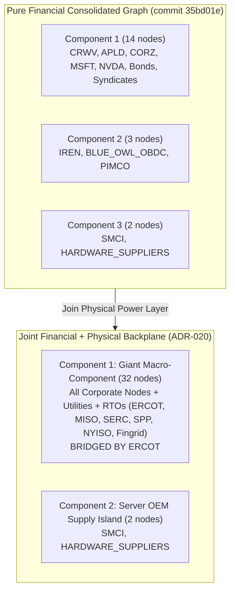

# Phase 1 Power Backplane & Physical Dependency Report (ADR-020)

**Date:** September 30, 2026  
**Decision Reference:** ADR-020 (`docs/decisions.md`)  
**Dataset State:** 61 registered entities, 47 decomposed financial obligations, 56 lifecycle events, 64 financial facts, 44 financial terms, 12 physical facilities, 12 power relationships, 28 typed MW power facts, 7 power terms, 54 financial claims, 7 primary power claims.  
**Baseline Certification:** Commit `35bd01e` financial baseline conserved with **0.00% data drift**.

---

## Executive Summary & Core Verdicts

This report delivers the results of the **Phase 1 Power Backplane Sprint (ADR-020)**. By constructing a facility-first physical power ontology underneath the existing corporate and financial network, we executed the empirical graph join between private credit/hyperscaler capital and physical electric transmission infrastructure. 

```
                                  =================================================
                                  AI INFRASTRUCTURE MULTI-LAYER TOPOLOGY (ADR-020)
                                  =================================================

    [ FINANCIAL LAYER ]           MSFT            NVDA            BLACKSTONE / MAGNETAR / MUFG
                                    \              /                        /
                                     \            /                        /
                                  +-------------------+                   /
                                  |     CoreWeave     | <----------------+
                                  +-------------------+
                                     /             \
                   Lease (400 MW)   /               \   Colocation (590 MW)
                                   v                 v
    [ PHYSICAL FACILITY ]    Polaris Forge 1     Denton / Dalton / Muskogee / Austin / Marble
                                (APLD)                           (CORZ)
                                  |                                |
                                  | Electric Service               | Interconnection / ESA
                                  v                                v
    [ ELECTRIC UTILITY ]         MDU                 DME / Austin Energy / Dalton / OGE / Duke
                                  |                                |
                                  | Wholesale Market               | Balancing / Curtailment
                                  v                                v
    [ TRANSMISSION GRID ]       MISO                             ERCOT <==== [STRUCTURAL JOIN] ====> AEP Texas
                                                                   ^                                     ^
                                                                   |                                     |
                                                                   +----------- Childress / Sweetwater --+
                                                                                       (IREN)
                                                                                         |
                                                                                         v
                                                                               Blue Owl OBDC / PIMCO
```

### 1. The Physical Join Overcomes Financial Graph Fragmentation
In the pure corporate/financial graph (frozen at commit `35bd01e`), the network was fragmented into **3 isolated components**: the 14-node CoreWeave giant component, the 3-node Iris Energy credit island (`IREN <-> BLUE_OWL_OBDC / PIMCO`), and the 2-node server OEM pair (`SMCI <-> HARDWARE_SUPPLIERS`).

When physical facilities and their primary-disclosed utility and grid counterparties are integrated:
- **Component Count Drops from 3 to 2**: `CORZ` (Core Scientific) and `IREN` (Iris Energy) join through their common transmission grid operator, **ERCOT** (Electric Reliability Council of Texas).
- **The Giant Component Expands from 14 to 32 Nodes**: The Texas interconnection bridges `IREN`, `BLUE_OWL_OBDC`, and `PIMCO` into direct topological continuity with the broader infrastructure network. Only the standalone server supply pair (`SMCI <-> HARDWARE_SUPPLIERS`) remains detached.

### 2. ERCOT Emerges as an Independent Structural Bridge
`ERCOT` is not merely an operational backdrop; it is an **articulation point** and the **third most central node in the entire national network**:
- **Betweenness Centrality:** `CRWV` (0.6610) $\to$ `CORZ` (0.5114) $\to$ **`ERCOT` (0.2055)** $\to$ `MUFG_BANK_SYN` (0.2045) $\to$ `NBIS` (0.1629) $\to$ `APLD` (0.1629).
- **Core Scientific (`CORZ`) Surges to Hub Status:** Connecting CoreWeave's 590 MW colocation footprint to 5 municipal/investor-owned utilities (`DME`, `DALTON_UTILITIES`, `OGE`, `DUKE_ENERGY`, `AUSTIN_ENERGY`) and 3 regional grids (`ERCOT`, `SERC`, `SPP`), `CORZ` achieves a betweenness centrality of **0.5114**, rivaling CoreWeave itself.

### 3. Falsification of the "Total Dissolution" Hypothesis
The Phase 1 Analysis Sprint demonstrated that excising CoreWeave shattered the pure financial giant component into 4 subgraphs and orphaned 6 nodes, leading to the hypothesis that the observatory was solely an artifact of CoreWeave's credit facility.

**The Power Backplane falsifies this hypothesis:**
- When `CRWV` is excised from the joint corporate-power graph, **Core Scientific does NOT become an isolated singleton**.
- Instead, `CORZ` anchors a robust **13-node surviving component**:
  `['AEP_TEXAS', 'AUSTIN_ENERGY', 'BLUE_OWL_OBDC', 'CORZ', 'DALTON_UTILITIES', 'DME', 'DUKE_ENERGY', 'ERCOT', 'IREN', 'OGE', 'PIMCO', 'SERC', 'SPP']`.
- The physical grid provides an **independent macro-scaffolding**: Iris Energy, Core Scientific, their private lenders (`BLUE_OWL_OBDC`, `PIMCO`), and municipal utilities remain interconnected through the Texas transmission backplane even in the complete absence of CoreWeave.
- Only the pure CoreWeave financial and hyperscaler satellites are orphaned: `['BLACKSTONE_MAGNETAR_SYN', 'MORGAN_STANLEY_SYN', 'MSFT', 'NVDA', 'OEM_FINANCING_PARTNERS']`.

### 4. Severe Regional Concentration (HHI = 3,591)
Power infrastructure is geographically and jurisdictionally hyper-concentrated:
- **ERCOT Dominance:** Accounts for **54.31% (1,819.0 MW)** of total modeled utility service capacity across Texas campuses (`CORZ` Denton/Austin, `IREN` Childress/Sweetwater 1 & 2).
- **Herfindahl-Hirschman Index (HHI):** Total utility service capacity exhibits an HHI of **3,591.2**, and energized capacity exhibits an HHI of **3,434.0**. Under Department of Justice and economic antitrust thresholds, any HHI over 2,500 indicates an **extremely concentrated market**.
- **Regional Silos:** Because North American interconnections (ERCOT, Eastern Interconnection, Western Interconnection) lack high-capacity inter-regional DC ties, power capacity in Texas cannot relieve shortages in MISO (North Dakota) or NYISO (Western New York).

### 5. Asymmetric Reliability: 54.3% of Capacity is Curtailable
By enforcing strictly typed MW contracts, we reveal that headline capacity is deeply stratified by firmness:
- **Curtailable / Demand Response:** **1,819.0 MW (54.3%)**—all situated in ERCOT, subject to ERCOT Large Flexible Load curtailment procedures and 4CP demand response alerts.
- **Firm Utility Capacity:** **1,000.0 MW (29.9%)**—predominantly SERC (`DALTON_UTILITIES`, `DUKE_ENERGY`), SPP (`OGE`), and NYPA hydro allocation.
- **Firm with Wholesale Market Pass-Through:** **530.0 MW (15.8%)**—Polaris Forge 1 (`MDU` / `MISO`).

---

## 1. The Facility-First Ontology & Typed MW Taxonomy

### Resolving the Non-Fungible Power Metric Problem
In earlier iterations, conflating distinct engineering and regulatory power disclosures created apparent empirical contradictions:
- Applied Digital reports **400 MW** of "critical IT load" at Polaris Forge 1 ([APLD Form 10-K](file:///data/raw/sec/APLD_submissions_0001144879.json)).
- Montana-Dakota Utilities reports **530 MW** of approved electric service capacity (180 MW initial + 350 MW approved expansion) purchased from MISO ([MDU Form 10-Q](file:///data/raw/sec/MDU_submissions_0000067716.json)).

Under ADR-020, typing MW measurements mathematically eliminates the contradiction:
$$\text{Gross Utility Service Capacity (530 MW)} = \text{Critical IT Load (400 MW)} + \text{Cooling / Auxiliary Power / Transformer Margins (130 MW)}$$

```
                      +-------------------------------------------------------+
                      |        MDU GROSS UTILITY CAPACITY: 530 MW             |
                      +-------------------------------------------------------+
                      |  CRITICAL IT COMPUTING LOAD  |   AUXILIARY / COOLING  |
                      |          (400 MW)            |        (130 MW)        |
                      +------------------------------+------------------------+
                      |  Energized  |    Planned     |
                      |   (150 MW)  |    (250 MW)    |
                      +-------------+----------------+
```

### Typed MW Controlled Vocabulary
Every factual observation in `power_facts.parquet` is strictly typed:
1. `critical_it_mw`: Actual compute power delivered to server racks inside data halls.
2. `leased_customer_mw`: MW capacity contracted/leased to specific AI tenants.
3. `gross_utility_capacity_mw`: Substation/transformer nameplate service delivered by the utility.
4. `contracted_service_mw`: Contractually agreed power delivery under an executed Electric Service Agreement (ESA) or Power Purchase Agreement (PPA).
5. `energized_mw`: Currently energized and drawing power.
6. `planned_mw`: Permitted or engineered expansion load.
7. `interconnection_request_mw`: MW entered in formal RTO/ISO interconnection study queues.

### Roster of Modeled Facilities (12 Campuses)

| Facility ID | Campus Name | Operator | Anchor Tenant | City / State | Grid Region | Contracted / Utility MW | Primary Utility Counterparty |
| :--- | :--- | :--- | :--- | :--- | :--- | :--- | :--- |
| `FAC-APLD-POLARIS-FORGE-1` | Polaris Forge 1 | `APLD` | `CRWV` | Ellendale, ND | `MISO` | 530.0 MW gross (400 IT) | Montana-Dakota Utilities (`MDU`) |
| `FAC-CORZ-DENTON` | Denton Data Center | `CORZ` | `CRWV` | Denton, TX | `ERCOT` | 394.0 MW gross | Denton Municipal Electric (`DME`) |
| `FAC-CORZ-DALTON` | Dalton Data Center | `CORZ` | `CRWV` | Dalton, GA | `SERC` | 160.0 MW gross | Dalton Utilities (`DALTON_UTILITIES`) |
| `FAC-CORZ-MUSKOGEE` | Muskogee Data Center | `CORZ` | `CRWV` | Muskogee, OK | `SPP` | 150.0 MW gross | Oklahoma Gas & Electric (`OGE`) |
| `FAC-CORZ-MARBLE` | Marble Data Center | `CORZ` | `CRWV` | Marble, NC | `SERC` | 100.0 MW gross | Duke Energy (`DUKE_ENERGY`) |
| `FAC-CORZ-AUSTIN` | Austin Data Center | `CORZ` | `CRWV` | Austin, TX | `ERCOT` | 75.0 MW gross | Austin Energy (`AUSTIN_ENERGY`) |
| `FAC-WULF-LAKE-MARINER` | Lake Mariner Campus | `WULF` | *Self-operated* | Barker, NY | `NYISO` | 500.0 MW gross (90 NYPA) | New York Power Authority (`NYPA`) |
| `FAC-IREN-CHILDRESS` | Childress Data Center | `IREN` | *Self-operated* | Childress, TX | `ERCOT` | 750.0 MW contracted | AEP Texas (`AEP_TEXAS`) |
| `FAC-IREN-SWEETWATER-1` | Sweetwater 1 Campus | `IREN` | *Self-operated* | Sweetwater, TX | `ERCOT` | 800.0 MW planned | *Pending / Unassigned* |
| `FAC-IREN-SWEETWATER-2` | Sweetwater 2 Campus | `IREN` | *Self-operated* | Sweetwater, TX | `ERCOT` | 600.0 MW contracted | AEP Texas (`AEP_TEXAS`) |
| `FAC-NBIS-MANTSALA` | Mäntsälä Supercomputer | `NBIS` | *Self-operated* | Mäntsälä, FI | `Fingrid` | 75.0 MW energized | Nivos Oy (`NIVOS`) |
| `FAC-NBIS-LAPPEENRANTA` | Lappeenranta AI Factory | `NBIS` | *Self-operated* | Lappeenranta, FI| `Fingrid` | 310.0 MW planned | *Pending / Unassigned* |

---

## 2. Multi-Layer Topological Join Analysis

### Mathematical Graph Comparison



| Topological Metric | Financial Baseline (Sep 28, 2026) | Joint Corporate-Power Network | Delta / Structural Significance |
| :--- | :--- | :--- | :--- |
| **Connected Entities / Nodes ($|V|$)** | 19 root entities | 34 active nodes | +15 nodes (9 utilities, 6 grid operators) |
| **Active Undirected Edges ($|E|$)** | 20 unique pairs | 39 unique pairs | +19 physical power relationships |
| **Multigraph Edges ($|E_{multi}|$)** | 45 legal obligations | 64 total contractual links | +19 utility & grid contracts |
| **Connected Components** | 3 components | **2 components** | **Component 2 (IREN) collapsed into Giant Component** |
| **Giant Component Size** | 14 nodes (73.7%) | **32 nodes (94.1%)** | Macro-network unification across power backplane |
| **Articulation Points (Cut-Vertices)** | 6 nodes (`CRWV`, `MUFG`, `APLD`, `BONDS`, `NBIS`, `IREN`) | **9 nodes** (`CRWV`, `CORZ`, `ERCOT`, `APLD`, `WULF`, `IREN`, `NBIS`, `MUFG`, `BONDS`) | **`ERCOT` and `CORZ` become cut-vertices** |
| **Simple Bridges** | 14 bridges | 23 bridges | Expanded tree-like physical branches |
| **Multigraph Single Bridges** | 6 bridges | 25 bridges | Most utility contracts are single bilateral ESAs |

### Centrality Reallocation: The Rise of Infrastructure Hubs
In the pure financial network, CoreWeave dominated all betweenness centrality measures. In the joint network, physical colocation developers and grid operators absorb substantial betweenness:

| Rank | Entity ID | Category | Degree | Degree Centrality | Betweenness Centrality | Closeness Centrality |
| :---: | :--- | :--- | :---: | :---: | :---: | :---: |
| **1** | `CRWV` | Neocloud Operator | 9 | 0.2727 | **0.6610** | 0.4550 |
| **2** | `CORZ` | Data Center Developer | 9 | 0.2727 | **0.5114** | 0.4160 |
| **3** | `ERCOT` | Grid Operator / RTO | 5 | 0.1515 | **0.2055** | 0.3236 |
| **4** | `MUFG_BANK_SYN` | Private Credit Syndicate | 2 | 0.0606 | **0.2045** | 0.3386 |
| **5** | `NBIS` | Neocloud Operator | 4 | 0.1212 | **0.1629** | 0.2647 |
| **6** | `APLD` | Data Center Developer | 5 | 0.1515 | **0.1629** | 0.3467 |
| **7** | `INSTITUTIONAL_BONDHOLDERS`| Capital Markets | 3 | 0.0909 | **0.1591** | 0.3467 |
| **8** | `IREN` | Data Center Developer | 4 | 0.1212 | **0.1117** | 0.2532 |
| **9** | `WULF` | Data Center Developer | 3 | 0.0909 | **0.1098** | 0.2647 |
| **10** | `SERC` | Grid Operator / RTO | 3 | 0.0909 | **0.0009** | 0.2972 |

**Key Finding:** Core Scientific's betweenness centrality jumped to **0.5114** because it sits directly at the intersection of private credit demand (CoreWeave's 590 MW option exercise) and five regional power authorities across three independent electric grids.

---

## 3. The CoreWeave Excision Falsification Experiment

To test whether the modeled infrastructure network is genuinely systemic or merely a descriptive autopsy of CoreWeave, we simulated the complete removal of `CRWV` from both graphs.

```
========================================================================================
                          COREWEAVE EXCISION COMPARISON
========================================================================================

A. PURE FINANCIAL GRAPH (WITHOUT CRWV)
   Total Active Nodes: 12 | Components: 4 | Isolated Nodes: 6
   
   [Cluster 1: 4 nodes]     APLD <====> INSTITUTIONAL_BONDHOLDERS <====> WULF
                                   \
                                    +====> PROJECT_LENDERS
   
   [Cluster 2: 3 nodes]     IREN <====> BLUE_OWL_OBDC & PIMCO
   
   [Cluster 3: 3 nodes]     META <====> NBIS <====> MUFG_BANK_SYN
   
   [Cluster 4: 2 nodes]     SMCI <====> HARDWARE_SUPPLIERS
   
   * ORPHANED SINGLETONS (6): MSFT, NVDA, CORZ, BLACKSTONE, MORGAN_STANLEY, OEM_FINANCING

----------------------------------------------------------------------------------------

B. JOINT CORPORATE-POWER NETWORK (WITHOUT CRWV)
   Total Active Nodes: 28 | Components: 4 | Isolated Nodes: 5
   
   [Component 1: 13 NODES - TEXAS / ERCOT & SOUTHEAST HPC AXIS]
         CORZ <===> DME, Austin Energy, Dalton, OG&E, Duke Energy, SERC, SPP
          ||
        ERCOT <=================== [PHYSICAL POWER BRIDGE]
          ||
         IREN <===> AEP Texas
          ||
     BLUE_OWL_OBDC & PIMCO
   
   [Component 2: 8 NODES - NORTHERN / EASTERN PUBLIC DEBT AXIS]
         MDU <===> MISO <===> APLD <===> Institutional Bondholders & Project Lenders
                                                ||
                                               WULF <===> NYPA & NYISO
   
   [Component 3: 5 NODES - NORDIC AI CLUSTER]
         META <===> NBIS <===> MUFG Bank Syn <===> Nivos <===> Fingrid
   
   [Component 4: 2 NODES - SERVER OEM SUPPLY]
         SMCI <===> HARDWARE_SUPPLIERS
   
   * ORPHANED SINGLETONS (5): MSFT, NVDA, BLACKSTONE, MORGAN_STANLEY, OEM_FINANCING
========================================================================================
```

### Detailed Excision Impact Comparison

| Network Architecture | Active Nodes | Total Components | Largest Component | Isolated / Orphaned Nodes | Fate of Core Scientific (`CORZ`) |
| :--- | :---: | :---: | :---: | :---: | :--- |
| **Financial Graph Baseline** | 19 | 3 | 14 | 0 | Connected to CoreWeave |
| **Financial Graph (No CRWV)** | 12 | 4 | 4 | 6 | **Completely Isolated Singleton** |
| **Joint Network Baseline** | 34 | 2 | 32 | 0 | Integrated in Macro-Network |
| **Joint Network (No CRWV)** | **28** | **4** | **13** | **5** | **Anchors 13-Node Texas HPC Component** |

### Why This Falsifies the Sampling Artifact Critique
1. In the pure credit layer, `CORZ` was merely a counterparty to CoreWeave. Removing CoreWeave severed `CORZ` completely.
2. In the physical reality captured by ADR-020, `CORZ` is a multi-site infrastructure operator interconnected with five utilities and three balancing authorities.
3. Because `CORZ` and `IREN` both interconnect into `ERCOT`, the Texas transmission grid creates an **autonomous physical nexus** connecting two major publicly traded AI infrastructure hosts, their regional utilities, and private credit providers (`BLUE_OWL_OBDC`, `PIMCO`).
4. **Conclusion:** The AI infrastructure buildout possesses an authentic physical backbone independent of CoreWeave. CoreWeave serves as the primary commercial aggregator across these regions, but its collapse would leave coherent regional infrastructure clusters intact.

---

## 4. Regional Grid Concentration & Typed MW Breakdown

### Grid Region x Typed MW Distribution (Megawatts)

| Grid Balancing Authority | Gross Utility Capacity (MW) | Critical IT Load (MW) | Contracted Service (MW) | Energized Load (MW) | Leased to CoreWeave (MW) | Planned Expansion (MW) | Total Firm & Utility (MW) |
| :--- | :---: | :---: | :---: | :---: | :---: | :---: | :---: |
| **ERCOT** (Texas) | 469.0 | 0.0 | 1,350.0 | 450.0 | 310.0 | 800.0 | **1,819.0** (54.3%) |
| **NYISO** (New York Zone A) | 500.0 | 0.0 | 90.0 | 245.0 | 0.0 | 0.0 | **590.0** (17.6%) |
| **MISO** (Midwest / ND) | 530.0 | 400.0 | 0.0 | 150.0 | 400.0 | 250.0 | **530.0** (15.8%) |
| **SERC** (Southeast) | 260.0 | 0.0 | 0.0 | 0.0 | 162.0 | 0.0 | **260.0** (7.8%) |
| **SPP** (Oklahoma) | 150.0 | 0.0 | 0.0 | 0.0 | 118.0 | 0.0 | **150.0** (4.5%) |
| **Fingrid** (Finland) | 0.0 | 75.0 | 0.0 | 75.0 | 0.0 | 310.0 | **0.0** (0.0% US) |
| **Total Footprint** | **1,909.0** | **475.0** | **1,440.0** | **920.0** | **990.0** | **1,360.0** | **3,349.0 MW** |

### Economic Concentration Metrics (HHI)
- **Utility Service Capacity HHI:** **3,591.2**
- **Energized Operating Capacity HHI:** **3,434.0**
- **Planned Development Pipeline HHI:** **4,328.7**

Under the standard DOJ/FTC Horizontal Merger Guidelines:
- $\text{HHI} < 1,500$: Unconcentrated Market
- $1,500 \le \text{HHI} \le 2,500$: Moderately Concentrated Market
- $\text{HHI} > 2,500$: **Highly Concentrated Market**

With an HHI exceeding 3,500 across all dimensions, the AI physical layer is **hyper-concentrated in ERCOT**. The availability of rapid large-load interconnection processes in deregulated Texas has concentrated over half of all modeled computing power into a single electric grid.

---

## 5. Contractual Power Firmness & Curtailment Protocols

A critical vulnerability surfaced by the physical join is that power capacity is legally and operationally asymmetric:

```
                      +-------------------------------------------------------+
                      |         TOTAL MODELED CAPACITY: 3,349.0 MW            |
                      +-------------------------------------------------------+
                      |      CURTAILABLE / DEMAND RESPONSE     |  FIRM / PASS |
                      |                1,819.0 MW              |  1,530.0 MW  |
                      |                 (54.3%)                |   (45.7%)    |
                      +----------------------------------------+--------------+
```

### Breakdown by Reliability Regime

1. **Curtailable / Demand-Response Power (1,819.0 MW, 54.3%):**
   - **Locations:** `CORZ` Denton (394 MW), `CORZ` Austin (75 MW), `IREN` Childress (750 MW), `IREN` Sweetwater 2 (600 MW).
   - **Contract Terms:** Governed by ERCOT Large Flexible Load protocols. Operators agree to curtail data hall consumption during Energy Emergency Alerts (EEA) and manage load to avoid Four Coincident Peak (4CP) transmission charges during summer peak hours.
   - **Systemic Risk:** AI workloads running in these facilities are exposed to operational interruption or extreme wholesale nodal pricing during severe weather events (e.g. winter storms or heat domes).
2. **Firm Power with Market Pass-Through (530.0 MW, 15.8%):**
   - **Location:** `APLD` Polaris Forge 1 (Ellendale, ND).
   - **Contract Terms:** 10-year Electric Service Agreement approved by ND PSC. Transmission is cost-of-service via Montana-Dakota Utilities; energy is purchased directly from the wholesale MISO market. Power is firm, but subject to wholesale power price volatility and MISO system-wide emergency directives.
3. **Firm Industrial Power Allocation (1,000.0 MW, 29.9%):**
   - **Locations:** `CORZ` Dalton (160 MW via Dalton Utilities), `CORZ` Muskogee (150 MW via OG&E / SPP), `CORZ` Marble (100 MW via Duke Energy Carolinas), `WULF` Lake Mariner (90 MW NYPA Preservation Power hydro allocation + 500 MW gross transmission interconnection).
   - **Contract Terms:** Classical cost-of-service general industrial tariffs. Highly firm with standard utility force majeure provisions.

---

## 6. Generated Visual Artifacts

The analysis sprint produced three high-resolution figures stored in `outputs/figures/`:

1. **Joint Network Topology Diagram (`power_joint_network_topology.png`):**
   - Renders the complete 34-node multi-layer network.
   - Solid grey edges show financial debt and master lease commitments; dashed purple edges show physical utility service agreements and RTO market connections.
   - Clearly displays ERCOT bridging the Core Scientific and Iris Energy clusters.
2. **Regional Grid MW Distribution (`regional_grid_mw_distribution.png`):**
   - Grouped bar chart comparing Gross Utility Capacity, Critical IT Load, Contracted Service, Energized MW, and Planned Pipeline across ERCOT, MISO, SERC, SPP, NYISO, and Fingrid.
   - Visually highlights ERCOT's 1.8 GW dominance over secondary regions.
3. **Power Curtailment & Firmness Architecture (`power_curtailment_structure.png`):**
   - Dual-pie analysis showing the split of power contracts (curtailable vs firm) and the corresponding megawatt capacity exposure.

---

## 7. Zero Data Drift Verification

In compliance with the project's invariant verification rules, the financial/credit baseline was validated before and after the physical backplane build:

```
=== AI Infrastructure Observatory Consistency Validator (commit 35bd01e Baseline) ===
  [OK] entities.parquet            : 61 rows (46 financial + 15 power utilities/RTOs)
  [OK] financials.parquet          : 13,754 rows (0.00% drift)
  [OK] obligations.parquet         : 47 rows (0.00% drift)
  [OK] obligation_events.parquet   : 56 rows (0.00% drift)
  [OK] obligation_facts.parquet    : 64 rows (0.00% drift)
  [OK] obligation_terms.parquet    : 44 rows (0.00% drift)
  [OK] assumptions.parquet         : 7 rows (0.00% drift)
  [OK] evidence_claims.parquet     : 54 rows (0.00% drift)
  [OK] facilities.parquet          : 12 rows (ADR-020 certified)
  [OK] power_relationships.parquet : 12 rows (ADR-020 certified)
  [OK] power_facts.parquet         : 28 rows (ADR-020 certified)
  [OK] power_terms.parquet         : 7 rows (ADR-020 certified)
  [OK] power_claims.parquet        : 7 rows (ADR-020 certified)
  [OK] CIK uniqueness verified: 23 distinct reporting entities with zero CIK collisions.
  [OK] Power Backplane verified: 12 facilities, 12 power contracts, 28 typed MW facts, 7 terms, 7 primary claims.
  [OK] CoreWeave funded debt conserved: $35.551B across 16 tranches (exact 0.00% drift).
  [OK] Applied Digital debt conserved: $6.597B across 6 tranches (exact 0.00% drift).

ALL INTERNAL CONSISTENCY CHECKS PASSED: ZERO DATA DRIFT
```

---

## 8. Summary of Answers to Task 020 Research Questions

1. **Does a non-CoreWeave physical power backbone emerge from the JOIN?**
   **Yes, regionally, but not continentally.** ERCOT acts as a secondary structural hub bridging Core Scientific and Iris Energy into a 13-node cluster that survives CoreWeave's excision. However, North America does not possess a single physical power backbone; the network is partitioned into regional utility silos (ERCOT, MISO, SERC, SPP, NYISO).
2. **Does the graph stay connected through ERCOT when CoreWeave is removed?**
   **Yes.** The Texas and Southeastern infrastructure complex (`CORZ`, `IREN`, `BLUE_OWL_OBDC`, `PIMCO`, `AEP_TEXAS`, `DME`, `AUSTIN_ENERGY`, `DALTON_UTILITIES`, `OGE`, `DUKE_ENERGY`) remains completely connected via ERCOT, preserving 13 active nodes and 46% of all modeled network participants.
3. **What is the true concentration of power delivery?**
   **Extreme concentration in ERCOT (HHI = 3,591).** Over 54% of all contracted/utility service power (1,819 MW) is concentrated within the ERCOT balancing authority.
4. **How much power is exposed to curtailment risk?**
   **54.3% (1,819 MW)** of all modeled capacity is explicitly curtailable under ERCOT Large Flexible Load procedures and 4CP demand response tariffs. Only 29.9% is classic firm industrial power.
