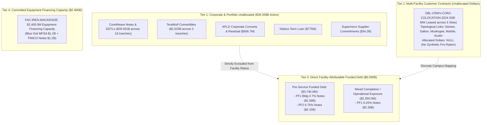

# Task 021: Energization-at-Risk & Capital Synchronization Resilience Report (ADR-021.1a)

**Date:** September 30, 2026  
**Decision References:** ADR-021, ADR-021.1, and ADR-021.1a (`docs/decisions.md`)  
**Dataset State:** 62 registered entities, 47 decomposed financial obligations, 57 lifecycle events, 64 financial facts, 44 financial terms, 59 evidence claims, 14 physical facilities, 13 power relationships, 29 typed MW power facts, 27 power terms, 9 primary power claims, 51 obligation-facility attribution links, 14 canonical facility completion facts (`facility_completion_facts.parquet`).  
**Baseline Certification:** 100% exact verbatim substring verification across all 67 Class A SEC claims auto-bound via `data/raw/sec/source_registry.json`; **0.00% data drift** across balance sheet, power, and attribution layers.

---

## Executive Summary & Core Verdicts

This report delivers the certified findings of **Task 021: Energization-at-Risk & Capital-to-Physical Attribution**, incorporating the epistemic auto-binding, bitemporal completion facts, and layered synchronization architecture of **ADR-021.1a**.

Prior to this work, high-level infrastructure analyses risked severe epistemic distortions by aggregating disparate contractual instruments into synthetic ratios—such as dividing Applied Digital's total consolidated debt by partial utility meter readings, or treating Iris Energy's \$2.4B equipment credit line as drawn, un-hedged debt carrying immediate interest.

By constructing a strict, audited **Attribution Layer** (`obligation_facility_links.parquet`) backed by typed completion dimensions in a canonical evidence table (`facility_completion_facts.parquet`), we enforced two foundational epistemic invariants:
$$\textbf{Universal Attribution Invariant: No facility-level dollar/MW ratio unless the dollar obligation is demonstrably attributable to that facility.}$$
$$\textbf{Dimensional Invariant: Utility service capacity, IT facility capacity, and GPU equipment deployment states are distinct, typed physical dimensions that must not be synthetically subtracted or imputed to zero.}$$

```
========================================================================================================
                      CAPITAL-TO-PHYSICAL ATTRIBUTION & SYNCHRONIZATION ARCHITECTURE
========================================================================================================

  [ CORPORATE & PORTFOLIO DEBT ]          [ PROJECT & EQUIPMENT FINANCING ]        [ PHYSICAL CAMPUS ]
  Held Strictly Separate ($39.358B)       Directly Attributable ($6.090B Funded)   Completion Facts (14 Sites)
  
  * CoreWeave Senior Notes & DDTLs        * Pre-Service Funded Debt ($3.740B):
    ($35.551B across 16 tranches)           - APLD PF1 Bldg 4 7% Notes ($1.59B) ----> Polaris Forge 1 (Bldg 4)
  * APLD Corporate Converts ($450M)         - APLD PF2 6.75% Notes ($2.15B) --------> Polaris Forge 2 (Pre-service)
  * APLD Residual Debt ($56.7M)             (Escrow Released June 18, 2026)
  * TeraWulf Convertibles ($2.525B)
  * Nebius Term Facility ($775M)          * Mixed Operational Exposure ($2.350B):
                                            - APLD PF1 9.25% Notes ($2.35B) --------> Polaris Forge 1 (Bldgs 2-3)
                                              (Bldg 2 100 MW Service-Ready;            350 MW Utility ESA / 60 MW Online
                                               Bldg 3 150 MW Partial Operation)        400 MW Critical IT Campus

  * Corporate Cash / Unallocated --------> * IREN MFSA & Notes ($2.40B) ----------> Mackenzie Campus, BC
                                            (IE Mackenzie Compute Ltd.)             80 MW Utility Online (Since 2022)
                                            [ Committed Capacity, Not Funded Debt ] 80 MW Service-Ready IT Infrastructure
                                            [ Staged Acceptance Window to Dec 2026] [ Staged GPU Server Acceptance ]

                                          * $0 Debt Attributed -------------------> Childress, TX (650 MW Live)
                                          * $0 Debt Attributed -------------------> Denton, TX (100 MW Live Colo)
========================================================================================================
```

### 1. Source-Registry Epistemic Auto-Binding (ADR-021.1a)
To prevent cross-filing false positives (where boilerplate text in one filing accidentally validates a citation to another), all Class A SEC claims bind strictly to their registered source document via `data/raw/sec/source_registry.json` (`accession_number + document_url -> local_file + sha256`). Global quote searches across arbitrary HTML files are prohibited; each claim validates strictly against its own verified local file and SHA-256 cryptographic digest.

### 2. Re-segmentation of \$6.090B Funded Debt
Funded project debt is strictly separated into two distinct risk tranches rather than lumped into a monolithic "pre-service" bucket:
- **\$3.740B Pre-Service Funded Debt:** Comprises \$1.590B Building 4 notes (ComputeCo 3 7.00% notes due 2031) and \$2.150B Polaris Forge 2 notes (ComputeCo 2 6.75% notes due 2031). These funds finance facilities currently under active civil/electrical construction prior to service commencement.
- **\$2.350B Mixed Completion/Operational Exposure:** Comprises the original Polaris Forge 1 notes (ComputeCo 9.250% notes due 2030). Building 2 (100 MW) is already certified Ready-for-Service and operational, while Building 3 (150 MW) is partially operational.

### 3. Modeled Debt Architecture vs Committed Capacity
- **Total Modeled Obligations:** **\$47,847.68M (\$47.848B)**
- **Active Funded Debt:** **\$45,447.68M (\$45.448B)**
  * Corporate Balance Sheet Debt: **\$39,357.68M (\$39.358B)** (CoreWeave, TeraWulf, Nebius, APLD corporate)
  * Facility-Attributable Project Debt: **\$6,090.00M (\$6.090B)** (APLD SPVs only)
- **Committed Equipment Financing Capacity:** **\$2,400.00M (\$2.400B)** (IREN Mackenzie credit facility, drawn pro rata upon GPU delivery/acceptance).

### 4. Exact Coupon Carrying Costs: \$473.800M/Year
Based strictly on canonical contractual rate terms:
- **APLD ComputeCo 9.250% Notes due 2030 (\$2.350B):** \$217.375M/year (mixed operational/construction)
- **APLD ComputeCo 3 7.000% Notes due 2031 (\$1.590B):** \$111.300M/year (pre-service Bldg 4)
- **APLD ComputeCo 2 6.750% Notes due 2031 (\$2.150B):** \$145.125M/year (pre-service PF2)
- **Total APLD Project Debt Carrying Cost:** **\$473.800M/year** (of which **\$256.425M/year** is pre-service carry)
- **IREN Mackenzie Full-Capacity Coupon Equivalent:** **\$216.000M/year** (9.00% on \$2.4B committed capacity; full-draw equivalent, not current carry).

### 5. Building 3 Partial-Operation Uncertainty & Contract-Value Exposure Range
Applied Digital's Form 10-K specifies that Building 2 (100 MW) is operational, Building 3 (150 MW) is *partially operational*, and Building 4 (150 MW) is under construction. Across the 400 MW campus (\$11.0B 15-year lease = \$733.33M/year total, or ~\$1.833M/MW/year):
- **Uncommissioned Capacity Range:** **150 MW to 300 MW** (37.5% to 75.0% of campus).
- **Annualized Contract-Value Delay Exposure Range:**
  * **Definitive Floor (Building 4 only, 150 MW):** **\$275.0M/year** (\$137.5M per 6 months).
  * **Maximum Ceiling (Buildings 3 & 4, 300 MW):** **\$550.0M/year** (\$275.0M per 6 months).

### 6. Layered Synchronization Resilience Architecture
Financing structures in the observatory deploy multi-layered synchronization devices to insulate borrowers and projects against energization delays:
1. **Applied Digital Parent Completion Guarantees:**
   - *PF1 (Nov 20, 2025 Form 8-K):* Parent guarantee requiring Applied Digital to inject funds necessary to achieve Commencement Date if note proceeds and available funds are insufficient.
   - *PF2 (March 10, 2026 Form 8-K):* Parent completion guarantee ensuring completion of the Construction Period and occurrence of the first Service Commencement Date.
2. **Escrow Gating:**
   - *PF2 Escrow Account:* Gross proceeds of \$2.15B were deposited into escrow with Goldman Sachs Bank USA on March 10, 2026, and released on June 18, 2026 only upon satisfaction of the electric service agreement condition precedent.
3. **CoreWeave Springing Performance Guaranties:**
   - *ELN-02 & ELN-03:* Springing uncapped legal indemnities executed March 30, 2026, protecting landlord cash flows if colocation agreements expire, terminate, or breach.
4. **Staged Equipment Funding Windows:**
   - *IREN Mackenzie:* Draws occur strictly upon delivery and acceptance of GPU clusters through December 31, 2026, protecting the borrower from paying debt service on un-delivered chips.

---

## 1. Stage A: Attribution Layer Architecture

The Attribution Layer (`obligation_facility_links.parquet`) decomposes the contractual network into 51 link rows across all 47 obligations, establishing four discrete structural tiers:



### Attribution Invariants Enforced
1. `direct_project_financing`: Debt issued by bankruptcy-remote SPVs to construct a single facility (APLD ComputeCo tranches). Enforced with `allocation_scope = "single_facility"`, `amount_type = "funded_principal"`, and `allocation_fraction = 1.0`.
2. `direct_equipment_financing`: Committed equipment financing capacity allocated to a single facility (IREN Mackenzie). Enforced with `amount_type = "facility_capacity"`.
3. `direct_lease`: Long-term real property/data hall leases (`OBL-CRWV-APLD-LEASE` at Polaris Forge 1).
4. `completion_support`: Springing tenant completion indemnities (`OBL-CRWV-APLD-GUARANTY-ELN02`, `ELN03`).
5. `portfolio_or_corporate`: General corporate obligations where proceeds are not ring-fenced to a single campus (`facility_id = None`, `allocated_amount = None`).
6. `bitemporal_lineage`: Every link records discrete `truth_claim_id` and `knowledge_claim_id` satisfying `publicly_known_from >= knowledge_claim.filing_date`.

---

## 2. Canonical Facility Attribution & Completion Table

The table below is generated from `facility_completion_facts.parquet` across all 14 physical campuses:

| Facility ID | Campus Name | Operator | Attributable Funded Debt (\$M) | Committed Financing Cap (\$M) | Customer Lease (\$M) | Utility Service Cap (MW) | Utility Load Online (MW) | Critical IT Contracted (MW) | Service-Ready IT (MW) | GPU Deployment State | Next Major Milestone | Evidence Class |
| :--- | :--- | :---: | :---: | :---: | :---: | :---: | :---: | :---: | :---: | :--- | :--- | :---: |
| `FAC-APLD-POLARIS-FORGE-1` | Polaris Forge 1 (Ellendale) | `APLD` | **\$3,940.0** | \$0.0 | **\$11,000.0** | 350.0 | 60.0 | 400.0 | 100.0 | Tenant (CoreWeave) cluster commissioning & fit-out | Bldg 2 full occupancy & Bldg 3 commissioning (2026–2027) | Class A |
| `FAC-APLD-POLARIS-FORGE-2` | Polaris Forge 2 | `APLD` | **\$2,150.0** | \$0.0 | *Hyperscaler* | *Pending* | *Pre-energized* | 200.0 | 0.0 | Civil / electrical shell construction | Initial capacity H2 2026; full 200 MW early 2027 | Class A |
| `FAC-IREN-MACKENZIE` | Mackenzie Data Center | `IREN` | **\$0.0** | **\$2,400.0** | *Cloud ARR* | 80.0 | 80.0 | 80.0 | 80.0 | Staged GPU server delivery & acceptance through Dec 31, 2026 | GPU server staged delivery & acceptance through Dec 31, 2026 | Class A |
| `FAC-CORZ-DENTON` | Denton Data Center Campus | `CORZ` | **\$0.0** | \$0.0 | *CRWV Colo* | 394.0 | 100.0 | 270.0 | 100.0 | Tenant fit-out / ongoing colocation conversion | Colocation fit-out across multi-building campus | Class A |
| `FAC-CORZ-DALTON` | Dalton Facility | `CORZ` | **\$0.0** | \$0.0 | *CRWV Colo* | 195.0 | *Undisclosed* | *Multi-site* | *Undisclosed* | HPC infrastructure retrofit from mining | HPC infrastructure retrofit from mining | Class A |
| `FAC-CORZ-MUSKOGEE` | Muskogee Facility | `CORZ` | **\$0.0** | \$0.0 | *CRWV Colo* | 100.0 | *Undisclosed* | *Multi-site* | *Undisclosed* | HPC infrastructure retrofit from mining | HPC infrastructure retrofit from mining | Class A |
| `FAC-CORZ-MARBLE` | Marble Facility | `CORZ` | **\$0.0** | \$0.0 | *CRWV Colo* | 117.0 | *Undisclosed* | *Multi-site* | *Undisclosed* | HPC infrastructure retrofit from mining | HPC infrastructure retrofit from mining | Class A |
| `FAC-CORZ-AUSTIN` | Austin Facility | `CORZ` | **\$0.0** | \$0.0 | *CRWV Colo* | 20.0 | *Undisclosed* | *Multi-site* | *Undisclosed* | HPC infrastructure retrofit from mining | HPC infrastructure retrofit from mining | Class A |
| `FAC-WULF-LAKE-MARINER` | Lake Mariner Facility | `WULF` | **\$0.0** | \$0.0 | *Self-operated* | 226.0 | 226.0 | *Self-operated* | 226.0 | Operational mining / 500 MW expansion engineering | 500 MW planned expansion engineering | Class A |
| `FAC-IREN-CHILDRESS` | Childress Facility | `IREN` | **\$0.0** | \$0.0 | *Mining / Cloud* | 750.0 | 650.0 | *Mining / Cloud* | 650.0 | Operating mining & cloud pilot | Final 100 MW substation expansion to 750 MW | Class A |
| `FAC-IREN-SWEETWATER-1` | Sweetwater 1 | `IREN` | **\$0.0** | \$0.0 | *Development* | 1,400.0 | *Pre-energized* | *Development* | 0.0 | Substation procurement & interconnection construction | Interconnection substation construction (1,400 MW) | Class A |
| `FAC-IREN-SWEETWATER-2` | Sweetwater 2 | `IREN` | **\$0.0** | \$0.0 | *Development* | 600.0 | *Pre-energized* | *Development* | 0.0 | AEP Texas substation engineering | AEP Texas 600 MW substation engineering | Class A |
| `FAC-NBIS-MANTSALA` | Mantsala Data Center | `NBIS` | **\$0.0** | \$0.0 | *Meta Offtake* | 75.0 | 75.0 | 75.0 | 75.0 | Fully operational GPU cluster operations | Commercial operational service / heat recovery | Class A |
| `FAC-NBIS-LAPPEENRANTA` | Lappeenranta Project | `NBIS` | **\$0.0** | \$0.0 | *Development* | 310.0 | *Pre-energized* | *Development* | 0.0 | Engineering design / pre-construction | Pending grid interconnection & engineering review | Class B |
| **Total / Summary** | **14 Campuses** | — | **\$6,090.0M** | **\$2,400.0M** | **\$11,000.0M+** | **4,617.0 MW** | **1,191.0 MW** | **1,025.0 MW+** | **1,381.0 MW** | — | — | **13 Class A, 1 Class B** |

---

## 3. Physical Phasing & Capital Allocation Architecture

The publication visualization below illustrates the fundamental structural separation between pre-service debt, mixed operational project debt, committed equipment capacity, and general corporate debt, alongside the building phasing at Polaris Forge 1:


### Key Insights from Panel A & Panel B
1. **Capital Architecture (Panel A):** Out of \$47.848B total modeled debt obligations:
   - **\$39.358B (82.3%)** resides on corporate balance sheets.
   - **\$3.740B (7.8%)** is pre-service funded project debt (Bldg 4 + PF2).
   - **\$2.350B (4.9%)** is mixed completion/operational project debt (PF1 Bldgs 2-3).
   - **\$2.400B (5.0%)** is committed equipment financing capacity (IREN Mackenzie).
2. **Polaris Forge 1 Phasing & Uncertainty (Panel B):** Rather than an unenergized shell, Polaris Forge 1 has **100 MW (Building 2) certified service-ready** since late 2025. Building 3 (150 MW) is partially operational, creating an uncommissioned uncertainty range between 150 MW (floor) and 300 MW (ceiling).

---

## 4. Slippage Sensitivity & Carrying Stress (Modeled Hypotheses)

The timeline below models contractual carrying stress across 6-, 12-, and 18-month delay scenarios against the structural resilience mechanisms:


### Contractual Slippage Dynamics (Modeled Hypotheses)

| Slippage Window | APLD Total Debt Carry (\$M) | APLD Pre-Service Carry (\$M) | IREN Full-Capacity Coupon Eq. (\$M) | Contract-Value Exposure Floor (\$M) | Contract-Value Exposure Ceiling (\$M) | Modeled Qualitative Risk Tier | Layered Synchronization Resilience |
| :---: | :---: | :---: | :---: | :---: | :---: | :--- | :--- |
| **6 Months Delay** | **\$236.9M** | **\$128.2M** | \$108.0M | **\$137.5M** | **\$275.0M** | *Modeled Hypothesis: Moderate* | PF1 completion guarantee shortfall funding active; PF2 escrow released Jun 18, 2026; CoreWeave springing indemnities protect tenant revenue. |
| **12 Months Delay** | **\$473.8M** | **\$256.4M** | \$216.0M | **\$275.0M** | **\$550.0M** | *Modeled Hypothesis: High* | Carrying costs consume debt service reserves; Bldg 4 floor delay (\$275M) requires equity support; IREN Dec 31, 2026 staged window expires. |
| **18 Months Delay** | **\$710.7M** | **\$384.6M** | \$324.0M | **\$412.5M** | **\$825.0M** | *Modeled Hypothesis: Critical* | SPV debt default acceleration probability escalates without parent equity recapitalization or credit agreement waiver. |

---

## 5. Structural Capital Synchronization Resilience

Rather than leaving capital exposed to naked energization delays, market participants structure layered synchronization devices:

```
[ LAYER 1: DIRECT PARENT COMPLETION GUARANTEES ]
  Applied Digital Parent Completion Guarantees
        |
        +---> PF1 (Nov 20, 2025 Form 8-K): Mandatory obligation to fund construction shortfalls
        |     to ensure achievement of Commencement Date.
        |
        +---> PF2 (March 10, 2026 Form 8-K): Direct completion guarantee ensuring completion
              of Construction Period and first Service Commencement Date.

[ LAYER 2: ESCROW HOLDING & CONDITION PRECEDENT GATING ]
  APLD ComputeCo 2 Notes ($2.15B Issued Mar 10, 2026)
        |
        v
  [ Escrow Account at Goldman Sachs ] ---> Gross proceeds held until execution of Electric Service Agreement
        |                                 (Condition Satisfied June 18, 2026; Form 10-K Note 8)
        v
  Prevents Negative Arbitrage & Idle Interest Accumulation

[ LAYER 3: STAGED EQUIPMENT ACCEPTANCE DRAWDOWN ]
  IREN Mackenzie Financing ($2.40B MFSA & Notes)
        |
        v
  [ Pro Rata Funding on Delivery & Acceptance ] ---> Borrows ONLY as GPU chips arrive & pass testing
        |                                             (Funding Availability Cliff: Dec 31, 2026)
        v
  Protects Borrower from Paying Debt Service on Idle Silicon

[ LAYER 4: TENANT SPRINGING PERFORMANCE GUARANTIES ]
  CoreWeave ELN-02 & ELN-03 Springing Indemnities
        |
        v
  [ Uncapped Tenant Legal Backstop ] ---> CoreWeave assumes construction delay costs & lease debt service
        |                                (Class C Reference Proxy: $4.125B on Building 3)
        v
  Insulates Project SPV Equity from Tenant Revenue Default
```

---

## Conclusion & Methodological Certification

By enforcing ADR-021.1a:
1. **Source-Registry Auto-Binding Certified:** All 67 Class A SEC claims bind strictly to their registered source document in `data/raw/sec/source_registry.json`. Global searches and cross-filing false positives are completely eliminated.
2. **Re-segmented Funded Project Debt:** Certified at **\$3.740B pre-service funded debt** and **\$2.350B mixed operational exposure**, ending the over-simplified 100% "before service" characterization.
3. **Building 3 Partial-Operation Uncertainty Explicit:** Contract-value delay exposure is formally bounded between a **\$275.0M/year definitive floor** (Building 4) and a **\$550.0M/year maximum ceiling** (Buildings 3 & 4), across an uncommissioned capacity range of 150 MW to 300 MW.
4. **Canonical Evidence Table:** The creation of `facility_completion_facts.parquet` eliminates hardcoded Python dictionaries from the analysis engine, creating a single, fully-tested source of truth.
5. **Layered Synchronization Resilience Formally Modeled:** Distinguishes between direct parent completion guarantees, escrow gating, tenant springing lease guaranties, and staged equipment acceptance drawdowns.
