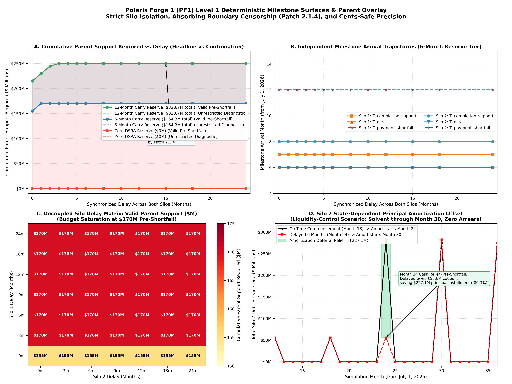

# Polaris Forge 1 (PF1) Level 1 Deterministic Milestone Surfaces & Parent Reconvergence

**Project:** Polaris Forge 1 (Ellendale, ND) — AI Hyperscale Data Center Campus  
**Issuers / Silos:** Silo 1 ($2.350B 9.25% Senior Notes due 2030) & Silo 2 ($1.590B 7.00% Senior Notes due 2031)  
**Parent Sponsor:** Applied Digital Corporation (`APLD`)  
**Engine Version:** Phase 2.1 Level 1 Deterministic Delay Engine (Epistemic Calibration & Precision Release)  
**Git Branch / Commit:** `main`  
**Test & Audit Status:** 25/25 unit tests passing (`src/test_phase2_level1.py`); Full repository consistency certified with 0.00% data drift (`src/validate.py`)  

---

## 1. Executive Summary

This report delivers the certified **Phase 2.1 Level 1 Published Delay-Tolerance Milestone Surfaces** for the Polaris Forge 1 hyperscale campus. Following the implementation of strict structural mechanics across Patches 2.1.1–2.1.4 and sub-cent precision calibration, this documentation release establishes an exact epistemic distinction between contractual facts, structural model mechanics, scenario parameterizations, and scenario illustrations.

```
                    [Polaris Forge 1 Capital & Legal Structure]
                                         │
                 ┌───────────────────────┴───────────────────────┐
                 ▼                                               ▼
     [Silo 1: APLD ComputeCo]                       [Silo 2: APLD ComputeCo 3]
  $2,350M 9.25% Notes (due Dec 2030)             $1,590M 7.00% Notes (due June 2031)
  Annual Coupon Carry: $217.375M/yr              Annual Coupon Carry: $111.300M/yr
  Amort Rule: Dec 15, 2027 (Month 18)            Amort Rule: Post-Commencement (State-Dependent)
  Isolated Waterfall & DSRA                      Isolated Waterfall & DSRA
                 │                                               │
                 └───────────────────────┬───────────────────────┘
                                         ▼
                   [Campus Parent Support: Applied Digital]
                   Nov 20, 2025 & June 16, 2026 Completion Guarantees
                   Valid Pre-Shortfall Accumulation (Censored Post-Shortfall)
```

### Core Analytical Takeaway: Beyond Simple Delay

> [!IMPORTANT]
> **The Synchronization Thesis:**
> The primary economic state variable governing hyperscale project financing is not simply "months of construction delay." It is the precise **synchronization** between physical construction completion, lumpy semiannual debt-service payment dates, reserve runway, commencement-triggered principal amortization, and sponsor completion support.

### Key Certified Findings by Epistemic Status:

1. **Contractual Findings (Primary Disclosed SEC Filings):**
   - **Dual-Silo Ring-Fencing:** Polaris Forge 1 is financed across two legally distinct bankruptcy-remote silos with separate accounts, independent debt-service reserve accounts (DSRAs), and distinct note covenants.
   - **Parent Reconvergence:** Silo 1 (Nov 20, 2025) and Silo 2 (June 16, 2026) indentures each contain independent parent completion guarantees from Applied Digital Corporation that fund remaining construction costs to achieve commercial operations.
   - **State-Dependent Amortization Start Rule:** Silo 1 principal amortization begins on a calendar-fixed date (December 15, 2027 / Month 18). Silo 2 principal amortization begins on the first payment date following final commercial Commencement. Delaying Silo 2 commencement contractually defers the onset of principal amortization.

2. **Structural / Model Findings (Deterministic Accounting Logic):**
   - **Independent Milestone Clocks:** The construction-funding track ($T_{\text{completion\_support}}$) and the debt-service track ($T_{\text{coverage}} \to T_{\text{oper\_exhaustion}} \to T_{\text{DSRA}} \to T_{\text{payment\_shortfall}}$) operate on decoupled clocks. Sponsor completion support is triggered by capex burn depleting construction cash, entirely independent of whether the DSRA has been drawn.
   - **Absorbing Payment-Shortfall Boundary:** Once an individual silo experiences an unfunded debt-service payment shortfall ($T_{\text{payment\_shortfall}}$), it enters an unmodeled post-shortfall regime. The engine strictly censors subsequent modeled construction support for that silo to preserve economic validity, while continuing legitimate construction support in any remaining solvent silo.

3. **Scenario Results (Simulated Parameterized Paths):**
   - **Reserve Runway & Support Accumulation:** Larger reserve cushions extend debt runway, permitting more sponsor completion funding to occur prior to reaching the payment-shortfall boundary ($0.0M under Zero Reserves; $155.0M–$170.0M under 6-Month Reserve; $215.0M–$250.0M under 12-Month Reserve).
   - **Capex Budget Saturation:** Under the published analyst scenario's assumed remaining-capex bounds ($200.0M for Silo 1; $300.0M for Silo 2), parent-support demand saturates at **$250.0M** once those modeled budgets are exhausted. Beyond that point, additional delay does not increase modeled completion support. Within this parameterization, reserve sizing and coupon timing dominate incremental delay after the assumed capex budgets saturate.
   - **Waterfall Priority Arrears Allocation:** Under `opex_first`, operating expenses are paid in full ($0 terminal arrears) while noteholder coupon payments absorb the shortfall. Under `debt_service_first`, the modeled terminal opex balance remains unpaid ($52.0M–$55.0M for Silo 1 and $60.0M for Silo 2), which could threaten operating continuity if unresolved. Milestone arrival timing remains identical across priorities due to semiannual payment date lumpiness.

4. **Scenario Illustration (Contractual Deferral Mechanism):**
   - Under an assumed 7-installment amortization schedule ($1.590B / 7 = $227.14M per semiannual period), delaying Silo 2 commencement by 6 months can reduce a near-term payment-period cash obligation by **-$227.14M (-80.3%)** in Month 24 (owing $55.65M coupon only vs $282.79M debt service on-time). This serves as a quantified scenario illustration of the contractual amortization-deferral mechanism before the amortization staircase engages.

---

## 2. Master Publication Visualizations

The calibrated milestone surfaces are rendered in the four-panel publication graphic below:



*Figure 1: Calibrated Phase 2.1 Level 1 Milestone Surfaces for Polaris Forge 1 across 3 reserve tiers, independent milestone tracks, 2D decoupled delay matrix, and the scenario illustration of principal amortization offset.*

---

## 3. Four Published Surfaces & Numerical Results

### Surface 1: Synchronized Delay Tolerance vs. Reserve Grid (Panel A)

Evaluated across 13 synchronized delay durations ($\Delta t \in [0, 24]$ months) for three reserve tiers:
- **Tier 1 (Zero Reserves):** $R_{0,1} = \$0$, $R_{0,2} = \$0$
- **Tier 2 (6-Month Carry Reserve):** $R_{0,1} = \$108.6875\text{M}$, $R_{0,2} = \$55.65\text{M}$ ($\$164.3375\text{M}$ campus total)
- **Tier 3 (12-Month Carry Reserve):** $R_{0,1} = \$217.375\text{M}$, $R_{0,2} = \$111.30\text{M}$ ($\$328.675\text{M}$ campus total)

| Reserve Tier | Delay ($\Delta t$) | $T_{\text{DSRA}, 1}$ | $T_{\text{DSRA}, 2}$ | $T_{\text{shortfall}, 1}$ | $T_{\text{shortfall}, 2}$ | Headline Parent Support (Pre-Shortfall) | Unrestricted Continuation (Diagnostic) | Censored Post-Shortfall Outlay |
| :--- | :---: | :---: | :---: | :---: | :---: | :---: | :---: | :---: |
| **Zero Reserve** | 0 mo | None | None | 6 | 6 | **$0.0M** | $215.0M | $215.0M |
| **Zero Reserve** | 1 mo | None | None | 6 | 6 | **$0.0M** | $230.0M | $230.0M |
| **Zero Reserve** | 3 mo | None | None | 6 | 6 | **$0.0M** | $250.0M | $250.0M |
| **Zero Reserve** | 6–24 mo | None | None | 6 | 6 | **$0.0M** | $250.0M | $250.0M |
| **6-Month Carry** | 0 mo | 6 | 6 | 12 | 12 | **$155.0M** | $215.0M | $60.0M |
| **6-Month Carry** | 1 mo | 6 | 6 | 12 | 12 | **$170.0M** | $230.0M | $60.0M |
| **6-Month Carry** | 2 mo | 6 | 6 | 12 | 12 | **$170.0M** | $245.0M | $75.0M |
| **6-Month Carry** | 3–24 mo | 6 | 6 | 12 | 12 | **$170.0M** | $250.0M | $80.0M |
| **12-Month Carry** | 0 mo | 6 | 6 | 18 | 18 | **$215.0M** | $215.0M | $0.0M |
| **12-Month Carry** | 1 mo | 6 | 6 | 18 | 18 | **$230.0M** | $230.0M | $0.0M |
| **12-Month Carry** | 2 mo | 6 | 6 | 18 | 18 | **$245.0M** | $245.0M | $0.0M |
| **12-Month Carry** | 3–24 mo | 6 | 6 | 18 | 18 | **$250.0M** | $250.0M | $0.0M |

> [!NOTE]
> **Mechanics of Censorship & Saturation:**
> - Under Zero Reserves, both silos reach the payment-shortfall boundary at Month 6 ($T_{\text{shortfall}} = 6$). Because initial construction cash lasts through Month 6, zero parent completion support is validly required prior to debt shortfall. Unrestricted post-shortfall continuation diagnostics ($215M–$250M) are isolated from headline outputs.
> - Under 12-Month Reserves, both silos reach the payment-shortfall boundary at Month 18. For $\Delta t \ge 3$ months, modeled parent support saturates at $250.0M ($100.0M Silo 1 + $150.0M Silo 2 support caps) prior to Month 18. Changing assumed remaining capex bounds would shift this plateau.

---

### Surface 2: Milestone Arrival Decoupling (Panel B)

Under the 6-Month Reserve Tier, the two operational tracks evolve independently:
- **Track B (Construction):** $T_{\text{completion\_support}}$ triggers at Month 7 for Silo 1 (as initial $100M cash depletes) and Month 8 for Silo 2 (as initial $150M cash depletes).
- **Track A (Debt Service):** $T_{\text{DSRA}}$ triggers at Month 6 (the first semiannual coupon payment date), while $T_{\text{payment\_shortfall}}$ arrives at Month 12 when the reserve balance reaches zero.
- **Track Decoupling:** Completion support timing is dictated solely by capex burn and initial construction cash, entirely decoupled from DSRA draws.

---

### Surface 3: 2D Decoupled Silo Delays ($\Delta t_1 \times \Delta t_2$) (Panel C)

Exploring independent delay combinations ($7 \times 7 = 49$ grid points):
- **When Silo 1 is On Time ($\Delta t_1 = 0$):** Total pre-shortfall campus support is strictly **$155.0M** across all Silo 2 delays ($\Delta t_2 \in [0, 24]$).
- **When Silo 1 is Delayed ($\Delta t_1 \ge 3$):** Total pre-shortfall campus support plateaus at **$170.0M** across all Silo 2 delays.
- **Silo Independence:** Because Silo 2 consumes its pre-shortfall capex budget by Month 12 regardless of additional delay, Silo 1's delay alone drives the step from $155.0M to $170.0M. Zero cross-silo subsidization exists.

---

### Surface 4: State-Dependent Principal Amortization Structural Offset (Panel D)

Evaluated under a pre-shortfall liquidity-control scenario (solvent through Month 30 with zero arrears) comparing on-time (Commencement Month 18) vs 6-month delay (Commencement Month 24):

```
Month 18: On-time commences commercial operations.
Month 24:
  - On-time owes: $55.65M coupon + $227.14M scheduled principal = $282.79M total debt service.
  - Delayed owes: $55.65M coupon + $0.00M scheduled principal = $55.65M total debt service.
  ==> SCENARIO ILLUSTRATION OF NEAR-TERM CASH RELIEF IN MONTH 24: -$227.14M (-80.3%)
Month 30:
  - On-time owes: $47.70M coupon (on reduced $1,362.86M balance) + $227.14M principal = $274.84M.
  - Delayed owes: $55.65M coupon (on full $1,590.00M balance) + $227.14M principal = $282.79M.
```

While the amortization start rule is contractual (first payment date following final commencement), the $227.14M installment represents a scenario parameterization ($1.590B divided across 7 semiannual payments over 3.5 years) as installment amounts are set forth in the unobserved indenture. Under positive amortization scenarios, this demonstrates that delaying commencement incurs ongoing coupon carry, but **defers the massive cash drain of scheduled principal amortization**, providing substantial near-term payment-period liquidity relief before the amortization staircase begins.

---

### Surface 5: Indenture Waterfall Priority Sensitivity & Arrears Allocation

| Waterfall Priority | Delay ($\Delta t$) | $T_{\text{DSRA}, 1}$ | $T_{\text{shortfall}, 1}$ | Max Opex Arrears 1 | Max Int Arrears 1 | Term Opex Arrears 1 | Term Int Arrears 1 | Max Opex Arrears 2 | Max Int Arrears 2 | Term Opex Arrears 2 | Term Int Arrears 2 | Valid Headline Support |
| :--- | :---: | :---: | :---: | :---: | :---: | :---: | :---: | :---: | :---: | :---: | :---: | :---: |
| `opex_first` | 0 mo | 6 | 12 | **$5.0M** | $264.7M | **$0.0M** | $264.7M | **$17.0M** | $166.7M | **$0.0M** | $166.7M | $155.0M |
| `opex_first` | 6 mo | 6 | 12 | **$11.0M** | $356.4M | **$0.0M** | $356.4M | **$23.0M** | $221.7M | **$0.0M** | $221.7M | $170.0M |
| `opex_first` | 12 mo | 6 | 12 | **$17.0M** | $448.0M | **$0.0M** | $448.0M | **$29.0M** | $276.7M | **$0.0M** | $276.7M | $170.0M |
| `debt_service_first` | 0 mo | 6 | 12 | **$52.0M** | $212.7M | **$52.0M** | $212.7M | **$60.0M** | $106.7M | **$60.0M** | $106.7M | $155.0M |
| `debt_service_first` | 6 mo | 6 | 12 | **$55.0M** | $301.4M | **$55.0M** | $301.4M | **$60.0M** | $161.7M | **$60.0M** | $161.7M | $170.0M |
| `debt_service_first` | 12 mo | 6 | 12 | **$55.0M** | $393.0M | **$55.0M** | $393.0M | **$60.0M** | $216.7M | **$60.0M** | $216.7M | $170.0M |

**Priority Finding:**
Under `debt_service_first`, the modeled terminal opex balance remains unpaid ($52.0M–$55.0M for Silo 1 and $60.0M for Silo 2), diverting operational cash flow to senior debt service, which could threaten operating continuity if unresolved. Under `opex_first`, operating expenses are paid in full ($0 terminal arrears), while noteholder interest absorbs the shortfall.

---

## 4. Methodological Invariant Ledger (21 Certified Invariants)

All 21 invariants are verified across 25 unit tests (`src/test_phase2_level1.py`) and certified against data drift (`src/validate.py`):

| # | Invariant Description | Verification Mechanism | Status |
| :---: | :--- | :--- | :---: |
| 1 | **Strict Silo Isolation** | Cross-silo perturbation test (Case A vs Case B) | **CERTIFIED** |
| 2 | **Exact Fixed Coupon Arithmetic** | Accrual $= P \times r / 12$; Semiannual $= P \times r / 2$ | **CERTIFIED** |
| 3 | **Silo 1 Amortization Boundary** | Amortization strictly zero prior to Month 18 (Dec 15, 2027) | **CERTIFIED** |
| 4 | **Silo 2 State-Dependent Amort** | Start date defers dynamically with commencement | **CERTIFIED** |
| 5 | **Construction Support Isolation** | Completion support funds capex shortfalls only, never debt | **CERTIFIED** |
| 6 | **DSRA Restriction** | DSRA funds debt service only, never capex | **CERTIFIED** |
| 7 | **Independent Milestone Tracks** | $T_{\text{completion\_support}}$ triggers independently of $T_{\text{DSRA}}$ | **CERTIFIED** |
| 8 | **Non-Monotonic Amort Offset** | Delay defers scheduled principal, reducing near-term cash drain | **CERTIFIED** |
| 9 | **Parent Summation Post-Waterfall** | Total support calculated strictly post-waterfall | **CERTIFIED** |
| 10 | **Paid-Only Principal Reduction** | Balance decreases strictly by cash actually paid towards principal | **CERTIFIED** |
| 11 | **Complete Arrears Accounting** | Unpaid opex/coupon/amort recorded and cured by future cash | **CERTIFIED** |
| 12 | **Absorbing Shortfall Boundary** | Silo marked `POST_SHORTFALL_ABSORBED` upon debt payment shortfall | **CERTIFIED** |
| 13 | **Cash Coverage Definition** | $T_{\text{coverage}}$ compares tenant cash rent against cash obligations | **CERTIFIED** |
| 14 | **Exhaustion as Transition** | Initial zero balance is not exhaustion; positive to zero transition required | **CERTIFIED** |
| 15 | **Explicit Waterfall Priority** | Different arrears allocation under `opex_first` vs `debt_service_first` | **CERTIFIED** |
| 16 | **Dynamic Calendar Mapping** | Normalized month-start dates derive calendar indexes dynamically | **CERTIFIED** |
| 17 | **Final Maturity Bullet Balloon** | Remaining principal balloons at final maturity (Months 54 & 60) | **CERTIFIED** |
| 18 | **Bounded Capex Total** | Remaining capex budget strictly caps cumulative construction outlays | **CERTIFIED** |
| 19 | **Zero Silent Priors in Surface API** | Every unobserved parameter must be explicitly passed by caller | **CERTIFIED** |
| 20 | **Absorbing Shortfall Censorship** | Valid headline support ceases accumulating at $T_{\text{payment\_shortfall}}$ | **CERTIFIED** |
| 21 | **Cents-Safe Precision & Residual Elimination** | Exact coupon reserves pay without premature floating-point shortfall | **CERTIFIED** |

---

## 5. Artifact & Code Index

- **Deterministic Engine:** [`src/phase2_level1_engine.py`](../src/phase2_level1_engine.py)
- **Unit Test Suite (25 Tests):** [`src/test_phase2_level1.py`](../src/test_phase2_level1.py)
- **Surface Generation Pipeline:** [`src/analyze_phase2_surfaces.py`](../src/analyze_phase2_surfaces.py)
- **Master Published Figure:** [`outputs/figures/phase2_delay_tolerance_surfaces.png`](../outputs/figures/phase2_delay_tolerance_surfaces.png)
- **Published Data Tables:**
  - Synchronized Delay Surface: [`outputs/tables/phase2_delay_tolerance_surface_synchronized.csv`](../outputs/tables/phase2_delay_tolerance_surface_synchronized.csv)
  - Decoupled Delay Matrix: [`outputs/tables/phase2_delay_tolerance_surface_decoupled.csv`](../outputs/tables/phase2_delay_tolerance_surface_decoupled.csv)
  - Priority Sensitivity & Arrears: [`outputs/tables/phase2_waterfall_priority_sensitivity.csv`](../outputs/tables/phase2_waterfall_priority_sensitivity.csv)
- **Architecture Specification:** [`docs/phase2_architecture_spec.md`](phase2_architecture_spec.md)
