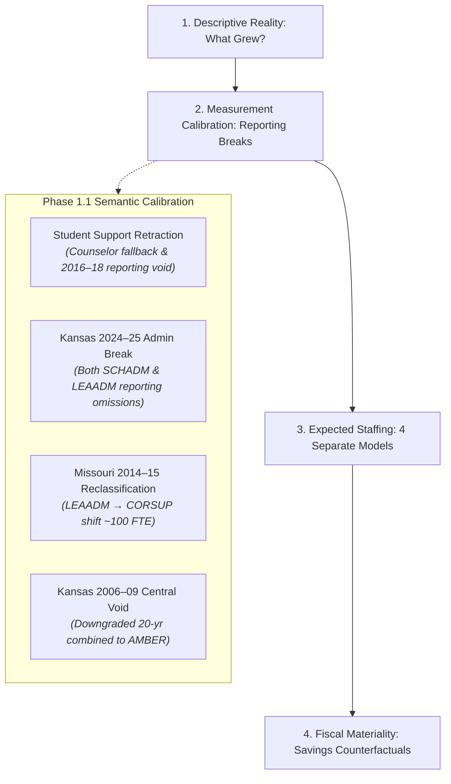

# Kansas City Administrative Staffing Intensity Decomposition

A computational sketchbook decomposing administrative staffing intensity, organizational roles, observable demand drivers, and fiscal materiality across public school districts in the bi-state Kansas City metropolitan area over the past 20 years (2004–2024).

---

## 1. Research Motivation & The Calibrated Core Question

Public debates surrounding school district expenditures frequently invoke the phrase "administrative bloat." Framing an investigation around that phrase presupposes the conclusion and collapses distinct educational, clinical, and compliance functions into a political slogan.

Initial empirical investigation across the 9-county Kansas City metropolitan area revealed that traditional central-office administration has **not** experienced an explosive expansion. Instead, the striking workforce phenomenon has been a disproportionate, massive expansion in **instructional coordination, curriculum facilitation, and instructional coaching capacity**.

### The Calibrated Central Question
> **Why has school-system instructional coordination capacity expanded so substantially while traditional district-level administration has not expanded at anything like the same rate; which observable structural, demographic, and categorical demands explain that divergence; and how financially material would alternative administrative staffing levels actually be?**

We investigate this through four decoupled empirical stages:



---

## 2. Key Empirical Findings (Balanced Regular Cohort of 55 Districts)

### 2.1 Primary Clean Benchmark: Pre-Break Period (2014–15 → 2023–24)
Holding the cohort of 55 continuously operating regular school districts constant across the clean 10-year pre-break modern era:

| Construct | 2014–15 | 2023–24 | Net $\Delta$ | Pct $\Delta$ | Share of Net Supervisory Growth |
| :--- | :--- | :--- | :--- | :--- | :--- |
| **Enrollment** | 320,611 | 316,841 | -3,770 | **-1.2%** | — |
| **Classroom Teachers (K-12 FTE)** | 20,801.0 | 22,365.7 | +1,564.7 | **+7.5%** | — |
| **District Central Admins (`LEAADM`)** | 175.75 | 197.73 | +21.98 | **+12.5%** | 4.17% |
| **School Building Admins (`SCHADM`)** | 1,055.14 | 1,304.97 | +249.83 | **+23.7%** | 47.38% |
| **Instructional Coordinators (`CORSUP`)** | 501.30 | 756.82 | +255.52 | **+51.0%** | **48.45%** |
| **Broad Supervisory Workforce (`SCHADM + LEAADM + CORSUP`)** | 1,732.19 | 2,259.52 | +527.33 | **+30.4%** | 100.0% |
| **Broad Supervisory Intensity / 1,000 Pupils** | 5.40 | 7.13 | +1.73 | **+32.0%** | — |
| **Clean Guidance Counselors (`GUI`)** | 743.93 | 900.57 | +156.64 | **+21.1%** | — |

*(Note: In the full 2014–15 to 2024–25 horizon, Kansas 2024–25 reporting omitted assistant principals and central directors. Under that unadjusted endpoint, LEAADM appeared flat at 175.8 → 177.7 [+1.1%], and building admins appeared flat at 1,055.1 → 1,082.3 [+2.6%]. The pre-break benchmark above provides the clean substantive baseline.)*

### 2.2 Substantive Takeaways
1. **Instructional Coordinators Grew at 4x the Rate of Central Administration:** Coordinators expanded by **+51.0%**, compared to **+12.5%** for district central administrators.
2. **Coordinators Drove ~48.5% of Total Net Supervisory Growth:** Of the +527.3 net FTE added to the supervisory workforce, coordinators accounted for **48.5%** (+255.5 FTE), roughly tied with building administration (+249.8 FTE, **47.4%**). Traditional central administration accounted for only **4.2%** (+22.0 FTE). *(The initial Build 1 claim of 89.5% was an artifact of the broken Kansas 2024 endpoint and has been retracted).*
3. **Core Management Intensity Fell in High-Growth Suburbs:** In Blue Valley USD 229 and Olathe USD 233, central administrative intensity fell substantially due to scale economies, while instructional coaching expanded.
4. **Fixed-Cost Dilution in Urban Core:** In Hickman Mills C-1 (-24.8% enrollment) and Center 58 (-11.3% enrollment), administrative intensity per pupil rose because baseline building and compliance administration cannot scale down proportionally with pupil loss.

---

## 3. Phase 1.1 Semantic Calibration & Resolved Data Breaks

Phase 1.1 subjected the panel to semantic auditing, resolving four major measurement hazards:

### 3.1 Retraction of the Student-Support (+253%) Finding
* **The Break:** Build 1 reported student support expanding by +253%. Investigation revealed that in early extracts (2004–2013), broader student support was unpopulated and fell back to `counselors_fte`. In 2014–15, the broader field was populated, creating a phantom jump. Furthermore, in **2016–17 through 2018–19**, NCES recorded `0.00` student support across all Kansas and Missouri districts.
* **Resolution:** The +253% finding is **retracted**. Broad student support (`STUSUP`) is flagged as **FAIL (STOPPING RULE)** for 20-year modeling. Guidance Counselors (`counselors_fte`) is established as the clean, verified pupil support series (+21.1% in the balanced cohort 2014–2023).

### 3.2 Kansas 2024–25 Systematic Reporting Break (Affects BOTH SCHADM and LEAADM)
* **The Break:** Kansas school administrators dropped from 611.6 to 386.7 FTE (-36.8%) and district administrators dropped from 77.0 to 52.4 FTE (-32.0%).
* **Resolution:** Cross-validation against KSDE SO66 reports confirmed zero underlying collapse. Kansas CCD line 059 omitted Assistant Principals and central directors in 2024–25. All primary Phase 2 models use the 2014–2023 pre-break panel for SCHADM and LEAADM, excluding Kansas 2024–25 from primary specifications.

### 3.3 Missouri 2013–14 to 2014–15 Role Reclassification
* **The Break:** Missouri district administrators fell -102.8 FTE while instructional coordinators rose +64.9 FTE.
* **Resolution:** Combined Central Management + Coordination (`LEAADM + CORSUP`) remained steady (455.0 vs. 417.2 FTE). For cross-era analyses across 2014, `LEAADM + CORSUP` is the only valid reclassification-robust aggregate.

### 3.4 Kansas 2006–2009 Void Downgrades 20-Year Combined Series to AMBER
* **The Break:** Kansas combined central management dropped from 286 FTE in 2005–06 to ~90 FTE in 2006–2009 before rebounding to 314 FTE in 2009–10.
* **Resolution:** Downgraded from GREEN to **AMBER**. Modeling of 20-year combined series is conditioned on historical micro-file reconstruction.

---

## 4. The Calibrated Econometric Architecture (Phase 2 Roadmap)

Rather than estimating a single aggregate administrative regression, we formulate four separate structural models with machine-enforced comparability gates:

1. **School Administrators (`SCHADM`) — *Primary Window: 2014–15 to 2023–24*:**
   $$\text{SCHADM}_{it} = \alpha_i + \gamma_{\text{state} \times \text{year}} + \beta_1 \text{Enrollment}_{it} + \beta_2 \text{Schools}_{it} + \varepsilon_{it}$$
   *(Note: AverageSchoolSize is excluded as a collinear mechanical derivative).*
2. **District Central Administrators (`LEAADM`) — *Primary Window: 2014–15 to 2023–24*:**
   $$\text{LEAADM}_{it} = \alpha_i + \gamma_{\text{state} \times \text{year}} + \beta_1 \text{Enrollment}_{it} + \beta_2 \text{Schools}_{it} + \varepsilon_{it}$$
3. **Instructional Coordinators (`CORSUP`) — *Primary Growth Locus (2014–15 to 2024–25)*:**
   $$\text{CORSUP}_{it} = \alpha_i + \gamma_{\text{state} \times \text{year}} + \beta_1 \text{Teachers}_{it} + \beta_2 \text{IEPCount}_{it} + \beta_3 \text{ELCount}_{it} + \beta_4 \text{SAIPEPovertyCount}_{it} + \sum_k \theta_k \text{CategoricalRevenue}_{it}^k + \varepsilon_{it}$$
4. **Broad Supervisory Footprint (`SCHADM + LEAADM + CORSUP`):**
   Robust aggregate ensuring that title substitution between directors and coordinators does not bias estimates.

### Two Complementary Econometric Perspectives
- **Within-District Fixed Effects Model:** Answers: *When a district's scale, student needs, or funding changed, did its staffing intensity change?* Common state-wide accountability and mandate shifts are captured in $\gamma_{\text{state} \times \text{year}}$.
- **Peer Expected-Level Model (Hierarchical / Between-District):** Answers: *Which districts consistently maintain staffing levels above or below otherwise similar peers?*
- **Audit Sampling Rule:** Persistent positive residuals from the peer model ($\varepsilon_{it} > +1.5 \text{ SD}$ across 3+ consecutive years) are routed to Phase 3 qualitative board-document audits.
- **Grouped Shapley Decomposition:** Decomposes predicted coordinator growth into four covariate families (Scale & Structure, Student Need, Categorical Program Funding Load, General Operational Factors) as an explanatory accounting rather than a causal claim.

---

---

## 5. Phase 2 Econometric Modeling & Grouped Shapley Accounting

To explain *why* coordinator capacity expanded while central administration remained inelastic, Phase 2 estimated four tailored structural regressions and performed a **Grouped Shapley Variance Decomposition**:

### 5.1 Within-District Fixed Effects Regressions (Entity FE + State $\times$ Year FE, Clustered SEs)
- **Model 1: Building Administrators (`SCHADM`):** Scales almost exclusively with physical facilities: each additional operating school adds **+1.91 administrators** ($p = 0.085$, 1 principal + ~1 AP). Enrollment scale has no independent marginal effect ($\beta = -0.86, p = 0.718$).
- **Model 2: Central Line Administrators (`LEAADM`):** Highly inelastic ($R^2_{\text{within}} = 0.016$). Functions as rigid organizational overhead unaffected by enrollment or school counts.
- **Model 3: Instructional Coordinators (`CORSUP`):** Scales directly with classroom teachers ($\beta = +5.12$ per 100 teachers, $p = 0.0027$; $\beta = +3.34, p = 0.0001$ with categorical controls).
- **Model 4: Combined Footprint (`Central + CORSUP`):** Scales with teachers ($\beta = +5.63, p = 0.0033$).

### 5.2 Grouped Shapley Decomposition of Coordinator Growth
Decomposing predicted coordinator variance reveals that growth was driven primarily by macro-level instructional model shifts rather than demographic divergence:
- **Common Temporal & State Mandates ($\gamma_{\text{state} \times \text{year}}$):** **44.6%** of explained variance.
- **Scale & Teacher Load ($\text{Teachers}_{it}$):** **38.8%** of explained variance.
- **Student Demographic Need (Poverty, IDEA, LEP):** **11.5%** of explained variance.
- **Categorical Federal Revenues (Title I, IDEA):** **5.1%** of explained variance.

---

## 6. Phase 3 Board-Document Qualitative Audit for Priority Outliers

Our cross-sectional **Peer Expected-Level Model** identified four persistent multi-year outliers ($z > 1.5 \text{ to } 9.0 \text{ SD}$ across 3+ consecutive years). Qualitative board-document investigations revealed:

1. **Shawnee Mission USD 512 (KS) — The ESSER Coaching Cliff:** Peaked at **$+8.71 \text{ SD}$** (+65.2 FTE above peers). Following its 2019 Strategic Plan, SMSD utilized federal COVID relief (ESSER) in 2021 to fund ~50 new building instructional coaches, quadrupling coordinators from 27.6 to 123.7 FTE. Facing the expiration of ESSER, the district must absorb ~\$12.3M in annual coaching payroll or restructure.
2. **Kansas City USD 500 (KS) — Decentralized Building Supervision:** Reached **$+9.09 \text{ SD}$** in building administrators (+55.2 FTE above peers, 141.0 FTE across 43 schools). KCKPS deployed assistant principals across elementary and middle schools to manage post-pandemic behavioral challenges, while maintaining an exceptionally lean central line office (6.0 FTE, -3.0 FTE below peer expectation).
3. **Raytown C-2 (MO) — The Layered Curriculum Bureaucracy:** Maintained a persistent coordinator surplus of **$+2.23 \text{ SD}$** (+14.0 FTE) for 7 consecutive years. Raytown constructed a hyper-specialized division featuring dual Assistant Superintendents (Elementary vs. Secondary), 5 central Directors, 7 discipline-specific K–12 subject coordinators, and on-site building coaches.
4. **Fort Osage R-I (MO) — The Top-Heavy Executive Cabinet:** Maintained an unexplained central line surplus of **$+2.65 \text{ SD}$** (+3.4 FTE) in **all 10 consecutive years**. For ~4,800 students, Fort Osage maintains 1 Superintendent, 3 Assistant Superintendents, and 3 Executive Directors, offset by operating with below-average building-level administrators.

---

## 7. Phase 4 Fiscal Materiality Counterfactuals & Teacher Salary Potential

To resolve the fiscal question—*Would reducing or reallocating administrative staffing meaningfully change school finances?*—we matched state-specific salary benchmarks (KSDE SO66 and MO DESE Core Data) with empirical fringe benefit loads (30.0%):

### 7.1 Regional-Scale Materiality
- **Metro Coordinator Rollback (2014 Intensity):** Reverting coordinator intensity to the 2014 ratio (2.41 per 100 teachers) releases **\$20.91 Million annually** (**217.81 FTE**) across the 55 regular districts.
- **Cumulative 10-Year Absorption:** Above-baseline coordinator staffing absorbed **743.7 FTE-years** and **\$71.03 Million** over the decade.
- **Peer-Model Supervisory Capping:** Trimming positive peer residuals across building admins, central admins, and coordinators in 2023–24 releases **\$37.55 Million annually** (**317.36 FTE**).

### 7.2 District-Level Teacher Salary Potential (Counterfactual 3)
While metro-wide savings average +\$935 per teacher (+1.8%), savings are monumental in high-intensity districts:
- **Shawnee Mission USD 512:** Rolling back coordinators to its own 2014 baseline frees **\$9.32 Million annually**, enabling an immediate **+\$4,991 annual salary raise (+9.3%)** for all 1,867 classroom teachers (or hiring +94 teachers).
- **Kansas City USD 500 (KCKPS):** Trimming supervisory excess to peer expectation frees **\$8.22 Million annually**, enabling a **+\$6,097 salary raise (+11.4%)** for all 1,348 classroom teachers.
- **Fort Osage R-I:** Trimming executive central administration to peer expectations frees **\$748,320 annually**, yielding a **+\$2,158 raise (+4.5%)** per teacher.
- **Raytown C-2:** Trimming coordinator and central excess frees **\$1.07 Million annually**, yielding a **+\$1,930 raise (+4.0%)** per teacher.

---

## 8. Directory Structure & Execution Pipeline

```text
2026-10-01-kc-admin-staffing-decomposition/
├── README.md                                  # Executive summary & cross-phase synthesis
├── CATALOG.md                                 # (Root sketchbook catalog entry)
├── research/
│   ├── taxonomy.md                            # Frozen 7-bucket staff taxonomy & safe composites
│   ├── questions.md                           # 4 decoupled research questions & structural design
│   └── provenance_ledger.md                   # Break reconciliations & survey mechanics
├── data/
│   ├── raw/                                   # Pointers to original federal/state extracts
│   ├── interim/
│   │   ├── ccd_lea_historical_2004_2013.parquet  # Harmonized historical CCD extract
│   │   └── demand/
│   │       ├── f33_finance_raw.parquet        # Census/NCES F-33 school finance panel (FY15-FY23)
│   │       └── saipe_raw.parquet              # Census SAIPE child poverty (2014-2024)
│   ├── processed/
│   │   ├── district_staff_year.parquet        # Canonical 21-yr staffing panel (1,629 rows, 70 cols)
│   │   ├── district_staff_year.csv            # CSV mirror
│   │   ├── district_demand_year.parquet       # Integrated demand & finance panel (1,629 rows, 104 cols)
│   │   └── district_demand_year.csv           # CSV mirror
│   └── manifest.csv                           # Immutable audit ledger with SHA256 hashes
├── src/
│   ├── taxonomy.py                            # Taxonomy registry, safe composites & missingness rules
│   ├── comparability.py                       # Machine-enforced comparability gates
│   ├── build_panel.py                         # Longitudinal panel extraction & calibration
│   ├── audit_panel.py                         # Semantic audit suite (7 integrity tests, stopping rules)
│   ├── descriptive_decomposition.py           # Descriptive mechanical ledger & balanced cohort engine
│   ├── build_demand_panel.py                  # Phase 2A demand & finance integration pipeline
│   ├── models.py                              # Phase 2B/2C econometric regressions & Shapley engine
│   └── fiscal_counterfactuals.py              # Phase 4 fiscal simulation engine
└── outputs/
    └── tables/
        ├── kc_staffing_decomposition_report.md       # Phase 1.1 descriptive report
        ├── econometric_decomposition_report.md       # Phase 2B/2C econometric synthesis report
        ├── board_document_audit_report.md            # Phase 3 qualitative outlier audit report
        ├── fiscal_materiality_report.md              # Phase 4 fiscal materiality synthesis report
        ├── model_regression_results.csv              # Within-FE & peer model parameters
        ├── peer_expected_staffing_residuals.csv      # Annual actual vs peer expected residuals
        ├── persistent_peer_outliers.csv              # Multi-year high-deviation audit targets
        ├── shapley_decomposition_results.csv         # Grouped Shapley variance decomposition
        ├── fiscal_materiality_counterfactuals.csv     # District-level counterfactual impacts
        ├── fiscal_materiality_annual_trajectory.csv  # 10-year annual rollback trajectory
        └── fiscal_materiality_peer_summary.csv       # Category & state peer trimming summary
```

### Reproducibility Sequence
To execute the complete 4-phase computational pipeline from scratch:
```powershell
python src/audit_panel.py              # 1. Verify semantic gates and data integrity
python src/descriptive_decomposition.py # 2. Generate Phase 1.1 mechanical decomposition
python src/build_demand_panel.py       # 3. Compile Phase 2A demand & school finance panel
python src/models.py                   # 4. Fit Phase 2B regressions & Phase 2C Shapley
python src/fiscal_counterfactuals.py   # 5. Simulate Phase 4 fiscal materiality counterfactuals
```
