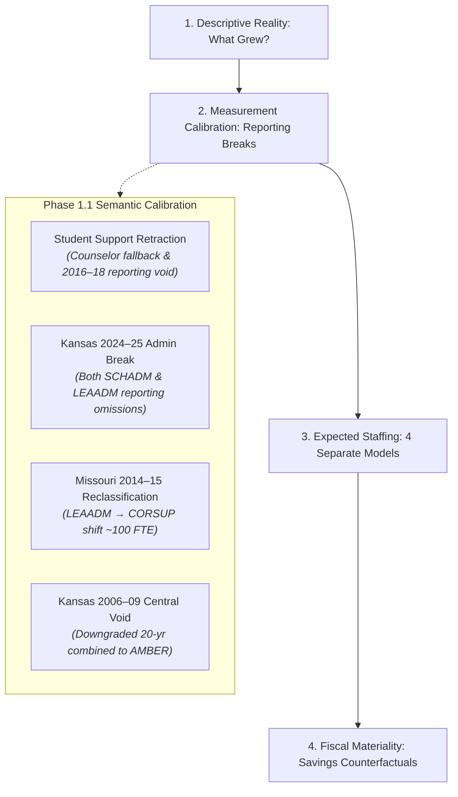

# Kansas City Administrative Staffing Intensity Decomposition

A computational sketchbook decomposing administrative staffing intensity, organizational roles, observable demand drivers, and fiscal materiality across public school districts in the bi-state Kansas City metropolitan area over the past 20 years (2004–2024).

---

## 1. Research Motivation & The Calibrated Core Question

Public debates surrounding school district expenditures frequently invoke the phrase "administrative bloat." Framing an investigation around that phrase presupposes the conclusion and collapses distinct educational, clinical, and compliance functions into a political slogan.

Initial empirical investigation across the 9-county Kansas City metropolitan area revealed that traditional central-office administration has **not** experienced an explosive expansion. Instead, the striking workforce phenomenon has been a disproportionate, massive expansion in **instructional coordination, curriculum facilitation, and instructional coaching capacity**.

### The Calibrated Central Question
> **Why has school-system instructional coordination capacity expanded so substantially while traditional district-level administration has not expanded at anything like the same rate; which observable structural, demographic, and categorical demands explain that divergence; and how financially material would alternative administrative staffing levels actually be?**

We investigate this through four decoupled empirical stages:



---

## 2. Key Empirical Findings (Balanced Regular Cohort of 55 Districts)

### 2.1 Primary Clean Benchmark: Pre-Break Period (2014–15 → 2023–24)
Holding the cohort of 55 continuously operating regular school districts constant across the clean 10-year pre-break modern era:

| Construct | 2014–15 | 2023–24 | Net $\Delta$ | Pct $\Delta$ | Share of Net Supervisory Growth |
| :--- | :--- | :--- | :--- | :--- | :--- |
| **Enrollment** | 320,611 | 316,841 | -3,770 | **-1.2%** | — |
| **Classroom Teachers (K-12 FTE)** | 20,801.0 | 22,365.7 | +1,564.7 | **+7.5%** | — |
| **District Central Admins (`LEAADM`)** | 175.75 | 197.73 | +21.98 | **+12.5%** | 4.17% |
| **School Building Admins (`SCHADM`)** | 1,055.14 | 1,304.97 | +249.83 | **+23.7%** | 47.38% |
| **Instructional Coordinators (`CORSUP`)** | 501.30 | 756.82 | +255.52 | **+51.0%** | **48.45%** |
| **Broad Supervisory Workforce (`SCHADM + LEAADM + CORSUP`)** | 1,732.19 | 2,259.52 | +527.33 | **+30.4%** | 100.0% |
| **Broad Supervisory Intensity / 1,000 Pupils** | 5.40 | 7.13 | +1.73 | **+32.0%** | — |
| **Clean Guidance Counselors (`GUI`)** | 743.93 | 900.57 | +156.64 | **+21.1%** | — |

*(Note: In the full 2014–15 to 2024–25 horizon, Kansas 2024–25 reporting omitted assistant principals and central directors. Under that unadjusted endpoint, LEAADM appeared flat at 175.8 → 177.7 [+1.1%], and building admins appeared flat at 1,055.1 → 1,082.3 [+2.6%]. The pre-break benchmark above provides the clean substantive baseline.)*

### 2.2 Substantive Takeaways
1. **Instructional Coordinators Grew at 4x the Rate of Central Administration:** Coordinators expanded by **+51.0%**, compared to **+12.5%** for district central administrators.
2. **Coordinators Drove ~48.5% of Total Net Supervisory Growth:** Of the +527.3 net FTE added to the supervisory workforce, coordinators accounted for **48.5%** (+255.5 FTE), roughly tied with building administration (+249.8 FTE, **47.4%**). Traditional central administration accounted for only **4.2%** (+22.0 FTE). *(The initial Build 1 claim of 89.5% was an artifact of the broken Kansas 2024 endpoint and has been retracted).*
3. **Core Management Intensity Fell in High-Growth Suburbs:** In Blue Valley USD 229 and Olathe USD 233, central administrative intensity fell substantially due to scale economies, while instructional coaching expanded.
4. **Fixed-Cost Dilution in Urban Core:** In Hickman Mills C-1 (-24.8% enrollment) and Center 58 (-11.3% enrollment), administrative intensity per pupil rose because baseline building and compliance administration cannot scale down proportionally with pupil loss.

---

## 3. Phase 1.1 Semantic Calibration & Resolved Data Breaks

Phase 1.1 subjected the panel to semantic auditing, resolving four major measurement hazards:

### 3.1 Retraction of the Student-Support (+253%) Finding
* **The Break:** Build 1 reported student support expanding by +253%. Investigation revealed that in early extracts (2004–2013), broader student support was unpopulated and fell back to `counselors_fte`. In 2014–15, the broader field was populated, creating a phantom jump. Furthermore, in **2016–17 through 2018–19**, NCES recorded `0.00` student support across all Kansas and Missouri districts.
* **Resolution:** The +253% finding is **retracted**. Broad student support (`STUSUP`) is flagged as **FAIL (STOPPING RULE)** for 20-year modeling. Guidance Counselors (`counselors_fte`) is established as the clean, verified pupil support series (+21.1% in the balanced cohort 2014–2023).

### 3.2 Kansas 2024–25 Systematic Reporting Break (Affects BOTH SCHADM and LEAADM)
* **The Break:** Kansas school administrators dropped from 611.6 to 386.7 FTE (-36.8%) and district administrators dropped from 77.0 to 52.4 FTE (-32.0%).
* **Resolution:** Cross-validation against KSDE SO66 reports confirmed zero underlying collapse. Kansas CCD line 059 omitted Assistant Principals and central directors in 2024–25. All primary Phase 2 models use the 2014–2023 pre-break panel for SCHADM and LEAADM, excluding Kansas 2024–25 from primary specifications.

### 3.3 Missouri 2013–14 to 2014–15 Role Reclassification
* **The Break:** Missouri district administrators fell -102.8 FTE while instructional coordinators rose +64.9 FTE.
* **Resolution:** Combined Central Management + Coordination (`LEAADM + CORSUP`) remained steady (455.0 vs. 417.2 FTE). For cross-era analyses across 2014, `LEAADM + CORSUP` is the only valid reclassification-robust aggregate.

### 3.4 Kansas 2006–2009 Void Downgrades 20-Year Combined Series to AMBER
* **The Break:** Kansas combined central management dropped from 286 FTE in 2005–06 to ~90 FTE in 2006–2009 before rebounding to 314 FTE in 2009–10.
* **Resolution:** Downgraded from GREEN to **AMBER**. Modeling of 20-year combined series is conditioned on historical micro-file reconstruction.

---

## 4. The Calibrated Econometric Architecture (Phase 2 Roadmap)

Rather than estimating a single aggregate administrative regression, we formulate four separate structural models with machine-enforced comparability gates:

1. **School Administrators (`SCHADM`) — *Primary Window: 2014–15 to 2023–24*:**
   $$\text{SCHADM}_{it} = \alpha_i + \gamma_{\text{state} \times \text{year}} + \beta_1 \text{Enrollment}_{it} + \beta_2 \text{Schools}_{it} + \varepsilon_{it}$$
   *(Note: AverageSchoolSize is excluded as a collinear mechanical derivative).*
2. **District Central Administrators (`LEAADM`) — *Primary Window: 2014–15 to 2023–24*:**
   $$\text{LEAADM}_{it} = \alpha_i + \gamma_{\text{state} \times \text{year}} + \beta_1 \text{Enrollment}_{it} + \beta_2 \text{Schools}_{it} + \varepsilon_{it}$$
3. **Instructional Coordinators (`CORSUP`) — *Primary Growth Locus (2014–15 to 2024–25)*:**
   $$\text{CORSUP}_{it} = \alpha_i + \gamma_{\text{state} \times \text{year}} + \beta_1 \text{Teachers}_{it} + \beta_2 \text{IEPCount}_{it} + \beta_3 \text{ELCount}_{it} + \beta_4 \text{SAIPEPovertyCount}_{it} + \sum_k \theta_k \text{CategoricalRevenue}_{it}^k + \varepsilon_{it}$$
4. **Broad Supervisory Footprint (`SCHADM + LEAADM + CORSUP`):**
   Robust aggregate ensuring that title substitution between directors and coordinators does not bias estimates.

### Two Complementary Econometric Perspectives
- **Within-District Fixed Effects Model:** Answers: *When a district's scale, student needs, or funding changed, did its staffing intensity change?* Common state-wide accountability and mandate shifts are captured in $\gamma_{\text{state} \times \text{year}}$.
- **Peer Expected-Level Model (Hierarchical / Between-District):** Answers: *Which districts consistently maintain staffing levels above or below otherwise similar peers?*
- **Audit Sampling Rule:** Persistent positive residuals from the peer model ($\varepsilon_{it} > +1.5 \text{ SD}$ across 3+ consecutive years) are routed to Phase 3 qualitative board-document audits.
- **Grouped Shapley Decomposition:** Decomposes predicted coordinator growth into four covariate families (Scale & Structure, Student Need, Categorical Program Funding Load, General Operational Factors) as an explanatory accounting rather than a causal claim.

---

## 5. Directory Structure

```text
2026-10-01-kc-admin-staffing-decomposition/
├── README.md                                  # Research overview, calibration findings & roadmap
├── CATALOG.md                                 # (Root catalog updated)
├── research/
│   ├── taxonomy.md                            # Frozen 7-bucket staff taxonomy & safe composites
│   ├── questions.md                           # The 4 decoupled research questions & 4-model design
│   └── provenance_ledger.md                   # Detailed break reconciliations & survey mechanics
├── data/
│   ├── raw/                                   # Pointers to original federal and state extracts
│   ├── interim/
│   │   └── ccd_lea_historical_2004_2013.parquet  # Harmonized historical CCD extract
│   ├── processed/
│   │   ├── district_staff_year.csv            # Canonical 21-year panel (1,629 rows, 70 cols)
│   │   ├── district_staff_year.parquet        # High-performance Parquet format
│   │   └── district_demand_year.parquet       # (Phase 2A Demand & Finance Panel)
│   └── manifest.csv                           # Audit ledger with SHA256 hashes and row counts
├── src/
│   ├── taxonomy.py                            # Taxonomy registry, safe composites & missingness rules
│   ├── comparability.py                       # Machine-enforced longitudinal comparability registry & gate
│   ├── build_panel.py                         # Longitudinal panel extraction & calibration pipeline
│   ├── audit_panel.py                         # Semantic audit suite (7 integrity tests, stopping rules)
│   ├── descriptive_decomposition.py           # Calibrated mechanical ledger & balanced cohort engine
│   ├── build_demand_panel.py                  # (Phase 2A) EDFacts, SAIPE & F-33 demand panel builder
│   └── models.py                              # (Phase 2B) Tailored regressions & Shapley decomposition
└── outputs/
    └── tables/
        ├── kc_staffing_decomposition_report.md       # Comprehensive calibrated synthesis report
        ├── kc_balanced_cohort_decomposition.csv      # 55-district balanced cohort benchmark
        ├── kc_dynamic_universe_decomposition.csv      # Dynamic universe totals (including charters)
        ├── kc_balanced_state_10yr_decomposition.csv  # 10-year state-level shifts
        ├── kc_balanced_state_prebreak_decomposition.csv # Pre-KS break benchmark (2014–2023)
        ├── kc_major_districts_2014_2023_decomposition.csv # Major district pre-break mechanical ledger
        ├── kc_major_districts_2014_2024_decomposition.csv # Major district 10-year mechanical ledger
        └── multi_denominator_comparison.csv          # Multi-denominator panel metrics
```

---

## 6. Implementation Sequence

1. **Phase 1.1 — Semantic Calibration:** COMPLETED. (Resolved student-support break, Kansas SCHADM/LEAADM break, Missouri reclassification, Kansas 2006–09 void, established machine-enforced comparability gate).
2. **Phase 2A — Demand Panel (`district_demand_year.parquet`):** Ingest EDFacts IDEA (FS002) / EL (FS141), Census SAIPE child poverty, and Census F-33 categorical revenues.
3. **Phase 2B — Expected Staffing Models:** Estimate the 4 tailored panel regressions with district FE + state $\times$ year FE and clustered SEs, alongside the peer expected-level model.
4. **Phase 2C — Grouped Shapley Decomposition:** Decompose model-predicted coordinator and administrative change into covariate families.
5. **Phase 3 — Board Document Residual Audit:** Sample persistent multi-year residual outliers from the peer model for qualitative board-document investigation.
6. **Phase 4 — Fiscal Materiality Counterfactuals:** Simulate alternative staffing regimes using matched salary distributions.
