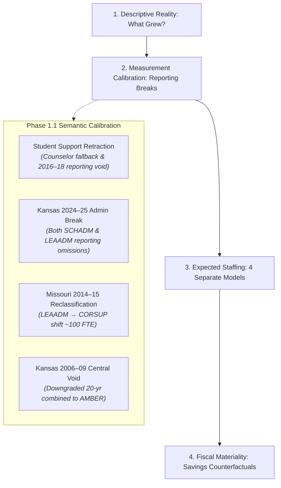

# Kansas City Administrative Staffing Intensity Decomposition

A computational sketchbook decomposing administrative staffing intensity, organizational roles, observable demand drivers, and fiscal materiality across public school districts in the bi-state Kansas City metropolitan area over the past 20 years (2004–2024).

---

## 1. Research Motivation & The Calibrated Core Question

Public debates surrounding school district expenditures frequently invoke the phrase "administrative bloat." Framing an investigation around that phrase presupposes the conclusion and collapses distinct educational, clinical, and compliance functions into a political slogan.

Initial empirical investigation across the 9-county Kansas City metropolitan area revealed that traditional central-office administration has **not** experienced an explosive expansion. Instead, the striking workforce phenomenon has been a disproportionate, massive expansion in **instructional coordination, curriculum facilitation, and instructional coaching capacity**.

### The Calibrated Central Question
> **Why has school-system instructional coordination capacity expanded so substantially while traditional district-level administration has not expanded at anything like the same rate; which observable structural, demographic, and categorical demands explain that divergence; and how financially material would alternative administrative staffing levels actually be?**

We investigate this through four decoupled empirical stages:



---

## 2. Key Empirical Findings (Balanced Regular Cohort of 55 Districts)

### 2.1 Primary Clean Benchmark: Pre-Break Period (2014–15 → 2023–24)
Holding the cohort of 55 continuously operating regular school districts constant across the clean 10-year pre-break modern era:

| Construct | 2014–15 | 2023–24 | Net $\Delta$ | Pct $\Delta$ | Share of Net Supervisory Growth |
| :--- | :--- | :--- | :--- | :--- | :--- |
| **Enrollment** | 320,611 | 316,841 | -3,770 | **-1.2%** | — |
| **Classroom Teachers (K-12 FTE)** | 20,801.0 | 22,365.7 | +1,564.7 | **+7.5%** | — |
| **District Central Admins (`LEAADM`)** | 175.75 | 197.73 | +21.98 | **+12.5%** | 4.17% |
| **School Building Admins (`SCHADM`)** | 1,055.14 | 1,304.97 | +249.83 | **+23.7%** | 47.38% |
| **Instructional Coordinators (`CORSUP`)** | 501.30 | 756.82 | +255.52 | **+51.0%** | **48.45%** |
| **Broad Supervisory Workforce (`SCHADM + LEAADM + CORSUP`)** | 1,732.19 | 2,259.52 | +527.33 | **+30.4%** | 100.0% |
| **Broad Supervisory Intensity / 1,000 Pupils** | 5.40 | 7.13 | +1.73 | **+32.0%** | — |
| **Clean Guidance Counselors (`GUI`)** | 743.93 | 900.57 | +156.64 | **+21.1%** | — |

*(Note: In the full 2014–15 to 2024–25 horizon, Kansas 2024–25 reporting omitted assistant principals and central directors. Under that unadjusted endpoint, LEAADM appeared flat at 175.8 → 177.7 [+1.1%], and building admins appeared flat at 1,055.1 → 1,082.3 [+2.6%]. The pre-break benchmark above provides the clean substantive baseline.)*

### 2.2 Substantive Takeaways
1. **Instructional Coordinators Grew at 4x the Rate of Central Administration:** Coordinators expanded by **+51.0%**, compared to **+12.5%** for district central administrators.
2. **Coordinators Drove ~48.5% of Total Net Supervisory Growth:** Of the +527.3 net FTE added to the supervisory workforce, coordinators accounted for **48.5%** (+255.5 FTE), roughly tied with building administration (+249.8 FTE, **47.4%**). Traditional central administration accounted for only **4.2%** (+22.0 FTE). *(The initial Build 1 claim of 89.5% was an artifact of the broken Kansas 2024 endpoint and has been retracted).*
3. **Core Management Intensity Fell in High-Growth Suburbs:** In Blue Valley USD 229 and Olathe USD 233, central administrative intensity fell substantially due to scale economies, while instructional coaching expanded.
4. **Fixed-Cost Dilution in Urban Core:** In Hickman Mills C-1 (-24.8% enrollment) and Center 58 (-11.3% enrollment), administrative intensity per pupil rose because baseline building and compliance administration cannot scale down proportionally with pupil loss.

---

## 3. Phase 1.1 Semantic Calibration & Resolved Data Breaks

Phase 1.1 subjected the panel to semantic auditing, resolving four major measurement hazards:

### 3.1 Retraction of the Student-Support (+253%) Finding
* **The Break:** Build 1 reported student support expanding by +253%. Investigation revealed that in early extracts (2004–2013), broader student support was unpopulated and fell back to `counselors_fte`. In 2014–15, the broader field was populated, creating a phantom jump. Furthermore, in **2016–17 through 2018–19**, NCES recorded `0.00` student support across all Kansas and Missouri districts.
* **Resolution:** The +253% finding is **retracted**. Broad student support (`STUSUP`) is flagged as **FAIL (STOPPING RULE)** for 20-year modeling. Guidance Counselors (`counselors_fte`) is established as the clean, verified pupil support series (+21.1% in the balanced cohort 2014–2023).

### 3.2 Kansas 2024–25 Systematic Reporting Break (Affects BOTH SCHADM and LEAADM)
* **The Break:** Kansas school administrators dropped from 611.6 to 386.7 FTE (-36.8%) and district administrators dropped from 77.0 to 52.4 FTE (-32.0%).
* **Resolution:** Cross-validation against KSDE SO66 reports confirmed zero underlying collapse. Kansas CCD line 059 omitted Assistant Principals and central directors in 2024–25. All primary Phase 2 models use the 2014–2023 pre-break panel for SCHADM and LEAADM, excluding Kansas 2024–25 from primary specifications.

### 3.3 Missouri 2013–14 to 2014–15 Role Reclassification
* **The Break:** Missouri district administrators fell -102.8 FTE while instructional coordinators rose +64.9 FTE.
* **Resolution:** Combined Central Management + Coordination (`LEAADM + CORSUP`) remained steady (455.0 vs. 417.2 FTE). For cross-era analyses across 2014, `LEAADM + CORSUP` is the only valid reclassification-robust aggregate.

### 3.4 Kansas 2006–2009 Void Downgrades 20-Year Combined Series to AMBER
* **The Break:** Kansas combined central management dropped from 286 FTE in 2005–06 to ~90 FTE in 2006–2009 before rebounding to 314 FTE in 2009–10.
* **Resolution:** Downgraded from GREEN to **AMBER**. Modeling of 20-year combined series is conditioned on historical micro-file reconstruction.

---

## 4. The Calibrated Econometric Architecture (Phase 2 Roadmap)

Rather than estimating a single aggregate administrative regression, we formulate four separate structural models with machine-enforced comparability gates:

1. **School Administrators (`SCHADM`) — *Primary Window: 2014–15 to 2023–24*:**
   $$\text{SCHADM}_{it} = \alpha_i + \gamma_{\text{state} \times \text{year}} + \beta_1 \text{Enrollment}_{it} + \beta_2 \text{Schools}_{it} + \varepsilon_{it}$$
   *(Note: AverageSchoolSize is excluded as a collinear mechanical derivative).*
2. **District Central Administrators (`LEAADM`) — *Primary Window: 2014–15 to 2023–24*:**
   $$\text{LEAADM}_{it} = \alpha_i + \gamma_{\text{state} \times \text{year}} + \beta_1 \text{Enrollment}_{it} + \beta_2 \text{Schools}_{it} + \varepsilon_{it}$$
3. **Instructional Coordinators (`CORSUP`) — *Primary Growth Locus (2014–15 to 2023–24)*:**
   $$\text{CORSUP}_{it} = \alpha_i + \gamma_{\text{state} \times \text{year}} + \beta_1 \text{Teachers}_{it} + \beta_2 \text{IDEA}_{it} + \beta_3 \text{LEP}_{it} + \beta_4 \text{Poverty}_{it} + \varepsilon_{it}$$
4. **Broad Supervisory Footprint (`SCHADM + LEAADM + CORSUP`):**
   Robust aggregate ensuring that title substitution between directors and coordinators does not bias estimates.

### Demand Panel Data Documentation
- **Poverty (`poverty_count`):** Drawn annually from the Census Small Area Income and Poverty Estimates (SAIPE).
- **Special Populations (`crdc_interpolated_idea`, `crdc_interpolated_lep`):** Sourced from the biennial federal Civil Rights Data Collection (CRDC) with linear interpolation between survey years (covering 49.8% directly observed years), not annual EDFacts collections.
- **Categorical Revenues:** Drawn from the Census/NCES F-33 Annual Survey of School System Finances (FY 2015 to FY 2021).

### Three Complementary Econometric Perspectives
- **Perspective A (Within-District Fixed Effects):** Answers: *When a district's scale, student demographics, or facility counts changed, did its staffing intensity change?* Clustered at the district level with State $\times$ Year fixed effects.
- **Perspective B (10-Year Long-Difference Growth & Shapley Accounting):** Answers: *Which structural and demographic factors account for the variation in net coordinator growth ($\Delta CORSUP_i^{2014 \to 2023}$) across the balanced 55-district cohort?*
- **Perspective C (Peer Expected-Level Model):** Answers: *Which districts consistently maintain staffing levels above or below otherwise similar peers?* Residuals ($\hat{\eta}_{it} > +1.5 \text{ SD}$ across 3+ consecutive years) define Phase 3 qualitative board-audit targets.

---

## 5. Phase 2 Econometric Modeling & Growth Decomposition

To explain *why* coordinator capacity expanded while central administration remained inelastic, Phase 2 estimated within-district panel regressions, a 10-year long-difference growth model, and a **Grouped Shapley Variance Decomposition**:

### 5.1 Within-District Fixed Effects Regressions (Entity FE + State $\times$ Year FE, Clustered SEs)
- **Model 1: Building Administrators (`SCHADM`):** Scales primarily with physical facilities: each additional operating school building adds approximately **+1.91 administrators** ($p = 0.085, 95\% \text{ CI } [-0.26, 4.07]$), suggestive of ~1 principal plus ~1 AP per school, though with marginal significance and wide confidence intervals. Marginal enrollment scale has no independent effect ($\beta = -0.86, p = 0.718$).
- **Model 2: Central Line Administrators (`LEAADM`):** Highly inelastic ($R^2_{\text{within}} = 0.019$, $p > 0.25$ for enrollment and school counts). Functions as rigid organizational overhead unaffected by marginal changes.
- **Model 3: Instructional Coordinators (`CORSUP`):** Scales directly with classroom teachers: districts add **+5.12 coordinators per 100 teachers** ($p = 0.0027, 95\% \text{ CI } [1.79, 8.45]$). Controlling for student demographics, demographic coefficients (poverty, IDEA, LEP) are individually statistically indistinguishable from zero ($p = 0.40, 0.18, 0.63$).
- **Model 4: Combined Footprint (`Central + CORSUP`):** Scales strongly with classroom teachers ($\beta = +5.63 \text{ per 100 teachers}, p = 0.0033$).

### 5.2 Long-Difference Growth Model & Grouped Shapley Accounting ($N = 55, R^2 = 0.692$)
$$\Delta CORSUP_i = -0.40 + 11.12 \Delta Teachers_{100, i} - 0.96 \Delta Poverty_{100, i} - 0.65 \Delta IDEA_{100, i} - 3.63 \Delta LEP_{100, i} + 1.50 \mathbb{I}(\text{KS})_i$$

- **Teacher Scale Expansion:** Directionally positive predictor of coordinator growth ($\beta = +11.12$, classic $p < 0.0001$; HC3 robust SE: 6.90, $p = 0.107$). In within-district panel FE models, the teacher relationship is strong and statistically significant ($\beta = +5.12, p = 0.0027$), while cross-district long differences are sensitive to start year (Model D 2015–2023: $\beta = +1.15, p = 0.814$; Model E 2017–2023: $\beta = +10.84, p = 0.055$). Leave-one-district-out (LODO) diagnostics confirm stability across observations, with $\beta$ remaining $+7.4$ to $+12.6$ regardless of which district is omitted.
- **Demographic Counts vs. Demographic Rates (The Crucial Distinction):** In the baseline count model, changes in student poverty and English learner headcount counts exhibit negative coefficients ($\beta_{\text{poverty}} = -0.96, p < 0.0001; \beta_{\text{lep}} = -3.63, p < 0.0001$).
- **Substantive Mechanism:** Coordinator expansion was heavily concentrated in growing suburban districts (Shawnee Mission, Olathe, North Kansas City) that gained student headcount while urban core districts already operated with high coordinator capacity at the 2014 baseline.
- **Sensitivity Confirmation:** When demographic shifts are specified as **percentage-point share/rate changes** (Model C), the demographic variables show **no detectable independent association** with coordinator growth ($p > 0.30$), and $R^2$ drops to 0.317. Changes in demographic composition show no detectable independent association with coordinator growth in the rate-based specification. The large count-based associations appear to reflect metropolitan scale and geographic sorting, while the within-district panel provides the strongest evidence linking coordinator staffing to teacher staffing.
- **Grouped Shapley Growth Variance Shares with 500-Draw Bootstrap:**
  - **Student Demographic Shifts ($\Delta Poverty, \Delta IDEA, \Delta LEP$):** **66.2%** of explained growth variance [95% CI: 37.3%, 88.0%] (reflecting empirical count sorting into expanding suburban districts).
  - **Classroom Teacher Scale ($\Delta Teachers$):** **27.7%** of explained growth variance [95% CI: 5.0%, 53.3%].
  - **State Jurisdiction ($\mathbb{I}(\text{KS})$):** **6.1%** of explained growth variance [95% CI: 2.2%, 28.2%].
- *Baseline Capacity:* In the 4-group specification including 2014 initial capacity ($R^2 = 0.764$), Baseline Capacity accounts for **6.8% [95% CI: 1.0%, 27.4%]** ($\beta_{\text{base}} = -0.401$, classic $p = 0.052$, HC3 robust $p = 0.531$). The negative point estimate is consistent with convergence, but is not robustly distinguishable from zero under HC3 inference.

---

## 6. Phase 3 Board-Document Qualitative Audit for Priority Outliers

Our cross-sectional **Peer Expected-Level Model** identified **6 unique persistent multi-year outliers** ($z > 1.5 \text{ to } 10.1 \text{ studentized SD}$ across $\ge 3$ years): Kansas City USD 500, Shawnee Mission USD 512, Fort Osage R-I, Raytown C-2, Belton 124, and Independence 30. Four priority districts representing distinct operational archetypes were selected for qualitative audit. To verify the institutional mechanisms driving these statistical anomalies, all findings were registered in our structured evidence ledger ([`outputs/tables/phase3_claim_evidence.csv`](outputs/tables/phase3_claim_evidence.csv)), distinguishing direct administrative receipts from inferred institutional mechanisms:

1. **Shawnee Mission USD 512 (KS) — The ESSER Coaching Cliff:** Peaked at **$+5.46 \text{ studentized SD}$** (+59.0 FTE above peers, +3.16 coordinators per 100 teachers) `[SMSD-03]`. Following its *2019–2024 Strategic Plan* coaching framework `[SMSD-01]`, SMSD utilized federal COVID relief (ESSER III) in 2021 to fund ~50 new building instructional coaches `[SMSD-02]`, quadrupling coordinators from 27.6 to 123.7 FTE. Facing the September 2024 expiration of ESSER, the district must absorb ~\$12.3M in annual coaching payroll or restructure `[SMSD-04]`.
2. **Kansas City USD 500 (KS) — Decentralized Building Supervision & Coordinator Capacity:** Reached **$+10.11 \text{ studentized SD}$** in building administrators (+55.2 FTE above peers, 141.0 FTE across 43 schools, +1.28 admins/school) `[KCK-01]` alongside persistent instructional coordinator surplus averaging **+56.3 FTE** ($+6.98 \text{ studentized SD}$, +3.79 coordinators per 100 teachers across 10/10 years) `[KCK-06]`. KCKPS deployed assistant principals and deans across elementary and middle schools `[KCK-02]` to address post-pandemic attendance and behavioral challenges `[KCK-03]`, while maintaining an exceptionally lean central line office (6.0 FTE, -3.0 FTE below peer expectation) `[KCK-04]`. State SO66 audits confirm that the preliminary 2024–25 drop was an administrative reporting break, not staff cuts `[KCK-05]`.
3. **Raytown C-2 (MO) — Layered Curriculum Leadership:** Prioritized primarily for persistent central executive surplus of **$+2.54 \text{ studentized SD}$** (+2.4 FTE) `[RAY-03]` and central+coordinator surplus of $+16.5 \text{ FTE}$ ($z = +2.51$). Under its *2017–2022 CSIP Goal 1* `[RAY-01]`, Raytown codified a layered curriculum leadership structure featuring dual Assistant Superintendents (Elementary vs. Secondary) `[RAY-01]`, 5 central Directors, 7 discipline-specific K–12 subject coordinators `[RAY-02]`, and on-site building coaches.
4. **Fort Osage R-I (MO) — Centralized Executive Structure:** Maintained a central executive surplus of **$+2.65 \text{ studentized SD}$** (+3.4 FTE, +0.69 admins/1k pupils) across **all 10 consecutive years** `[FO-02]`, `[FO-03]`. Codified under its *2018–2023 CSIP Goal 4* `[FO-01]`, Fort Osage maintains 1 Superintendent, 3 Assistant Superintendents, and 3 Executive Directors `[FO-01]` coded under MO DESE position code 10 `[FO-02]`, offset by operating with below-average building-level administrators (1.4/school vs 1.9 peer expected) `[FO-03]`.

---

## 7. Phase 4 Fiscal Materiality Counterfactuals & Teacher Salary Potential

To resolve the fiscal question—*Would reducing or reallocating administrative staffing meaningfully change school finances?*—we matched state-specific salary benchmarks ([`data/processed/compensation_benchmarks.csv`](data/processed/compensation_benchmarks.csv)) with empirical fringe benefit loads (30.0% total compensation load; mandatory employer marginal payroll taxes of 21.22% in KS [KPERS 12.57% + D&D 1.00% + FICA 7.65%] and 15.95% in MO [PSRS 14.50% + Medicare 1.45%] on base salary raises):

### 7.1 Regional-Scale Materiality (Exact State-Specific Costing)
- **Metro Coordinator Rollback (2014 Intensity):** Reverting coordinator intensity to the 2014 ratio (2.41 per 100 teachers) releases **$21,645,003.97 annually** (**217.81 FTE**; KS: 215.00 FTE * $99,450, MO: 2.81 FTE * $93,600) across the 55 regular districts in 2023–24.
- **Cumulative 10-Year Absorption:** Above-baseline coordinator staffing represented **727.31 rollback-eligible FTE-years** and **$72,296,352.01** in operating expenditures over the decade across the reconstructed series (or **680.84 rollback-eligible FTE-years** and **$67,674,988.62** across the 9 clean un-interpolated years; net cumulative deviation from baseline was 725.86 FTE-years reconstructed, 679.39 FTE-years clean). Baseline expenditure savings in 2014–15 and 2018–19 are strictly $0.00.
- **Hypothetical Peer Trimming:** Capping positive peer deviations at conditional peer means across building admins, central admins, and coordinators in 2023–24 releases **$41,737,693.51 annually** (**360.87 FTE**; CORSUP: \$20.18M, SCHADM: \$15.18M, LEAADM: \$6.38M). *Note: Positive residuals naturally exist in regression modeling; this represents a costing of peer deviations rather than proof of administrative waste.*

### 7.2 District-Level Teacher Salary Potential (Gross Comp vs. Feasible Base Pay)
While metro-wide coordinator rollback averages +$1,239.68 gross compensation per teacher (+2.1%), the fiscal impact is heavily concentrated in high-intensity districts:
- **Shawnee Mission USD 512:** Rolling back coordinators to its own 2014 baseline frees **$9,319,621.35 annually** (+93.71 FTE). Gross compensation equivalent is **+$4,990.99 per teacher**, yielding a **feasible base salary raise of +$4,117.30 (+7.7% on base pay)** across all 1,867.29 classroom teachers after covering mandatory KPERS (12.57% + 1.00% D&D) and FICA taxes (7.65%). Alternatively, this payroll could fund **136.0 additional classroom teachers** funded at total compensation ($68,514). Capping all supervisory positions to peer expectations frees **$6,611,380.78 annually** (+5.5% base pay raise).
- **Kansas City USD 500 (KCKPS):** Trimming all supervisory positions to peer expectations frees **$13,077,668.38 annually** (building administration + coordinators). Gross compensation equivalent is **+$9,699.02 per teacher**, yielding a **feasible base salary raise of +$8,001.17 (+15.0%)** across all 1,348.35 classroom teachers. (Looking strictly at building administration, trimming SCHADM alone frees **$8,221,247.40 annually**, yielding **+$6,097.27** gross and **+$5,029.92** base, **+9.4%**).
- **Fort Osage R-I (MO):** Trimming executive central administration to peer expectations frees **$748,351.13 annually** (+4.36 FTE), yielding a gross compensation equivalent of **+$2,157.94** and a **feasible base salary raise of +$1,861.09 (+3.8%)** across 346.79 teachers.
- **Raytown C-2 (MO):** Trimming coordinator and central excess to peer expectations frees **$478,434.88 annually** (+3.67 FTE), yielding a gross compensation equivalent of **+$862.67** and a **feasible base salary raise of +$744.00 (+1.5%)** across 554.60 teachers.

---

## 8. Phase 5: "What Are the Coordinators?" — Functional Institutional Decomposition

Having certified and frozen the econometric and fiscal core, Phase 5 transitions from *measuring* supervisory growth to conducting an in-depth **institutional and descriptive reconstruction** of the instructional coordinator workforce (`CORSUP`):

### 8.1 Role-Level Reconstruction & Exact Functional Distribution
State reporting manuals (**Kansas KSDE SO66** and **Missouri DESE Core Data MOSIS Position Code 30: Supervisor of Instruction**) aggregate highly heterogeneous non-classroom professionals into federal line `CORSUP`. Because state systems do not publish individual employee payroll microdata, our 29-role crosswalk ([`data/processed/coordinator_role_reconstruction.csv`](data/processed/coordinator_role_reconstruction.csv), mirrored as [`data/processed/coordinator_role_crosswalk.csv`](data/processed/coordinator_role_crosswalk.csv)) represents an **evidence-aware institutional reconstruction**. Every row registers its epistemic basis (`documented_count`, `inferred_allocation`, or `residual_allocation`), source document, URL, and confidence score. Across the 6 focal districts, the reconstructed workforce totals **380.36 FTE**:
- **Instructional Coaching:** **135.75 FTE (35.7%)** — Building-level non-evaluative coaches embedded directly in school buildings to support pedagogy, curriculum fidelity, and peer modeling.
- **Special Education & EL Program Management:** **93.10 FTE (24.5%)** — Process coordinators and language acquisition specialists managing IEP and bilingual compliance.
- **Curriculum & Content Coordination:** **73.80 FTE (19.4%)** — Central subject-matter specialists (ELA, Math, Science, CTE) establishing district scope, sequence, and pacing.
- **Instructional Technology:** **35.00 FTE (9.2%)** — Building/central facilitators supporting 1:1 hardware/software devices and digital LMS platforms.
- **Intervention & MTSS:** **22.00 FTE (5.8%)** — School-site leaders coordinating Tier 2/3 academic and behavioral remediation.
- **Data & Assessment:** **14.71 FTE (3.9%)** — Central psychometricians managing state standardized tests (KAP/MAP) and diagnostic screeners.
- **Federal Programs & Compliance:** **6.00 FTE (1.6%)** — Central officers managing Title I/II/III grant budgeting and state audits.

> [!NOTE]
> **Functional vs. Locus Accounting:** Under a strict functional definition, building instructional coaching and MTSS intervention account for **41.5%** of the reconstructed coordinator workforce ($135.75 + 22.00 = 157.75$ FTE). In terms of **administrative locus**, roles located strictly inside school buildings total **175.75 FTE (46.2%)**, while hybrid school/central roles add **51.00 FTE (13.4%)**. Under an explicit 50/50 hybrid allocation ($175.75 + 0.5 \times 51.0 = 201.25$ FTE), **52.9%** of coordinator capacity is estimated to be school-sited, with the remaining **47.1% (179.11 FTE)** sited in central office divisions.

### 8.2 Six Representative Institutional Archetypes
Rather than treating districts as statistical outliers along a single dimension, Phase 5 reconstructs the complete organizational staffing models across six representative systems ([`data/processed/district_staffing_architectures_6archetypes.csv`](data/processed/district_staffing_architectures_6archetypes.csv)), using canonical K–12 classroom teacher FTE (`teachers_k12_fte`):
1. **Shawnee Mission USD 512 (KS) — Specialized Coaching Overlay:** Standard building admin (2.12/school, 95.5 FTE) and central line (13.0 FTE), with a massive coaching overlay (123.7 FTE, +58.98 FTE above peer expected in 2023–24, $t = +5.46$; 10-yr mean deviation +17.9 FTE) adding ~50 non-evaluative coaches layered on top of 1,867.3 K–12 teachers (1,900.3 total teachers w/ Pre-K).
2. **Kansas City USD 500 / KCKPS (KS) — Distributed School Supervision:** Lean central line (6.0 FTE, -3.0 FTE below peers), with dense school-level administration (141.0 FTE, **3.28 admins/school**, +55.2 FTE above peers, $t_{\max} = +10.11$, 10/10 years) and persistent coordinator capacity (106.8 FTE, +57.86 FTE above peer expected in 2023–24, $t = +5.32$; 10-yr mean deviation +56.3 FTE across 10/10 years) across 1,348.4 K–12 teachers (1,412.0 total teachers w/ Pre-K) managing student climate, attendance, and Tier 2/3 interventions.
3. **Olathe USD 233 (KS) — Suburban Scaling & Retrenchment:** Rapid suburban scale with pandemic coaching surge (85.6 FTE across 2,136.6 K–12 teachers), followed by post-ESSER retrenchment cutting 23.6 FTE in 2024–25 to reassign staff back to classroom vacancies.
4. **North Kansas City 74 (MO) — Rapid Growth Departmental Hierarchy:** Scaled discipline-specific content coordinators and 10 tech coaches (36.6 FTE across 1,454.5 K–12 teachers) to match rapid enrollment growth (+1,390 students), absorbed permanently via robust local property taxes (59% local share).
5. **Raytown C-2 (MO) — Layered Curriculum Leadership:** Codified dual Assistant Superintendents and 7 K-12 subject coordinators under CSIP Goal 1; maintained high central density (7.0 LEAADM, 16.8 CORSUP across 554.6 K–12 teachers) despite enrollment decline (-12.7%).
6. **Lee's Summit R-VII (MO) — Lean Comparator / Department Chair Model:** Resisted the coordinator expansion (11.0 FTE across 1,190.2 K–12 teachers in 2023–24, falling to 9.75 FTE in 2024–25); anchors instructional leadership in classroom Department Chairs (stipends/course release) and building assistant principals (66.5 FTE), experiencing zero post-ESSER fiscal dislocation.

### 8.3 Post-ESSER Staffing Survival: 2023–24 → 2024–25 Observed Counts with 2025–2027 Institutional Follow-Up
Longitudinal tracking ([`data/processed/post_esser_coordinator_survival.csv`](data/processed/post_esser_coordinator_survival.csv)) separates observed federal CCD staffing counts from subsequent governance and budget follow-up:
- **Sharp Retrenchment (Olathe):** Observed coordinator FTE dropped from **85.55 to 61.95 FTE (-23.60 FTE / -27.6%)** in 2024–25 CCD counts amid general operating deficits and enrollment decline.
- **Local Absorption with Budget Freeze (Shawnee Mission):** Held relatively steady immediately post-ESSER, moving from **123.71 to 116.04 FTE (-7.67 FTE / -6.2%)** in 2024–25 as local reserves absorbed payroll. However, in March 2026, the district denied all 113.3 FTE in proposed staffing requests citing converging fiscal pressures (enrollment losses, state special education underfunding, formula shifts), placing a de facto freeze on further coaching expansion.
- **Categorical & Local Persistence (KCKPS & North KC):** In the focal cases, structures supported by ongoing categorical or local funding were more persistent after ESSER, while districts with larger temporary-relief-supported expansions showed greater retrenchment or fiscal constraint. Funding mechanism remains an institutional explanation rather than a causal estimate. KCKPS expanded post-ESSER from **106.80 to 120.96 FTE (+14.16 FTE / +13.3%)**, where coordinator capacity had been supported across the decade by ongoing federal Title I, Title III, IDEA, and State At-Risk categoricals; North KC rose from **36.55 to 37.93 FTE (+1.38 FTE / +3.8%)**, supported by expanding enrollment (+1,390 students) and a robust local property tax base.


Detailed qualitative documentation and full institutional narrative are provided in [`research/phase5_what_are_the_coordinators.md`](research/phase5_what_are_the_coordinators.md) and [`outputs/tables/coordinator_functional_decomposition_report.md`](outputs/tables/coordinator_functional_decomposition_report.md).

---

## 9. Phase 6: Frontline Outcome Screening & Mechanism Audits

Having established what the intermediate supervisory layer is (Phase 5), Phase 6 deployed four decoupled empirical screens to test how this infrastructure functioned in practice:

### 9.1 Phase 6A: Temporal Dynamics & Continuous Coordinates
- **Decade Concentration:** Across the balanced 55 regular districts, **91.3% of net coordinator growth (+233.2 of +255.5 FTE)** occurred after 2018–19 (501.3 FTE in 2014–15 → 523.6 FTE in 2018–19 → 756.8 FTE in 2023–24).
- **Pre-COVID Structural Jump:** The expansion began *prior* to federal pandemic relief: regional coordinators jumped by **+75.1 FTE in 2019–20** (e.g., Shawnee Mission added **+31.5 FTE** from 46.5 to 78.0 FTE in 2019–20 following its 2019 Strategic Plan).
- **State Divergence:** Kansas coordinator intensity expanded by **+82.7%** (+160.0 FTE), while Missouri expanded by **+18.8%** (+95.5 FTE).

### 9.2 Phase 6B: Attendance Disruption & Recovery Screen
- **Absenteeism Panel Repair:** Cleaned historical federal CRDC data and resolved severe multi-year reporting voids (such as KCKPS's omitted counts), establishing a verified 4-year panel ([`data/processed/district_chronic_absenteeism_panel.csv`](data/processed/district_chronic_absenteeism_panel.csv)).
- **Macroeconometric Null:** Regressing attendance recovery ($\Delta \text{Rate}_{2122 \to 2223}$) on coordinator expansion yields a null coefficient ($\beta = -0.062, p = .847$). Recovery was governed by initial disruption shock severity ($r = -0.530$) and community poverty ($r = 0.521$), showing no detectable association with administrative or supervisory architecture.

### 9.3 Phase 6C: Fiscal Support Panel & State Object-Level Mechanism Audit
- **Vendor Insourcing Disproven:** Within-district panel FE models across 495 district-years confirm that coordinator growth did **not** displace outside instructional-support contracts (within-FE non-personnel spending: $\beta = +11.85, p = .111$; total Function 2200: $\beta = +19.41, p = .216$).
- **Object-Level Evidence (Shawnee Mission USD 512):** State Form USD-E actuals reveal that before its coaching buildout, Shawnee Mission had virtually zero Function 2200 contracted vendor expenditure ($0.09/pupil in FY15). By FY23, vendor spending had risen slightly ($4.41/pupil) while internal certified/non-certified salaries expanded by +$99.13/pupil. The intermediate infrastructure represents an **additive internal staffing layer**, not contractor insourcing.

### 9.4 Phase 6D: Student Academic Proficiency Recovery Screening
- **District Subject-Aggregate Screen:** Analyzed 2018–19 to 2023–24 state report card summative proficiency rates across all tested grades (Kansas KAP and Missouri MAP/EOC), standardized into district-level proficiency-rate distribution $z$-scores ($z^{\text{prof\_dist}}$).
- **No Detectable Regional Association:** In primary compact student-need adjusted ANCOVA models (controlling for baseline 2019 achievement, Census SAIPE poverty rate, EL share, Special Education share, district scale, and state fixed effects):
  - **Combined ELA & Math ($N=53$):** $\beta = -0.0303$ (HC3 SE $= 0.0813, p = .710, 95\% \text{ CI } [-0.190, +0.129], R^2 = 0.862$).
  - **Mathematics ($N=54$):** $\beta = -0.0512$ (HC3 SE $= 0.1188, p = .667, R^2 = 0.763$).
  - **English Language Arts ($N=53$):** $\beta = -0.0176$ (HC3 SE $= 0.0532, p = .741, R^2 = 0.887$).
- **Equivalence Bounds (TOST):** Testing for statistical equivalence against a Smallest Effect Size of Interest (SESOI) of $\pm 0.20$ district SDs for a $+3.0$ coordinator expansion yields a TOST $p$-value of $p = .328$ ($p_{\text{lower}} = .328, p_{\text{upper}} = .120$). Non-equivalence cannot be rejected; the sample size provides insufficient power to claim an exact zero effect.
- **State Multiplicity Correction:** Nominal negative baseline CORSUP signals in Kansas ($p = .048$ Combined, $p = .045$ ELA) do not survive Benjamini-Hochberg FDR correction across 15 state tests ($q = .362$). Coordinator expansion in Kansas is null ($\beta = +0.0113, p = .823$).

---

## 10. Overarching Study Synthesis, Methodological Boundaries & Next-Generation Research Agenda

### 10.1 The Substantive Conclusion
The totality of evidence assembled across this 20-year computational observatory establishes a clear organizational verdict:

> **Kansas City metropolitan school systems substantially increased the organizational infrastructure surrounding classroom instruction over the past decade. The expansion was real, costly, largely additive, and heterogeneous in form across districts. But at the district level, we do not detect evidence that systems which built that intermediate layer more aggressively experienced stronger attendance or academic proficiency recovery through 2023–24.**

### 10.2 Epistemic Boundaries
Equally essential to the integrity of this conclusion are its explicit scientific boundaries:

> **The available evidence is not precise enough to conclude that the intermediate infrastructure has no effect, nor does the district-level design measure effects on teacher retention, implementation quality, particular schools, or specific student populations.**

### 10.3 Methodological Boundaries & District Aggregation Limits
1. **Aggregation Masking:** District-level averages collapse across dozens of schools, potentially diluting targeted building-level interventions.
2. **Distal Outcome Distance:** Standardized student tests are multiple organizational steps removed from non-evaluative instructional coaching.
3. **Statistical Power Limits:** With $N=55$ balanced districts, confidence intervals permit moderate recovery effects between $-0.63$ and $+0.43$ district SDs for a $+3.0$ expansion; TOST equivalence is not rejected ($p = .328$).
4. **Implementation Heterogeneity:** Headcount FTE records title allocations, not contact hours, coaching frameworks, or fidelity.

### 10.4 Next-Generation Research Agenda: Changing the Unit of Analysis
Future research should transition from cross-district regressions to two promising micro-level avenues:
1. **Avenue 1: Within-District School-Level Exposure (The Shawnee Mission Model):**
   Exploiting the staggered rollout of ~50 coaches across SMSD's 34 elementary and secondary schools ($Y_{st} = \alpha_s + \gamma_t + \beta \text{CoachExposure}_{st} + \mathbf{X}_{st}'\boldsymbol{\theta} + \varepsilon_{st}$) to automatically control away district-wide policy, funding shifts, and labor contracts.
2. **Avenue 2: Proximate Educator Workforce Outcomes (Teacher Retention & Mobility):**
   Using state educator certification rosters (KSDE SO66 / MO DESE Core Data) to test whether coaching improved novice teacher survival, mitigated burnout, or reduced annual turnover.

Full synthesis and methodological documentation are provided in [`outputs/tables/study_synthesis_and_research_agenda.md`](outputs/tables/study_synthesis_and_research_agenda.md).

---

## 11. Directory Structure & Execution Pipeline

```text
2026-10-01-kc-admin-staffing-decomposition/
├── README.md                                  # Executive summary & cross-phase synthesis
├── CATALOG.md                                 # (Root sketchbook catalog entry)
├── research/
│   ├── taxonomy.md                            # Frozen 7-bucket staff taxonomy & safe composites
│   ├── methods.md                             # Certified econometric & fiscal methodology
│   ├── questions_original_design.md           # Archival original research questions & framework
│   ├── provenance_ledger.md                   # Break reconciliations & survey mechanics
│   └── phase5_what_are_the_coordinators.md    # Phase 5 institutional evidence & state reporting analysis
├── data/
│   ├── raw/                                   # Original federal/state extracts
│   ├── interim/                               # Cleaned parquet intermediate panels
│   ├── processed/
│   │   ├── compensation_benchmarks.csv        # Audited salary & fringe parameter provenance
│   │   ├── kansas_2015_16_reconstruction.csv  # Audited Olathe & Gardner Edgerton 2015-16 reconstruction
│   │   ├── district_staff_year.csv            # Canonical 21-yr staffing panel (1,629 rows, 70 cols)
│   │   ├── district_demand_year.csv           # Integrated demand & finance panel (1,629 rows, 104 cols)
│   │   ├── coordinator_role_crosswalk.csv     # Phase 5 role-level crosswalk (29 discrete positions)
│   │   ├── district_staffing_architectures_6archetypes.csv # Phase 5 institutional staffing profiles
│   │   ├── post_esser_coordinator_survival.csv# Phase 5 post-ESSER longitudinal survival tracking
│   │   ├── district_architecture_panel.csv    # Phase 6A continuous architecture coordinates
│   │   ├── district_chronic_absenteeism_panel.csv # Phase 6B repaired chronic absenteeism panel
│   │   ├── district_fiscal_support_panel.csv  # Phase 6C canonical fiscal support panel
│   │   ├── focal_archetype_object_level_support_panel.csv # Phase 6C.2 state object support panel
│   │   ├── district_achievement_panel.csv     # Phase 6D canonical achievement panel
│   │   └── district_achievement_recovery_wide.csv # Phase 6D student recovery wide panel
│   └── manifest.csv                           # Immutable audit ledger with SHA256 hashes
├── src/
│   ├── taxonomy.py                            # Taxonomy registry & safe composites
│   ├── comparability.py                       # Machine-enforced comparability gates
│   ├── build_panel.py                         # Longitudinal panel extraction & calibration
│   ├── audit_panel.py                         # Semantic audit suite (7 integrity tests, stopping rules)
│   ├── descriptive_decomposition.py           # Descriptive mechanical ledger
│   ├── build_demand_panel.py                  # Phase 2A demand & school finance panel
│   ├── models.py                              # Phase 2B/2C econometric regressions & Shapley engine
│   ├── fiscal_counterfactuals.py              # Phase 4 fiscal simulation engine
│   ├── coordinator_crosswalk.py               # Phase 5 role crosswalk & post-ESSER tracking
│   ├── build_canonical_achievement_panel.py   # Phase 6D achievement ingestion & panel builder
│   ├── estimate_achievement_screening.py      # Phase 6D ANCOVA models & TOST equivalence
│   └── test_narrative_sync.py                 # Automated text-to-data synchronization test suite
└── outputs/
    └── tables/
        ├── study_synthesis_and_research_agenda.md # Overarching study synthesis & agenda
        ├── kc_staffing_decomposition_report.md       # Phase 1.1 descriptive report
        ├── econometric_decomposition_report.md       # Phase 2B/2C econometric synthesis report
        ├── board_document_audit_report.md            # Phase 3 qualitative outlier audit report
        ├── fiscal_materiality_report.md              # Phase 4 fiscal materiality synthesis report
        ├── coordinator_functional_decomposition_report.md # Phase 5 coordinator functional report
        ├── phase6_exploratory_architecture_recovery_report.md # Phase 6A/6B architecture & attendance
        ├── phase6c_fiscal_substitution_report.md     # Phase 6C fiscal support & substitution
        ├── phase6c2_state_object_audit_report.md     # Phase 6C.2 state object-level mechanism audit
        ├── phase6d_achievement_screening_report.md   # Phase 6D academic recovery screening report
        ├── phase6d_achievement_regression_results.csv# Phase 6D regression estimates (60 models)
        ├── phase6d_focal_archetype_recovery_trajectories.csv # Phase 6D focal trajectories
        └── phase6d_equivalence_test.csv             # Phase 6D TOST equivalence bounds
```

### Reproducibility Sequence
To execute the complete computational pipeline and automated test suite:
```powershell
python src/audit_panel.py                      # 1. Verify semantic gates and data integrity
python src/descriptive_decomposition.py         # 2. Generate Phase 1.1 mechanical decomposition
python src/build_demand_panel.py               # 3. Compile Phase 2A demand & school finance panel
python src/models.py                           # 4. Fit Phase 2B regressions & Phase 2C Shapley
python src/fiscal_counterfactuals.py           # 5. Simulate Phase 4 fiscal materiality counterfactuals
python src/coordinator_crosswalk.py            # 6. Build Phase 5 role crosswalk & post-ESSER tracking
python src/build_canonical_achievement_panel.py # 7. Ingest Phase 6D raw assessments & build wide panel
python src/estimate_achievement_screening.py   # 8. Estimate Phase 6D ANCOVA models & TOST equivalence
python src/test_narrative_sync.py              # 9. Verify 100% numerical synchronization (17 tests)
```
