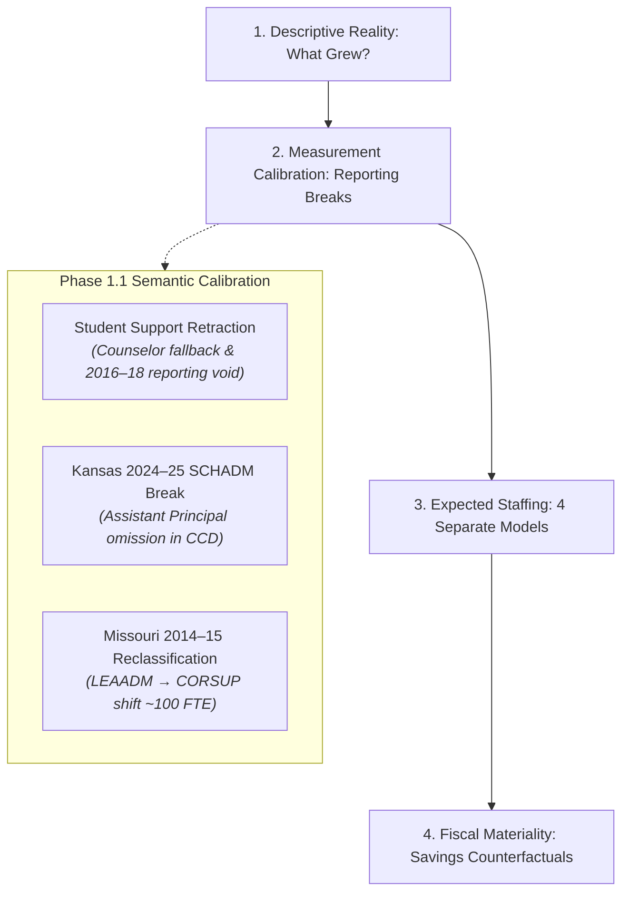

# Kansas City Administrative Staffing Intensity Decomposition

A computational sketchbook decomposing administrative staffing intensity, organizational roles, observable demand drivers, and fiscal materiality across public school districts in the bi-state Kansas City metropolitan area over the past 20 years (2004–2024).

---

## 1. Research Motivation & The Calibrated Core Question

Public debates surrounding school district expenditures frequently invoke the phrase "administrative bloat." Framing an investigation around that phrase presupposes the conclusion and collapses distinct educational, clinical, and compliance functions into a political slogan.

Initial empirical investigation across the 9-county Kansas City metropolitan area revealed that traditional central-office administration has **not** experienced an explosive expansion. Instead, the striking workforce phenomenon has been a disproportionate, massive expansion in **instructional coordination, curriculum facilitation, and instructional coaching capacity**.

### The Calibrated Central Question
> **Why has school-system instructional coordination capacity expanded so substantially while traditional district-level administration has not expanded at anything like the same rate; which observable structural, demographic, and categorical demands explain that divergence; and how financially material would alternative administrative staffing levels actually be?**

We investigate this through four decoupled empirical stages:



---

## 2. Key Empirical Findings (Balanced Regular Cohort of 55 Districts)

Holding the cohort of 55 continuously operating regular school districts constant across the modern federal reporting era (2014–15 to 2024–25):

| Construct | 2014–15 | 2024–25 | Net $\Delta$ | Pct $\Delta$ | Role Share of Growth |
| :--- | :--- | :--- | :--- | :--- | :--- |
| **Enrollment** | 320,611 | 316,617 | -3,994 | **-1.2%** | — |
| **Classroom Teachers (K-12 FTE)** | 20,801.0 | 22,247.9 | +1,446.9 | **+7.0%** | — |
| **District Central Admins (LEAADM)** | 175.8 | 177.7 | +1.9 | **+1.1%** | 0.7% |
| **Instructional Coordinators (CORSUP)** | 501.3 | 751.2 | +249.9 | **+49.8%** | **89.5%** |
| **School Building Admins (SCHADM)\*** | 1,055.1 | 1,082.3 | +27.2 | **+2.6%** | 9.7% |
| **Broad Admin + Coordinators** | 1,732.2 | 2,011.3 | +279.1 | **+16.1%** | 100.0% |
| **Broad Admin / 1,000 Pupils** | 5.40 | 6.35 | +0.95 | **+17.6%** | — |
| **Clean Guidance Counselors (GUI)** | 779.8 | 909.0 | +129.2 | **+16.6%** | — |

*\*Note: 2024–25 Kansas SCHADM figures reflect the state-level omission of Assistant Principals. In the pre-break 2014–15 to 2023–24 window, SCHADM grew from 1,055.1 to 1,305.0 (+23.7%), scaling with new school building construction.*

### Substantive Takeaways
1. **Instructional Coordinators Drove 89.5% of All Administrative Growth:** In the matched cohort of 55 regular districts, traditional central office superintendents and line directors were virtually flat (+1.9 FTE / +1.1%). The entire expansion occurred in curriculum directors, instructional coaches, and instructional coordinators (+249.9 FTE / +49.8%).
2. **Core Management Intensity Fell in Major Suburbs:** In Blue Valley USD 229, core administration fell from 4.67 to 2.17 per 1,000 pupils between 2004 and 2024. In Olathe USD 233, core administration fell from 4.70 to 2.49 per 1,000 pupils.
3. **Fixed-Cost Dilution Explains Distorted Urban Ratios:** In Hickman Mills C-1 (-24.8% enrollment) and Center 58 (-11.3% enrollment), per-pupil intensity rose sharply because baseline central and building operations cannot shrink proportionally with enrollment loss.

---

## 3. Phase 1.1 Semantic Calibration & Resolved Data Breaks

Phase 1.1 subjected the panel to semantic auditing, resolving three major measurement hazards:

### 3.1 Retraction of the Student-Support (+253%) Finding
* **The Break:** Build 1 reported student support expanding by +253%. Investigation revealed that in early extracts (2004–2013), broader student support was unpopulated and fell back to `counselors_fte`. In 2014–15, the broader field was populated, creating a phantom jump. Furthermore, in **2016–17 through 2018–19**, NCES recorded `0.00` student support across all Kansas and Missouri districts.
* **Resolution:** The +253% finding is **retracted**. Broad student support (`STUSUP`) is flagged as non-comparable across the 20-year span. Guidance Counselors (`counselors_fte`) is established as the clean, verified pupil support series (+20.4% over 20 years, +16.6% over 10 years).

### 3.2 Kansas 2024–25 Assistant Principal Exclusion Break
* **The Break:** Kansas school administrators dropped from 611.6 to 386.7 FTE (-36.8% statewide).
* **Resolution:** Cross-validation against KSDE SO66 reports confirmed that in 2024–25, Kansas reported **only Head Principals** in CCD line 059, omitting Assistant Principals. We provide both the 2014–2024 series and the 2014–2023 pre-break series (+23.7% SCHADM growth). All Phase 2 regressions include state $\times$ year fixed effects.

### 3.3 Missouri 2013–14 to 2014–15 Role Reclassification
* **The Break:** Missouri district administrators fell -102.8 FTE while instructional coordinators rose +64.9 FTE.
* **Resolution:** Combined Central Management + Coordination (`LEAADM + CORSUP`) remained steady (455.0 vs. 417.2 FTE). For 20-year longitudinal analyses, `LEAADM + CORSUP` is the only valid reclassification-robust aggregate.

---

## 4. The Calibrated Four-Model Architecture (Phase 2 Roadmap)

Rather than estimating a single aggregate administrative regression, we formulate four separate structural models:

1. **School Administrators (`SCHADM`):**
   $$\text{SCHADM}_{it} = \alpha_i + \gamma_{\text{state} \times \text{year}} + \beta_1 \text{Enrollment}_{it} + \beta_2 \text{Schools}_{it} + \beta_3 \text{AverageSchoolSize}_{it} + \varepsilon_{it}$$
2. **District Administrators (`LEAADM`):**
   $$\text{LEAADM}_{it} = \alpha_i + \gamma_{\text{state} \times \text{year}} + \beta_1 \text{Enrollment}_{it} + \beta_2 \text{Schools}_{it} + \beta_3 \text{CurrentExpenditures}_{it} + \varepsilon_{it}$$
3. **Instructional Coordinators (`CORSUP`) — *Primary Growth Locus*:**
   $$\text{CORSUP}_{it} = \alpha_i + \gamma_{\text{state} \times \text{year}} + \beta_1 \text{Teachers}_{it} + \beta_2 \text{IEPShare}_{it} + \beta_3 \text{ELShare}_{it} + \beta_4 \text{ChildPoverty}_{it} + \sum_k \theta_k \text{CategoricalRevenue}_{it}^k + \varepsilon_{it}$$
4. **Broad Supervisory Footprint (`SCHADM + LEAADM + CORSUP`):**
   Robust aggregate ensuring that title substitution between directors and coordinators does not bias estimates.

### Explanatory Residual & Grouped Shapley
* **Residual Definition:** $\varepsilon_{it}$ is defined as **"Unexplained district-year staffing deviation"** ($\text{discretion} + \text{omitted needs} + \text{timing} + \text{outsourcing} + \dots$).
* **Sampling Rule:** Only persistent, multi-year deviations ($\varepsilon_{it} > +1.5 \text{ SD}$ across 3+ consecutive years) are sampled for Phase 3 qualitative board-document audits.
* **Grouped Shapley Decomposition:** Decomposes predicted change into four covariate families (Scale & Structure, Student Need, Categorical Program Funding Load, General Operational Factors) as an explanatory accounting rather than a causal attribution.

---

## 5. Directory Structure

```text
2026-10-01-kc-admin-staffing-decomposition/
├── README.md                                  # Research overview, calibration findings & roadmap
├── CATALOG.md                                 # (Root catalog updated)
├── research/
│   ├── taxonomy.md                            # Frozen 7-bucket staff taxonomy & safe composites
│   ├── questions.md                           # The 4 decoupled research questions & 4-model design
│   └── provenance_ledger.md                   # Detailed break reconciliations & survey mechanics
├── data/
│   ├── raw/                                   # Pointers to original federal and state extracts
│   ├── interim/
│   │   └── ccd_lea_historical_2004_2013.parquet  # Harmonized historical CCD extract
│   ├── processed/
│   │   ├── district_staff_year.csv            # Canonical 21-year panel (1,629 rows, 63 cols)
│   │   └── district_staff_year.parquet        # High-performance Parquet format
│   └── manifest.csv                           # Audit ledger with SHA256 hashes and row counts
├── src/
│   ├── taxonomy.py                            # Taxonomy registry, safe composites & missingness rules
│   ├── build_panel.py                         # Longitudinal panel extraction & calibration pipeline
│   ├── audit_panel.py                         # Semantic audit suite (7 integrity tests, stopping rules)
│   └── descriptive_decomposition.py           # Calibrated mechanical ledger & balanced cohort engine
└── outputs/
    └── tables/
        ├── kc_staffing_decomposition_report.md       # Comprehensive calibrated synthesis report
        ├── kc_balanced_cohort_decomposition.csv      # 55-district balanced cohort benchmark
        ├── kc_dynamic_universe_decomposition.csv      # Dynamic universe totals (including charters)
        ├── kc_balanced_state_10yr_decomposition.csv  # 10-year state-level shifts
        ├── kc_balanced_state_prebreak_decomposition.csv # Pre-KS break benchmark (2014–2023)
        ├── kc_major_districts_2014_2024_decomposition.csv # Major district mechanical ledger
        └── multi_denominator_comparison.csv          # Multi-denominator panel metrics
```

---

## 6. Implementation Sequence

1. **Phase 1.1 — Semantic Calibration:** COMPLETED. (Resolved student-support break, Kansas SCHADM break, Missouri reclassification, and established the 55-district balanced cohort).
2. **Phase 2A — Demand Panel (`district_demand_year.parquet`):** Ingest EDFacts IDEA (FS002) / EL (FS141), Census SAIPE child poverty, and Census F-33 categorical revenues.
3. **Phase 2B — Expected Staffing Models:** Estimate the 4 tailored panel regressions with district FE + state $\times$ year FE and clustered SEs.
4. **Phase 2C — Grouped Shapley Decomposition:** Decompose model-predicted coordinator and administrative change into covariate families.
5. **Phase 3 — Board Document Residual Audit:** Sample persistent multi-year residual outliers for qualitative board-document investigation.
6. **Phase 4 — Fiscal Materiality Counterfactuals:** Simulate alternative staffing regimes using matched salary distributions.
