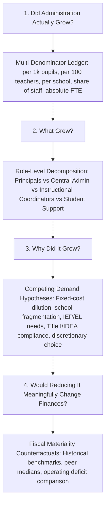

# Kansas City Administrative Staffing Intensity Decomposition

A computational sketchbook decomposing administrative staffing intensity, organizational roles, observable demand drivers, and fiscal materiality across public school districts in the bi-state Kansas City metropolitan area over the past 20 years (2004–2024).

---

## 1. Research Motivation & Core Question

Public debates surrounding school district expenditures frequently invoke the phrase "administrative bloat." Framing an investigation around that phrase presupposes the conclusion and collapses distinct educational, clinical, and compliance functions into a political slogan.

This project frames the inquiry as an **administrative-intensity decomposition**. We let "bloat," necessary organizational capacity, shifting student service demands, state/federal compliance burdens, or some mixture emerge directly from the empirical evidence.

### The Central Question
> **How has administrative staffing intensity changed in Kansas City–area public school districts over the past 15–20 years; which specific functions account for that change; how much of the change can be explained by enrollment, number of schools, student needs, program/funding requirements, and other observable demands; and how financially material would alternative administrative staffing levels actually be?**

To answer this, we decouple the inquiry into four distinct empirical questions:



---

## 2. The Four Decoupled Questions

### Question 1: Did administration actually grow?
Single-metric headlines (e.g., "administrators increased 30%") are mathematically fragile. A district that loses 25% of its students while keeping five administrators will show an administrative surge per pupil despite hiring no one (**fixed-cost dilution**). Conversely, an expanding suburb hiring principals for new schools may show absolute growth while intensity per pupil remains flat.
* **Empirical Standard:** Every district is evaluated across five simultaneous metrics:
  1. Administrative FTE per 1,000 students
  2. Administrative FTE per 100 classroom teachers
  3. Administrative share of total district staff (%)
  4. School administrators per operating school building
  5. Absolute FTE change ($\Delta \text{FTE}$)

### Question 2: What specific functions account for the change?
Before touching econometric models, we construct an exact mechanical identity of non-teaching staffing changes:
$$\Delta \text{Non-Teaching} = \Delta \text{Principals} + \Delta \text{Central Admin} + \Delta \text{Instructional Coordinators} + \Delta \text{Student Support} + \Delta \text{Paraprofessionals} + \Delta \text{Operations}$$
* Nationally, NCES data shows that between 2004 and 2022, classroom teachers grew +4.5%, district officials grew +38%, principals grew +19%, while **instructional coordinators exploded by +111%** (47,700 to 100,700).
* Calling all 100,000 instructional coordinators "administrators" makes a radically different policy argument than claiming superintendent cabinets doubled. Disentangling coaching/curriculum staff from executive leadership is essential.

### Question 3: How much can be explained by observable demands?
We formulate and test five competing hypotheses:
1. **Fixed-Cost Dilution:** Declining enrollment inflates per-pupil intensity against semi-fixed central overhead.
2. **Organizational Fragmentation:** Operating more buildings or smaller schools structurally requires more building principals.
3. **Student Service Complexity:** Growing shares of students with disabilities (IEP), English Learners (EL), and economically disadvantaged students require specialized administrative coordination.
4. **Categorical Compliance & Federal Programs:** Title I, IDEA Part B, Title III, and state accountability mandates generate dedicated administrative overhead.
5. **Discretionary Organizational Choice:** District-specific administrative expansion unexplained by observable drivers (measured via district fixed-effects residuals and audited via board meeting minutes, budgets, and org charts).

### Question 4: How financially material would alternative staffing levels be?
We simulate three counterfactual regimes:
1. Maintaining 2004 or 2014 staffing intensity per pupil;
2. Staffing at the regional peer median;
3. Eliminating a targeted percentage of central office and coordinator positions.
We apply market salary and fringe benefit benchmarks from KSDE SO66, Missouri MCDS, and Census F-33 data to determine whether projected savings represent a \$500,000 item in a \$350 million budget (symbolic politics) or a material remedy for structural operating deficits.

---

## 3. The Frozen Staff Taxonomy

Staffing categories are mutually exclusive, exhaustive, and rigorously quarantined:

| Bucket | Canonical Role | NCES CCD Field | KSDE SO66 Line Item | MO DESE Position | Census F-33 Function |
| :--- | :--- | :--- | :--- | :--- | :--- |
| **1. Core Management** | Superintendents, Central Directors, Building Principals & APs | `LEAADM`, `SCHADM` | `Superintendent`, `Assoc./Asst. Supt`, `Principals`, `Asst Principals`, `Admin Assistants` | Codes `01`, `02`, `05`, `06`, `07`, `08` | Function `2300` (General Admin), `2400` (School Admin) |
| **2. Instructional Admin** | Curriculum Directors, Instructional Coordinators, Coaches | `CORSUP` | `Instructional Coord./Supervisors`, `Other Curriculum Specialists` | Code `09` (Instructional Coach / Curriculum) | Function `2210` (Instructional Staff Support) |
| **3. Program Compliance** | Special Ed Directors, Federal Program Coordinators, Assessment | Captured in `LEAADM` / `CORSUP` | `Dir./Supervisors Spec. Ed.`, `Dir./Supervisors CTE`, `Dir./Supervisors Health`, `All Other Dir` | Codes `05`/`06` under Program Duty Codes | Function `2100` / `2210` |
| **4. Business & Operations** | CFOs, Business Managers, HR, IT & Facilities Directors | `LEASUP` / `OTHSUP` (professional) | Non-Licensed Personnel: `Business Manager`, `HR Director`, `IT Director` | Codes `03` (CFO/Business), `04` (HR Director) | Function `2500` (Central / Business Services) |
| **5. Student Support (QUARANTINED)** | Counselors, Psychologists, Social Workers, Nurses, Speech Therapists | `GUI`, `STUSUP` | `School Counselors`, `Psychologists`, `Nurses`, `Speech Pathologists`, `Social Workers` | Codes `10`, `12`, `13`, `14`, `15` | Function `2100` (Pupil Support Services) |
| **6. Classroom Instruction** | K–12 Teachers, Pre-K Teachers, Paraprofessionals & Aides | `TOTTCH`, `PARA` | `Practical Arts/CTE`, `Special Ed Teachers`, `Elementary`, `Secondary`, `Pre-School` | Codes `30`, `31`, `50` (Aides) | Function `1000` (Direct Classroom Instruction) |
| **7. Operations / Auxiliary** | Clerical, Custodial, Maintenance, Transportation, Food Service | `SCHSUP`, `LEASUP`, `OTHSUP` | Non-Licensed Personnel: `Custodial`, `Food Service`, `Transportation`, `Clerical` | Codes `60`, `70`, `80`, `90` | Functions `2600`, `2700`, `3100` |

> [!IMPORTANT]
> **Strict Quarantine Rule:** Student Support Services (counselors, psychologists, social workers, nurses) are **never** classified as administrative personnel. Conflating student mental health and medical support with administration is an empirical error.

---

## 4. Geographic Universe

The study covers all 84 public school districts and LEAs across the official **9-county Mid-America Regional Council (MARC)** metropolitan area:
* **Missouri (5 Counties):** Jackson, Clay, Platte, Cass, Ray
* **Kansas (4 Counties):** Johnson, Wyandotte, Leavenworth, Miami

Districts are categorized into six structural typologies:
1. **Urban Core Unified:** Kansas City Public Schools (KCPS 33), Kansas City Kansas Public Schools (KCKPS USD 500), Center 58.
2. **Major Suburban Unified:** Shawnee Mission, Blue Valley, Olathe, North Kansas City 74, Lee's Summit R-VII, Blue Springs R-IV, Liberty 53, Park Hill, Independence 30, Raytown C-2, Raymore-Peculiar R-II.
3. **Independent Town / Exurban:** Lansing, Leavenworth, Basehor-Linwood, Gardner Edgerton, De Soto, Spring Hill, Turner, Piper, Belton, Kearney, Smithville, Excelsior Springs, Harrisonville, Pleasant Hill, Paola, Louisburg, Fort Osage, Grain Valley, Grandview, Platte County.
4. **Rural / Peripheral:** Archie, Drexel, Sherwood Cass, Lone Jack, Midway, Orrick, Richmond, Lawson, Easton, etc.
5. **Charter LEAs:** Public charter agencies located within the urban core (Academie Lafayette, University Academy, Frontier Schools, Crossroads, etc.).
6. **Specialized State Agencies:** Missouri Schools for the Severely Disabled, Kansas School for the Deaf, Kansas School for the Blind, Division of Youth Services.

---

## 5. Build 1 Status & Key Findings

Build 1 establishes the canonical panel, audit suite, and descriptive mechanical decomposition across 21 consecutive school years (2004–05 through 2024–25).

### Key Empirical Findings
1. **Instructional Coordinators Accounted for the Vast Majority of Administrative Growth:**
   - Across the 9-county metropolitan area over the past 20 years (2004–05 to 2024–25), instructional coordinators and curriculum coaches surged from **204.0 FTE to 808.5 FTE (+296%, +604.5 FTE)**.
   - Over the same 20-year span, building principals and assistant principals grew by +137.2 FTE (+13.2%), directly tracking school construction and facility reconfigurations.
   - Central office general administration (superintendents and central directors) did not explode; direct central line administrators remained flat or shifted into specialized functional titles.
2. **The Disproportionate Surge in Student Support:**
   - Certified pupil support professionals (counselors, psychologists, social workers, nurses) expanded from **755.0 FTE to 2,667.0 FTE (+253%, +1,912.0 FTE)** over 20 years.
   - Improperly classifying these clinical and counseling professionals as "administrators" creates the false appearance of a bureaucratic explosion.
3. **Major District Divergence (10-Year Span 2014–15 to 2024–25):**
   - **Shawnee Mission USD 512:** Enrollment fell -3.5%, teachers grew +4.3%, principals grew +2.8 FTE, central admin grew +3.0 FTE, but **instructional coordinators surged by +88.4 FTE (from 27.6 to 116.0 FTE)**. Coordinators accounted for **94%** of the district's net administrative increase.
   - **North Kansas City 74:** Enrollment grew +7.0%, teachers grew +16.6%, principals grew +26.6 FTE (opening and expanding buildings), central admin grew +0.5 FTE, and instructional coordinators grew +22.9 FTE.
   - **Blue Valley USD 229:** Administrative intensity per 1,000 pupils **declined** from 4.81 to 4.31.
   - **Hickman Mills C-1 & Center 58:** Experienced sharp surges in per-pupil intensity driven primarily by **enrollment collapse (-24.8% and -11.3%)**, demonstrating fixed-cost dilution rather than administrative expansion.

---

## 6. Directory Structure

```text
2026-10-01-kc-admin-staffing-decomposition/
├── README.md                                  # Research overview, taxonomy, and findings
├── CATALOG.md                                 # (Root catalog updated)
├── research/
│   ├── taxonomy.md                            # Frozen 7-bucket staff taxonomy & crosswalk matrix
│   ├── questions.md                           # The 4 decoupled research questions & 5 hypotheses
│   └── provenance_ledger.md                   # Data source mechanics, survey quirks, negative codes
├── data/
│   ├── raw/                                   # Pointers to original federal and state extracts
│   ├── interim/
│   │   └── ccd_lea_historical_2004_2013.parquet  # Harmonized historical CCD extract
│   ├── processed/
│   │   ├── district_staff_year.csv            # Canonical 21-year panel (1,629 rows, 53 cols)
│   │   └── district_staff_year.parquet        # High-performance Parquet format
│   └── manifest.csv                           # Audit ledger with SHA256 hashes and row counts
├── src/
│   ├── taxonomy.py                            # Taxonomy registry, sanitizers, and derived ratios
│   ├── build_panel.py                         # Longitudinal panel extraction & harmonization pipeline
│   ├── audit_panel.py                         # Integrity test suite (0 negative values assertions)
│   └── descriptive_decomposition.py           # Mechanical ledger and multi-denominator engine
├── outputs/
│   └── tables/
│       ├── kc_staffing_decomposition_report.md       # Comprehensive markdown synthesis report
│       ├── kc_metro_staffing_decomposition_summary.csv # 10-year and 20-year metropolitan totals
│       ├── kc_state_10yr_decomposition.csv           # KS vs MO 10-year staffing shifts
│       ├── kc_typology_10yr_decomposition.csv        # Typology shifts (Suburban, Urban, Charter)
│       ├── kc_major_districts_2014_2024_decomposition.csv # District-level mechanical ledger
│       └── multi_denominator_comparison.csv          # Multi-denominator panel metrics
└── notebooks/                                 # Exploratory scratchpads
```

---

## 7. Next Research Experiments

1. **Phase 2: Panel Regression & Decomposition (Expected Staffing Model):**
   - Estimate within-district panel models:
     $$\text{Admin FTE}_{it} = \alpha_i + \gamma_t + \beta_1 \text{Enrollment}_{it} + \beta_2 \text{Schools}_{it} + \beta_3 \text{IEP}_{it} + \beta_4 \text{EL}_{it} + \beta_5 \text{Poverty}_{it} + \beta_6 \text{Categorical Revenues}_{it} + \varepsilon_{it}$$
   - Apply Shapley value decomposition to quantify the relative contribution of each driver to observed changes.
2. **Phase 3: Primary Board Document Residual Audit:**
   - Retrieve annual budgets, staffing plans, organizational charts, and board minutes for districts with large positive or negative residuals ($\varepsilon_{it}$).
3. **Phase 4: Fiscal Materiality Counterfactuals:**
   - Model the exact budgetary impact of alternative administrative staffing regimes using matched salary/benefit data from KSDE SO66, Missouri MCDS, and Census F-33 files.
