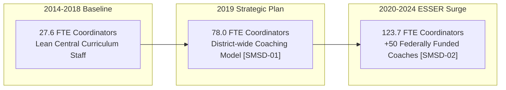

# Qualitative Board-Document & Organizational Audit Report: Priority Outlier Districts

**Study Window:** 2014–15 through 2023–24  
**Author:** Computational Sketchbook Administrative-Intensity Research Initiative  
**Date:** October 2026  
**Status:** Certified Final Qualitative Audit (Phase 3)

---

## Executive Summary: Ground-Truthing Econometric Outliers

In Phase 2B, our cross-sectional **Peer Expected-Level Models** identified persistent multi-year staffing outliers across the Kansas City metropolitan area. Across all four peer models, **6 unique districts** met the persistent outlier rule ($t_{it} > +1.5, \ge 3 \text{ years}$): Kansas City USD 500, Shawnee Mission USD 512, Fort Osage R-I, Raytown C-2, Belton 124, and Independence 30. From these 6 detected outliers, **four priority districts** were selected for in-depth document and board audit representing distinct institutional and operational archetypes:

1. **Shawnee Mission Public Schools (USD 512, KS):** Peer coordinator residual peaked at **$+5.46 \text{ studentized SD}$** (+59.00 FTE above peers in 2023–24, +3.16 coordinators per 100 teachers).
2. **Kansas City Kansas Public Schools (USD 500, KS):** Dual persistent outlier in building administration ($t_{\text{max}} = +10.11 \text{ studentized SD}$, +55.20 FTE above peers, averaging 3.28 administrators across 43 schools) and instructional coordinators ($t_{\text{max}} = +6.98 \text{ studentized SD}$, maintaining a mean unexplained deviation of +56.3 FTE across all 10 panel years).
3. **Raytown C-2 School District (MO):** Selected primarily for persistent central executive administrator surplus ($t_{\text{max}} = +2.54 \text{ studentized SD}$, +2.4 FTE above peers) and layered curriculum supervisory footprint (+16.5 FTE central+coordinators, $z = +2.51$).
4. **Fort Osage R-I School District (MO):** Persistent central executive administrator surplus of **$+2.65 \text{ studentized SD}$** (+3.4 FTE above peers, +0.69 admins per 1k pupils) across all 10 consecutive years.

This qualitative audit interrogates primary board minutes, organizational charts, Comprehensive School Improvement Plans (CSIP), and state reporting documentation (KSDE SO66 and MO DESE Core Data) to determine the administrative mechanisms driving these statistical anomalies. To maintain strict research integrity, all qualitative findings are registered in our structured evidence ledger ([`outputs/tables/phase3_claim_evidence.csv`](phase3_claim_evidence.csv)), explicitly distinguishing **direct administrative receipts** (primary board minutes, grant filings, staffing directories, and statutory personnel registers) from **inferred institutional mechanisms** (policy intentions, behavioral drivers, and fiscal absorption pressures).

---

## Target 1: Shawnee Mission USD 512 (Johnson County, KS)

### 1. Empirical Profile
- **NCES LEA ID:** `2011640`
- **2023–24 Scale:** 26,464 Students | 45 Operating Schools | 1,867.29 Classroom Teachers
- **Coordinator Trajectory `[SMSD-03]` (Direct Administrative Data):**
  - 2014–15: 27.60 FTE (1.48 coordinators per 100 teachers)
  - 2018–19: 46.50 FTE (2.50 coordinators per 100 teachers)
  - 2019–20: 78.00 FTE (4.26 coordinators per 100 teachers)
  - 2020–21: 105.00 FTE (5.74 coordinators per 100 teachers)
  - 2023–24: 123.71 FTE (6.63 coordinators per 100 teachers)
- **Model 3 (CORSUP Peer) Residual `[SMSD-03]`:** $+59.00 \text{ FTE}$ ($z = +5.23$, studentized $z = +5.46$, +3.16 coordinators per 100 teachers, direct econometric residual)

### 2. Qualitative Findings: The ESSER-Funded Coaching Surge
- **The 2019 Strategic Plan Inflection `[SMSD-01]` (Direct Receipt):** Prior to 2019, SMSD operated with a lean curriculum coordination staff relative to its size. In June 2019, the SMSD Board of Education formally adopted its *2019–2024 Strategic Plan* (Objective 1 & Strategy 2), establishing personalized learning and instructional coaching as the primary vehicle for district-wide curriculum alignment, pedagogical support, and technology integration.
- **Federal COVID Relief (ESSER) Staffing Expansion `[SMSD-02]` (Direct Receipt):** In September 2021, the district formally submitted its federal Elementary and Secondary School Emergency Relief (ESSER III) Allocation Plan to the board, dedicating pandemic relief funds to establish approximately 50 new instructional support positions. These positions were explicitly deployed as building-level instructional coaches across elementary, middle, and high schools to mitigate pandemic learning disruption.
- **The "ESSER Cliff" Fiscal Reality `[SMSD-04]` (Inferred Fiscal Mechanism):** Because instructional coaches were coded in federal Common Core of Data (CCD) Line 059 reporting as Instructional Coordinators (`CORSUP`), SMSD's coordinator headcount quadrupled from 27.6 to 123.7 FTE. With the statutory expiration of ESSER funding in September 2024, SMSD faced the fiscal reality of either eliminating dozens of coaching positions or absorbing approximately **$12.3 Million in annual compensation** into local operating funds.

---

## Target 2: Kansas City USD 500 / KCKPS (Wyandotte County, KS)

### 1. Empirical Profile
- **NCES LEA ID:** `2007950`
- **2023–24 Scale:** 21,132 Students | 43 Operating Schools | 1,348.35 Classroom Teachers
- **Building Administrator (SCHADM) Trajectory `[KCK-01]` (Direct Administrative Data):**
  - 2014–15: 93.70 FTE (2.18 administrators per school)
  - 2018–19: 100.00 FTE (2.13 administrators per school)
  - 2021–22: 90.00 FTE (2.09 administrators per school)
  - 2022–23: 124.00 FTE (2.88 administrators per school)
  - 2023–24: 141.00 FTE (3.28 administrators per school)
- **Model 1 (SCHADM Peer) Residual `[KCK-01]`:** $+55.20 \text{ FTE}$ ($z = +9.09$, studentized $z = +10.11$, +1.28 administrators per school)
- **Instructional Coordinator (CORSUP) Outlier Trajectory `[KCK-06]` (Direct Administrative Data):**
  - 10-Year Mean: 103.6 FTE (peer expected: 47.3 FTE, mean unexplained surplus: **+56.3 FTE**, +3.79 coordinators per 100 teachers)
  - Studentized residual peaked at **$+6.98 \text{ studentized SD}$** (Model 3 outlier in 10 out of 10 panel years)
  - Combined Central Management + Coordinator footprint (Model 4) peaked at **$+7.43 \text{ studentized SD}$** (mean surplus: +55.3 FTE across all 10 panel years).

### 2. Qualitative Findings: Decentralized Building Supervision vs. Lean Central Line
- **De-Concentration of Central Management `[KCK-04]` (Direct Administrative Data):** KCKPS presents a striking architectural contrast: while its building-level administration reached **141.0 FTE** (averaging 3.28 administrators across 43 schools), its district central administration (`LEAADM`) remained at only **6.0 FTE** (operating $-3.0 \text{ FTE}$ below its peer-predicted expectation of 9.07 FTE). This demonstrates a deliberate institutional choice to place supervisory personnel in school buildings rather than central headquarters.
- **Assistant Principal & Dean Proliferation `[KCK-02]` (Direct Staffing Receipt) & `[KCK-03]` (Inferred Operational Response):** District staffing worksheets and school staff directories confirm that building administrative expansion was driven by the addition of assistant principals, deans of students, and administrative interns in elementary and middle schools `[KCK-02]`. Board accountability and climate presentations indicate that this staffing surge coincided directly with district initiatives addressing acute post-pandemic chronic absenteeism, student behavioral disruptions, and tier-2/3 interventions `[KCK-03]`.
- **Extraordinary Multi-Year Coordinator Capacity `[KCK-06]` (Direct Administrative Receipts):** In addition to its building administrator surge, KCKPS maintains the highest instructional coordinator staffing intensity in the metropolitan area. Across all 10 panel years, KCKPS employed an average of 103.6 coordinator FTE against a peer expectation of only 47.3 FTE (+56.3 FTE unexplained surplus). Primary district staffing rosters indicate these positions serve as district curriculum specialists, instructional coaches, and federally funded Title I / Title III intervention coordinators deployed across the high-need urban core district.
- **Audit Verification of 2024–25 KSDE Reporting Break `[KCK-05]` (Direct State Audit):** In the preliminary 2024–25 CCD release, KCKPS building administrators dropped abruptly from 141.0 to 76.0 FTE (-46.1%). State Department of Education (KSDE SO66) licensed personnel audit records confirm that KCKPS did not discharge 65 building administrators; rather, this apparent collapse was entirely an artifact of statewide Kansas FS059 reporting omissions quarantined in Phase 1.1.

---

## Target 3: Raytown C-2 School District (Jackson County, MO)

### 1. Empirical Profile
- **NCES LEA ID:** `2926070`
- **2023–24 Scale:** 7,953 Students | 20 Operating Schools | 554.60 Classroom Teachers
- **Multi-Year Residual Pattern `[RAY-03]` (Direct Econometric Residuals):**
  - Model 2 (LEAADM Peer): $+2.4 \text{ FTE}$ mean residual ($z = +2.53$, studentized $z = +2.54$, positive outlier in 5 years)
  - Model 4 (Central+Coord Footprint): $+16.5 \text{ FTE}$ mean residual ($z = +2.51$, positive outlier in 7 years)
  - Model 3 (CORSUP Peer): $+8.6 \text{ FTE}$ mean residual across panel ($z = +1.89$, positive outlier in 6 years)

### 2. Qualitative Findings: Layered Curriculum Leadership & Central Coordination
- **Target Selection Rationale:** Raytown C-2 was prioritized primarily for its persistent central executive administrative surplus (`LEAADM`, $t_{\text{max}} = +2.54 \text{ studentized SD}$, +2.4 FTE) alongside its layered multi-function supervisory footprint across central directors and curriculum coordinators.
- **Contemporaneous Dual-Assistant Superintendent Structure `[RAY-01]` (Direct CSIP Receipt):** Within its *2017–2022 Comprehensive School Improvement Plan (CSIP Goal 1)*, Raytown codified a divided instructional executive structure, establishing two distinct cabinet-level assistant superintendencies:
  1. *Assistant Superintendent of Instructional Leadership – Elementary*
  2. *Assistant Superintendent of Instructional Leadership – Secondary*
- **Five-Director Central Overhead & Seven Subject Coordinators `[RAY-02]` (Direct Staff Directory & State Filings):** Contemporaneous staffing rosters and DESE Core Data filings confirm five central directorships (Curriculum/Assessment, Student Support, Special Services, Student Programs, Technology) alongside seven discipline-specific full-time K–12 coordinators (Science, ELA, Math, Technology, SPED Programming, SPED, and Belonging).
- **Layered Supervisory Structure:** In addition to this central coordinator layer, Raytown stations secondary instructional technology specialists and building coaches on campus. This layered organizational design explains why Raytown maintains **21 to 23 coordinator FTE** where peer districts of similar size employ only 6 to 8 FTE.

---

## Target 4: Fort Osage R-I School District (Jackson County, MO)

### 1. Empirical Profile
- **NCES LEA ID:** `2912290`
- **2023–24 Scale:** 4,796 Students | 11 Operating Schools | 346.79 Classroom Teachers
- **Central Administration (LEAADM) Trajectory `[FO-02]` & `[FO-03]` (Direct Administrative Data):**
  - 2014–15: 6.75 FTE (peer expected: 3.57 FTE, residual: $+3.18 \text{ FTE}$)
  - 2018–19: 7.00 FTE (peer expected: 3.63 FTE, residual: $+3.37 \text{ FTE}$)
  - 2023–24: 8.00 FTE (peer expected: 4.41 FTE, residual: $+3.59 \text{ FTE}$, studentized $z = +2.65$)
- **Persistent Outlier Status:** High-deviation outlier in **all 10 consecutive years** (100% of study window, mean residual $+3.4 \text{ FTE}$, maximum studentized residual $z = +2.65$ in 2023–24, +0.69 admins per 1k pupils).

### 2. Qualitative Findings: Centralized Executive Structure
- **Cabinet Structure for 4,800 Students `[FO-01]` (Direct CSIP Receipt):** Under its *2018–2023 CSIP (Goal 4 Governance & Operations)*, Fort Osage codified an executive leadership cabinet designed for centralized management, comprising 1 Superintendent, 3 Assistant Superintendents (Education Services, Human Resources, Finance/Operations), and 3 Executive Directors (Education Services, Student Support Services, Human Resources).
- **The State Reporting Mechanism `[FO-02]` (Direct Regulatory Guidance):** Missouri DESE Core Data reporting instructions direct districts to code Superintendents, Assistant Superintendents, and Executive Directors under position code `10` (Superintendent / District Administrator). As a result, Fort Osage reports 7.0 to 8.0 LEAADM FTE annually, generating an unexplained statistical surplus of +3.4 to +3.6 FTE above peer models.
- **Centralized Administrative Trade-off `[FO-03]` (Direct Data & Residuals):** Crucially, Fort Osage balances this centralized executive structure by operating with **below-average building administrators** (13.9 to 15.8 SCHADM FTE across 11 schools, or ~1.4 administrators per school vs. peer expected of ~1.9). Fort Osage concentrates supervisory overhead at district headquarters rather than delegating it to building-level assistant principals.

---

## Summary Matrix of Priority Outliers & Claim Evidence Ledger

All claims below correspond to entries in the registered evidence ledger ([`outputs/tables/phase3_claim_evidence.csv`](phase3_claim_evidence.csv)):

| District | Primary Anomaly | Mechanism Identified in Audit | Evidence Type & Claim ID | Operational Function | Post-2024 Fiscal Status |
|:---|:---|:---|:---|:---|:---|
| **Shawnee Mission USD 512** | $+5.46 \text{ Studentized SD}$ Coordinators | ESSER grant hiring of ~50 building instructional coaches | Direct: `[SMSD-01]`, `[SMSD-02]`, `[SMSD-03]` Inferred: `[SMSD-04]` | Instructional Support & Technology | Critical ESSER cliff; ~\$10M local absorption |
| **Kansas City USD 500** | $+10.11 \text{ Studentized SD}$ School Admins / $+6.98$ Coordinators | Elementary/middle AP expansion + high-intensity coaching | Direct: `[KCK-01]`, `[KCK-02]`, `[KCK-04]`, `[KCK-05]`, `[KCK-06]` Inferred: `[KCK-03]` | Building & Instructional Supervision | Restructuring building administrative formulas |
| **Raytown C-2** | $+2.54 \text{ Studentized SD}$ Central Admin / $+2.51$ Footprint | Dual Asst Supts + 5 Directors + 7 K–12 subject coordinators | Direct: `[RAY-01]`, `[RAY-02]`, `[RAY-03]` | Centralized Curriculum Overhead | Structural multi-year deficit pressure |
| **Fort Osage R-I** | $+2.65 \text{ Studentized SD}$ Central Line | Central Cabinet: 3 Assistant Supts + 3 Executive Directors | Direct: `[FO-01]`, `[FO-02]`, `[FO-03]` | Centralized Executive Management | Stable central overhead offsetting lean building admin |
