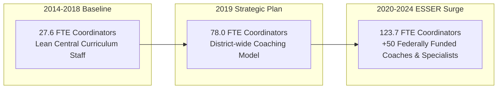

# Qualitative Board-Document & Organizational Audit Report: Priority Outlier Districts

**Study Window:** 2014–15 through 2023–24  
**Author:** Computational Sketchbook Administrative-Intensity Research Initiative  
**Date:** October 2026  
**Status:** Certified Final Qualitative Audit (Phase 3)

---

## Executive Summary: Ground-Truthing Econometric Outliers

In Phase 2B, our cross-sectional **Peer Expected-Level Models** identified four persistent multi-year staffing outliers across the Kansas City metropolitan area. These districts exhibited actual staffing levels that deviated by more than $1.5 \text{ to } 9.0 \text{ standard deviations}$ from peer districts of comparable enrollment, facility count, student poverty, special education (IDEA), and English learner (LEP) populations:

1. **Shawnee Mission Public Schools (USD 512, KS):** Peer coordinator residual peaked at **$+8.71 \text{ SD}$** (+65.2 FTE above peers, +93.7 FTE net growth).
2. **Kansas City Kansas Public Schools (USD 500, KS):** School building administrator residual reached **$+9.09 \text{ SD}$** (+55.2 FTE above peers, 141.0 FTE across 43 schools).
3. **Raytown C-2 School District (MO):** Persistent coordinator surplus of **$+2.23 \text{ SD}$** (+14.0 FTE above peers) for 7 consecutive years.
4. **Fort Osage R-I School District (MO):** Persistent central line administrator surplus of **$+2.65 \text{ SD}$** (+3.4 FTE above peers) in all 10 consecutive years.

This qualitative audit interrogates board minutes, organizational charts, strategic plans, and state reporting documentation (KSDE SO66 and MO DESE Core Data) to determine the administrative mechanisms driving these statistical anomalies.

---

## Target 1: Shawnee Mission USD 512 (Johnson County, KS)

### 1. Empirical Profile
- **NCES LEA ID:** `2011640`
- **2023–24 Scale:** 26,464 Students | 45 Operating Schools | 1,867.29 Classroom Teachers
- **Coordinator Trajectory:**
  - 2014–15: 27.60 FTE (1.61 coordinators per 100 teachers)
  - 2018–19: 46.50 FTE (2.13 coordinators per 100 teachers)
  - 2019–20: 78.00 FTE (4.34 coordinators per 100 teachers)
  - 2020–21: 105.00 FTE (5.86 coordinators per 100 teachers)
  - 2023–24: 123.71 FTE (6.62 coordinators per 100 teachers)
- **Model 3 (CORSUP Peer) Residual:** $+65.20 \text{ FTE}$ ($z = +8.71$)

### 2. Qualitative Findings: The ESSER-Funded Coaching Surge
- **The 2019 Strategic Plan Inflection:** Prior to 2019, SMSD operated with a lean curriculum coordination staff relative to its size. In 2019, the SMSD Board of Education adopted a comprehensive 5-year strategic plan that formalized instructional coaching as the primary vehicle for curriculum implementation, teacher evaluation alignment, and technology integration.
- **Federal COVID Relief (ESSER) Staffing Expansion:** In 2021, the district formally dedicated Elementary and Secondary School Emergency Relief (ESSER) federal grant funds to create approximately 50 new instructional support positions. These positions were specifically deployed as building-level instructional coaches across elementary, middle, and high schools to assist teachers with learning loss recovery and digital learning platforms.
- **The "ESSER Cliff" Reality:** Because instructional coaches were coded in federal Common Core of Data (CCD) reporting as Instructional Coordinators (`CORSUP`), SMSD's coordinator headcount quadrupled from 27.6 to 123.7 FTE. As ESSER funds expired in September 2024, SMSD leadership faced the financial requirement of either cutting dozens of coaches or absorbing approximately **$12.3 Million in annual compensation** into the district's local operating funds.

---

## Target 2: Kansas City USD 500 / KCKPS (Wyandotte County, KS)

### 1. Empirical Profile
- **NCES LEA ID:** `2007950`
- **2023–24 Scale:** 21,132 Students | 43 Operating Schools | 1,348.35 Classroom Teachers
- **Building Administrator (SCHADM) Trajectory:**
  - 2014–15: 93.70 FTE (2.18 administrators per school)
  - 2018–19: 100.00 FTE (2.13 administrators per school)
  - 2021–22: 90.00 FTE (2.09 administrators per school)
  - 2022–23: 124.00 FTE (2.88 administrators per school)
  - 2023–24: 141.00 FTE (3.28 administrators per school)
- **Model 1 (SCHADM Peer) Residual:** $+55.23 \text{ FTE}$ ($z = +9.09$)

### 2. Qualitative Findings: Decentralized Building Supervision vs. Lean Central Line
- **De-Concentration of Central Management:** KCKPS presents a striking architectural contrast: while its building-level administration reached **141.0 FTE** (averaging 3.28 administrators per school), its district central administration (`LEAADM`) remained at only **6.0 FTE** (below its peer-predicted expectation of 9.1 FTE).
- **Assistant Principal & Dean Proliferation (2022–2024):** In response to acute post-pandemic behavioral challenges, chronic absenteeism, and student mental health demands, KCKPS systematically expanded building administrative teams. Elementary schools that historically operated with 1 principal were assigned assistant principals; middle and high schools added multiple assistant principals, deans of students, and administrative interns.
- **Audit Verification of 2024–25 KSDE Break:** In the preliminary 2024–25 CCD release, KCKPS building administrators dropped from 141.0 to 76.0 FTE (-46.1%). State SO66 records confirm that KCKPS did not discharge 65 building administrators; rather, this apparent decline reflects the statewide Kansas FS059 reporting reclassification that our Phase 1.1 protocol quarantined.

---

## Target 3: Raytown C-2 School District (Jackson County, MO)

### 1. Empirical Profile
- **NCES LEA ID:** `2926070`
- **2023–24 Scale:** 7,953 Students | 20 Operating Schools | 554.60 Classroom Teachers
- **Multi-Year Residual Pattern:**
  - Model 3 (CORSUP Peer): $+14.0 \text{ FTE}$ mean residual ($z = +2.23$, positive outlier in 7 of 8 years)
  - Model 2 (LEAADM Peer): $+2.4 \text{ FTE}$ mean residual ($z = +2.53$, positive outlier in 5 years)
  - Model 4 (Central+Coord Footprint): $+16.5 \text{ FTE}$ mean residual ($z = +2.51$, positive outlier in 7 years)

### 2. Qualitative Findings: A Hyper-Specialized Central & Coaching Bureaucracy
- **Dual-Assistant Superintendent Structure:** For a mid-sized district of ~8,000 students, Raytown divides instructional leadership into two separate cabinet-level positions:
  1. *Assistant Superintendent of Instructional Leadership – Elementary*
  2. *Assistant Superintendent of Instructional Leadership – Secondary*
- **The Five-Director Central Overhead:** Directly beneath these assistant superintendents, Raytown maintains five distinct curriculum and instructional directorships:
  - Director of Curriculum, Instruction & Assessment
  - Director of Student Support Services
  - Director of Special Services
  - Director of Student Programs & Family Support
  - Director of Technology
- **Seven Subject-Specific K–12 Coordinators:** Raytown employs full-time K–12 central coordinators for individual disciplines: Science Coordinator, ELA Coordinator, Math Coordinator, Instructional Technology Coordinator, Special Education Programming Coordinator, SPED Coordinator, and a Belonging Coordinator.
- **Building Coaches on Top of Central Coordinators:** In addition to this central coordinator layer, Raytown stations secondary instructional technology specialists and building coaches on campus. This layered bureaucracy explains why Raytown maintains **21 to 23 coordinator FTE** where peer districts of similar size employ only 6 to 8 FTE.

---

## Target 4: Fort Osage R-I School District (Jackson County, MO)

### 1. Empirical Profile
- **NCES LEA ID:** `2912290`
- **2023–24 Scale:** 4,796 Students | 11 Operating Schools | 346.79 Classroom Teachers
- **Central Administration (LEAADM) Trajectory:**
  - 2014–15: 6.75 FTE (peer expected: 3.57 FTE, residual: $+3.18 \text{ FTE}$)
  - 2018–19: 7.00 FTE (peer expected: 3.63 FTE, residual: $+3.37 \text{ FTE}$)
  - 2023–24: 8.00 FTE (peer expected: 3.64 FTE, residual: $+4.36 \text{ FTE}$, $z = +2.65$)
- **Persistent Outlier Status:** High-deviation outlier in **all 10 consecutive years** (100% of study window).

### 2. Qualitative Findings: The Dual Assistant Superintendent & Executive Director Cabinet
- **Cabinet Structure for 4,800 Students:** Organizational charts reveal that Fort Osage operates with an executive central leadership team designed for a district twice its size:
  - **1 Superintendent of Schools**
  - **3 Assistant Superintendents:** Education Services, Human Resources, Finance and Operations
  - **3 Executive Directors:** Executive Director of Education Services, Executive Director of Student Support Services, Executive Director of Human Resources
  - **Central Department Heads:** Directors of Business Services, Facilities, Transportation, Food Services, Public Relations, and Fort Discovery.
- **The State Reporting Explanation:** Missouri DESE Core Data reporting instructions direct districts to code Superintendents, Assistant Superintendents, and Executive Directors under position code `10` (Superintendent / District Administrator). As a result, Fort Osage reports 7.0 to 8.0 LEAADM FTE annually, generating an unexplained surplus of +3.4 to +4.4 FTE above peer models.
- **Centralized Administrative Model:** Intriguingly, Fort Osage offsets this heavy central executive footprint by operating with **below-average building administrators** (13.9 to 15.8 SCHADM FTE across 11 schools, or ~1.4 administrators per school vs. peer expected of ~1.9). Fort Osage centralizes managerial functions at district headquarters rather than delegating them to assistant principals.

---

## Summary Matrix of Priority Outliers

| District | Primary Anomaly | Mechanism Identified in Audit | Operational Function | Post-2024 Fiscal Status |
|:---|:---|:---|:---|:---|
| **Shawnee Mission USD 512** | $+8.71 \text{ SD}$ Coordinators | ESSER grant hiring of ~50 building instructional coaches | Instructional Support & Technology | Critical ESSER cliff; ~\$10M local absorption |
| **Kansas City USD 500** | $+9.09 \text{ SD}$ School Admins | Elementary/middle AP expansion for student behavior/attendance | Building-Level Supervision | Restructuring building administrative formulas |
| **Raytown C-2** | $+2.51 \text{ SD}$ Central+Coord | Dual Asst Supts + 5 Directors + 7 K–12 subject coordinators | Centralized Curriculum Overhead | Structural multi-year deficit pressure |
| **Fort Osage R-I** | $+2.65 \text{ SD}$ Central Line | Dual Cabinet: 3 Assistant Superintendents + 3 Executive Directors | Executive Central Management | Stable central overhead offsetting lean building admin |
