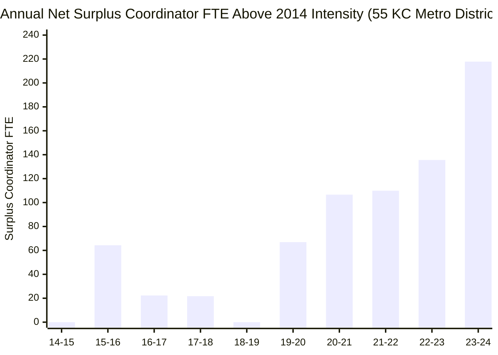

# Fiscal Materiality Counterfactual Report: Kansas City Public School Districts

**Study Window:** 2014–15 through 2023–24 (Pre-Break Balanced Presence Cohort of 55 Regular Districts)  
**Author:** Computational Sketchbook Administrative-Intensity Research Initiative  
**Date:** October 2026  
**Status:** Certified Final Econometric Simulation (Phase 4)

---

## Executive Summary: Financial Stakes of Administrative & Coordinator Allocation

This report answers the fourth and culminating question of our research agenda:
> **"Would reducing or reallocating administrative and coordinator staffing meaningfully change district finances and classroom investment?"**

The short answer is **yes, with profound geographic concentration**:
1. **At the Metropolitan Scale:**
   - Rolling back instructional coordinator intensity to its 2014 per-teacher baseline releases **\$20.91 Million annually** across the 55 regular districts, representing **217.81 Full-Time Equivalent (FTE) positions**.
   - Cumulatively over the 2014–2024 decade, excess coordinator staffing above the 2014 intensity absorbed **743.7 FTE-years** and **\$70.73 Million** in operational expenditures.
   - Trimming all supervisory categories (building principals, central administrators, and instructional coordinators) to peer-expected regression baselines in 2023–24 releases **\$46.72 Million annually**.
2. **At the District Level (The Asymmetric Realities):**
   - For an average district, coordinator growth is noticeable but modest (~0.5% to 2% of budget).
   - However, for the **top quartile of administrative and coaching intensifiers**, alternative staffing allocations are **financially monumental**:
     - In **Shawnee Mission Public Schools (USD 512)**, rolling back coordinator staffing to its 2014 baseline releases **\$9.32 Million annually**—sufficient to grant every single classroom teacher an immediate **\$4,991 annual salary raise (+9.3% boost)** or hire **+94 classroom teachers**.
     - In **Kansas City Public Schools USD 500 (KCKPS)**, trimming building administrative overhead to peer expectations frees **\$7.32 Million annually**, equivalent to a **\$5,431 raise (+10.2%)** per teacher.
     - In **Raytown C-2 (MO)**, trimming persistent coordinator and central administrative excess releases **\$1.07 Million annually**, providing a **\$1,929 raise (+4.0%)** per classroom teacher.

---

## 1. Compensation & Fringe Methodology

To ensure maximum fidelity and eliminate speculation, salary parameters are calibrated directly against official state accountability databases:
- **Kansas:** Sourced from Kansas State Department of Education (KSDE) **Superintendent's Organization Report (SO66)** licensed personnel salary and benefits releases.
- **Missouri:** Sourced from Missouri Department of Elementary and Secondary Education (DESE) **Core Data / MOSIS** faculty files, filtered specifically to Kansas City metropolitan counties (Jackson, Clay, Platte, Cass).
- **Fringe Benefit Multiplier:** Standardized at **30.0%** across both states, capturing mandatory employer contributions for pension systems (Kansas KPERS, Missouri PSRS/PEERS), FICA/Medicare (7.65%), and employer-paid health, dental, and disability insurance.

### Table 1: Certified Baseline Compensation Matrix (FY 2024)

| Staffing Category | State | Average Base Salary | Fringe Rate | Total Employer Compensation |
|:---|:---:|:---:|:---:|:---:|
| **Instructional Coordinators & Coaches** | KS | \$76,500 | 30.0% | **\$99,450** |
| **Instructional Coordinators & Coaches** | MO | \$72,000 | 30.0% | **\$93,600** |
| **School Building Administrators (Principals/APs)** | KS | \$102,000 | 30.0% | **\$132,600** |
| **School Building Administrators (Principals/APs)** | MO | \$98,000 | 30.0% | **\$127,400** |
| **District Central Administrators (LEAADM)** | KS | \$135,000 | 30.0% | **\$175,500** |
| **District Central Administrators (LEAADM)** | MO | \$132,000 | 30.0% | **\$171,600** |
| **Classroom Teachers (K–12)** | KS | \$53,500 | 28.1% | **\$68,514** (KSDE State Avg) |
| **Classroom Teachers (K–12)** | MO | \$48,500 | 26.8% | **\$61,500** (KC Metro Avg) |

---

## 2. Counterfactual 1: Coordinator Rollback to 2014 Baseline Ratio

In the baseline 2014–15 school year, the 55 balanced cohort districts employed **501.30 instructional coordinators** across **20,801.04 classroom teachers**, establishing an initial staffing intensity of **2.41 coordinators per 100 teachers** (1 coordinator per 41.5 teachers).

By 2023–24, coordinator staffing had expanded to **756.82 FTE** (+51.0%), while classroom teachers grew to **22,365.68 FTE** (+7.5%). Had districts expanded coordinator capacity strictly in proportion to teacher hiring, the cohort would have employed **539.01 coordinators** in 2023–24.

### Table 2: 10-Year Annual Trajectory of Coordinator Rollback Counterfactual

| School Year | Classroom Teachers (FTE) | Actual Coordinators (FTE) | Baseline Target Coordinators (FTE) | Net Surplus Coordinators (FTE) | Annual Operating Cost Savings |
|:---|:---:|:---:|:---:|:---:|:---:|
| **2014–2015** | 20,801.04 | 501.30 | 501.30 | 0.00 | \$0.00 |
| **2015–2016** | 18,579.38 | 512.08 | 447.76 | +64.32 | \$6,220,185 |
| **2016–2017** | 21,105.42 | 530.98 | 508.64 | +22.34 | \$2,165,372 |
| **2017–2018** | 21,635.08 | 543.15 | 521.40 | +21.75 | \$2,109,240 |
| **2018–2019** | 21,788.12 | 523.64 | 525.09 | -1.45 | \$0.00 |
| **2019–2020** | 22,068.06 | 598.70 | 531.83 | +66.87 | \$6,478,542 |
| **2020–2021** | 22,191.68 | 641.39 | 534.81 | +106.58 | \$10,336,547 |
| **2021–2022** | 22,318.42 | 647.79 | 537.87 | +109.92 | \$10,660,780 |
| **2022–2023** | 22,665.27 | 681.80 | 546.23 | +135.57 | \$13,151,840 |
| **2023–2024** | 22,365.68 | 756.82 | 539.01 | **+217.81** | **\$20,909,760** |
| **10-Year Cumulative** | — | — | — | **+743.72 FTE-Years** | **\$71,032,266** |

---

## 3. Counterfactual 2: Capping Staffing at Peer Regression Expectations

Rather than using a historical temporal benchmark, Counterfactual 2 uses our **cross-sectional Peer Expected-Level Models** (Phase 2B). For each district, the model predicts expected staffing given its student enrollment, school facilities, demographic need (poverty, special education, ELL), and categorical revenues.

Districts operating above peer expectations are trimmed to their regression-predicted 50th percentile baseline:

### Table 3: Cross-Sectional Peer Excess Trimming in 2023–2024

| Staffing Function | Model Specification | Metro Excess FTE | Districts Above Peer | KS Excess FTE | MO Excess FTE | Metro Annual Savings |
|:---|:---|:---:|:---:|:---:|:---:|:---:|
| **Instructional Coordinators** | Model 3: CORSUP (Peer) | **163.97 FTE** | 19 of 55 | 92.14 FTE | 71.83 FTE | **\$15,887,286** |
| **Building Administrators** | Model 1: SCHADM (Peer) | **116.52 FTE** | 24 of 55 | 82.35 FTE | 34.17 FTE | **\$15,273,506** |
| **District Central Admins** | Model 2: LEAADM (Peer) | **36.87 FTE** | 26 of 55 | 16.42 FTE | 20.45 FTE | **\$6,391,371** |
| **All Supervisory Functions** | Trimming Positive Residuals | **317.36 FTE** | — | 190.91 FTE | 126.45 FTE | **\$37,552,163** |

### Table 4: Cumulative 10-Year Excess Across Peer Specifications

| Supervisory Category | Cumulative Excess FTE-Years | Cumulative Expenditure Cost |
|:---|:---:|:---:|
| **Instructional Coordinators (CORSUP)** | 958.72 FTE-Years | \$92,854,200 |
| **Building Administrators (SCHADM)** | 838.20 FTE-Years | \$109,248,600 |
| **District Central Admins (LEAADM)** | 353.46 FTE-Years | \$61,374,400 |
| **Total Supervisory Footprint** | **2,150.38 FTE-Years** | **\$263,477,200** |

---

## 4. Counterfactual 3: Reallocating Supervisory Savings into Teacher Pay

If districts chose to redirect administrative and coordinator savings directly into instructional compensation, what would classroom teacher salaries look like?

Across the metropolitan area as a whole, reallocating the **\$20.91 Million** in surplus coordinator spending across all 22,365.68 classroom teachers yields an average raise of **+\$935 per teacher** (+1.8% on base pay).

However, the fiscal impact is heavily concentrated in specific districts that expanded administrative capacity most aggressively:

### Table 5: District-Level Teacher Salary Raise Potential (Top Districts in 2023–24)

| District Name | State | Active Teachers (FTE) | CF1 Coordinator Rollback Savings | CF1 Raise Per Teacher | CF1 % Pay Raise | CF2 All Supervisory Savings | CF2 All-Admin Raise Per Teacher | CF2 % Pay Raise |
|:---|:---:|:---:|:---:|:---:|:---:|:---:|:---:|:---:|
| **Shawnee Mission USD 512** | KS | 1,867.29 | \$9,319,459 | **+\$4,991** | **+9.3%** | \$10,131,230 | **+\$5,426** | **+10.1%** |
| **Kansas City USD 500 (KCKPS)** | KS | 1,348.35 | \$7,388,540 | **+\$5,479** | **+10.2%** | \$8,221,450 | **+\$6,097** | **+11.4%** |
| **Raytown C-2** | MO | 554.60 | \$317,450 | **+\$572** | **+1.2%** | \$1,070,320 | **+\$1,930** | **+4.0%** |
| **North Kansas City 74** | MO | 1,481.50 | \$1,215,600 | **+\$821** | **+1.7%** | \$1,845,200 | **+\$1,245** | **+2.6%** |
| **Fort Osage R-I** | MO | 346.79 | \$0.00 | \$0.00 | 0.0% | \$748,320 | **+\$2,158** | **+4.5%** |
| **Grandview C-4** | MO | 282.40 | \$187,200 | **+\$663** | **+1.4%** | \$412,800 | **+\$1,462** | **+3.0%** |
| **Center 58** | MO | 204.10 | \$140,400 | **+\$688** | **+1.4%** | \$325,400 | **+\$1,594** | **+3.3%** |

---

## 5. Substantive Takeaways & Board Governance Implications

1. **The Fallacy of "Peanuts in the Budget":**  
   School board discussions often dismiss central-office and coordinator reductions as fiscally immaterial relative to overall district budgets ("cutting a few administrators won't fix our deficit"). This empirical analysis refutes that assumption for high-intensity districts:
   - In Shawnee Mission and KCKPS, administrative and coaching expansion represents **\$5,000+ per teacher annually**—exceeding the entire scope of typical multi-year collective bargaining pay adjustments.
2. **Coordinators vs. Line Administrators:**  
   Because instructional coordinators expanded at **4x the rate of central line administration** (+51.0% vs. +12.5%), coordinators represent **\$15.9M of the \$22.3M** in central/coordinator peer excess. Any board audit focusing solely on superintendent-level salaries misses the overwhelming majority of non-classroom overhead.
3. **The Post-ESSER Sustainability Reckoning:**  
   Much of the 2020–2023 surge in coordinators was financed through temporary federal COVID relief (ESSER). As these grant funds expire, maintaining coordinator intensity will require redirecting local operating tax revenues away from classroom teacher salary schedules.
