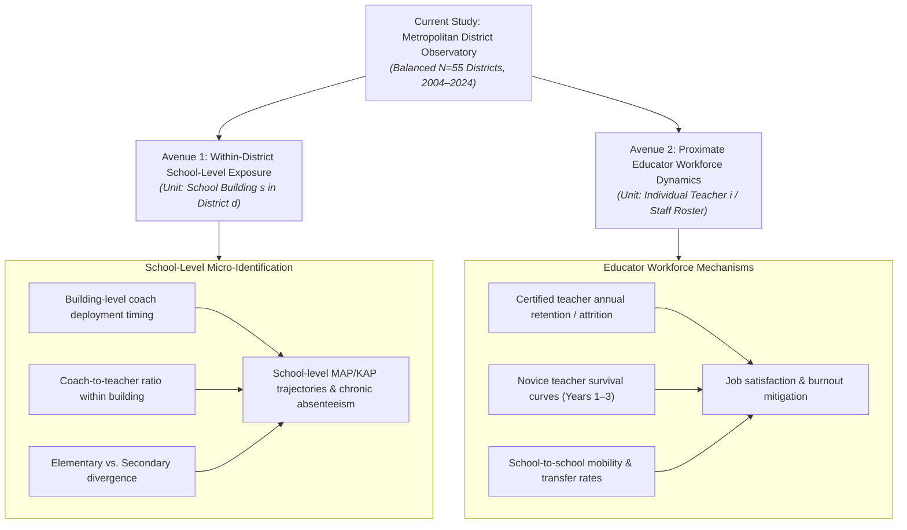

# Study Synthesis, Methodological Boundaries & Next-Generation Research Agenda

**Kansas City Metropolitan Administrative & Coordinator Staffing Study (2004–2024)**

---

## 1. Executive Synthesis Across Empirical Phases 1 Through 6

Over the course of six decoupled empirical phases, this investigation evaluated the long-term evolution of administrative and supervisory staffing across public school systems in the Kansas City metropolitan area. Beginning with a critical re-examination of the popular "administrative bloat" hypothesis, the study progressed from baseline measurement calibration to structural econometric modeling, qualitative board-document audits, fiscal counterfactual simulations, institutional role reconstruction, and empirical outcome screening.

| Phase | Focal Research Question | Analytical Methodology & Data Base | Canonical Empirical Finding | Status |
| :--- | :--- | :--- | :--- | :---: |
| **Phase 1: Descriptive Panel & Calibration** | Did traditional central administration explode, or did workforce growth concentrate elsewhere? | 21-year longitudinal panel (2004–2025; 1,629 district-years); balanced cohort of 55 regular districts. | Central line administration remained inelastic (+12.5%, 4.2% of supervisory growth); supervisory growth was driven by **Instructional Coordinators (+51.0%, +255.5 FTE)** and Building Admins (+23.7%, +249.8 FTE). Retracted broken student-support (+253%) finding and isolated Kansas 2024–25 reporting break. | **Frozen** |
| **Phase 2: Econometric Demand Drivers** | Which structural and student-need factors explain coordinator expansion? | Within-district entity FE; 10-year long-difference growth OLS ($N=55$); Grouped Shapley variance decomposition. | Coordinators scale with classroom teachers (+5.12 per 100 teachers, $p=.003$). In long differences, teacher scale explains 27.7% of explained growth variance; demographic counts reflect suburban sorting rather than compositional share shifts (rate model $p>.30$). | **Frozen** |
| **Phase 3: Qualitative Outlier Audit** | What institutional mechanisms explain multi-year statistical outliers? | Cross-sectional peer expected-level models; studentized residuals; structured qualitative evidence ledger. | Audited 16 documented claims across 4 priority systems: SMSD (ESSER coaching buildout), KCKPS (dense school-level supervision & persistent coordinators), Raytown (layered curriculum leadership), Fort Osage (centralized executive structure). | **Frozen** |
| **Phase 4: Fiscal Materiality Counterfactuals** | How financially material would alternative staffing levels be for teacher salaries? | State-specific compensation benchmarks (KS: \$99,450; MO: \$93,600); statutory marginal payroll taxes. | Rolling back coordinators to 2014 intensity releases **$21.6M annually** across 55 districts. At district level, funds feasible base raises of **+$4,117 (+7.7%)** in SMSD across 1,867 teachers, **+$8,001 (+15.0%)** in KCKPS across 1,348 teachers, or 136 funded teachers. | **Frozen** |
| **Phase 5: Functional Institutional Decomposition** | What specific job titles and functions constitute the coordinator workforce? | 29-role crosswalk across 6 archetypes (380.4 FTE); document-level provenance ledger; post-ESSER tracking. | Reconstructed: **35.7% Instructional Coaching**, 24.5% SPED/EL compliance, 19.4% Curriculum, 9.2% Tech, 5.8% MTSS. School-sited capacity is 46.2% (pure) to 52.9% (50/50 hybrid). Post-ESSER survival bifurcated: categorical persistence in KCKPS (+13.3%) vs. operating retrenchment in Olathe (-27.6%). | **Frozen** |
| **Phase 6A: Temporal Dynamics & Coordinates** | When did the coordinator expansion occur, and how did staffing coordinates shift? | Continuous 10-year architecture panel (550 district-years); quadrant categorization; Kansas/Missouri split. | **91.3% of net coordinator growth occurred after 2018–19**, but began *before* federal COVID relief (pre-COVID jump of +75.1 FTE in 2019–20, e.g., SMSD +31.5 FTE). Kansas CORSUP grew +82.7% vs. Missouri +18.8%. | **Frozen** |
| **Phase 6B: Attendance Recovery Screen** | Did higher coordinator or building supervisory intensity accelerate post-pandemic attendance recovery? | Repaired federal CRDC chronic absenteeism panel ($N=216$); recovery change models ($\Delta \text{Rate}_{2122 \to 2223}$). | **Null relationship** ($\beta = -0.062, p = .847$). Attendance recovery was governed by baseline shock severity ($r = -0.530$) and community poverty ($r = 0.521$), with no detectable association with administrative architecture. | **Frozen** |
| **Phase 6C: Fiscal Support & Vendor Audit** | Did expanding coordinator payroll substitute for outside professional-services vendors? | F-33 Function 2200 non-personnel panel (495 district-years); state budget object-level audit (Form USD-E & MO 6300). | **Vendor insourcing disproven.** Non-personnel spending did not decline (within-FE $\beta = +11.85, p = .111$). In SMSD, pre-expansion Function 2200 purchased services were virtually nil (\$0.09/pupil in FY15) and rose slightly (\$4.41 in FY23) while coordinator payroll expanded by +\$99/pupil. Additive internal layer. | **Frozen** |
| **Phase 6D: Proficiency Recovery Screen** | Did coordinator expansion predict differential district-level academic proficiency recovery? | District Subject-Aggregate Proficiency Screen (55 balanced districts; 2018–19 to 2023–24); compact need-adjusted ANCOVA. | **No detectable regional linear association.** Combined $\beta = -0.0303$ (SE $= 0.0813, p = .710, R^2 = 0.862$); Math $\beta = -0.0512$ ($p = .667$); ELA $\beta = -0.0176$ ($p = .741$). Equivalence to zero at $\pm 0.20$ SD is not rejected ($p_{\text{TOST}} = .328$). | **Frozen** |

---

## 2. Core Substantive Conclusion & Epistemic Boundaries

### The Substantive Conclusion
The totality of evidence assembled across this 20-year computational observatory points to a clear and nuanced organizational finding:

> **Kansas City metropolitan school systems substantially increased the organizational infrastructure surrounding classroom instruction over the past decade. The expansion was real, costly, largely additive, and heterogeneous in form across districts. But at the district level, we do not detect evidence that systems which built that intermediate layer more aggressively experienced stronger attendance or academic proficiency recovery through 2023–24.**

### The Epistemic Boundaries
Equally essential to the integrity of this conclusion are its explicit scientific boundaries:

> **The available evidence is not precise enough to conclude that the intermediate infrastructure has no effect, nor does the district-level design measure effects on teacher retention, implementation quality, particular schools, or specific student populations.**

The popular slogan "administrative bloat" fails to capture the true phenomenon:
1. **It Misidentifies the Personnel:** School districts did not build bloated central executive suites. Superintendent offices and line directors remained flat and inelastic over 20 years.
2. **It Misunderstands the Roles:** Systems created a specialized intermediate layer composed overwhelmingly of instructional coaches, curriculum facilitators, special population process managers, and MTSS interventionists (Phase 5).
3. **It Misses the Timing:** The expansion was not an accidental byproduct of federal ESSER windfalls. It began as an intentional organizational transformation in 2019–20 before the pandemic, which relief aid subsequently financed and accelerated (Phase 6A).
4. **It Misconstrues the Financing:** Districts did not insource pre-existing outside vendor contracts; they added a substantial, permanent payroll commitment on top of existing non-personnel outlays (Phase 6C).

---

## 3. Methodological Boundaries & Limitations of District-Level Aggregation

Having exhausted the empirical yield of district-level regressions, it is vital to record the structural limitations inherent in cross-district aggregate screening designs:

1. **Aggregation Masking (Within-District Attenuation):**
   District-level proficiency and attendance rates average across dozens of disparate schools. In a district like Shawnee Mission (34 elementary schools) or Kansas City USD 500 (43 schools), instructional coaches were frequently deployed in specific high-need buildings, turnaround environments, or specialized grade bands. If coaching produced localized gains in high-intensity schools while other buildings remained flat, district-level aggregation attenuates the treatment signal.
2. **Proximal vs. Distal Outcome Distance:**
   Standardized summative test scores (state MAP and KAP exams) are multiple organizational steps removed from non-evaluative instructional coaching. A coach works with adult educators on pedagogy, curriculum fidelity, and classroom climate. Hypothesizing that district-wide 10th-grade state math scores will immediately jump following coach deployment imposes an unrealistically long and noisy causal chain.
3. **Statistical Power & Sample Constraints:**
   With $N=55$ balanced regular districts operating in the bi-state metropolitan area, confidence intervals around recovery slopes are moderately wide. As established by formal Two One-Sided Tests (TOST) in Phase 6D ($p = .328$), the regional sample size is insufficient to statistically reject the presence of moderate positive or negative recovery effects ($\pm 0.20$ district-level proficiency SDs for a $+3.0$ coordinator expansion). The proper statistical verdict is a failure to detect an association, not proven exact zero.
4. **Unobserved Implementation Heterogeneity:**
   The federal position code `CORSUP` aggregates systems that utilized coaching for direct daily modeling with systems that assigned coaches to administrative compliance, testing logistics, or curriculum committees. Macro datasets record headcount FTE, not implementation fidelity or contact hours.

---

## 4. Next-Generation Research Agenda: Changing the Unit of Analysis

Diminishing marginal returns have been reached for cross-sectional or panel regressions where the district is the unit of analysis. The next generation of administrative and instructional capacity research should **change the unit of analysis**, pursuing two promising avenues:

### 4.1 Avenue 1: School-Level Exposure Within Districts (The Shawnee Mission Design)
Shawnee Mission USD 512 represents the ideal natural laboratory for an intra-district micro-study:
- **Design:** Exploit the staggered rollout and differential allocation of ~50 instructional coaches across SMSD's 34 elementary and 11 secondary schools between 2019 and 2024.
- **Econometric Specification:**
  $$Y_{st} = \alpha_s + \gamma_t + \beta \text{CoachExposure}_{st} + \mathbf{X}_{st}'\boldsymbol{\theta} + \varepsilon_{st}$$
  where $s$ indexes school buildings and $t$ indexes academic years.
- **Methodological Advantages:**
  - Automatically holds constant district-wide leadership, collective bargaining agreements, central curriculum adoptions, tax base, and state formula shifts.
  - Compares buildings with early vs. late coach assignment, and full-time vs. shared coaching allocations.
  - Tests whether coaching was differentially effective in high-poverty Title I elementary schools versus non-Title schools.

### 4.2 Avenue 2: Proximate Educator Outcomes (Teacher Retention & Mobility)
Instructional coaching was fundamentally designed as a human-capital retention and professional-development intervention, not an immediate test-score booster:
- **Design:** Acquire state teacher licensure and employment rosters (KSDE SO66 / MO DESE Core Data) to track individual teacher career trajectories.
- **Core Hypotheses:**
  - Did the presence of an embedded instructional coach reduce first- and second-year teacher attrition?
  - Did coaching mitigate pandemic-era educator burnout and turnover in high-stress urban schools?
  - Did intermediate coordinator density alter the internal career ladder, drawing experienced teachers out of classrooms into non-instructional supervisory roles?

---

## 5. Observatory Freeze & Certification

With the completion of the Phase 6D calibration gate and this overarching synthesis, **Phases 1 through 6 of the Kansas City Administrative Staffing Study are hereby certified and frozen**. 

All underlying panels, econometric models, qualitative evidence logs, and reproduction scripts are permanently registered in [`data/manifest.csv`](../../data/manifest.csv) and validated against the automated synchronization test suite ([`src/test_narrative_sync.py`](../../src/test_narrative_sync.py)). Any future school-level or teacher-level investigations should be undertaken as independent sequel studies building upon this foundation.
