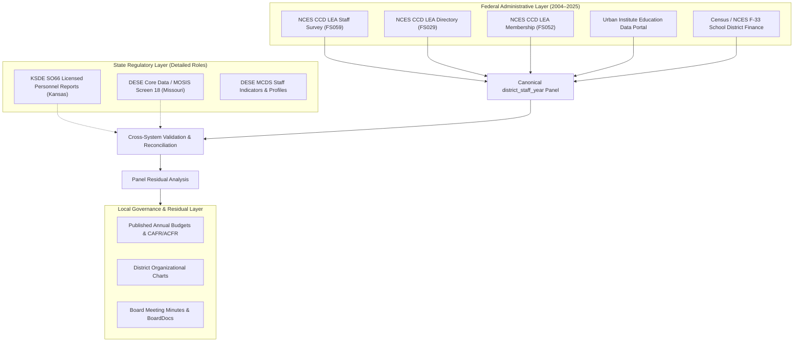

# Data Provenance Ledger & Survey Mechanics

**Project:** Kansas City Administrative Staffing Intensity Decomposition  
**Status:** Methodological Provenance (Build 1)  
**Date:** October 1, 2026  
**Scope:** Bi-State Kansas City Metropolitan Area (9 MARC Counties)

---

## 1. Primary Data Sources & Collection Systems

The study synthesizes federal administrative collections with state-level administrative registries and local governance documents.

### 1.1 Federal Common Core of Data (NCES CCD)
* **Agency:** National Center for Education Statistics, U.S. Department of Education.
* **Component Files:**
  - **LEA Staff (FS059):** Annual count of Full-Time Equivalent (FTE) professional staff by local education agency. Variables: `TOTTCH` (teachers), `SCHADM` (school principals/APs), `LEAADM` (district superintendents and central administrators), `CORSUP` (instructional coordinators and curriculum supervisors), `GUI` (guidance counselors), `STUSUP` (student support), `PARA` (paraprofessionals), `SCHSUP` (school clerical), `LEASUP` (district clerical), `OTHSUP` (other support), `STAFF` (total employment).
  - **LEA Directory (FS029):** Agency operating status, physical address, county FIPS, agency type (regular local school district, charter agency, supervisory union, specialized state agency).
  - **LEA Membership (FS052):** Unaudited student enrollment by grade (Pre-K through Grade 12).
* **Time Span:** Annual census from Fall 2004 through Fall 2024 (21 school years).
* **Reference Date:** October 1 of each school year.

### 1.2 Census / NCES F-33 School District Finance Survey
* **Agency:** Governments Division, U.S. Census Bureau, in partnership with NCES.
* **Component Variables:**
  - **General Administration (Function 2300):** Board of education and office of the superintendent expenditures (`exp_current_general_admin`), salaries (`salaries_supp_general_admin`), and benefits (`benefits_supp_general_admin`).
  - **School Administration (Function 2400):** Offices of building principals and assistant principals expenditures (`exp_current_sch_admin`), salaries (`salaries_supp_sch_admin`), and benefits (`benefits_supp_sch_admin`).
  - **Instructional Staff Support (Function 2210):** Curriculum development, staff training, instructional coaches expenditures (`exp_current_instruc_staff`), salaries (`salaries_supp_instruc_staff`), and benefits (`benefits_supp_instruc_staff`).
  - **Business / Central Office Support (Function 2500):** Financial management, HR, purchasing, data processing expenditures (`exp_current_bco`), salaries (`salaries_supp_bco`), and benefits (`benefits_supp_bco`).
  - **Categorical Federal Revenues:** Title I Part A grant revenue (`rev_fed_state_title_i`), IDEA Part B special education revenue (`rev_fed_state_idea`), Bilingual/Title III revenue (`rev_fed_state_bilingual_ed`).
* **Time Span:** Fiscal Year 2004 through Fiscal Year 2023.

### 1.3 Kansas State Department of Education (KSDE) SO66 Reports
* **Agency:** Kansas State Department of Education, Division of Fiscal & Administrative Services.
* **Data Instrument:** Superintendent’s Organization Report (SO66) via KSDE Data Central.
* **Granularity:** Reports unaudited FTE as of September 20th for every Unified School District (USD).
* **Disaggregated Positions:**
  - `Superintendent`
  - `Assoc./Asst. Superintendents`
  - `Administrative Assistants` (licensed personnel serving in an administrative capacity district-wide, including area directors)
  - `Principals`
  - `Assistant Principals`
  - `Dir./Supervisors Spec. Ed.`
  - `Dir./Supervisors of Health`
  - `Dir./Supervisors Career/Tech Ed`
  - `Instructional Coord./Supervisors`
  - `All Other Dir/Supervisors` (includes federal programs coordinators)
  - `Other Curriculum Specialists`
  - `School Counselors`, `Clinical or School Psychologists`, `Nurses (RN/NP)`, `Speech Pathologists`, `School Social Work Services`

### 1.4 Missouri Department of Elementary and Secondary Education (DESE) Core Data
* **Agency:** Missouri Department of Elementary and Secondary Education.
* **Data Instrument:** Core Data / MOSIS Collection (October Educator Core, Screen 18) and Missouri Comprehensive Data System (MCDS).
* **Granularity:** Building- and district-level educator records by Position Code and Duty Code.
* **Key Position Codes:**
  - `01`: Superintendent
  - `02`: Assistant / Associate / Deputy Superintendent
  - `03`: Business Manager / Chief Financial Officer
  - `04`: Human Resources Director
  - `05`: Director / Coordinator (assigned to program duty codes: SpEd, Title I, EL, Tech)
  - `06`: Supervisor
  - `07`: Head Principal
  - `08`: Assistant Principal / Vice Principal
  - `09`: Instructional Coach / Curriculum Specialist
  - `10`: Guidance Counselor
  - `12`: School Psychologist
  - `13`: School Social Worker
  - `14`: School Nurse

---

## 2. Technical Data Handling & Survey Caveats

### 2.1 Handling Negative NCES Administrative Exception Codes
In raw NCES CCD files, missing or suppressed data are populated with negative numeric flags:
* `-1` or `M`: Missing (data were not reported by the state education agency).
* `-2` or `N`: Not Applicable (category does not exist for this agency).
* `-9` or `A`: Imputed or Suppressed (data failed edit checks or withheld to protect privacy).

**Processing Rule:** Under no circumstances are negative values permitted to participate in sums, aggregations, or denominator calculations. All negative integers are mapped directly to `np.nan` (or explicit nulls) upon ingestion. A true count of zero (`0.0`) is rigorously distinguished from missingness (`NaN`).

### 2.2 Reclassification and State Reporting Variations in Instructional Coordinators
A vital empirical finding from federal documentation:
* Prior to the mid-2000s, state reporting of instructional coordinators (`CORSUP`) was uneven. Several states reported instructional coaches and curriculum leaders under either classroom teachers or central office administrators.
* Over the 2004–2020 period, NCES issued explicit reporting guidance instructing state coordinators to categorize school-level instructional coaches, curriculum facilitators, and professional learning trainers under `CORSUP`.
* Consequently, a portion of the dramatic national (+111%) and regional growth in instructional coordinators reflects **formal reclassification** of existing personnel out of general teaching or administrative codes into dedicated coaching codes.
* **Remediation:** Our panel model evaluates both individual categories and aggregate composites (`core_admin_fte` vs `total_admin_and_coordinators_fte`), and cross-validates federal trends against KSDE SO66 and Missouri Screen 18 time series.

### 2.3 The Outsourcing / Contracted Services Divergence
A primary risk in observational staffing panels is substituting direct employees for contracted services:
* If a school district downsizes its internal IT, transportation, or psychological staff and contracts with a third-party vendor, its direct FTE falls. The district appears more "efficient" in staffing ratios, yet total spending on the function may increase.
* **Remediation:** The staffing ledger is paired with F-33 Object 300 / 400 (Purchased Professional and Technical Services) expenditures to verify whether staffing declines represent true operational downsizing or purchased-service substitution.

### 2.4 Survey Timing Concordance
* **NCES CCD:** Reflects staffing and enrollment as of **October 1** (or closest working day).
* **KSDE SO66:** Reflects headcount and staffing as of **September 20**.
* **Missouri MOSIS:** Reflects employment status as of the **October Core** cycle.
* Small variances ($\pm 1\text{--}2\%$) between state publications and federal CCD tables arise from this 10-day difference in reporting snapshots. Both series are retained and reconciled.
