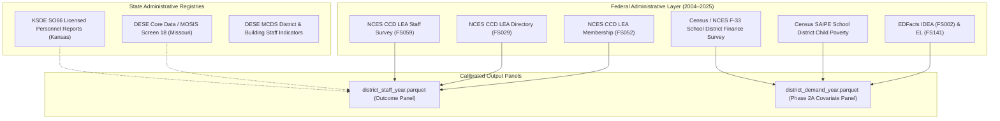

# Data Provenance Ledger & Survey Mechanics (Phase 1.1 Calibrated)

**Project:** Kansas City Administrative Staffing Intensity Decomposition  
**Status:** Methodological Provenance (Phase 1.1 Calibrated)  
**Date:** October 1, 2026  
**Scope:** Bi-State Kansas City Metropolitan Area (9 MARC Counties)

---

## 1. Survey Layers & Measurement Concordance

---

## 2. Identified Reporting Discontinuities & Technical Resolutions

Rigorous inspection of the 21-year panel identified three major measurement discontinuities that must be explicitly accounted for in any empirical analysis.

### 2.1 The Kansas 2024–25 School Administrator (SCHADM) Discontinuity
* **Observed Anomaly:** Statewide Kansas school administrators in CCD line 059 dropped from **2,210.96 FTE in 2023–24 to 1,395.20 FTE in 2024–25 (-36.8%)**. In the Kansas City metro, Kansas SCHADM dropped from 611.6 to 386.7 FTE.
* **Root Cause Investigation:** Cross-referencing against the official KSDE SO66 State Totals report reveals:
  - Total Head Principals statewide in Kansas: ~1,218 FTE
  - Total Assistant Principals statewide in Kansas: ~695 FTE
  - In 2023–24 and earlier, Kansas submitted the sum of Principals + Assistant Principals (~1,913 to 2,210 FTE) to NCES under `School administrators`.
  - In 2024–25 (CCD v.1a release), Kansas submitted **only Head Principals (~1,395 FTE)** under `School administrators`, omitting Assistant Principals.
* **Empirical Resolution:** 
  - Kansas SCHADM observations in 2024–25 are tagged with `flag_schadm_underreported_2425 = True`.
  - We report the 2014–15 to 2023–24 benchmark (where SCHADM grew +23.7%, scaling directly with school facilities) alongside the 2024–25 endpoint.
  - All Phase 2 regressions must include state $\times$ year fixed effects ($\gamma_{\text{state} \times \text{year}}$) or sensitivity exclusions for Kansas in 2024–25.

### 2.2 The Missouri 2013–14 to 2014–15 Central Reclassification
* **Observed Anomaly:** Between 2013–14 and 2014–15 in metropolitan Missouri:
  - District line administrators (`LEAADM`) dropped from **232.0 to 129.3 FTE (-102.8 FTE)**.
  - Instructional coordinators (`CORSUP`) jumped from **223.0 to 287.9 FTE (+64.9 FTE)**.
  - Statewide in Missouri, NCES district officials fell from 1,362 to 868, while coordinators rose from 1,055 to 1,437.
* **Root Cause Investigation:** Combined Central Leadership + Coordination (`LEAADM + CORSUP`) across metro Missouri was completely stable (455.0 FTE in 2013–14 vs. 417.2 FTE in 2014–15, -8.3%). Missouri districts reclassified central office curriculum directors, supervisors, and federal program directors from general administration (`LEAADM`) into instructional coordinators (`CORSUP`).
* **Empirical Resolution:**
  - For the 20-year span (2004–2024), we construct the safe composite:
    $$\text{central\_mgmt\_and\_coordinators\_fte} = \text{LEAADM} + \text{CORSUP}$$
  - Individual components are analyzed only within the modern harmonized reporting regime (2014–2024).

### 2.3 The Student Support Services (STUSUP) Reporting Void (2016–2018)
* **Observed Anomaly:** In Build 1, student support appeared to leap by +253% over 20 years.
* **Root Cause Investigation:**
  - In early historical extracts (2004–2013), broader student support was unpopulated in federal extracts, leading the build script to fall back to `counselors_fte`.
  - In 2014–15, the broader category was populated, creating an artificial surge from 737 to 2,353.
  - Furthermore, in **2016–17, 2017–18, and 2018–19**, NCES extracts recorded **0.00 FTE** for student support across all Kansas and Missouri districts, despite active counseling forces.
* **Empirical Resolution:**
  - The counselor fallback is completely removed.
  - The +253% student-support claim is **retracted**.
  - Broad student support is flagged as **NOT longitudinally comparable** across the 20-year window.
  - **Guidance Counselors (`GUI` / `counselors_fte`)** is established as the clean, reliable 20-year pupil support series (+20.4% over 20 years, +16.6% over 10 years).

---

## 3. Data Integrity & Missingness Audit Log

| School Year | State | District Name | NCES LEA ID | Missing Elements | Impact & Tag |
| :--- | :--- | :--- | :--- | :--- | :--- |
| **2012–2013** | KS | De Soto USD 232 | `2005490` | Teachers, Principals unpopulated | Tagged `flag_missing_key_staff` |
| **2012–2013** | KS | Louisburg USD 416 | `2008970` | Teachers unpopulated | Tagged `flag_missing_key_staff` |
| **2012–2013** | MO | Blue Springs R-IV | `2905310` | Teachers, Principals unpopulated | Tagged `flag_missing_key_staff` |
| **2012–2013** | MO | Oak Grove R-VI | `2923010` | Principals unpopulated | Tagged `flag_missing_key_staff` |
| **2015–2016** | KS | Olathe USD 233 | `2010140` | All staffing lines unpopulated | Tagged `flag_missing_key_staff` |
| **2015–2016** | KS | Gardner Edgerton USD 231 | `2006420` | All staffing lines unpopulated | Tagged `flag_missing_key_staff` |
| **2016–2019** | KS & MO | All Metro LEAs | Multiple | `student_support_staff_fte` = 0.0 | Tagged `flag_zero_student_support` |
| **2024–2025** | KS | All Kansas LEAs | Multiple | Assistant Principals omitted from SCHADM | Tagged `flag_schadm_underreported_2425` |

---

## 4. Phase 2A Covariate Acquisition Protocol (Demand Panel)

To explain administrative and coordination intensity, Phase 2A constructs `district_demand_year.parquet` integrating:

1. **Physical Scale & Structure:**
   - NCES CCD Directory (FS029): `operating_schools_count`, `regular_schools_count`.
   - Structural ratios: `average_school_size = enrollment / operating_schools`.
2. **Student Need (EDFacts & Census SAIPE):**
   - **IDEA School-Age Children:** EDFacts FS002 (special education child count).
   - **English Learners:** EDFacts FS141 (LEP/EL student count).
   - **Child Poverty:** Annual Census Small Area Income and Poverty Estimates (SAIPE) school district estimates (ages 5–17 in poverty). Free and Reduced-Price Lunch (FRPL) is excluded as the primary poverty covariate due to direct-certification and Community Eligibility Provision (CEP) comparability breaks.
3. **Program & Categorical Funding Load (Census F-33 Survey):**
   - Title I Part A grant revenue (`rev_fed_state_title_i`).
   - IDEA Part B special education revenue (`rev_fed_state_idea`).
   - Title III / Bilingual grant revenue (`rev_fed_state_bilingual_ed`).
   - General federal and state revenues.
4. **General Operational Context:**
   - Current operating expenditures (`exp_current_elsec_total`).
   - Purchased professional and technical services expenditures (Object 300/400).
