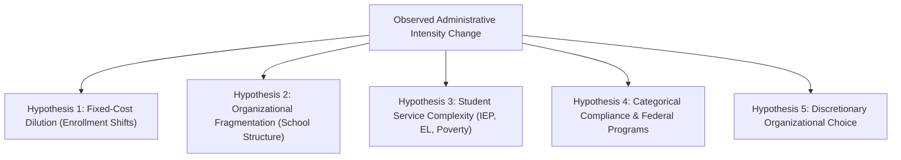

# Research Questions & Conceptual Framework

**Project:** Kansas City Administrative Staffing Intensity Decomposition  
**Status:** Methodological Framework (Build 1)  
**Date:** October 1, 2026  
**Scope:** Bi-State Kansas City Metropolitan Area (9 MARC Counties: Jackson, Clay, Platte, Cass, Ray [MO]; Johnson, Wyandotte, Leavenworth, Miami [KS])

---

## 1. The Core Research Question

> **How has administrative staffing intensity changed in Kansas City–area public school districts over the past 15–20 years; which specific functions account for that change; how much of the change can be explained by enrollment, number of schools, student needs, program/funding requirements, and other observable demands; and how financially material would alternative administrative staffing levels actually be?**

Public debates frequently begin by asserting that school systems suffer from "administrative bloat." Framing the inquiry around that term presupposes the conclusion and collapses fundamentally distinct phenomena into a political slogan. 

This study frames the inquiry as an **administrative-intensity decomposition**. We allow "bloat," necessary organizational capacity, shifting service demands, state/federal compliance burdens, or some combination thereof to emerge directly from empirical evidence.

To achieve this, we disentangle the popular narrative into four distinct, empirically testable questions:

---

## 2. Question 1: Did Administration Actually Grow?

### The Multi-Denominator Imperative
Most published claims about school staffing rely on a single headline metric—such as "administrative counts increased 25%" or "administrators per 1,000 students rose 40%." Single metrics are vulnerable to mathematical and structural distortions:

1. **Absolute FTE Growth:** An expanding suburban district (e.g., Spring Hill or Gardner Edgerton) that doubles in enrollment naturally hires additional principals and district staff. Absolute FTE growth in isolation tells us nothing about intensity.
2. **Per-Pupil Staffing Ratios (FTE per 1,000 Students):** A shrinking urban district (e.g., KCPS or Turner) that loses 30% of its students while retaining the same central management team will exhibit a sharp surge in "administrators per 1,000 students" without hiring a single person. This is **fixed-cost dilution**, not an administrative hiring spree.
3. **Per-Teacher Staffing Ratios (FTE per 100 Teachers):** Measures administrative overhead relative to classroom delivery. If class sizes are reduced by hiring more teachers, the admin-per-teacher ratio will mechanically drop even if central administration remains unchanged.
4. **Administrative Share of Total Staff (%):** Measures the organizational tilt of the workforce. If a district contracts out its transportation, food service, and custodial staff, direct non-instructional staff drops dramatically, causing the administrative share of remaining district payroll to artificially rise.
5. **Administrators per School Building:** School building leadership (principals, assistant principals) is structurally tethered to brick-and-mortar facilities rather than aggregate student counts. Operating twenty 300-student elementary schools requires far more administrative personnel than operating ten 600-student elementary schools.

### The Canonical Multi-Denominator Ledger
For every district $i$ and school year $t$, we compute five mutually complementary metrics:

$$\text{Intensity}_{it}^{\text{pupils}} = \frac{\text{Admin FTE}_{it}}{\text{Enrollment}_{it}} \times 1,000$$

$$\text{Intensity}_{it}^{\text{teachers}} = \frac{\text{Admin FTE}_{it}}{\text{Teachers K-12 FTE}_{it}} \times 100$$

$$\text{Intensity}_{it}^{\text{share}} = \frac{\text{Admin FTE}_{it}}{\text{Total District Staff FTE}_{it}} \times 100$$

$$\text{Intensity}_{it}^{\text{school}} = \frac{\text{School Admin FTE}_{it}}{\text{Operating Schools}_{it}}$$

$$\Delta \text{FTE}_{i, t_0 \to t_1} = \text{Admin FTE}_{i, t_1} - \text{Admin FTE}_{i, t_0}$$

No empirical conclusion regarding growth is valid unless evaluated across all five dimensions simultaneously.

---

## 3. Question 2: What Grew? (Mechanical Decomposition)

Before constructing econometric models or attributing causes, we construct an exact mechanical identity of non-teaching staffing changes. For any district $i$ across endpoints $t_0$ and $t_1$:

$$\Delta \text{Non-Teaching FTE} = \Delta \text{School Admin} + \Delta \text{Central Admin} + \Delta \text{Instructional Coord} + \Delta \text{Student Support} + \Delta \text{Paraprofessionals} + \Delta \text{Operational/Other}$$

### The Critical Role of Instructional Coordinators
Nationally, between 2004 and 2022, NCES data shows:
- District officials / LEA administrators grew from ~64,100 to 88,600 (+38%).
- Principals and assistant principals grew from ~165,700 to 196,800 (+19%).
- Classroom teachers grew from ~3.09M to 3.23M (+4.5%).
- **Instructional coordinators exploded from ~47,700 to 100,700 (+111%).**

Under NCES definitions, an instructional coordinator includes curriculum specialists, instructional coaches, in-service trainers, Title I coordinators, and computer-assisted instruction coordinators. Labeling all 100,000 of these professionals "administrators" supports a very different narrative than claiming superintendent cabinet positions doubled.

Our mechanical decomposition isolates exactly how much of observed non-classroom growth is:
- **Core line supervisory management** (superintendents, central directors, building principals);
- **Instructional support and coaching** (curriculum directors, instructional coaches, trainers);
- **Direct student mental health and physical care** (counselors, psychologists, nurses, social workers);
- **Classroom instructional assistance** (paraprofessionals and special education aides).

---

## 4. Question 3: Why Did It Grow? (Testing Competing Hypotheses)

Once the composition of growth is established, we test five competing explanations rather than retrofitting a narrative to a trendline:

### Hypothesis 1: Fixed-Cost Dilution
* **Mechanism:** Central office operations possess semi-fixed minimum staffing requirements. A district with 2,000 students still requires a superintendent, business manager, special education director, and payroll coordinator. If enrollment falls 25%, staffing cannot decline proportionally without eliminating basic operational functions.
* **Empirical Test:** Negative relationship between enrollment change ($\% \Delta \text{Enrollment}$) and change in administrative intensity per pupil ($\Delta \text{Admin/1,000 Pupils}$), with stable absolute FTE.

### Hypothesis 2: Organizational Fragmentation & Facility Constraints
* **Mechanism:** School administrators scale with physical buildings, not students. A district operating 20 small buildings requires more principals and assistant principals than a district of equal enrollment operating 10 large buildings. School closures, grade reconfigurations (e.g., moving 6th grade to middle schools), and new attendance centers structurally drive administrative counts.
* **Empirical Test:** Principal/AP FTE modeled as a function of operating school counts, average school size, and grade-span breadth.

### Hypothesis 3: Student Service Complexity
* **Mechanism:** Students with disabilities (IEP), English Learners (EL), and economically disadvantaged students require substantial specialized coordination, compliance tracking, individualized education plans, legal documentation, and external service delivery.
* **Empirical Test:** Growth in administrative and coordination FTE correlated with changes in special education share, EL enrollment share, and Title I free/reduced-price lunch share.

### Hypothesis 4: Categorical Funding & Accountability Mandates
* **Mechanism:** The proliferation of federal and state categorical programs (NCLB/ESSA Title I-A, Title II-A, Title III, Title IV, IDEA Part B, ESSER relief funds) requires dedicated compliance officers, assessment coordinators, grant managers, and documentation specialists.
* **Empirical Test:** Administrative FTE correlated with federal categorical grant revenues per pupil (from F-33 finance data: Title I revenue, IDEA revenue, bilingual revenue) and the implementation of state accountability regimes.

### Hypothesis 5: Discretionary Organizational Choice
* **Mechanism:** Even after controlling for enrollment scale, building configurations, student demographics, and categorical revenues, individual districts make discretionary policy decisions to expand central office bureaucracies, specialized cabinet roles, and administrative support apparatuses.
* **Empirical Test:** District fixed-effects residual variance. Districts with large, positive, persistent residuals represent true outliers in administrative intensity.

### The Document Pipeline for Residuals
For districts exhibiting unusually large positive or negative residuals in our statistical models, we deploy an audit pipeline examining primary board documents:
- Annual published district budgets and Comprehensive Annual Financial Reports (CAFR/ACFR);
- Board meeting minutes and voting records authorizing administrative reorganizations;
- District organizational charts across 5-year intervals;
- Strategic plans and salary schedules.

This qualitative bridge distinguishes whether an unexplained surge of 8 administrators represents "bureaucratic bloat" or the documented creation of an in-house cybersecurity director, behavior intervention specialists, an HR talent director, and two bilingual instructional coaches.

---

## 5. Question 4: Would Reducing It Meaningfully Change District Finances?

The final phase conducts savings counterfactuals to evaluate fiscal materiality. We do not ask whether administration can be cut—any line item can be cut. We ask: **How much money would realistic reductions actually yield relative to the district's operating budget and structural deficit?**

### Counterfactual Scenarios
For each target district, we simulate three counterfactual staffing regimes:
1. **Historical Intensity Benchmark:** What would FY2024 expenditures have been if the district had maintained its 2004 or 2014 administrative intensity per pupil?
2. **Regional Peer Median Benchmark:** What would expenditures have been if the district staffed administrative functions at the regional median per 1,000 pupils for its size and urbanicity class?
3. **Targeted Non-Core Reduction:** What would be saved by eliminating 25% of central office directors and instructional coordinators while holding building principals and student support constant?

### Materiality Calculation
Using matched average administrator salaries and fringe benefit rates (from KSDE SO66 salary reports, Missouri MCDS salary profiles, and F-33 Function 2300/2400 salary expenditures), we calculate:

$$\text{Projected Savings} = \sum_{k} \left( \text{Actual FTE}_{k} - \text{Counterfactual FTE}_{k} \right) \times \left( \text{Mean Salary}_{k} + \text{Fringe Benefits}_{k} \right)$$

$$\text{Fiscal Materiality Share} = \frac{\text{Projected Savings}}{\text{Total Current Operating Expenditures (F-33)}}$$

$$\text{Deficit Coverage Share} = \frac{\text{Projected Savings}}{\text{Current Annual Operating Deficit}}$$

This answers whether administrative reduction represents a \$500,000 conversation in a \$350 million budget (0.14%—symbolic politics) or a multi-million-dollar structural fiscal remedy.
