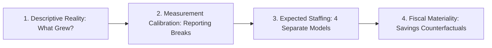
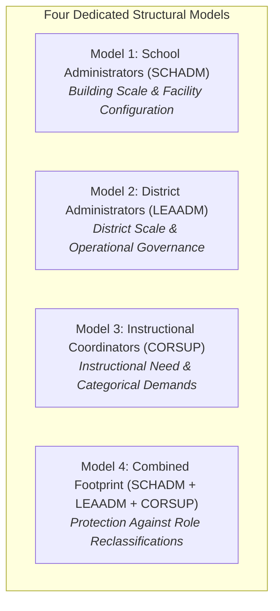

# Research Questions & Original Design (Archival Reference)

> [!NOTE]
> **Historical Design Document:** This document records the initial exploratory research design and preliminary Build 1 scoping. For the certified final econometric framework, stopping rules, and empirical results, consult [`research/methods.md`](methods.md).

**Project:** Kansas City Administrative Staffing Intensity Decomposition  
**Status:** Archival Research Design (Superseded by `research/methods.md`)  
**Date:** October 1, 2026  
**Scope:** Bi-State Kansas City Metropolitan Area (9 MARC Counties)

---

## 1. The Refined Central Research Question

Build 1 revealed that traditional district-level administration has not experienced an explosive expansion across the Kansas City region. Instead, non-classroom growth has been heavily concentrated in instructional coordination, curriculum facilitation, and instructional coaching.

The core research inquiry therefore sharpens into a much more specific, tractable investigation:

> **Why has school-system instructional coordination capacity expanded so substantially while traditional district-level administration has not expanded at anything like the same rate; which observable structural, demographic, and categorical demands explain that divergence; and how financially material would alternative administrative staffing levels actually be?**

We disentangle this phenomenon through four distinct empirical stages:

---

## 2. Decoupled Empirical Stages

### Stage 1: Did Administration Actually Grow, and What Grew?
We decompose non-teaching personnel changes into mutually exclusive functional roles across five simultaneous metrics:
1. Staffing FTE per 1,000 students
2. Staffing FTE per 100 classroom teachers
3. Staffing share of total district payroll FTE (%)
4. School building administrators per operating school facility
5. Absolute FTE change ($\Delta \text{FTE}$)

$$\Delta \text{Non-Teaching} = \Delta \text{Principals} + \Delta \text{Central Admin} + \Delta \text{Instructional Coordinators} + \Delta \text{Counselors} + \Delta \text{Paras} + \Delta \text{Operations}$$

In the balanced cohort of 55 regular school districts present across the modern reporting era (2014–15 to 2024–25):
* Enrollment fell **-1.2%** (-3,994 pupils)
* Classroom teachers grew **+7.0%** (+1,446.9 FTE)
* District central administrators (LEAADM) grew **+1.1%** (+1.9 FTE — virtually flat)
* **Instructional coordinators (CORSUP) grew +49.8% (+249.9 FTE)**

Instructional coordinators accounted for **89.5% of all net administrative/supervisory growth** across the balanced regular cohort *(preliminary estimate using the uncorrected 2024-25 endpoint; reconciled in Phase 1.1 to 48.5% across the clean 2014–2023 window)*.

---

## 3. Stage 2: Measurement Calibration & Stopping Rules

Before running statistical models, every outcome variable must satisfy longitudinal comparability:

> [!IMPORTANT]
> **Methodological Stopping Rule:** If an outcome construct cannot pass a longitudinal comparability audit due to state reporting artifacts or survey voids, we **do not** estimate long-run explanatory models on that isolated series.

### Established Comparability Regimes
1. **Instructional Coordinators (`CORSUP`):**
   - *2014–2024:* Fully comparable. Primary outcome for the balanced regular cohort.
   - *2004–2014:* Subject to title reclassification in Missouri (2014) and unreporting in Kansas (pre-2009). Must be evaluated jointly with central line administration (`LEAADM + CORSUP`).
2. **District Administrators (`LEAADM`):**
   - *2014–2024:* Fully comparable central executive series.
   - *2004–2014:* Subject to Missouri 2014 reclassification into CORSUP. Analyzed jointly as `LEAADM + CORSUP`.
3. **School Administrators (`SCHADM`):**
   - *2014–2023:* Fully comparable building leadership series (+23.7% in balanced cohort, tracking building expansions).
   - *2024–2025:* Kansas CCD line 059 omitted Assistant Principals. Regressions must incorporate state $\times$ year fixed effects or sensitivity exclusions for Kansas in 2024–25.
4. **Student Support Services:**
   - *Guidance Counselors (`GUI`):* Clean, stably reported 20-year series (+20.4% growth).
   - *Broad Student Support (`STUSUP`):* **FAILS longitudinal comparability.** Quarantined due to a 2016–2018 reporting void in NCES extracts (where large districts reported 0.0). No long-run models will be run on broad STUSUP.

---

## 4. Stage 3: Expected Staffing Models (Phase 2 Design)

Rather than estimating a single coarse administrative regression, we estimate **four separate, tailored econometric models** corresponding to distinct organizational functions:

### 4.1 Primary Specifications

We model **FTE directly** as the dependent variable rather than ratios, avoiding mechanical correlation with enrollment:

#### Model 1: School Administrators (Building Leadership)
$$\text{SCHADM}_{it} = \alpha_i + \gamma_{\text{state} \times \text{year}} + \beta_1 \text{Enrollment}_{it} + \beta_2 \text{Schools}_{it} + \beta_3 \text{AverageSchoolSize}_{it} + \varepsilon_{it}$$
* *Structural Hypothesis:* Principals and assistant principals scale with physical attendance centers and grade configurations rather than aggregate district enrollment.

#### Model 2: District Line Administrators (Central Executive Management)
$$\text{LEAADM}_{it} = \alpha_i + \gamma_{\text{state} \times \text{year}} + \beta_1 \text{Enrollment}_{it} + \beta_2 \text{Schools}_{it} + \beta_3 \text{CurrentExpenditure}_{it} + \varepsilon_{it}$$
* *Structural Hypothesis:* Baseline central leadership exhibits fixed-cost dilution and scales weakly with enrollment once basic governance functions are established.

#### Model 3: Instructional Coordinators & Coaches (The Primary Growth Locus)
$$\text{CORSUP}_{it} = \alpha_i + \gamma_{\text{state} \times \text{year}} + \beta_1 \text{Teachers}_{it} + \beta_2 \text{IEPShare}_{it} + \beta_3 \text{ELShare}_{it} + \beta_4 \text{ChildPoverty}_{it} + \sum_k \theta_k \text{CategoricalRevenue}_{it}^k + \varepsilon_{it}$$
* *Structural Hypothesis:* Instructional coordination capacity responds to instructional complexity: teacher counts, high-need student populations, and categorical federal program funding (Title I, IDEA Part B, Title II, Title III).

#### Model 4: Broad Supervisory Footprint (Combined Reclassification-Robust Model)
$$\text{TotalAdminCoord}_{it} = \alpha_i + \gamma_{\text{state} \times \text{year}} + \mathbf{X}_{it}' \boldsymbol{\beta} + \varepsilon_{it}$$
* *Protection:* Ensures that substitution between district directors and curriculum coordinators does not distort total managerial intensity.

### 4.2 Econometric Specifications
* **District Fixed Effects ($\alpha_i$):** Absorbs time-invariant district characteristics, geography, and historical governance culture.
* **State $\times$ Year Fixed Effects ($\gamma_{\text{state} \times \text{year}}$):** Absorbs state policy shifts, state reporting reclassifications (e.g., Kansas 2024–25 SCHADM omission, Missouri 2014–15 CORSUP shifts), and statewide economic shocks.
* **Standard Errors:** Clustered at the school district level.
* **Primary Sample:** Balanced cohort of 55 continuous regular school districts. Charters and specialized state agencies are analyzed in separate sensitivity specifications.

---

## 5. Interpreting the Residual & Grouped Shapley Decomposition

### 5.1 Defining the Residual: "Unexplained District-Year Staffing Deviation"
A regression residual is **not** synonymous with "waste" or "discretionary bloat":
$$\varepsilon_{it} = \text{Discretionary Bureaucracy} + \text{Unmeasured Student Needs} + \text{Measurement Timing} + \text{Purchased-Services Substitution} + \text{Specific Grant Structures} + \dots$$

Persistent, multi-year positive residuals ($\varepsilon_{it} > +1.5 \text{ SD}$ across 3+ consecutive years) serve as the **objective sampling mechanism for Phase 3 qualitative board-document audits**, rather than single-year anomalies.

### 5.2 Grouped Shapley Decomposition (Explanatory, Not Causal)
Because student need, teacher counts, and federal grant revenues are highly collinear, we perform a **Grouped Shapley Decomposition** partitioned into four conceptual covariate families:
1. **Scale and Physical Structure:** Enrollment, school counts, average school size.
2. **Student Need:** IEP share, EL share, Census SAIPE child poverty.
3. **Categorical Program Funding Load:** Title I Part A revenue, IDEA Part B revenue, Title II/III/IV revenues.
4. **General Operational Factors:** Current operating revenues/expenditures, purchased professional services.

> [!NOTE]
> **Causal Boundary:** Grouped Shapley produces an **explanatory accounting of model-predicted change**, not causal claims. Federal categorical revenues are endogenous: high-need districts qualify for higher allocations, and organizational capacity influences grant acquisition.

---

## 6. Stage 4: Fiscal Materiality Counterfactuals

Using matched administrator and coordinator salary and benefit figures from KSDE SO66, Missouri MCDS, and Census F-33 files, we simulate three counterfactual regimes:
1. **Historical Intensity Benchmark:** District staffed at its 2014 administrative intensity per pupil.
2. **Regional Peer Median Benchmark:** District staffed at the regional peer median for its enrollment and urbanicity cohort.
3. **Targeted Coordination Truncation:** District reduces 25% of instructional coordinator FTE while holding building principals and student support constant.

$$\text{Projected Savings} = \sum_k \left( \text{Actual FTE}_{ik} - \text{Counterfactual FTE}_{ik} \right) \times \left( \text{Salary}_{ik} + \text{Benefits}_{ik} \right)$$
$$\text{Deficit Materiality Share} = \frac{\text{Projected Savings}}{\text{Operating Budget Deficit}}$$

This answers whether alternative administrative staffing levels represent a \$500,000 symbolic issue in a \$350 million budget (0.14%) or a material fiscal mechanism for structural deficits.
