# Frozen Staff Taxonomy & Crosswalk Specification

**Project:** Kansas City Administrative Staffing Intensity Decomposition  
**Status:** Frozen Baseline (Build 1)  
**Date:** October 1, 2026  
**Scope:** Bi-State Kansas City Metropolitan Area (9 MARC Counties: Jackson, Clay, Platte, Cass, Ray [MO]; Johnson, Wyandotte, Leavenworth, Miami [KS])

---

## 1. Principles of the Taxonomy

In public debates over school district operations, critics frequently collapse all non-classroom personnel into a single pejorative label: "administrators" or "bureaucrats." Conversely, district communications often swing to the opposite extreme, claiming that virtually all non-classroom staff are "supporting students in schools."

Neither framing permits scientific investigation. To rigorously decompose administrative staffing intensity, the taxonomy must adhere to four immutable principles:

1. **Mutual Exclusivity and Exhaustiveness:** Every reported full-time equivalent (FTE) in a public school district belongs to exactly one top-level category. The sum of all categories equals total district employment.
2. **Strict Quarantine of Student Support Services:** School counselors, psychologists, social workers, nurses, and speech pathologists must **never** be classified as administrators. They provide direct clinical, mental health, and physical support to children. Mashing student support into "administrative growth" distorts policy reality.
3. **Disaggregation of Core Management vs. Instructional Support:** Building principals, superintendents, and central office managers direct personnel, evaluate employees, and hold legal authority. In contrast, instructional coordinators, curriculum specialists, and coaches generally lack direct evaluative or executive line authority over school facilities. Lumping instructional coordinators into "central office bloat" obscures whether growth reflects supervisory expansion or instructional coaching initiatives.
4. **Distinction Between Direct Employees and Contracted Services:** Headcount and FTE measures capture direct district payroll. When districts outsource IT, transportation, legal counsel, or therapies, direct FTE declines while purchased services rise. The staffing panel must be read alongside F-33 functional expenditure accounts to avoid false conclusions regarding "downsizing."

---

## 2. Canonical Staffing Categories (Top-Level Buckets)

```mermaid
flowchart TD
    TotalStaff["Total District FTE"] --> DirectInstruction["1. Direct Instruction"]
    TotalStaff --> CoreManagement["2. Core Management"]
    TotalStaff --> InstructionalAdmin["3. Instructional Admin & Support"]
    TotalStaff --> ProgramCompliance["4. Program & Compliance Admin"]
    TotalStaff --> BusinessOps["5. Business & Operations Admin"]
    TotalStaff --> StudentSupport["6. Student Support Services (Quarantined)"]
    TotalStaff --> OperationalAux["7. Operations & Auxiliary Staff"]

    DirectInstruction --> Teachers["Classroom Teachers (K-12 & Pre-K)"]
    DirectInstruction --> Paras["Paraprofessionals & Aides"]

    CoreManagement --> ExecCentral["Superintendent & Cabinet"]
    CoreManagement --> CentralAdmin["LEA Central Office Directors"]
    CoreManagement --> BuildingAdmin["School Principals & APs"]

    InstructionalAdmin --> Coordinators["Curriculum & Instructional Coordinators"]
    InstructionalAdmin --> Coaches["Instructional Coaches & PD Staff"]

    ProgramCompliance --> SpedDir["Special Education Directors/Supervisors"]
    ProgramCompliance --> FederalProg["Title I / Federal Programs Directors"]
    ProgramCompliance --> AssessTech["Assessment & Compliance Directors"]

    BusinessOps --> FinanceHR["Finance, Payroll & HR Directors"]
    BusinessOps --> FacilitiesIT["Facilities, Purchasing & IT Directors"]

    StudentSupport --> Counselors["School Counselors"]
    StudentSupport --> PsychSoc["Psychologists & Social Workers"]
    StudentSupport --> HealthTherapy["Nurses & Speech Therapists"]

    OperationalAux --> Clerical["Secretaries & Office Support"]
    OperationalAux --> FacilitiesMaint["Custodial, Maintenance & Food Service"]
    OperationalAux --> Transport["Bus Drivers & Logistics"]
```

### Bucket 1: Core Management (`core_management`)
*Definition:* Executive and supervisory personnel holding statutory, supervisory, and evaluative authority over district operations, educational programs, or school buildings.
* **1A: Executive Central Leadership (`superintendent_deputy_fte`)**: Superintendent, associate/deputy superintendents, chief academic officers, chief operations officers.
* **1B: Central Office Administration (`lea_administrators_fte`)**: Directors, assistant superintendents, and area supervisors who oversee district-wide operational or educational divisions.
* **1C: School Building Administration (`school_administrators_fte`)**: Head principals, assistant principals, and building vice principals assigned to individual attendance centers.

### Bucket 2: Instructional Administration & Support (`instructional_admin_support`)
*Definition:* Non-classroom certified or specialized personnel tasked with curriculum design, instructional coaching, professional development, evaluation systems, and instructional technology implementation.
* Roles: Curriculum directors, instructional coordinators, instructional coaches, in-service trainers, Title II professional development specialists, CAI (computer-assisted instruction) coordinators.
* *Analytical Significance:* Nationally, instructional coordinators grew +111% between 2004 and 2022 (NCES Digest of Education Statistics Table 213.10), representing the fastest growing non-teaching category. Isolating this bucket prevents confusing coaching expansions with executive office growth.

### Bucket 3: Program & Compliance Management (`program_compliance_admin`)
*Definition:* Specialized administrative personnel managing compliance mandates, state/federal categorical programs, targeted grant programs, or legally protected student rights.
* Roles: Special Education directors and supervisors, Title I / Federal Programs directors, Section 504 coordinators, English Learner (EL) directors, Assessment / Testing / Accountability directors, CTE (Career & Technical Education) directors, Student Health directors.
* *Analytical Significance:* Directly tests the hypothesis that federal accountability mandates (NCLB, ESSA, IDEA Part B, Title III) drove bureaucratic expansion.

### Bucket 4: Business & Operations Administration (`business_operations_admin`)
*Definition:* Professional non-instructional administrative personnel overseeing corporate, financial, physical plant, legal, and human capital infrastructure.
* Roles: Chief Financial Officers (CFOs), HR directors, directors of purchasing, risk managers, facilities directors, IT and network infrastructure directors, data warehouse directors.
* *Analytical Significance:* Tracks administrative overhead driven by institutional complexity, cybersecurity, capital programs, and competitive labor markets.

### Bucket 5: Student Support Services (`student_support_services`) — *Quarantined*
*Definition:* Certified and licensed pupil service professionals delivering direct emotional, psychological, medical, and counseling services to students.
* Roles: School counselors, clinical and school psychologists, licensed social workers, registered nurses (RN/LPN), speech-language pathologists, audiologists.
* *Analytical Significance:* **Must never be categorized as administration.** Rising mental health distress and special education needs have driven substantial growth in this category; attributing this growth to "administrative bloat" constitutes an empirical error.

### Bucket 6: Classroom & Direct Instruction (`classroom_instruction`)
*Definition:* Instructional staff providing direct educational instruction to students in classroom environments.
* Roles: Classroom teachers (Pre-K, Kindergarten, Elementary, Secondary, Ungraded), Special Education teachers, CTE teachers, Reading specialists, Paraprofessionals, and instructional aides.

### Bucket 7: Operational & Auxiliary Staff (`operations_auxiliary`)
*Definition:* Classified, operational, and non-certified personnel maintaining physical facilities, transportation, meal services, and administrative clerical workflows.
* Roles: School building secretaries, district central office clerical staff, bus drivers, custodial and maintenance technicians, cafeteria workers, security officers.

---

## 3. Crosswalk Matrix: Federal CCD, Kansas KSDE SO66, and Missouri Core Data

Because public reporting systems use varying statutory nomenclatures, the table below establishes the explicit crosswalk across the federal Common Core of Data (CCD), Kansas State Department of Education (KSDE) SO66 reporting, Missouri Department of Elementary and Secondary Education (DESE) Core Data / MOSIS, and Census F-33 Finance Survey functions:

| Canonical Bucket | NCES CCD LEA Survey Field | KSDE SO66 Line Item | Missouri DESE Core Data / MOSIS Position | Census F-33 Finance Function |
| :--- | :--- | :--- | :--- | :--- |
| **1A: Exec Central** | `LEAADM` (component) | `Superintendent`, `Assoc./Asst. Superintendents` | Position Code `01` (Superintendent), `02` (Asst/Deputy Supt) | Function `2300` (General Administration, Board & Supt) |
| **1B: Central Admin** | `LEAADM` | `Administrative Assistants` (licensed area directors) | Position Code `05` (Director/Coordinator), `06` (Supervisor) | Function `2300` / `2500` (Central Support Services) |
| **1C: School Admin** | `SCHADM` | `Principals`, `Assistant Principals` | Position Code `07` (Head Principal), `08` (Assistant Principal) | Function `2400` (School Administration, Office of Principal) |
| **2: Instructional Admin** | `CORSUP` | `Instructional Coord./Supervisors`, `Other Curriculum Specialists` | Position Code `09` (Instructional Coach/Curriculum Specialist) | Function `2210` (Improvement of Instruction / Staff Training) |
| **3: Program Compliance** | Captured in `LEAADM` & `CORSUP` | `Dir./Supervisors Spec. Ed.`, `Dir./Supervisors Health`, `Dir./Supervisors CTE`, `All Other Dir/Supervisors` (Fed Progs) | Position Code `05`/`06` assigned to Program Duty Codes (SpEd, Title I, EL) | Function `2100` (Student Support Admin) / Function `2210` |
| **4: Business & Ops Admin** | `LEASUP` / `OTHSUP` (professional slice) | Non-Licensed Personnel: `Business Manager`, `HR Director`, `IT Director` | Position Code `03` (Business Manager/CFO), `04` (Human Resources Director) | Function `2500` (Business/Central Services: HR, Finance, IT) |
| **5: Student Support (Quarantined)** | `GUI`, `STUSUP` | `School Counselors`, `Clinical/School Psychologists`, `Nurses`, `Speech Pathologists`, `Social Workers`, `Audiologists` | Position Code `10` (Counselor), `12` (Psychologist), `13` (Social Worker), `14` (Nurse), `15` (Speech Path) | Function `2100` (Pupil Support Services: Health, Guidance, Psych) |
| **6: Direct Instruction** | `TOTTCH` (`PKTCH`, `KGTCH`, `ELMTCH`, `SECTCH`, `UGTCH`), `PARA` | `Practical Arts/CTE Teachers`, `Special Ed Teachers`, `Pre-School Teachers`, `Kindergarten Teachers`, `All Other Teachers` | Position Code `30` (Classroom Teacher), `31` (Special Ed Teacher), `50` (Instructional Paraprofessional) | Function `1000` (Direct Classroom Instruction) |
| **7: Operations / Aux** | `SCHSUP`, `LEASUP`, `OTHSUP` | Non-Licensed Personnel: `Custodial`, `Food Service`, `Transportation`, `Secretarial/Clerical` | Position Code `60` (Clerical), `70` (Custodial/Maintenance), `80` (Food Service), `90` (Transportation) | Function `2600` (Plant Ops), `2700` (Transportation), `3100` (Food) |

---

## 4. Operational Classification Rules for the Longitudinal Panel

1. **Federal NCES Baseline Panel:**  
   In the longitudinal CCD panel (`district_staff_year`), where fine sub-role position codes from state data are not yet uniformly linked, the panel preserves the exact federal nonfiscal reporting categories:
   - `teachers_k12_fte`: Classroom teachers serving grades K–12.
   - `school_administrators_fte`: Building principals and assistant principals (`SCHADM`).
   - `lea_administrators_fte`: Superintendent, assistants, and central office officials (`LEAADM`).
   - `instructional_coordinators_fte`: Curriculum, in-service, and instructional support supervisors (`CORSUP`).
   - `student_support_staff_fte`: Guidance counselors (`GUI`) and other specialized pupil support staff (`STUSUP`).
   - `paraprofessionals_fte`: Classroom instructional aides (`PARA`).
   - `school_admin_support_fte`: School office clerical and secretarial staff (`SCHSUP`).
   - `lea_admin_support_fte`: District office clerical and support staff (`LEASUP`).
   - `other_support_staff_fte`: Transportation, maintenance, cafeteria, and logistics staff (`OTHSUP`).
   - `total_staff_fte`: Total district employment (`STAFF`).

2. **Core Administrative Aggregates for Analysis:**
   - **`core_admin_fte`** $= \text{school\_administrators\_fte} + \text{lea\_administrators\_fte}$
   - **`instructional_program_admin_fte`** $= \text{instructional\_coordinators\_fte}$
   - **`total_admin_and_coordinators_fte`** $= \text{core\_admin\_fte} + \text{instructional\_program\_admin\_fte}$
   - **`student_support_staff_fte`** is tracked as an orthogonal capacity vector and is **never** added to administrative totals.

3. **Exception Handling:**
   - NCES negative missing codes (`-1` = missing, `-2` = not applicable, `-9` = suppressed) are converted to explicit `NaN` prior to any mathematical summation or ratio calculation.
   - True zero (`0.0`) is preserved and distinguished from unmeasured/missing.
