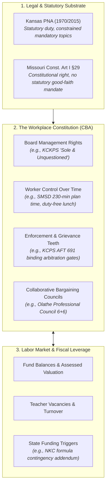

# Kansas City Education Labor Observatory (`kc_education_labor`)

A computational sketchbook reconstructing the distribution of power between educators, unions/associations, school district administrators, school boards, state legislatures, and the metropolitan labor market across Greater Kansas City.

---

## 1. Research Motivation: Power as an Observable Mechanism

Public debates surrounding teacher collective bargaining typically devolve into moral posturing: *"are unions good or bad?"*, *"are administrators obstructionist?"*, or *"are teachers paid enough?"* 

This project rejects those abstractions. A collective bargaining agreement (CBA) is a **workplace constitution**. It specifies the exact, legally enforceable boundary where administrative authority stops and worker rights begin.

### The Central Question
> **Who possesses the practical ability to make a decision, prevent a decision, compel negotiation, enforce an agreement, or make the other side bear a cost for saying no—and how does that distribution of power vary across the Kansas–Missouri state line and evolve over time?**

By disaggregating power into observable mechanisms, power ceases to be an ideological sentiment and becomes a structured, empirical dataset.



---

## 2. The Bi-State Natural Experiment

The Kansas City metropolitan area presents a unique institutional laboratory: two radically different legal and labor frameworks operating within a single, integrated regional labor market.

| Dimension | Kansas (e.g., SMSD, KCKPS, Olathe) | Missouri (e.g., KCPS, NKC, Independence, Park Hill) |
| :--- | :--- | :--- |
| **Foundational Law** | **Professional Negotiations Act (K.S.A. 72-2218 et seq., 1970)** | **Missouri Constitution Art. I §29 (1945)**; Public-sector statute (§105.510) excludes teachers |
| **Key Judicial Precedent** | *NEA-Shawnee Mission v. Board of Education* (212 Kan. 741, 1973) | *Independence-NEA v. Independence School District* (223 S.W.3d 131, 2007) |
| **Bargaining Duty** | Mandatory statutory obligation to negotiate in good faith with recognized organization | Constitutional right to organize and present proposals; public employers retain authority to reject proposals |
| **Domain of Bargaining** | **Constrained Mandatory Domain (2015 amendments):** Compensation and hours/amounts of work mandatory; each side may select up to 3 statutory subjects; all others require mutual consent | **Locally Negotiated:** Comprehensive scope possible under local board policy, but without statutory impasse machinery |
| **Right to Strike** | Explicitly prohibited by statute (K.S.A. 72-2230) | Prohibited under common law and general public employee doctrine |
| **Impasse Resolution** | Statutorily structured: Secretary of Labor declaration, mediation, fact-finding, unilateral board resolution | Local dispute resolution procedures; no statutory mediation/fact-finding machinery |

---

## 3. The 10 Observable Dimensions of Workplace Power

Rather than calculating a subjective "Union Power Score," we measure power across 10 concrete, decoupled dimensions:

1. **Legal Authority & Recognition:** Exclusive representation status, bargaining unit definitions, election thresholds, revocation procedures.
2. **Managerial Discretion:** Management-rights language, reservation of board prerogatives, transfer/reassignment autonomy, administrative scheduling rights.
3. **Worker Control Over Time:** Workday duration, duty days, elementary and secondary planning minutes during student contact hours, duty-free lunch, meeting caps, after-hours expectations.
4. **Compensation Architecture:** Base starting salary (BA Step 1), maximum salary (MA+ / PhD), step velocity, column step differentials, extra-duty stipends, health benefit contributions.
5. **Job Security & Due Process:** Just-cause standards, probationary periods, nonrenewal notification dates, reduction-in-force (RIF) criteria (seniority vs. performance evaluation).
6. **Enforcement & Grievance Teeth:** Steps in grievance ladder, timeline constraints, availability of external binding arbitration vs. board/superintendent finality.
7. **Organizational Capacity:** Association release time, access to district email/facilities, dues payroll deduction, board meeting speaking rights, joint standing committees.
8. **Fiscal Elasticity & Revenue Provenance:** Operating fund balances, local assessed valuation, state aid share, ESSER reliance, teacher payroll as a share of total operating expenditures.
9. **Economic Leverage:** Unfilled teacher vacancies, 3-year teacher retention rates, average experience steps, substitute teacher fill rates, alternative certification share.
10. **State Contingencies & Fiscal Pass-Through:** Contractual language tying raises to state foundation formula changes, legislative tax policy, or ballot levy outcomes.

---

## 4. The Focal Metropolitan Panel (Phase 1)

Phase 1 focuses on seven key districts representing contrasting institutional archetypes across the state line:

| District | State | Representation | Key Institutional Feature to Audit |
| :--- | :--- | :--- | :--- |
| **Kansas City, KS Public Schools (USD 500)** | KS | KCK-NEA / KNEA | Explicit *"sole and unquestioned"* board management rights; enforceable 8-hour workday and 186-day contract limits. |
| **Shawnee Mission Public Schools (USD 512)** | KS | NEA-Shawnee Mission | Rigidly protected elementary planning time (230 min/week) and duty-free lunch; high starting salary ($53,143). Historic litigant (*NEA-SM v. Board*, 1973). |
| **Olathe Public Schools (USD 233)** | KS | Olathe NEA | Collaborative bargaining archetype: 6-teacher, 6-admin Professional Council resolving compensation and working conditions. |
| **Kansas City Public Schools (KCPS)** | MO | Kansas City Federation of Teachers (AFT Local 691) | Urban core AFT contract; annual salary reopener; restricted binding arbitration (limited to nonpayment and class actions; superintendent finality on standard grievances). |
| **Independence School District** | MO | Independence-NEA (INNEA) | Historic epicenter of Missouri public labor rights (*Independence-NEA v. ISD*, 2007 Mo. Supreme Court ruling establishing constitutional bargaining rights). |
| **North Kansas City Schools** | MO | NKC-NEA | Collaborative Team for Teacher Negotiations (CTTN); sophisticated state-aid contingency escalator clauses. |
| **Park Hill School District** | MO | Park Hill NEA | Formal educator participation on policy/calendar committees while preserving elected board final approval authority. |

---

## 5. Linked Data Architecture

The observatory unifies three distinct, cryptographically audited data layers:

```text
contract_clause_panel.parquet  [district × agreement_id × clause_type × metrics]
        │
        ├── linked by nces_lea_id & school_year
        ▼
district_labor_panel.parquet   [district × school_year × staff_metrics × finance_metrics]
        │
        ├── linked by district & timestamp
        ▼
labor_events.parquet           [district × event_date × event_type × legal_citation]
```

### Sub-Module: Nonprofit Intermediary Employment (PREP-KC)
Educators working within non-LEA educational intermediaries (such as PREP-KC) operate under fundamentally distinct legal doctrines:
* Private 501(c)(3) at-will employment rather than public statutory collective bargaining.
* Reliance on philanthropic implementation grants rather than municipal tax levies.
* Employment policies governed by employee handbooks rather than bilaterally ratified contracts.

This investigation maintains a dedicated research branch in [`research/prep_kc_employment/`](research/prep_kc_employment/README.md) to evaluate intermediary power and working conditions without distorting public LEA panel data.

---

## 6. Directory Structure

```text
kc_education_labor/
├── README.md                            # Observatory master framework
├── data/
│   ├── raw/
│   │   ├── contracts/                   # Immutable PDF collective bargaining agreements
│   │   ├── statutes_caselaw/            # Legal rulings, PNA statute, MO Const §29
│   │   └── board_actions/               # Board packets, agendas, ratification minutes
│   ├── interim/                         # Text-extracted & parsed clause segments
│   ├── processed/                       # Primary analysis panels (Parquet / CSV)
│   └── manifest.csv                     # SHA256 cryptographic audit ledger
├── research/
│   ├── legal_chronology.md              # Historical case law & statutory evolution (1945–2026)
│   ├── taxonomy_and_codebook.md         # 10-dimension clause coding dictionary
│   └── prep_kc_employment/              # Non-LEA intermediary employment analysis
├── src/
│   ├── import_baseline_panels.py        # Harmonization from kc_admin_staffing & kc_education_capacity
│   ├── parse_contract_clauses.py        # PDF extraction & semantic clause tagging
│   └── analyze_labor_power.py           # Econometric & contractual power models
└── notebooks/
    ├── 01_focal_district_labor_baseline.ipynb
    └── 02_contract_clause_comparison.ipynb
```
