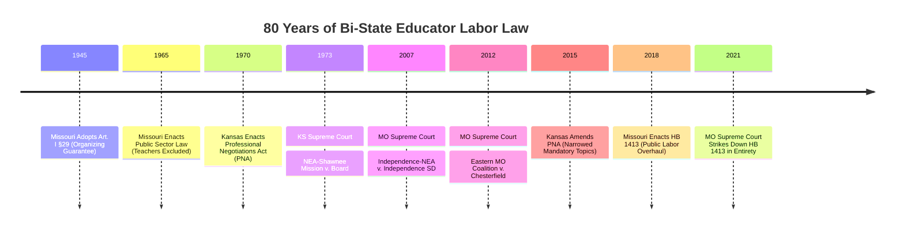

# Legal Chronology of Bi-State Kansas City Public Educator Labor Law

This document establishes the historical and legal foundation governing educator collective bargaining, statutory authority, and judicial doctrine across the Kansas City metropolitan area.

---

## 1. The Bi-State Legal Divergence

Kansas City educators work in a single metropolitan labor market split across two completely divergent legal architectures:

---

## 2. Chronological Case Law and Statutory Landmarks

### 1945: Missouri Constitutional Guarantee (Article I, Section 29)
* **The Text:** *"That employees shall have the right to organize and to bargain collectively through representatives of their own choosing."*
* **The Historical Context:** Adopted during the 1945 Constitutional Convention. For sixty years, Missouri courts held this guarantee applied solely to private sector employees (*City of Springfield v. Clouse*, 1947), leaving public sector workers without constitutional collective bargaining protection.

### 1965–1967: Missouri Public Sector Labor Law (RSMo § 105.510)
* **The Exclusion:** Missouri passed a statutory framework allowing public employees to meet and confer with public employers, but explicitly excluded:
  * Police and Missouri State Highway Patrol
  * National Guard personnel
  * **Teachers in Missouri public schools and universities**
* **Result:** Public school educators remained legally stranded outside the statutory labor framework.

### 1970: Kansas Enacts the Professional Negotiations Act (K.S.A. 72-2218 et seq.)
* **The Framework:** Kansas became one of the early states to establish a comprehensive statutory bargaining structure for public school educators (originally codified at K.S.A. 72-5413 et seq.).
* **Core Principles:**
  1. Professional employees have the right to form, join, or assist organizations, or refrain from doing so.
  2. School boards are legally required to recognize a majority organization and negotiate in good faith.
  3. Established statutory impasse procedures (mediation, fact-finding, and final board determination).
  4. Explicitly prohibited strikes and work stoppages (K.S.A. 72-2230).

### 1973: *NEA-Shawnee Mission v. Board of Education of USD 512* (212 Kan. 741)
* **The Dispute:** In Johnson County, KS, the Shawnee Mission school board asserted broad management rights, claiming it was only obligated to negotiate salary and sick leave, refusing to negotiate topics like planning time, class size, and grievance arbitration.
* **The Supreme Court Ruling:** The Kansas Supreme Court held that the PNA was intended to create meaningful collective negotiations. It ruled that "terms and conditions of professional service" must be liberally construed, extending beyond mere compensation to include working conditions, planning time, and grievance mechanisms.
* **Impact:** Established Shawnee Mission as the primary testing ground for teacher bargaining rights in Kansas.

### 2007: *Independence-NEA v. Independence School District* (223 S.W.3d 131)
* **The Epicenter:** Independence, Missouri (Jackson County). Independence-NEA sought recognition to collectively bargain for teachers. The school district refused, relying on the 1947 *City of Springfield v. Clouse* precedent and the teacher exclusion in RSMo § 105.510.
* **The Landmark Ruling:** The Missouri Supreme Court overturned 60 years of precedent, ruling 5–2 that **Article I, Section 29 of the Missouri Constitution applies to public employees, including public school teachers**.
* **Crucial Caveat:** The Court ruled that while educators have the constitutional right to organize and bargain collectively, public employers retain the sovereign authority to reject proposals, and the statutory meet-and-confer framework did not automatically apply to teachers without legislative action.

### 2012: *Eastern Missouri Coalition of Police v. City of Chesterfield* (386 S.W.3d 755)
* **Judicial Clarification:** Addressed the aftermath of *Independence-NEA*. The Missouri Supreme Court reaffirmed that while public employees possess the constitutional right to present collective proposals, Missouri does not impose a statutorily enforceable "duty to bargain in good faith" on public employers equivalent to the National Labor Relations Act (NLRA) or Kansas PNA.
* **Practical Effect:** Missouri school boards can meet, listen, and negotiate, but face minimal legal sanctions if they reject union proposals or terminate discussions unilaterally.

### 2015: Kansas PNA Overhaul (2015 SB 7 / K.S.A. 72-2218)
* **Legislative Retrenchment:** The Kansas Legislature substantially amended the Professional Negotiations Act to curtail union bargaining scope.
* **The Modern "Mandatory + 3" Rule:**
  * **Mandatory Subjects:** Only *Compensation* (salaries, stipends, insurance) and *Hours and Amounts of Work* (workday, work year, planning time) remain mandatory subjects of negotiation.
  * **Elective Subjects:** Each party (the Association and the Board) is permitted to select up to **three additional statutory subjects** from a specified list (such as leave, binding arbitration, staff reduction, evaluation procedures).
  * **Permissive Subjects:** All other subjects require mutual agreement before they can be placed on the bargaining table.
* **Streamlined Impasse:** Shortened the impasse timeline, requiring mediation and allowing earlier unilateral board action.

### 2018–2021: The Missouri HB 1413 Battle
* **The Statute (2018):** Missouri General Assembly enacted HB 1413, placing severe restrictions on public sector unions: mandatory annual recertification elections, restrictions on payroll deduction of dues, mandatory financial disclosures, and broad management-rights reservations.
* **The Strike-Down (2021):** In *Missouri National Education Association v. Missouri Department of Labor and Industrial Relations* (623 S.W.3d 585), the Missouri Supreme Court invalidated HB 1413 in its entirety on Equal Protection grounds because it arbitrarily exempted public safety unions (police, firefighters) from the harsh restrictions while subjecting educators to them.
* **Net Result:** Missouri teacher bargaining remains governed by the decentralized, constitutionally grounded *Independence-NEA* framework.

---

## 3. Comparative Summary: The Architecture of Prerogative

| Legal Feature | Kansas (Post-2015 PNA) | Missouri (Post-Independence-NEA) |
| :--- | :--- | :--- |
| **Statutory Duty to Bargain** | **Yes** (Strict duty under K.S.A. 72-2218) | **No** (Constitutional right to organize; no NLRA-style statutory bargaining duty) |
| **Scope of Bargaining** | **Severely circumscribed by statute** (Compensation + Hours + 3 Elective items per side) | **Defined by local policy & power** (Board discretion to broaden or narrow scope) |
| **Impasse Mechanism** | Statutorily governed: Secretary of Labor, mediator, fact-finder, unilateral board resolution | None in state statute; governed entirely by local board bargaining policy |
| **Binding Arbitration of Grievances** | Permissible by mutual agreement (or as one of 3 elective subjects) | Permissible by local agreement, but frequently restricted by board policy |
| **Strike Prohibition** | Express statutory prohibition (K.S.A. 72-2230) with injunctive relief | Common law prohibition; court injunctions |
