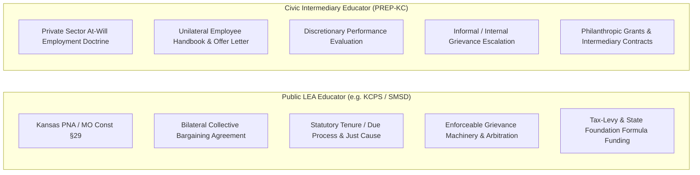

# PREP-KC & Non-LEA Intermediary Employment Analysis Branch

A comparative research framework evaluating employment rights, power distribution, and structural leverage within 501(c)(3) regional education intermediaries (such as PREP-KC) compared to public LEA collective bargaining agreements.

---

## 1. The Institutional Divergence: Public School vs. Intermediary

Educators working inside public school districts and educators working for civic intermediary organizations occupy fundamentally different legal, institutional, and economic ecosystems:

---

## 2. Core Differences in the Distribution of Power

| Structural Mechanism | Public LEA Teacher (CBA) | Nonprofit Intermediary Employee (PREP-KC) |
| :--- | :--- | :--- |
| **Legal Basis of Employment** | Bilateral collective contract with statutory backing | Individual offer letter; Common law "at-will" employment doctrine |
| **Right to Negotiate** | Exclusive statutory agent (NEA/AFT) negotiates collectively | Individual direct negotiation; no duty for employer to bargain |
| **Workplace Rules Origin** | Bilaterally negotiated and board-ratified CBA | Unilateral employer policy (Employee Handbook, modifiable at will) |
| **Workday & Workload Limits** | Strictly capped duty days (186–187) and daily hours (8.0); protected plan minutes | Exempt salaried status (FLSA exempt); undefined weekly hours; performance-based workload |
| **Discipline & Termination** | Progressive discipline, statutory tenure, just-cause standards | At-will termination without just-cause requirement (subject to anti-discrimination laws) |
| **Enforcement of Rights** | Multi-level contractual grievance with neutral third-party arbitration | Human Resources / executive leadership internal escalation; no independent arbitration |
| **Compensation Trajectory** | Transparent, publicly published step-and-column salary grid | Discretionary annual salary adjustments, individualized market-rate reviews |
| **Funding Provenance & Stability** | Municipal property tax base, state equalization formulas (perpetual statutory revenue) | Multi-year philanthropic grants (e.g., Kauffman, Hall Family), fee-for-service district contracts |

---

## 3. Investigating Intermediary Workplace Power

To map the actual distribution of power in a regional intermediary like PREP-KC, the analysis examines three specific document types:

1. **The Individual Offer Letter & Employment Agreement:**
   * Terms of appointment, salary basis, exempt/non-exempt FLSA classification, job description scope, notice requirements.
2. **The Organizational Employee Handbook:**
   * Paid time off (PTO) accrual, holiday schedules, remote/hybrid work policies, grievance/complaint escalation procedures, intellectual property assignments, outside employment restrictions.
3. **Institutional Funding Agreements:**
   * Grant deliverables, philanthropic covenants, performance milestones tied to foundation support (e.g. Kauffman Real World Learning grants), and district partnership contracts.

By keeping this investigation in a decoupled branch, we preserve the purity of the public-school econometric panels while providing rigorous, actionable clarity on intermediary employment conditions.
