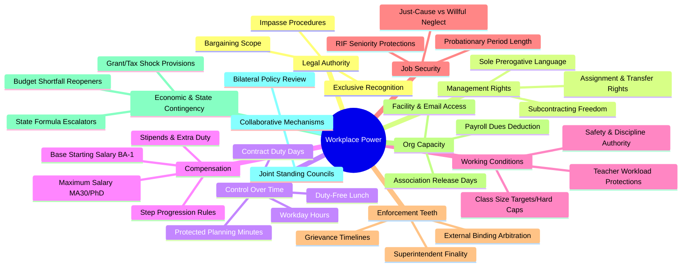

# Contract Clause Taxonomy & Codebook

A standardized coding framework for extracting, quantifying, and evaluating collective bargaining agreements across the Kansas City metropolitan area into `contract_clause_panel.parquet`.

---

## 1. The 10 Observable Dimensions of Workplace Power

Each analyzed contract provision is classified into one of ten substantive power dimensions:

---

## 2. Quantitative Metric Definitions & Subconstructs

### 2.1 Dimension: `WORKER_CONTROL_OVER_TIME`
* `duty_days_annual` (Integer): Total contracted working days for returning educators (e.g., 186 in KCKPS, 187 in SMSD).
* `workday_hours_daily` (Float): Contracted on-site duty hours per normal workday (e.g., 8.0 in KCKPS).
* `elementary_planning_minutes_weekly` (Integer): Legally protected individual preparation minutes per week during student contact hours (e.g., 230 in SMSD).
* `secondary_planning_periods_daily` (Integer): Guaranteed preparation periods per instructional day (e.g., 1 period).
* `duty_free_lunch_minutes` (Integer): Minimum guaranteed uninterrupted lunch without student supervision duties (e.g., 30 minutes).
* `mandatory_meeting_monthly_cap` (Integer): Maximum hours or count of mandatory after-school faculty/curriculum meetings.

### 2.2 Dimension: `MANAGEMENT_RIGHTS`
* `management_rights_scope` (Categorical):
  * `RESERVED_FULL_PREROGATIVE`: Board asserts sole, unquestioned authority except where expressly circumscribed (e.g., KCKPS Article I).
  * `STANDARD_STATUTORY`: Boilerplate recitation of state statutory governance powers.
  * `SHARED_GOVERNANCE`: Explicit contractual reservation of collaborative decision-making rights.
* `transfer_involuntary_protection` (Categorical):
  * `SUPERINTENDENT_UNILATERAL`: Administration retains sole discretion to reassign educators across buildings.
  * `SENIORITY_CONSIDERED`: Seniority is considered among multiple administrative criteria.
  * `SENIORITY_GOVERNS`: Involuntary transfer operates strictly in reverse seniority order.

### 2.3 Dimension: `GRIEVANCE_AND_ENFORCEMENT`
* `arbitration_availability` (Categorical):
  * `NONE_SUPERINTENDENT_FINAL`: Superintendent or elected board is the final arbiter of all grievances.
  * `ADVISORY_ARBITRATION`: External neutral issues non-binding recommendations to the board.
  * `RESTRICTED_BINDING_ARBITRATION`: External binding arbitration exists, but is strictly restricted to narrow categories (e.g., KCPS AFT 691: nonpayment of wages and class actions only).
  * `COMPREHENSIVE_BINDING_ARBITRATION`: Any alleged contract violation or disciplinary action is subject to final binding neutral arbitration (e.g., AAA or FMCS).
* `enforcement_teeth_score` (Integer 1–5):
  * `1`: Grievance ends at Superintendent with no external review.
  * `2`: Grievance ends at School Board with no external review.
  * `3`: Advisory arbitration with Board retaining ultimate override authority.
  * `4`: Binding arbitration available, but restricted by subject matter or procedural carve-outs.
  * `5`: Unrestricted binding arbitration for any dispute arising under the agreement.

### 2.4 Dimension: `COMPENSATION_ARCHITECTURE`
* `salary_base_ba_step1` (Float): Starting annual salary for an entering first-year bachelor's degree teacher.
* `salary_max_schedule` (Float): Top annual salary achievable on the unified salary grid (typically Step 25–30, MA+45 or Doctorate).
* `salary_schedule_columns_count` (Integer): Number of academic lane columns (e.g., BA, BA+12, BA+24, MA, MA+15, MA+30).
* `salary_schedule_steps_count` (Integer): Number of vertical experience steps.
* `annual_reopener_clause` (Boolean): Does the multi-year agreement mandate annual negotiations on compensation?

### 2.5 Dimension: `STATE_CONTINGENCIES`
* `state_funding_escalator` (Boolean): Does the contract include automatic salary upward adjustments tied to state foundation formula appropriation increases (e.g., North Kansas City 2025 addendum)?
* `revenue_shortfall_freeze_clause` (Boolean): Does the district hold contractual authority to freeze step/column movement in the event of state revenue shortfalls?

---

## 3. Data Schema for `contract_clause_panel.parquet`

| Column | Type | Description |
| :--- | :--- | :--- |
| `contract_id` | `string` | Unique slug: `[State]-[LEA_Slug]-[StartYear]_[EndYear]` (e.g. `KS-SMSD-2025_2027`) |
| `nces_lea_id` | `string` | 7-digit NCES LEA ID (e.g. `2010290`) |
| `district_name` | `string` | Official district name |
| `state` | `string` | State postal abbreviation (`KS` or `MO`) |
| `union_affiliation` | `string` | `NEA`, `AFT`, or `INDEPENDENT` |
| `contract_start_year` | `integer` | Effective initial school year |
| `contract_end_year` | `integer` | Expiration school year |
| `article_citation` | `string` | Article and section identifier (e.g., `Article IV, Section 2`) |
| `clause_title` | `string` | Section heading in the original document |
| `dimension` | `string` | One of the 10 standardized power dimensions |
| `subconstruct` | `string` | Standardized variable name (e.g., `elementary_planning_minutes_weekly`) |
| `metric_numeric` | `float` | Extracted numerical value, if applicable |
| `metric_unit` | `string` | Unit of measurement (`minutes_per_week`, `days`, `usd`, `score_1_to_5`) |
| `metric_categorical` | `string` | Standardized qualitative classification |
| `power_allocation` | `string` | `WORKER_PROTECTED`, `MANAGERIAL_PREROGATIVE`, `BILATERAL_SHARED`, `STATUTORY_DEFAULT` |
| `verbatim_excerpt` | `string` | Operative legal sentence(s) extracted from PDF |
| `page_number` | `integer` | Page number in official signed document |
