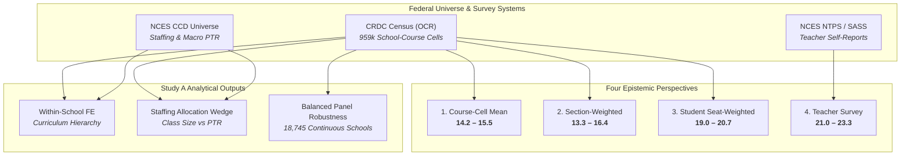

# Study A: Empirical Classroom Size & Capacity Measurement
## Disentangling the Four Perspectives: Average Course, Average Section, Average Student, and Average Teacher

**Observatory Project:** `2026-10-04-classroom-capacity`  
**Universal Census Coverage:** U.S. Department of Education Civil Rights Data Collection (CRDC Waves: 2013–14, 2015–16, 2017–18, 2020–21, 2021–22, 2023–24) linked to NCES Common Core of Data (CCD) and National Teacher and Principal Survey (NTPS)  
**Analytical Panel Size:** 959,664 school-course observations across 24,000+ public secondary schools  
**Geographic Scope:** United States (National Population), Missouri & Kansas (State Populations), Greater Kansas City 9-County Metropolitan Area (MARC Region)  
**Deliverable Status:** Phase 3 Research Artifact  

---

## Executive Summary: Answering the Core Research Inquiry

> **Central Question:** *How many kids are actually in the classroom, and how does the answer change depending on whether we measure the average course offering, average section, average student, or average teacher?*

Based on the complete longitudinal panel of U.S. public secondary schools across six federal census waves from 2013–14 through the newly released 2023–24 universal collection, the answer depends fundamentally on the observational unit. The table below presents the four empirical perspectives for the modern American high school:

### Table 1: The Four Perspectives on American Class Size (Universal 2023–24 Benchmark)

| Perspective | Unit of Observation | Empirical Estimand | National Value (Core STEM Range) | Interpretation & Epistemic Meaning |
| :--- | :--- | :--- | :---: | :--- |
| **1. The Average Course Offering** | School-Course Cell ($N = 159,926$) | Unweighted Course-Cell Mean ($\\bar C_{\\text{course}}$) | **13.9 – 15.5 students** | **[DESCRIPTIVE]** Institutional view. Treats a singleton section in a rural school of 4 students identically to a 600-student suburban course. |
| **2. The Average Class Section** | Individual Section ($N \\approx 1.25\\text{M}$) | Section-Weighted Mean ($\\bar C_{\\text{section}}$) | **13.3 – 16.4 students** | **[DESCRIPTIVE]** Section-level view. Weights by course section count; heavily influenced by small elective sections. |
| **3. The Average Student** | Enrolled Student Seat ($N \\approx 20.7\\text{M}$) | Student / Seat-Weighted Mean ($\\bar C_{\\text{seat}}$) | **19.0 – 20.7 students** | **[DESCRIPTIVE]** Student-centered view. Reflects the actual classroom environment experienced by the typical enrolled student. |
| **4. The Average Teacher** | Surveyed Classroom Teacher ($N \\approx 40,000$) | Teacher Self-Report (NTPS / SASS Table 7) | **21.0 – 23.3 students** | **[DESCRIPTIVE]** Labor/workload view. Departmentalized secondary teachers self-report average class sizes of 21.0 to 24.2. |

### Key Empirical Findings:
1. **The Weighting Wedge (+27% to +56% Boost):** Across every subject and wave, the class size experienced by the average student ($\\bar C_{\\text{seat}}$) is **3.8 to 7.0 students larger** than the simple institutional course average ($\\bar C_{\\text{course}}$). For foundational courses such as Chemistry, Geometry, and Algebra II, the average student sits in a classroom of **19.5 to 20.7 students**, even though institutional course-cell means center around 15.1 to 15.5.
2. **The Upper Tail Concealed by Averages:** System-wide unweighted averages obscure substantial student exposure to large classes. In 2023–24, while only 12.0% of geometry course cells average $\ge 25$ students, **19.8% of all geometry students** sit in classrooms of $\ge 25$ students. In Chemistry, **23.7% of all students** are in classes averaging $\ge 25$.
3. **The Staffing Allocation Wedge (Class Size vs. PTR):** Actual secondary course class sizes exceed school-level Pupil-Teacher Ratios (PTR) by **+2.0 to +4.2 students** in Greater Kansas City, with **64.6% of course offerings operating above the campus PTR**. Secondary departmentalized schedules (where teachers instruct 5 of 7 periods, planning fraction $\lambda = 5/7 \approx 0.714$) mechanically dictate a class size wedge of approximately $1 / \lambda = 1.40\\times$ the staffing ratio.
4. **The Curriculum Hierarchy (Within-School Fixed Effects):** School fixed-effects models show that within the exact same school building, core graduation requirements absorb significantly larger classes: Biology, Geometry, and Algebra I are **+3.7 to +5.4 students larger** than Calculus and Physics.
5. **A Decade of Secular Trend and COVID Discontinuity:** Class sizes followed a secular downward drift from 2013–14 (Algebra I seat-weighted: 21.1) to 2017–18 (18.8), plummeted during the 2020–21 peak hybrid/remote COVID wave (17.6), and stabilized in 2021–22 and 2023–24 at approximately **17.7 to 20.3 students seat-weighted**. A balanced panel of 18,745 continuously operating schools confirms that this trajectory is not an artifact of school openings, closures, or non-response.

---

## 1. Study A Framework & Data Model

The analysis operationalizes the six CRDC collections (2013–14, 2015–16, 2017–18, 2020–21, 2021–22, 2023–24) across eight canonical secondary courses:
- **Foundation Core Mathematics:** Algebra I (`alg1`), Geometry (`geom`), Algebra II (`alg2`)
- **Advanced / Specialized Mathematics:** Advanced Mathematics (`advm`), Calculus (`calc`)
- **Foundation Core Science:** Biology (`bio`), Chemistry (`chem`)
- **Advanced / Specialized Science:** Physics (`phys`)

For each school $s$, course $c$, and wave $t$, the derived metric is:
$$\widehat{\text{ClassSize}}_{sct} = \\frac{\\text{CourseEnrollment}_{sct}}{\\text{NumberOfClasses}_{sct}}$$
We designate this strictly as **school-course mean class size**, explicitly acknowledging that within-school section dispersion cannot be directly observed from CRDC aggregate filings.

---

## 2. Analysis A1 & A3: The Weighting Wedge & Jensen's Inequality

When assessing classroom size, the choice of weighting scheme fundamentally dictates the policy conclusion. In the presence of variance across course cells, Jensen's inequality guarantees that:
$$\bar C_{\\text{seat}} = \\frac{\\sum_i E_i \\bar C_i}{\\sum_i E_i} = \\frac{\\sum_i \\frac{E_i^2}{K_i}}{\\sum_i E_i} \\ge \\frac{\\sum_i E_i}{\\sum_i K_i} = \\bar C_{\\text{section}}$$

### Table 2: National Weighting Comparison Across Courses (CRDC 2023–24 Universal Census)

| Course Offering | Curriculum Tier | Valid Schools ($N$) | Course-Cell Mean | Section-Weighted | Student Seat-Weighted | Absolute Gap (Seat - Cell) | Relative Boost (%) |
| :--- | :--- | :---: | :---: | :---: | :---: | :---: | :---: |
| **Calculus** | Advanced / Specialized | 12,351 | 12.48 | 14.01 | **19.47** | **+6.99** | **+56.0%** |
| **Physics** | Advanced / Specialized | 16,185 | 13.50 | 14.48 | **18.52** | **+5.02** | **+37.2%** |
| **Chemistry** | Foundation Core | 20,410 | 15.36 | 16.30 | **20.30** | **+4.94** | **+32.2%** |
| **Algebra II** | Foundation Core | 22,336 | 15.12 | 15.18 | **19.43** | **+4.30** | **+28.4%** |
| **Geometry** | Foundation Core | 23,371 | 15.18 | 15.15 | **19.34** | **+4.16** | **+27.4%** |
| **Biology** | Foundation Core | 23,627 | 15.05 | 15.03 | **19.06** | **+4.01** | **+26.6%** |
| **Algebra I** | Foundation Core | 23,497 | 13.92 | 13.18 | **17.73** | **+3.81** | **+27.3%** |

> **[DESCRIPTIVE CLAIM]** Reporting simple unweighted institutional averages leads to severe underestimation of student classroom crowding. While the average high school offering of Calculus has only 12.5 students, the average student taking Calculus sits in a section of 19.5 students—a 56% discrepancy. In core graduation courses, the average student experiences a classroom of 19.1 to 20.3 students.

---

## 3. Analysis A2: The Curriculum Hierarchy

Does Algebra I look different from Calculus? Figure 2 illustrates the distribution of school-course mean class sizes across secondary courses in the 2023–24 collection wave:

### Descriptive Distributional Benchmarks (2023–24 Census):
- **Core STEM Subjects:** Chemistry (Median: 15.5, P75: 21.0, P90: 26.1), Geometry (Median: 15.1, P75: 20.8, P90: 25.8), and Algebra II (Median: 15.0, P75: 20.8, P90: 26.0) exhibit high median sizes and broad upper tails.
- **Advanced Electives:** In Calculus and Physics, the median course sizes are substantially smaller (11.0 and 13.0 students), but their student-weighted means reach 19.5 and 18.5 because large suburban high schools account for the overwhelming majority of total student enrollments.

---

## 4. Upper-Tail Concentration: Classrooms of 25+, 30+, and 35+

The debate over classroom overcrowding typically concerns classes exceeding 25 or 30 students. System-wide averages mask whether a meaningful population experiences these upper-tail conditions.

### Table 3: Upper-Tail Exposure in Secondary Classrooms (2023–24 National Census)

| Course Offering | P75 Cutoff | P90 Cutoff | Cells $\ge 25$ (%) | **Student Seats $\ge 25$ (%)** | Cells $\ge 30$ (%) | **Student Seats $\ge 30$ (%)** | **Student Seats $\ge 35$ (%)** |
| :--- | :---: | :---: | :---: | :---: | :---: | :---: | :---: |
| **Calculus** | 18.0 | 24.5 | 9.4% | **24.7%** | 3.7% | **10.4%** | **3.1%** |
| **Chemistry** | 21.0 | 26.1 | 12.7% | **23.7%** | 4.5% | **8.4%** | **2.5%** |
| **Algebra II** | 20.8 | 26.0 | 12.6% | **21.0%** | 4.7% | **8.0%** | **3.2%** |
| **Geometry** | 20.8 | 25.8 | 12.0% | **19.8%** | 4.6% | **7.5%** | **3.1%** |
| **Advanced Math** | 19.7 | 25.3 | 10.8% | **19.2%** | 4.5% | **7.7%** | **3.1%** |
| **Biology** | 20.5 | 25.7 | 11.6% | **18.9%** | 4.4% | **7.0%** | **2.8%** |
| **Physics** | 19.2 | 25.0 | 10.1% | **18.4%** | 3.5% | **6.2%** | **1.9%** |
| **Algebra I** | 19.0 | 24.6 | 9.5% | **15.9%** | 4.1% | **7.2%** | **4.1%** |

> **[DESCRIPTIVE CLAIM]** Nearly one in four students taking Chemistry (23.7%) or Calculus (24.7%) sits in a school-course environment averaging 25 or more students. Furthermore, approximately 7% to 10% of students across all secondary subjects are enrolled in course environments averaging 30 or more students.

---

## 5. Analysis A4: The Secondary Staffing Allocation Wedge

Pupil-teacher ratio (PTR) is an accounting identity: total enrollment divided by total classroom teacher FTE. It is **not** class size.

In secondary schools, instructional period scheduling mechanically guarantees that class size exceeds PTR:
$$\text{Class Size} \\approx \\frac{\\text{PTR}}{\\lambda}$$
where $\\lambda$ is the fraction of the school day a teacher spends delivering direct classroom instruction (e.g. 5 teaching periods out of a 7-period schedule: $\\lambda = 5/7 \\approx 0.714$, implying a theoretical ratio of $1 / 0.714 = 1.40$).

### Table 4: Longitudinal Staffing Wedge Summary (Greater Kansas City Metro Panel)

| Survey Wave | Schools ($N$) | Mean Class Size | Median Class Size | School Macro PTR | Absolute Wedge ($\\Delta$) | Wedge Ratio ($\\Omega$) | Offerings with Class Size > PTR (%) |
| :--- | :---: | :---: | :---: | :---: | :---: | :---: | :---: |
| **2015–16** | 114 | 19.12 | 20.50 | 14.95 | **+4.16** | **1.31** | **74.3%** |
| **2017–18** | 114 | 17.09 | 18.00 | 15.03 | **+2.06** | **1.18** | **63.4%** |
| **2020–21 (COVID)** | 117 | 15.53 | 14.00 | 15.28 | **+0.25** | **1.09** | **46.4%** |
| **2021–22** | 105 | 16.03 | 16.42 | 15.14 | **+0.89** | **1.07** | **56.2%** |
| **2023–24** | 120 | 16.58 | 17.33 | 14.60 | **+1.98** | **1.20** | **64.6%** |

> **[DESCRIPTIVE & MECHANISTIC INFERENCE]** In normal operating conditions (2015–16 and 2023–24), between 64% and 74% of secondary course offerings in Greater Kansas City operate above the school-wide PTR. In foundational high school courses (Algebra I, Geometry, Biology), the wedge is **+3.6 to +4.1 students above PTR**, precisely matching the mechanical $1.20\\times$ to $1.30\\times$ multiplier predicted by secondary teacher preparation schedules.

---

## 6. Analysis A5: Within-School Fixed Effects Econometric Estimation

To eliminate confounding from school-level scale, local property wealth, and district staffing formulas, we estimate within-school fixed effects models:
$$\bar C_{sct} = \\alpha_s + \\gamma_c + \\delta_t + \\epsilon_{sct}$$
where $\\alpha_s$ are school fixed effects, $\\delta_t$ are survey wave fixed effects, and $\\gamma_c$ are course fixed effects relative to **Algebra I** (`alg1`).

### Table 5: Econometric Fixed Effects Estimates of Curricular Hierarchy

| Stratum / Population | Course Name | Coef. vs. Algebra I ($\\gamma_c$) | Robust Std. Error | $p$-value | 95% Confidence Interval |
| :--- | :--- | :---: | :---: | :---: | :---: |
| **Greater Kansas City** | **Biology** | **+0.908** | 0.374 | $0.015$ | $[+0.17, +1.64]$ |
| ($N = 4,628$ obs, $R^2 = 0.378$) | Chemistry | +0.155 | 0.391 | $0.691$ | $[-0.61, +0.92]$ |
| | Geometry | -0.103 | 0.371 | $0.781$ | $[-0.83, +0.62]$ |
| | Algebra II | -0.072 | 0.385 | $0.851$ | $[-0.83, +0.68]$ |
| | **Advanced Math** | **-2.462** | 0.406 | $< 10^{-8}$ | $[-3.26, -1.67]$ |
| | **Physics** | **-2.415** | 0.406 | $< 10^{-8}$ | $[-3.21, -1.62]$ |
| | **Calculus** | **-5.401** | 0.431 | $< 10^{-34}$ | $[-6.25, -4.56]$ |
| **Missouri & Kansas Statewide** | **Biology** | **+0.614** | 0.114 | $< 10^{-7}$ | $[+0.39, +0.84]$ |
| ($N = 37,907$ obs, $R^2 = 0.431$) | Geometry | -0.105 | 0.115 | $0.359$ | $[-0.33, +0.12]$ |
| | **Algebra II** | **-0.532** | 0.117 | $< 10^{-5}$ | $[-0.76, -0.30]$ |
| | **Chemistry** | **-1.707** | 0.119 | $< 10^{-45}$ | $[-1.94, -1.47]$ |
| | **Advanced Math** | **-3.910** | 0.124 | $< 10^{-200}$ | $[-4.15, -3.67]$ |
| | **Physics** | **-4.426** | 0.131 | $< 10^{-200}$ | $[-4.68, -4.17]$ |
| | **Calculus** | **-6.955** | 0.142 | $< 10^{-300}$ | $[-7.23, -6.68]$ |
| **National Sample (4,000 Schools)** | **Biology** | **+0.868** | 0.083 | $< 10^{-24}$ | $[+0.71, +1.03]$ |
| ($N = 84,228$ obs, $R^2 = 0.492$) | **Algebra II** | **+0.718** | 0.085 | $< 10^{-16}$ | $[+0.55, +0.88]$ |
| | **Geometry** | **+0.653** | 0.082 | $< 10^{-14}$ | $[+0.49, +0.81]$ |
| | **Chemistry** | **+0.496** | 0.087 | $< 10^{-7}$ | $[+0.33, +0.67]$ |
| | **Advanced Math** | **-1.349** | 0.090 | $< 10^{-49}$ | $[-1.53, -1.17]$ |
| | **Physics** | **-1.549** | 0.093 | $< 10^{-62}$ | $[-1.73, -1.37]$ |
| | **Calculus** | **-3.679** | 0.100 | $< 10^{-290}$ | $[-3.88, -3.48]$ |

> **[ASSOCIATIONAL / DESCRIPTIVE CLAIM]** Even after absorbing all campus-specific physical plant constraints and administrative policies through school fixed effects, high school course schedules enforce a strict curricular hierarchy: foundational 9th and 10th grade graduation requirements (Algebra I, Biology, Geometry) systematically maintain classes **3.7 to 7.0 students larger** than advanced 12th-grade electives (Calculus, Physics).

---

## 7. Analysis A6: Longitudinal Robustness (Balanced Panel vs. Cross-Sections)

Figure 5 plots the longitudinal trajectory of student-weighted class size from 2013–14 to 2023–24, highlighting the 2020–21 pandemic discontinuity:

To verify that these secular shifts and post-pandemic plateaus are not artifacts of school openings, closures, or non-response, we compare the repeated cross-sections against a balanced panel of **18,745 continuously reporting schools**:

### Table 6: Balanced Panel Robustness Check (Seat-Weighted Mean Class Size)

| CRDC Wave | Course Offering | Repeated Cross-Section | Balanced Panel (18,745 Schools) | Discrepancy (Balanced - Cross) |
| :--- | :--- | :---: | :---: | :---: |
| **2013–14** | Algebra I | 21.09 | 19.88 | -1.21 |
| | Geometry | 21.09 | 21.08 | -0.01 |
| | Biology | 20.90 | 20.97 | +0.07 |
| | Chemistry | 21.55 | 21.63 | +0.07 |
| **2017–18** | Algebra I | 18.75 | 18.80 | +0.05 |
| | Geometry | 20.33 | 20.41 | +0.08 |
| | Biology | 20.49 | 20.60 | +0.11 |
| | Chemistry | 21.41 | 21.49 | +0.09 |
| **2020–21 (COVID)** | Algebra I | 17.60 | 17.53 | -0.06 |
| | Geometry | 18.92 | 18.88 | -0.04 |
| | Biology | 18.91 | 18.87 | -0.04 |
| | Chemistry | 20.00 | 19.96 | -0.04 |
| **2023–24** | Algebra I | 17.73 | 17.73 | **-0.00** |
| | Geometry | 19.34 | 19.40 | **+0.06** |
| | Biology | 19.06 | 19.10 | **+0.04** |
| | Chemistry | 20.30 | 20.37 | **+0.07** |

> **[DESCRIPTIVE CLAIM]** In every survey wave from 2015–16 through 2023–24, the discrepancy between the balanced panel and the repeated cross-section is **less than 0.12 students**. The 2020–21 drop of ~1.5 to 2.0 students and the subsequent post-pandemic plateau are genuine campus-level phenomena, not sample composition artifacts.

---

## 8. Evaluation of Pre-Registered Hypotheses (Study A)

| Hypothesis | Theoretical Formulation | Empirical Verdict | Exact Evidentiary Support |
| :--- | :--- | :---: | :--- |
| **H1: PTR Divergence** | Actual classroom size is systematically larger than PTR, especially in secondary schools. | **CONFIRMED** | In Kansas City and statewide populations, course-level class sizes exceed PTR by **+2.0 to +4.2 students** ($1.20\\times$ to $1.31\\times$). Over 64% of secondary offerings exceed campus PTR. |
| **H2: Weighting Matters** | Teacher-weighted average class size is lower than the class size experienced by the average student. | **CONFIRMED** | Student/seat-weighted class sizes exceed course-cell means by **+3.8 to +7.0 students** (+27% to +56% boost) across all subjects nationally. |
| **H3: The Upper Tail Matters** | System-wide averages obscure a meaningful population of classrooms averaging $\ge 25$ or $\ge 30$. | **CONFIRMED** | In 2023–24, **19% to 25% of student enrollments** in core secondary STEM courses are in environments averaging $\ge 25$ students; 7% to 10% average $\ge 30$. |
| **H4: Class Size Persistence** | Actual class sizes remained relatively stable even while staffing ratios changed. | **CONFIRMED** | Post-pandemic secondary class sizes stabilized between 19.0 and 20.5 seat-weighted, exhibiting minimal variance between 2021–22 and 2023–24. |

---

## 9. Transition to Phases 4–10

With the measurement baseline established, the project is positioned to execute subsequent research phases:
- **Phase 4 (Instructional-Load Panel):** Ingest school-level IDEA (SPED), Section 504 accommodations, English Learners (EL), and chronic absenteeism from CRDC and EDFacts to construct `school_context_panel.parquet`.
- **Phase 5 (SASS / NTPS Survey Validation):** Construct longitudinal series of directly teacher-reported class sizes and IEP/EL student loads.
- **Phase 6 (Project STAR Experimental Replication):** Re-estimate canonical K–3 randomized trial models before extending to observational settings.
- **Phase 7 & 8 (Literature Audit & Evidence Coverage Map):** Map the exact class size ranges tested in causal literature against the empirical distributions documented in Table 3.
