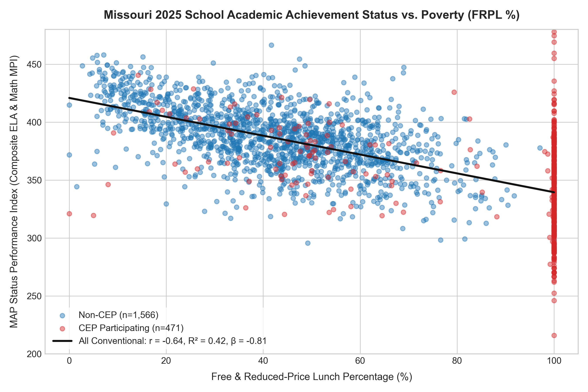
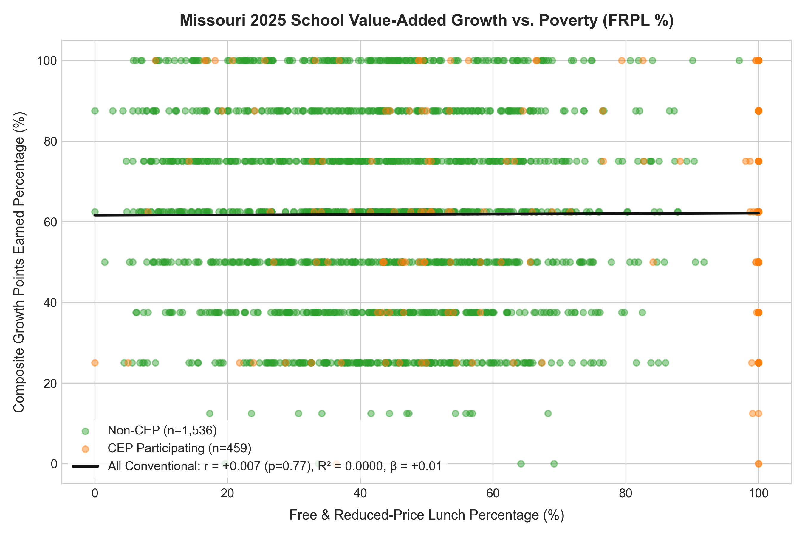
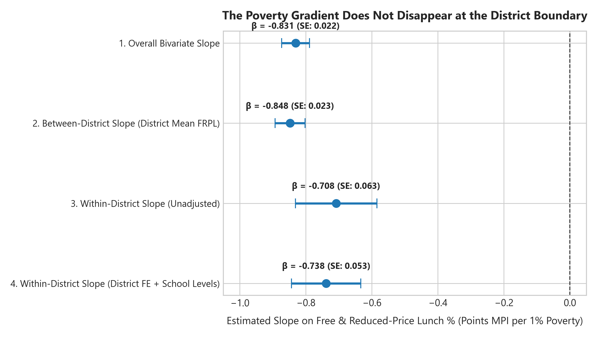
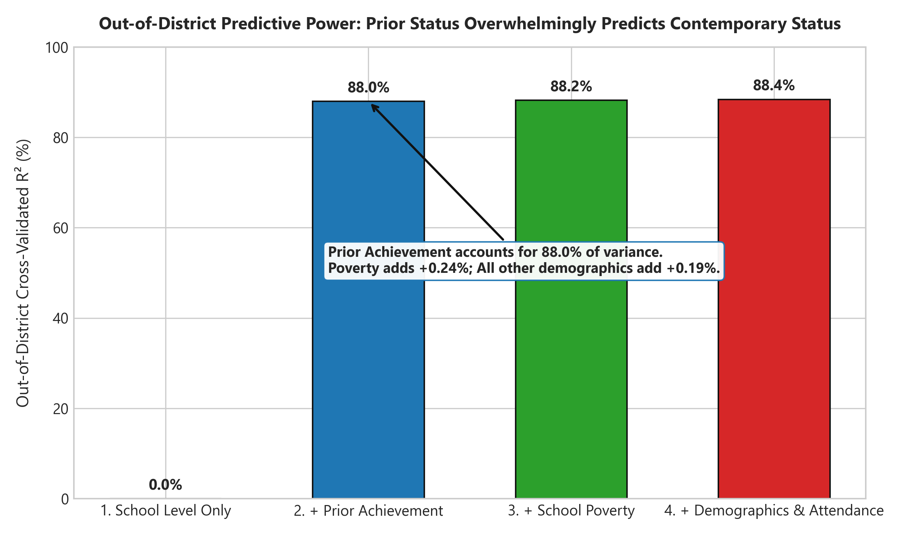
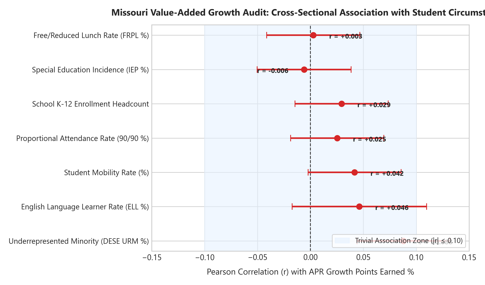
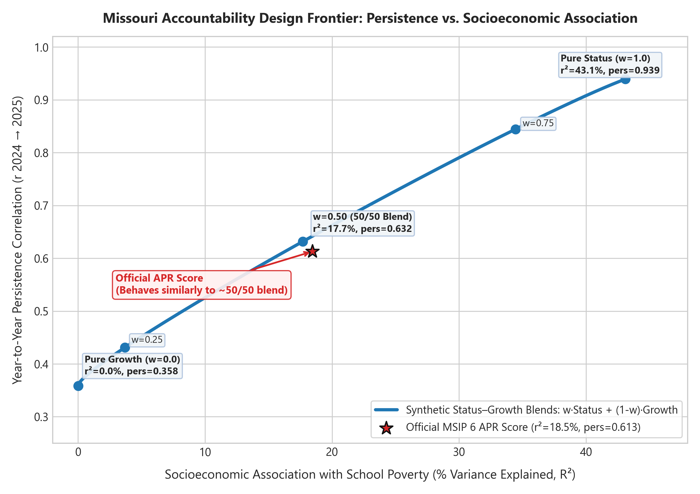
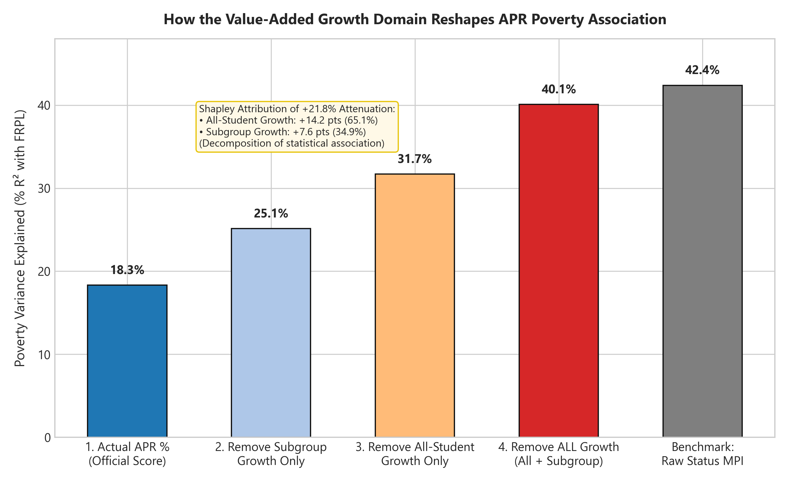
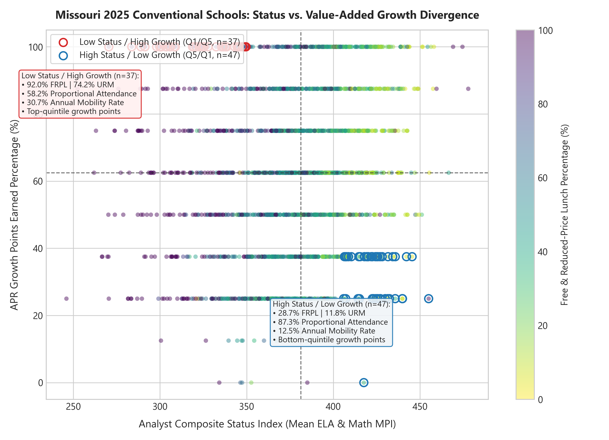

# What Does a School Score Measure?
## An Empirical Anatomy of Missouri's Public Accountability Signals

---

### Executive Summary

As Missouri prepares to release its first public A–F school ratings under the Missouri School Improvement Program (MSIP 6), state policymakers, educators, and the public face a foundational question: **When the state reports that a school is performing well or poorly, what is that metric actually capturing?** 

Does a school score reflect the academic progress students make while enrolled, or does it primarily track the socioeconomic characteristics and accumulated starting positions of the students who walk through the schoolhouse door?

This synthesis analyzes the complete 2022–2025 longitudinal universe of Missouri conventional public schools ($N = 2,031$ buildings in 2025 across 551 local education agencies). By decomposing the state's three primary public indicators—**Academic Achievement Status (MAP Performance Index, or MPI)**, **Value-Added Growth Points**, and the composite **Annual Performance Report (APR)** score—we establish four empirical facts:

1. **Two Opposing Academic Signals**: Absolute achievement status and value-added growth behave almost like statistical opposites. Achievement status is heavily stratified along socioeconomic lines ($r = -0.651, R^2 = 42.4\%$; enrollment-weighted $r_w = -0.720, R^2 = 51.9\%$). Value-added growth points, by contrast, are virtually orthogonal to school poverty ($r = +0.003, R^2 = 0.00\%$; weighted $r_w = -0.051$) and to non-poverty student demographics ($R^2 < 2.0\%$).
2. **The Within-District Reality**: The poverty–achievement gradient is not an artifact of sorting between wealthy suburbs and property-poor districts. Inside the same district and controlling for school grade levels, the within-district poverty slope is $\beta_{\text{within}} = -0.738$ (SE: $0.053, p < 0.0001$), closely matching the between-district slope ($\beta_{\text{between}} = -0.848$). Moreover, starting position is extraordinarily persistent: prior-year status predicts $88.0\%$ of next-year status out-of-district; adding school demographics and attendance adds less than half a percentage point of predictive power.
3. **The Accountability Design Frontier**: Accountability design confronts a fundamental, unavoidable statistical tradeoff between **demographic independence** and **longitudinal stability**. Achievement status is extraordinarily stable year-to-year ($r = 0.939$), but heavily tied to poverty. Growth points are demographically neutral, but significantly less persistent year-to-year ($r = 0.358$). Synthetic convex blends trace an empirical frontier: Missouri's official APR score ($R^2 = 18.32\%$, persistence $r = 0.621$) behaves almost identically to a 50/50 blend of status and growth.
4. **The Equalizing Role of Growth**: The growth domain exerts massive counterfactual leverage inside the APR. Removing all 48 available growth points increases the APR's association with poverty from $R^2 = 18.3\%$ to $R^2 = 40.1\%$—a $21.8$ percentage point surge. A two-component Shapley decomposition reveals that **All-Student Growth** contributes $65.1\%$ of this attenuation ($+14.18$ pts), while **Student-Group (Subgroup) Growth** contributes $34.9\%$ ($+7.60$ pts).

These findings demonstrate that single-year school ratings are not direct measurements of intrinsic "school quality" in the abstract. Instead, every composite rating reflects a specific, mathematically definable choice along the accountability design frontier.

---

### Section 1: The Dual Signal Architecture

Missouri's public accountability framework publishes two primary measures of academic performance for each building:

1. **Status (MAP Performance Index, MPI)**: A composite measure of student proficiency in English Language Arts (ELA) and Mathematics, scaling performance levels from Below Basic (100) to Advanced (500).
2. **Growth Points**: Discretized points derived from Missouri's student-level value-added model, which tracks student test-score gains relative to statewide peers with identical prior-year achievement histories.

These two measures exhibit radically different empirical relationships with school poverty, as measured by the building Free/Reduced-Price Lunch (FRPL) percentage.

| Metric | Bivariate Pearson $r$ with FRPL | Bivariate $R^2$ with FRPL | Enrollment-Weighted $r_w$ | Weighted $R_w^2$ | Direct Certification $r$ |
|:---|:---:|:---:|:---:|:---:|:---:|
| **Achievement Status (MPI Composite)** | **-0.6511** | **42.39%** | **-0.7204** | **51.90%** | **-0.6120** |
| **Value-Added Growth Points** | **+0.0027** | **0.0007%** | **-0.0508** | **0.26%** | **+0.0207** |
| **Official MSIP 6 APR Score (%)** | **-0.4280** | **18.32%** | **-0.5012** | **25.12%** | **-0.4011** |



```
Figure 1: Cross-school association of Academic Achievement Status (MPI Composite) with Free/Reduced-Price Lunch (FRPL %) across 2,027 conventional public schools in 2025. OLS trendline reveals steep socioeconomic stratification (R² = 42.4%).
```



```
Figure 2: Cross-school association of Value-Added Growth Points with FRPL % across 1,984 conventional public schools in 2025. The flat OLS line confirms statistical orthogonality (R² = 0.0007%).
```

The contrast is stark. Absolute achievement status is heavily stratified by student economic background: every 10 percentage point increase in school FRPL is associated with an 8.3-point decline in school MPI ($p < 0.0001$). When weighted by student enrollment ($r_w = -0.7204$), poverty accounts for more than half ($51.9\%$) of the cross-school variance in achievement status.

By contrast, the state's reported growth points measure is statistically orthogonal to school poverty ($r = +0.0027, p = 0.905$). High-poverty schools are just as likely to receive maximum growth points as low-poverty schools.

Crucially, **status and growth points are themselves decoupled**: their cross-school correlation is only $r = 0.2067$ ($R^2 = 4.27\%$). They do not measure two shades of the same underlying school attribute; they measure two independent dimensions of school performance.

---

### Section 2: The Micro-Foundations of Achievement Status

Why is achievement status so intensely associated with poverty? Two micro-level analyses clarify the mechanism: within-district sorting and starting-position stickiness.

#### Within-District vs. Between-District Slopes

A common hypothesis in educational sociology is that the poverty–test score relationship is primarily driven by sorting across district boundaries—that is, comparing well-funded suburban districts with fiscally constrained urban or rural districts. 

To test this, we decompose the total OLS slope of status on poverty into between-district and within-district components using local education agency (LEA) fixed effects.

$$\text{Status}_{is} = \alpha_d + \beta_{\text{within}} \cdot \text{FRPL}_{is} + \mathbf{X}_{is}\boldsymbol{\gamma} + \epsilon_{is}$$

| Model Specification | Slope ($\beta$) | Std. Error | 95% Confidence Interval | $p$-value | $N$ Schools |
|:---|:---:|:---:|:---:|:---:|:---:|
| **1. Total Bivariate OLS Slope** | -0.8310 | 0.0217 | [-0.8736, -0.7885] | $< 0.0001$ | 2,027 |
| **2. Between-District Slope (District Mean FRPL)** | -0.8477 | 0.0231 | [-0.8930, -0.8023] | $< 0.0001$ | 2,027 |
| **3. Within-District Slope (Unadjusted)** | -0.7079 | 0.0629 | [-0.8312, -0.5846] | $< 0.0001$ | 2,027 |
| **4. Within-District Slope (District FE + School Level Controls)** | **-0.7383** | **0.0535** | **[-0.8432, -0.6334]** | **$< 0.0001$** | **2,027** |



```
Figure 3: Forest plot comparing the total, between-district, and within-district regression slopes of Status (MPI) on FRPL (%). Inside the same district and controlling for grade span, the poverty slope remains beta = -0.738.
```

The within-district slope remains extraordinarily steep: inside the exact same school district, comparing schools of the exact same grade span (elementary, middle, or high), each 10 percentage point increase in FRPL is associated with a **7.38-point decline in school MPI** ($p < 0.0001$). The poverty–achievement gradient operates within districts just as powerfully as it does across district lines.

#### The Starting-Position Prediction Staircase

A second hypothesis is that current-year demographics explain large increments of school achievement after accounting for where students started. To evaluate this, we estimate sequential out-of-district prediction models using 5-fold district-grouped cross-validation (`GroupKFold` across 551 LEAs).

| Prediction Model | Out-of-District CV-$R^2$ | Out-of-District RMSE | Marginal $\Delta$ CV-$R^2$ | Marginal Gain Description |
|:---|:---:|:---:|:---:|:---|
| **Model 1: Prior Status Alone ($\text{Status}_{t-1}$)** | **87.95%** | **12.12 MPI pts** | — | Dominant starting-position baseline |
| **Model 2: Prior Status + Poverty (FRPL %)** | **88.19%** | **12.00 MPI pts** | **+0.24%** | Small incremental predictive gain |
| **Model 3: Prior Status + Poverty + Context + Attendance** | **88.38%** | **11.90 MPI pts** | **+0.19%** | URM, IEP, ELL, Mobility, Attendance (90/90) |
| **Model 4: Prior Status + Prior Growth ($\text{Growth}_{t-1}$)** | **88.31%** | **12.06 MPI pts** | **+0.12%** | Modest mean-reversion increment |



```
Figure 4: Out-of-district cross-validation R² across sequential predictive models. Prior-year status alone accounts for 87.95% of cross-school variance; contemporaneous poverty and student demographics add less than 0.5 percentage points.
```

The prediction staircase reveals that **prior achievement status functions as a sufficient statistic** for the stable, structural differences between schools. A single prior-year achievement score predicts $88.0\%$ of next-year achievement status for schools in entirely unseen districts. Adding contemporaneous student poverty, racial composition, special education rates, English learner rates, mobility rates, and proportional attendance improves out-of-district prediction by less than half a percentage point ($+0.43\%$).

This does not imply that student circumstances do not matter; rather, it demonstrates that whatever socioeconomic, structural, and institutional factors produce disparities in absolute test scores are already fully encoded into the school's historical baseline.

---

### Section 3: The Demographic Independence of Growth Points

While status is saturated with demographic signal, Missouri's reported growth points measure is almost completely independent of student characteristics.

To verify whether the growth model inadvertently tracks student circumstances other than poverty, we performed a comprehensive audit across seven school-level demographic and contextual variables in 2025:

| Demographic / Contextual Indicator | Bivariate $r$ with Growth | Std. Error | 95% Confidence Interval | $p$-value | Valid Cases ($N$) |
|:---|:---:|:---:|:---:|:---:|:---:|
| **Free/Reduced-Price Lunch (FRPL %)** | **+0.0027** | 0.0225 | [-0.0414, +0.0467] | 0.9055 | 1,984 |
| **Special Education Incidence (IEP %)** | **-0.0059** | 0.0227 | [-0.0503, +0.0385] | 0.7946 | 1,951 |
| **School Enrollment Headcount** | **+0.0294** | 0.0225 | [-0.0147, +0.0734] | 0.1914 | 1,982 |
| **Proportional Attendance (90/90 %)** | **+0.0253** | 0.0225 | [-0.0188, +0.0694] | 0.2609 | 1,976 |
| **Annual Student Mobility Rate (%)** | **+0.0417** | 0.0224 | [-0.0023, +0.0857] | 0.0632 | 1,984 |
| **English Language Learner (ELL %)** | **+0.0462** | 0.0324 | [-0.0173, +0.1098] | 0.1540 | 952 |
| **DESE Underrepresented Minority (URM %)** | **+0.0878** | 0.0224 | [+0.0439, +0.1316] | 0.0001 | 1,984 |



```
Figure 5: Bivariate correlation coefficients (with 95% confidence intervals) between reported Value-Added Growth Points and seven school-level demographic/contextual indicators. All individual correlations satisfy |r| < 0.09.
```

All seven bivariate correlations fall below $|r| < 0.09$. In a joint ordinary least squares model regressing growth points simultaneously on all seven contextual variables, the total explained variance is:

$$R_{\text{joint}}^2 = 0.0198 \quad (F = 2.76, p = 0.009, N = 932)$$

Less than $2.0\%$ of the variation in reported growth points is linearly associated with measured student demographics and contextual adversity. Missouri's student-level value-added model successfully isolates student academic progress from the observable demographic composition of the building.

---

### Section 4: The Accountability Design Frontier

Given that growth points are effectively independent of student poverty, a natural policy reaction is to ask: **Why not base school accountability entirely on growth?**

The empirical answer lies in a fundamental statistical tradeoff: **reliability versus demographic independence**.

Measures built from absolute achievement status are highly persistent over time, but heavily correlated with student socioeconomic status. Measures built from student growth are independent of student socioeconomic status, but exhibit much lower longitudinal persistence.

To formalize this dilemma, we construct synthetic accountability scores along a continuum of convex blends between standardized status ($Z_{\text{status}}$) and standardized growth ($Z_{\text{growth}}$):

$$\text{Score}(w) = w \cdot Z_{\text{status}} + (1 - w) \cdot Z_{\text{growth}}, \quad w \in [0, 1]$$

For each blend weight $w$, we calculate two quantities:
1. **Socioeconomic Association ($R^2$ with FRPL)**: How strongly the composite tracks school poverty.
2. **Year-to-Year Persistence ($r_{t, t-1}$)**: The Pearson correlation between consecutive school years (2024 $\to$ 2025).

| Weight on Status ($w$) | Weight on Growth ($1-w$) | Poverty Correlation ($r$) | Poverty Association ($R^2$) | Longitudinal Persistence ($r$) | Same Quintile (%) |
|:---:|:---:|:---:|:---:|:---:|:---:|
| **0.00 (Pure Growth)** | **1.00** | **+0.0045** | **0.00%** | **0.3584** | **33.2%** |
| 0.20 | 0.80 | -0.1480 | 2.19% | 0.4064 | 36.1% |
| 0.40 | 0.60 | -0.3396 | 11.53% | 0.5488 | 44.5% |
| **0.50 (Equal Blend)** | **0.50** | **-0.4206** | **17.69%** | **0.6322** | **49.7%** |
| 0.60 | 0.40 | -0.4913 | 24.14% | 0.7180 | 54.4% |
| 0.80 | 0.20 | -0.6025 | 36.30% | 0.8643 | 61.8% |
| **1.00 (Pure Status)** | **0.00** | **-0.6565** | **43.10%** | **0.9388** | **65.8%** |
| **Official APR Score** | — | **-0.4280** | **18.32%** | **0.6212** | **49.1%** |



```
Figure 6: The Accountability Design Frontier. The horizontal axis measures socioeconomic association (R² with FRPL); the vertical axis measures longitudinal stability (year-to-year Pearson r). The official MSIP 6 APR composite (red star) lands directly on the 50/50 synthetic blend.
```

The empirical curve in Figure 6 defines the **Accountability Design Frontier**:
* **Pure Growth ($w = 0.0$)**: Poverty $R^2 = 0.00\%$, but persistence is only $r = 0.3584$. Only $22.4\%$ of schools receive the exact same discrete point score the following year, and only $33.2\%$ remain in the same average rank quintile.
* **Pure Status ($w = 1.0$)**: Year-to-year persistence is extraordinarily high ($r = 0.9388$), with $65.8\%$ of schools remaining in the identical quintile. However, $43.1\%$ of cross-school variance is explained by poverty.
* **Official APR Score**: The official MSIP 6 APR composite ($R^2 = 18.32\%$, persistence $r = 0.6212$) sits almost directly atop the $50/50$ synthetic blend ($w = 0.50, R^2 = 17.69\%, r = 0.6322$). Although the APR incorporates additional non-academic indicators (proportional attendance, graduation rates, and college/career readiness), its statistical behavior is essentially that of an equal-weighted compromise between status and growth.

#### Multi-Year Pooling: The Spearman-Brown Projection

Can the lower persistence of growth be mitigated without sacrificing its demographic independence? 

In psychometrics, multi-year averaging is the classic remedy for measurement unreliability. Applying the Spearman-Brown prophecy formula to Missouri's single-year growth persistence ($\rho_1 = 0.3584$):

$$\rho_k = \frac{k \cdot \rho_1}{1 + (k - 1) \cdot \rho_1}$$

| Averaging Window ($k$) | Projected Reliability ($\rho_k$) | Observed Standard Deviation | Variance Reduction Factor |
|:---:|:---:|:---:|:---:|
| **1-Year (Single Year)** | **0.3584** | **23.96 pts** | 1.000 |
| **2-Year Average** | **0.5277** | **19.79 pts** | 0.826 |
| **3-Year Average** | **0.6262** | **17.16 pts** | **0.716** |

Pooling growth points over a three-year rolling window projects a reliability gain from $\rho_1 = 0.358$ to $\rho_3 = 0.626$—approaching the stability of the current APR composite while preserving near-zero correlation with school poverty.

However, pooling comes with an important empirical trade-off: **mechanical variance contraction**. Averaging over three years contracts the cross-school standard deviation from $23.96$ to $17.16$ points (a $28.4\%$ reduction in spread). While multi-year pooling represents a promising path toward stabilizing the growth signal, its implementation compresses the observable differences between schools and requires explicit validation against multi-cohort panel data.

#### Predictive Validity and Mean Reversion

Does a single year of high growth signal an enduring upward trajectory in academic achievement? 

Regressing next-year status on prior status and prior growth points reveals:

$$\text{Status}_{2025} = 14.21 + 0.976 \cdot \text{Status}_{2024} - 0.056 \cdot \text{Growth}_{2024} \quad (p < 0.001)$$

Holding prior achievement status constant, the conditional coefficient on prior growth is slightly **negative** ($\beta = -0.056$), and adding prior growth to out-of-district prediction models yields a negligible predictive increment ($\Delta \text{CV-}R^2 = +0.0012$). Single-year growth spikes do not forecast permanent structural gains; conditional associations instead reflect modest statistical mean reversion.

---

### Section 5: Inside the APR: How Growth Restrains Stratification

In Missouri's official MSIP 6 APR, schools can earn up to 48 growth points out of 116 total Academic Performance points (representing up to $41.4\%$ of the academic component):
* **All-Student Growth Points**: Up to 32 points (16 ELA + 16 Math).
* **Student-Group (Subgroup) Growth Points**: Up to 16 points (8 ELA + 8 Math).

How much does this growth domain alter the overall accountability outcome? We evaluate this by constructing audited counterfactual APR scores that arithmetically subtract the growth points from both the numerator (points earned) and denominator (points possible).

$$\text{APR}_{\text{No Growth}} = \frac{\text{Total Points Earned} - \text{Growth Points Earned}}{\text{Total Points Possible} - \text{Growth Points Possible}} \times 100$$

| APR Counterfactual Metric | Correlation with FRPL ($r$) | Association with FRPL ($R^2$) | Shift in $R^2$ vs Actual | Growth Domain Attenuation |
|:---|:---:|:---:|:---:|:---:|
| **Actual MSIP 6 APR Score** | **-0.4280** | **18.32%** | **Baseline** | — |
| **APR Excluding Subgroup Growth Only** | **-0.5014** | **25.14%** | **+6.82%** | Partial growth exclusion |
| **APR Excluding All-Student Growth Only** | **-0.5632** | **31.72%** | **+13.40%** | Major growth exclusion |
| **APR Excluding ALL Growth Points (Counterfactual)** | **-0.6332** | **40.09%** | **+21.77%** | **Complete growth exclusion** |



```
Figure 7: Waterfall decomposition showing the surge in APR poverty association (R²) as growth domains are counterfactually removed from the accountability index. Without growth, the APR-poverty R² jumps from 18.3% to 40.1%.
```

Removing all growth points increases the APR's association with poverty from $18.32\%$ to **$40.09\%$**—an increase of **$21.77$ percentage points**. Without the growth domain, the APR becomes almost as socioeconomically stratified as raw achievement status ($R^2 = 42.4\%$).

To determine which component of the growth framework provides this equalizing counterweight, we compute an exact two-component **Shapley decomposition** of the $21.77$ percentage point attenuation:

| Growth Component | Average Marginal Contribution to Attenuation ($\Delta R^2$) | Share of Total Attenuation (%) | Maximum Points in APR |
|:---|:---:|:---:|:---:|
| **All-Student Growth Points** | **+14.18 percentage points** | **65.11%** | 32 points |
| **Student-Group (Subgroup) Growth Points** | **+7.60 percentage points** | **34.89%** | 16 points |
| **Total Value-Added Growth Domain** | **+21.77 percentage points** | **100.00%** | 48 points |

All-Student Growth accounts for nearly two-thirds ($65.1\%$) of the attenuation, while Student-Group Growth provides the remaining third ($34.9\%$), precisely matching their 2:1 point allocation in the MSIP 6 scoring rubric. 

The growth domain operates as a powerful mathematical brake on the socioeconomic stratification of Missouri's accountability ratings.

---

### Section 6: Divergent Realities: Schools with Disconnected Signals

Because achievement status and growth points are decoupled ($r = 0.207$), hundreds of Missouri public schools tell completely contradictory stories depending on which metric is consulted.

Across 1,984 conventional schools with complete 2025 data, a quadrant analysis using median splits reveals that **between 16.9% and 25.5% of all conventional public schools** (335 to 506 schools, depending on median tie handling) fall into the **Low Status / High Growth** quadrant—schools serving high-poverty student populations that achieve above-average growth points.

To examine the depth of this divergence, we isolate schools in the **extreme opposing quintiles**:
* **Low Status / High Growth ($Q1_{\text{status}} / Q5_{\text{growth}}$)**: Bottom 20% in achievement status, top 20% in growth points ($N = 37$).
* **High Status / Low Growth ($Q5_{\text{status}} / Q1_{\text{growth}}$)**: Top 20% in achievement status, bottom 20% in growth points ($N = 47$).

| Student Demographic / Institutional Attribute | Low Status / High Growth ($Q1/Q5, N=37$) | High Status / Low Growth ($Q5/Q1, N=47$) | Conventional State Universe ($N=1,984$) |
|:---|:---:|:---:|:---:|
| **Free/Reduced-Price Lunch (FRPL %)** | **92.0%** | **28.7%** | 53.2% |
| **DESE Underrepresented Minority (URM %)** | **74.2%** | **11.8%** | 21.3% |
| **Special Education (IEP %)** | **13.2%** | **12.6%** | 14.0% |
| **English Language Learners (ELL %)** | **11.6%** | **4.8%** | 8.9% |
| **Proportional Attendance (90/90 %)** | **58.2%** | **87.3%** | 80.2% |
| **Annual Student Mobility Rate (%)** | **30.7%** | **12.5%** | 18.5% |
| **Average K–12 Enrollment** | **345 students** | **483 students** | 404 students |



```
Figure 8: Cross-school scatterplot of Achievement Status (MPI Composite) versus Value-Added Growth Points (%), colored by building FRPL (%). Highlighted callout ellipses identify the 37 Q1/Q5 divergent schools (high poverty, low status, top-tier growth) and the 47 Q5/Q1 divergent schools (low poverty, high status, bottom-tier growth).
```

The demographic profiles of these divergent groups are entirely distinct:
* The **37 Low Status / High Growth schools** operate in contexts of extreme economic and social adversity: average poverty is $92.0\%$, underrepresented minority enrollment is $74.2\%$, annual student mobility is $30.7\%$, and only $58.2\%$ of students meet the state's 90/90 proportional attendance standard. Yet, under Missouri's value-added model, these schools receive top-quintile growth points.
* The **47 High Status / Low Growth schools** operate in highly resourced environments: average poverty is $28.7\%$, underrepresented minority enrollment is $11.8\%$, student mobility is just $12.5\%$, and $87.3\%$ of students meet the attendance standard. Their absolute test scores are in the top quintile statewide, but they receive bottom-quintile growth points.

An accountability system based primarily on status would identify the first group as failing and the second as exemplary. An accountability system based primarily on growth would reverse those judgments.

---

### Section 7: Policy Implications: What Should an A–F Grade Measure?

As Missouri approaches the public rollout of A–F school letter grades, policymakers and the public must confront the fundamental empirical realities documented in this research:

1. **A Single Letter Grade Cannot Simultaneously Maximize Stability and Demographic Neutrality**:
   If an A–F formula heavily weights achievement status, the resulting grades will be highly stable from year to year, but they will largely reproduce the socioeconomic map of Missouri's communities. If an A–F formula heavily weights value-added growth, the resulting grades will be demographically neutral, but schools will fluctuate significantly between letter grades from one year to the next.
2. **Current APR Sits at the 50/50 Compromise**:
   Missouri's existing MSIP 6 APR does not eliminate this tension; it splits the difference. By giving approximately equal weight to status-related and growth-related signals, the APR moderates the poverty correlation ($R^2 = 18.3\%$) while maintaining moderate year-to-year stability ($r = 0.621$). Any future A–F weighting scheme that diverges from this balance will push the accountability system up or down the design frontier.
3. **Multi-Year Rolling Averages Offer a Viable Path Forward**:
   To the extent that policymakers wish to base school evaluations on student growth without subjecting schools to annual volatility, multi-year pooling represents the most statistically defensible mechanism. A three-year rolling average of growth points increases projected reliability from $0.358$ to $0.626$ while preserving near-complete independence from student background.
4. **Epistemic Discipline: Scores Are Not Pure Instructional Quality**:
   Neither status nor growth is a pure, unconfounded measure of classroom teaching quality. Absolute achievement status reflects accumulated historical, neighborhood, and family resources. Value-added growth points measure relative test score gains among test-taking students, subject to transient cohort fluctuations and mean reversion. 

When Missouri releases its A–F grades, the central policy question is not whether the grades are "right" or "wrong." The question is: **Where did the state choose to position itself along the accountability design frontier, and does the public understand the trade-offs inherent in that choice?**

---

### Data and Methodological Notes

* **Universe**: Analysis covers $N = 2,031$ conventional Missouri public school buildings in 2025 across 551 LEAs, excluding virtual schools, alternative academies, and non-graded special programs identified via NCES Common Core of Data (CCD).
* **Complete Cases**: Bivariate status models require complete ELA and Math MPI data ($N = 2,027$). Growth models require complete ELA and Math growth points ($N = 1,984$). Missing growth cases are predominantly PK–3 and K–3 primary schools lacking prior-grade baseline scores ($N = 37$).
* **Cross-Validation**: Out-of-district prediction models use 5-fold `GroupKFold` cross-validation partitioned by LEA (District ID) to eliminate spatial leakage across schools within the same local system.
* **Code and Data**: All data processing pipelines, econometric estimation scripts, and figure generation routines are fully reproducible in the computational sketchbook repository: `computational-sketchbook/2026/2026-10-04-missouri-accountability-signal/`.
