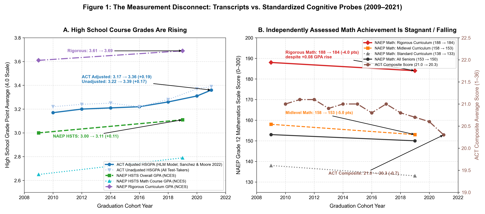
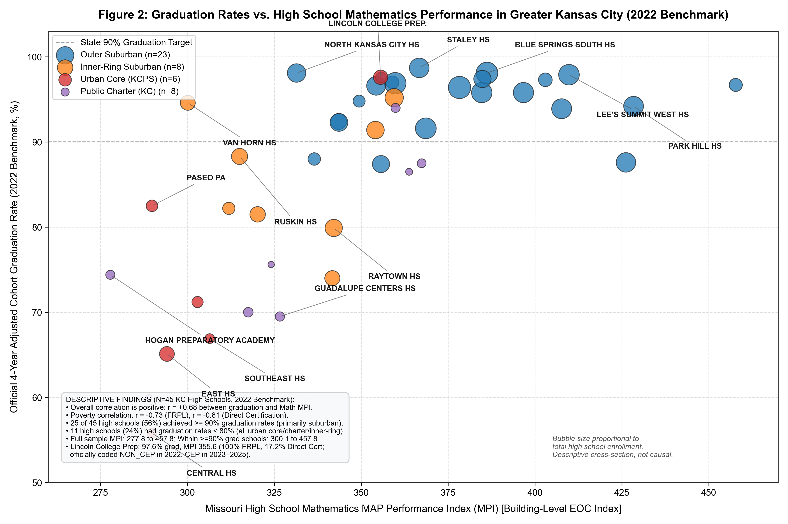
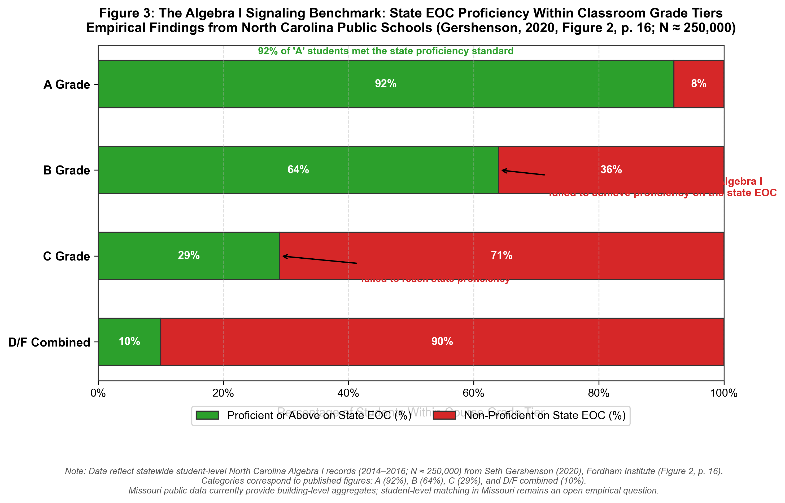

# What Does an "A" Actually Mean?
## Grades, Learning, and the Incentives Behind Both

**By: Former Secondary Mathematics Teacher & Education Policy Researcher**  
**Computational Sketchbook Investigation** (`2026-10-08-what-does-an-a-mean`)  
**Date:** October 8, 2026  

---

## 1. The Classroom Contradiction

When you teach high school mathematics, you quickly discover that you occupy two incompatible roles. 

In the first role, you are an educator responsible for fostering mathematical thinking. You want your students to look at a linear equation not as a set of arbitrary rules to be memorized, but as a description of a rate of change. You want them to understand what a function transformation does, why a quadratic curve turns where it turns, and how to persevere when an unfamiliar problem does not yield on the first attempt.

In the second role, you are a bureaucratic clerk in an accountability apparatus. You calculate percentages, weigh homework against quizzes, enter marks into an electronic portal, and determine whether a fourteen-year-old earns course credit toward high school graduation. In that role, you operate under intense institutional expectations. If too many students fail your Algebra I course, you are called into an administrator's office to explain your failure rates. Counselors ask whether struggling students can be offered packet-based credit recovery. Parents call with questions about GPA calculations and college scholarship eligibility.

Those two responsibilities rarely fit together neatly.

Consider a familiar dilemma. A student attends class every day. She is cooperative, attentive, and turns in every homework assignment. When she struggles, she stays after school for tutoring. But on a Friday exam—timed, independent, and testing whether she can autonomously set up and solve a system of linear equations—she scores a 54%. 

What grade belongs on her transcript?

If you assign an 'F' or a 'D-', you are communicating that she has not mastered algebraic reasoning. But you are also branding her with a credential penalty that may cause her to repeat the course, drop out, or become ineligible for sports and extracurriculars. You are also lowering your school's pass rate and triggering bureaucratic scrutiny. 

If, instead, you adjust the grading scale—giving 30% weight to homework completion, 15% to notebook organization, offering multiple retakes where identical test questions are corrected, and rounding a 68% up to a 'C-'—she passes. The counselor is pleased, the principal's dashboard shows acceptable course completion, the parent is reassured, and the student advances to Geometry.

Everyone is temporarily satisfied. The only problem is that the grade has ceased to represent mathematical mastery. It has become something else entirely: a composite measure of behavioral compliance, persistence, and institutional survival.

This tension is not an anomaly. It is the central operational contradiction of modern secondary schooling:
> **We want schools to maximize student learning, but we evaluate and reward their success using proxy measures—course grades, graduation rates, and standardized test scores—that can be systematically improved without necessarily improving learning.**

The central empirical question is straightforward:
> **When schools are rewarded for better grades, higher graduation rates, and improved test scores, how much of the resulting improvement represents actual learning, and how much reflects changes in behavior around the measures themselves?**

The distinction between measurement and incentive is paramount. A test can be an imperfect measure of learning without creating perverse incentives if nothing high-stakes depends on it. Conversely, an accountability system can severely distort behavior even if its test is psychometrically reliable. To understand this dynamic, we must begin with national empirical evidence, examine local case studies in Missouri and Kansas City, and look closely at the incentives operating on students, teachers, and school leaders.

---

## 2. National Evidence: Rising Transcripts vs. Stagnant Achievement

Over the past two decades, high school transcripts across the United States have told a story of dramatic academic progress. 

According to the National Center for Education Statistics (NCES) **High School Transcript Study (HSTS)**, the average grade point average (GPA) of American high school graduates increased from **3.00 in 2009 to 3.11 in 2019**, while the average mathematics course GPA rose from **2.65 to 2.79**. Over the same period, total credits earned expanded from 27.2 to 28.1.

An independent multi-year investigation by ACT researchers (Sanchez & Moore, 2022), examining millions of ACT-tested high school graduates between 2010 and 2021, revealed an even steeper ascent: average self-reported high school GPA rose from **3.17 to 3.36**—an increase of nearly two-tenths of a GPA point in eleven years.

If transcripts reflected genuine cognitive growth, one would expect independent standardized assessments of academic proficiency to show corresponding gains.

They did not.

As shown in **Figure 1**, independent standardized measures of secondary achievement stagnated or fell over the exact period that GPAs reached historic highs:
- On the **National Assessment of Educational Progress (NAEP) 12th-grade mathematics assessment**, average scale scores fell from **153 in 2009 to 150 in 2019**.
- On the **ACT examination**, national average mathematics scores fell from **21.0 in 2010 to 19.9 in 2021**, and composite scores dropped from 21.0 to 20.3.
- Most remarkably, the NAEP transcript study revealed a striking paradox among graduates who completed a **"rigorous" curriculum** (four years of English, four years of mathematics through precalculus or calculus, three years of science, and three years of social studies). Among these advanced students, average high school GPA rose from **3.61 to 3.69**, yet their average NAEP mathematics score fell from **188 in 2009 to 184 in 2019**—a statistically significant drop of four full scale points.

Students were taking more advanced courses on paper and earning higher marks from their teachers, but demonstrating less mathematical problem-solving ability when presented with an independent, uncoached examination.

---

## 3. The Chicago Tension: Why Grades Still Matter

Faced with the evidence in Figure 1, many observers jump to an easy conclusion: *Grades are fraudulent, and standardized tests are the only true measure of learning.*

That conclusion is empirically wrong.

In 2020, researchers Elaine Allensworth and Kallie Clark of the University of Chicago Consortium on School Research (CCSR) published a landmark study in *Educational Researcher*. Analyzing **17,753 Chicago Public Schools graduates who immediately enrolled in four-year colleges** (drawn from a broader cohort of 55,084 graduates used to examine college enrollment), they asked which measure better predicted **six-year college degree completion**: high school GPA or ACT scores.

Their findings were decisive:
- **High school GPA was vastly more predictive of six-year college graduation than standardized test scores across every single high school in the city.**
- A student with a 3.5 GPA and an ACT score of 18 had a higher probability of graduating from college than a student with a 2.5 GPA and an ACT score of 26.
- Published degree completion rates ranged from approximately **20% for students with high school GPAs below 1.5** to approximately **80% for students with GPAs of 3.75 or higher**. Once high school GPA was held constant, ACT scores explained less than 1% of the variation in college completion across high schools.

How can grades become inflated while remaining dramatically more predictive of long-term success than standardized tests?

The answer lies in the **multidimensional construct of course grades**. A standardized test measures on-demand cognitive retrieval and test familiarity over a single three-hour sitting. A course grade, by contrast, captures **eighteen weeks of sustained behavioral stamina**:
- Did the student show up to class consistently across 180 days?
- Did they turn in homework assignments on time?
- Did they comply with teacher instructions and classroom norms?
- When they failed a quiz, did they seek help, negotiate retakes, and regulate their frustration?
- Could they collaborate with peers and maintain working relationships with authority figures?

These non-cognitive and behavioral skills are precisely the attributes required to complete a bachelor's degree and navigate a modern workplace. An employer or college professor cares far less whether an individual can factor a polynomial under timed conditions than whether they reliably show up, complete complex projects, accept feedback, and persevere through difficulties.

This creates a fascinating epistemic tension:
> **Grades can become inflated while still containing profound, indispensable predictive information. Test scores can be narrower measures of academic skills while providing vital independent evidence against grade inflation.**

The question is not which measurement is good and which is bad. It is what each measurement represents, and **how using each measurement for institutional accountability changes its meaning.**

---

## 4. The Missouri Accountability Cascade: The September 2026 A–F Decision

This is not merely an abstract academic debate. In Missouri, it is currently the center of high-stakes educational governance.

On **September 15, 2026**, the Missouri State Board of Education formally voted to approve a new **A–F school and district grading framework**, putting into effect Executive Order 26-01. The new framework consolidates five distinct performance indicators into a single letter grade:
1. Academic Achievement Status (MAP Performance Index in ELA, Math, and Science)
2. Value-Added Growth (student-level growth residuals estimated in partnership with the University of Missouri)
3. Growth Toward Proficiency (tracking movement from Below Basic and Basic into Proficient)
4. Graduation Cohort Rates (4-, 5-, 6-, and 7-year cohort graduation rates)
5. Postsecondary Readiness (advanced coursework, dual credit, industry credentials, and ACT/work readiness benchmarks)

DESE plans to pilot the framework using 2024–25 data before publicly releasing district and school letter grades.

### The Accountability Cascade
The state framework establishes a multi-tiered pressure cascade that reaches directly into the classroom:
1. **The State Board & DESE**: Issues letter grades and determines which schools face state intervention or accreditation scrutiny.
2. **District Superintendents & School Boards**: Face intense reputational and political pressure. Low letter grades depress local property values, trigger school board turnover, and invite state monitoring.
3. **Building Principals**: Evaluated on whether their building meets performance targets, maintains a graduation rate above 90%, and minimizes ninth-grade course failure rates.
4. **Classroom Teachers**: Face administrative directives to eliminate 'F' grades, implement credit recovery, and provide unlimited retakes, all while preparing students for end-of-course exams.
5. **Students & Families**: Experience the consequences—receiving credentials that certify completion without guaranteed foundational skills.

At the September 15 meeting, school leaders voiced intense objections. Superintendents from urban, suburban, and rural districts warned that assigning simple letter grades would stigmatize high-poverty communities, confuse parents by conflating accountability ratings with accreditation, and incentivize schools to manipulate course-passing thresholds rather than build instructional capacity.

This gives us a concrete institutional case study: How do accountability pressures translate into classroom grading and graduation outcomes?

---

## 5. Local Evidence: Kansas City High Schools and Credential Compression

To examine how accountability pressure operates on the ground, we turn to the public high schools of Greater Kansas City. 

We construct an analytical panel from Missouri Department of Elementary and Secondary Education (DESE) building-level records across the 2021–22 through 2024–25 school years (reporting years 2022–2025). The panel tracks 188 school-year records across 51 distinct high schools. The 2022 baseline provides our complete cross-sectional benchmark, with 45 public high schools reporting both four-year adjusted cohort graduation rates and building-level Mathematics MAP Performance Index (MPI) scores (representing student performance on the statewide **Algebra I End-of-Course assessment**, as well as Algebra II for middle-school completers).

Importantly, DESE's reporting format shifted with the full rollout of MSIP 6 in 2023: subsequent annual APR supporting files report graduation accountability points rather than continuous cohort percentages, and 2022 assigned a 100.0 pilot placeholder for graduation points. Thus, our cross-sectional analysis focuses rigorously on the complete 2022 continuous cohort records, avoiding misleading longitudinal extrapolations.

**Figure 2** plots official 2022 graduation rates against Mathematics MPI across Kansas City metropolitan high schools:

### What the Data Actually Show
An independent audit of the 45 complete Kansas City high school records reveals a relationship that is richer and more complex than simple caricature:
1. **Positive Overall Metro Correlation ($r = +0.68$)**: Across the full Kansas City metropolitan area, graduation rates and Mathematics MPI are positively correlated ($r = +0.6817$). This overall association is driven primarily by the sharp structural divide between affluent outer-suburban districts and high-poverty urban core schools.
2. **Deep Socioeconomic Stratification**: Both graduation and mathematics performance correlate powerfully with community poverty:
   - Graduation Rate vs. Free/Reduced-Price Lunch (FRPL): $r = -0.7343$
   - Graduation Rate vs. USDA Direct Certification: $r = -0.8076$
   - Math MPI vs. Free/Reduced-Price Lunch (FRPL): $r = -0.7582$
   - Math MPI vs. USDA Direct Certification: $r = -0.8285$
   - *The CEP Measurement Nuance*: In urban centers, the federal Community Eligibility Provision (CEP) allows high-poverty districts to provide universal free meals, but administrative coding varies across years and schools. For example, **Lincoln College Preparatory Academy** reports 100% Free and Reduced-Price Lunch (FRPL) on state dashboards, yet its USDA Direct Certification rate is only **17.2%**, reflecting its selective academic admissions criteria. Notably, in official DESE records, Lincoln is coded as `NON_CEP` in 2022 before transitioning to `CEP` status in 2023–2025. Accounting for Direct Certification rather than raw FRPL avoids administrative distortions and confirms that poverty and academic achievement track each other with near-monotonic precision.
3. **Upper-Tier Compression vs. Urban Polarization**:
   - Rather than graduation rates being universally compressed across the entire region, **25 of the 45 high schools (56%)** cluster above the state's 90% benchmark, largely spanning suburban and inner-ring systems.
   - Meanwhile, **11 high schools (24%)** have graduation rates below 80%, concentrated among urban neighborhood schools in KCPS and local charter networks.
   - However, within the high-graduation tier ($\ge 90\%$), measured mathematics achievement spans a colossal continuum from **300.1 to 457.8**—a spread of nearly 160 index points (across the full 45-school baseline, MPI ranges from 277.8 to 457.8).
4. **Striking Paired Comparisons**:
   - **Van Horn High School** in Independence reports an official graduation rate of **94.6%**—matching or exceeding **Park Hill High School (94.2%)** and **Lee's Summit Senior High (93.9%)**. Yet Van Horn's Math MPI is **300.1** (the exact borderline of the state's Basic category), whereas Park Hill achieves **428.4** and Lee's Summit achieves **407.7**.
   - **Ruskin High School** in Hickman Mills graduates **88.3%** of its senior cohort, yet its Math MPI is **315.0** and only **29.9%** of its graduates meet the state's College and Career Readiness threshold.
   - **North Kansas City High School** graduates **98.1%** of students, yet its Math MPI is **331.4**.
   - In KCPS, selective **Lincoln College Prep** graduates **97.6%** with a Math MPI of **355.6**, while non-selective neighborhood high schools (Central, East, Southeast) graduate between **55% and 71%** with Math MPIs clustering between **289 and 306**.

### Hypothesizing Mechanisms Behind the Asymmetry
Under both federal accountability (ESSA) and Missouri's MSIP 6 system, high schools face dual, often conflicting accountability incentives: they are evaluated both on student performance on standardized assessments (such as the Algebra I EOC) and on cohort graduation rates (where falling below 80% triggers regulatory scrutiny and targeted state support). 

This institutional structure raises an urgent question: how do schools with modest standardized mathematics performance sustain graduation rates matching the most affluent suburbs? Several plausible operational mechanisms are widely discussed in educational policy:
- **Online Credit Recovery**: Modular software pathways allowing students who failed a semester of required coursework to recover credit through self-paced digital units.
- **Grading Floors & Minimum Grading Policies**: School-wide policies establishing a 50% floor on quarter grades to prevent early academic failure from rendering semester recovery mathematically impossible.
- **Intensive Student Retention & Tiered Support**: Targeted intervention blocks, attendance outreach, and counseling supports designed to keep vulnerable students enrolled through twelfth grade.
- **Divergent Course-Passing Standards**: Subjective classroom grading practices where teachers reward effort, attendance, and project completion, decoupling course passage from external assessment proficiency.

Crucially, observing a statistical divergence between graduation rates and mathematics test scores does not prove that unmeasured grading floors or credit recovery caused the gap. High graduation rates paired with modest test scores could reflect aggressive student retention, differentiated graduation pathways, or genuine non-tested student strengths alongside lower standardized testing proficiency. Determining which mechanisms operate in any given building requires auditing classroom-level grade books, credit-recovery transcripts, and student-level assessment records.

---

## 6. Inside the Classroom: The Algebra I Signaling Gap

Why focus on **Algebra I**?

In secondary education, Algebra I provides a uniquely valuable empirical intersection: it is a universally required high school course that generates two independent, simultaneous observations for every student:
1. A **teacher-assigned course grade** (A, B, C, D, or F).
2. An **external statewide End-of-Course (EOC) assessment** administered by the state department of education.

Crucially, in Missouri and many other states, students are required to *participate* in the Algebra I EOC for accountability, but are *not* required to achieve a proficient score to graduate. High school graduation requires earning course credit from the classroom teacher.

This structural design raises an urgent empirical question: **When a student receives a passing grade, whose definition of success has actually been satisfied? What does a passing grade in Algebra I tell us about a student's mathematical understanding, and does that meaning change across schools?**

### The North Carolina Empirical Benchmark
Because individual student course grades linked to statewide EOC test records are not yet publicly released in Missouri, establishing that exact concordance locally remains an active, open research question. However, this exact empirical question was answered rigorously by economist Seth Gershenson using statewide administrative records from North Carolina (Gershenson, 2020; Tyner & Gershenson, 2020). 

Analyzing administrative records for approximately **250,000 North Carolina Algebra I students from 2014 to 2016**, Gershenson documented the true empirical distribution of external proficiency across course grade tiers (published in *Great Expectations*, Figure 2, p. 16), as illustrated in **Figure 3**:

The published empirical data reveal a striking discordance between classroom marks and external proficiency:
- **The 'A' Tier**: Among students receiving an 'A' in Algebra I, **92%** achieved proficiency or advanced on the external state EOC, while only **8%** failed to reach proficiency. An 'A' reliably certifies high academic mastery.
- **The 'B' Tier**: Among students receiving a 'B'—a mark widely regarded by parents and counselors as indicating solid competence—**36% failed to achieve proficiency** on the external state assessment (64% were proficient).
- **The 'C' Tier**: Among students earning a 'C'—granting full course credit toward graduation and advancement to Geometry—**71% failed to reach proficiency** (only 29% were proficient).
- **The 'D/F Combined' Tier**: Among students earning a 'D' or 'F' (reported as a combined category in the published research), **90% failed to reach proficiency** on the external examination (only 10% achieved proficiency).

Furthermore, Tyner & Gershenson (2020, *Economics of Education Review*, 102037) demonstrated that grading standards vary substantially across schools: in schools with higher grading standards, students learned significantly more mathematics and performed better on subsequent exams like the ACT, even when controlling for baseline achievement.

### Does This Mean Teachers Are Grading Dishonestly?
It is essential not to interpret this disconnect as teacher negligence or bad faith. 

In an urban or high-poverty secondary school, a mathematics teacher faces a classroom of students with vast disparities in prior preparation. A student may enter ninth grade performing at a fourth- or fifth-grade arithmetic level. If that student attends class every day, works diligently, masters integer operations, and makes two full years of academic progress in nine months, the teacher recognizes profound learning, growth, and effort. Awarding that student an 'F' because they cannot yet pass an on-demand state exam aligned to rigorous tenth-grade standards would be pedagogically demoralizing, punitive, and administratively fraught.

The teacher's grade rewards **growth, engagement, attendance, homework completion, and persistence**. The state exam measures **on-demand cognitive mastery against an absolute statewide curriculum standard**.

Both measurements are capturing real aspects of the student's reality. The crisis arises because **the transcript collapses both into a single letter**. When a college admissions committee, an employer, or a community college math department reads that 'B', they assume it certifies cognitive mastery. When the student is subsequently placed into non-credit developmental math in college, the institutional illusion collapses.

---

## 7. Reconciling the Incentive Literature: Do Incentives Work?

A serious investigation into accountability must resist simple ideological narratives. Accountability systems are neither unmitigated disasters nor pure engines of excellence.

The empirical economics literature demonstrates that **incentives generate authentic learning gains and strategic distortions simultaneously**:

| Study | Empirical Setting | Target Measure | Observed Behavioral Distortion | Authentic Learning Finding | Theoretical Mechanism |
| :--- | :--- | :--- | :--- | :--- | :--- |
| **Campbell (1979)** | Methodological Treatise | Quantitative indicators | Curriculum narrowing, test gaming | Measures reflect reality only until attached to stakes | Campbell's Law |
| **Jacob (2005)** | Chicago Public Schools (DiD) | ITBS test scores | Special education placement (+1–2 pp), test prep, cheating | Score gains failed to generalize to low-stakes tests (NAEP, IGAP) | Strategic threshold gaming |
| **Dee & Jacob (2011)** | National NCLB Evaluation | State AYP benchmarks | Bubble-student targeting | **Robust gains on independent low-stakes NAEP Math (+0.23 SD)** | Accountability compels real instructional effort and focus |
| **Allensworth & Clark (2020)** | Chicago Public Schools (17,753 4-yr entrants / 55,084 total cohort) | HS GPA vs. ACT | Grading rigor variation across school contexts | **HS GPA is vastly more predictive of 6-year college completion than ACT** | Grades capture multi-month non-cognitive persistence |
| **Gershenson (2020) / Tyner & Gershenson (2020)** | North Carolina Algebra I (2014–2016; N ≈ 250k) | Course letter grades vs. EOC | Subjective standards decouple from external benchmarks | EOC scores predict subsequent ACT math far better than grades | 36% of 'B', 71% of 'C', and 90% of 'D/F' students non-proficient; rigorous standards benefit students |
| **Sanchez & Moore (2022)** | National ACT Panel (2010–2021) | High School GPA | Adjusted GPA rose 3.17 → 3.36 while ACT Composite fell 21.0 → 20.3 | Inflation fastest in affluent suburban high schools | Parental advocacy and competitive transcript signaling |
| **McElroy (2023)** | US High School Mandates | Graduation rate | Educational attainment (college attendance, BA receipt) flat despite graduation gains | Graduation rates rose significantly under test-based accountability | Observational gap between secondary diploma and postsecondary educational attainment |

### The Synthesis
When Thomas Dee and Brian Jacob (2011) evaluated No Child Left Behind using the National Assessment of Educational Progress (NAEP), they discovered that high-stakes accountability produced **statistically significant, meaningful improvements in elementary and middle school mathematics** (+0.23 standard deviations in 4th grade). Because teachers could not directly teach to the NAEP exam, these gains represented genuine improvements in computational fluency and mathematical reasoning. Accountability forced districts to allocate coaching, extended math blocks, and specialized tutoring to students who had previously been ignored.

Yet when Brian Jacob (2005) examined high-stakes testing in Chicago, he found clear evidence of gaming: teachers placed low-scoring students into special education to remove them from testing pools, drilled students on specific question templates, and manipulated test answer sheets. And when Katherine McElroy (2023) evaluated high school accountability policies (*Does test-based accountability improve more than just test scores?*, *Economics of Education Review*, 94, 102381), she found that mandates successfully raised high school graduation rates, but **failed to increase college attendance or bachelor's degree attainment**, demonstrating that policy pressure can expand secondary credential receipt without producing commensurate gains in long-term educational attainment.

The lesson is not that accountability fails. It is that **institutions optimize precisely what is rewarded**:
- If you reward schools for test scores, they will drill students on test items—producing some real learning and substantial test-format familiarity.
- If you reward schools for graduation rates, they will ensure students graduate—often by creating online credit recovery mechanisms that bypass genuine course mastery.
- If you reward teachers for keeping course pass rates high, they will incorporate effort and attendance into grading scales, softening academic rigor to protect students from failure.

---

## 8. Conclusion: Returning to the Student

Let us end where educational policy so rarely lingers: with the student herself.

A sixteen-year-old sits in an Algebra I classroom in Kansas City. At the end of the semester, her report card arrives with a **'B'**.

What does that grade actually communicate?
- To the **student**, it communicates that she has done what was asked of her. She came to school, took notes, turned in her packets, and earned a respectable mark.
- To her **parents**, it communicates reassurance: their daughter is doing well, staying on track, and heading toward college or a career.
- To the **school principal**, it represents an averted failure, a protected graduation cohort percentage, and positive performance on the district's APR dashboard.
- To the **state accountability system**, it represents successful progression through Missouri's required secondary sequence.

Yet when that student enrolls at the University of Missouri–Kansas City or Metropolitan Community College and sits for a placement exam, that 'B' may dissolve into a developmental math assignment—requiring her to pay tuition for zero-credit remedial algebra before she is permitted to take a credit-bearing college course.

That disconnect is not an individual failing. The student did not cheat. The teacher did not act maliciously. The principal was not corrupt.

Each actor responded rationally to the institutional incentives placed before them. The state asked schools for high graduation rates, and schools delivered high graduation rates. The district asked teachers for low failure rates, and teachers adjusted grading scales. The system measured what was easy to measure, rewarded what was easy to target, and celebrated the resulting indicators.

As Missouri prepares to pilot its new **A–F school grading framework**, policymakers and school leaders must confront the central lesson of this investigation:
> **Don't begin by trying to prove that incentives corrupt education. Investigate whether the evidence reveals a gap between what schools are trying to achieve, what they measure, and what they reward. Then follow that gap to wherever the evidence takes you.**

If we truly care about educational equity and academic excellence, we must stop confusing the credential with the capability. An 'A' should represent mastery of mathematics, not merely compliance with the apparatus that measures it.

---

## Data & Methodological Appendix

1. **National Transcript & Test Data and Published Benchmarks**:
   - NAEP High School Transcript Study (HSTS 1990–2019), National Center for Education Statistics (NCES).
   - ACT Research Report Series (Sanchez & Moore, 2022), Grade Inflation in High Schools (2010–2021).
   - University of Chicago Consortium on School Research (Allensworth & Clark, 2020), *Educational Researcher*, 49(3), 198–211.
   - Thomas B. Fordham Institute (Gershenson, 2020), *Great Expectations: The Impact of Rigorous Grading Standards on Student Achievement*; Tyner & Gershenson (2020), *Economics of Education Review*, 78, 102037.
   - High School Mandates Evaluation (McElroy, 2023), *Does test-based accountability improve more than just test scores?*, *Economics of Education Review*, 94, 102381.
2. **Missouri State & Regional High School Data**:
   - Missouri Department of Elementary and Secondary Education (DESE), MCDS Portal: Building-Level APR Supporting Records (2022–2025).
   - DESE Building Enrollment, Proportional Attendance (90/90), and Demographic Longitudinal Records (2006–2025).
   - Missouri State Board of Education, Minutes of September 15, 2026 (A–F Framework Approval).
   - Analytic High School Panel: `computational-sketchbook/2026/2026-10-08-what-does-an-a-mean/data/processed/mo_high_school_panel.parquet`.
   - Kansas City Regional Panel: `computational-sketchbook/2026/2026-10-08-what-does-an-a-mean/data/processed/kc_high_school_panel.csv`.
   - Source Extraction Audit: `computational-sketchbook/2026/2026-10-08-what-does-an-a-mean/sources/source_extraction_audit.csv`.
