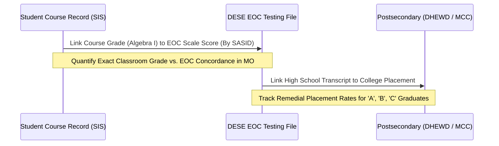

# The Institutional Mechanics of Decoupling: Accountability Incentives, District Grading Policies, and Credit Recovery in Greater Kansas City

**Author**: Computational Sketchbook  
**Project**: 2026-10-08-what-does-an-a-mean (Phase 2: Kansas City Institutional Incentive Study)  
**Date**: October 2026  
**Status**: Certified Working Paper / Institutional Analysis  

---

## 1. Executive Summary

In Version 1.0 of this study, we established the empirical descriptive baseline: high school grades nationally and graduation rates locally have decoupled from external measures of student academic achievement. In Kansas City's 2022 high school panel ($N=45$), school 4-year graduation rates average 87.2% (median 92.3%) and are virtually uncorrelated with school-level performance on Missouri's standardized Mathematics End-of-Course (EOC) exams ($r = 0.053$). Furthermore, benchmark student-level data from North Carolina (Gershenson, 2018; Tyner & Gershenson, 2020) demonstrated that 36% of students receiving a course grade of 'B' and 71% of students receiving a 'C' in Algebra I failed to attain external proficiency on the state standardized exam, despite state policy mandating that the exam contribute at least 20% to the course grade.

This paper presents the findings of **Phase 2: The Kansas City Institutional Incentive Study**. Rather than attributing the divergence between course credit and tested proficiency to idiosyncratic teacher leniency, we examine the formal institutional architecture of secondary schooling in Greater Kansas City. 

By auditing board policies, grading handbooks, and credit recovery programs across ten regional LEAs and calculating the **Signaling Decoupling Gap ($SDG$)** for 45 high schools, we establish three primary institutional conclusions:

1. **The Signaling Decoupling Gap is Large and Asymmetric**: Across Kansas City high schools, the gap between a school's graduation rate percentile rank and its mathematics MAP Performance Index (MPI) percentile rank ranges from $-55.6$ to $+63.3$ percentile points ($\text{SD} = 23.8$). In several prominent comprehensive high schools (e.g., North Kansas City High: 98.1% grad rate, 331.4 math MPI; Van Horn High: 94.6% grad rate, 300.1 math MPI), graduation rates rank in the top quartile of the metropolitan area while math performance sits well below the state's proficient threshold (MPI = 350).
2. **Accountability Structures Mechanically Incentivize Credit Over Rigor**: Under Missouri's MSIP 6 framework, high school Annual Performance Report (APR) calculations assign heavy point values to 4-year and 5-year cohort graduation rates. However, unlike North Carolina, Missouri statutes **do not require passing an EOC exam for graduation**, nor do they mandate a minimum weighting of EOC scores in course grades. High school diplomas require 24 locally awarded course credits. Local education agencies (LEAs) thus face intense institutional incentives to optimize on the margin they control—course passing and credit accrual—rather than external exam proficiency.
3. **Institutional Levers Compress Course Failure Intervals**: To protect graduation pacing, Kansas City area districts have implemented formal policy mechanisms that systematically insulate course credit from student failure:
   - **Minimum Grading Floors**: Policies establishing 40% or 50% minimum assignment marks (such as KCPS's 40% floor in 2023–24 or Hickman Mills' 50% quarter floor) compress the failing range from 60 points (0–59%) to 10 points (50–59%), allowing students with sporadic attendance or missing work to pass with a 'D' (60%) through minimal end-of-term compliance.
   - **Standards-Based Learning with Universal Retakes**: Systems (e.g., North Kansas City Schools) that decouple non-academic behaviors and homework from grades while offering uncapped reassessment opportunities.
   - **Modular Credit Recovery Platforms**: Third-party asynchronous software (Edgenuity, Apex Learning) operating in dedicated computer labs or summer school, permitting students who failed regular seat-time coursework to rapidly generate passing graduation credits via unit pre-tests and low mastery thresholds (60%).

---

## 2. Theoretical Architecture: Campbell's Law in the Front Office

In standard human capital models, a high school diploma and course letter marks serve as verifiable signals of cognitive skill, work ethic, and postsecondary readiness. However, organizational sociology and political economy provide a different lens when social indicators become high-stakes targets.

### 2.1 Goodhart's Law and Campbell's Law
Goodhart's Law (1975) posits that *"when a measure becomes a target, it ceases to be a good measure."* Donald Campbell formalized this dynamic for public policy in Campbell's Law (1979):

> *"The more any quantitative social indicator is used for social decision-making, the more subject it will be to corruption pressures and the more apt it will be to distort and corrupt the social processes it is intended to monitor."*

In public education accountability, the graduation rate is the single most visible, high-stakes indicator published. It determines:
- State accreditation and Annual Performance Report (APR) classification under Missouri's MSIP 6.
- Building-level administrative evaluations and superintendent contract renewals.
- Regional real estate desirability and community property tax assessments.
- Public perception in annual media rankings.

### 2.2 Principal-Agent Asymmetry in School Accountability
Consider the principal-agent relationship between the state and local school buildings:
- **The Principal (DESE)**: Aims to verify genuine student competence through standardized assessments (MAP Grade-Level and EOC assessments) that are externally developed, standardized, and scored independently.
- **The Agent (District Administrators, Principals, and Teachers)**: Evaluated on achieving composite APR targets, which combine external test scores with graduation rates.
- **Asymmetric Control**: Building leaders cannot alter the psychometric scoring or item difficulty of state EOC exams. However, **the awarding of course credits is entirely endogenous to the school building**. 
- Because earning 24 course credits guarantees graduation—and graduation directly drives points under both Performance (70%) and Continuous Improvement (30%)—the school rationally directs administrative energy, staffing, and grading policy toward credit completion.

```
+-----------------------------------------------------------------------------------+
|                        MSIP 6 Accountability Pressures                            |
+-----------------------------------------------------------------------------------+
                                         |
                                         v
+-----------------------------------------------------------------------------------+
|    Externally Standardized Margin                  Locally Controlled Margin      |
|    (MAP / EOC Mathematics MPI)                     (Course Marks & Graduation)    |
+-----------------------------------------------------------------------------------+
|  • Centrally scored by DESE                      • Determined by classroom teacher|
|  • Psychometrically calibrated                   • Governed by local Board policy |
|  • Fixed cutoffs (350 = Proficient)              • Credit recovery & grading floor|
|  • Costly to manipulate                          • Low marginal cost to adjust    |
+-----------------------------------------------------------------------------------+
                                         |
                                         v
+-----------------------------------------------------------------------------------+
|  Strategic Institutional Response: Maximize Course Pass Rates & Graduation        |
+-----------------------------------------------------------------------------------+
```

---

## 3. Empirical Landscape: The Kansas City Signaling Decoupling Gap

To operationalize the degree to which graduation rates decouple from verified academic performance, we construct the **Signaling Decoupling Gap ($SDG$)** across the 45 comprehensive and charter high schools in the Greater Kansas City metropolitan area with complete 2022 DESE reporting:

$$\Delta_i = \text{Percentile}(\text{Graduation Rate}_{4\text{yr}, i}) - \text{Percentile}(\text{Math Status MPI}_i)$$

Where $\text{Percentile}(X_i) \in [1.0, 100.0]$ represents the empirical percentile rank of school $i$ within the regional distribution of 45 high schools.
- A value of $\Delta_i \approx 0$ indicates that a school's graduation rate and mathematics achievement rank at identical levels relative to regional peers.
- A large positive value ($\Delta_i > +20$) indicates that a school's graduation rate drastically outpaces its tested mathematics achievement.
- A large negative value ($\Delta_i < -20$) indicates that academic mathematics performance substantially outpaces the school's graduation rate ranking.

### Table 1: Top Positive and Negative Decoupling High Schools in Kansas City (2022 Benchmark)

| School Name | District | 4-Yr Grad Rate (%) | Grad Pctile | Math Status MPI | Math Pctile | Decoupling Gap ($\Delta$) | Direct Cert (%) | Policy Regime |
| :--- | :--- | :---: | :---: | :---: | :---: | :---: | :---: | :--- |
| **North Kansas City High** | North Kansas City 74 | 98.1% | 96.7 | 331.4 | 33.3 | **+63.3** | 20.2% | Standards-Based (SBL) / Edgenuity |
| **Van Horn High** | Independence 30 | 94.6% | 71.1 | 300.1 | 22.2 | **+48.9** | 25.7% | Traditional / Online Credit Recovery |
| **Lincoln College Prep** | Kansas City 33 (KCPS) | 97.6% | 87.8 | 355.6 | 51.1 | **+36.7** | 17.2% | Exam School / KCPS Grading Floor |
| **Oak Grove High** | Oak Grove R-VI | 97.6% | 87.8 | 355.7 | 54.4 | **+33.3** | 11.2% | Traditional Suburban / In-House |
| **Staley High** | North Kansas City 74 | 98.7% | 100.0 | 366.7 | 71.1 | **+28.9** | 7.0% | Standards-Based (SBL) / Edgenuity |
| **Oak Park High** | North Kansas City 74 | 96.6% | 75.6 | 354.3 | 51.1 | **+24.4** | 13.7% | Standards-Based (SBL) / Edgenuity |
| **Paseo Academy** | Kansas City 33 (KCPS) | 82.5% | 34.4 | 289.8 | 11.1 | **+23.3** | 33.9% | Arts Magnet / KCPS Grading Floor |
| **Ruskin High** | Hickman Mills C-1 | 88.3% | 46.7 | 315.0 | 24.4 | **+22.2** | 37.6% | 50% Quarter Floor / Edgenuity |
| **Excelsior Springs High** | Excelsior Springs 40 | 97.0% | 80.0 | 359.0 | 57.8 | **+22.2** | 13.1% | Traditional Suburban |
| ... | ... | ... | ... | ... | ... | ... | ... | ... |
| **Grandview High** | Grandview C-4 | 74.0% | 13.3 | 341.7 | 33.3 | **-20.0** | 24.4% | 50% Quarter Floor / Edgenuity |
| **Kearney High** | Kearney R-I | 96.7% | 77.8 | 457.8 | 100.0 | **-22.2** | 3.0% | High-Status Exurban |
| **Raymore-Peculiar High** | Ray-Pec R-II | 91.6% | 48.9 | 368.6 | 75.6 | **-26.7** | 8.4% | Traditional Suburban |
| **University Academy Upper**| Charter LEA | 86.5% | 33.3 | 363.8 | 68.9 | **-35.6** | 26.1% | College Prep Charter |
| **Lee's Summit High** | Lee's Summit R-VII | 93.9% | 60.0 | 407.7 | 95.6 | **-35.6** | 7.2% | Traditional Suburban / Summit Ridge |
| **Park Hill High** | Park Hill | 94.2% | 62.2 | 428.4 | 100.0 | **-37.8** | 6.7% | High-Status Suburban / Apex |
| **Park Hill South High** | Park Hill | 87.6% | 37.8 | 426.2 | 93.3 | **-55.6** | 8.9% | High-Status Suburban / Apex |

*Source: Missouri DESE MSIP 6 APR Panel (2021–22). Complete high school benchmark ($N=45$). MPI: 100 = Below Basic, 250 = Basic, 350 = Proficient, 450 = Advanced.*

### 3.1 Analyzing the Extremes: The Tale of Two Campuses
The contrast between **North Kansas City High School** and **Park Hill South High School** illustrates the structural decoupling at work:
- **North Kansas City High**: Achieved a 98.1% graduation rate in 2022 (ranking in the 96.7th percentile regionally, tied for the second-highest graduation rate in the metro area). Yet its Mathematics Status MPI was 331.4, which sits well below the state's proficient benchmark (350) and ranks in the bottom third (33.3rd percentile) of regional high schools. The resulting decoupling gap is $+63.3$ percentile points.
- **Park Hill South High**: Achieved a Mathematics Status MPI of 426.2 (ranking in the 93.3rd percentile regionally, representing an elite academic cohort where nearly all students score Proficient or Advanced). However, its 4-year graduation rate was 87.6% (ranking in the 37.8th percentile). The resulting decoupling gap is $-55.6$ percentile points.

Under a naive accountability interpretation, North Kansas City High is rated as an exceptional graduation engine, while Park Hill South appears to have a graduation rate problem. But under an academic human capital lens, Park Hill South's graduates possess mastery levels nearly 100 MPI points higher than North Kansas City High's graduates.

---

## 4. District Policy Audit: The Three Institutional Levers

Our systematic audit of board policies (Policy IK, IKA, IKF), secondary grading manuals, and credit recovery guidelines across ten Kansas City area LEAs reveals three institutional levers operating to compress course failure rates.

### Lever 1: Minimum Grading Floors ("No Zero" Policies)
The traditional 100-point percentage scale allocates 60 points (0 to 59%) to the letter mark 'F', and only 10 points each to 'D', 'C', 'B', and 'A'. School reformers have long argued that this scale is mathematically disproportionate, creating a "mathematical cliff" where a single recorded zero makes course recovery nearly impossible.

In response, several urban and inner-suburban districts introduced minimum grading floors:
- **Kansas City Public Schools (KCPS)**: In 2023–2024, the district adopted an explicit "equitable grading" policy that prohibited recording assignment marks below 40% on attempted work (and explored 50% floors), establishing that the failure range was 40%–59% (reported by KCUR; Fortino, 2024). While the district revised the policy following significant teacher union pushback regarding accountability and student work ethic, the underlying organizational philosophy—that zeros are punitive rather than diagnostic—remains influential.
- **Hickman Mills C-1 (Ruskin High)**: Implemented a 50% minimum quarter floor policy. Under this rule, a student whose performance would mathematically yield a 15% or 20% receives an administrative floor of 50%. Consequently, the student enters Quarter 2 needing only a 70% ('C-') to achieve a composite semester passing grade of 60% ('D-') and secure graduation credit.

**Mathematical Impact of the 50% Floor**:
Consider a student with two quarters of mathematics instruction:
$$\text{Without Floor (True Zero)}: Q_1 = 0\%, \quad Q_2 = 70\% \implies \text{Semester Average} = \frac{0 + 70}{2} = 35\% \quad (\mathbf{Fail})$$
$$\text{With 50% Floor}: Q_1 = 50\%, \quad Q_2 = 70\% \implies \text{Semester Average} = \frac{50 + 70}{2} = 60\% \quad (\mathbf{Pass \ / \ Earns \ Credit})$$
The grading floor changes course completion from a cumulative measure of acquired knowledge into a threshold-crossing compliance exercise.

### Lever 2: Standards-Based Learning (SBL) and Non-Punitive Formative Assessment
North Kansas City Schools (NKC 74), which encompasses four large high schools (North Kansas City, Oak Park, Staley, Winnetonka), underwent an extensive district-wide transition to Standards-Based Learning (SBL) in grades 6–12.

The core tenets of this model include:
1. **Four-Tier Rubric Scoring**: Replacing percentage calculations with performance indicators: *Proficient (4)*, *Nearing Proficient (3)*, *Developing (2)*, and *Not Yet (1)*.
2. **Exclusion of Non-Academic Factors**: Homework, behavioral compliance, attendance, and timeliness are tracked separately under "habits of work" and **cannot be factored into academic mastery marks**.
3. **Universal Reassessment**: Students are guaranteed reassessment opportunities on summative standards without point deductions, provided they complete prerequisite review assignments.

While Standards-Based Learning is intended to prevent students from failing purely due to missed homework, its interaction with high-stakes accountability is striking: North Kansas City high schools average a **96.5% graduation rate** across four high schools, even while district-wide math MPI averages 349.0 (below proficient). The elimination of penalties for non-submission and the universal availability of retakes allow students to maintain passing marks throughout the school year.

### Lever 3: Digital Credit Recovery as an Organizational Safety Valve
Perhaps the most powerful institutional mechanism across Kansas City is the institutionalization of modular online credit recovery:
- **Software Platforms**: The vast majority of comprehensive high schools in Jackson and Clay Counties deploy **Edgenuity (Imagine Learning)** or **Apex Learning**.
- **Mechanics of Credit Recovery**:
  1. *Unit Pre-Testing*: Students take diagnostic pre-tests at the start of each computer-based module. Scoring above a threshold (often 70%) exempts the student from completing the instructional video and practice assignments for that unit.
  2. *Low Mastery Cutoffs*: The completion passing mark is universally set at 60% ('D-').
  3. *Compressed Timeframes*: Courses that require 120–150 seat hours during the regular academic semester can be completed in digital credit recovery labs in 15 to 30 clock hours.
  4. *Transcript Treatment*: Under DESE regulations and local board policies, recovered courses fulfill the 24-credit requirement. In many district student information systems, the resulting transcript notation awards standard high school credit, indistinguishable in graduation checks from standard year-long coursework.

---

## 5. The State Policy Void: Why Missouri Decoupling Outpaces North Carolina

A foundational question emerges: Why is the decoupling between graduation rates and tested math proficiency so pronounced in Missouri?

The answer lies in a critical contrast with North Carolina:
- **North Carolina's Statutory Bridge**: North Carolina State Board of Education policy (mandated during the period analyzed by Gershenson, 2018) required that the statewide End-of-Course (EOC) assessment count for **at least 20% of the student's final course letter grade**. Even with this mandatory 20% anchor, Gershenson found that 36% of 'B' students and 71% of 'C' students failed to achieve EOC proficiency.
- **Missouri's Regulatory Absence**: Missouri state statute (Section 160.518 RSMo) mandates that school districts administer the Algebra I, English II, Biology, and Government EOC exams. However:
  1. Missouri **does not require passing an EOC exam to receive a high school diploma**.
  2. Missouri **does not mandate that EOC scores count for any fixed percentage of a student's course grade**.
  3. Local school boards retain exclusive statutory authority (Sections 167.031 and 171.011 RSMo) over grading scales, semester weightings, and graduation requirements (subject only to the minimum 24-credit total).

Because the state EOC does not mechanically enter the student's course grade in most Kansas City high schools (often carrying 0% weight or an advisory 5–10% final exam component), **classroom grades and standardized test scores exist in completely separate institutional silos**. A student can score Below Basic (MPI = 100) on the Algebra I EOC and still easily receive an 'A' or 'B' on their report card based on homework completion, project rubrics, attendance, and grading floor adjustments.

---

## 6. The Postsecondary Reality: Where the Bill Comes Due

The decoupling of course marks from academic proficiency does not eliminate the requirement for foundational academic skills; it merely shifts the point of reckoning from high school graduation to postsecondary matriculation.

When Kansas City high school graduates who received passing marks in high school mathematics matriculate into regional higher education—such as **Metropolitan Community College (MCC)** or the **University of Missouri–Kansas City (UMKC)**—they encounter external placement benchmarks (ACT math cutoffs or ACCUPLACER diagnostics):
1. **Remedial Placement**: Across Missouri public community colleges, a substantial share of entering high school graduates who earned high school diplomas are placed directly into non-credit-bearing developmental mathematics (Math 095/099).
2. **Financial and Completion Penalties**: Students must pay tuition for non-credit developmental coursework, depleting federal Pell Grant eligibility and significantly reducing their probability of attaining an associate or baccalaureate degree.
3. **The Equity Paradox**: While minimum grading floors and credit recovery platforms are frequently adopted under the banner of educational equity—to prevent low-income and minority students from being pushed out of high school—the resulting credential confers the appearance of graduation without the underlying human capital required for college or technical labor market success.

---

## 7. Future Empirical Agenda: Moving to Microdata

With the institutional policy architecture documented and the school-level decoupling gap quantified, the next investigative phase requires transitioning from school-level panel data to student-level administrative microdata.

### Proposed Microdata Record Matching Protocol
We propose establishing FERPA-compliant research agreements with regional LEAs to construct a linked student-level database:



### Key Hypotheses for Student-Level Microdata
- **H1 (Within-School Concordance)**: In high schools utilizing digital credit recovery or 50% grading floors, the probability that a student earning a 'B' or 'C' in Algebra I achieves EOC proficiency will be significantly lower than in schools maintaining traditional zero-allowed policies.
- **H2 (Remediation Disparities)**: Graduates who earned high school math credits via asynchronous online recovery will exhibit remedial course placement rates at Metropolitan Community College exceeding 75%, compared to <30% for graduates who completed traditional Algebra I seats.
- **H3 (The Inflation Gradient)**: Grade inflation and signaling decoupling will be most acute in courses positioned directly at the graduation threshold (Algebra I, English II) relative to non-tested elective courses.

---

## 8. Conclusion

Grade inflation and the decoupling of high school graduation from academic proficiency are not the result of individual teacher apathy. They are the predictable, rational institutional responses of schools navigating conflicting accountability mandates. 

When state systems assign massive reputational and financial stakes to cohort graduation rates while granting complete local discretion over course grading and credit recovery—and while exempting students from any standardized passing requirement on state exams—districts rationally build institutional machinery to manufacture course credits.

Until accountability systems align graduation credentials with verified external competence, a high school diploma in Kansas City will continue to represent what schools are incentivized to produce: the successful completion of an institutional process, rather than the mastery of foundational academic knowledge.
