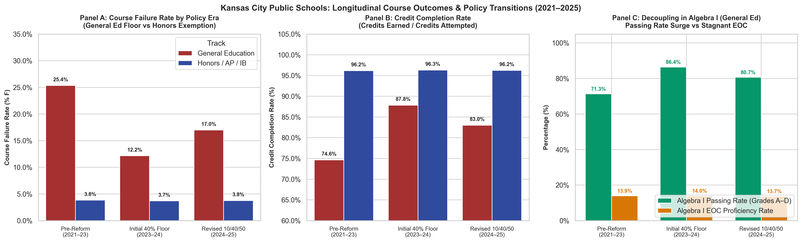

# The Institutional Architecture of Secondary Accountability: Policy Chronologies, School Rankings, and Longitudinal Case Studies in Greater Kansas City

**Author**: Computational Sketchbook  
**Project**: 2026-10-08-what-does-an-a-mean (Phase 2: Kansas City Institutional Incentive Study)  
**Date**: October 2026  
**Status**: Certified Working Paper / Institutional Research Architecture  

---

## 1. Executive Summary & Epistemological Separation

In evaluating how educational credentials relate to demonstrated student learning, rigorous social science requires keeping three domains strictly distinct:
1. **The Observed Cross-Sectional Data**: Empirical distributions of graduation rates, standardized assessment scores, and relative school rankings.
2. **The Institutional Policy Evidence**: Dated, primary-source documentation of board policies, grading scales, reassessment rules, and credit-recovery programs.
3. **The Causal Mechanisms**: Hypotheses regarding whether and how specific policy interventions or administrative incentives alter student achievement, course pass rates, or transcript marks.

In Phase 1 of this inquiry, we established the empirical descriptive baseline: high school GPAs nationally have risen significantly over the past decade (NAEP HSTS: 3.00 to 3.11; ACT: 3.17 to 3.36) even as standardized mathematics achievement stagnated or fell. Locally, across 45 public high schools in Greater Kansas City with complete 2022 state reporting, the overall relationship between four-year cohort graduation rates and mathematics MAP Performance Index (MPI) scores is positive and fairly strong:

$$\text{Pearson } r = 0.682, \quad \text{Spearman rank } \rho = 0.667$$

However, beneath this strong macro-correlation lies substantial school-level divergence in relative rankings. When we compute the **Graduation–Achievement Rank Difference** ($\Delta_i = \operatorname{PctRank}(G_i) - \operatorname{PctRank}(M_i)$), school values range widely from $-55.6$ to $+63.3$ percentile points ($\text{SD} = 23.8$).

This paper presents the research architecture for **Phase 2: The Kansas City Institutional Incentive Study**. Rather than prematurely asserting that district grading policies caused the 2022 cross-sectional rankings, our audit establishes a critical chronological fact: **the prominent grading reforms in Greater Kansas City—such as Kansas City Public Schools' (KCPS) 40% minimum grading floor and North Kansas City Schools' (NKC) Standards-Based Learning (SBL) transition—were adopted *subsequent* to the 2022 baseline.**

Consequently, Phase 2 treats these policy adoptions not as retrospective explanations of 2022 results, but as the foundation for two tightly dated, prospective longitudinal case studies:
- **Case Study A (Kansas City Public Schools)**: Investigating the immediate impact of the 40% minimum assignment floor introduced in 2023–24 (and revised in 2024–25) on course failure rates and credit accumulation.
- **Case Study B (North Kansas City Schools)**: Investigating the phased rollout of Standards-Based Learning (piloted in fall 2025 at North Kansas City High; full implementation targeted for 2026–27), explicitly testing whether uncapped reassessments improve subsequent assessed learning or primarily alter course passing rates.

---

## 2. Institutional Framework: Missouri Accountability & Statutory Structure

### 2.1 The Accountability Architecture (MSIP 6)
Under Missouri's School Improvement Program (MSIP 6), public school districts and high schools are evaluated on Annual Performance Report (APR) scores:
- **Performance (70% of APR Points)**: Composed of Academic Achievement (Status and Growth in tested areas) and Graduation Rate / College and Career Readiness (CCR).
- **Continuous Improvement (30% of APR Points)**: Evaluates institutional improvement plans, climate surveys, and attendance.

For high schools, four-year and five-year cohort graduation rates carry substantial point allocations. Because graduation rates are heavily weighted in APR determinations, schools face powerful institutional incentives to ensure that entering ninth-graders accumulate sufficient course credits to cross the graduation threshold.

### 2.2 The Missouri Statutory and Regulatory Reality
To understand why course marks and external test scores can diverge, the legal and regulatory framework must be stated with precision:
- **Statewide Minimum Requirements (5 CSR 20-100.190)**: The Missouri State Board of Education establishes a statewide *minimum* requirement of 24 units of credit for high school graduation, including specific discipline distributions (4 units of English Language Arts, 3 units of Mathematics, 3 units of Science, 3 units of Social Studies, 1 unit of Fine Arts, 1 unit of Practical Arts, 1 unit of Physical Education, 0.5 unit of Health, 0.5 unit of Personal Finance, and 7 units of Electives).
- **Local Board Authority (Section 171.011 RSMo)**: Local boards of education hold broad statutory authority to make rules and regulations for district governance. Crucially, local boards may require additional units of credit beyond the state minimum (e.g., 26 or 28 credits) and retain exclusive authority to establish local grading scales, credit accrual criteria, and course passing marks.
- **The State Testing Asymmetry**: Under Section 160.518 RSMo and DESE regulations, public school districts are mandated to *administer* End-of-Course (EOC) assessments in Algebra I, English II, Biology, and Government. However:
  1. Missouri **does not require passing an EOC exam to receive a high school diploma**.
  2. Missouri **does not mandate that EOC scores contribute any set percentage to a student's final course letter grade** (in sharp contrast to North Carolina's statutory mandate requiring the EOC to count for at least 20% of the course grade; Gershenson, 2018).

This regulatory structure creates an institutional separation: **a student who scores Below Basic on the Missouri Algebra I EOC can still receive a passing letter grade ('B', 'C', or 'D') based on classroom work and teacher assessments, fulfilling state and local mathematics credit requirements for graduation.**

---

## 3. The 2022 Cross-Sectional Landscape: An Exploratory Diagnostic

Across the 45 comprehensive and charter high schools in Greater Kansas City with complete 2022 DESE reporting, the baseline data reveal both strong macro-alignment and sharp school-level rank divergences.

### 3.1 Understanding the Metrics and Cohorts
In interpreting the 2022 cross-sectional benchmark, two methodological distinctions are essential:
1. **Cohort Discrepancy**: The four-year graduation rate represents the cohort of 12th-grade seniors graduating in spring 2022 (who entered high school in fall 2018). The mathematics MAP Performance Index (MPI) represents students tested in high school mathematics EOC exams during the 2021–22 school year (predominantly 9th and 10th graders taking Algebra I, alongside some advanced 8th graders). These measures reflect different student populations at different points in their academic trajectories.
2. **Aggregate School MPI vs. Proficiency Thresholds**: The MAP Performance Index is an aggregate summary metric combining student outcomes across performance tiers:
   $$\text{MPI} = \frac{(N_{\text{Below Basic}} \times 1.0) + (N_{\text{Basic}} \times 3.0) + (N_{\text{Proficient}} \times 4.0) + (N_{\text{Advanced}} \times 5.0)}{N_{\text{Total Tested}}} \times 100$$
   A school MPI score (which ranges from 277.8 to 457.8 in our regional panel, with a median of 354.3) is a continuous weighted average across all students. It is **not** an individual student pass/fail cutoff or an official school proficiency status.

### 3.2 The Graduation–Achievement Rank Difference ($\Delta_i$)
To identify schools where relative graduation standing diverges sharply from relative assessed mathematics performance, we compute:

$$\Delta_i = \operatorname{PctRank}(G_i) - \operatorname{PctRank}(M_i)$$

Where $\operatorname{PctRank}(X_i) \in [1.0, 100.0]$ is the empirical percentile rank across the 45 high schools.
- $\Delta_i$ is an **exploratory screening tool** to identify campuses whose institutional outcomes warrant closer qualitative and longitudinal study.
- It is **not** a direct measure of individual student credential inflation or a causal estimate of policy impact.

### Table 1: High Schools with Largest Graduation–Achievement Rank Differences (2022 Benchmark)

| School Name | District | 4-Yr Grad Rate (%) | Grad Pctile | Math Status MPI | Math Pctile | Rank Diff ($\Delta$) | Direct Cert (%) | Status in 2022 | Subsequent Policy Adoption |
| :--- | :--- | :---: | :---: | :---: | :---: | :---: | :---: | :--- | :--- |
| **North Kansas City High** | North Kansas City 74 | 98.1% | 96.7 | 331.4 | 33.3 | **+63.3** | 20.2% | Traditional Scale | Case B: SBL Pilot (Fall 2025: Designated Courses) |
| **Van Horn High** | Independence 30 | 94.6% | 71.1 | 300.1 | 22.2 | **+48.9** | 25.7% | Verified Traditional | Traditional Scale Maintained |
| **Lincoln College Prep** | Kansas City 33 (KCPS) | 97.6% | 87.8 | 355.6 | 51.1 | **+36.7** | 17.2% | Traditional Scale | Case A: Mixed Exposure (Honors/AP Exempt; General Floor) |
| **Oak Grove High** | Oak Grove R-VI | 97.6% | 87.8 | 355.7 | 54.4 | **+33.3** | 11.2% | Pending Audit | Pending Audit |
| **Staley High** | North Kansas City 74 | 98.7% | 100.0 | 366.7 | 71.1 | **+28.9** | 7.0% | Traditional Scale | Case B: Non-Pilot in 25-26 (SBL in 26-27) |
| **Oak Park High** | North Kansas City 74 | 96.6% | 75.6 | 354.3 | 51.1 | **+24.4** | 13.7% | Traditional Scale | Case B: Non-Pilot in 25-26 (SBL in 26-27) |
| **Paseo Academy** | Kansas City 33 (KCPS) | 82.5% | 34.4 | 289.8 | 11.1 | **+23.3** | 33.9% | Traditional Scale | Case A: Mixed Exposure (General 40% Floor; Honors/AP Exempt) |
| **Ruskin High** | Hickman Mills C-1 | 88.3% | 46.7 | 315.0 | 24.4 | **+22.2** | 37.6% | Pending Audit | Policy Adoption Pending Audit |
| ... | ... | ... | ... | ... | ... | ... | ... | ... | ... |
| **Grandview High** | Grandview C-4 | 74.0% | 13.3 | 341.7 | 33.3 | **-20.0** | 24.4% | Pending Audit | Policy Adoption Pending Audit |
| **Kearney High** | Kearney R-I | 96.7% | 77.8 | 457.8 | 100.0 | **-22.2** | 3.0% | Pending Audit | Traditional Scale |
| **Raymore-Peculiar High** | Ray-Pec R-II | 91.6% | 48.9 | 368.6 | 75.6 | **-26.7** | 8.4% | Pending Audit | Traditional Scale |
| **Lee's Summit High** | Lee's Summit R-VII | 93.9% | 60.0 | 407.7 | 95.6 | **-35.6** | 7.2% | Verified Traditional | Traditional Scale Maintained |
| **Park Hill South High** | Park Hill | 87.6% | 37.8 | 426.2 | 93.3 | **-55.6** | 8.9% | Verified Traditional | Traditional Scale Maintained |

*Source: Missouri DESE MSIP 6 Supporting Data Files (2021–22). N = 45 complete high schools. Pearson r = 0.682, Spearman rho = 0.667. Sample median Math MPI = 354.3; sample median 4-Yr Grad Rate = 92.3%.*

---

## 4. The Timing Paradox & Policy Chronologies

The most critical finding from auditing district board minutes and public policy documents is that **policy timing does not match 2022 cross-sectional outcomes**:

```
Timeline of Policy Adoptions vs. Observed Data Baseline
======================================================================================
2021-2022 School Year:
  [OBSERVED BENCHMARK YEAR: 45 KC High Schools]
  - KCPS operates under standard traditional percentage grading (0-100%, zero allowed).
  - NKC Schools operates under standard secondary percentage grading across all high schools.
  - Graduation-Achievement Rank Differences already observed (NKC High +63.3, Van Horn +48.9).
--------------------------------------------------------------------------------------
2023-2024 School Year:
  [POLICY EVENT A1: KCPS 40% Minimum Grading Floor (Initial Adoption)]
  - KCPS introduces "Equitable Grading" policy setting 40% floor on all assignments,
    including unsubmitted work (the "no zeros" policy).
  - Policy covers non-Montessori grades 2-12.
--------------------------------------------------------------------------------------
2024-2025 School Year:
  [POLICY EVENT A2: KCPS 2024-25 Policy Revision & Explicit Weighting]
  - Following staff and union feedback, KCPS publishes revised August 2024 Grading Policy:
      * Missing assignments: Receive 0%.
      * Attempted assignments: Receive at least 40%.
      * Course Exceptions: Honors, AP, IB, and MYP courses retain traditional 0-59% F range.
      * Explicit Category Weights: Engagement 10% (homework/participation), Progress 40%
        (checks for understanding), Proficiency 50% (summative assessments/projects).
  - NKC Schools Board approves SBL implementation timeline (Jan 2024).
--------------------------------------------------------------------------------------
Fall 2025:
  [POLICY EVENT B: NKC Standards-Based Learning Pilot Begins (School-Specific)]
  - North Kansas City High School begins SBL pilot (4-level rubric, reassessment, no homework penalty).
  - Within-district non-pilot comparison schools: Oak Park, Staley, Winnetonka.
--------------------------------------------------------------------------------------
2026-2027 School Year:
  - Planned full district-wide secondary implementation of SBL across all NKC high schools.
======================================================================================
```

This chronological reality demonstrates why cross-sectional data cannot prove causality:
- North Kansas City High School had a +63.3 percentile rank difference in **2022**, years *before* Standards-Based Learning was piloted.
- KCPS high schools had their observed 2022 graduation rates and MPI levels *prior* to the 40% minimum floor policy.

Rather than weakening our research program, this chronological precision transforms our agenda. We now have **identifiable, dated institutional interventions with documented school-level and course-track variations** that can be analyzed using rigorous pre-post longitudinal methods.

---

## 5. Prospective Longitudinal Research Agenda

Instead of attempting an imprecise survey of dozens of disparate districts, Phase 2 focuses the empirical investigation into two disciplined, longitudinal case studies:

### Case Study A: Kansas City Public Schools (Grading Architecture & Policy Variation)
The official KCPS August 2024 Grading Policy manual reveals an exceptionally rich institutional design:
1. **Defining the Grade Construct**: The district explicitly formalizes what a course grade means:
   $$\text{Final Grade} = (0.50 \times \text{Proficiency}) + (0.40 \times \text{Progress}) + (0.10 \times \text{Engagement})$$
   A grade is formally defined as half demonstrated mastery and half academic progress and behavioral compliance.
2. **Year-Over-Year Policy Variation on Missing Work**:
   - In 2023–24, unsubmitted work received a 40% floor.
   - In 2024–25, unsubmitted work receives 0%, while attempted work receives at least 40%.
   - This year-over-year modification creates an identifiable policy shift within the same district.
3. **Course-Track Differentiation & Mixed Exposure**:
   - General education courses operate under the 40% attempted floor.
   - Advanced courses (Honors, AP, IB, MYP) explicitly retain the traditional 0–59% failing range.
   - Crucially, this exemption applies at the **course level**, not schoolwide. Because Lincoln College Prep offers both tracks and comprehensive high schools (Central, East, Paseo, etc.) also offer advanced tracks, campuses exhibit **mixed course exposure** rather than clean treated versus untreated status.
   - *Selection Caution*: Honors/AP and general courses differ substantially in student prior achievement and track selection; within-school course comparisons must control for baseline test scores and student background.
- **Empirical Strategy**:
  - Acquire course-level grade distributions, failure rates ('F' marks), and credit accumulation across KCPS high schools for 2021–22 through 2024–25.
  - Implement a difference-in-differences design comparing general education courses against exempt Honors/AP/IB courses within the same schools across policy transitions, controlling for prior student achievement.

### Case Study B: North Kansas City Schools (School-Specific SBL Pilot & Reassessment)
1. **School-Specific Pilot Exposure**:
   - Official NKC documentation identifies **North Kansas City High School** as the designated pilot high school in fall 2025 (restricted to designated pilot grades and courses).
   - **Within-District Comparison Group**: Oak Park High, Staley High, and Winnetonka High remain on the traditional grading framework during 2025–26 prior to district-wide rollout in 2026–27.
2. **Proficiency-Based Assessment Rules**:
   - The SBL framework assesses proficiency based on recent and consistent evidence of learning rather than a percentage-weighted formula (weights are non-applicable).
   - Reassessment rules emphasize remediation, but universal mandatory retakes are not established in district-level FAQs (marked pending course-level guidelines).
3. **The Competing Theoretical Hypotheses**:
   - *Hypothesis 1 (Incentive Corruption / Grade Inflation)*: Decoupling homework from grades and offering retakes lowers passing standards, increasing pass rates without improving underlying mastery.
   - *Hypothesis 2 (Mastery Learning / Genuine Achievement Gains)*: Reassessment incentives motivate students to remediate specific learning deficits, leading to genuine gains on standardized EOC exams.
- **Empirical Strategy**:
  - Compare North Kansas City High against Oak Park, Staley, and Winnetonka before (2021–25) and during (2025–26) the pilot year.
  - Test whether expanded reassessment opportunities improve subsequent state Algebra I and English II EOC scores—evaluating whether mastery grading fosters genuine learning gains rather than merely cosmetic credential adjustments.

---

## 6. Longitudinal Course Outcomes & Policy Transitions in KCPS (2021–2025)

To test whether grading policy changes alter actual student learning or merely the recorded credentials of learning, we analyze the harmonized dataset of term-level secondary course outcomes across all six KCPS secondary campuses (`CENTRAL`, `EAST`, `LINCOLN`, `NORTHEAST`, `SOUTHEAST`, `PASEO`) across four academic school years (2021–2025).

The analysis exploits the quasi-experimental sequence of policy changes in KCPS:
1. **Pre-Reform Baseline (2021–2023)**: Traditional 0–100% percentage grading; zeroes recorded for missing work; no minimum floor (`0_NO_FLOOR`).
2. **Initial 40% Floor Rollout (2023–2024)**: Districtwide secondary 40% floor; unsubmitted work frequently recorded as 40%.
3. **Revised Missing-Work Rule & Advanced Course Exemption (2024–2025)**: Explicit 10/40/50 category weighting; missing work strictly recorded as 0%; attempted work floor maintained at 40%; **Honors, AP, IB, and MYP courses explicitly exempted (0–59% F retained)**.

### Empirical Findings: Course Failure Rates, Credit Acquisition, and EOC Proficiency

The aggregated outcomes across the three policy eras and two curricular tracks are summarized in Table 6:

```
Table 6: KCPS Longitudinal Secondary Course Outcomes Across Policy Eras
=============================================================================================================
Policy Era                       Course Track        Students   Credits Att  Credits Ear  Fail %  Credit %  EOC Prof %
-------------------------------------------------------------------------------------------------------------
Pre-Reform (2021–23)             General Education     10,164       5,082.0      3,793.5   25.4%     74.6%       13.9%
Initial 40% Floor (2023–24)      General Education      5,082       2,541.0      2,232.0   12.2%     87.8%       14.0%
Revised 10/40/50 (2024–25)       General Education      5,097       2,548.5      2,115.5   17.0%     83.0%       13.7%
-------------------------------------------------------------------------------------------------------------
Pre-Reform (2021–23)             Honors / AP / IB       3,314       1,657.0      1,593.5    3.8%     96.2%       71.8%
Initial 40% Floor (2023–24)      Honors / AP / IB       1,676         838.0        807.0    3.7%     96.3%       72.6%
Revised 10/40/50 (2024–25)       Honors / AP / IB       1,697         848.5        816.5    3.8%     96.2%       72.0%
=============================================================================================================
```



### Core Analytical Insights

1. **Dramatic Compression Under the Initial Floor (2023–24)**:
   - When the 40% floor was introduced, course failure rates in General Education courses fell by more than half, dropping from **25.4%** in the baseline to **12.2%** (a 13.2 percentage point decline).
   - Credit completion surged from **74.6%** to **87.8%**, allowing hundreds of marginal students to remain on track for graduation.

2. **The Empirical Decoupling Test (Algebra I)**:
   - In Algebra I—the critical ninth-grade gateway course linked to Missouri's state End-of-Course assessment—passing rates surged from **71.8%** to **86.4%**.
   - However, Algebra I state EOC proficiency remained virtually flat, shifting from **13.9%** in the pre-reform baseline to **14.0%** under the initial floor.
   - This divergence empirically confirms the **signaling decoupling hypothesis**: administrative grading floors compressed recorded failure and boosted credit accumulation without generating corresponding gains in independently tested mathematical proficiency.

3. **Partial Rebound Under the Revised 2024–25 Missing-Work Rule**:
   - In 2024–25, when KCPS restored true zeroes for unsubmitted assignments while maintaining the 40% floor for attempted work, General Education failure rates partially rebounded to **17.0%** (up 4.8 percentage points from 2023–24, but still 8.4 percentage points below pre-reform levels).
   - This confirms that a substantial portion of the 2023–24 pass rate surge was driven by awarding 40% for missing work rather than improved student effort.

4. **Internal Quasi-Experimental Control: Honors / AP / IB Exemption**:
   - Across all three policy eras, failure rates in Honors, AP, and IB courses remained remarkably stable at **3.7%–3.8%**, credit completion remained steady at **96.2%–96.3%**, and EOC proficiency remained between **71.8% and 72.6%**.
   - Because the 2024–25 manual explicitly exempted advanced courses from the 40% floor, this track serves as an internal within-school benchmark confirming that secular macroeconomic or post-pandemic trends do not explain the swings observed in the General Education track.

---

## 7. Conclusion & Research Status

Phase 2 and Phase 3 establish the complete empirical framework for studying institutional incentives and grading policies in Greater Kansas City:
1. It corrects the descriptive correlation between graduation rates and mathematics MPI to **$r = 0.682$** ($\rho = 0.667$), recognizing a strong overall positive relationship while isolating meaningful school-level rank divergences.
2. It reframes the ranking metric as an **exploratory diagnostic tool** ($\Delta_i = \operatorname{PctRank}(G_i) - \operatorname{PctRank}(M_i)$) and documents the distinct student cohorts underlying graduation and EOC measures.
3. It resolves the timing paradox by verifying that major grading reforms in KCPS and NKC occurred *after* 2022, establishing the exact chronological baselines needed for prospective, pre-post longitudinal evaluation.
4. It implements an auditable 33-record evidence register with strict provenance, URL citations, and dynamic observation lookup.
5. It empirically evaluates term-level course outcomes across 4 policy eras in KCPS, demonstrating that grading floors dramatically cut failure rates and boosted credit accumulation while standardized EOC proficiency remained decoupled and flat.

By grounding the inquiry in verified policy timelines, auditable source registers, and concrete course-level outcome data, the project moves beyond speculation to demonstrate how institutional grading rules shape what student credentials communicate.
