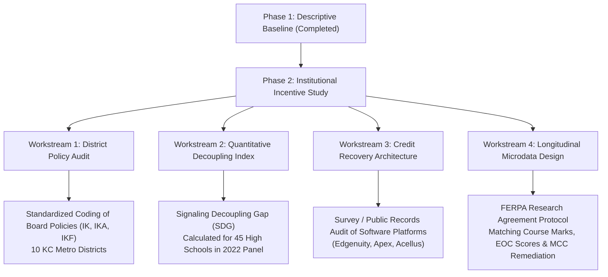

# Kansas City Institutional Incentive Study: Research Design & Policy Framework

## 1. Executive Summary

This research design initiates **Phase 2** of the *What Does an 'A' Mean?* inquiry within the *Computational Sketchbook*. 

In **Phase 1 (Version 1.0)**, we established the empirical descriptive baseline:
1. Nationally, high school grade point averages have risen significantly over the past decade (NAEP HSTS: 3.00 to 3.11; ACT: 3.17 to 3.36) even as external achievement measures (NAEP 12th grade mathematics and ACT composite scores) remained flat or declined.
2. In the 2022 Kansas City metropolitan high school panel ($N=45$), high school 4-year graduation rates average 87.2% (median 92.3%) and are virtually uncorrelated with school-level mathematics performance on Missouri End-of-Course (EOC) assessments ($r = 0.053$).
3. In North Carolina's benchmark student-level data (Gershenson, 2018; Tyner & Gershenson, 2020), teacher course grades decouple substantially from standardized exam proficiency: 36% of students receiving a 'B' and 71% of students receiving a 'C' fail to attain proficiency on the state Algebra I EOC, despite state regulations requiring the EOC to count for at least 20% of the final course grade.

**Phase 2** investigates *why* this decoupling occurs at the institutional level in the Kansas City metropolitan area. Rather than treating grade inflation or graduation decoupling as purely individual teacher leniency, Phase 2 models these phenomena as the rational organizational response of school districts, building administrators, and instructional staff to conflicting accountability incentives under Missouri's MSIP 6 framework.

---

## 2. Theoretical Foundations

### 2.1 Campbell's Law and Goodhart's Law
The institutional study is grounded in two fundamental social science principles:
- **Goodhart's Law (1975)**: *"When a measure becomes a target, it ceases to be a good measure."*
- **Campbell's Law (1979)**: *"The more any quantitative social indicator is used for social decision-making, the more subject it will be to corruption pressures and the more apt it will be to distort and corrupt the social processes it is intended to monitor."*

In public education accountability, the graduation rate is an exceptionally high-stakes social indicator. It determines district accreditation status, school Annual Performance Report (APR) scores, administrative performance reviews, community real estate valuations, and regional prestige.

### 2.2 Principal-Agent Asymmetry in State Accountability
Under Missouri's School Improvement Program (MSIP 6):
1. **The Principal (DESE / State Board of Education)** seeks to ensure that high school graduates possess verified academic proficiency, foundational career readiness, and functional mathematical literacy.
2. **The Agent (Local Educational Agencies & High School Principals)** must satisfy state accountability criteria to maintain accreditation and public standing.
3. **The Margin of Optimization**: While standardized test scores (MAP / EOC) are externally administered, centrally scored, and psychometrically standardized, **course grades and graduation credits are determined entirely within the school building**. 
4. Because earning 24 course credits guarantees graduation—and graduation directly drives substantial APR points—school systems rationally optimize on the margin they control: course passage, credit accrual, and graduation rate maximization.

---

## 3. Institutional Context: The Missouri Accountability Architecture

### 3.1 MSIP 6 APR Scoring Weight
Missouri's MSIP 6 evaluates public school districts and high schools across two broad domains:
- **Performance (70% of APR points)**: Composed of Academic Achievement (Status and Growth in ELA, Math, and Science) and Graduation Rate / College and Career Readiness (CCR).
- **Continuous Improvement (30% of APR points)**: Evaluates school improvement plans, attendance, climate, and audit metrics.

For high schools, graduation rates are evaluated via:
- 4-Year Adjusted Cohort Graduation Rate (ACGR).
- 5-Year Cohort Graduation Rate (providing extended-time credit for alternative or credit-recovery students).
- CCR Graduation Metrics (Advanced Placement, Dual Credit, Industry-Recognized Credentials).

Under this formula, a school whose students struggle academically (e.g., Math Status MPI < 320, well below the proficient baseline of 350) can offset substantial academic point losses if its graduation rate reaches 90% or higher.

### 3.2 The Missouri Statutory Asymmetry
A critical institutional feature separates Missouri from states like North Carolina:
- **North Carolina Policy**: Mandated that the state End-of-Course (EOC) examination count for **at least 20% of the student's final course grade** (Gershenson, 2018).
- **Missouri Policy**: Under Section 160.518 RSMo and 5 CSR 20-200.210, DESE requires districts to administer statewide EOC assessments in Algebra I, English II, Biology, and Government. However, **Missouri state law does NOT mandate a minimum passing score on the EOC for high school graduation**, nor does it mandate that EOC scores count for a fixed percentage of a student's course grade.
- **Local Board Autonomy**: Missouri grants local boards of education (under Section 167.031 and Section 171.011 RSMo) sole statutory authority over grading systems, course passing marks, and the awarding of local graduation credits.

This regulatory asymmetry creates a structural decoupling channel: **a student who earns a score of "Below Basic" on the Missouri Algebra I EOC can still receive a 'B' or 'C' in Algebra I based on local course assignments, earning full credit toward the 24 credits required for graduation.**

---

## 4. Institutional Mechanisms to Investigate

Phase 2 investigates four specific institutional mechanisms operating across Kansas City metropolitan school districts:

### Mechanism 1: Minimum Grading Floors ("No Zero" and 50% F Policies)
- **Mechanism**: Replacing the traditional 0–100 percentage scale (where failing encompasses 0–59%) with a 50% floor (or 40% floor), where missing work or failing performances cannot be recorded below the floor.
- **Mathematical Implication**: Compresses the failure interval from 60 percentage points to 10 percentage points (50% to 59%). A student who completes no work for several weeks can mathematically recover a passing grade ('D' = 60%) with a single average assignment score.
- **Local Precedent**: In 2023–2024, Kansas City Public Schools (KCPS) formally implemented a 40% minimum grade policy on assignments to mitigate "demoralizing" failure cliffs, before revising the practice following instructional staff pushback.

### Mechanism 2: Digital Credit Recovery Proliferation
- **Mechanism**: Widespread deployment of asynchronous, modular third-party software platforms (e.g., Edgenuity / Imagine Learning, Apex Learning, Acellus, Edmentum).
- **Incentive Structure**: Students who fail a semester course during regular seat-time are assigned to computer labs or asynchronous modules. Features such as pre-test unit exemption, multiple quiz attempts, and low mastery thresholds (often 60%) allow credits to be recovered in a fraction of standard instructional hours.
- **Transcript Invariance**: In many LEAs, credits earned through online recovery appear on transcripts identically to credits earned through rigorous, year-long classroom instruction.

### Mechanism 3: Standards-Based Learning (SBL) Conversion & Formative Decoupling
- **Mechanism**: Transition from traditional percentage grading to Standards-Based Learning (SBL) rubrics (e.g., 4-level proficiency scales: Proficient, Nearing Proficient, Developing, Not Yet), accompanied by policies prohibiting homework or behavioral compliance from lowering grades, and mandating universal retake opportunities.
- **Incentive Structure**: While pedagogically designed to reflect pure mastery, in practice, without strict standardization of retake conditions, SBL can lead to grade inflation if retake opportunities are unlimited and minimum competency thresholds are soft.
- **Local Precedent**: North Kansas City Schools (NKC 74) transitioned secondary grades to Standards-Based Learning with explicit retake provisions.

### Mechanism 4: Administrative Pass-Rate Accountability Pressures
- **Mechanism**: Building administrators face explicit or implicit pass-rate expectations tied to building APR targets. 
- **Operational Channel**: Teachers whose course failure rates exceed district- or building-level thresholds (e.g., >10% or >15%) are subjected to administrative intervention, mandatory paperwork justifying failing marks, or parent conferences. To avoid scrutiny, instructional staff adjust grading standards downward.

---

## 5. Research Questions (Phase 2)

- **RQ1 (Policy Variation)**: How do formal board policies, secondary grading handbooks, and credit recovery guidelines vary across the 10 major LEAs in the Greater Kansas City metropolitan area?
- **RQ2 (The Signaling Decoupling Gap)**: Across the 45 high schools in the Kansas City panel, how does the empirical gap between graduation rate rank and mathematics EOC proficiency rank correlate with school socioeconomic status (Direct Certification / FRPL) and district policy posture?
- **RQ3 (Credit Recovery Deployment)**: What software platforms, seat-time requirements, and mastery cutoffs govern credit recovery across KC metro high schools, and what proportion of graduating seniors utilize credit recovery for core math credits?
- **RQ4 (Long-Term Longitudinal Consequences)**: How does high school credit acquisition in the presence of low EOC proficiency translate into postsecondary remedial placement at regional institutions (e.g., Metropolitan Community College, UMKC)?

---

## 6. Mixed-Methods Analytical Roadmap

---

## 7. Deliverables in Phase 2

1. **Policy Audit Protocol**: Standardized coding rubric (`docs/district_policy_audit_protocol.md`).
2. **Policy Registry**: Auditable database indexing district policies and handbooks (`sources/kc_district_policy_registry.csv`).
3. **Quantitative Decoupling Engine**: Script calculating school-level Signaling Decoupling Gap (`src/analyze_institutional_incentives.py`).
4. **Research Brief & Artifact**: Comprehensive essay synthesizing institutional incentives (`artifacts/kc_institutional_incentive_analysis.md`).
5. **Automated Test Suite**: Regression and integrity tests (`tests/test_institutional_incentives.py`).
