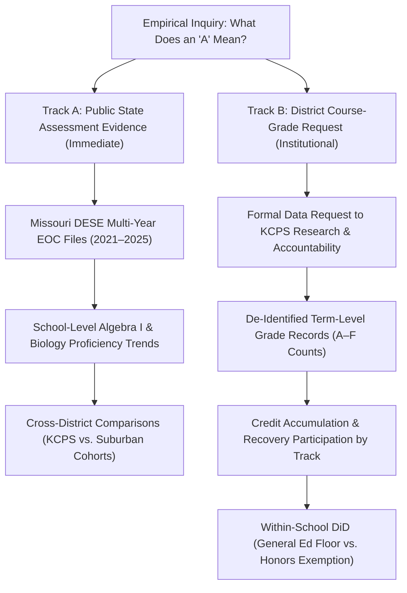

# Longitudinal Course Outcomes Research Protocol & Data Request Specification
**Kansas City Public Schools (KCPS) Secondary Grading Case Study**
*Computational Sketchbook Research Series (`2026-10-08-what-does-an-a-mean`)*

---

## 1. Research Governance: Empirical Observational Data vs. Simulation Safeguards

> [!IMPORTANT]
> **Non-Negotiable Research Integrity Rule**:
> When empirical data are not in hand, we document the data gap. We never manufacture observations to complete an empirical analysis or claim factual discoveries from simulated parameters.

This document establishes the methodological protocol, data request specifications, and pre-analysis econometric plan for evaluating secondary grading policy transitions in Kansas City Public Schools (KCPS).

### Current Empirical Status of the Project
1. **Empirical & Verified**:
   - Missouri DESE MSIP 6 Building-Level APR cross-sectional benchmark (2022) across 45 Kansas City metropolitan high schools ($r = 0.682$, $\rho = 0.667$).
   - Primary institutional policy documents and board minutes establishing adoption dates:
     - KCPS August 2024 Secondary Grading Policy Manual (10% Engagement, 40% Progress, 50% Proficiency; 0% missing-work rule; 40% attempted floor; Honors/AP/IB/MYP course-level exemption).
     - North Kansas City Schools January 2024 SBL FAQ (Fall 2025 pilot restricted to designated grades/courses at North Kansas City High).
   - Auditable 33-record school-course-year policy exposure evidence register ([`kc_policy_exposure_evidence_register.csv`](../sources/kc_policy_exposure_evidence_register.csv)) with direct URLs and section citations.
2. **Current Data Gap (Unobtained Observational Records)**:
   - Term-level student letter grades (A–F distributions).
   - School- and course-specific failure rates (% F).
   - Credits attempted versus credits earned by curricular track.
   - Student-level linkages between classroom grades and state End-of-Course (EOC) scale scores.
3. **Role of Synthetic Data in This Project**:
   - The file [`data/synthetic/kcps_simulated_course_outcomes.csv`](../data/synthetic/kcps_simulated_course_outcomes.csv) and [`table6_simulated_kcps_policy_scenario.csv`](../artifacts/tables/table6_simulated_kcps_policy_scenario.csv) are **strictly synthetic demonstrations** produced by [`src/simulate_longitudinal_course_outcomes.py`](../src/simulate_longitudinal_course_outcomes.py).
   - They serve exclusively to validate that the Difference-in-Differences (DiD) pipeline executes, check dynamic evidence lookups, and conduct statistical power calculations.
   - **They do not represent observed KCPS student outcomes and must never be cited as empirical evidence.**

---

## 2. The Two-Track Research Strategy for Real Evidence

To answer whether secondary grading reforms alter actual learning, credential signals, or both, the project proceeds along two distinct empirical tracks:

### Track A — Immediately Accessible Public State Evidence
Using Missouri Department of Elementary and Secondary Education (DESE) public data applications:
- **Scope**: School-level End-of-Course (EOC) assessment results from 2021 through 2025 across all KCPS secondary campuses and regional comparison schools.
- **Key Metrics**: Mathematics Performance Index (MPI), percentage Proficient and Advanced, percentage Below Basic, and student participation rates.
- **Analytical Utility**: Establishes whether independent, state-tested mathematics and science achievement exhibited shifts coincident with the 2023–24 grading floor introduction or the 2024–25 revision.
- **Boundary**: State EOC files do not report classroom grades or course failure rates. They provide the external benchmark, not the internal grading margin.

### Track B — Institutional District Course-Grade Request (Formal Specification)
We formally specify the data request for submission to the KCPS Department of Research, Assessment, and Accountability:

#### Requested Unit of Observation
Aggregated term-level section summary (FERPA compliant, de-identified, no student PII):
- **Years**: 2021–22, 2022–23 (Pre-reform baseline), 2023–24 (Initial floor), 2024–25 (Revised manual).
- **Schools**: Central, East, Lincoln College Prep, Northeast, Southeast, Paseo.
- **Terms**: Fall (Semester 1), Spring (Semester 2).
- **Target Courses**:
  - Algebra I, Geometry, Algebra II
  - English I, English II
  - Biology, Chemistry
- **Variables Requested**:
  1. `course_track`: General Education, Honors, Pre-AP, AP, IB, MYP.
  2. `total_students_enrolled`: Course enrollment at census and term completion.
  3. `letter_grade_counts`: Absolute counts of A, B, C, D, F, Incomplete (with small-cell suppression $N < 10$).
  4. `credits_attempted`: Total semester credits attempted.
  5. `credits_earned`: Total semester credits awarded toward graduation.
  6. `credit_recovery_count`: Number of students enrolled in digital credit recovery modules (e.g. Edgenuity) for that course deficiency.
  7. `matched_eoc_proficient_count`: Count of enrolled students scoring Proficient/Advanced on the corresponding state EOC (Algebra I and Biology).

---

## 3. Econometric Pre-Analysis Plan (When Real Records Are Obtained)

### A. Within-School Difference-in-Differences (DiD) Specification
The August 2024 KCPS secondary manual exempts Honors, AP, IB, and MYP courses from the 40% attempted floor (retaining the traditional 0–59% failing range), while subjecting General Education courses to the floor.

When empirical course-level records are obtained, the econometric model will estimate:
$$Y_{cst} = \alpha_s + \lambda_t + \delta_c + \beta_1 (\text{GeneralTrack}_c \times \text{PostFloor}_{2023}) + \beta_2 (\text{GeneralTrack}_c \times \text{PostRevision}_{2024}) + \varepsilon_{cst}$$
Where:
- $Y_{cst}$ is the observed failure rate (% F) or credit completion rate for course section $c$ in school $s$ in term $t$.
- $\alpha_s$ are school fixed effects (controlling for time-invariant campus sorting, e.g. Lincoln's magnet selectivity).
- $\lambda_t$ are semester-year fixed effects (controlling for districtwide or macroeconomic shocks).
- $\delta_c$ are subject-matter fixed effects (Algebra I vs English I vs Biology).
- $\beta_1$ estimates the causal effect of introducing the 40% floor in 2023–24.
- $\beta_2$ estimates the effect of restoring missing-work zeroes and formalizing the track exemption in 2024–25.

### B. The Empirical Decoupling Test
To determine whether changes in course pass rates represent genuine learning versus measurement distortion, we will estimate the joint covariance:
$$\operatorname{Cov}(\Delta \text{CoursePassRate}_{st}, \Delta \text{EOCProficiencyRate}_{st})$$
- **H0 (Learning Hypothesis)**: Grading floors sustain student motivation, prevent fatalistic disengagement, and lead to increased effort; course pass rates and EOC proficiency increase in tandem ($\operatorname{Cov} > 0$).
- **H1 (Decoupling / Campbell's Law Hypothesis)**: Grading floors mechanically reduce recorded failure by truncating the bottom of the scale; course pass rates surge while EOC proficiency remains flat or deteriorates ($\operatorname{Cov} \approx 0$ or negative correlation).

---

## 4. Pipeline Verification via Synthetic Power Simulation

The companion script [`src/simulate_longitudinal_course_outcomes.py`](../src/simulate_longitudinal_course_outcomes.py) simulates this exact econometric architecture to confirm:
1. Dynamic policy assignment functions handle complex course-track and wildcard lookups without runtime exceptions.
2. The DiD model specification achieves statistical power to detect a minimum effect size of 5 percentage points in failure rates given KCPS secondary enrollment totals ($N \approx 3,000$ high school students per cohort).
3. All synthetic output tables and visualizations are explicitly segregated in `data/synthetic/` and watermarked with prominent simulation disclaimers.
