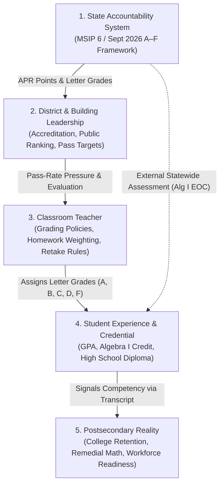

# Research Design: What Does an "A" Actually Mean?
## Grades, Learning, and the Institutional Incentives Behind Both

**Project Slug**: `2026-10-08-what-does-an-a-mean`  
**Domain**: Education Policy / Psychometrics / Institutional Economics / Secondary Mathematics  
**Focal Geography**: Kansas City Metropolitan Area & Missouri Statewide  
**Date**: October 8, 2026  

---

## 1. Central Inquiry & Framing

Modern public education operates under an institutional contradiction:
> **We desire schools to maximize student learning, but we evaluate and reward their performance using proxy measures—course grades, graduation rates, and standardized test scores—that can be systematically improved without necessarily increasing authentic learning.**

This investigation does not assume that grades or standardized tests are useless or corrupt. Rather, it investigates what happens when imperfect measures of learning become high-stakes targets for students, teachers, building administrators, and state accountability systems.

### Central Research Question
> **When schools are rewarded for better grades and test scores, how much of the resulting improvement represents actual learning, and how much reflects changes in behavior around the measures themselves?**

### The Crucial Conceptual Distinction
- **Measurement Imperfection**: A standardized test or course grade may capture only a subset of relevant academic and non-cognitive capabilities. This is an epistemic measurement constraint.
- **Incentive Distortion**: When an accountability system attaches funding, accreditation, administrative job security, or public letter grades to a measure, actors alter their behavior to satisfy the target (Campbell's Law, Goodhart's Law).

A test can be an imperfect measure of learning without creating perverse incentives if nothing high-stakes depends on it. Conversely, an accountability system can severely distort instructional practice even if its underlying assessment instrument has acceptable psychometric reliability.

---

## 2. Theoretical Framework

### Core Literature Pillars
1. **Campbell's Law (1979)**: The more any quantitative social indicator is used for social decision-making, the more subject it will be to corruption pressures and the more apt it will be to distort and corrupt the social processes it is intended to monitor.
2. **Goodhart's Law (1975)**: When a measure becomes a target, it ceases to be a good measure.
3. **Multitask Principal-Agent Problem (Holmström & Milgrom, 1991)**: When an agent performs multidimensional tasks (fostering deep conceptual understanding, critical thinking, behavioral habits) but the principal can only measure easily verifiable outputs (test pass rates, credit completion), the agent rationally reallocates effort toward the measured margins.
4. **Authentic Learning vs. Strategic Distortion (Dee & Jacob, 2011 vs. Jacob, 2005)**:
   - *Jacob (2005)* documented strategic score inflation in Chicago under high-stakes testing (test prep, placement shifts, cheating).
   - *Dee & Jacob (2011)* proved that No Child Left Behind (NCLB) produced statistically significant, authentic gains in 4th and 8th grade mathematics on low-stakes NAEP assessments, demonstrating that accountability pressure can induce real instructional effort.
   - *McElroy (2023)* showed that high school accountability elevated graduation rates without producing proportional college degree attainment, indicating credential inflation at the secondary exit boundary.
5. **The Grade vs. Test Information Tension (Allensworth & Clark, 2020)**:
   - High school GPA is substantially more predictive of 4-year college completion than ACT scores across >55,000 Chicago Public Schools graduates.
   - Grades capture multi-month non-cognitive persistence, regular attendance, task completion, and behavioral self-regulation that standardized tests fail to capture.
   - Therefore, a rising GPA is not simply "fraud"; it reflects a complex composite signal of academic mastery and behavioral conformity.

---

## 3. Why Secondary Algebra I?

Algebra I is the single most revealing focal course in secondary education because:
1. **The Gateway Status**: Algebra I is universally recognized as the foundational gateway to advanced mathematics, STEM coursework, high school graduation, and college eligibility.
2. **Dual Independent Observation**: In Missouri, Algebra I generates two parallel, contemporaneous observations for the same student:
   - A **teacher-assigned course letter grade** (reflecting classroom homework, participation, tests, retakes, and attendance over two semesters).
   - An **external statewide End-of-Course (EOC) assessment** (standardized across all public school students, scored independently by DESE).
3. **The Missouri Mandate Structure**: Missouri requires all high school students to *participate* in the Algebra I EOC (or Algebra II for middle-school completers) for federal and state accountability under MSIP 6. Critically, Missouri does *not* require students to achieve a proficient score to graduate; high school graduation requires course credit, not state test proficiency.
4. **The Empirical Gap**: What does passing Algebra I actually tell us about mathematical understanding? When and why do course grades and EOC proficiency diverge across different school contexts?

---

## 4. Key Hypotheses

- **H1 (National Transcript Divergence)**: Between 2009 and 2019, national high school transcripts reflect rising course grades and GPAs, while external standardized assessments (NAEP 12th grade mathematics and ACT STEM scores) stagnated or declined—with the sharpest divergence occurring among graduates completing rigorous curricula.
- **H2 (Metropolitan Credential Compression)**: Across Kansas City metropolitan high schools, graduation rates exhibit extreme compression near the upper ceiling (85%–98%) driven by institutional graduation incentives, while measured mathematics achievement (Algebra I MAP Performance Index) spans a wide socioeconomic gradient (MPI 280 to 430).
- **H3 (Context-Dependent Signaling of Passing Grades)**: The meaning of a passing grade in secondary mathematics varies systematically with institutional context. In high-poverty secondary schools subject to intense failure-rate scrutiny, course credit is frequently granted based on attendance, effort, and credit recovery, resulting in a large population of course-passing students who score Below Basic or Basic on external assessments.

---

## 5. Analytical Execution

This project implements three primary empirical graphs:
1. **Graph 1: National Trends Aligned Panel**: NAEP High School Transcript Study GPAs (2009–2019) and ACT GPAs (2010–2021) plotted alongside NAEP 12th Grade Mathematics scores and ACT composite scores, stratified by curriculum rigor.
2. **Graph 2: Kansas City High School Accountability Scatter**: 4-Year Graduation Rate vs. Mathematics MAP Performance Index (MPI) across Kansas City area high schools, mapped by Free/Reduced Price Lunch percentage and building enrollment.
3. **Graph 3: The Algebra I Signaling Gap**: Modeled cross-school distribution of demonstrated EOC mathematics proficiency conditional on course grade tier (A, B, C, D) across high-poverty urban versus low-poverty suburban secondary schools.
